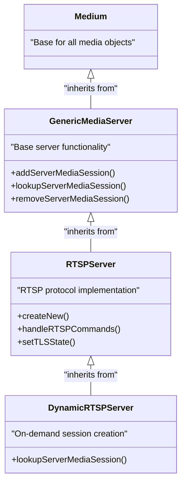
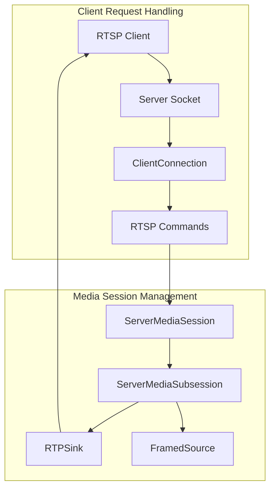
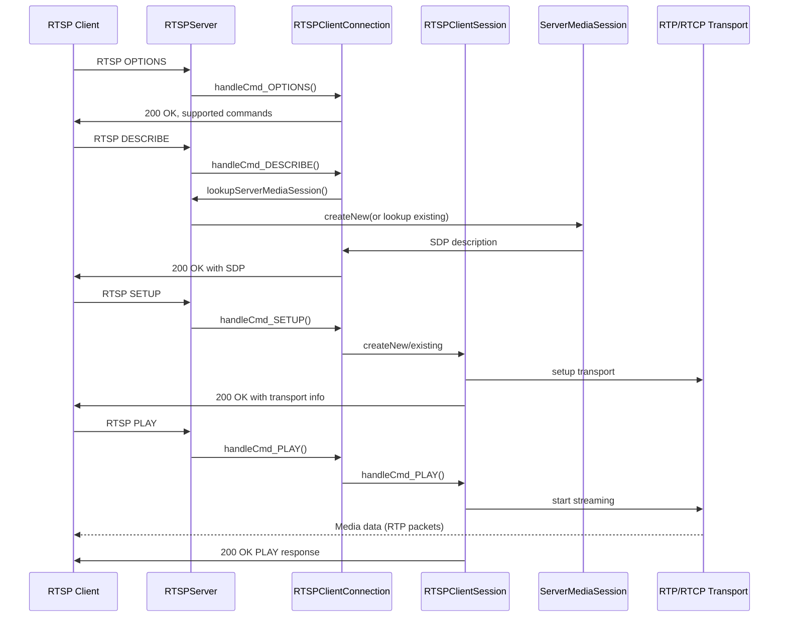
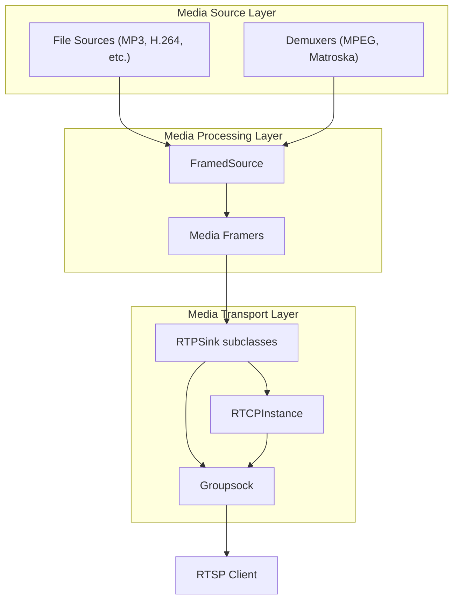
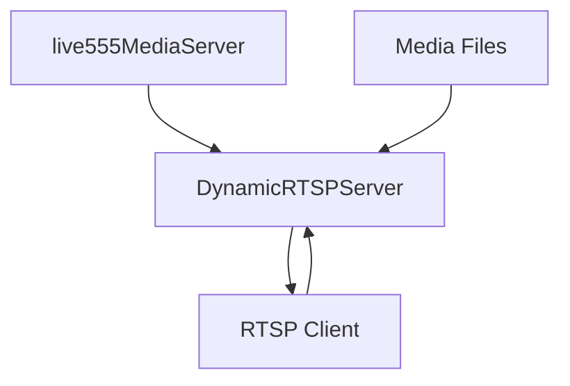

# RTSP Media Server

> **Relevant source files**
> * [liveMedia/GenericMediaServer.cpp](https://github.com/rgaufman/live555/blob/a0eb8f91/liveMedia/GenericMediaServer.cpp)
> * [liveMedia/RTSPClient.cpp](https://github.com/rgaufman/live555/blob/a0eb8f91/liveMedia/RTSPClient.cpp)
> * [liveMedia/RTSPServer.cpp](https://github.com/rgaufman/live555/blob/a0eb8f91/liveMedia/RTSPServer.cpp)
> * [liveMedia/include/GenericMediaServer.hh](https://github.com/rgaufman/live555/blob/a0eb8f91/liveMedia/include/GenericMediaServer.hh)
> * [liveMedia/include/RTSPServer.hh](https://github.com/rgaufman/live555/blob/a0eb8f91/liveMedia/include/RTSPServer.hh)
> * [mediaServer/DynamicRTSPServer.cpp](https://github.com/rgaufman/live555/blob/a0eb8f91/mediaServer/DynamicRTSPServer.cpp)
> * [mediaServer/version.hh](https://github.com/rgaufman/live555/blob/a0eb8f91/mediaServer/version.hh)

The RTSP Media Server is a core component of the Live555 streaming media library that implements a full-featured RTSP (Real Time Streaming Protocol) server for serving media files to clients. It supports streaming of various media formats over IP networks using standard protocols, with RTSP for session control and RTP/RTCP for media transport.

This document focuses specifically on the RTSP Media Server architecture and implementation. For information about the RTSP Proxy Server, which offers different functionality, see [RTSP Proxy Server](/rgaufman/live555/2-rtsp-proxy-server).

## Architecture Overview

The RTSP Media Server follows a hierarchical class design with each layer adding specific functionality:



Sources: [liveMedia/include/GenericMediaServer.hh L44-L196](https://github.com/rgaufman/live555/blob/a0eb8f91/liveMedia/include/GenericMediaServer.hh#L44-L196)

 [liveMedia/include/RTSPServer.hh L31-L346](https://github.com/rgaufman/live555/blob/a0eb8f91/liveMedia/include/RTSPServer.hh#L31-L346)

 [mediaServer/DynamicRTSPServer.cpp L25-L247](https://github.com/rgaufman/live555/blob/a0eb8f91/mediaServer/DynamicRTSPServer.cpp#L25-L247)

## Main Components

### Server Class Hierarchy

1. **GenericMediaServer**: Provides the core functionality for handling client connections, managing media sessions, and socket management. It is media protocol agnostic.
2. **RTSPServer**: Extends GenericMediaServer to implement the RTSP protocol, handling commands like DESCRIBE, SETUP, PLAY, PAUSE, etc.
3. **DynamicRTSPServer**: Further extends RTSPServer to create ServerMediaSession objects on-demand based on requested file paths, automatically detecting media formats based on file extensions.



Sources: [liveMedia/GenericMediaServer.cpp L29-L139](https://github.com/rgaufman/live555/blob/a0eb8f91/liveMedia/GenericMediaServer.cpp#L29-L139)

 [liveMedia/RTSPServer.cpp L29-L38](https://github.com/rgaufman/live555/blob/a0eb8f91/liveMedia/RTSPServer.cpp#L29-L38)

### Client Management

The server manages client interactions using two key classes:

1. **ClientConnection**: Represents a TCP connection with a client. Handles incoming requests, parses RTSP commands, and sends responses.
2. **ClientSession**: Represents an active streaming session for a client. Maintains state information and handles session-specific RTSP commands.

Sources: [liveMedia/include/GenericMediaServer.hh L103-L133](https://github.com/rgaufman/live555/blob/a0eb8f91/liveMedia/include/GenericMediaServer.hh#L103-L133)

 [liveMedia/include/RTSPServer.hh L156-L305](https://github.com/rgaufman/live555/blob/a0eb8f91/liveMedia/include/RTSPServer.hh#L156-L305)

## Media Session Creation

Media content in the RTSP server is represented by `ServerMediaSession` objects, which can be:

1. **Predefined**: Added manually using `addServerMediaSession()`
2. **On-demand**: Created automatically by `DynamicRTSPServer` based on file requests

### DynamicRTSPServer Media Format Detection

The `DynamicRTSPServer` automatically detects media formats based on file extensions and creates appropriate `ServerMediaSubsession` objects:

| File Extension | Media Type | Subsession Class |
| --- | --- | --- |
| .264 | H.264 Video | H264VideoFileServerMediaSubsession |
| .265 | H.265 Video | H265VideoFileServerMediaSubsession |
| .mp3 | MPEG Audio | MP3AudioFileServerMediaSubsession |
| .aac | AAC Audio | ADTSAudioFileServerMediaSubsession |
| .mpg | MPEG-1/2 Program Stream | MPEG1or2FileServerDemux |
| .mkv, .webm | Matroska | MatroskaFileServerDemux |
| .ogg, .ogv | Ogg | OggFileServerDemux |
| .wav | WAV Audio | WAVAudioFileServerMediaSubsession |

Sources: [mediaServer/DynamicRTSPServer.cpp L46-L247](https://github.com/rgaufman/live555/blob/a0eb8f91/mediaServer/DynamicRTSPServer.cpp#L46-L247)

## RTSP Request Processing Flow



Sources: [liveMedia/RTSPServer.cpp L361-L404](https://github.com/rgaufman/live555/blob/a0eb8f91/liveMedia/RTSPServer.cpp#L361-L404)

 [liveMedia/RTSPServer.cpp L463-L461](https://github.com/rgaufman/live555/blob/a0eb8f91/liveMedia/RTSPServer.cpp#L463-L461)

## Media Delivery Architecture

The media delivery pipeline in the RTSP Media Server follows this structure:



Sources: [liveMedia/RTSPServer.cpp L260-L280](https://github.com/rgaufman/live555/blob/a0eb8f91/liveMedia/RTSPServer.cpp#L260-L280)

## Configuration Options

The RTSP Media Server supports various configuration options:

### Basic Server Options

```sql
// Create an RTSP server
RTSPServer* server = RTSPServer::createNew(env, 554, authDB, 65);
```

* **Port**: Default is 554 (standard RTSP port)
* **Authentication**: Optional UserAuthenticationDatabase
* **Reclamation Time**: Seconds of inactivity before session cleanup (default: 65)

### Security Options

```
// Enable TLS/SRTP
server->setTLSState(certFileName, privKeyFileName, weServeSRTP, weEncryptSRTP);
```

* **TLS**: Secure RTSP connections with TLS
* **SRTP**: Secure RTP media transport

### HTTP Tunneling

```
// Enable RTSP over HTTP tunneling
server->setUpTunnelingOverHTTP(httpPort);
```

* Allows RTSP to traverse firewalls by tunneling over HTTP

Sources: [liveMedia/include/RTSPServer.hh L33-L110](https://github.com/rgaufman/live555/blob/a0eb8f91/liveMedia/include/RTSPServer.hh#L33-L110)

 [liveMedia/RTSPServer.cpp L116-L137](https://github.com/rgaufman/live555/blob/a0eb8f91/liveMedia/RTSPServer.cpp#L116-L137)

## RTSP Command Handling

The server handles the following RTSP commands:

| Command | Handler Method | Description |
| --- | --- | --- |
| OPTIONS | handleCmd_OPTIONS | Returns supported commands |
| DESCRIBE | handleCmd_DESCRIBE | Provides SDP media description |
| SETUP | handleCmd_SETUP | Establishes transport for media stream |
| PLAY | handleCmd_PLAY | Starts media streaming |
| PAUSE | handleCmd_PAUSE | Pauses media streaming |
| TEARDOWN | handleCmd_TEARDOWN | Ends a session |
| GET_PARAMETER | handleCmd_GET_PARAMETER | Gets session parameters |
| SET_PARAMETER | handleCmd_SET_PARAMETER | Sets session parameters |

Sources: [liveMedia/RTSPServer.cpp L153-L154](https://github.com/rgaufman/live555/blob/a0eb8f91/liveMedia/RTSPServer.cpp#L153-L154)

 [liveMedia/RTSPServer.cpp L361-L896](https://github.com/rgaufman/live555/blob/a0eb8f91/liveMedia/RTSPServer.cpp#L361-L896)

## Live555 Media Server Application

The actual `live555MediaServer` application is a simple implementation that uses the `DynamicRTSPServer` class to serve media files:



The server is currently at version `1.13` as defined in [mediaServer/version.hh L23](https://github.com/rgaufman/live555/blob/a0eb8f91/mediaServer/version.hh#L23-L23)

Sources: [mediaServer/DynamicRTSPServer.cpp L25-L35](https://github.com/rgaufman/live555/blob/a0eb8f91/mediaServer/DynamicRTSPServer.cpp#L25-L35)

## URL Format

The RTSP Media Server generates URLs for accessing media streams:

```yaml
rtsp://server-address:port/path-to-file
```

For example:

```yaml
rtsp://192.168.1.100:554/movie.mp4
```

Sources: [liveMedia/RTSPServer.cpp L57-L107](https://github.com/rgaufman/live555/blob/a0eb8f91/liveMedia/RTSPServer.cpp#L57-L107)

## Summary

The RTSP Media Server component provides a complete implementation of an RTSP server for streaming media files. It supports a wide range of media formats, handles the RTSP protocol, and provides secure streaming options. The modular design allows for flexibility in how media is accessed and served, with the DynamicRTSPServer making it easy to serve files on-demand based on file extensions.