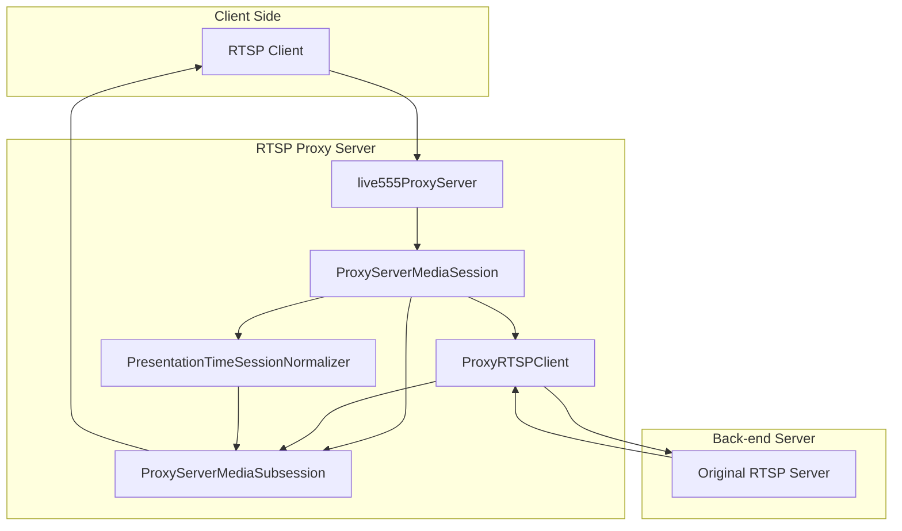
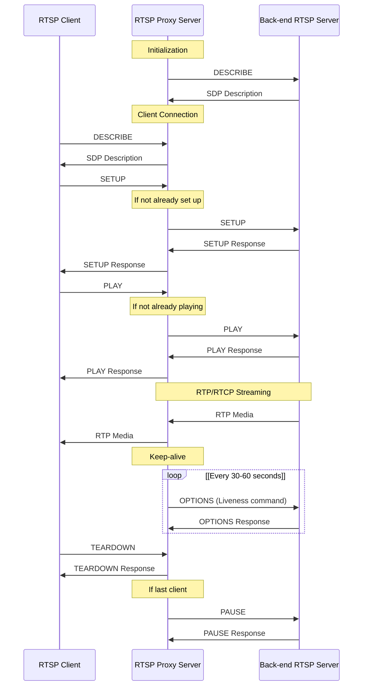
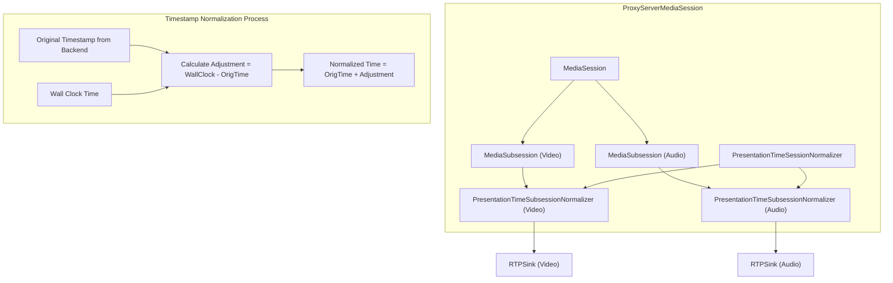

# RTSP Proxy Server

> **Relevant source files**
> * [liveMedia/ProxyServerMediaSession.cpp](https://github.com/rgaufman/live555/blob/a0eb8f91/liveMedia/ProxyServerMediaSession.cpp)
> * [liveMedia/include/ProxyServerMediaSession.hh](https://github.com/rgaufman/live555/blob/a0eb8f91/liveMedia/include/ProxyServerMediaSession.hh)
> * [modifications.patch](https://github.com/rgaufman/live555/blob/a0eb8f91/modifications.patch)
> * [proxyServer/live555ProxyServer.cpp](https://github.com/rgaufman/live555/blob/a0eb8f91/proxyServer/live555ProxyServer.cpp)

The RTSP (Real-Time Streaming Protocol) Proxy Server is a key component of the live555 streaming media library that enables relaying of RTSP/RTP streams between clients and back-end streaming servers. It serves as an intermediary, accepting client connections and forwarding their requests to the original streaming source, then relaying the media data back to clients.

This document explains the architecture, functionality, and configuration of the live555 RTSP Proxy Server. For information about the standard media server for serving local files, see [RTSP Media Server](/rgaufman/live555/3-rtsp-media-server).

## Architecture Overview

The RTSP Proxy Server is built on top of the live555 media framework and leverages its RTSP server capabilities while adding proxying functionality. The proxy server acts as both a client (connecting to back-end servers) and a server (accepting connections from end users).



Sources: [proxyServer/live555ProxyServer.cpp L20-L45](https://github.com/rgaufman/live555/blob/a0eb8f91/proxyServer/live555ProxyServer.cpp#L20-L45)

 [liveMedia/ProxyServerMediaSession.cpp L67-L140](https://github.com/rgaufman/live555/blob/a0eb8f91/liveMedia/ProxyServerMediaSession.cpp#L67-L140)

### Core Components

The RTSP Proxy Server comprises several key components that work together:

| Component | Class Name | Purpose |
| --- | --- | --- |
| Proxy Server | `live555ProxyServer` | Main application that sets up the proxy service |
| Media Session | `ProxyServerMediaSession` | Manages the proxying of a specific stream |
| RTSP Client | `ProxyRTSPClient` | Handles communication with back-end servers |
| Media Subsession | `ProxyServerMediaSubsession` | Handles individual media tracks (audio/video) |
| Time Normalizer | `PresentationTimeSessionNormalizer` | Normalizes timestamps between input and output streams |
| Time Subsession Normalizer | `PresentationTimeSubsessionNormalizer` | Normalizes timestamps for individual tracks |

Sources: [liveMedia/include/ProxyServerMediaSession.hh L40-L176](https://github.com/rgaufman/live555/blob/a0eb8f91/liveMedia/include/ProxyServerMediaSession.hh#L40-L176)

 [liveMedia/ProxyServerMediaSession.cpp L32-L64](https://github.com/rgaufman/live555/blob/a0eb8f91/liveMedia/ProxyServerMediaSession.cpp#L32-L64)

## Operation Flow

The RTSP Proxy Server works by handling client requests and forwarding them to back-end servers, then relaying the media data back to clients.



Sources: [liveMedia/ProxyServerMediaSession.cpp L110-L140](https://github.com/rgaufman/live555/blob/a0eb8f91/liveMedia/ProxyServerMediaSession.cpp#L110-L140)

 [liveMedia/ProxyServerMediaSession.cpp L159-L181](https://github.com/rgaufman/live555/blob/a0eb8f91/liveMedia/ProxyServerMediaSession.cpp#L159-L181)

 [liveMedia/ProxyServerMediaSession.cpp L302-L399](https://github.com/rgaufman/live555/blob/a0eb8f91/liveMedia/ProxyServerMediaSession.cpp#L302-L399)

### Stream Setup Process

When the proxy server starts:

1. It creates an `RTSPServer` instance to handle incoming client connections.
2. For each URL specified on the command line, it creates a `ProxyServerMediaSession`.
3. Each `ProxyServerMediaSession` creates a `ProxyRTSPClient` that sends a DESCRIBE request to the back-end server.
4. Upon receiving the SDP response, it creates `ProxyServerMediaSubsession` objects for each track in the stream.
5. When a client connects, the proxy performs SETUP and PLAY with the back-end server if needed.
6. Media data is then relayed from the back-end server to the client through the proxy.

The proxy intelligently handles multiple clients by only setting up the back-end connection once and sharing it among all clients requesting the same stream.

Sources: [proxyServer/live555ProxyServer.cpp L212-L231](https://github.com/rgaufman/live555/blob/a0eb8f91/proxyServer/live555ProxyServer.cpp#L212-L231)

 [liveMedia/ProxyServerMediaSession.cpp L100-L118](https://github.com/rgaufman/live555/blob/a0eb8f91/liveMedia/ProxyServerMediaSession.cpp#L100-L118)

## Timestamp Synchronization

One of the key functions of the RTSP Proxy Server is to normalize presentation timestamps between the back-end server and clients. This is handled by the `PresentationTimeSessionNormalizer` and `PresentationTimeSubsessionNormalizer` classes.



Sources: [liveMedia/ProxyServerMediaSession.cpp L833-L894](https://github.com/rgaufman/live555/blob/a0eb8f91/liveMedia/ProxyServerMediaSession.cpp#L833-L894)

 [liveMedia/ProxyServerMediaSession.cpp L906-L949](https://github.com/rgaufman/live555/blob/a0eb8f91/liveMedia/ProxyServerMediaSession.cpp#L906-L949)

The timestamp normalization process:

1. When media frames arrive from the back-end server, they have presentation timestamps based on the server's timeline.
2. The normalizer adjusts these timestamps to align with the wall-clock time of the proxy server.
3. This ensures that clients receive a consistent timeline, even if they connect at different times.
4. For multi-track streams (e.g., audio and video), the relative timing between tracks is preserved.

## Connection Management

The RTSP Proxy Server implements several mechanisms to maintain robust connections:

### Liveness Monitoring

To prevent the connection to the back-end server from timing out, the proxy sends periodic "liveness" commands:

1. By default, it sends OPTIONS commands every 30-60 seconds (randomized)
2. If the server supports GET_PARAMETER, it can optionally use that instead
3. If the liveness command fails, the proxy considers the back-end connection lost and attempts to reset

Sources: [liveMedia/ProxyServerMediaSession.cpp L402-L439](https://github.com/rgaufman/live555/blob/a0eb8f91/liveMedia/ProxyServerMediaSession.cpp#L402-L439)

 [liveMedia/ProxyServerMediaSession.cpp L315-L340](https://github.com/rgaufman/live555/blob/a0eb8f91/liveMedia/ProxyServerMediaSession.cpp#L315-L340)

### Connection Recovery

If the connection to the back-end server is lost:

1. The proxy server resets its state
2. It attempts to reconnect with exponential backoff (1s, 2s, 4s, 8s, ..., up to 256s)
3. After reaching 256s, it continues trying at random intervals between 256-511 seconds
4. When reconnected, it reestablishes the stream without interrupting existing client connections

Sources: [liveMedia/ProxyServerMediaSession.cpp L441-L480](https://github.com/rgaufman/live555/blob/a0eb8f91/liveMedia/ProxyServerMediaSession.cpp#L441-L480)

## Configuration Options

The RTSP Proxy Server supports various command-line options to customize its behavior:

| Option | Description |
| --- | --- |
| `-v` | Enables verbose output |
| `-V` | Enables more verbose output |
| `-t` | Stream RTP/RTCP over TCP for back-end connection |
| `-T <port>` | Tunnel RTP/RTCP over HTTP on specified port |
| `-p <port>` | Specify RTSP server port (default: 554) |
| `-u <username> <password>` | Set credentials for authenticating with back-end server |
| `-R` | Handle incoming REGISTER requests by proxying |
| `-U <username> <password>` | Set credentials for authenticating REGISTER requests |

Sources: [proxyServer/live555ProxyServer.cpp L46-L56](https://github.com/rgaufman/live555/blob/a0eb8f91/proxyServer/live555ProxyServer.cpp#L46-L56)

 [proxyServer/live555ProxyServer.cpp L73-L161](https://github.com/rgaufman/live555/blob/a0eb8f91/proxyServer/live555ProxyServer.cpp#L73-L161)

### Buffer Size Configuration

The proxy automatically configures a large packet buffer to handle high-resolution video:

```
OutPacketBuffer::maxSize = 2000000; // bytes
```

This significantly larger than the default buffer size to accommodate large video frames that might be sent by back-end servers. The modification is visible in [modifications.patch L125-L126](https://github.com/rgaufman/live555/blob/a0eb8f91/modifications.patch#L125-L126)

Sources: [proxyServer/live555ProxyServer.cpp L58-L61](https://github.com/rgaufman/live555/blob/a0eb8f91/proxyServer/live555ProxyServer.cpp#L58-L61)

## Usage Examples

### Basic Proxying

To proxy a single RTSP stream:

```
./live555ProxyServer rtsp://source-server.example.com/stream1
```

This makes the stream available at:

```yaml
rtsp://proxy-server-ip:554/proxyStream
```

### Multiple Streams

To proxy multiple streams:

```
./live555ProxyServer rtsp://server1.example.com/camera1 rtsp://server2.example.com/camera2
```

These become available as:

```yaml
rtsp://proxy-server-ip:554/proxyStream-1
rtsp://proxy-server-ip:554/proxyStream-2
```

### Authenticated Access

To proxy a stream that requires authentication:

```
./live555ProxyServer -u username password rtsp://server.example.com/protected-stream
```

### TCP Streaming

To force RTP/RTCP to use TCP rather than UDP for the back-end connection:

```
./live555ProxyServer -t rtsp://server.example.com/stream
```

This is useful when the back-end server is behind a firewall that blocks UDP.

Sources: [proxyServer/live555ProxyServer.cpp L212-L231](https://github.com/rgaufman/live555/blob/a0eb8f91/proxyServer/live555ProxyServer.cpp#L212-L231)

## Limitations and Considerations

* Not all codecs can be proxied. The proxy must understand the RTP payload format to relay it correctly.
* Some codecs require specialized framing (H.264, H.265, MP4V-ES, etc.) which the proxy handles automatically.
* Large video frames may require increasing the `OutPacketBuffer::maxSize` parameter.
* By default, UDP is used for media streaming, which may not work through all firewalls. Use TCP tunneling options if needed.

Sources: [liveMedia/ProxyServerMediaSession.cpp L526-L586](https://github.com/rgaufman/live555/blob/a0eb8f91/liveMedia/ProxyServerMediaSession.cpp#L526-L586)

 [liveMedia/ProxyServerMediaSession.cpp L672-L774](https://github.com/rgaufman/live555/blob/a0eb8f91/liveMedia/ProxyServerMediaSession.cpp#L672-L774)