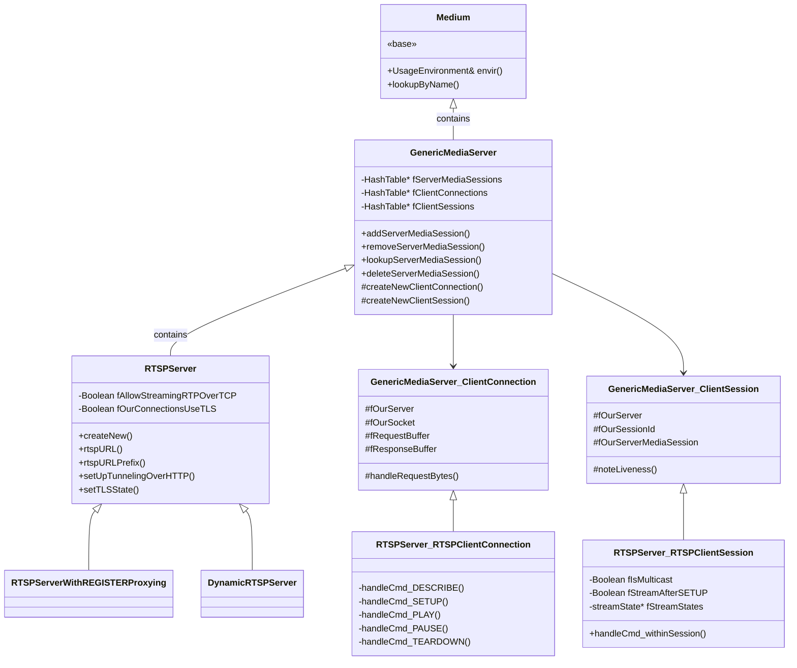
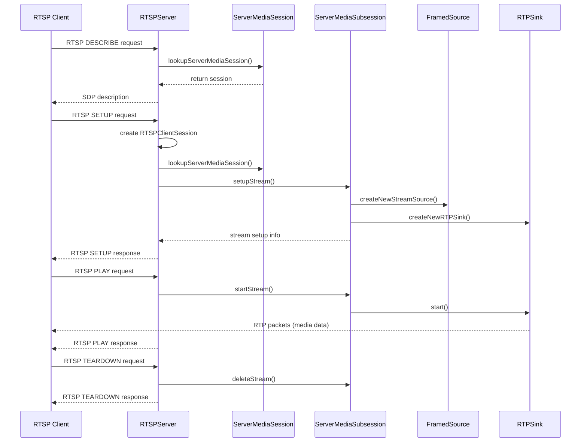
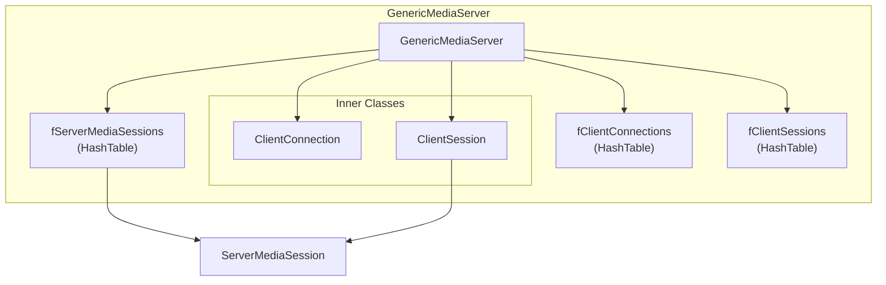
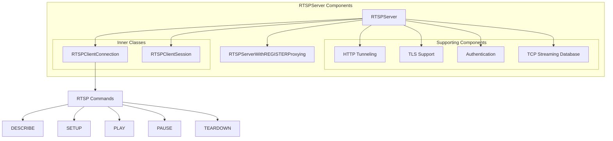
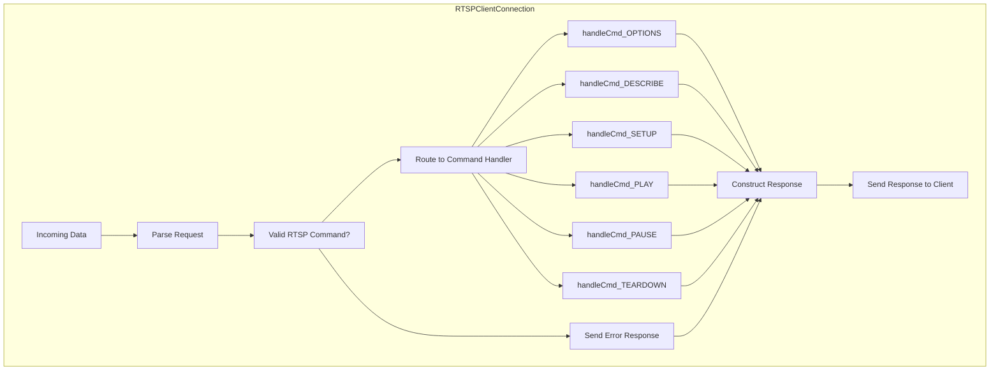
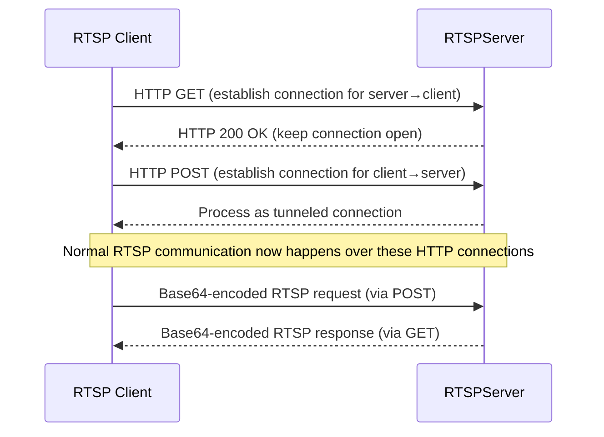
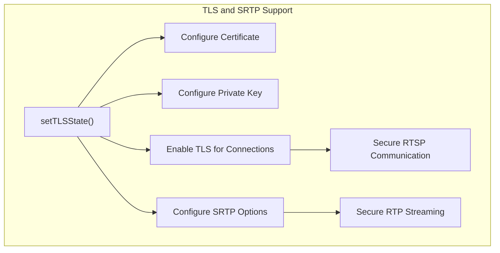
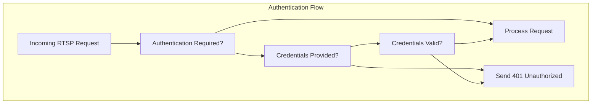

# RTSPServer and GenericMediaServer

> **Relevant source files**
> * [liveMedia/GenericMediaServer.cpp](https://github.com/rgaufman/live555/blob/a0eb8f91/liveMedia/GenericMediaServer.cpp)
> * [liveMedia/RTSPClient.cpp](https://github.com/rgaufman/live555/blob/a0eb8f91/liveMedia/RTSPClient.cpp)
> * [liveMedia/RTSPServer.cpp](https://github.com/rgaufman/live555/blob/a0eb8f91/liveMedia/RTSPServer.cpp)
> * [liveMedia/include/GenericMediaServer.hh](https://github.com/rgaufman/live555/blob/a0eb8f91/liveMedia/include/GenericMediaServer.hh)
> * [liveMedia/include/RTSPServer.hh](https://github.com/rgaufman/live555/blob/a0eb8f91/liveMedia/include/RTSPServer.hh)
> * [mediaServer/version.hh](https://github.com/rgaufman/live555/blob/a0eb8f91/mediaServer/version.hh)

This document describes the architecture and implementation of the `RTSPServer` and `GenericMediaServer` classes in the LIVE555 Streaming Media library. These classes form the core server infrastructure for delivering media streams using the Real-Time Streaming Protocol (RTSP). `GenericMediaServer` provides the base functionality for media server implementations, and `RTSPServer` extends it with RTSP protocol handling capabilities.

For information about the dynamic RTSP server implementation that automatically creates server media sessions on demand, see [DynamicRTSPServer](/rgaufman/live555/3.2-dynamicrtspserver).

## Class Hierarchy and Relationships

The LIVE555 server architecture follows a well-defined inheritance hierarchy to manage server functionality and client interactions.

### Class Architecture Diagram



Sources: [liveMedia/include/GenericMediaServer.hh L44-L196](https://github.com/rgaufman/live555/blob/a0eb8f91/liveMedia/include/GenericMediaServer.hh#L44-L196)

 [liveMedia/include/RTSPServer.hh L31-L146](https://github.com/rgaufman/live555/blob/a0eb8f91/liveMedia/include/RTSPServer.hh#L31-L146)

### Key Components Interaction



Sources: [liveMedia/RTSPServer.cpp L384-L456](https://github.com/rgaufman/live555/blob/a0eb8f91/liveMedia/RTSPServer.cpp#L384-L456)

 [liveMedia/RTSPServer.cpp L858-L891](https://github.com/rgaufman/live555/blob/a0eb8f91/liveMedia/RTSPServer.cpp#L858-L891)

## GenericMediaServer

The `GenericMediaServer` class serves as the base class for all media server implementations in LIVE555. It provides core functionality for managing server media sessions, client connections, and client sessions.

### Architecture and Core Components



Sources: [liveMedia/GenericMediaServer.cpp L120-L148](https://github.com/rgaufman/live555/blob/a0eb8f91/liveMedia/GenericMediaServer.cpp#L120-L148)

 [liveMedia/include/GenericMediaServer.hh L102-L153](https://github.com/rgaufman/live555/blob/a0eb8f91/liveMedia/include/GenericMediaServer.hh#L102-L153)

### Key Responsibilities

The `GenericMediaServer` class handles the following core responsibilities:

1. **Server initialization and socket management** * Establishes and manages listening sockets (IPv4 and IPv6) * Accepts incoming client connections
2. **Media session management** * Maintains a repository of `ServerMediaSession` objects * Provides methods to add, lookup, and remove media sessions
3. **Client connection handling** * Manages client connections through the `ClientConnection` inner class * Processes incoming requests from clients
4. **Client session management** * Manages client sessions through the `ClientSession` inner class * Handles session timeouts and cleanup

#### Key Methods

| Method | Purpose |
| --- | --- |
| `addServerMediaSession()` | Adds a media session to the server |
| `lookupServerMediaSession()` | Finds a media session by name |
| `removeServerMediaSession()` | Removes a media session |
| `deleteServerMediaSession()` | Closes all client sessions for a media session and removes it |
| `createNewClientSessionWithId()` | Creates a new client session with a unique ID |
| `lookupClientSession()` | Finds a client session by ID |
| `incomingConnectionHandlerOnSocket()` | Handles incoming client connections |

Sources: [liveMedia/GenericMediaServer.cpp L30-L118](https://github.com/rgaufman/live555/blob/a0eb8f91/liveMedia/GenericMediaServer.cpp#L30-L118)

 [liveMedia/GenericMediaServer.cpp L230-L251](https://github.com/rgaufman/live555/blob/a0eb8f91/liveMedia/GenericMediaServer.cpp#L230-L251)

### ClientConnection and ClientSession Classes

`GenericMediaServer` defines two inner classes to manage client interactions:

1. **ClientConnection**: Represents a TCP connection from a client * Handles reading of request data from the socket * Manages TLS connections if enabled * Processes request bytes
2. **ClientSession**: Represents a logical session with a client * Associates a client with a server media session * Manages session timeout and liveness checking * Handles session cleanup

Sources: [liveMedia/include/GenericMediaServer.hh L102-L153](https://github.com/rgaufman/live555/blob/a0eb8f91/liveMedia/include/GenericMediaServer.hh#L102-L153)

 [liveMedia/GenericMediaServer.cpp L262-L330](https://github.com/rgaufman/live555/blob/a0eb8f91/liveMedia/GenericMediaServer.cpp#L262-L330)

 [liveMedia/GenericMediaServer.cpp L334-L390](https://github.com/rgaufman/live555/blob/a0eb8f91/liveMedia/GenericMediaServer.cpp#L334-L390)

## RTSPServer

The `RTSPServer` class extends `GenericMediaServer` to implement a server that supports the RTSP protocol. It handles RTSP-specific commands and provides additional features like HTTP tunneling and TLS support.

### Architecture and Components



Sources: [liveMedia/include/RTSPServer.hh L31-L146](https://github.com/rgaufman/live555/blob/a0eb8f91/liveMedia/include/RTSPServer.hh#L31-L146)

 [liveMedia/RTSPServer.cpp L27-L117](https://github.com/rgaufman/live555/blob/a0eb8f91/liveMedia/RTSPServer.cpp#L27-L117)

### RTSP Command Handling

The `RTSPServer` processes the following RTSP commands:

| Command | Handler Method | Purpose |
| --- | --- | --- |
| OPTIONS | `handleCmd_OPTIONS()` | Returns server capabilities |
| DESCRIBE | `handleCmd_DESCRIBE()` | Provides media stream description (SDP) |
| SETUP | `handleCmd_SETUP()` | Establishes a media stream |
| PLAY | `handleCmd_PLAY()` | Starts media streaming |
| PAUSE | `handleCmd_PAUSE()` | Temporarily halts streaming |
| TEARDOWN | `handleCmd_TEARDOWN()` | Terminates a stream and session |
| GET_PARAMETER | `handleCmd_GET_PARAMETER()` | Retrieves parameter values |
| SET_PARAMETER | `handleCmd_SET_PARAMETER()` | Sets parameter values |

The command handling flow is managed through the `RTSPClientConnection` inner class, which parses and routes RTSP requests to the appropriate handlers.

Sources: [liveMedia/RTSPServer.cpp L361-L380](https://github.com/rgaufman/live555/blob/a0eb8f91/liveMedia/RTSPServer.cpp#L361-L380)

 [liveMedia/RTSPServer.cpp L384-L461](https://github.com/rgaufman/live555/blob/a0eb8f91/liveMedia/RTSPServer.cpp#L384-L461)

 [liveMedia/RTSPServer.cpp L701-L911](https://github.com/rgaufman/live555/blob/a0eb8f91/liveMedia/RTSPServer.cpp#L701-L911)

### RTSPClientConnection

The `RTSPClientConnection` class extends `GenericMediaServer::ClientConnection` to handle RTSP-specific communication. It is responsible for:

1. Parsing RTSP request messages
2. Dispatching commands to appropriate handlers
3. Constructing and sending RTSP responses
4. Managing RTSP-over-HTTP tunneling
5. Supporting authentication



Sources: [liveMedia/include/RTSPServer.hh L157-L248](https://github.com/rgaufman/live555/blob/a0eb8f91/liveMedia/include/RTSPServer.hh#L157-L248)

 [liveMedia/RTSPServer.cpp L337-L702](https://github.com/rgaufman/live555/blob/a0eb8f91/liveMedia/RTSPServer.cpp#L337-L702)

### RTSPClientSession

The `RTSPClientSession` class extends `GenericMediaServer::ClientSession` to manage RTSP-specific session state. It represents an ongoing streaming session and is responsible for:

1. Managing SETUP/PLAY/PAUSE/TEARDOWN state for a session
2. Tracking media subsessions being streamed
3. Managing RTP/RTCP streaming state
4. Handling session timeouts

Each `RTSPClientSession` maintains an array of `streamState` structures, each representing a media stream (audio, video, etc.) that has been set up.

Sources: [liveMedia/include/RTSPServer.hh L251-L305](https://github.com/rgaufman/live555/blob/a0eb8f91/liveMedia/include/RTSPServer.hh#L251-L305)

 [liveMedia/RTSPServer.cpp L6370-L6817](https://github.com/rgaufman/live555/blob/a0eb8f91/liveMedia/RTSPServer.cpp#L6370-L6817)

## Advanced Features

### HTTP Tunneling

RTSPServer supports tunneling RTSP over HTTP, which is useful for traversing firewalls that block RTSP traffic but allow HTTP:



The HTTP tunneling is set up using `setUpTunnelingOverHTTP()` which establishes a separate HTTP server port to listen for tunneling requests.

Sources: [liveMedia/RTSPServer.cpp L116-L137](https://github.com/rgaufman/live555/blob/a0eb8f91/liveMedia/RTSPServer.cpp#L116-L137)

 [liveMedia/RTSPServer.cpp L577-L664](https://github.com/rgaufman/live555/blob/a0eb8f91/liveMedia/RTSPServer.cpp#L577-L664)

### TLS Support

RTSPServer provides TLS (Transport Layer Security) support for secure RTSP connections and optionally SRTP (Secure RTP):



TLS support is configured using the `setTLSState()` method, which sets up the certificates and security options.

Sources: [liveMedia/RTSPServer.cpp L139-L150](https://github.com/rgaufman/live555/blob/a0eb8f91/liveMedia/RTSPServer.cpp#L139-L150)

 [liveMedia/include/RTSPServer.hh L112-L114](https://github.com/rgaufman/live555/blob/a0eb8f91/liveMedia/include/RTSPServer.hh#L112-L114)

### Authentication

RTSPServer supports user authentication through the `UserAuthenticationDatabase` class:



Authentication can be configured using the `setAuthenticationDatabase()` method, and supports both basic and digest authentication methods.

Sources: [liveMedia/include/GenericMediaServer.hh L200-L222](https://github.com/rgaufman/live555/blob/a0eb8f91/liveMedia/include/GenericMediaServer.hh#L200-L222)

 [liveMedia/GenericMediaServer.cpp L452-L484](https://github.com/rgaufman/live555/blob/a0eb8f91/liveMedia/GenericMediaServer.cpp#L452-L484)

 [liveMedia/RTSPServer.cpp L109-L114](https://github.com/rgaufman/live555/blob/a0eb8f91/liveMedia/RTSPServer.cpp#L109-L114)

## Usage Examples

### Creating a Basic RTSP Server

To create a basic RTSP server, you typically:

1. Create a `UsageEnvironment`
2. Create an `RTSPServer` instance
3. Create and add `ServerMediaSession` objects
4. Start the event loop

Here's a simplified example:

```sql
// Create environment
TaskScheduler* scheduler = BasicTaskScheduler::createNew();
UsageEnvironment* env = BasicUsageEnvironment::createNew(*scheduler);

// Create server (on port 8554)
RTSPServer* rtspServer = RTSPServer::createNew(*env, 8554);
if (rtspServer == NULL) {
    // Handle error
}

// Create a media session
ServerMediaSession* sms = ServerMediaSession::createNew(*env, "test", "Test Stream", 
    "Session streamed by LIVE555 Media Server");

// Add subsessions to the media session
// [code to create and add subsessions]

// Add the media session to the server
rtspServer->addServerMediaSession(sms);

// Print the stream URL
char* url = rtspServer->rtspURL(sms);
*env << "Stream URL: " << url << "\n";
delete[] url;

// Start the event loop
env->taskScheduler().doEventLoop();
```

Sources: [liveMedia/RTSPServer.cpp L30-L38](https://github.com/rgaufman/live555/blob/a0eb8f91/liveMedia/RTSPServer.cpp#L30-L38)

 [liveMedia/RTSPServer.cpp L57-L68](https://github.com/rgaufman/live555/blob/a0eb8f91/liveMedia/RTSPServer.cpp#L57-L68)

### Configuring Advanced Features

To enable HTTP tunneling:

```
rtspServer->setUpTunnelingOverHTTP(80); // Use port 80 for HTTP tunneling
```

To enable TLS for secure RTSP:

```
rtspServer->setTLSState("cert.pem", "key.pem", True, True);
// Parameters: certificate file, key file, use SRTP, encrypt SRTP
```

To set up authentication:

```
UserAuthenticationDatabase* authDB = new UserAuthenticationDatabase;
authDB->addUserRecord("username", "password");
rtspServer->setAuthenticationDatabase(authDB);
```

Sources: [liveMedia/include/RTSPServer.hh L104-L110](https://github.com/rgaufman/live555/blob/a0eb8f91/liveMedia/include/RTSPServer.hh#L104-L110)

 [liveMedia/include/RTSPServer.hh L112-L114](https://github.com/rgaufman/live555/blob/a0eb8f91/liveMedia/include/RTSPServer.hh#L112-L114)

 [liveMedia/include/RTSPServer.hh L96-L98](https://github.com/rgaufman/live555/blob/a0eb8f91/liveMedia/include/RTSPServer.hh#L96-L98)

## Conclusion

The `RTSPServer` and `GenericMediaServer` classes form the foundation of LIVE555's media streaming capabilities. `GenericMediaServer` provides the base functionality for managing server-client interactions, while `RTSPServer` extends it with RTSP protocol handling. Together, they enable robust media streaming with support for various advanced features like HTTP tunneling, TLS security, and authentication.

These classes are designed with extensibility in mind, allowing for customized implementations like `RTSPServerWithREGISTERProxying` and `DynamicRTSPServer` to provide additional functionality.