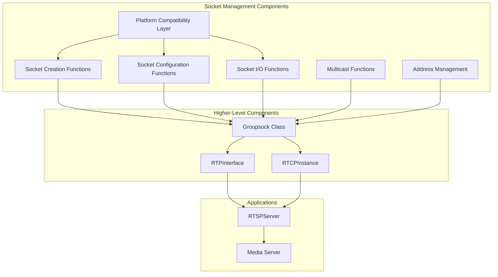
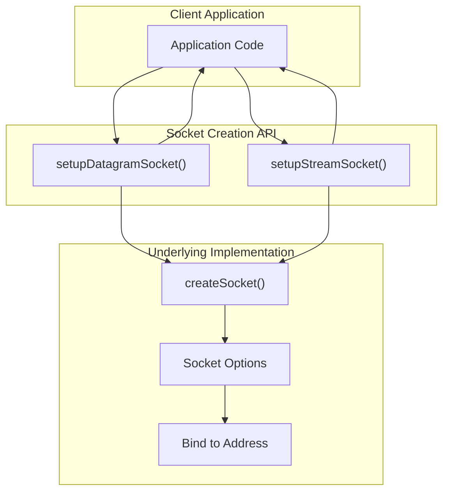
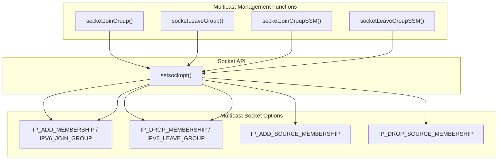
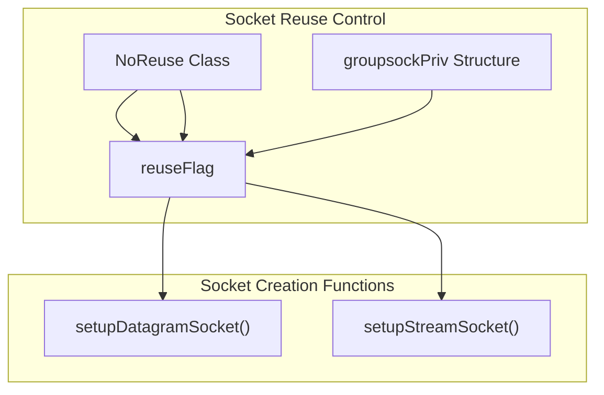
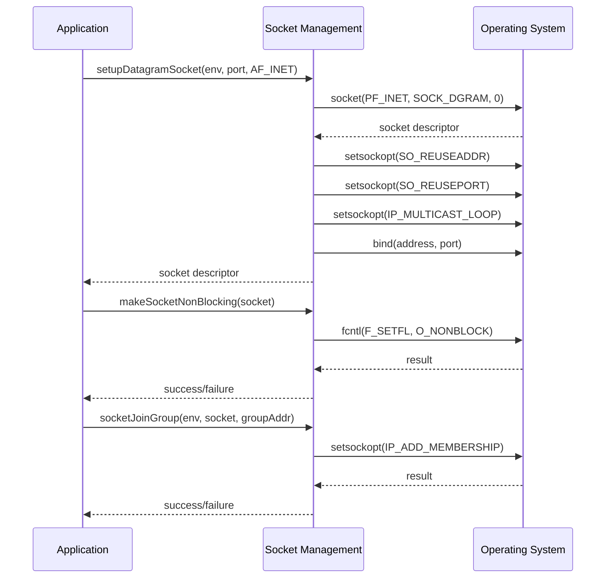

# Socket Management

> **Relevant source files**
> * [groupsock/GroupsockHelper.cpp](https://github.com/rgaufman/live555/blob/a0eb8f91/groupsock/GroupsockHelper.cpp)
> * [groupsock/include/GroupsockHelper.hh](https://github.com/rgaufman/live555/blob/a0eb8f91/groupsock/include/GroupsockHelper.hh)

## Purpose and Scope

This document describes the socket management subsystem in the LIVE555 streaming media library. The socket management functionality is primarily implemented in the "groupsock" library and provides cross-platform abstractions for socket creation, configuration, I/O operations, and multicast group management. These components are fundamental building blocks that support the network transport layer in the LIVE555 architecture.

For information about RTP interface implementation that uses these socket management functions, see [RTP Interface](/rgaufman/live555/5.1-rtp-interface).

## Architecture Overview

The socket management subsystem provides a collection of utility functions rather than a class hierarchy. These functions abstract platform-specific socket operations and provide consistent behavior across different operating systems.

### Socket Management Architecture



Sources: [groupsock/include/GroupsockHelper.hh L32-L67](https://github.com/rgaufman/live555/blob/a0eb8f91/groupsock/include/GroupsockHelper.hh#L32-L67)

 [groupsock/GroupsockHelper.cpp L90-L388](https://github.com/rgaufman/live555/blob/a0eb8f91/groupsock/GroupsockHelper.cpp#L90-L388)

## Socket Creation Functions

The socket management subsystem provides two primary functions for creating sockets:

### Datagram and Stream Socket Creation



Sources: [groupsock/GroupsockHelper.cpp L90-L214](https://github.com/rgaufman/live555/blob/a0eb8f91/groupsock/GroupsockHelper.cpp#L90-L214)

 [groupsock/GroupsockHelper.cpp L293-L388](https://github.com/rgaufman/live555/blob/a0eb8f91/groupsock/GroupsockHelper.cpp#L293-L388)

The subsystem provides two primary functions for socket creation:

1. **`setupDatagramSocket()`** - Creates UDP sockets with appropriate configuration options: * Creates a socket with `SOCK_DGRAM` type * Sets the `SO_REUSEADDR` option to allow address reuse * Sets multicast-specific options when necessary * Configures the sending interface for multicast transmissions
2. **`setupStreamSocket()`** - Creates TCP sockets with appropriate configuration options: * Creates a socket with `SOCK_STREAM` type * Sets the `SO_REUSEADDR` option to allow port reuse * Optionally makes the socket non-blocking * Optionally enables TCP keep-alive

Both functions are implemented to handle both IPv4 and IPv6 seamlessly, with appropriate platform-specific considerations.

Sources: [groupsock/include/GroupsockHelper.hh L32-L35](https://github.com/rgaufman/live555/blob/a0eb8f91/groupsock/include/GroupsockHelper.hh#L32-L35)

 [groupsock/GroupsockHelper.cpp L90-L214](https://github.com/rgaufman/live555/blob/a0eb8f91/groupsock/GroupsockHelper.cpp#L90-L214)

 [groupsock/GroupsockHelper.cpp L293-L388](https://github.com/rgaufman/live555/blob/a0eb8f91/groupsock/GroupsockHelper.cpp#L293-L388)

## Socket Configuration

The socket management subsystem provides several functions to configure socket behavior after creation:

### Socket Blocking Modes

* **`makeSocketNonBlocking()`** - Configures a socket to operate in non-blocking mode: * Uses platform-specific methods like `ioctl()`, `fcntl()`, or `ioctlsocket()` * Returns a Boolean indicating success or failure
* **`makeSocketBlocking()`** - Configures a socket to operate in blocking mode: * Reverses the non-blocking setting * Optionally sets a write timeout using `SO_SNDTIMEO` * Returns a Boolean indicating success or failure

Sources: [groupsock/GroupsockHelper.cpp L216-L257](https://github.com/rgaufman/live555/blob/a0eb8f91/groupsock/GroupsockHelper.cpp#L216-L257)

### Socket Keep-Alive Configuration

* **`setSocketKeepAlive()`** - Enables TCP keep-alive mechanism: * Sets `SO_KEEPALIVE` socket option * On supported platforms, configures keep-alive parameters: * `TCP_KEEPIDLE`: Time between the last data packet and first keep-alive probe * `TCP_KEEPCNT`: Number of unacknowledged probes before considering the connection dead * `TCP_KEEPINTVL`: Time between consecutive keep-alive probes * Returns a Boolean indicating success or failure

Sources: [groupsock/GroupsockHelper.cpp L259-L291](https://github.com/rgaufman/live555/blob/a0eb8f91/groupsock/GroupsockHelper.cpp#L259-L291)

### Buffer Size Management

The subsystem provides functions to query and set socket buffer sizes:

* **Query Functions**: * `getSendBufferSize()` - Gets the current send buffer size * `getReceiveBufferSize()` - Gets the current receive buffer size
* **Set Functions**: * `setSendBufferTo()` - Sets the send buffer to a specific size * `setReceiveBufferTo()` - Sets the receive buffer to a specific size * `increaseSendBufferTo()` - Increases the send buffer size if needed * `increaseReceiveBufferTo()` - Increases the receive buffer size if needed

These functions handle the platform-specific aspects of socket buffer management.

Sources: [groupsock/GroupsockHelper.cpp L477-L541](https://github.com/rgaufman/live555/blob/a0eb8f91/groupsock/GroupsockHelper.cpp#L477-L541)

## Socket I/O Operations

### Read and Write Operations

The subsystem provides functions for reading from and writing to sockets:

* **`readSocket()`** - Reads data from a socket: * Handles both datagram and stream sockets * Returns the number of bytes read * Fills in the sender's address for datagram sockets * Handles common error conditions
* **`writeSocket()`** - Writes data to a socket: * Two versions: one with TTL (Time-To-Live) setting for multicast, one without * Returns a Boolean indicating success or failure * Handles error reporting

The `writeSocket()` function that includes TTL setting is particularly useful for multicast transmission, allowing control over how far multicast packets can travel in the network.

Sources: [groupsock/GroupsockHelper.cpp L390-L465](https://github.com/rgaufman/live555/blob/a0eb8f91/groupsock/GroupsockHelper.cpp#L390-L465)

## Multicast Support

The subsystem provides extensive support for multicast operations, which is essential for efficient media streaming to multiple clients.

### Multicast Group Management



Sources: [groupsock/GroupsockHelper.cpp L557-L724](https://github.com/rgaufman/live555/blob/a0eb8f91/groupsock/GroupsockHelper.cpp#L557-L724)

The subsystem provides functions for joining and leaving multicast groups:

1. **Standard Multicast Functions**: * `socketJoinGroup()` - Joins a socket to a multicast group * `socketLeaveGroup()` - Removes a socket from a multicast group
2. **Source-Specific Multicast (SSM) Functions**: * `socketJoinGroupSSM()` - Joins a socket to a source-specific multicast group * `socketLeaveGroupSSM()` - Removes a socket from a source-specific multicast group

The multicast functions handle both IPv4 and IPv6 (where supported) and manage the platform-specific details of multicast group membership.

Sources: [groupsock/include/GroupsockHelper.hh L68-L79](https://github.com/rgaufman/live555/blob/a0eb8f91/groupsock/include/GroupsockHelper.hh#L68-L79)

 [groupsock/GroupsockHelper.cpp L557-L724](https://github.com/rgaufman/live555/blob/a0eb8f91/groupsock/GroupsockHelper.cpp#L557-L724)

## IP Address Management

The subsystem provides functions to determine and manage local IP addresses, which is crucial for proper socket binding and multicast group membership.

### IP Address Discovery

The library uses multiple methods to discover local IP addresses:

1. Primary Method: `getifaddrs()` when available * Enumerates all network interfaces * Ignores down interfaces and loopback interfaces * Takes the first valid IPv4 and IPv6 addresses found
2. Fallback Method: Hostname resolution * Gets the local hostname using `gethostname()` * Resolves the hostname to IP addresses * Takes the first valid IPv4 and IPv6 addresses found

The discovered addresses are cached and used throughout the application.

Key functions include:

* `ourIPv4Address()` - Returns the local IPv4 address
* `ourIPv6Address()` - Returns the local IPv6 address
* `weHaveAnIPv4Address()` - Checks if a valid IPv4 address is available
* `weHaveAnIPv6Address()` - Checks if a valid IPv6 address is available
* `weHaveAnIPAddress()` - Checks if any valid IP address is available

The system also provides global variables for configuring network interfaces:

* `SendingInterfaceAddr` - The IPv4 address to use for sending
* `ReceivingInterfaceAddr` - The IPv4 address to use for receiving
* `ReceivingInterfaceAddr6` - The IPv6 address to use for receiving

Sources: [groupsock/GroupsockHelper.cpp L805-L969](https://github.com/rgaufman/live555/blob/a0eb8f91/groupsock/GroupsockHelper.cpp#L805-L969)

## Platform Compatibility Layer

The socket management subsystem includes platform-specific code to ensure consistent behavior across different operating systems, particularly for Windows, Linux, and other Unix-like systems.

### Cross-Platform Considerations

Key platform-specific implementations include:

1. **Windows-specific Compatibility**: * Implementation of `gettimeofday()` for Windows * Windows-specific socket initialization using Winsock * Windows-specific non-blocking socket configuration
2. **Signal Handling**: * `ignoreSigPipeOnSocket()` - Prevents SIGPIPE signals when writing to closed sockets * Platform-specific signal handling using either `SO_NOSIGPIPE` or `signal(SIGPIPE, SIG_IGN)`
3. **Socket Option Compatibility**: * Macros for socket address structure initialization * Handling of platform-specific socket option flags

This compatibility layer helps maintain consistent behavior of socket operations across all supported platforms.

Sources: [groupsock/GroupsockHelper.cpp L1013-L1097](https://github.com/rgaufman/live555/blob/a0eb8f91/groupsock/GroupsockHelper.cpp#L1013-L1097)

 [groupsock/GroupsockHelper.cpp L467-L476](https://github.com/rgaufman/live555/blob/a0eb8f91/groupsock/GroupsockHelper.cpp#L467-L476)

## Socket Reuse Control

The library provides a mechanism to control socket address reuse behavior through the `NoReuse` class:



Sources: [groupsock/include/GroupsockHelper.hh L134-L141](https://github.com/rgaufman/live555/blob/a0eb8f91/groupsock/include/GroupsockHelper.hh#L134-L141)

 [groupsock/GroupsockHelper.cpp L60-L68](https://github.com/rgaufman/live555/blob/a0eb8f91/groupsock/GroupsockHelper.cpp#L60-L68)

By default, sockets are created with address reuse enabled (SO_REUSEADDR). The `NoReuse` class provides a scoped way to disable this behavior:

```
{
    NoReuse dummy(env);
    // Sockets created here will not have the reuse flag set
}
// Reuse flag is restored after leaving the scope
```

This mechanism is implemented using a reference to the `reuseFlag` field in the environment-specific `_groupsockPriv` structure.

Sources: [groupsock/include/GroupsockHelper.hh L134-L141](https://github.com/rgaufman/live555/blob/a0eb8f91/groupsock/include/GroupsockHelper.hh#L134-L141)

 [groupsock/GroupsockHelper.cpp L60-L68](https://github.com/rgaufman/live555/blob/a0eb8f91/groupsock/GroupsockHelper.cpp#L60-L68)

 [groupsock/GroupsockHelper.cpp L71-L88](https://github.com/rgaufman/live555/blob/a0eb8f91/groupsock/GroupsockHelper.cpp#L71-L88)

## Usage Patterns

### Typical Socket Creation and Configuration



Sources: [groupsock/GroupsockHelper.cpp L90-L214](https://github.com/rgaufman/live555/blob/a0eb8f91/groupsock/GroupsockHelper.cpp#L90-L214)

 [groupsock/GroupsockHelper.cpp L216-L227](https://github.com/rgaufman/live555/blob/a0eb8f91/groupsock/GroupsockHelper.cpp#L216-L227)

 [groupsock/GroupsockHelper.cpp L557-L608](https://github.com/rgaufman/live555/blob/a0eb8f91/groupsock/GroupsockHelper.cpp#L557-L608)