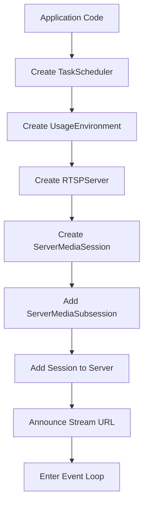
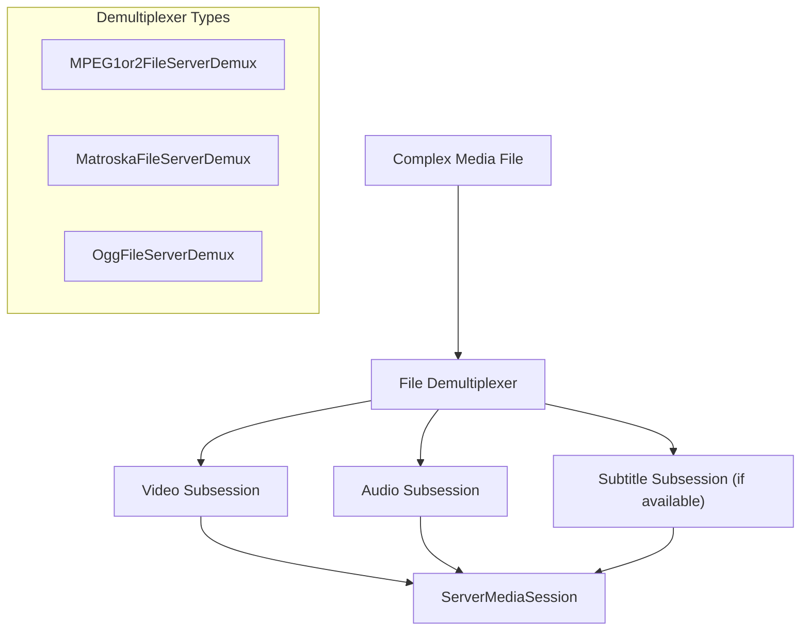
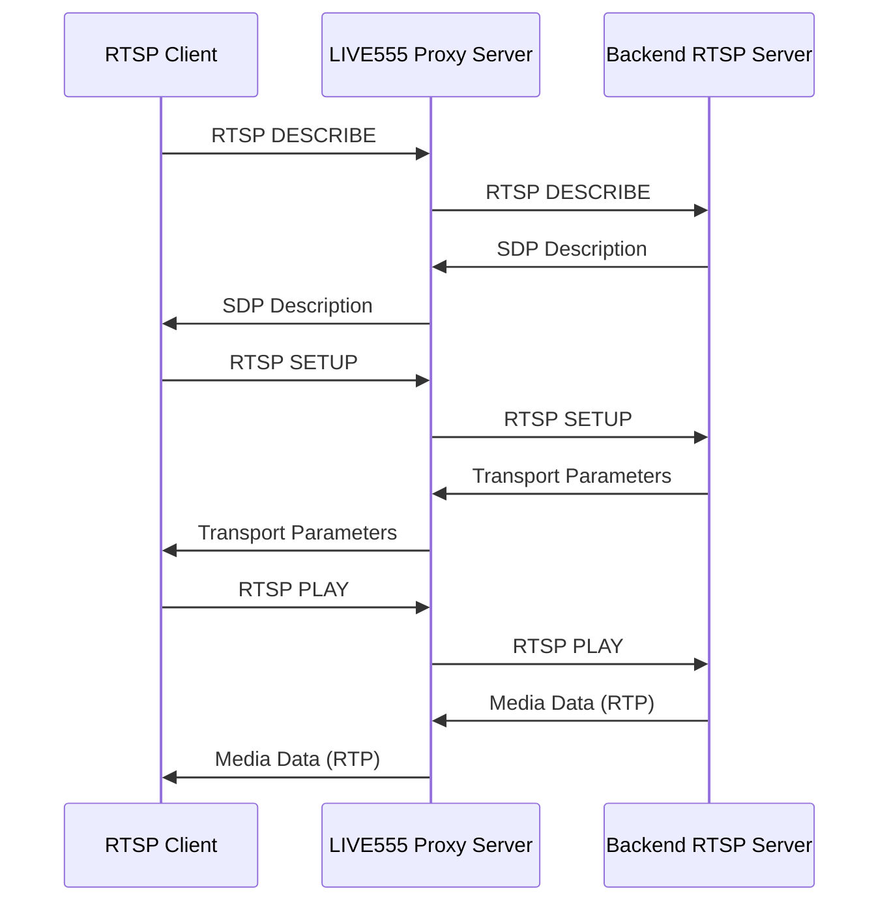
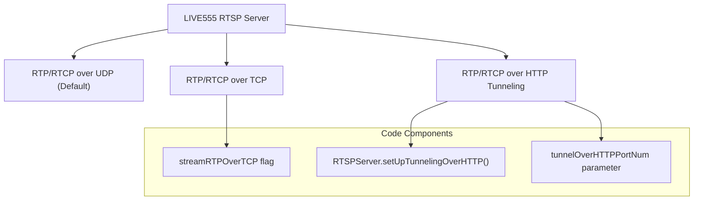
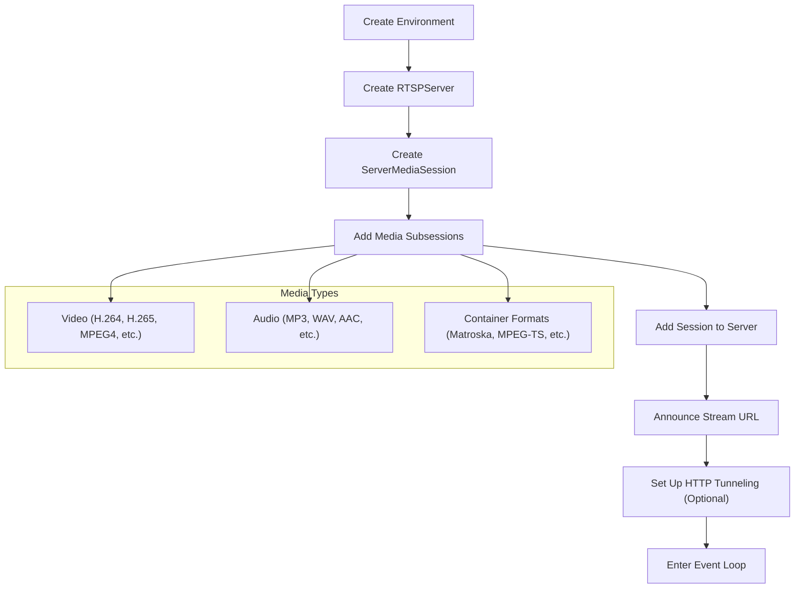

# Usage Examples

> **Relevant source files**
> * [proxyServer/live555ProxyServer.cpp](https://github.com/rgaufman/live555/blob/a0eb8f91/proxyServer/live555ProxyServer.cpp)
> * [testProgs/testOnDemandRTSPServer.cpp](https://github.com/rgaufman/live555/blob/a0eb8f91/testProgs/testOnDemandRTSPServer.cpp)

This page demonstrates how to use the LIVE555 Streaming Media components in real applications. It provides practical examples for setting up RTSP servers, proxying RTSP streams, and serving various media formats. For information about the architecture and core components, see [Overview](/rgaufman/live555/1-overview).

## Basic RTSP Server Setup

LIVE555 provides two main server applications:

1. On-demand RTSP server - for serving media files
2. RTSP proxy server - for relaying RTSP streams from other sources

### Setting Up Basic RTSP Server



The basic steps to set up an RTSP server:

1. Create a `TaskScheduler` instance
2. Create a `UsageEnvironment` using the scheduler
3. Create an `RTSPServer` instance with a port number
4. Create `ServerMediaSession` objects for each stream
5. Add appropriate `ServerMediaSubsession` objects to each session
6. Add the sessions to the server
7. Enter the event loop

Sources: [testProgs/testOnDemandRTSPServer.cpp L55-L74](https://github.com/rgaufman/live555/blob/a0eb8f91/testProgs/testOnDemandRTSPServer.cpp#L55-L74)

 [testProgs/testOnDemandRTSPServer.cpp L462-L464](https://github.com/rgaufman/live555/blob/a0eb8f91/testProgs/testOnDemandRTSPServer.cpp#L462-L464)

Example code structure:

```
TaskScheduler* scheduler = BasicTaskScheduler::createNew();
UsageEnvironment* env = BasicUsageEnvironment::createNew(*scheduler);
RTSPServer* rtspServer = RTSPServer::createNew(*env, 8554, authDB);
ServerMediaSession* sms = ServerMediaSession::createNew(*env, streamName, streamName, description);
sms->addSubsession(ServerMediaSubsession::createNew(...));
rtspServer->addServerMediaSession(sms);
env->taskScheduler().doEventLoop();
```

## Media Types and Subsessions

The LIVE555 library supports various media formats through specialized `ServerMediaSubsession` subclasses.

### Available Media Subsessions

```mermaid
classDiagram
    class ServerMediaSubsession {
    }
    class OnDemandServerMediaSubsession {
    }
    class MPEG4VideoFileServerMediaSubsession {
    }
    class H264VideoFileServerMediaSubsession {
    }
    class H265VideoFileServerMediaSubsession {
    }
    class MP3AudioFileServerMediaSubsession {
    }
    class WAVAudioFileServerMediaSubsession {
    }
    class AMRAudioFileServerMediaSubsession {
    }
    class AC3AudioFileServerMediaSubsession {
    }
    class MPEG1or2VideoFileServerMediaSubsession {
    }
    class DVVideoFileServerMediaSubsession {
    }
    ServerMediaSubsession <|-- OnDemandServerMediaSubsession
    OnDemandServerMediaSubsession <|-- MPEG4VideoFileServerMediaSubsession
    OnDemandServerMediaSubsession <|-- H264VideoFileServerMediaSubsession
    OnDemandServerMediaSubsession <|-- H265VideoFileServerMediaSubsession
    OnDemandServerMediaSubsession <|-- MP3AudioFileServerMediaSubsession
    OnDemandServerMediaSubsession <|-- WAVAudioFileServerMediaSubsession
    OnDemandServerMediaSubsession <|-- AMRAudioFileServerMediaSubsession
    OnDemandServerMediaSubsession <|-- AC3AudioFileServerMediaSubsession
    OnDemandServerMediaSubsession <|-- MPEG1or2VideoFileServerMediaSubsession
    OnDemandServerMediaSubsession <|-- DVVideoFileServerMediaSubsession
```



| Media Format | Subsession Class | Example File Extension |
| --- | --- | --- |
| MPEG-4 Video | MPEG4VideoFileServerMediaSubsession | .m4e |
| H.264 Video | H264VideoFileServerMediaSubsession | .264 |
| H.265 Video | H265VideoFileServerMediaSubsession | .265 |
| MP3 Audio | MP3AudioFileServerMediaSubsession | .mp3 |
| WAV Audio | WAVAudioFileServerMediaSubsession | .wav |
| AMR Audio | AMRAudioFileServerMediaSubsession | .amr |
| AC3 Audio | AC3AudioFileServerMediaSubsession | .ac3 |
| MPEG-1/2 Video | MPEG1or2VideoFileServerMediaSubsession | .mpg |
| DV Video | DVVideoFileServerMediaSubsession | .dv |

Sources: [testProgs/testOnDemandRTSPServer.cpp L97-L311](https://github.com/rgaufman/live555/blob/a0eb8f91/testProgs/testOnDemandRTSPServer.cpp#L97-L311)

## Complex Media Formats

Some media formats require more complex handling through demultiplexers:



### Example: Serving Matroska/WebM Files

```
MatroskaFileServerDemux* matroskaDemux;
MatroskaFileServerDemux::createNew(*env, inputFileName, onMatroskaDemuxCreation, NULL);
// Wait for demux creation
ServerMediaSubsession* smss;
while ((smss = matroskaDemux->newServerMediaSubsession()) != NULL) {
    sms->addSubsession(smss);
}
```

Sources: [testProgs/testOnDemandRTSPServer.cpp L313-L364](https://github.com/rgaufman/live555/blob/a0eb8f91/testProgs/testOnDemandRTSPServer.cpp#L313-L364)

### Example: Serving MPEG-1/2 Program Streams

```
MPEG1or2FileServerDemux* demux = MPEG1or2FileServerDemux::createNew(*env, inputFileName, reuseFirstSource);
sms->addSubsession(demux->newVideoServerMediaSubsession(iFramesOnly));
sms->addSubsession(demux->newAudioServerMediaSubsession());
```

Sources: [testProgs/testOnDemandRTSPServer.cpp L139-L154](https://github.com/rgaufman/live555/blob/a0eb8f91/testProgs/testOnDemandRTSPServer.cpp#L139-L154)

## RTSP Proxy Server Example

The LIVE555 RTSP proxy server allows relaying RTSP streams from other sources.



### Setting Up a Proxy Server

```sql
// Create environment
TaskScheduler* scheduler = BasicTaskScheduler::createNew();
UsageEnvironment* env = BasicUsageEnvironment::createNew(*scheduler);

// Create RTSP server
RTSPServer* rtspServer = RTSPServer::createNew(*env, rtspServerPortNum, authDB);

// For each stream to proxy
ServerMediaSession* sms = ProxyServerMediaSession::createNew(*env, rtspServer,
                           proxiedStreamURL, streamName,
                           username, password, tunnelOverHTTPPortNum, verbosityLevel);
rtspServer->addServerMediaSession(sms);

// Enter event loop
env->taskScheduler().doEventLoop();
```

Sources: [proxyServer/live555ProxyServer.cpp L58-L251](https://github.com/rgaufman/live555/blob/a0eb8f91/proxyServer/live555ProxyServer.cpp#L58-L251)

### Proxy Server Command-Line Options

| Option | Description |
| --- | --- |
| `-v`, `-V` | Verbosity level (1 or 2) |
| `-t` | Stream RTP/RTCP over TCP |
| `-T <port>` | Stream RTP/RTCP over HTTP tunnel |
| `-p <port>` | RTSP server port (default 554) |
| `-u <username> <password>` | Credentials for accessing back-end streams |
| `-R` | Handle incoming REGISTER requests |
| `-U <username> <password>` | Credentials for authenticating REGISTER requests |

Sources: [proxyServer/live555ProxyServer.cpp L28-L38](https://github.com/rgaufman/live555/blob/a0eb8f91/proxyServer/live555ProxyServer.cpp#L28-L38)

 [proxyServer/live555ProxyServer.cpp L47-L56](https://github.com/rgaufman/live555/blob/a0eb8f91/proxyServer/live555ProxyServer.cpp#L47-L56)

## Handling Different Transport Protocols

LIVE555 supports different transport methods for RTP/RTCP data:



### UDP (Default)

Standard operation using separate UDP ports for RTP and RTCP.

### TCP Mode

Set `streamRTPOverTCP = True` to stream RTP/RTCP over the TCP connection.

Sources: [proxyServer/live555ProxyServer.cpp L91-L96](https://github.com/rgaufman/live555/blob/a0eb8f91/proxyServer/live555ProxyServer.cpp#L91-L96)

### HTTP Tunneling

Use `rtspServer->setUpTunnelingOverHTTP(port)` to set up HTTP tunneling, useful for traversing firewalls.

The proxy server tries ports 80, 8000, and 8080 in sequence:

```
if (rtspServer->setUpTunnelingOverHTTP(80) || 
    rtspServer->setUpTunnelingOverHTTP(8000) || 
    rtspServer->setUpTunnelingOverHTTP(8080)) {
  // HTTP tunneling is available
}
```

Sources: [proxyServer/live555ProxyServer.cpp L241-L245](https://github.com/rgaufman/live555/blob/a0eb8f91/proxyServer/live555ProxyServer.cpp#L241-L245)

 [testProgs/testOnDemandRTSPServer.cpp L445-L460](https://github.com/rgaufman/live555/blob/a0eb8f91/testProgs/testOnDemandRTSPServer.cpp#L445-L460)

## Authentication

LIVE555 provides authentication through the `UserAuthenticationDatabase` class:

```sql
// Create authentication database
UserAuthenticationDatabase* authDB = new UserAuthenticationDatabase;
authDB->addUserRecord("username1", "password1");
authDB->addUserRecord("username2", "password2");

// Create server with authentication
RTSPServer* rtspServer = RTSPServer::createNew(*env, 8554, authDB);
```

The proxy server example shows authentication for both client access and backing stream access.

Sources: [testProgs/testOnDemandRTSPServer.cpp L60-L67](https://github.com/rgaufman/live555/blob/a0eb8f91/testProgs/testOnDemandRTSPServer.cpp#L60-L67)

 [proxyServer/live555ProxyServer.cpp L130-L137](https://github.com/rgaufman/live555/blob/a0eb8f91/proxyServer/live555ProxyServer.cpp#L130-L137)

 [proxyServer/live555ProxyServer.cpp L138-L147](https://github.com/rgaufman/live555/blob/a0eb8f91/proxyServer/live555ProxyServer.cpp#L138-L147)

## Advanced: Customizing Buffer Sizes

For streams with large frames (like HD video), you may need to increase buffer sizes:

```
// For HD video or other large frames
OutPacketBuffer::maxSize = 2000000; // 2MB buffer
```

Sources: [proxyServer/live555ProxyServer.cpp L59-L61](https://github.com/rgaufman/live555/blob/a0eb8f91/proxyServer/live555ProxyServer.cpp#L59-L61)

 [testProgs/testOnDemandRTSPServer.cpp L283-L284](https://github.com/rgaufman/live555/blob/a0eb8f91/testProgs/testOnDemandRTSPServer.cpp#L283-L284)

## Complete Example: Setting Up On-Demand Server



The `testOnDemandRTSPServer.cpp` file provides a comprehensive example that streams various media formats through a single RTSP server. It demonstrates:

1. Setting up the server environment
2. Creating media sessions for different file types
3. Adding appropriate subsessions
4. Setting up optional HTTP tunneling
5. Running the event loop

Sources: [testProgs/testOnDemandRTSPServer.cpp L55-L465](https://github.com/rgaufman/live555/blob/a0eb8f91/testProgs/testOnDemandRTSPServer.cpp#L55-L465)

## Complete Example: Setting Up Proxy Server

The `live555ProxyServer.cpp` file demonstrates:

1. Setting up the proxy server environment
2. Parsing command-line options
3. Creating the RTSP server
4. Creating proxy media sessions for each stream
5. Setting up optional HTTP tunneling
6. Running the event loop

Sources: [proxyServer/live555ProxyServer.cpp L58-L251](https://github.com/rgaufman/live555/blob/a0eb8f91/proxyServer/live555ProxyServer.cpp#L58-L251)