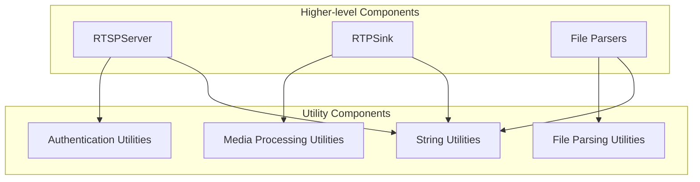
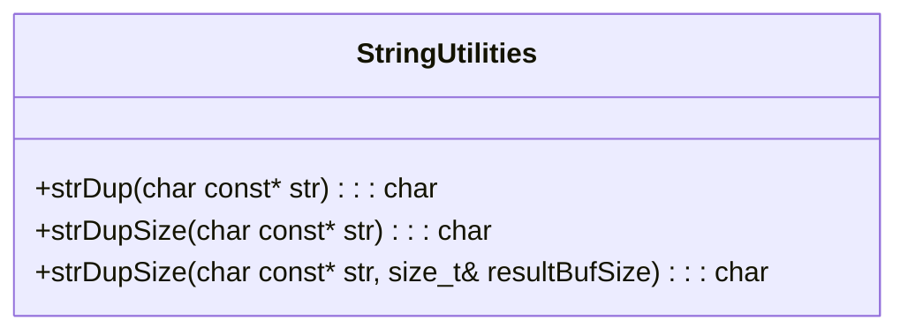
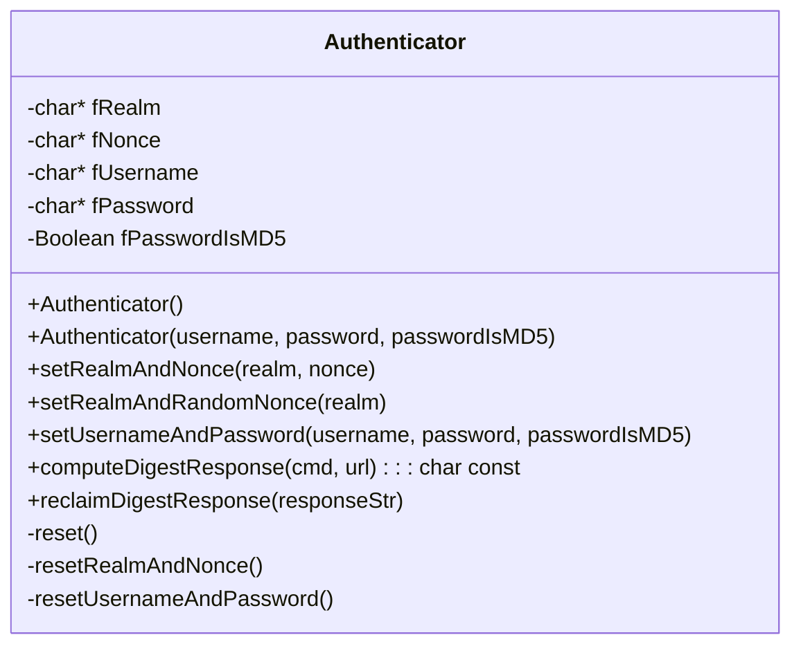
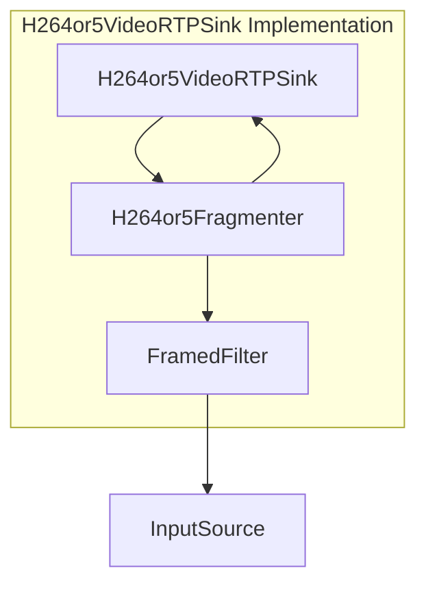
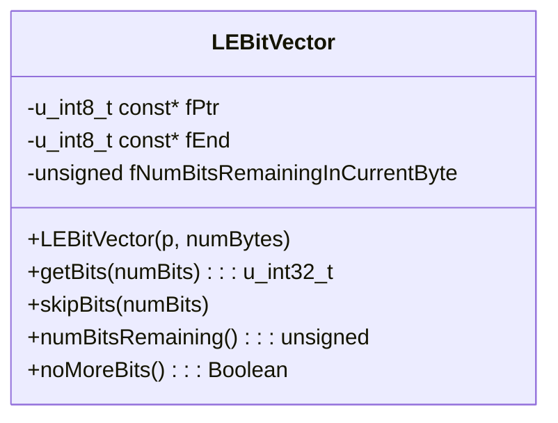
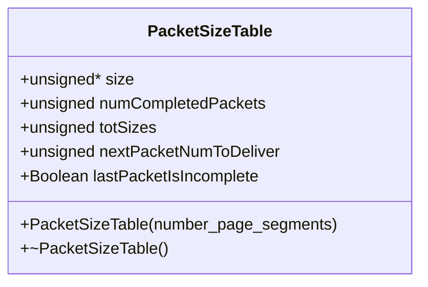
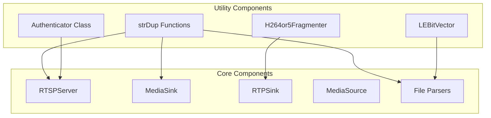

# Utility Components

> **Relevant source files**
> * [UsageEnvironment/include/strDup.hh](https://github.com/rgaufman/live555/blob/a0eb8f91/UsageEnvironment/include/strDup.hh)
> * [UsageEnvironment/strDup.cpp](https://github.com/rgaufman/live555/blob/a0eb8f91/UsageEnvironment/strDup.cpp)
> * [config.solaris-32bit](https://github.com/rgaufman/live555/blob/a0eb8f91/config.solaris-32bit)
> * [config.solaris-64bit](https://github.com/rgaufman/live555/blob/a0eb8f91/config.solaris-64bit)
> * [liveMedia/DigestAuthentication.cpp](https://github.com/rgaufman/live555/blob/a0eb8f91/liveMedia/DigestAuthentication.cpp)
> * [liveMedia/H264or5VideoRTPSink.cpp](https://github.com/rgaufman/live555/blob/a0eb8f91/liveMedia/H264or5VideoRTPSink.cpp)
> * [liveMedia/OggFileParser.cpp](https://github.com/rgaufman/live555/blob/a0eb8f91/liveMedia/OggFileParser.cpp)

This page documents the utility components and helper functions provided by the LIVE555 streaming media library. These components provide common functionality that's used across different parts of the library but aren't tied to a specific media format or protocol implementation. For information about media-specific utilities, see [Media Processing](/rgaufman/live555/6-media-processing).

## Overview of Utility Components

The LIVE555 library includes several utility components that handle common tasks such as string manipulation, authentication, and data formatting. These components simplify development and ensure consistent behavior throughout the codebase.



Sources: [liveMedia/DigestAuthentication.cpp L1-L174](https://github.com/rgaufman/live555/blob/a0eb8f91/liveMedia/DigestAuthentication.cpp#L1-L174)

 [UsageEnvironment/strDup.cpp L1-L51](https://github.com/rgaufman/live555/blob/a0eb8f91/UsageEnvironment/strDup.cpp#L1-L51)

 [liveMedia/H264or5VideoRTPSink.cpp L1-L300](https://github.com/rgaufman/live555/blob/a0eb8f91/liveMedia/H264or5VideoRTPSink.cpp#L1-L300)

## String Utilities

The LIVE555 library provides string utilities primarily for memory-safe string duplication. This is particularly important in C++ code that needs to manage string memory without relying on standard C functions.

### strDup and Related Functions

The `strDup` function family is a C++ equivalent to the standard C routine `strdup()` that ensures newly created strings can be safely deleted using `delete[]`.



Key functions:

* **strDup**: Creates a copy of a string, returning NULL if the input is NULL
* **strDupSize**: Allocates a buffer of the same size as the original string
* **strDupSize** (overloaded): Also returns the size of the allocated buffer

Example usage within the library:

```python
// Example from Authenticator class
void Authenticator::assignRealmAndNonce(char const* realm, char const* nonce) {
  fRealm = strDup(realm);
  fNonce = strDup(nonce);
}
```

Sources: [UsageEnvironment/include/strDup.hh L1-L38](https://github.com/rgaufman/live555/blob/a0eb8f91/UsageEnvironment/include/strDup.hh#L1-L38)

 [UsageEnvironment/strDup.cpp L1-L51](https://github.com/rgaufman/live555/blob/a0eb8f91/UsageEnvironment/strDup.cpp#L1-L51)

## Authentication Utilities

The library provides authentication utilities for securing RTSP connections, primarily through the `Authenticator` class.

### Digest Authentication

The `Authenticator` class implements digest authentication for RTSP servers, providing methods to manage authentication credentials and compute digest responses.



Key features:

* Creates and manages authentication credentials
* Generates random nonces for enhanced security
* Computes MD5-based digest responses according to RFC standards
* Supports both plain text and pre-hashed passwords

The digest response is computed as:

```html
md5(md5(<username>:<realm>:<password>):<nonce>:md5(<cmd>:<url>))
```

Or if the password is already MD5-hashed:

```html
md5(<password>:<nonce>:md5(<cmd>:<url>))
```

Sources: [liveMedia/DigestAuthentication.cpp L1-L174](https://github.com/rgaufman/live555/blob/a0eb8f91/liveMedia/DigestAuthentication.cpp#L1-L174)

## Media Processing Utilities

LIVE555 includes utilities for processing and fragmenting media data for streaming.

### H264or5Fragmenter

The `H264or5Fragmenter` class fragments H.264/H.265 NAL units into RTP-sized packets according to RFC 6184 (H.264) or RFC 7798 (H.265).



The fragmenter handles three scenarios:

1. Small NAL units that fit entirely within a single RTP packet
2. Large NAL units that need to be fragmented into multiple FU (Fragmentation Unit) packets
3. Continuation of fragmenting a NAL unit from a previous call

Key methods:

* `doGetNextFrame()`: Main method that handles the fragmentation logic
* `afterGettingFrame()`: Callback after reading from the source
* `reset()`: Resets the fragmenter state

Sources: [liveMedia/H264or5VideoRTPSink.cpp L24-L299](https://github.com/rgaufman/live555/blob/a0eb8f91/liveMedia/H264or5VideoRTPSink.cpp#L24-L299)

## File Parsing Utilities

The library provides utility classes for parsing media file formats, particularly for Ogg container formats.

### Bit Manipulation Utilities

The `LEBitVector` class handles bit-level operations for parsing binary data, specifically in little-endian format:



Key features:

* Reads bits in little-endian order
* Supports reading arbitrary bit lengths up to 32 bits
* Tracks remaining bits and buffer boundaries

### Packet Size Management

The `PacketSizeTable` class tracks packet sizes within Ogg pages:



Sources: [liveMedia/OggFileParser.cpp L25-L35](https://github.com/rgaufman/live555/blob/a0eb8f91/liveMedia/OggFileParser.cpp#L25-L35)

 [liveMedia/OggFileParser.cpp L242-L289](https://github.com/rgaufman/live555/blob/a0eb8f91/liveMedia/OggFileParser.cpp#L242-L289)

## Integration with LIVE555 Components

The utility components integrate with the main LIVE555 architecture to provide essential services to higher-level components.



The utility components support the core functionality of LIVE555 by:

1. Providing memory-safe string handling across all components
2. Enabling secure authentication for RTSP servers
3. Optimizing media data for network transmission
4. Supporting efficient parsing of media file formats

Sources: [liveMedia/DigestAuthentication.cpp](https://github.com/rgaufman/live555/blob/a0eb8f91/liveMedia/DigestAuthentication.cpp)

 [UsageEnvironment/strDup.cpp](https://github.com/rgaufman/live555/blob/a0eb8f91/UsageEnvironment/strDup.cpp)

 [liveMedia/H264or5VideoRTPSink.cpp](https://github.com/rgaufman/live555/blob/a0eb8f91/liveMedia/H264or5VideoRTPSink.cpp)

 [liveMedia/OggFileParser.cpp](https://github.com/rgaufman/live555/blob/a0eb8f91/liveMedia/OggFileParser.cpp)

## Configuration Utilities

LIVE555 uses compiler configuration files to adapt to different platforms. These configuration files define compilation flags, compiler options, and platform-specific settings.

| Platform | Key Compilation Options | Special Settings |
| --- | --- | --- |
| Solaris 32-bit | -DSOLARIS -DNEWLOCALE_NOT_USED | -L. for linking |
| Solaris 64-bit | -m64 -DSOLARIS -DNEWLOCALE_NOT_USED | 64-bit library linking |

These configuration files ensure that the utilities and other components are properly compiled for each target platform.

Sources: [config.solaris-32bit](https://github.com/rgaufman/live555/blob/a0eb8f91/config.solaris-32bit)

 [config.solaris-64bit](https://github.com/rgaufman/live555/blob/a0eb8f91/config.solaris-64bit)

## Summary

The utility components in LIVE555 provide essential functionality that supports the main streaming media features. These utilities are designed to be reusable, efficient, and platform-independent, ensuring that the library works consistently across different environments.

Key utilities include:

* String manipulation functions for memory safety
* Authentication utilities for securing RTSP communications
* Media fragmentation utilities for network transmission
* Bit manipulation and binary parsing utilities
* Configuration utilities for cross-platform support

These components are fundamental building blocks used throughout the LIVE555 architecture, supporting higher-level functionality like media streaming, session management, and protocol implementation.