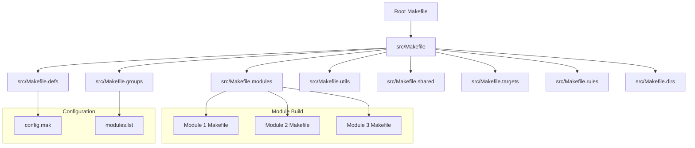
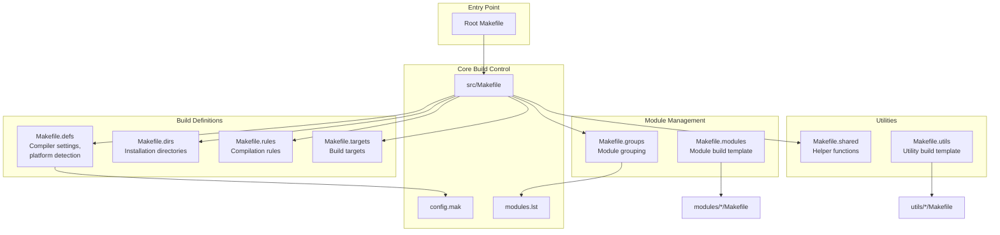
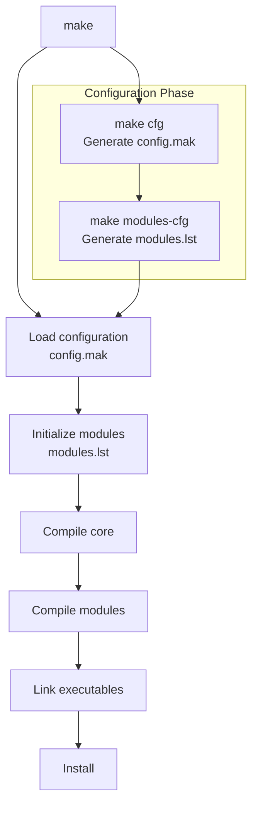
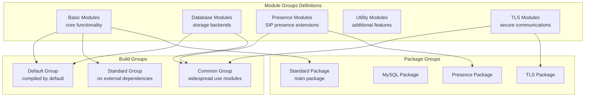
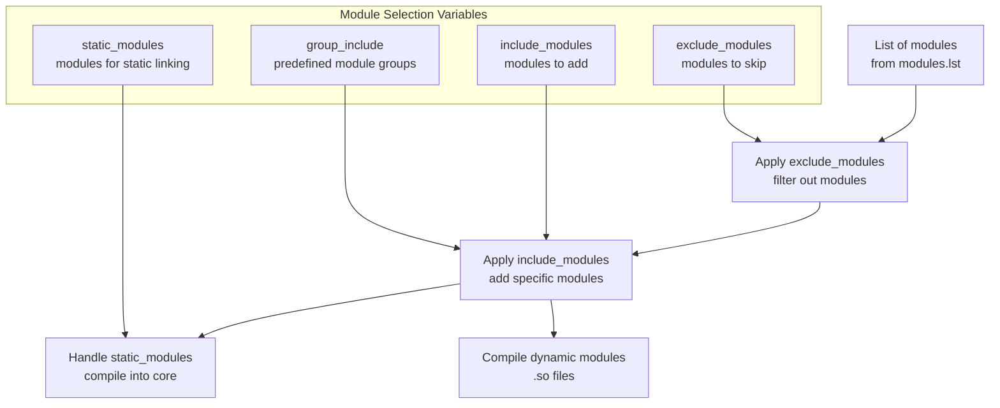
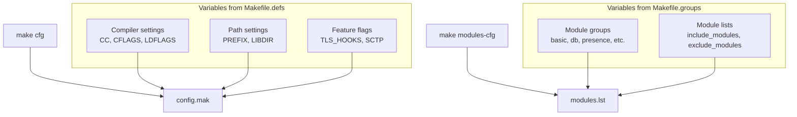
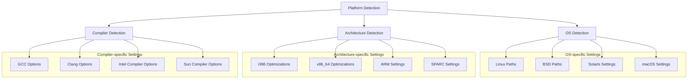
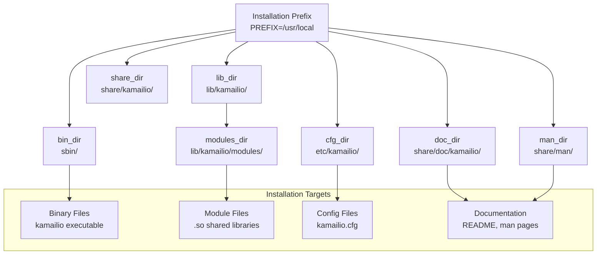
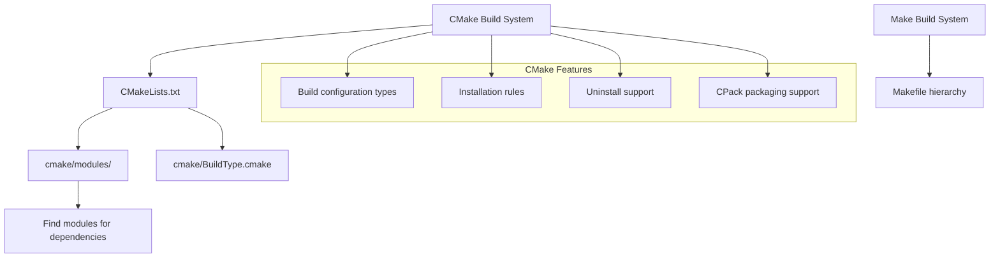

# Build System

> **Relevant source files**
> * [CMakeLists.txt](https://github.com/kamailio/kamailio/blob/2b4e9f8b/CMakeLists.txt)
> * [Makefile](https://github.com/kamailio/kamailio/blob/2b4e9f8b/Makefile)
> * [cmake/cmake-uninstall.cmake.in](https://github.com/kamailio/kamailio/blob/2b4e9f8b/cmake/cmake-uninstall.cmake.in)
> * [src/Makefile](https://github.com/kamailio/kamailio/blob/2b4e9f8b/src/Makefile)
> * [src/Makefile.defs](https://github.com/kamailio/kamailio/blob/2b4e9f8b/src/Makefile.defs)
> * [src/Makefile.groups](https://github.com/kamailio/kamailio/blob/2b4e9f8b/src/Makefile.groups)
> * [src/Makefile.modules](https://github.com/kamailio/kamailio/blob/2b4e9f8b/src/Makefile.modules)
> * [src/Makefile.shared](https://github.com/kamailio/kamailio/blob/2b4e9f8b/src/Makefile.shared)
> * [src/Makefile.targets](https://github.com/kamailio/kamailio/blob/2b4e9f8b/src/Makefile.targets)
> * [src/Makefile.utils](https://github.com/kamailio/kamailio/blob/2b4e9f8b/src/Makefile.utils)
> * [src/modules/auth_radius/Makefile](https://github.com/kamailio/kamailio/blob/2b4e9f8b/src/modules/auth_radius/Makefile)
> * [src/modules/auth_radius/cfg/dictionary.kamailio](https://github.com/kamailio/kamailio/blob/2b4e9f8b/src/modules/auth_radius/cfg/dictionary.kamailio)
> * [src/modules/auth_radius/cfg/dictionary.sip-router](https://github.com/kamailio/kamailio/blob/2b4e9f8b/src/modules/auth_radius/cfg/dictionary.sip-router)
> * [src/modules/topos_htable/Makefile](https://github.com/kamailio/kamailio/blob/2b4e9f8b/src/modules/topos_htable/Makefile)
> * [src/modules/topos_htable/doc/Makefile](https://github.com/kamailio/kamailio/blob/2b4e9f8b/src/modules/topos_htable/doc/Makefile)
> * [src/modules/topos_htable/doc/topos_htable.xml](https://github.com/kamailio/kamailio/blob/2b4e9f8b/src/modules/topos_htable/doc/topos_htable.xml)
> * [src/modules/topos_htable/doc/topos_htable_admin.xml](https://github.com/kamailio/kamailio/blob/2b4e9f8b/src/modules/topos_htable/doc/topos_htable_admin.xml)
> * [src/modules/topos_htable/topos_htable_mod.c](https://github.com/kamailio/kamailio/blob/2b4e9f8b/src/modules/topos_htable/topos_htable_mod.c)
> * [src/modules/topos_htable/topos_htable_storage.c](https://github.com/kamailio/kamailio/blob/2b4e9f8b/src/modules/topos_htable/topos_htable_storage.c)
> * [src/modules/topos_htable/topos_htable_storage.h](https://github.com/kamailio/kamailio/blob/2b4e9f8b/src/modules/topos_htable/topos_htable_storage.h)

The Kamailio build system provides the framework for compiling, installing, and packaging the SIP server. It leverages GNU Make as its primary build tool, with additional support for CMake. This document explains the architecture and components of the build system, how modules are compiled and grouped, and the configuration options available.

For information about compiling specific modules, see [Module Compilation System](/kamailio/kamailio/5.2-module-compilation-system). For packaging and deployment details, see [Packaging and Deployment](/kamailio/kamailio/6-packaging-and-deployment).

## Overview of the Build System

Kamailio's build system is designed to be flexible and extensible, allowing users to customize their builds according to their specific needs. The system is primarily make-based with a hierarchical structure of makefiles that handle different aspects of the build process.

Sources: [Makefile L1-L57](https://github.com/kamailio/kamailio/blob/2b4e9f8b/Makefile#L1-L57)

 [src/Makefile L1-L772](https://github.com/kamailio/kamailio/blob/2b4e9f8b/src/Makefile#L1-L772)

 [src/Makefile.defs L1-L1317](https://github.com/kamailio/kamailio/blob/2b4e9f8b/src/Makefile.defs#L1-L1317)

 [src/Makefile.groups L1-L552](https://github.com/kamailio/kamailio/blob/2b4e9f8b/src/Makefile.groups#L1-L552)

 [src/Makefile.modules L1-L294](https://github.com/kamailio/kamailio/blob/2b4e9f8b/src/Makefile.modules#L1-L294)

## Key Components

The build system consists of several key components:

1. **Root Makefile**: Acts as an entry point, forwarding commands to the src directory.
2. **src/Makefile**: The main makefile that orchestrates the build process.
3. **Makefile.defs**: Defines compiler options, platform-specific settings, and build flags.
4. **Makefile.groups**: Defines module groups for organizing and building related modules.
5. **Makefile.modules**: Template for building individual modules.
6. **config.mak**: Generated file that stores build configuration.
7. **modules.lst**: Generated file that stores the list of modules to be built.

### Makefile Hierarchy and Relationships

Sources: [Makefile L1-L57](https://github.com/kamailio/kamailio/blob/2b4e9f8b/Makefile#L1-L57)

 [src/Makefile L1-L772](https://github.com/kamailio/kamailio/blob/2b4e9f8b/src/Makefile#L1-L772)

 [src/Makefile.defs L1-L1317](https://github.com/kamailio/kamailio/blob/2b4e9f8b/src/Makefile.defs#L1-L1317)

 [src/Makefile.groups L1-L552](https://github.com/kamailio/kamailio/blob/2b4e9f8b/src/Makefile.groups#L1-L552)

 [src/Makefile.modules L1-L294](https://github.com/kamailio/kamailio/blob/2b4e9f8b/src/Makefile.modules#L1-L294)

 [src/Makefile.utils L1-L154](https://github.com/kamailio/kamailio/blob/2b4e9f8b/src/Makefile.utils#L1-L154)

## Build Process Flow

The build process follows a specific sequence to ensure proper dependency resolution and compilation.

Sources: [src/Makefile L94-L137](https://github.com/kamailio/kamailio/blob/2b4e9f8b/src/Makefile#L94-L137)

 [src/Makefile L283-L340](https://github.com/kamailio/kamailio/blob/2b4e9f8b/src/Makefile#L283-L340)

 [src/Makefile L342-L383](https://github.com/kamailio/kamailio/blob/2b4e9f8b/src/Makefile#L342-L383)

## Module Management System

Kamailio organizes modules into groups to simplify building related functionality. The module system allows for:

1. Selecting which modules to compile based on functionality
2. Handling module dependencies
3. Grouping modules for packaging

### Module Groups

Modules are organized into logical groups in `Makefile.groups`, which allows for easy selection of related modules.

Sources: [src/Makefile.groups L12-L290](https://github.com/kamailio/kamailio/blob/2b4e9f8b/src/Makefile.groups#L12-L290)

 [src/Makefile.groups L295-L346](https://github.com/kamailio/kamailio/blob/2b4e9f8b/src/Makefile.groups#L295-L346)

 [src/Makefile.groups L350-L550](https://github.com/kamailio/kamailio/blob/2b4e9f8b/src/Makefile.groups#L350-L550)

### Module Compilation Flow

The compilation of modules follows this process:

Sources: [src/Makefile L62-L83](https://github.com/kamailio/kamailio/blob/2b4e9f8b/src/Makefile#L62-L83)

 [src/Makefile L142-L183](https://github.com/kamailio/kamailio/blob/2b4e9f8b/src/Makefile#L142-L183)

 [src/Makefile L398-L505](https://github.com/kamailio/kamailio/blob/2b4e9f8b/src/Makefile#L398-L505)

## Build Configuration System

The build configuration system allows customizing the compilation process through various mechanisms.

### Key Configuration Variables

| Variable | Description | Example |
| --- | --- | --- |
| FLAVOUR | SIP server flavor | kamailio |
| CC | C compiler | gcc |
| CFLAGS | C compiler flags | -O2 -g |
| exclude_modules | Modules to exclude from build | db_mysql |
| include_modules | Modules to include in build | dialog |
| PREFIX | Installation prefix | /usr/local |
| DESTDIR | Destination directory for staged installs | /tmp/package |
| LIBDIR | Library directory name | lib64 |
| MAIN_NAME | Main binary name | kamailio |

Sources: [src/Makefile.defs L63-L91](https://github.com/kamailio/kamailio/blob/2b4e9f8b/src/Makefile.defs#L63-L91)

 [src/Makefile.defs L543-L562](https://github.com/kamailio/kamailio/blob/2b4e9f8b/src/Makefile.defs#L543-L562)

### Configuration Generation

The build system generates two main configuration files:

1. **config.mak**: Contains build settings like compiler flags, paths, etc.
2. **modules.lst**: Contains the list of modules to compile.

These files are generated with the `make cfg` and `make modules-cfg` commands respectively.

Sources: [src/Makefile L283-L340](https://github.com/kamailio/kamailio/blob/2b4e9f8b/src/Makefile#L283-L340)

 [src/Makefile L311-L339](https://github.com/kamailio/kamailio/blob/2b4e9f8b/src/Makefile#L311-L339)

## Platform Support

The build system detects the host architecture and operating system to apply platform-specific optimizations and settings.

Sources: [src/Makefile.defs L126-L151](https://github.com/kamailio/kamailio/blob/2b4e9f8b/src/Makefile.defs#L126-L151)

 [src/Makefile.defs L273-L355](https://github.com/kamailio/kamailio/blob/2b4e9f8b/src/Makefile.defs#L273-L355)

 [src/Makefile.defs L358-L452](https://github.com/kamailio/kamailio/blob/2b4e9f8b/src/Makefile.defs#L358-L452)

 [src/Makefile.defs L479-L531](https://github.com/kamailio/kamailio/blob/2b4e9f8b/src/Makefile.defs#L479-L531)

## Installation System

The installation process handles placing files in their appropriate directories based on the configured paths.

### Installation Directory Structure

Sources: [src/Makefile.defs L468-L511](https://github.com/kamailio/kamailio/blob/2b4e9f8b/src/Makefile.defs#L468-L511)

 [src/Makefile L653-L700](https://github.com/kamailio/kamailio/blob/2b4e9f8b/src/Makefile#L653-L700)

 [src/Makefile L702-L746](https://github.com/kamailio/kamailio/blob/2b4e9f8b/src/Makefile#L702-L746)

 [src/Makefile L789-L792](https://github.com/kamailio/kamailio/blob/2b4e9f8b/src/Makefile#L789-L792)

## Build Targets

The build system provides various targets for different tasks:

| Target | Description |
| --- | --- |
| all | Build the core and all modules |
| modules | Build all modules |
| modules-list | List all modules to be built |
| install | Install binaries, modules, and config files |
| clean | Remove compiled objects and binaries |
| proper | More thorough clean |
| distclean | Completely clean the build system |
| tar | Create a source tarball |
| deb | Build Debian package |
| sunpkg | Build Solaris package |

Sources: [src/Makefile.targets L1-L41](https://github.com/kamailio/kamailio/blob/2b4e9f8b/src/Makefile.targets#L1-L41)

 [src/Makefile L382-L383](https://github.com/kamailio/kamailio/blob/2b4e9f8b/src/Makefile#L382-L383)

 [src/Makefile L558-L647](https://github.com/kamailio/kamailio/blob/2b4e9f8b/src/Makefile#L558-L647)

## CMake Support

In addition to the Make-based build system, Kamailio also provides a CMake build system for platforms where CMake is preferred.

Sources: [CMakeLists.txt L1-L86](https://github.com/kamailio/kamailio/blob/2b4e9f8b/CMakeLists.txt#L1-L86)

 [cmake/cmake-uninstall.cmake.in L1-L35](https://github.com/kamailio/kamailio/blob/2b4e9f8b/cmake/cmake-uninstall.cmake.in#L1-L35)

## Summary

The Kamailio build system provides a flexible and powerful framework for compiling, customizing, and installing the SIP server. It handles platform detection, module management, dependency resolution, and installation through a hierarchical structure of makefiles. By understanding the components and flow of the build system, users can customize their Kamailio builds to meet their specific requirements.

Sources: [Makefile L1-L57](https://github.com/kamailio/kamailio/blob/2b4e9f8b/Makefile#L1-L57)

 [src/Makefile L1-L772](https://github.com/kamailio/kamailio/blob/2b4e9f8b/src/Makefile#L1-L772)

 [src/Makefile.defs L1-L1317](https://github.com/kamailio/kamailio/blob/2b4e9f8b/src/Makefile.defs#L1-L1317)

 [src/Makefile.groups L1-L552](https://github.com/kamailio/kamailio/blob/2b4e9f8b/src/Makefile.groups#L1-L552)

 [src/Makefile.modules L1-L294](https://github.com/kamailio/kamailio/blob/2b4e9f8b/src/Makefile.modules#L1-L294)