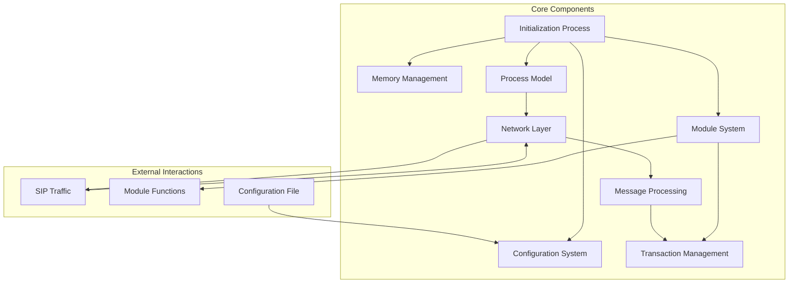
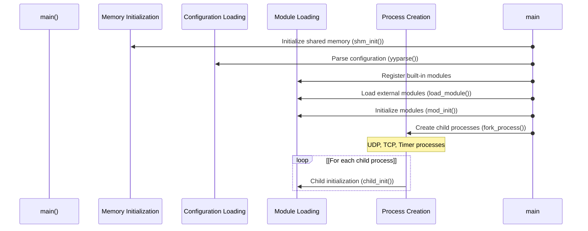
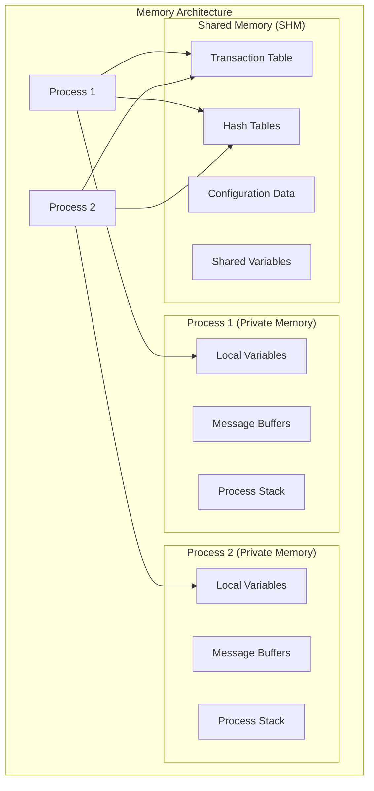
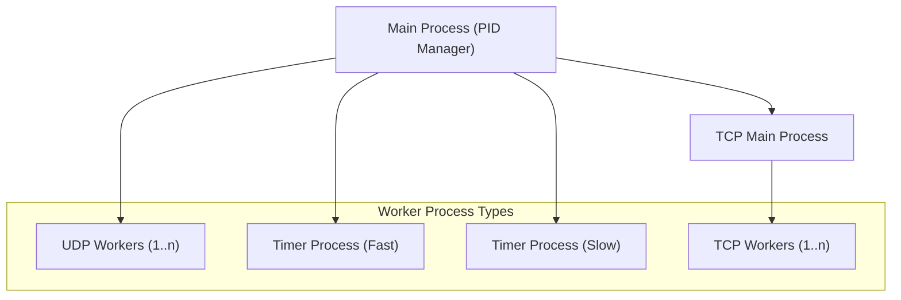
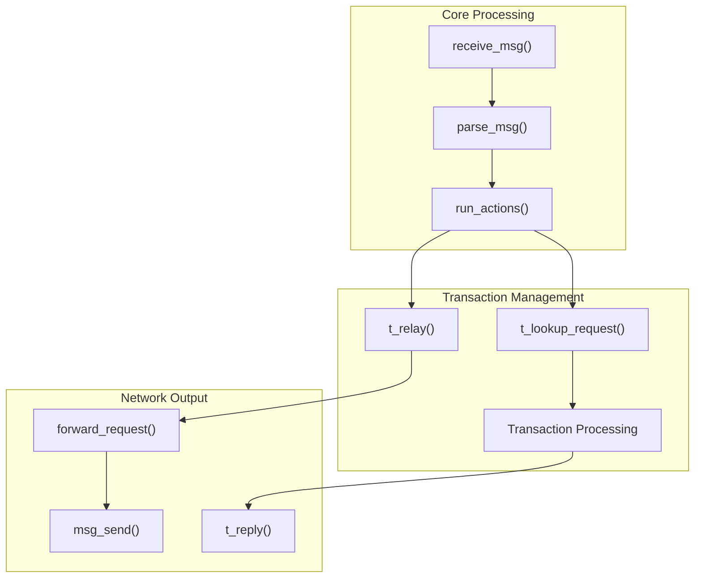
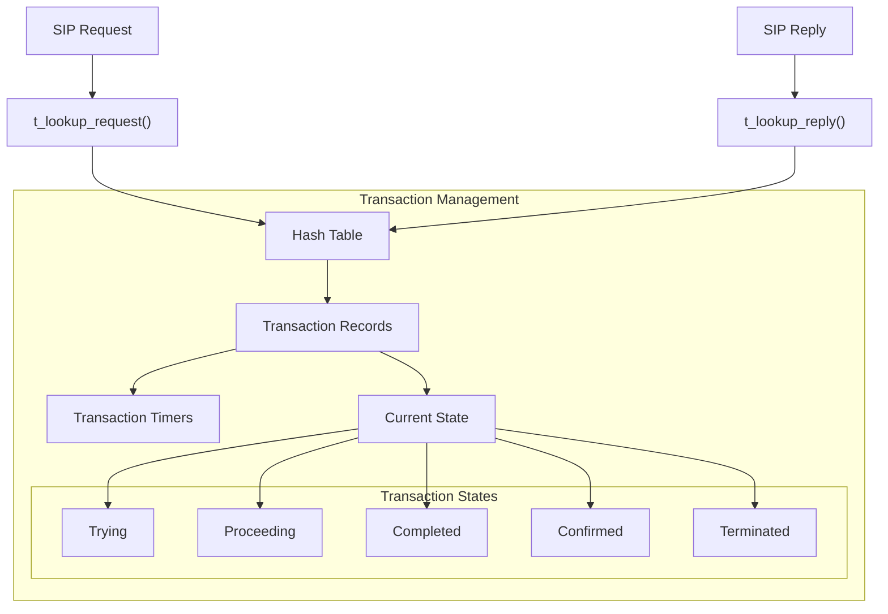
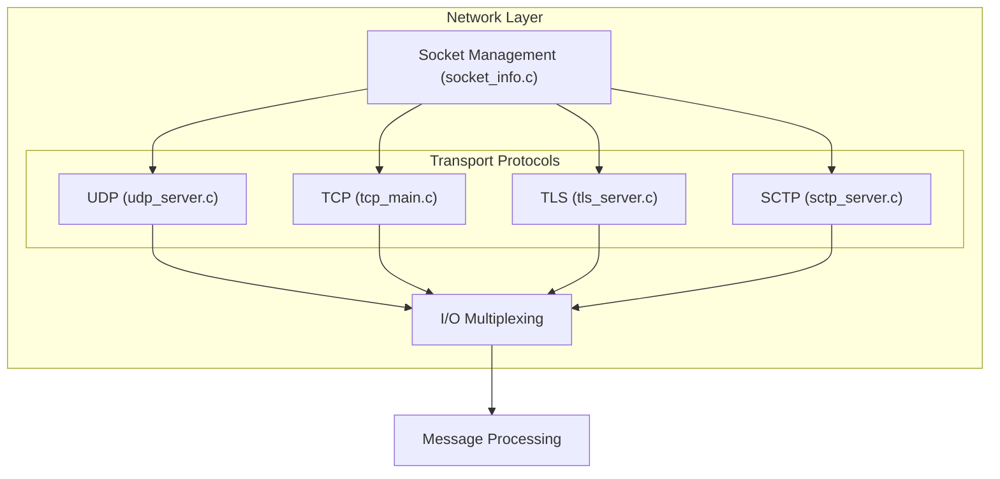
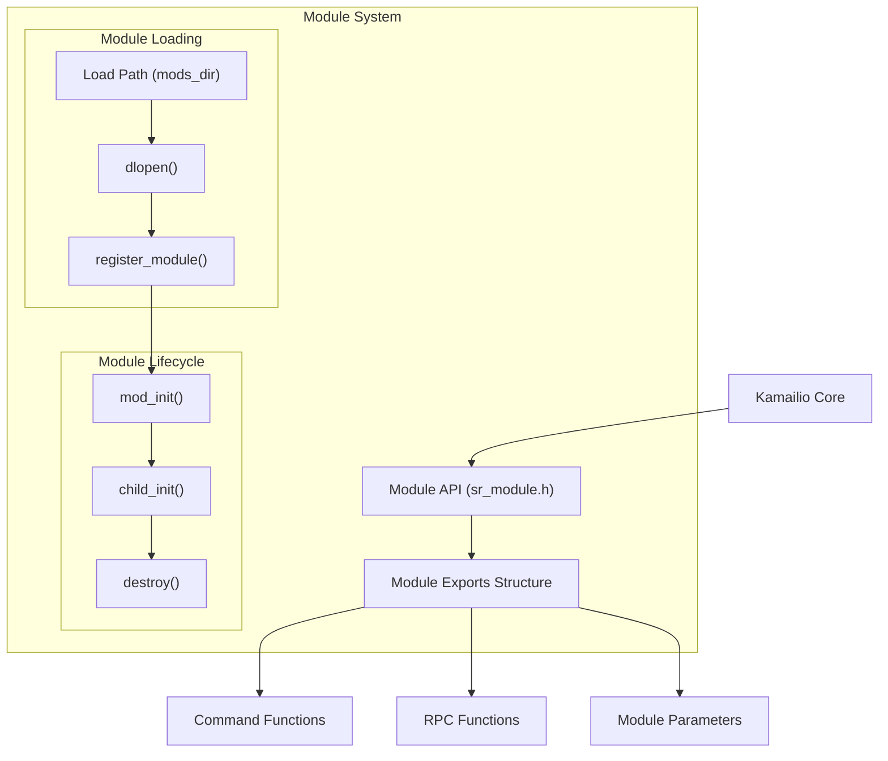
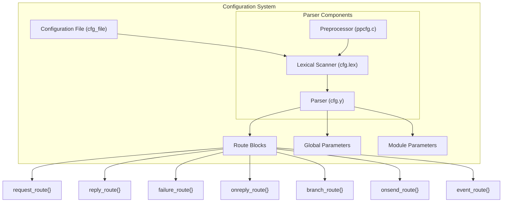

# Core Architecture

> **Relevant source files**
> * [src/core/async_task.c](https://github.com/kamailio/kamailio/blob/2b4e9f8b/src/core/async_task.c)
> * [src/core/async_task.h](https://github.com/kamailio/kamailio/blob/2b4e9f8b/src/core/async_task.h)
> * [src/core/cfg.lex](https://github.com/kamailio/kamailio/blob/2b4e9f8b/src/core/cfg.lex)
> * [src/core/cfg.y](https://github.com/kamailio/kamailio/blob/2b4e9f8b/src/core/cfg.y)
> * [src/core/core_cmd.c](https://github.com/kamailio/kamailio/blob/2b4e9f8b/src/core/core_cmd.c)
> * [src/core/events.c](https://github.com/kamailio/kamailio/blob/2b4e9f8b/src/core/events.c)
> * [src/core/events.h](https://github.com/kamailio/kamailio/blob/2b4e9f8b/src/core/events.h)
> * [src/core/flags.c](https://github.com/kamailio/kamailio/blob/2b4e9f8b/src/core/flags.c)
> * [src/core/flags.h](https://github.com/kamailio/kamailio/blob/2b4e9f8b/src/core/flags.h)
> * [src/core/forward.c](https://github.com/kamailio/kamailio/blob/2b4e9f8b/src/core/forward.c)
> * [src/core/forward.h](https://github.com/kamailio/kamailio/blob/2b4e9f8b/src/core/forward.h)
> * [src/core/globals.h](https://github.com/kamailio/kamailio/blob/2b4e9f8b/src/core/globals.h)
> * [src/core/ip_addr.c](https://github.com/kamailio/kamailio/blob/2b4e9f8b/src/core/ip_addr.c)
> * [src/core/ip_addr.h](https://github.com/kamailio/kamailio/blob/2b4e9f8b/src/core/ip_addr.h)
> * [src/core/mod_fix.c](https://github.com/kamailio/kamailio/blob/2b4e9f8b/src/core/mod_fix.c)
> * [src/core/mod_fix.h](https://github.com/kamailio/kamailio/blob/2b4e9f8b/src/core/mod_fix.h)
> * [src/core/modparam.c](https://github.com/kamailio/kamailio/blob/2b4e9f8b/src/core/modparam.c)
> * [src/core/modparam.h](https://github.com/kamailio/kamailio/blob/2b4e9f8b/src/core/modparam.h)
> * [src/core/ppcfg.c](https://github.com/kamailio/kamailio/blob/2b4e9f8b/src/core/ppcfg.c)
> * [src/core/ppcfg.h](https://github.com/kamailio/kamailio/blob/2b4e9f8b/src/core/ppcfg.h)
> * [src/core/receive.c](https://github.com/kamailio/kamailio/blob/2b4e9f8b/src/core/receive.c)
> * [src/core/receive.h](https://github.com/kamailio/kamailio/blob/2b4e9f8b/src/core/receive.h)
> * [src/core/socket_info.c](https://github.com/kamailio/kamailio/blob/2b4e9f8b/src/core/socket_info.c)
> * [src/core/socket_info.h](https://github.com/kamailio/kamailio/blob/2b4e9f8b/src/core/socket_info.h)
> * [src/core/sr_module.c](https://github.com/kamailio/kamailio/blob/2b4e9f8b/src/core/sr_module.c)
> * [src/core/sr_module.h](https://github.com/kamailio/kamailio/blob/2b4e9f8b/src/core/sr_module.h)
> * [src/core/stun.c](https://github.com/kamailio/kamailio/blob/2b4e9f8b/src/core/stun.c)
> * [src/core/tcp_conn.h](https://github.com/kamailio/kamailio/blob/2b4e9f8b/src/core/tcp_conn.h)
> * [src/core/tcp_init.h](https://github.com/kamailio/kamailio/blob/2b4e9f8b/src/core/tcp_init.h)
> * [src/core/tcp_main.c](https://github.com/kamailio/kamailio/blob/2b4e9f8b/src/core/tcp_main.c)
> * [src/core/tcp_read.c](https://github.com/kamailio/kamailio/blob/2b4e9f8b/src/core/tcp_read.c)
> * [src/core/udp_server.c](https://github.com/kamailio/kamailio/blob/2b4e9f8b/src/core/udp_server.c)
> * [src/core/udp_server.h](https://github.com/kamailio/kamailio/blob/2b4e9f8b/src/core/udp_server.h)
> * [src/main.c](https://github.com/kamailio/kamailio/blob/2b4e9f8b/src/main.c)
> * [src/modules/tm/callid.c](https://github.com/kamailio/kamailio/blob/2b4e9f8b/src/modules/tm/callid.c)
> * [src/modules/tm/callid.h](https://github.com/kamailio/kamailio/blob/2b4e9f8b/src/modules/tm/callid.h)
> * [src/modules/tm/config.c](https://github.com/kamailio/kamailio/blob/2b4e9f8b/src/modules/tm/config.c)
> * [src/modules/tm/config.h](https://github.com/kamailio/kamailio/blob/2b4e9f8b/src/modules/tm/config.h)
> * [src/modules/tm/dlg.c](https://github.com/kamailio/kamailio/blob/2b4e9f8b/src/modules/tm/dlg.c)
> * [src/modules/tm/dlg.h](https://github.com/kamailio/kamailio/blob/2b4e9f8b/src/modules/tm/dlg.h)
> * [src/modules/tm/doc/api.xml](https://github.com/kamailio/kamailio/blob/2b4e9f8b/src/modules/tm/doc/api.xml)
> * [src/modules/tm/doc/event_routes.xml](https://github.com/kamailio/kamailio/blob/2b4e9f8b/src/modules/tm/doc/event_routes.xml)
> * [src/modules/tm/doc/functions.xml](https://github.com/kamailio/kamailio/blob/2b4e9f8b/src/modules/tm/doc/functions.xml)
> * [src/modules/tm/doc/params.xml](https://github.com/kamailio/kamailio/blob/2b4e9f8b/src/modules/tm/doc/params.xml)
> * [src/modules/tm/doc/rpc.xml](https://github.com/kamailio/kamailio/blob/2b4e9f8b/src/modules/tm/doc/rpc.xml)
> * [src/modules/tm/doc/tm.xml](https://github.com/kamailio/kamailio/blob/2b4e9f8b/src/modules/tm/doc/tm.xml)
> * [src/modules/tm/h_table.c](https://github.com/kamailio/kamailio/blob/2b4e9f8b/src/modules/tm/h_table.c)
> * [src/modules/tm/h_table.h](https://github.com/kamailio/kamailio/blob/2b4e9f8b/src/modules/tm/h_table.h)
> * [src/modules/tm/lock.c](https://github.com/kamailio/kamailio/blob/2b4e9f8b/src/modules/tm/lock.c)
> * [src/modules/tm/lock.h](https://github.com/kamailio/kamailio/blob/2b4e9f8b/src/modules/tm/lock.h)
> * [src/modules/tm/lw_parser.c](https://github.com/kamailio/kamailio/blob/2b4e9f8b/src/modules/tm/lw_parser.c)
> * [src/modules/tm/lw_parser.h](https://github.com/kamailio/kamailio/blob/2b4e9f8b/src/modules/tm/lw_parser.h)
> * [src/modules/tm/rpc_uac.c](https://github.com/kamailio/kamailio/blob/2b4e9f8b/src/modules/tm/rpc_uac.c)
> * [src/modules/tm/rpc_uac.h](https://github.com/kamailio/kamailio/blob/2b4e9f8b/src/modules/tm/rpc_uac.h)
> * [src/modules/tm/t_append_branches.c](https://github.com/kamailio/kamailio/blob/2b4e9f8b/src/modules/tm/t_append_branches.c)
> * [src/modules/tm/t_append_branches.h](https://github.com/kamailio/kamailio/blob/2b4e9f8b/src/modules/tm/t_append_branches.h)
> * [src/modules/tm/t_cancel.c](https://github.com/kamailio/kamailio/blob/2b4e9f8b/src/modules/tm/t_cancel.c)
> * [src/modules/tm/t_cancel.h](https://github.com/kamailio/kamailio/blob/2b4e9f8b/src/modules/tm/t_cancel.h)
> * [src/modules/tm/t_fifo.c](https://github.com/kamailio/kamailio/blob/2b4e9f8b/src/modules/tm/t_fifo.c)
> * [src/modules/tm/t_fifo.h](https://github.com/kamailio/kamailio/blob/2b4e9f8b/src/modules/tm/t_fifo.h)
> * [src/modules/tm/t_funcs.c](https://github.com/kamailio/kamailio/blob/2b4e9f8b/src/modules/tm/t_funcs.c)
> * [src/modules/tm/t_funcs.h](https://github.com/kamailio/kamailio/blob/2b4e9f8b/src/modules/tm/t_funcs.h)
> * [src/modules/tm/t_fwd.c](https://github.com/kamailio/kamailio/blob/2b4e9f8b/src/modules/tm/t_fwd.c)
> * [src/modules/tm/t_fwd.h](https://github.com/kamailio/kamailio/blob/2b4e9f8b/src/modules/tm/t_fwd.h)
> * [src/modules/tm/t_hooks.c](https://github.com/kamailio/kamailio/blob/2b4e9f8b/src/modules/tm/t_hooks.c)
> * [src/modules/tm/t_hooks.h](https://github.com/kamailio/kamailio/blob/2b4e9f8b/src/modules/tm/t_hooks.h)
> * [src/modules/tm/t_lookup.c](https://github.com/kamailio/kamailio/blob/2b4e9f8b/src/modules/tm/t_lookup.c)
> * [src/modules/tm/t_lookup.h](https://github.com/kamailio/kamailio/blob/2b4e9f8b/src/modules/tm/t_lookup.h)
> * [src/modules/tm/t_msgbuilder.c](https://github.com/kamailio/kamailio/blob/2b4e9f8b/src/modules/tm/t_msgbuilder.c)
> * [src/modules/tm/t_msgbuilder.h](https://github.com/kamailio/kamailio/blob/2b4e9f8b/src/modules/tm/t_msgbuilder.h)
> * [src/modules/tm/t_reply.c](https://github.com/kamailio/kamailio/blob/2b4e9f8b/src/modules/tm/t_reply.c)
> * [src/modules/tm/t_reply.h](https://github.com/kamailio/kamailio/blob/2b4e9f8b/src/modules/tm/t_reply.h)
> * [src/modules/tm/t_serial.c](https://github.com/kamailio/kamailio/blob/2b4e9f8b/src/modules/tm/t_serial.c)
> * [src/modules/tm/t_serial.h](https://github.com/kamailio/kamailio/blob/2b4e9f8b/src/modules/tm/t_serial.h)
> * [src/modules/tm/t_stats.c](https://github.com/kamailio/kamailio/blob/2b4e9f8b/src/modules/tm/t_stats.c)
> * [src/modules/tm/t_stats.h](https://github.com/kamailio/kamailio/blob/2b4e9f8b/src/modules/tm/t_stats.h)
> * [src/modules/tm/t_suspend.c](https://github.com/kamailio/kamailio/blob/2b4e9f8b/src/modules/tm/t_suspend.c)
> * [src/modules/tm/t_suspend.h](https://github.com/kamailio/kamailio/blob/2b4e9f8b/src/modules/tm/t_suspend.h)
> * [src/modules/tm/timer.c](https://github.com/kamailio/kamailio/blob/2b4e9f8b/src/modules/tm/timer.c)
> * [src/modules/tm/timer.h](https://github.com/kamailio/kamailio/blob/2b4e9f8b/src/modules/tm/timer.h)
> * [src/modules/tm/tm.c](https://github.com/kamailio/kamailio/blob/2b4e9f8b/src/modules/tm/tm.c)
> * [src/modules/tm/tm_load.c](https://github.com/kamailio/kamailio/blob/2b4e9f8b/src/modules/tm/tm_load.c)
> * [src/modules/tm/tm_load.h](https://github.com/kamailio/kamailio/blob/2b4e9f8b/src/modules/tm/tm_load.h)
> * [src/modules/tm/uac.c](https://github.com/kamailio/kamailio/blob/2b4e9f8b/src/modules/tm/uac.c)
> * [src/modules/tm/uac.h](https://github.com/kamailio/kamailio/blob/2b4e9f8b/src/modules/tm/uac.h)
> * [src/modules/tm/ut.h](https://github.com/kamailio/kamailio/blob/2b4e9f8b/src/modules/tm/ut.h)

This document provides an overview of the Kamailio SIP server core architecture, explaining its key components, initialization process, and how they interact to process SIP messages. The focus is on the internal structure of the core system rather than on modules or specific protocol implementations. For information about module architecture, please see [Module System](/kamailio/kamailio/3-module-system).

## Internal Structure Overview

Kamailio's core is designed with performance, reliability, and scalability in mind. It uses a multi-process architecture for handling concurrent connections and provides a modular system for extending functionality.

Sources: [src/main.c L24-L34](https://github.com/kamailio/kamailio/blob/2b4e9f8b/src/main.c#L24-L34)

 [src/core/sr_module.c L22-L28](https://github.com/kamailio/kamailio/blob/2b4e9f8b/src/core/sr_module.c#L22-L28)

## Initialization Process

When Kamailio starts, it follows a specific sequence of operations to initialize the server:

The initialization process starts in `main.c` and involves:

1. Command-line parameter parsing
2. Memory initialization (shared and private memory)
3. Configuration file parsing
4. Network socket initialization
5. Module loading and initialization
6. Process forking to create workers

Sources: [src/main.c L550-L650](https://github.com/kamailio/kamailio/blob/2b4e9f8b/src/main.c#L550-L650)

 [src/core/sr_module.c L170-L230](https://github.com/kamailio/kamailio/blob/2b4e9f8b/src/core/sr_module.c#L170-L230)

## Memory Architecture

Kamailio uses two primary types of memory:

1. **Private Memory (PKG)**: Process-specific memory, not shared with other processes
2. **Shared Memory (SHM)**: Memory accessible by all Kamailio processes

Memory is initialized early in the startup process and managed through a set of internal functions. The memory manager implementation can be configured at startup (default is `q` - quick malloc).

Sources: [src/main.c L550-L665](https://github.com/kamailio/kamailio/blob/2b4e9f8b/src/main.c#L550-L665)

 [src/core/sr_module.c L170-L230](https://github.com/kamailio/kamailio/blob/2b4e9f8b/src/core/sr_module.c#L170-L230)

## Process Model

Kamailio uses a multi-process architecture with different process types handling specific tasks:

| Process Type | Description | Count | Source File |
| --- | --- | --- | --- |
| Main Process | Controls child processes, handles signals | 1 | main.c |
| UDP Workers | Handle UDP SIP messages | Configurable (`children`) | udp_server.c |
| TCP Main | Accepts new TCP connections | 1 | tcp_main.c |
| TCP Workers | Handle TCP SIP messages | Configurable (`tcp_children`) | tcp_server.c |
| Timer Processes | Handle various timers | 2 | timer.c |

Each child process is created using `fork_process()` and runs its own event loop to handle its specific tasks.

Communication between processes happens primarily through shared memory.

Sources: [src/main.c L650-L750](https://github.com/kamailio/kamailio/blob/2b4e9f8b/src/main.c#L650-L750)

 [src/core/tcp_main.c L90-L150](https://github.com/kamailio/kamailio/blob/2b4e9f8b/src/core/tcp_main.c#L90-L150)

## Request Processing Flow

When a SIP message arrives, it goes through the following processing pipeline:

1. **Message Reception**: Messages are received by UDP or TCP workers
2. **Parsing**: The message is parsed to extract headers and content
3. **Routing**: Message is processed through the configured routing logic
4. **Transaction Handling**: Messages are matched with existing transactions or create new ones
5. **Forwarding/Response**: Messages are forwarded or responses are generated

Sources: [src/core/receive.c L30-L50](https://github.com/kamailio/kamailio/blob/2b4e9f8b/src/core/receive.c#L30-L50)

 [src/modules/tm/t_lookup.c L1-L20](https://github.com/kamailio/kamailio/blob/2b4e9f8b/src/modules/tm/t_lookup.c#L1-L20)

 [src/modules/tm/t_fwd.c L1-L15](https://github.com/kamailio/kamailio/blob/2b4e9f8b/src/modules/tm/t_fwd.c#L1-L15)

## Transaction Management

The Transaction Management (TM) module is a core component that handles SIP transactions:

Transaction management involves:

1. Creating and storing transaction records
2. Matching incoming requests/responses with transactions
3. Managing transaction states
4. Handling transaction timeouts
5. Generating responses for transactions

Transactions are stored in a hash table, with fast lookup based on the Via branch parameter (for responses) or a hash of key message headers (for requests).

Sources: [src/modules/tm/tm.c L30-L48](https://github.com/kamailio/kamailio/blob/2b4e9f8b/src/modules/tm/tm.c#L30-L48)

 [src/modules/tm/h_table.c L1-L9](https://github.com/kamailio/kamailio/blob/2b4e9f8b/src/modules/tm/h_table.c#L1-L9)

 [src/modules/tm/t_lookup.c L1-L20](https://github.com/kamailio/kamailio/blob/2b4e9f8b/src/modules/tm/t_lookup.c#L1-L20)

## Network Layer

The network layer handles communication over various protocols:

| Protocol | Main Files | Description |
| --- | --- | --- |
| UDP | udp_server.c | Connectionless transport, handles most SIP traffic |
| TCP | tcp_main.c, tcp_server.c | Connection-oriented transport |
| TLS | tls/tls_server.c | Secure transport over TCP |
| SCTP | sctp_server.c | Alternative transport with multi-homing support |

The network layer is responsible for:

1. Socket management
2. Protocol-specific behavior
3. I/O multiplexing
4. Message reception and transmission
5. Network address translation handling

Sources: [src/core/socket_info.c L26-L34](https://github.com/kamailio/kamailio/blob/2b4e9f8b/src/core/socket_info.c#L26-L34)

 [src/core/tcp_main.c L22-L28](https://github.com/kamailio/kamailio/blob/2b4e9f8b/src/core/tcp_main.c#L22-L28)

 [src/core/udp_server.c L1-L15](https://github.com/kamailio/kamailio/blob/2b4e9f8b/src/core/udp_server.c#L1-L15)

## Module System

Kamailio's functionality is extended through modules:

The module system provides:

1. Dynamic loading of modules
2. Registration of module functions and parameters
3. Lifecycle management for modules
4. Integration with core functionality

Each module exports its functionality through a `module_exports_t` structure, which is registered with the core.

Sources: [src/core/sr_module.c L22-L50](https://github.com/kamailio/kamailio/blob/2b4e9f8b/src/core/sr_module.c#L22-L50)

 [src/core/sr_module.h L1-L22](https://github.com/kamailio/kamailio/blob/2b4e9f8b/src/core/sr_module.h#L1-L22)

## Configuration System

Kamailio's configuration is parsed and processed during startup:

The configuration system:

1. Parses the configuration file
2. Processes preprocessor directives (e.g., #!ifdef, #!define)
3. Extracts global parameters
4. Sets up route blocks for message processing
5. Configures modules with their parameters

Route blocks are compiled into an internal representation that can be executed when processing messages.

Sources: [src/core/cfg.lex L30-L60](https://github.com/kamailio/kamailio/blob/2b4e9f8b/src/core/cfg.lex#L30-L60)

 [src/core/cfg.y L30-L60](https://github.com/kamailio/kamailio/blob/2b4e9f8b/src/core/cfg.y#L30-L60)

 [src/core/ppcfg.c L16-L23](https://github.com/kamailio/kamailio/blob/2b4e9f8b/src/core/ppcfg.c#L16-L23)

## In-Memory Data Structures

Key data structures in Kamailio's core:

| Structure | Purpose | Location |
| --- | --- | --- |
| `struct sip_msg` | Represents a SIP message | parser/msg_parser.h |
| `struct socket_info` | Represents a socket | ip_addr.h |
| `struct tcp_connection` | Represents a TCP connection | tcp_conn.h |
| `struct sr_module` | Represents a loaded module | sr_module.h |
| `struct cell` | Represents a transaction | modules/tm/h_table.h |
| `struct action` | Represents a configuration action | route_struct.h |

These data structures are fundamental to Kamailio's operation and are used throughout the codebase.

Sources: [src/core/ip_addr.h L144-L155](https://github.com/kamailio/kamailio/blob/2b4e9f8b/src/core/ip_addr.h#L144-L155)

 [src/modules/tm/h_table.c L1-L9](https://github.com/kamailio/kamailio/blob/2b4e9f8b/src/modules/tm/h_table.c#L1-L9)

## Conclusion

Kamailio's core architecture provides a robust foundation for a high-performance SIP server. Its multi-process model, modular design, and efficient memory management allow it to handle heavy SIP traffic while remaining extensible and configurable. The core components work together to receive, process, and forward SIP messages, with transaction management ensuring proper SIP protocol behavior.

Understanding this core architecture is essential for anyone looking to modify, extend, or optimize Kamailio for specific use cases.