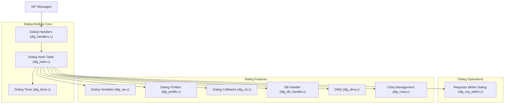
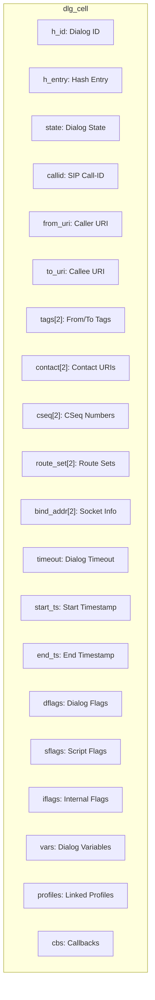
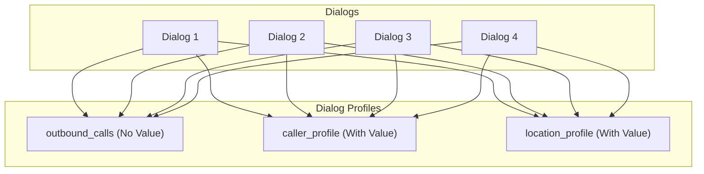
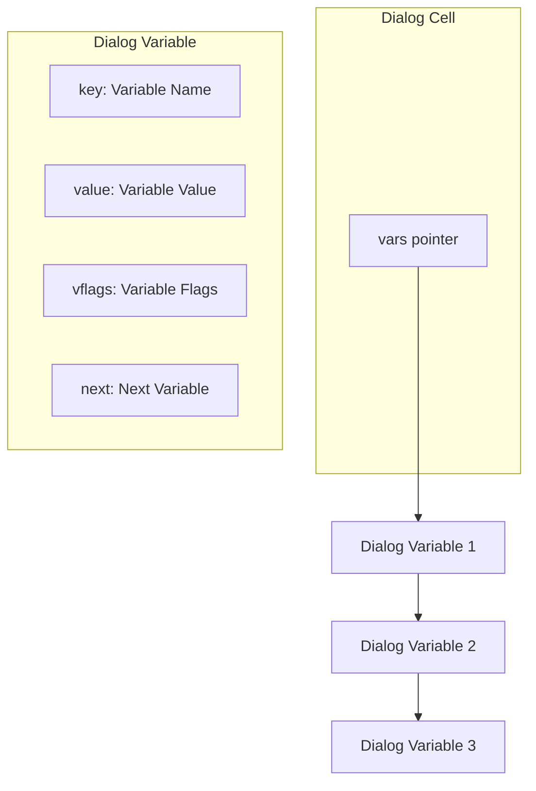
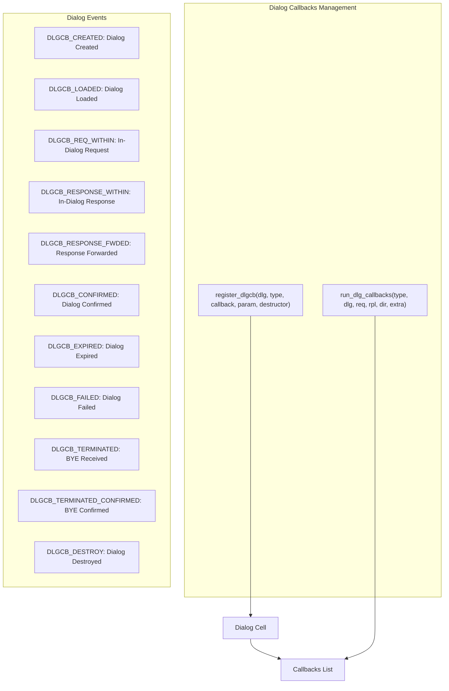
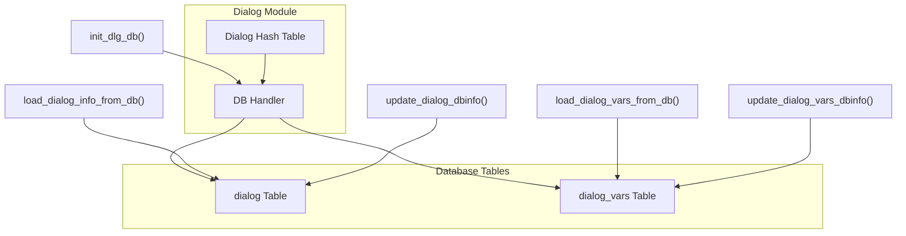
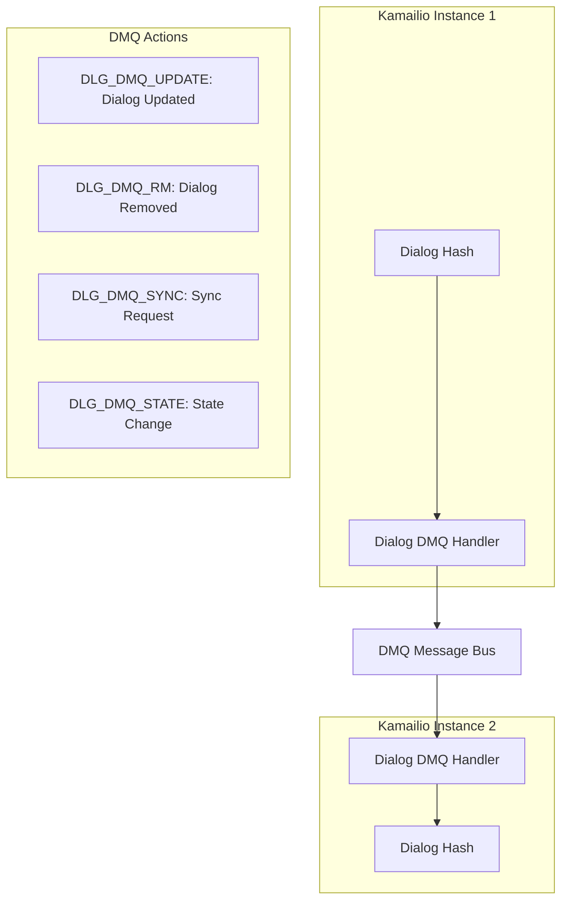
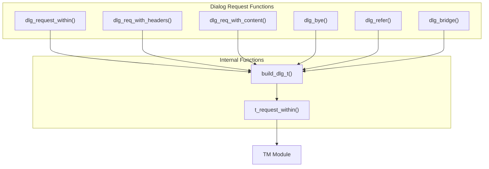
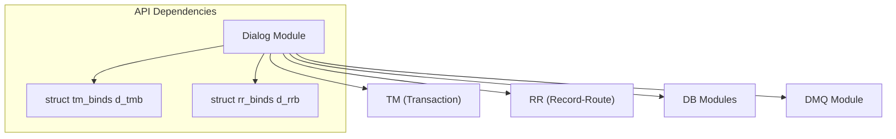

# Dialog Module

> **Relevant source files**
> * [src/modules/dialog/Makefile](https://github.com/kamailio/kamailio/blob/2b4e9f8b/src/modules/dialog/Makefile)
> * [src/modules/dialog/dialog.c](https://github.com/kamailio/kamailio/blob/2b4e9f8b/src/modules/dialog/dialog.c)
> * [src/modules/dialog/dlg_cb.c](https://github.com/kamailio/kamailio/blob/2b4e9f8b/src/modules/dialog/dlg_cb.c)
> * [src/modules/dialog/dlg_cb.h](https://github.com/kamailio/kamailio/blob/2b4e9f8b/src/modules/dialog/dlg_cb.h)
> * [src/modules/dialog/dlg_cseq.c](https://github.com/kamailio/kamailio/blob/2b4e9f8b/src/modules/dialog/dlg_cseq.c)
> * [src/modules/dialog/dlg_cseq.h](https://github.com/kamailio/kamailio/blob/2b4e9f8b/src/modules/dialog/dlg_cseq.h)
> * [src/modules/dialog/dlg_db_handler.c](https://github.com/kamailio/kamailio/blob/2b4e9f8b/src/modules/dialog/dlg_db_handler.c)
> * [src/modules/dialog/dlg_db_handler.h](https://github.com/kamailio/kamailio/blob/2b4e9f8b/src/modules/dialog/dlg_db_handler.h)
> * [src/modules/dialog/dlg_dmq.c](https://github.com/kamailio/kamailio/blob/2b4e9f8b/src/modules/dialog/dlg_dmq.c)
> * [src/modules/dialog/dlg_dmq.h](https://github.com/kamailio/kamailio/blob/2b4e9f8b/src/modules/dialog/dlg_dmq.h)
> * [src/modules/dialog/dlg_handlers.c](https://github.com/kamailio/kamailio/blob/2b4e9f8b/src/modules/dialog/dlg_handlers.c)
> * [src/modules/dialog/dlg_handlers.h](https://github.com/kamailio/kamailio/blob/2b4e9f8b/src/modules/dialog/dlg_handlers.h)
> * [src/modules/dialog/dlg_hash.c](https://github.com/kamailio/kamailio/blob/2b4e9f8b/src/modules/dialog/dlg_hash.c)
> * [src/modules/dialog/dlg_hash.h](https://github.com/kamailio/kamailio/blob/2b4e9f8b/src/modules/dialog/dlg_hash.h)
> * [src/modules/dialog/dlg_load.h](https://github.com/kamailio/kamailio/blob/2b4e9f8b/src/modules/dialog/dlg_load.h)
> * [src/modules/dialog/dlg_profile.c](https://github.com/kamailio/kamailio/blob/2b4e9f8b/src/modules/dialog/dlg_profile.c)
> * [src/modules/dialog/dlg_profile.h](https://github.com/kamailio/kamailio/blob/2b4e9f8b/src/modules/dialog/dlg_profile.h)
> * [src/modules/dialog/dlg_req_within.c](https://github.com/kamailio/kamailio/blob/2b4e9f8b/src/modules/dialog/dlg_req_within.c)
> * [src/modules/dialog/dlg_req_within.h](https://github.com/kamailio/kamailio/blob/2b4e9f8b/src/modules/dialog/dlg_req_within.h)
> * [src/modules/dialog/dlg_timer.c](https://github.com/kamailio/kamailio/blob/2b4e9f8b/src/modules/dialog/dlg_timer.c)
> * [src/modules/dialog/dlg_timer.h](https://github.com/kamailio/kamailio/blob/2b4e9f8b/src/modules/dialog/dlg_timer.h)
> * [src/modules/dialog/dlg_var.c](https://github.com/kamailio/kamailio/blob/2b4e9f8b/src/modules/dialog/dlg_var.c)
> * [src/modules/dialog/dlg_var.h](https://github.com/kamailio/kamailio/blob/2b4e9f8b/src/modules/dialog/dlg_var.h)
> * [src/modules/dialog/doc/dialog.xml](https://github.com/kamailio/kamailio/blob/2b4e9f8b/src/modules/dialog/doc/dialog.xml)
> * [src/modules/dialog/doc/dialog_admin.xml](https://github.com/kamailio/kamailio/blob/2b4e9f8b/src/modules/dialog/doc/dialog_admin.xml)
> * [src/modules/dialog/doc/dialog_devel.xml](https://github.com/kamailio/kamailio/blob/2b4e9f8b/src/modules/dialog/doc/dialog_devel.xml)

## Purpose and Scope

The Dialog Module provides dialog awareness to the Kamailio SIP proxy server. While Kamailio can act as a stateful proxy through the Transaction Module (TM), that only handles transaction state, not dialog state. This module tracks complete SIP dialogs (calls) across multiple transactions, enabling dialog-oriented functionality like:

* Tracking active calls and their properties
* Limiting concurrent calls per user/endpoint
* Attaching custom variables to dialogs
* Running callbacks on dialog creation/termination
* Categorizing dialogs into profiles for group operations

For Transaction Management, see [TM Module](/kamailio/kamailio/2.2-transaction-management).
For Record-Route handling, see [RR Module](/kamailio/kamailio/3.1-module-architecture).

## Dialog Module Architecture

### Core Components



Sources: [src/modules/dialog/dlg_hash.c](https://github.com/kamailio/kamailio/blob/2b4e9f8b/src/modules/dialog/dlg_hash.c)

 [src/modules/dialog/dlg_handlers.c](https://github.com/kamailio/kamailio/blob/2b4e9f8b/src/modules/dialog/dlg_handlers.c)

 [src/modules/dialog/dlg_timer.c](https://github.com/kamailio/kamailio/blob/2b4e9f8b/src/modules/dialog/dlg_timer.c)

 [src/modules/dialog/dlg_var.c](https://github.com/kamailio/kamailio/blob/2b4e9f8b/src/modules/dialog/dlg_var.c)

 [src/modules/dialog/dlg_profile.c](https://github.com/kamailio/kamailio/blob/2b4e9f8b/src/modules/dialog/dlg_profile.c)

 [src/modules/dialog/dlg_cb.c](https://github.com/kamailio/kamailio/blob/2b4e9f8b/src/modules/dialog/dlg_cb.c)

 [src/modules/dialog/dlg_db_handler.c](https://github.com/kamailio/kamailio/blob/2b4e9f8b/src/modules/dialog/dlg_db_handler.c)

 [src/modules/dialog/dlg_dmq.c](https://github.com/kamailio/kamailio/blob/2b4e9f8b/src/modules/dialog/dlg_dmq.c)

 [src/modules/dialog/dlg_cseq.c](https://github.com/kamailio/kamailio/blob/2b4e9f8b/src/modules/dialog/dlg_cseq.c)

 [src/modules/dialog/dlg_req_within.c](https://github.com/kamailio/kamailio/blob/2b4e9f8b/src/modules/dialog/dlg_req_within.c)

### Dialog States and Lifecycle

```

```

Sources: [src/modules/dialog/doc/dialog_admin.xml L62-L86](https://github.com/kamailio/kamailio/blob/2b4e9f8b/src/modules/dialog/doc/dialog_admin.xml#L62-L86)

 [src/modules/dialog/dlg_hash.h L43-L47](https://github.com/kamailio/kamailio/blob/2b4e9f8b/src/modules/dialog/dlg_hash.h#L43-L47)

### Dialog Hash Table Structure

The dialog module organizes dialogs in a hash table for efficient lookup:

```mermaid
flowchart TD

lockN["Mutex Lock"]
firstN["First Dialog Pointer"]
next_idN["Next ID Counter"]
lock1["Mutex Lock"]
first1["First Dialog Pointer"]
dlgC["dlg_cell C"]
next_id1["Next ID Counter"]
lock0["Mutex Lock"]
first0["First Dialog Pointer"]
dlgA["dlg_cell A"]
dlgB["dlg_cell B"]
next_id0["Next ID Counter"]
entries["Hash Table Entries"]
dlg_entry["N"]

entries --> dlg_entry
entries --> dlg_entry
entries --> dlg_entry

subgraph dlg_table ["dlg_table"]
    entries
end

subgraph dlg_entry[N] ["dlg_entry[N]"]
    lockN
    firstN
    next_idN
end

subgraph dlg_entry[1] ["dlg_entry[1]"]
    lock1
    first1
    dlgC
    next_id1
    first1 --> dlgC
end

subgraph dlg_entry[0] ["dlg_entry[0]"]
    lock0
    first0
    dlgA
    dlgB
    next_id0
    first0 --> dlgA
    dlgA --> dlgB
end
```

Sources: [src/modules/dialog/dlg_hash.c L271-L332](https://github.com/kamailio/kamailio/blob/2b4e9f8b/src/modules/dialog/dlg_hash.c#L271-L332)

 [src/modules/dialog/dlg_hash.h L169-L202](https://github.com/kamailio/kamailio/blob/2b4e9f8b/src/modules/dialog/dlg_hash.h#L169-L202)

### Dialog Cell Structure

Each dialog is represented by a `dlg_cell` structure containing all dialog data:



Sources: [src/modules/dialog/dlg_hash.h L104-L166](https://github.com/kamailio/kamailio/blob/2b4e9f8b/src/modules/dialog/dlg_hash.h#L104-L166)

## Dialog Features

### Dialog Profiling

Dialog profiling allows categorizing dialogs for tracking and management. There are two profile types:

1. **Profiles without value** - Simple categories (e.g., "outbound_calls")
2. **Profiles with value** - Key-based categorization (e.g., "caller_profile:123456")



Sources: [src/modules/dialog/dlg_profile.c L23-L142](https://github.com/kamailio/kamailio/blob/2b4e9f8b/src/modules/dialog/dlg_profile.c#L23-L142)

 [src/modules/dialog/doc/dialog_admin.xml L89-L132](https://github.com/kamailio/kamailio/blob/2b4e9f8b/src/modules/dialog/doc/dialog_admin.xml#L89-L132)

Functions for dialog profiling:

* `set_dlg_profile(profile[, value])` - Add dialog to a profile
* `unset_dlg_profile(profile[, value])` - Remove dialog from a profile
* `is_in_profile(profile[, value])` - Check if dialog is in a profile
* `get_profile_size(profile, size_pvar[, value])` - Get number of dialogs in a profile

### Dialog Variables

Dialog variables allow attaching key-value data to a dialog:



Sources: [src/modules/dialog/dlg_var.c L23-L154](https://github.com/kamailio/kamailio/blob/2b4e9f8b/src/modules/dialog/dlg_var.c#L23-L154)

 [src/modules/dialog/dlg_var.h L56-L61](https://github.com/kamailio/kamailio/blob/2b4e9f8b/src/modules/dialog/dlg_var.h#L56-L61)

Accessible in Kamailio configuration as `$dlg_var(key)` or through API functions:

* `dlg_get_var(dlg, key, val)` - Get variable value
* `dlg_set_var(dlg, key, val)` - Set variable value

### Dialog Callbacks

The dialog module provides a callback system to notify other modules about dialog events:



Sources: [src/modules/dialog/dlg_cb.c](https://github.com/kamailio/kamailio/blob/2b4e9f8b/src/modules/dialog/dlg_cb.c)

 [src/modules/dialog/dlg_cb.h L31-L56](https://github.com/kamailio/kamailio/blob/2b4e9f8b/src/modules/dialog/dlg_cb.h#L31-L56)

Callback registration function:

* `register_dlgcb(dlg, types, callback, param, destructor)` - Register callback function

### Database Integration

Dialog module can store dialogs to a database for persistence across restarts. Database modes:

* **DB_MODE_NONE (0)** - No database storage
* **DB_MODE_REALTIME (1)** - Real-time updates
* **DB_MODE_DELAYED (2)** - Periodic updates
* **DB_MODE_SHUTDOWN (3)** - Save only on shutdown



Sources: [src/modules/dialog/dlg_db_handler.c L31-L595](https://github.com/kamailio/kamailio/blob/2b4e9f8b/src/modules/dialog/dlg_db_handler.c#L31-L595)

Key database parameters:

* `db_url` - Database URL
* `db_mode` - Database mode (0-3)
* `db_update_period` - Update interval for DB_MODE_DELAYED
* `table_name` - Dialog table name (default: "dialog")
* `vars_table_name` - Variables table name (default: "dialog_vars")

### DMQ Integration

Dialog module can synchronize dialogs across multiple Kamailio instances using DMQ (Distributed Message Queue):



Sources: [src/modules/dialog/dlg_dmq.c L23-L85](https://github.com/kamailio/kamailio/blob/2b4e9f8b/src/modules/dialog/dlg_dmq.c#L23-L85)

Key DMQ parameters:

* `enable_dmq` - Enable DMQ integration (0/1)

## Dialog Creation and Management

### Dialog Creation Process

The dialog creation process starts with the `dlg_manage()` function and involves several steps:

```mermaid
sequenceDiagram
  participant Kamailio Script
  participant dlg_manage()
  participant dlg_hash.c
  participant dlg_timer.c
  participant TM Module
  participant RR Module

  Kamailio Script->>dlg_manage(): dlg_manage()
  dlg_manage()->>dlg_hash.c: create_new_dlg_from_msg()
  dlg_hash.c-->>dlg_manage(): dlg cell
  dlg_manage()->>RR Module: add_dlg_rr_param()
  dlg_manage()->>TM Module: dlg_set_tm_callbacks()
  dlg_manage()->>dlg_hash.c: link_dlg()
  dlg_manage()->>dlg_timer.c: insert_dlg_timer()
  dlg_manage()-->>Kamailio Script: Dialog created
```

Sources: [src/modules/dialog/dlg_handlers.c L779-L825](https://github.com/kamailio/kamailio/blob/2b4e9f8b/src/modules/dialog/dlg_handlers.c#L779-L825)

 [src/modules/dialog/dialog.c L1167-L1168](https://github.com/kamailio/kamailio/blob/2b4e9f8b/src/modules/dialog/dialog.c#L1167-L1168)

### Dialog Requests Within

The module allows sending SIP requests within an established dialog:



Sources: [src/modules/dialog/dlg_req_within.c L31-L743](https://github.com/kamailio/kamailio/blob/2b4e9f8b/src/modules/dialog/dlg_req_within.c#L31-L743)

## Key Functions and Configuration

### Dialog Management Functions

* `dlg_manage()` - Create and track dialog for a new INVITE
* `is_known_dlg()` - Check if request belongs to tracked dialog
* `dlg_bye([side])` - Send BYE to terminate dialog
* `dlg_refer(side, uri)` - Send REFER within dialog
* `dlg_bridge(party, destination, headers)` - Bridge dialog to new destination
* `dlg_get(identifier, group, variables)` - Find dialog by ID

### Dialog Properties and Flags

* `dlg_set_timeout(timeout[, h_entry, h_id])` - Set dialog timeout
* `dlg_set_timeout_by_profile(profile, timeout[, value])` - Set timeout for dialogs in profile
* `dlg_setflag(flag)` - Set dialog flag
* `dlg_resetflag(flag)` - Reset dialog flag
* `dlg_isflagset(flag)` - Check dialog flag
* `dlg_set_property(property)` - Set dialog property
* `dlg_reset_property(property)` - Reset dialog property

### Profile Management

* `set_dlg_profile(profile[, value])` - Add dialog to profile
* `unset_dlg_profile(profile[, value])` - Remove dialog from profile
* `is_in_profile(profile[, value])` - Check if dialog in profile
* `get_profile_size(profile, result[, value])` - Get profile size

### Dialog Variables

* `$dlg_var(name)` - Access dialog variable
* `dlg_get_var(dlg, key, val)` - Get variable value (API)
* `dlg_set_var(dlg, key, val)` - Set variable value (API)

### Dialog States API

* `dlg_set_state(state)` - Set dialog state
* `dlg_update_state()` - Update dialog state based on message

Sources: [src/modules/dialog/dialog.c L235-L308](https://github.com/kamailio/kamailio/blob/2b4e9f8b/src/modules/dialog/dialog.c#L235-L308)

 [src/modules/dialog/doc/dialog_admin.xml L1282-L2056](https://github.com/kamailio/kamailio/blob/2b4e9f8b/src/modules/dialog/doc/dialog_admin.xml#L1282-L2056)

## Key Module Parameters

| Parameter | Type | Default | Description |
| --- | --- | --- | --- |
| `enable_stats` | int | 1 | Enable/disable statistics |
| `hash_size` | int | 4096 | Size of dialog hash table |
| `rr_param` | string | "did" | Record-Route parameter for dialog tracking |
| `default_timeout` | int | 43200 (12h) | Default dialog timeout in seconds |
| `timeout_avp` | string | NULL | AVP for per-dialog timeout |
| `dlg_extra_hdrs` | string | NULL | Extra headers for locally generated requests |
| `dlg_match_mode` | int | 0 | Dialog matching mode (0=DID_ONLY, 1=DID_FALLBACK, 2=DID_NONE) |
| `detect_spirals` | int | 1 | Detect spirals (0/1) |
| `db_url` | string | NULL | Database URL |
| `db_mode` | int | 0 | Database mode (0=NONE, 1=REALTIME, 2=DELAYED, 3=SHUTDOWN) |
| `early_timeout` | int | 300 | Timeout for early dialogs (seconds) |
| `noack_timeout` | int | 60 | Timeout for unacknowledged dialogs (seconds) |
| `end_timeout` | int | 300 | Timeout for terminated dialogs before removal |
| `send_bye` | int | 0 | Send BYE on timeout (0/1) |
| `wait_ack` | int | 1 | Wait for ACK (0/1) |
| `profiles_with_value` | string | NULL | Profiles with value (comma separated) |
| `profiles_no_value` | string | NULL | Profiles without value (comma separated) |
| `enable_dmq` | int | 0 | Enable DMQ integration (0/1) |

Sources: [src/modules/dialog/dialog.c L313-L387](https://github.com/kamailio/kamailio/blob/2b4e9f8b/src/modules/dialog/dialog.c#L313-L387)

 [src/modules/dialog/doc/dialog_admin.xml L180-L1282](https://github.com/kamailio/kamailio/blob/2b4e9f8b/src/modules/dialog/doc/dialog_admin.xml#L180-L1282)

## Integration with Other Modules

The Dialog Module integrates with several other Kamailio modules:



Sources: [src/modules/dialog/dialog.c L58-L74](https://github.com/kamailio/kamailio/blob/2b4e9f8b/src/modules/dialog/dialog.c#L58-L74)

 [src/modules/dialog/dialog.c L653-L663](https://github.com/kamailio/kamailio/blob/2b4e9f8b/src/modules/dialog/dialog.c#L653-L663)

### TM Module Integration

* Transaction state handling
* Dialog creation on transaction start
* Dialog termination on transaction failure
* Transaction callbacks for dialog updates

### RR Module Integration

* Record-Route parameter for dialog matching
* Route set handling for in-dialog requests

### DB Module Integration

* Dialog storage and retrieval
* Dialog variables storage
* Different database modes (REALTIME, DELAYED, SHUTDOWN)

### DMQ Module Integration

* Dialog synchronization across multiple Kamailio instances
* Action synchronization (UPDATE, REMOVE, STATE, SYNC)

Sources: [src/modules/dialog/dialog.c L138-L510](https://github.com/kamailio/kamailio/blob/2b4e9f8b/src/modules/dialog/dialog.c#L138-L510)