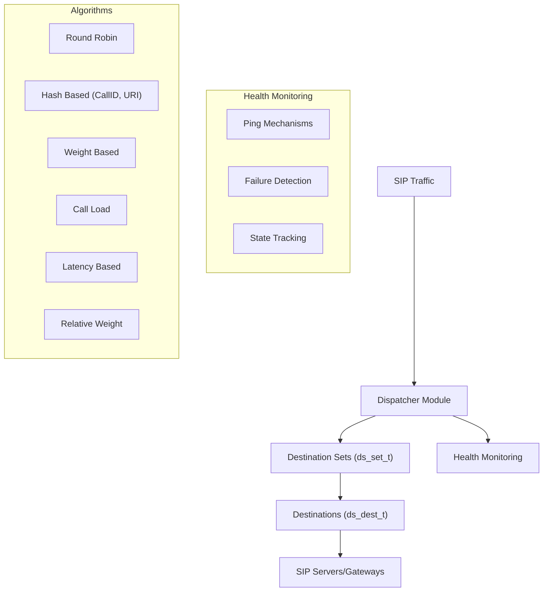
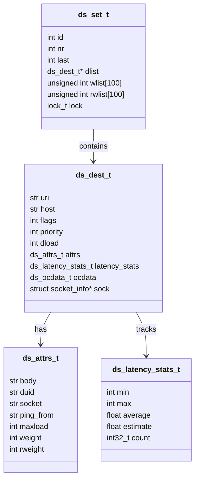
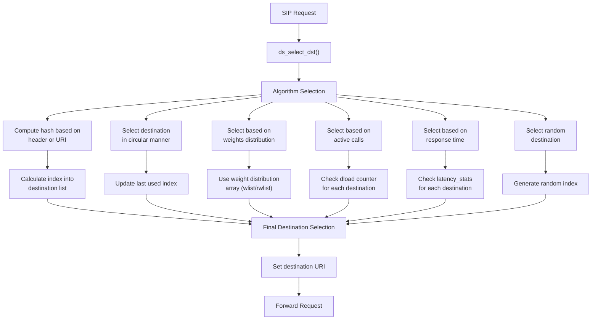
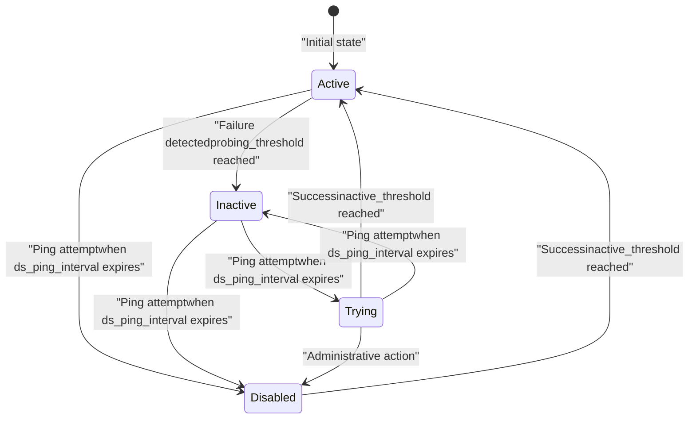
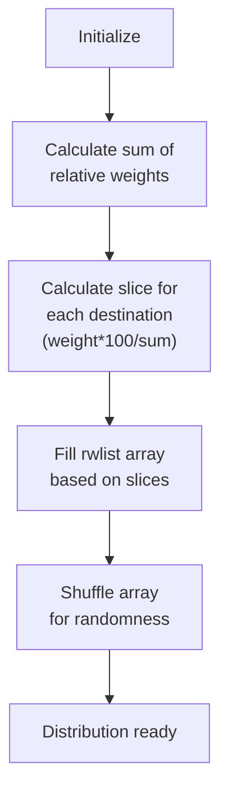

# Dispatcher Module

> **Relevant source files**
> * [src/modules/acc/README](https://github.com/kamailio/kamailio/blob/2b4e9f8b/src/modules/acc/README)
> * [src/modules/app_perl/README](https://github.com/kamailio/kamailio/blob/2b4e9f8b/src/modules/app_perl/README)
> * [src/modules/cdp/README](https://github.com/kamailio/kamailio/blob/2b4e9f8b/src/modules/cdp/README)
> * [src/modules/cdp_avp/README](https://github.com/kamailio/kamailio/blob/2b4e9f8b/src/modules/cdp_avp/README)
> * [src/modules/dialog/README](https://github.com/kamailio/kamailio/blob/2b4e9f8b/src/modules/dialog/README)
> * [src/modules/dispatcher/Makefile](https://github.com/kamailio/kamailio/blob/2b4e9f8b/src/modules/dispatcher/Makefile)
> * [src/modules/dispatcher/README](https://github.com/kamailio/kamailio/blob/2b4e9f8b/src/modules/dispatcher/README)
> * [src/modules/dispatcher/api.h](https://github.com/kamailio/kamailio/blob/2b4e9f8b/src/modules/dispatcher/api.h)
> * [src/modules/dispatcher/config.c](https://github.com/kamailio/kamailio/blob/2b4e9f8b/src/modules/dispatcher/config.c)
> * [src/modules/dispatcher/config.h](https://github.com/kamailio/kamailio/blob/2b4e9f8b/src/modules/dispatcher/config.h)
> * [src/modules/dispatcher/dispatch.c](https://github.com/kamailio/kamailio/blob/2b4e9f8b/src/modules/dispatcher/dispatch.c)
> * [src/modules/dispatcher/dispatch.h](https://github.com/kamailio/kamailio/blob/2b4e9f8b/src/modules/dispatcher/dispatch.h)
> * [src/modules/dispatcher/dispatcher.c](https://github.com/kamailio/kamailio/blob/2b4e9f8b/src/modules/dispatcher/dispatcher.c)
> * [src/modules/dispatcher/doc/dispatcher.cfg](https://github.com/kamailio/kamailio/blob/2b4e9f8b/src/modules/dispatcher/doc/dispatcher.cfg)
> * [src/modules/dispatcher/doc/dispatcher.list](https://github.com/kamailio/kamailio/blob/2b4e9f8b/src/modules/dispatcher/doc/dispatcher.list)
> * [src/modules/dispatcher/doc/dispatcher.xml](https://github.com/kamailio/kamailio/blob/2b4e9f8b/src/modules/dispatcher/doc/dispatcher.xml)
> * [src/modules/dispatcher/doc/dispatcher_admin.xml](https://github.com/kamailio/kamailio/blob/2b4e9f8b/src/modules/dispatcher/doc/dispatcher_admin.xml)
> * [src/modules/dispatcher/ds_ht.c](https://github.com/kamailio/kamailio/blob/2b4e9f8b/src/modules/dispatcher/ds_ht.c)
> * [src/modules/dispatcher/ds_ht.h](https://github.com/kamailio/kamailio/blob/2b4e9f8b/src/modules/dispatcher/ds_ht.h)
> * [src/modules/ims_dialog/README](https://github.com/kamailio/kamailio/blob/2b4e9f8b/src/modules/ims_dialog/README)
> * [src/modules/ims_registrar_scscf/README](https://github.com/kamailio/kamailio/blob/2b4e9f8b/src/modules/ims_registrar_scscf/README)
> * [src/modules/ims_usrloc_pcscf/README](https://github.com/kamailio/kamailio/blob/2b4e9f8b/src/modules/ims_usrloc_pcscf/README)
> * [src/modules/nathelper/README](https://github.com/kamailio/kamailio/blob/2b4e9f8b/src/modules/nathelper/README)
> * [src/modules/registrar/README](https://github.com/kamailio/kamailio/blob/2b4e9f8b/src/modules/registrar/README)
> * [src/modules/rtpengine/README](https://github.com/kamailio/kamailio/blob/2b4e9f8b/src/modules/rtpengine/README)
> * [src/modules/rtpproxy/README](https://github.com/kamailio/kamailio/blob/2b4e9f8b/src/modules/rtpproxy/README)
> * [src/modules/snmpstats/README](https://github.com/kamailio/kamailio/blob/2b4e9f8b/src/modules/snmpstats/README)

The Dispatcher Module provides SIP load balancing and traffic distribution for Kamailio. It supports multiple load balancing algorithms including round-robin, weight-based load balancing, call load distribution, and hashing over SIP message attributes. This lightweight module can be used as a stateless load balancer without dependence on call state tracking modules, making it suitable for handling heavy SIP traffic and embedded systems. When combined with the TM module, it can perform auto-discovery of active/inactive gateways.

For information about media proxying and RTP traffic handling, see [RTPEngine Module](/kamailio/kamailio/4.3-rtpengine-module).

Sources: [src/modules/dispatcher/README L331-L344](https://github.com/kamailio/kamailio/blob/2b4e9f8b/src/modules/dispatcher/README#L331-L344)

 [src/modules/dispatcher/dispatcher.c L32-L38](https://github.com/kamailio/kamailio/blob/2b4e9f8b/src/modules/dispatcher/dispatcher.c#L32-L38)

## Architecture Overview



Sources: [src/modules/dispatcher/dispatch.h L258-L270](https://github.com/kamailio/kamailio/blob/2b4e9f8b/src/modules/dispatcher/dispatch.h#L258-L270)

 [src/modules/dispatcher/dispatch.c L71-L85](https://github.com/kamailio/kamailio/blob/2b4e9f8b/src/modules/dispatcher/dispatch.c#L71-L85)

The dispatcher module maintains sets of destinations organized by group IDs. When processing SIP traffic, it selects a destination from the specified set based on the chosen algorithm and forwards the request. The module can also monitor the health of destinations and mark them as inactive if they fail to respond.

## Data Structures

### Core Data Structures



Sources: [src/modules/dispatcher/dispatch.h L198-L270](https://github.com/kamailio/kamailio/blob/2b4e9f8b/src/modules/dispatcher/dispatch.h#L198-L270)

* **ds_set_t**: Represents a group of destinations identified by a set ID
* **ds_dest_t**: Represents a destination with its URI, flags, priority, and other properties
* **ds_attrs_t**: Contains attributes for a destination such as weight, max load, etc.
* **ds_latency_stats_t**: Tracks latency statistics for a destination

## Load Balancing Algorithms

The dispatcher module supports multiple algorithms for selecting destinations:

| Algorithm ID | Name | Description |
| --- | --- | --- |
| 0 | DS_ALG_HASHCALLID | Hash over Call-ID header |
| 1 | DS_ALG_HASHFROMURI | Hash over From URI |
| 2 | DS_ALG_HASHTOURI | Hash over To URI |
| 3 | DS_ALG_HASHRURI | Hash over Request URI |
| 4 | DS_ALG_ROUNDROBIN | Round Robin selection |
| 5 | DS_ALG_HASHAUTHUSER | Hash over Authentication Username |
| 6 | DS_ALG_RANDOM | Random selection |
| 7 | DS_ALG_HASHPV | Hash over a pseudo-variable |
| 8 | DS_ALG_SERIAL | Serial forking |
| 9 | DS_ALG_WEIGHT | Weight-based distribution |
| 10 | DS_ALG_CALLLOAD | Call load distribution |
| 11 | DS_ALG_RELWEIGHT | Relative weight distribution |
| 12 | DS_ALG_PARALLEL | Parallel forking |
| 13 | DS_ALG_LATENCY | Latency-based distribution |

Sources: [src/modules/dispatcher/dispatch.c L71-L85](https://github.com/kamailio/kamailio/blob/2b4e9f8b/src/modules/dispatcher/dispatch.c#L71-L85)

### Algorithm Selection Workflow



Sources: [src/modules/dispatcher/dispatch.c L454-L456](https://github.com/kamailio/kamailio/blob/2b4e9f8b/src/modules/dispatcher/dispatch.c#L454-L456)

 [src/modules/dispatcher/dispatch.c L935-L992](https://github.com/kamailio/kamailio/blob/2b4e9f8b/src/modules/dispatcher/dispatch.c#L935-L992)

## Destination States and Health Monitoring

The dispatcher module monitors the health of destinations and maintains their state:

| State Flag | Value | Description |
| --- | --- | --- |
| DS_INACTIVE_DST | 1 | Inactive destination |
| DS_TRYING_DST | 2 | Temporary trying destination |
| DS_DISABLED_DST | 4 | Administratively disabled destination |
| DS_PROBING_DST | 8 | Destination being checked |
| DS_NODNSARES_DST | 16 | No DNS A/AAAA resolve for host in URI |
| DS_NOPING_DST | 32 | No ping to destination |

Sources: [src/modules/dispatcher/dispatch.h L45-L51](https://github.com/kamailio/kamailio/blob/2b4e9f8b/src/modules/dispatcher/dispatch.h#L45-L51)

### State Transitions



Sources: [src/modules/dispatcher/dispatch.c L156-L177](https://github.com/kamailio/kamailio/blob/2b4e9f8b/src/modules/dispatcher/dispatch.c#L156-L177)

 [src/modules/dispatcher/dispatch.c L538-L546](https://github.com/kamailio/kamailio/blob/2b4e9f8b/src/modules/dispatcher/dispatch.c#L538-L546)

### Ping Mechanisms

The module supports two types of NAT pings:

1. **UDP packet**: 4-byte UDP packets sent to destination (low bandwidth, unidirectional)
2. **SIP OPTIONS**: SIP request sent to destination (bidirectional, ensures NAT binding stays open)

The pinging process is controlled by parameters like:

* `ds_ping_interval`: How often to ping destinations
* `ds_probing_threshold`: Number of failures before marking a destination as inactive
* `ds_inactive_threshold`: Number of successes before marking a destination as active again
* `ds_probing_mode`: Controls which destinations are probed

Sources: [src/modules/dispatcher/README L202-L220](https://github.com/kamailio/kamailio/blob/2b4e9f8b/src/modules/dispatcher/README#L202-L220)

 [src/modules/dispatcher/dispatch.c L180-L187](https://github.com/kamailio/kamailio/blob/2b4e9f8b/src/modules/dispatcher/dispatch.c#L180-L187)

## Configuration

The dispatcher module can be configured to load destinations from a file or a database:

### File-based Configuration

Destinations are loaded from a text file with the following format:

```
setid destination flags priority attributes
```

Example:

```
1 sip:192.168.1.1:5060 0 0 duid=xyz;weight=10
1 sip:192.168.1.2:5060 0 0 duid=abc;weight=20
2 sip:10.0.0.1:5060 0 0
```

Sources: [src/modules/dispatcher/README L1143-L1147](https://github.com/kamailio/kamailio/blob/2b4e9f8b/src/modules/dispatcher/README#L1143-L1147)

### Database Configuration

Destinations can be loaded from a database table with columns for:

* setid
* destination
* flags
* priority
* attributes

Sources: [src/modules/dispatcher/dispatch.c L1178-L1181](https://github.com/kamailio/kamailio/blob/2b4e9f8b/src/modules/dispatcher/dispatch.c#L1178-L1181)

 [src/modules/dispatcher/README L1237-L1239](https://github.com/kamailio/kamailio/blob/2b4e9f8b/src/modules/dispatcher/README#L1237-L1239)

## Key Functions

The module provides several functions for use in the routing script:

| Function | Description |
| --- | --- |
| `ds_select_dst(set, alg [, limit])` | Select a destination from the set using the specified algorithm |
| `ds_select_domain(set, alg [, limit])` | Select a domain (host part only) from the set |
| `ds_next_dst()` | Select the next destination from the set (failover) |
| `ds_next_domain()` | Select the next domain from the set (failover) |
| `ds_mark_dst([state])` | Mark a destination with the specified state |
| `ds_is_from_list([groupid [, mode [, uri]]])` | Check if a URI is in a dispatcher set |
| `ds_list_exists(groupid)` | Check if a dispatcher set exists |
| `ds_reload()` | Reload the dispatcher destinations |

Sources: [src/modules/dispatcher/README L109-L128](https://github.com/kamailio/kamailio/blob/2b4e9f8b/src/modules/dispatcher/README#L109-L128)

 [src/modules/dispatcher/dispatch.c L151-L192](https://github.com/kamailio/kamailio/blob/2b4e9f8b/src/modules/dispatcher/dispatch.c#L151-L192)

## Usage Example

A typical usage of the dispatcher module in a Kamailio configuration script:

```markdown
loadmodule "dispatcher.so"

# Parameters
modparam("dispatcher", "list_file", "/etc/kamailio/dispatcher.list")
modparam("dispatcher", "flags", 2)  # Enable failover
modparam("dispatcher", "ds_ping_interval", 30)
modparam("dispatcher", "ds_probing_threshold", 3)

# Main request routing
request_route {
    if (is_method("INVITE|REGISTER")) {
        # Use round-robin algorithm (4) for set 1
        if (ds_select_dst(1, 4)) {
            route(RELAY);
        } else {
            send_reply("500", "No destination available");
        }
    }
}

failure_route[MANAGE_FAILURE] {
    if (t_is_canceled()) {
        exit;
    }
    
    # Try next destination on failure
    if (ds_next_dst()) {
        route(RELAY);
    } else {
        send_reply("500", "All destinations failed");
    }
}
```

Sources: [src/modules/dispatcher/doc/dispatcher.cfg L93-L172](https://github.com/kamailio/kamailio/blob/2b4e9f8b/src/modules/dispatcher/doc/dispatcher.cfg#L93-L172)

## Destination Attributes

Destinations can have various attributes:

| Attribute | Description |
| --- | --- |
| duid | Destination Unique ID |
| weight | Weight for weight-based algorithm (1-100) |
| rweight | Relative weight (1-100) |
| maxload | Maximum number of simultaneous calls |
| socket | Socket to use for sending requests |
| ping_from | From header to use in ping requests |
| latency | Initial latency value for statistics |

Sources: [src/modules/dispatcher/dispatch.c L332-L436](https://github.com/kamailio/kamailio/blob/2b4e9f8b/src/modules/dispatcher/dispatch.c#L332-L436)

## Call Load Distribution

Call load distribution (algorithm 10) tracks the number of active calls to each destination. When a call starts, the load counter for the selected destination is incremented. When the call ends, the counter is decremented.

This requires setting up the hash table size:

```markdown
modparam("dispatcher", "ds_hash_size", 9)  # 2^9 = 512 slots
```

And processing the transaction responses:

```
onreply_route {
    if (t_check_status("200")) {
        ds_load_update();
    }
}

failure_route [MANAGE_FAILURE] {
    ds_load_unset();
}
```

Sources: [src/modules/dispatcher/README L829-L835](https://github.com/kamailio/kamailio/blob/2b4e9f8b/src/modules/dispatcher/README#L829-L835)

 [src/modules/dispatcher/dispatch.c L168-L172](https://github.com/kamailio/kamailio/blob/2b4e9f8b/src/modules/dispatcher/dispatch.c#L168-L172)

## Relative Weight Algorithm

The relative weight algorithm (11) distributes traffic based on the relative weights of active destinations. It's similar to the weight-based algorithm but dynamically adjusts when destinations become active/inactive.



Sources: [src/modules/dispatcher/dispatch.c L848-L927](https://github.com/kamailio/kamailio/blob/2b4e9f8b/src/modules/dispatcher/dispatch.c#L848-L927)

## Latency-Based Algorithm

The latency-based algorithm (13) selects destinations based on their response time statistics. It calculates an Exponential Weighted Moving Average (EWMA) of the latency for each destination.

The module can track various latency metrics:

* Minimum/maximum latency
* Average latency
* Estimated latency (short-term)

These statistics can be viewed using RPC commands or used for destination selection.

Sources: [src/modules/dispatcher/dispatch.c L705-L761](https://github.com/kamailio/kamailio/blob/2b4e9f8b/src/modules/dispatcher/dispatch.c#L705-L761)

 [src/modules/dispatcher/README L742-L747](https://github.com/kamailio/kamailio/blob/2b4e9f8b/src/modules/dispatcher/README#L742-L747)

## Conclusion

The Dispatcher Module is a powerful component for SIP load balancing and high availability in Kamailio. It offers multiple algorithms, health monitoring, and flexible configuration options. By selecting appropriate algorithms and parameters, you can build robust SIP routing solutions that distribute traffic efficiently and handle failures gracefully.

Sources: [src/modules/dispatcher/README L331-L344](https://github.com/kamailio/kamailio/blob/2b4e9f8b/src/modules/dispatcher/README#L331-L344)

 [src/modules/dispatcher/dispatcher.c L32-L38](https://github.com/kamailio/kamailio/blob/2b4e9f8b/src/modules/dispatcher/dispatcher.c#L32-L38)