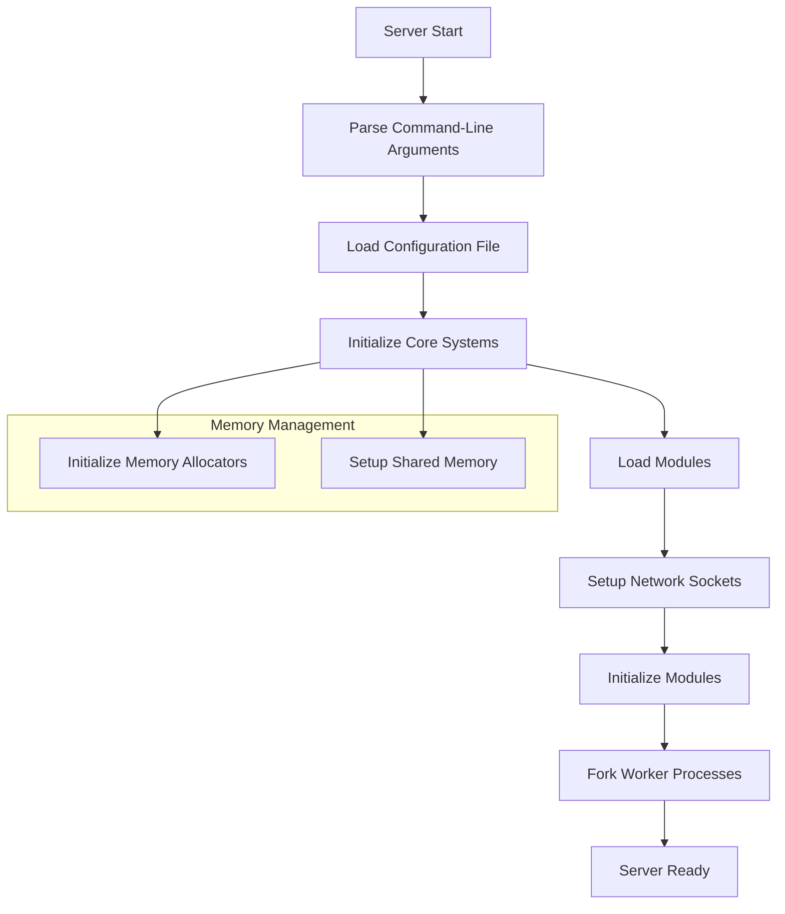
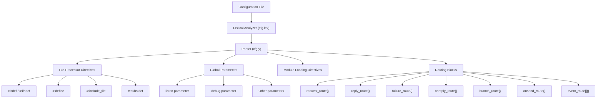
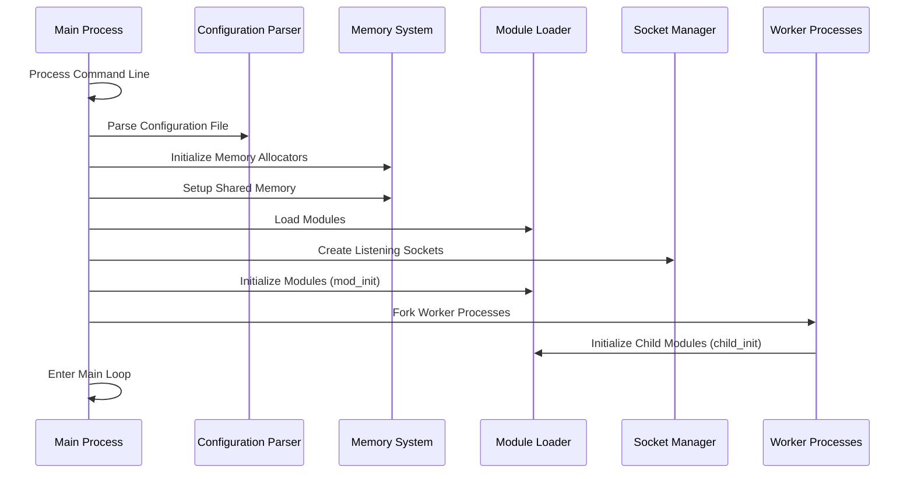
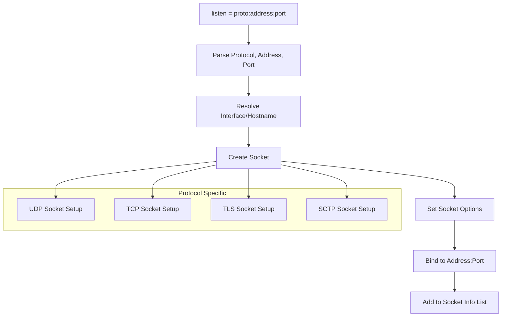
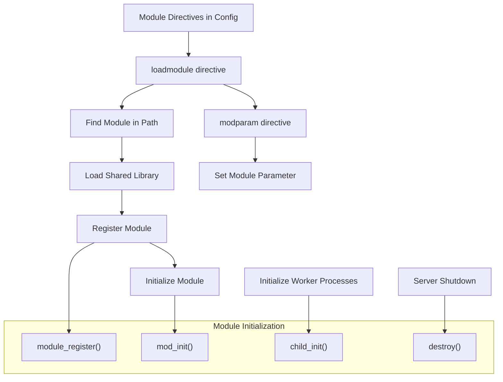
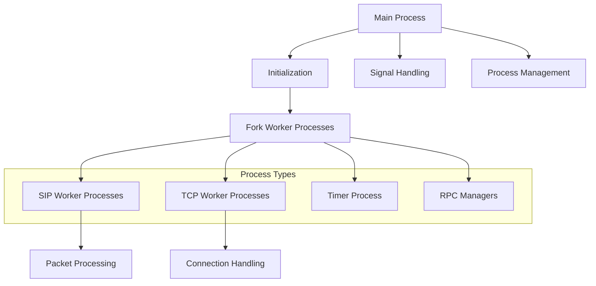
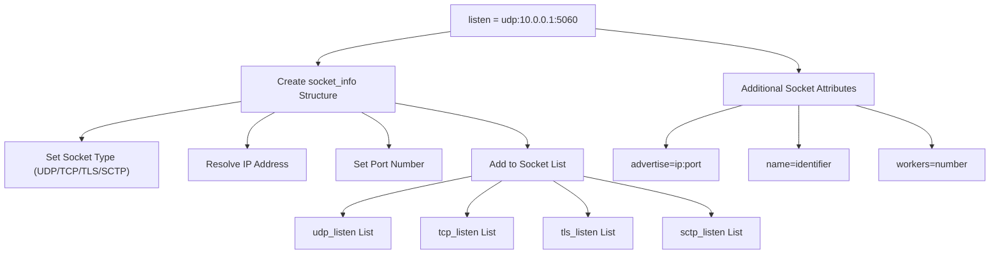

# Initialization and Configuration

> **Relevant source files**
> * [src/core/async_task.c](https://github.com/kamailio/kamailio/blob/2b4e9f8b/src/core/async_task.c)
> * [src/core/async_task.h](https://github.com/kamailio/kamailio/blob/2b4e9f8b/src/core/async_task.h)
> * [src/core/cfg.lex](https://github.com/kamailio/kamailio/blob/2b4e9f8b/src/core/cfg.lex)
> * [src/core/cfg.y](https://github.com/kamailio/kamailio/blob/2b4e9f8b/src/core/cfg.y)
> * [src/core/core_cmd.c](https://github.com/kamailio/kamailio/blob/2b4e9f8b/src/core/core_cmd.c)
> * [src/core/events.c](https://github.com/kamailio/kamailio/blob/2b4e9f8b/src/core/events.c)
> * [src/core/events.h](https://github.com/kamailio/kamailio/blob/2b4e9f8b/src/core/events.h)
> * [src/core/flags.c](https://github.com/kamailio/kamailio/blob/2b4e9f8b/src/core/flags.c)
> * [src/core/flags.h](https://github.com/kamailio/kamailio/blob/2b4e9f8b/src/core/flags.h)
> * [src/core/forward.c](https://github.com/kamailio/kamailio/blob/2b4e9f8b/src/core/forward.c)
> * [src/core/forward.h](https://github.com/kamailio/kamailio/blob/2b4e9f8b/src/core/forward.h)
> * [src/core/globals.h](https://github.com/kamailio/kamailio/blob/2b4e9f8b/src/core/globals.h)
> * [src/core/ip_addr.c](https://github.com/kamailio/kamailio/blob/2b4e9f8b/src/core/ip_addr.c)
> * [src/core/ip_addr.h](https://github.com/kamailio/kamailio/blob/2b4e9f8b/src/core/ip_addr.h)
> * [src/core/mod_fix.c](https://github.com/kamailio/kamailio/blob/2b4e9f8b/src/core/mod_fix.c)
> * [src/core/mod_fix.h](https://github.com/kamailio/kamailio/blob/2b4e9f8b/src/core/mod_fix.h)
> * [src/core/modparam.c](https://github.com/kamailio/kamailio/blob/2b4e9f8b/src/core/modparam.c)
> * [src/core/modparam.h](https://github.com/kamailio/kamailio/blob/2b4e9f8b/src/core/modparam.h)
> * [src/core/ppcfg.c](https://github.com/kamailio/kamailio/blob/2b4e9f8b/src/core/ppcfg.c)
> * [src/core/ppcfg.h](https://github.com/kamailio/kamailio/blob/2b4e9f8b/src/core/ppcfg.h)
> * [src/core/receive.c](https://github.com/kamailio/kamailio/blob/2b4e9f8b/src/core/receive.c)
> * [src/core/receive.h](https://github.com/kamailio/kamailio/blob/2b4e9f8b/src/core/receive.h)
> * [src/core/socket_info.c](https://github.com/kamailio/kamailio/blob/2b4e9f8b/src/core/socket_info.c)
> * [src/core/socket_info.h](https://github.com/kamailio/kamailio/blob/2b4e9f8b/src/core/socket_info.h)
> * [src/core/sr_module.c](https://github.com/kamailio/kamailio/blob/2b4e9f8b/src/core/sr_module.c)
> * [src/core/sr_module.h](https://github.com/kamailio/kamailio/blob/2b4e9f8b/src/core/sr_module.h)
> * [src/core/stun.c](https://github.com/kamailio/kamailio/blob/2b4e9f8b/src/core/stun.c)
> * [src/core/tcp_conn.h](https://github.com/kamailio/kamailio/blob/2b4e9f8b/src/core/tcp_conn.h)
> * [src/core/tcp_init.h](https://github.com/kamailio/kamailio/blob/2b4e9f8b/src/core/tcp_init.h)
> * [src/core/tcp_main.c](https://github.com/kamailio/kamailio/blob/2b4e9f8b/src/core/tcp_main.c)
> * [src/core/tcp_read.c](https://github.com/kamailio/kamailio/blob/2b4e9f8b/src/core/tcp_read.c)
> * [src/core/udp_server.c](https://github.com/kamailio/kamailio/blob/2b4e9f8b/src/core/udp_server.c)
> * [src/core/udp_server.h](https://github.com/kamailio/kamailio/blob/2b4e9f8b/src/core/udp_server.h)
> * [src/main.c](https://github.com/kamailio/kamailio/blob/2b4e9f8b/src/main.c)

This document describes the startup process, configuration file handling, and initialization sequence of the Kamailio SIP server. It covers how Kamailio bootstraps itself from parsing command-line arguments to becoming a fully operational SIP server with all subsystems initialized and ready to handle SIP traffic.

## Core Startup Sequence

The initialization of Kamailio follows a well-defined sequence of steps that prepare the server for operation. The main stages include command-line parsing, configuration file processing, module loading, socket initialization, and process creation.



Sources: [src/main.c L1-L1020](https://github.com/kamailio/kamailio/blob/2b4e9f8b/src/main.c#L1-L1020)

 [src/core/sr_module.c L60-L237](https://github.com/kamailio/kamailio/blob/2b4e9f8b/src/core/sr_module.c#L60-L237)

 [src/core/socket_info.c L60-L700](https://github.com/kamailio/kamailio/blob/2b4e9f8b/src/core/socket_info.c#L60-L700)

### Command-line Processing

Kamailio accepts a variety of command-line options that control its behavior, from basic parameters like the configuration file path to more advanced options like memory allocation sizes and network settings.

The most commonly used command-line options include:

| Option | Description |
| --- | --- |
| `-f file` | Specify configuration file (default: `/etc/kamailio/kamailio.cfg`) |
| `-l address` | Listen on specified address/interface |
| `-m size` | Size of shared memory in MB |
| `-M size` | Size of private memory in MB |
| `-n count` | Number of child processes |
| `-P file` | Create a PID file |
| `-v` | Show version information |
| `-D` | Don't fork (run in foreground) |
| `-E` | Log to stderr |
| `-c` | Check configuration and exit |

The complete list of command-line options is defined in the `help_msg` array in [src/main.c L164-L263](https://github.com/kamailio/kamailio/blob/2b4e9f8b/src/main.c#L164-L263)

Sources: [src/main.c L164-L263](https://github.com/kamailio/kamailio/blob/2b4e9f8b/src/main.c#L164-L263)

 [src/main.c L950-L1020](https://github.com/kamailio/kamailio/blob/2b4e9f8b/src/main.c#L950-L1020)

## Configuration File Processing

The configuration file is one of the central aspects of Kamailio. It defines how the server behaves, which modules to load, network interfaces to listen on, and routing logic to apply to SIP messages.



Sources: [src/core/cfg.lex L1-L150](https://github.com/kamailio/kamailio/blob/2b4e9f8b/src/core/cfg.lex#L1-L150)

 [src/core/cfg.y L1-L200](https://github.com/kamailio/kamailio/blob/2b4e9f8b/src/core/cfg.y#L1-L200)

 [src/core/ppcfg.c L1-L80](https://github.com/kamailio/kamailio/blob/2b4e9f8b/src/core/ppcfg.c#L1-L80)

### Lexical Analysis and Parsing

The configuration file is processed by:

1. A lexical analyzer (`cfg.lex`) that tokenizes the input
2. A parser (`cfg.y`) that builds a structured representation

The lexer recognizes tokens like keywords, identifiers, numbers, and strings, while the parser assembles these tokens into a syntax tree representing the configuration.

Sources: [src/core/cfg.lex L30-L200](https://github.com/kamailio/kamailio/blob/2b4e9f8b/src/core/cfg.lex#L30-L200)

 [src/core/cfg.y L30-L180](https://github.com/kamailio/kamailio/blob/2b4e9f8b/src/core/cfg.y#L30-L180)

### Pre-processor Directives

Kamailio's configuration system supports pre-processor directives that allow for conditional compilation, inclusion of other files, and text substitution:

| Directive | Description |
| --- | --- |
| `#!define NAME` | Define a symbol |
| `#!ifdef NAME` / `#!ifndef NAME` | Conditional sections based on defined symbols |
| `#!include_file "file.cfg"` | Include another configuration file |
| `#!subst "/regex/replacement/"` | Define a text substitution rule |
| `#!substdef "/regex/replacement/"` | Define and store a text substitution rule |

These directives are processed during the parsing phase and affect how the configuration is interpreted.

Sources: [src/core/ppcfg.c L80-L160](https://github.com/kamailio/kamailio/blob/2b4e9f8b/src/core/ppcfg.c#L80-L160)

 [src/core/cfg.lex L580-L617](https://github.com/kamailio/kamailio/blob/2b4e9f8b/src/core/cfg.lex#L580-L617)

## Initialization Phases

Kamailio's initialization is divided into distinct phases, each responsible for setting up different aspects of the system.



Sources: [src/main.c L950-L1020](https://github.com/kamailio/kamailio/blob/2b4e9f8b/src/main.c#L950-L1020)

 [src/core/sr_module.c L350-L460](https://github.com/kamailio/kamailio/blob/2b4e9f8b/src/core/sr_module.c#L350-L460)

### Core Initialization

The core initialization includes setting up:

1. Memory allocators for both private (per-process) and shared memory
2. Logging system with configured facilities
3. DNS resolution subsystem
4. Core configuration parameters
5. Network protocol handlers

Sources: [src/main.c L600-L700](https://github.com/kamailio/kamailio/blob/2b4e9f8b/src/main.c#L600-L700)

 [src/core/tcp_init.c L1-L200](https://github.com/kamailio/kamailio/blob/2b4e9f8b/src/core/tcp_init.c#L1-L200)

### Memory Management Initialization

Kamailio uses two main types of memory:

1. **Private Memory** (pkg) - Per-process memory, not shared with other processes
2. **Shared Memory** (shm) - Memory accessible by all Kamailio processes

The memory system initialization creates memory allocators and allocates the initial memory pools. The size of these pools can be configured via command-line parameters or in the configuration file.

Memory managers can be selected at startup with the `-x` and `-X` options, with supported types including:

* `qm` - Q Allocator (default)
* `fm` - F Malloc
* `tlsf` - TLSF Allocator

Sources: [src/main.c L520-L560](https://github.com/kamailio/kamailio/blob/2b4e9f8b/src/main.c#L520-L560)

 [src/main.c L600-L650](https://github.com/kamailio/kamailio/blob/2b4e9f8b/src/main.c#L600-L650)

### Socket Initialization

Socket initialization creates the necessary listening sockets based on the `listen` parameters in the configuration file. This includes:

1. Resolving interface names to IP addresses
2. Creating UDP/TCP/TLS/SCTP sockets as needed
3. Binding sockets to specified addresses and ports
4. Setting socket options (e.g., non-blocking mode, buffer sizes)



Sources: [src/core/socket_info.c L200-L550](https://github.com/kamailio/kamailio/blob/2b4e9f8b/src/core/socket_info.c#L200-L550)

 [src/core/udp_server.c L200-L350](https://github.com/kamailio/kamailio/blob/2b4e9f8b/src/core/udp_server.c#L200-L350)

 [src/core/tcp_main.c L150-L300](https://github.com/kamailio/kamailio/blob/2b4e9f8b/src/core/tcp_main.c#L150-L300)

## Module System

Kamailio has a modular architecture where functionality is divided into loadable modules. The module system is responsible for loading, initializing, and providing an API for these modules.



Sources: [src/core/sr_module.c L185-L346](https://github.com/kamailio/kamailio/blob/2b4e9f8b/src/core/sr_module.c#L185-L346)

 [src/core/sr_module.c L350-L460](https://github.com/kamailio/kamailio/blob/2b4e9f8b/src/core/sr_module.c#L350-L460)

 [src/core/sr_module.h L60-L140](https://github.com/kamailio/kamailio/blob/2b4e9f8b/src/core/sr_module.h#L60-L140)

### Module Loading

Modules are loaded dynamically during startup using the `loadmodule` directives in the configuration file. The module loading process includes:

1. Locating the module file in the module search path
2. Loading the shared library using `dlopen()`
3. Retrieving and validating the module's exports structure
4. Registering the module's functions, parameters, and callbacks

Sources: [src/core/sr_module.c L237-L346](https://github.com/kamailio/kamailio/blob/2b4e9f8b/src/core/sr_module.c#L237-L346)

 [src/core/sr_module.c L350-L420](https://github.com/kamailio/kamailio/blob/2b4e9f8b/src/core/sr_module.c#L350-L420)

### Module Initialization

Module initialization happens in phases:

1. **Register**: The module's export structure is processed
2. **Parameter Setting**: Parameters specified with `modparam` are set
3. **Initialization**: The module's `mod_init()` function is called
4. **Child Initialization**: After forking, each child process calls the module's `child_init()` function

Sources: [src/core/sr_module.c L420-L460](https://github.com/kamailio/kamailio/blob/2b4e9f8b/src/core/sr_module.c#L420-L460)

 [src/core/modparam.c L50-L120](https://github.com/kamailio/kamailio/blob/2b4e9f8b/src/core/modparam.c#L50-L120)

## Process Model

After initialization, Kamailio creates a set of processes to handle SIP traffic and perform various tasks.



Sources: [src/main.c L680-L740](https://github.com/kamailio/kamailio/blob/2b4e9f8b/src/main.c#L680-L740)

 [src/core/tcp_main.c L980-L1080](https://github.com/kamailio/kamailio/blob/2b4e9f8b/src/core/tcp_main.c#L980-L1080)

### Process Types

Kamailio creates several types of processes:

1. **Main Process**: Handles signals and manages child processes
2. **SIP Worker Processes**: Process SIP messages (controlled by the `-n` parameter)
3. **TCP Worker Processes**: Handle TCP connections (if TCP is enabled)
4. **Timer Process**: Handles various timing tasks
5. **RPC Processes**: Handle remote procedure calls

Each process type has specific responsibilities and runs independently after initialization.

Sources: [src/main.c L680-L740](https://github.com/kamailio/kamailio/blob/2b4e9f8b/src/main.c#L680-L740)

 [src/core/tcp_main.c L1000-L1080](https://github.com/kamailio/kamailio/blob/2b4e9f8b/src/core/tcp_main.c#L1000-L1080)

## Network Configuration

Kamailio can listen on multiple interfaces and ports, and supports various transport protocols. The network configuration determines how the server receives and sends SIP messages.



Sources: [src/core/socket_info.c L180-L460](https://github.com/kamailio/kamailio/blob/2b4e9f8b/src/core/socket_info.c#L180-L460)

 [src/core/socket_info.h L110-L160](https://github.com/kamailio/kamailio/blob/2b4e9f8b/src/core/socket_info.h#L110-L160)

### Socket Configuration Parameters

The `listen` parameter in the configuration file determines which addresses and ports Kamailio listens on. The general format is:

```
listen = [proto:]address[:port][/advertise_address[:advertise_port]][/socket_name]
```

Where:

* `proto`: Optional protocol (udp, tcp, tls, sctp)
* `address`: IP address or hostname
* `port`: Optional port number (default: 5060)
* `advertise_address`: Optional address to advertise in SIP messages
* `advertise_port`: Optional port to advertise in SIP messages
* `socket_name`: Optional identifier for the socket

Additional socket attributes can be specified using parameters like:

* `advertise_address` and `advertise_port`: Set default advertised address/port
* `alias`: Define hostname aliases
* `mhomed`: Enable multihomed support
* `tcp_children`: Set the number of TCP worker processes

Sources: [src/core/socket_info.c L150-L250](https://github.com/kamailio/kamailio/blob/2b4e9f8b/src/core/socket_info.c#L150-L250)

 [src/core/cfg.y L735-L800](https://github.com/kamailio/kamailio/blob/2b4e9f8b/src/core/cfg.y#L735-L800)

## Conclusion

Kamailio's initialization and configuration process is a complex but well-structured system that prepares the SIP server for operation. From command-line processing to module loading and socket initialization, each step builds on the previous one to create a fully functional SIP server.

Understanding this process is crucial for effectively deploying, configuring, and troubleshooting Kamailio in production environments.