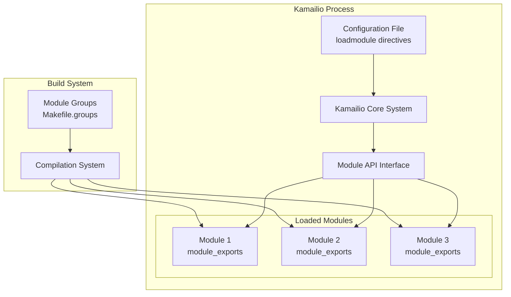
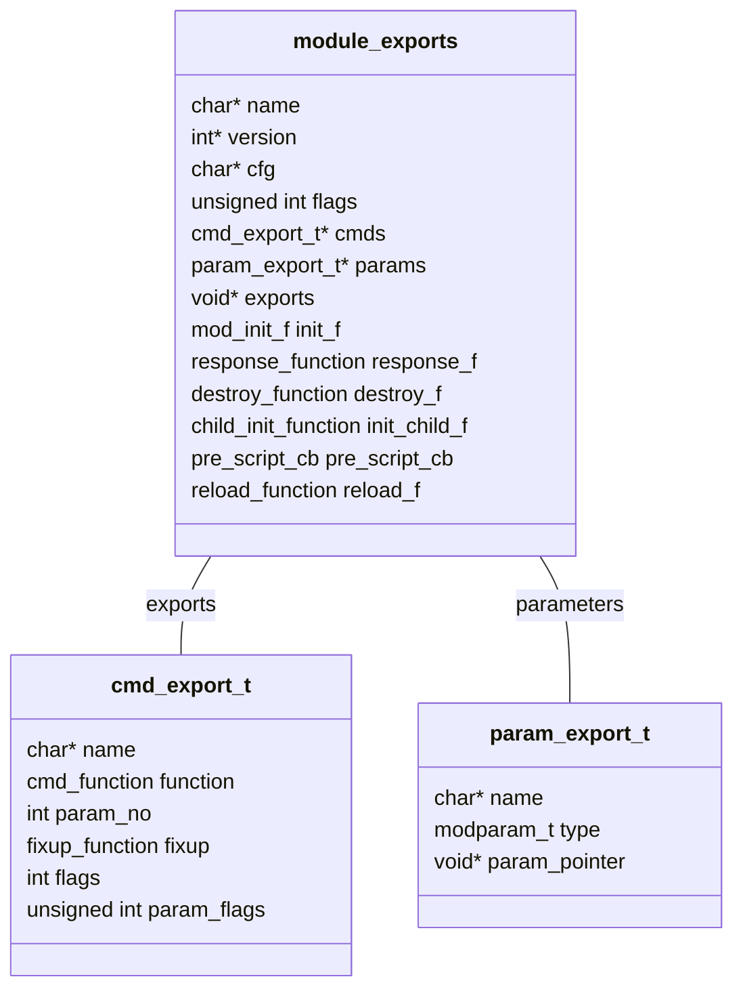
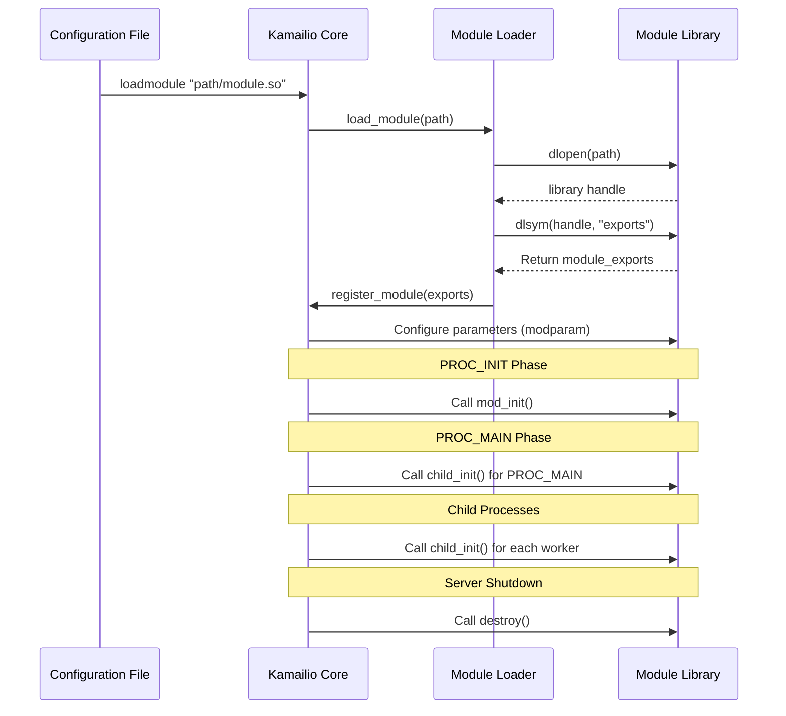
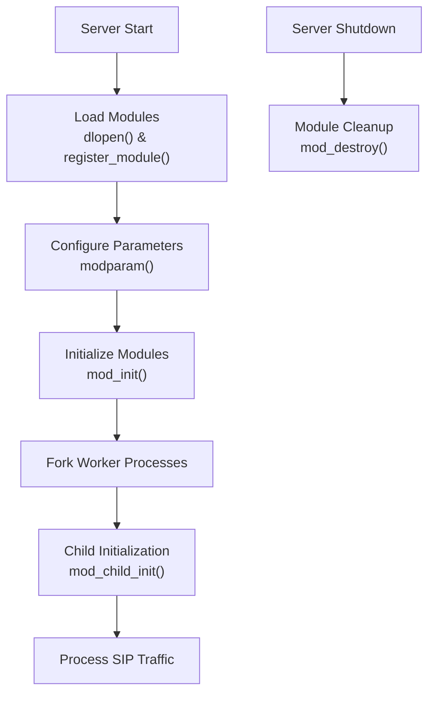
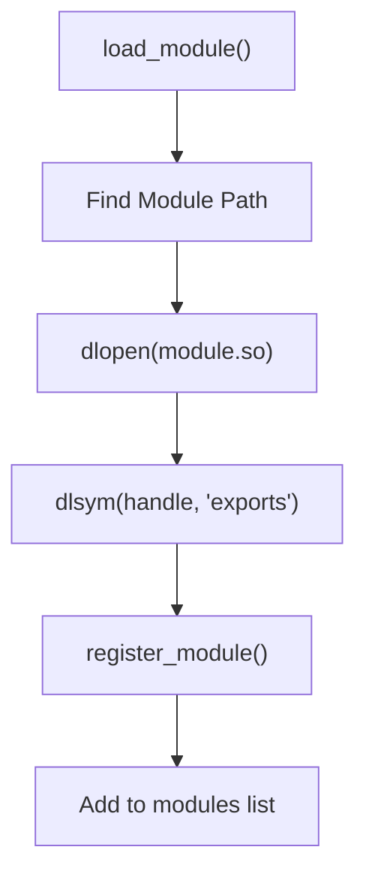
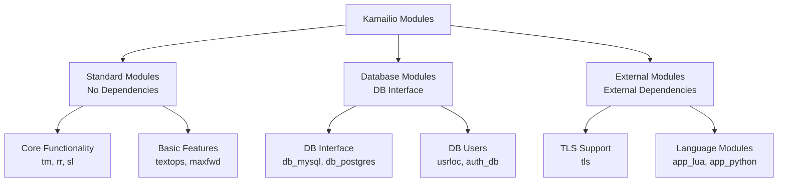

# Module Architecture

> **Relevant source files**
> * [CMakeLists.txt](https://github.com/kamailio/kamailio/blob/2b4e9f8b/CMakeLists.txt)
> * [cmake/cmake-uninstall.cmake.in](https://github.com/kamailio/kamailio/blob/2b4e9f8b/cmake/cmake-uninstall.cmake.in)
> * [src/Makefile](https://github.com/kamailio/kamailio/blob/2b4e9f8b/src/Makefile)
> * [src/Makefile.defs](https://github.com/kamailio/kamailio/blob/2b4e9f8b/src/Makefile.defs)
> * [src/Makefile.groups](https://github.com/kamailio/kamailio/blob/2b4e9f8b/src/Makefile.groups)
> * [src/Makefile.modules](https://github.com/kamailio/kamailio/blob/2b4e9f8b/src/Makefile.modules)
> * [src/Makefile.shared](https://github.com/kamailio/kamailio/blob/2b4e9f8b/src/Makefile.shared)
> * [src/Makefile.targets](https://github.com/kamailio/kamailio/blob/2b4e9f8b/src/Makefile.targets)
> * [src/Makefile.utils](https://github.com/kamailio/kamailio/blob/2b4e9f8b/src/Makefile.utils)
> * [src/core/async_task.c](https://github.com/kamailio/kamailio/blob/2b4e9f8b/src/core/async_task.c)
> * [src/core/async_task.h](https://github.com/kamailio/kamailio/blob/2b4e9f8b/src/core/async_task.h)
> * [src/core/cfg.lex](https://github.com/kamailio/kamailio/blob/2b4e9f8b/src/core/cfg.lex)
> * [src/core/cfg.y](https://github.com/kamailio/kamailio/blob/2b4e9f8b/src/core/cfg.y)
> * [src/core/core_cmd.c](https://github.com/kamailio/kamailio/blob/2b4e9f8b/src/core/core_cmd.c)
> * [src/core/events.c](https://github.com/kamailio/kamailio/blob/2b4e9f8b/src/core/events.c)
> * [src/core/events.h](https://github.com/kamailio/kamailio/blob/2b4e9f8b/src/core/events.h)
> * [src/core/flags.c](https://github.com/kamailio/kamailio/blob/2b4e9f8b/src/core/flags.c)
> * [src/core/flags.h](https://github.com/kamailio/kamailio/blob/2b4e9f8b/src/core/flags.h)
> * [src/core/forward.c](https://github.com/kamailio/kamailio/blob/2b4e9f8b/src/core/forward.c)
> * [src/core/forward.h](https://github.com/kamailio/kamailio/blob/2b4e9f8b/src/core/forward.h)
> * [src/core/globals.h](https://github.com/kamailio/kamailio/blob/2b4e9f8b/src/core/globals.h)
> * [src/core/ip_addr.c](https://github.com/kamailio/kamailio/blob/2b4e9f8b/src/core/ip_addr.c)
> * [src/core/ip_addr.h](https://github.com/kamailio/kamailio/blob/2b4e9f8b/src/core/ip_addr.h)
> * [src/core/mod_fix.c](https://github.com/kamailio/kamailio/blob/2b4e9f8b/src/core/mod_fix.c)
> * [src/core/mod_fix.h](https://github.com/kamailio/kamailio/blob/2b4e9f8b/src/core/mod_fix.h)
> * [src/core/modparam.c](https://github.com/kamailio/kamailio/blob/2b4e9f8b/src/core/modparam.c)
> * [src/core/modparam.h](https://github.com/kamailio/kamailio/blob/2b4e9f8b/src/core/modparam.h)
> * [src/core/ppcfg.c](https://github.com/kamailio/kamailio/blob/2b4e9f8b/src/core/ppcfg.c)
> * [src/core/ppcfg.h](https://github.com/kamailio/kamailio/blob/2b4e9f8b/src/core/ppcfg.h)
> * [src/core/receive.c](https://github.com/kamailio/kamailio/blob/2b4e9f8b/src/core/receive.c)
> * [src/core/receive.h](https://github.com/kamailio/kamailio/blob/2b4e9f8b/src/core/receive.h)
> * [src/core/socket_info.c](https://github.com/kamailio/kamailio/blob/2b4e9f8b/src/core/socket_info.c)
> * [src/core/socket_info.h](https://github.com/kamailio/kamailio/blob/2b4e9f8b/src/core/socket_info.h)
> * [src/core/sr_module.c](https://github.com/kamailio/kamailio/blob/2b4e9f8b/src/core/sr_module.c)
> * [src/core/sr_module.h](https://github.com/kamailio/kamailio/blob/2b4e9f8b/src/core/sr_module.h)
> * [src/core/stun.c](https://github.com/kamailio/kamailio/blob/2b4e9f8b/src/core/stun.c)
> * [src/core/tcp_conn.h](https://github.com/kamailio/kamailio/blob/2b4e9f8b/src/core/tcp_conn.h)
> * [src/core/tcp_init.h](https://github.com/kamailio/kamailio/blob/2b4e9f8b/src/core/tcp_init.h)
> * [src/core/tcp_main.c](https://github.com/kamailio/kamailio/blob/2b4e9f8b/src/core/tcp_main.c)
> * [src/core/tcp_read.c](https://github.com/kamailio/kamailio/blob/2b4e9f8b/src/core/tcp_read.c)
> * [src/core/udp_server.c](https://github.com/kamailio/kamailio/blob/2b4e9f8b/src/core/udp_server.c)
> * [src/core/udp_server.h](https://github.com/kamailio/kamailio/blob/2b4e9f8b/src/core/udp_server.h)
> * [src/main.c](https://github.com/kamailio/kamailio/blob/2b4e9f8b/src/main.c)
> * [src/modules/auth_radius/Makefile](https://github.com/kamailio/kamailio/blob/2b4e9f8b/src/modules/auth_radius/Makefile)
> * [src/modules/auth_radius/cfg/dictionary.kamailio](https://github.com/kamailio/kamailio/blob/2b4e9f8b/src/modules/auth_radius/cfg/dictionary.kamailio)
> * [src/modules/auth_radius/cfg/dictionary.sip-router](https://github.com/kamailio/kamailio/blob/2b4e9f8b/src/modules/auth_radius/cfg/dictionary.sip-router)
> * [src/modules/topos_htable/Makefile](https://github.com/kamailio/kamailio/blob/2b4e9f8b/src/modules/topos_htable/Makefile)
> * [src/modules/topos_htable/doc/Makefile](https://github.com/kamailio/kamailio/blob/2b4e9f8b/src/modules/topos_htable/doc/Makefile)
> * [src/modules/topos_htable/doc/topos_htable.xml](https://github.com/kamailio/kamailio/blob/2b4e9f8b/src/modules/topos_htable/doc/topos_htable.xml)
> * [src/modules/topos_htable/doc/topos_htable_admin.xml](https://github.com/kamailio/kamailio/blob/2b4e9f8b/src/modules/topos_htable/doc/topos_htable_admin.xml)
> * [src/modules/topos_htable/topos_htable_mod.c](https://github.com/kamailio/kamailio/blob/2b4e9f8b/src/modules/topos_htable/topos_htable_mod.c)
> * [src/modules/topos_htable/topos_htable_storage.c](https://github.com/kamailio/kamailio/blob/2b4e9f8b/src/modules/topos_htable/topos_htable_storage.c)
> * [src/modules/topos_htable/topos_htable_storage.h](https://github.com/kamailio/kamailio/blob/2b4e9f8b/src/modules/topos_htable/topos_htable_storage.h)

This page details Kamailio's module architecture, explaining how modules are defined, loaded, initialized, and interact with the core system. The Kamailio server design is based on a modular architecture with a compact core system and most of the SIP server functionality implemented within loadable modules.

## Overview of Module System

Kamailio's module system provides a flexible way to extend server functionality without modifying the core code. Modules encapsulate specific functionality (like SIP registrar, database access, etc.) through a standardized interface that allows them to be loaded dynamically at runtime.



Sources: [src/core/sr_module.h](https://github.com/kamailio/kamailio/blob/2b4e9f8b/src/core/sr_module.h)

 [src/core/sr_module.c](https://github.com/kamailio/kamailio/blob/2b4e9f8b/src/core/sr_module.c)

 [src/Makefile.groups](https://github.com/kamailio/kamailio/blob/2b4e9f8b/src/Makefile.groups)

## Module Definition

Each module must implement a standard structure (`module_exports`) that defines how the module integrates with the core. This structure provides information about the module's name, version, exported functions, and initialization functions.



Sources: [src/core/sr_module.h L54-L215](https://github.com/kamailio/kamailio/blob/2b4e9f8b/src/core/sr_module.h#L54-L215)

Key fields in the `module_exports` structure:

| Field | Description |
| --- | --- |
| name | Module name |
| version | Module version number |
| flags | Configuration flags |
| cmds | Array of exported commands/functions |
| params | Array of exported parameters |
| init_f | Module initialization function |
| destroy_f | Module cleanup function |
| init_child_f | Per-process initialization |
| reload_f | Function to handle module reloading |

Sources: [src/core/sr_module.h L54-L70](https://github.com/kamailio/kamailio/blob/2b4e9f8b/src/core/sr_module.h#L54-L70)

## Module Loading Process

When Kamailio starts, it loads modules as specified in the configuration file using `loadmodule` directives. This is a multi-step process:



Sources: [src/core/sr_module.c L364-L542](https://github.com/kamailio/kamailio/blob/2b4e9f8b/src/core/sr_module.c#L364-L542)

 [src/main.c L2257-L2313](https://github.com/kamailio/kamailio/blob/2b4e9f8b/src/main.c#L2257-L2313)

The module loading process is orchestrated by the following key functions:

1. `register_module()` - Adds a module to the global list of modules
2. `load_module()` - Loads a module from a shared library
3. `init_modules()` - Initializes all registered modules
4. `init_child()` - Initializes modules in child processes

Sources: [src/core/sr_module.c L185-L293](https://github.com/kamailio/kamailio/blob/2b4e9f8b/src/core/sr_module.c#L185-L293)

 [src/core/sr_module.c L364-L542](https://github.com/kamailio/kamailio/blob/2b4e9f8b/src/core/sr_module.c#L364-L542)

## Module Organization

Modules are organized into logical groups in the build system to help with package management and dependencies. These groups are defined in `Makefile.groups`.

Some key module groups include:

| Group | Description | Examples |
| --- | --- | --- |
| `module_group_default` | Basic modules with no dependencies | async, cfgutils, maxfwd |
| `module_group_standard` | No-dependency modules | tm, rr, sl |
| `module_group_db` | Database-related modules | usrloc, auth_db |
| `module_group_mysql` | MySQL-specific modules | db_mysql |
| `module_group_presence` | SIP presence modules | presence, pua |
| `module_group_radius` | RADIUS-related modules | auth_radius |

Sources: [src/Makefile.groups L294-L345](https://github.com/kamailio/kamailio/blob/2b4e9f8b/src/Makefile.groups#L294-L345)

## Module Initialization Sequence

Module initialization happens in multiple phases to ensure proper setup:

1. **Parameter Setup**: Setting up module parameters from config file
2. **Module Init**: Called for each module via `init_f()`
3. **Child Init**: Called for each module in each child process via `init_child_f()`
4. **Shutdown**: Called during server shutdown via `destroy_f()`



Sources: [src/core/sr_module.c L544-L770](https://github.com/kamailio/kamailio/blob/2b4e9f8b/src/core/sr_module.c#L544-L770)

 [src/main.c L2313-L2332](https://github.com/kamailio/kamailio/blob/2b4e9f8b/src/main.c#L2313-L2332)

## Module Command Exports

Modules export functions that can be called from the Kamailio configuration script. These are defined in the `cmds` array within the `module_exports` structure.

Each exported command includes:

* Name (as used in config file)
* Function pointer
* Parameter count
* Parameter fixup function
* Flags

Example of a module exporting commands:

```
static cmd_export_t cmds[] = {
    {"sl_send_reply", w_sl_send_reply, 2, fixup_sl_send_reply, 0, 
        REQUEST_ROUTE | FAILURE_ROUTE},
    {"sl_reply", w_sl_reply, 2, fixup_sl_reply, 0,
        REQUEST_ROUTE | FAILURE_ROUTE},
    {0, 0, 0, 0, 0, 0}
};
```

Sources: [src/core/sr_module.h L140-L147](https://github.com/kamailio/kamailio/blob/2b4e9f8b/src/core/sr_module.h#L140-L147)

## Module Parameter Exports

Modules can export parameters that can be set in the configuration file using `modparam()`. These are defined in the `params` array within the `module_exports` structure.

Each parameter includes:

* Name (as used in config file)
* Type (integer, string, etc.)
* Pointer to the variable

Example of parameter exports:

```
static param_export_t params[] = {
    {"default_code",   INT_PARAM, &default_code},
    {"default_reason", STR_PARAM, &default_reason},
    {"bind_addr",      STR_PARAM, &bind_addr},
    {0, 0, 0}
};
```

Sources: [src/core/sr_module.h L113-L117](https://github.com/kamailio/kamailio/blob/2b4e9f8b/src/core/sr_module.h#L113-L117)

## Dynamic Loading Process

Kamailio uses the system's dynamic library loader (`dlopen`/`dlsym`) to load modules at runtime. The process is handled by the `load_module()` function which:

1. Searches for the module in the module path
2. Opens the shared object using `dlopen()`
3. Locates the `exports` symbol using `dlsym()`
4. Registers the module with the core



Sources: [src/core/sr_module.c L364-L423](https://github.com/kamailio/kamailio/blob/2b4e9f8b/src/core/sr_module.c#L364-L423)

## Module Groups and Build System

The Kamailio build system organizes modules into logical groups defined in `Makefile.groups`. This organization helps with:

1. Building specific module sets
2. Managing dependencies
3. Creating appropriate packages
4. Determining compilation order

Here's a brief overview of how modules are organized:



Sources: [src/Makefile.groups L10-L290](https://github.com/kamailio/kamailio/blob/2b4e9f8b/src/Makefile.groups#L10-L290)

 [src/Makefile.groups L294-L345](https://github.com/kamailio/kamailio/blob/2b4e9f8b/src/Makefile.groups#L294-L345)

## Module API and Core Interaction

Modules interact with the core system through several mechanisms:

1. **Core API Functions**: Functions provided by the core that modules can use
2. **Callbacks**: Systems where modules can register functions to be called on specific events
3. **Hooks**: Points in the processing where modules can insert custom logic

Key interaction points include:

* **Script Functions**: Exported to the configuration script
* **Response Callbacks**: Processing SIP responses
* **Timer Callbacks**: Periodic execution
* **Route Callbacks**: Called during route processing

Sources: [src/core/sr_module.c L772-L1148](https://github.com/kamailio/kamailio/blob/2b4e9f8b/src/core/sr_module.c#L772-L1148)

 [src/core/sr_module.h L233-L268](https://github.com/kamailio/kamailio/blob/2b4e9f8b/src/core/sr_module.h#L233-L268)

## Common Module Features

Most Kamailio modules follow a common pattern with these features:

1. **Module Version**: Using `MODULE_VERSION` macro
2. **Command Exports**: Functions available in configuration script
3. **Parameter Exports**: Configurable module settings
4. **Initialization**: Setup code in `mod_init()`
5. **Child Initialization**: Per-process setup in `mod_child_init()`
6. **Cleanup**: Resource release in `mod_destroy()`

Sources: [src/core/sr_module.h L270-L356](https://github.com/kamailio/kamailio/blob/2b4e9f8b/src/core/sr_module.h#L270-L356)

## Conclusion

Kamailio's module architecture provides a flexible, extensible system for adding functionality to the SIP server. By using a standardized interface, modules can be developed independently while maintaining compatibility with the core system. This design allows Kamailio to be both lightweight and feature-rich, with administrators able to load only the modules needed for their specific deployment.