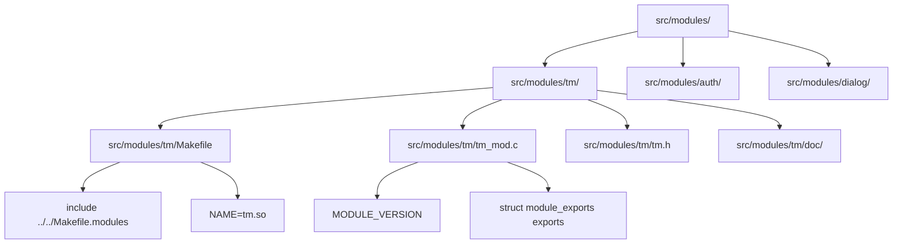
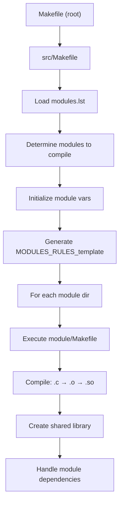
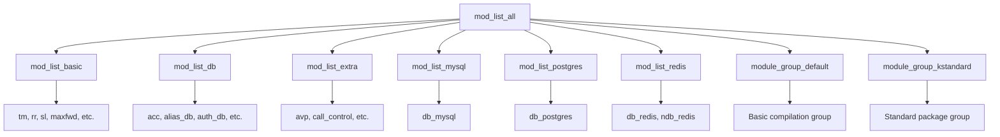
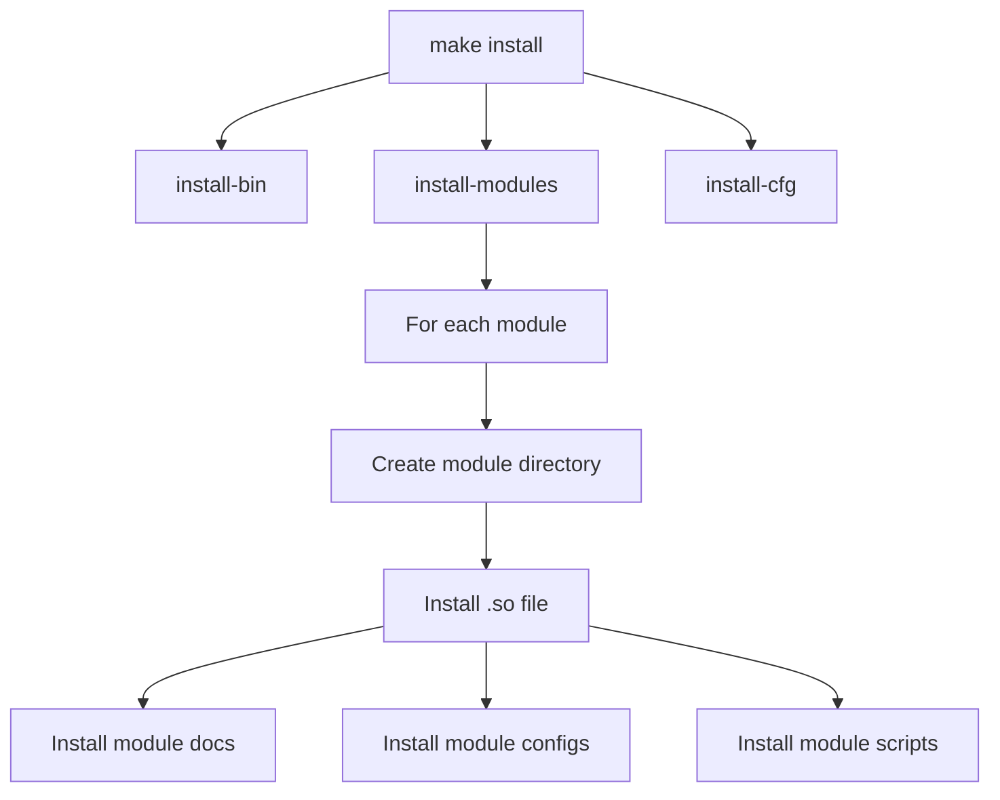

# Module Compilation System

> **Relevant source files**
> * [CMakeLists.txt](https://github.com/kamailio/kamailio/blob/2b4e9f8b/CMakeLists.txt)
> * [Makefile](https://github.com/kamailio/kamailio/blob/2b4e9f8b/Makefile)
> * [cmake/cmake-uninstall.cmake.in](https://github.com/kamailio/kamailio/blob/2b4e9f8b/cmake/cmake-uninstall.cmake.in)
> * [src/Makefile](https://github.com/kamailio/kamailio/blob/2b4e9f8b/src/Makefile)
> * [src/Makefile.defs](https://github.com/kamailio/kamailio/blob/2b4e9f8b/src/Makefile.defs)
> * [src/Makefile.groups](https://github.com/kamailio/kamailio/blob/2b4e9f8b/src/Makefile.groups)
> * [src/Makefile.modules](https://github.com/kamailio/kamailio/blob/2b4e9f8b/src/Makefile.modules)
> * [src/Makefile.shared](https://github.com/kamailio/kamailio/blob/2b4e9f8b/src/Makefile.shared)
> * [src/Makefile.targets](https://github.com/kamailio/kamailio/blob/2b4e9f8b/src/Makefile.targets)
> * [src/Makefile.utils](https://github.com/kamailio/kamailio/blob/2b4e9f8b/src/Makefile.utils)
> * [src/modules/auth_radius/Makefile](https://github.com/kamailio/kamailio/blob/2b4e9f8b/src/modules/auth_radius/Makefile)
> * [src/modules/auth_radius/cfg/dictionary.kamailio](https://github.com/kamailio/kamailio/blob/2b4e9f8b/src/modules/auth_radius/cfg/dictionary.kamailio)
> * [src/modules/auth_radius/cfg/dictionary.sip-router](https://github.com/kamailio/kamailio/blob/2b4e9f8b/src/modules/auth_radius/cfg/dictionary.sip-router)
> * [src/modules/topos_htable/Makefile](https://github.com/kamailio/kamailio/blob/2b4e9f8b/src/modules/topos_htable/Makefile)
> * [src/modules/topos_htable/doc/Makefile](https://github.com/kamailio/kamailio/blob/2b4e9f8b/src/modules/topos_htable/doc/Makefile)
> * [src/modules/topos_htable/doc/topos_htable.xml](https://github.com/kamailio/kamailio/blob/2b4e9f8b/src/modules/topos_htable/doc/topos_htable.xml)
> * [src/modules/topos_htable/doc/topos_htable_admin.xml](https://github.com/kamailio/kamailio/blob/2b4e9f8b/src/modules/topos_htable/doc/topos_htable_admin.xml)
> * [src/modules/topos_htable/topos_htable_mod.c](https://github.com/kamailio/kamailio/blob/2b4e9f8b/src/modules/topos_htable/topos_htable_mod.c)
> * [src/modules/topos_htable/topos_htable_storage.c](https://github.com/kamailio/kamailio/blob/2b4e9f8b/src/modules/topos_htable/topos_htable_storage.c)
> * [src/modules/topos_htable/topos_htable_storage.h](https://github.com/kamailio/kamailio/blob/2b4e9f8b/src/modules/topos_htable/topos_htable_storage.h)

This document describes the system that Kamailio uses to compile modules, including how modules are selected for compilation, how they are built, and how they are installed. For information about the overall build system architecture, see [Build System Overview](/kamailio/kamailio/5-build-system).

## Overview

The Kamailio Module Compilation System provides a flexible framework for building and managing loadable modules. Modules in Kamailio are compiled as shared libraries (`.so` files) that extend the core functionality. The compilation system allows selective building of modules based on dependencies, requirements, and user preferences.

The system is primarily based on GNU Make with a sophisticated set of makefiles that handle module selection, compilation, and installation. There is also preliminary support for CMake builds, although the Make-based system is more mature and feature-complete.

## Module Organization and Structure



Each Kamailio module exists as a separate directory under `src/modules/` with its own Makefile and source files. A typical module directory contains:

1. `Makefile` - Defines compilation parameters
2. Source files (`.c`) - Implement the module functionality
3. Header files (`.h`) - Declare module functions and structures
4. Documentation files (usually under a `doc/` subdirectory)

### Module Makefile Requirements

The module Makefile must include `../../Makefile.modules` and define certain variables:

| Variable | Description | Required |
| --- | --- | --- |
| `NAME` | Module binary name (e.g., `mymodule.so`) | Yes |
| `COREPATH` | Path to core directory (default: `../..`) | No |
| `DEFS` | Additional compiler definitions | No |
| `LIBS` | Additional libraries needed | No |
| `SER_LIBS` | Kamailio libraries to link with | No |
| `MOD_INSTALL_UTILS` | Utility directories to compile and install | No |
| `MOD_INSTALL_SCRIPTS` | Scripts to install | No |
| `MOD_INSTALL_CFGS` | Extra config files to install | No |
| `MOD_INSTALL_SHARE` | Files for the shared directory | No |

Example of a simple module Makefile:

```markdown
# Module Makefile
include ../../Makefile.defs
auto_gen=
NAME=mymodule.so
DEFS+=
LIBS=

include ../../Makefile.modules
```

Sources: [src/modules/auth_radius/Makefile L1-L29](https://github.com/kamailio/kamailio/blob/2b4e9f8b/src/modules/auth_radius/Makefile#L1-L29)

 [src/modules/topos_htable/Makefile L1-L11](https://github.com/kamailio/kamailio/blob/2b4e9f8b/src/modules/topos_htable/Makefile#L1-L11)

## Module Compilation Process



The module compilation process starts with the root `Makefile` which forwards commands to `src/Makefile`. The compilation flow involves:

1. Loading or generating `modules.lst` which defines which modules to compile
2. Determining the modules to compile based on include/exclude lists and groups
3. Setting up compilation variables and flags
4. Generating compilation rules for each module
5. Executing each module's Makefile to build the shared library

### Key Elements in the Process

* **Module Selection**: Determined by `include_modules`, `exclude_modules`, and `group_include`
* **Platform Detection**: Automatically detects OS, architecture, and compiler
* **Dependency Handling**: Modules with unmet dependencies are automatically excluded
* **Static Modules**: Can be compiled directly into the Kamailio binary

Sources: [src/Makefile L1-L18](https://github.com/kamailio/kamailio/blob/2b4e9f8b/src/Makefile#L1-L18)

 [src/Makefile L510-L539](https://github.com/kamailio/kamailio/blob/2b4e9f8b/src/Makefile#L510-L539)

 [src/Makefile.modules L1-L43](https://github.com/kamailio/kamailio/blob/2b4e9f8b/src/Makefile.modules#L1-L43)

## Module Selection and Grouping



Kamailio's module system uses a sophisticated selection mechanism that allows modules to be included or excluded based on various criteria.

### Module Groups

Module groups are defined in `Makefile.groups` and serve two main purposes:

1. **Compilation Groups**: Determine which modules are compiled by default
2. **Packaging Groups**: Define sets of modules for package creation

Key module groups include:

| Group | Description |
| --- | --- |
| `module_group_default` | Modules compiled by default (no external dependencies) |
| `module_group_standard` | Modules with no dependencies |
| `module_group_common` | Widely used modules with dependencies |
| `module_group_db` | Database-related modules |
| `module_group_mysql` | MySQL-specific modules |
| `module_group_postgres` | PostgreSQL-specific modules |

### Module Selection Mechanisms

Modules can be selected for compilation using several methods:

1. **Direct Selection**: ``` make include_modules="tm rr" exclude_modules="auth" all ```
2. **Group Selection**: ``` make group_include="standard mysql" all ```
3. **Config-Based Selection**: Using `modules.lst`

The final set of modules to compile is determined by this formula:

* If `group_include` is used: `modules = include_modules - exclude_modules - static_modules`
* Otherwise: `modules = (all_modules - exclude_modules) + include_modules - static_modules`

Sources: [src/Makefile.groups L1-L291](https://github.com/kamailio/kamailio/blob/2b4e9f8b/src/Makefile.groups#L1-L291)

 [src/Makefile L167-L183](https://github.com/kamailio/kamailio/blob/2b4e9f8b/src/Makefile#L167-L183)

## Module Installation



Compiled modules are installed under the modules directory, typically `/usr/local/lib/kamailio/modules/`. The installation process handles:

1. Creating the destination directories
2. Installing the module shared libraries
3. Installing associated files: * Configuration files * Documentation * Scripts * Utility programs

The installation paths can be customized with these variables:

* `PREFIX`: Base installation directory (default: `/usr/local`)
* `LIBDIR`: Library directory name (default: `lib` or `lib64` based on architecture)
* `cfg_prefix`, `modules_prefix`, etc.: More specific installation paths

Sources: [src/Makefile L652-L676](https://github.com/kamailio/kamailio/blob/2b4e9f8b/src/Makefile#L652-L676)

 [src/Makefile.modules L109-L156](https://github.com/kamailio/kamailio/blob/2b4e9f8b/src/Makefile.modules#L109-L156)

## Module Development

To develop a new Kamailio module:

1. Create a directory under `src/modules/`
2. Create the module's `Makefile` with required variables
3. Implement the module source files
4. Document the module functionality

### Module Initialization Structure

Every Kamailio module must define a `struct module_exports exports` that exports the module's functions, parameters, and initialization/cleanup handlers. Here's a minimal example:

```javascript
#include "../../core/sr_module.h"

MODULE_VERSION

/* Module initialization function */
static int mod_init(void)
{
    return 0;
}

/* Module exported functions */
static cmd_export_t cmds[] = {
    {0, 0, 0, 0, 0, 0}
};

/* Module parameters */
static param_export_t params[] = {
    {0, 0, 0}
};

/* Module interface */
struct module_exports exports = {
    "mymodule",       /* module name */
    DEFAULT_DLFLAGS,  /* dlopen flags */
    cmds,             /* exported functions */
    params,           /* exported parameters */
    0,                /* exported RPC functions */
    0,                /* exported pseudo-variables */
    0,                /* response handling function */
    mod_init,         /* module initialization function */
    0,                /* per-child init function */
    0                 /* module destroy function */
};
```

Sources: [src/modules/topos_htable/topos_htable_mod.c L1-L151](https://github.com/kamailio/kamailio/blob/2b4e9f8b/src/modules/topos_htable/topos_htable_mod.c#L1-L151)

## Static vs. Dynamic Modules

Kamailio supports both dynamic modules (loaded at runtime) and static modules (compiled into the core):

* **Dynamic Modules**: Compiled as `.so` shared libraries and loaded at runtime
* **Static Modules**: Compiled directly into the Kamailio binary

Static modules are defined in the `static_modules` variable and are not compiled as separate shared libraries. This is useful for creating minimal standalone binaries or when dynamic loading is not desired.

Sources: [src/Makefile L142-L147](https://github.com/kamailio/kamailio/blob/2b4e9f8b/src/Makefile#L142-L147)

 [src/Makefile.groups L552-L555](https://github.com/kamailio/kamailio/blob/2b4e9f8b/src/Makefile.groups#L552-L555)

## CMake Support

In addition to the Make-based build system, Kamailio also has preliminary support for CMake. The CMake build system provides an alternative method for building Kamailio and its modules, which may be preferable on some platforms or development environments.

The CMake build is controlled by `CMakeLists.txt` files in the root and src directories. While functional, it may not support all the features of the Make-based system.

Sources: [CMakeLists.txt L1-L86](https://github.com/kamailio/kamailio/blob/2b4e9f8b/CMakeLists.txt#L1-L86)

 [cmake/cmake-uninstall.cmake.in L1-L35](https://github.com/kamailio/kamailio/blob/2b4e9f8b/cmake/cmake-uninstall.cmake.in#L1-L35)