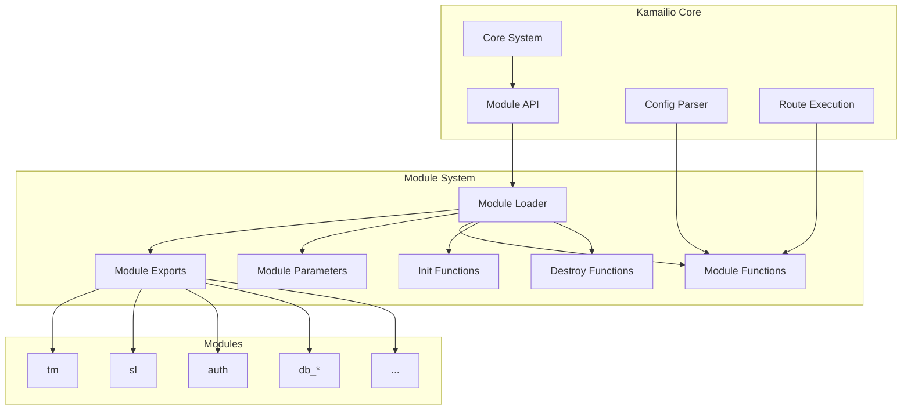
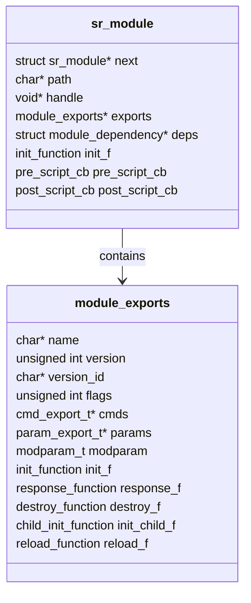
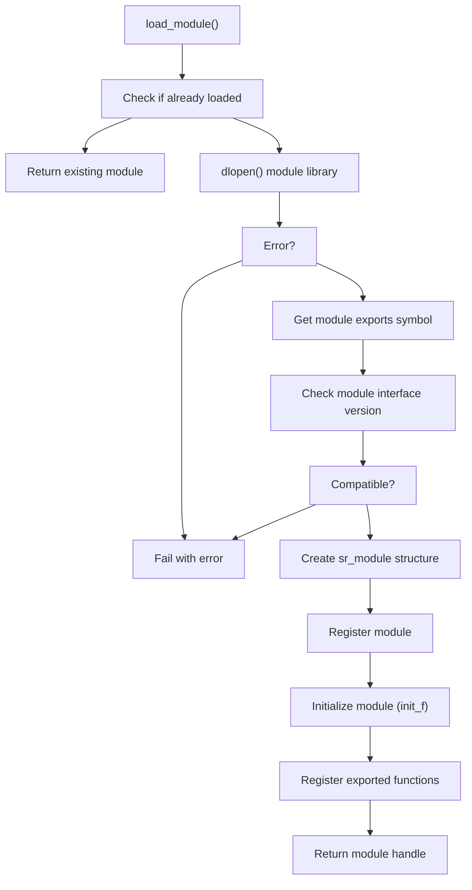
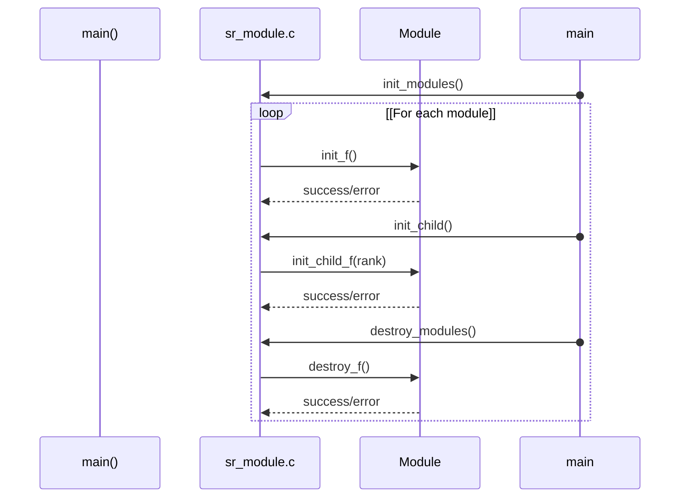
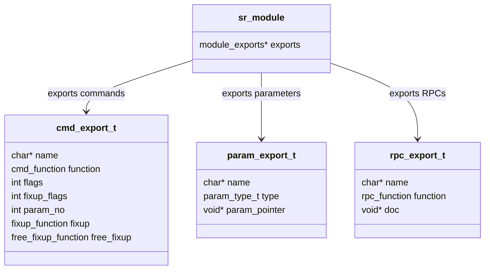
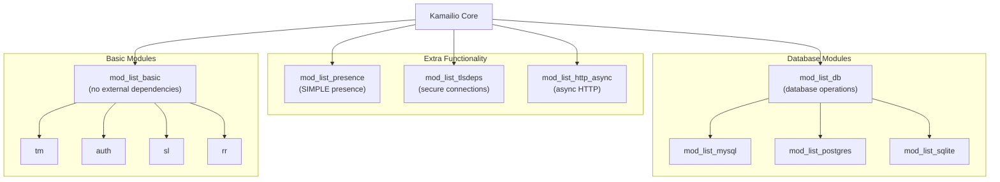
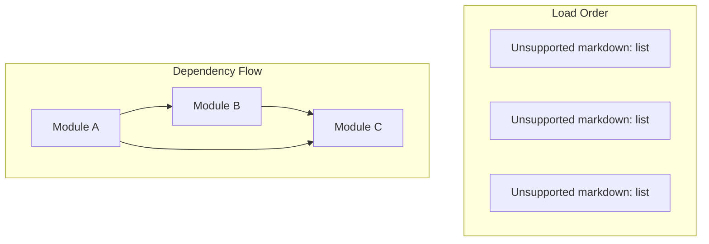
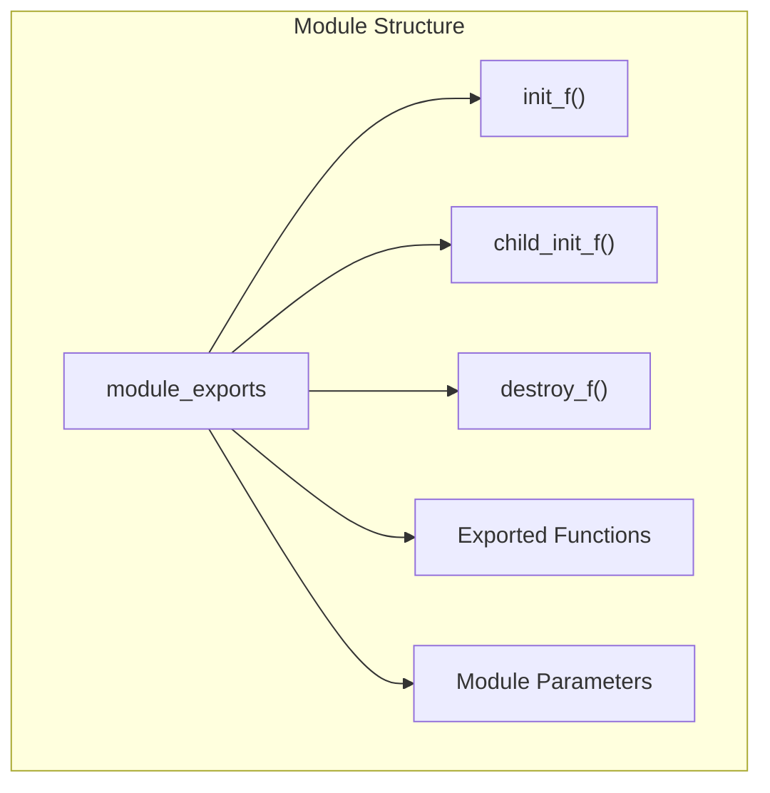

# Module System

> **Relevant source files**
> * [CMakeLists.txt](https://github.com/kamailio/kamailio/blob/2b4e9f8b/CMakeLists.txt)
> * [cmake/cmake-uninstall.cmake.in](https://github.com/kamailio/kamailio/blob/2b4e9f8b/cmake/cmake-uninstall.cmake.in)
> * [src/Makefile](https://github.com/kamailio/kamailio/blob/2b4e9f8b/src/Makefile)
> * [src/Makefile.defs](https://github.com/kamailio/kamailio/blob/2b4e9f8b/src/Makefile.defs)
> * [src/Makefile.groups](https://github.com/kamailio/kamailio/blob/2b4e9f8b/src/Makefile.groups)
> * [src/Makefile.modules](https://github.com/kamailio/kamailio/blob/2b4e9f8b/src/Makefile.modules)
> * [src/Makefile.shared](https://github.com/kamailio/kamailio/blob/2b4e9f8b/src/Makefile.shared)
> * [src/Makefile.targets](https://github.com/kamailio/kamailio/blob/2b4e9f8b/src/Makefile.targets)
> * [src/Makefile.utils](https://github.com/kamailio/kamailio/blob/2b4e9f8b/src/Makefile.utils)
> * [src/core/async_task.c](https://github.com/kamailio/kamailio/blob/2b4e9f8b/src/core/async_task.c)
> * [src/core/async_task.h](https://github.com/kamailio/kamailio/blob/2b4e9f8b/src/core/async_task.h)
> * [src/core/cfg.lex](https://github.com/kamailio/kamailio/blob/2b4e9f8b/src/core/cfg.lex)
> * [src/core/cfg.y](https://github.com/kamailio/kamailio/blob/2b4e9f8b/src/core/cfg.y)
> * [src/core/core_cmd.c](https://github.com/kamailio/kamailio/blob/2b4e9f8b/src/core/core_cmd.c)
> * [src/core/events.c](https://github.com/kamailio/kamailio/blob/2b4e9f8b/src/core/events.c)
> * [src/core/events.h](https://github.com/kamailio/kamailio/blob/2b4e9f8b/src/core/events.h)
> * [src/core/flags.c](https://github.com/kamailio/kamailio/blob/2b4e9f8b/src/core/flags.c)
> * [src/core/flags.h](https://github.com/kamailio/kamailio/blob/2b4e9f8b/src/core/flags.h)
> * [src/core/forward.c](https://github.com/kamailio/kamailio/blob/2b4e9f8b/src/core/forward.c)
> * [src/core/forward.h](https://github.com/kamailio/kamailio/blob/2b4e9f8b/src/core/forward.h)
> * [src/core/globals.h](https://github.com/kamailio/kamailio/blob/2b4e9f8b/src/core/globals.h)
> * [src/core/ip_addr.c](https://github.com/kamailio/kamailio/blob/2b4e9f8b/src/core/ip_addr.c)
> * [src/core/ip_addr.h](https://github.com/kamailio/kamailio/blob/2b4e9f8b/src/core/ip_addr.h)
> * [src/core/mod_fix.c](https://github.com/kamailio/kamailio/blob/2b4e9f8b/src/core/mod_fix.c)
> * [src/core/mod_fix.h](https://github.com/kamailio/kamailio/blob/2b4e9f8b/src/core/mod_fix.h)
> * [src/core/modparam.c](https://github.com/kamailio/kamailio/blob/2b4e9f8b/src/core/modparam.c)
> * [src/core/modparam.h](https://github.com/kamailio/kamailio/blob/2b4e9f8b/src/core/modparam.h)
> * [src/core/ppcfg.c](https://github.com/kamailio/kamailio/blob/2b4e9f8b/src/core/ppcfg.c)
> * [src/core/ppcfg.h](https://github.com/kamailio/kamailio/blob/2b4e9f8b/src/core/ppcfg.h)
> * [src/core/receive.c](https://github.com/kamailio/kamailio/blob/2b4e9f8b/src/core/receive.c)
> * [src/core/receive.h](https://github.com/kamailio/kamailio/blob/2b4e9f8b/src/core/receive.h)
> * [src/core/socket_info.c](https://github.com/kamailio/kamailio/blob/2b4e9f8b/src/core/socket_info.c)
> * [src/core/socket_info.h](https://github.com/kamailio/kamailio/blob/2b4e9f8b/src/core/socket_info.h)
> * [src/core/sr_module.c](https://github.com/kamailio/kamailio/blob/2b4e9f8b/src/core/sr_module.c)
> * [src/core/sr_module.h](https://github.com/kamailio/kamailio/blob/2b4e9f8b/src/core/sr_module.h)
> * [src/core/stun.c](https://github.com/kamailio/kamailio/blob/2b4e9f8b/src/core/stun.c)
> * [src/core/tcp_conn.h](https://github.com/kamailio/kamailio/blob/2b4e9f8b/src/core/tcp_conn.h)
> * [src/core/tcp_init.h](https://github.com/kamailio/kamailio/blob/2b4e9f8b/src/core/tcp_init.h)
> * [src/core/tcp_main.c](https://github.com/kamailio/kamailio/blob/2b4e9f8b/src/core/tcp_main.c)
> * [src/core/tcp_read.c](https://github.com/kamailio/kamailio/blob/2b4e9f8b/src/core/tcp_read.c)
> * [src/core/udp_server.c](https://github.com/kamailio/kamailio/blob/2b4e9f8b/src/core/udp_server.c)
> * [src/core/udp_server.h](https://github.com/kamailio/kamailio/blob/2b4e9f8b/src/core/udp_server.h)
> * [src/main.c](https://github.com/kamailio/kamailio/blob/2b4e9f8b/src/main.c)
> * [src/modules/auth_radius/Makefile](https://github.com/kamailio/kamailio/blob/2b4e9f8b/src/modules/auth_radius/Makefile)
> * [src/modules/auth_radius/cfg/dictionary.kamailio](https://github.com/kamailio/kamailio/blob/2b4e9f8b/src/modules/auth_radius/cfg/dictionary.kamailio)
> * [src/modules/auth_radius/cfg/dictionary.sip-router](https://github.com/kamailio/kamailio/blob/2b4e9f8b/src/modules/auth_radius/cfg/dictionary.sip-router)
> * [src/modules/topos_htable/Makefile](https://github.com/kamailio/kamailio/blob/2b4e9f8b/src/modules/topos_htable/Makefile)
> * [src/modules/topos_htable/doc/Makefile](https://github.com/kamailio/kamailio/blob/2b4e9f8b/src/modules/topos_htable/doc/Makefile)
> * [src/modules/topos_htable/doc/topos_htable.xml](https://github.com/kamailio/kamailio/blob/2b4e9f8b/src/modules/topos_htable/doc/topos_htable.xml)
> * [src/modules/topos_htable/doc/topos_htable_admin.xml](https://github.com/kamailio/kamailio/blob/2b4e9f8b/src/modules/topos_htable/doc/topos_htable_admin.xml)
> * [src/modules/topos_htable/topos_htable_mod.c](https://github.com/kamailio/kamailio/blob/2b4e9f8b/src/modules/topos_htable/topos_htable_mod.c)
> * [src/modules/topos_htable/topos_htable_storage.c](https://github.com/kamailio/kamailio/blob/2b4e9f8b/src/modules/topos_htable/topos_htable_storage.c)
> * [src/modules/topos_htable/topos_htable_storage.h](https://github.com/kamailio/kamailio/blob/2b4e9f8b/src/modules/topos_htable/topos_htable_storage.h)

The Kamailio Module System manages the loading, initialization, execution, and unloading of modules that extend the core functionality of the SIP server. This document describes how the module system is architected, how modules are loaded and interact with the core, and how module groups are organized.

## Overview

Kamailio follows a modular architecture where the core provides essential SIP processing capabilities, while additional functionality is implemented in loadable modules. These modules can be compiled statically into the server or, more commonly, loaded dynamically at runtime. The module system provides a standardized interface for modules to integrate with the core server.

Sources: [src/core/sr_module.c L62-L63](https://github.com/kamailio/kamailio/blob/2b4e9f8b/src/core/sr_module.c#L62-L63)

 [src/core/sr_module.h L214-L219](https://github.com/kamailio/kamailio/blob/2b4e9f8b/src/core/sr_module.h#L214-L219)

 [src/main.c L85-L86](https://github.com/kamailio/kamailio/blob/2b4e9f8b/src/main.c#L85-L86)

## Module Interface

Every Kamailio module must implement a standardized interface to interact with the core. This interface is defined by the `module_exports` structure in `sr_module.h`. This structure contains metadata about the module and pointers to the module's functions.

A typical Kamailio module implements and exports the following:

1. **Module Information** - Name, version, and flags
2. **Exported Functions** - Commands that can be called from the configuration script
3. **Parameters** - Configuration parameters for the module
4. **Initialization Functions** - For module startup, per-process init, reload, etc.
5. **Cleanup Functions** - For graceful shutdown

Sources: [src/core/sr_module.h L115-L214](https://github.com/kamailio/kamailio/blob/2b4e9f8b/src/core/sr_module.h#L115-L214)

 [src/core/sr_module.c L62-L63](https://github.com/kamailio/kamailio/blob/2b4e9f8b/src/core/sr_module.c#L62-L63)

## Module Loading Process

Modules in Kamailio can be loaded in several ways:

1. **Static Linking** - Compiled directly into the server binary
2. **Dynamic Loading** - Loaded at runtime from shared libraries (.so files)
3. **Config-based Loading** - Using the `loadmodule` directive in the configuration file
4. **Command Line-based Loading** - Using the `--loadmodule` parameter

The main module loading process is handled by the `load_module()` function in `sr_module.c`. The function performs the following key steps:

Sources: [src/core/sr_module.c L229-L407](https://github.com/kamailio/kamailio/blob/2b4e9f8b/src/core/sr_module.c#L229-L407)

 [src/main.c L2462-L2487](https://github.com/kamailio/kamailio/blob/2b4e9f8b/src/main.c#L2462-L2487)

## Module Initialization and Cleanup

Module initialization happens in multiple phases:

1. **Global Initialization** (`init_f`) - Called once when the module is loaded
2. **Per-Process Initialization** (`init_child_f`) - Called for each Kamailio process
3. **Pre-Script Callbacks** - Called before executing the routing script
4. **Post-Script Callbacks** - Called after executing the routing script

Similarly, during shutdown, modules are cleaned up in a controlled manner:

1. **Destroy Function** (`destroy_f`) - Called when Kamailio is shutting down
2. **Resource Cleanup** - Memory deallocation, closing connections, etc.

The initialization sequence is managed by the `init_modules()` function, which calls the `init_f` function for each loaded module:

Sources: [src/core/sr_module.c L416-L466](https://github.com/kamailio/kamailio/blob/2b4e9f8b/src/core/sr_module.c#L416-L466)

 [src/core/sr_module.c L468-L514](https://github.com/kamailio/kamailio/blob/2b4e9f8b/src/core/sr_module.c#L468-L514)

 [src/core/sr_module.c L600-L630](https://github.com/kamailio/kamailio/blob/2b4e9f8b/src/core/sr_module.c#L600-L630)

## Module Exports

Modules export their functionality to the core using specific structures for different types of exports:

1. **Command Exports** (`cmd_export_t`) - Functions that can be called from the configuration script
2. **Parameter Exports** (`param_export_t`) - Configuration parameters for the module
3. **Response Functions** - Handle SIP responses
4. **RPC Functions** - Remote procedure calls

The module system provides helper functions for registering these exports, such as:

* `register_module()` - Register a new module
* `register_builtin_modules()` - Register statically linked modules
* `register_all_modules()` - Register all modules (static and dynamic)

Sources: [src/core/sr_module.h L41-L114](https://github.com/kamailio/kamailio/blob/2b4e9f8b/src/core/sr_module.h#L41-L114)

 [src/core/sr_module.c L185-L227](https://github.com/kamailio/kamailio/blob/2b4e9f8b/src/core/sr_module.c#L185-L227)

 [src/core/sr_module.c L229-L383](https://github.com/kamailio/kamailio/blob/2b4e9f8b/src/core/sr_module.c#L229-L383)

## Module Groups and Organization

Kamailio organizes modules into logical groups based on their functionality or dependencies. This grouping helps with packaging and distribution. The groups are defined in `Makefile.groups`.

Some of the main module groups include:

| Group | Description | Example Modules |
| --- | --- | --- |
| Basic | Core modules with no extra dependencies | async, auth, kex, tm |
| DB | Database-related modules | acc, alias_db, auth_db |
| PCRE | Modules dependent on PCRE library | dialplan, lcr, regex |
| MySQL | MySQL database driver | db_mysql |
| Presence | SIMPLE presence extensions | presence, pua, rls |
| TLS | TLS/SSL related modules | tls, tlsa |

Module dependency management is also part of the module system - some modules require other modules to be loaded first. The system checks dependencies during the loading process.

Sources: [src/Makefile.groups L11-L290](https://github.com/kamailio/kamailio/blob/2b4e9f8b/src/Makefile.groups#L11-L290)

 [src/core/sr_module.c L537-L598](https://github.com/kamailio/kamailio/blob/2b4e9f8b/src/core/sr_module.c#L537-L598)

## Loading Order and Dependencies

The module loading order is important and can affect the behavior of Kamailio. The module system handles dependencies to ensure modules are loaded in the correct order.

In practice, Kamailio loads modules in the order specified in the configuration file. If a module depends on another module, it should be loaded after its dependencies. The system performs some dependency checking during loading.

Sources: [src/core/sr_module.c L537-L598](https://github.com/kamailio/kamailio/blob/2b4e9f8b/src/core/sr_module.c#L537-L598)

 [src/core/cfg.y L3307-L3345](https://github.com/kamailio/kamailio/blob/2b4e9f8b/src/core/cfg.y#L3307-L3345)

## Creating Custom Modules

Developers can extend Kamailio by creating custom modules. A typical module will:

1. Define the module interface (`module_exports`)
2. Implement exported functions
3. Define module parameters
4. Implement initialization and cleanup functions

Here's a simplified module structure:

A module must register its exports and provide the necessary callback functions to interact with the core.

Sources: [src/core/sr_module.h L115-L214](https://github.com/kamailio/kamailio/blob/2b4e9f8b/src/core/sr_module.h#L115-L214)

 [src/core/sr_module.c L185-L227](https://github.com/kamailio/kamailio/blob/2b4e9f8b/src/core/sr_module.c#L185-L227)

## Module API

The core provides an API for modules to interact with other parts of the system:

| API Category | Description | Example Functions |
| --- | --- | --- |
| Memory Management | Functions for memory allocation | pkg_malloc, shm_malloc |
| Logging | Functions for logging | LM_INFO, LM_ERR |
| Configuration | Access to configuration parameters | cfg_get |
| SIP Message Handling | Functions for parsing and manipulating SIP messages | parse_headers, build_uac_request |

Modules can also expose their APIs to other modules through API functions that can be registered and retrieved at runtime.

Sources: [src/core/sr_module.c L1019-L1057](https://github.com/kamailio/kamailio/blob/2b4e9f8b/src/core/sr_module.c#L1019-L1057)

 [src/core/sr_module.h L274-L299](https://github.com/kamailio/kamailio/blob/2b4e9f8b/src/core/sr_module.h#L274-L299)

## Conclusion

The Kamailio Module System provides a flexible and powerful mechanism for extending the core functionality of the SIP server. It handles the loading, initialization, execution, and cleanup of modules in a standardized way. Understanding the module system is essential for both administrators configuring Kamailio and developers extending its functionality.

The modular architecture allows for a small core with extensive functionality provided through loadable modules, making the system highly customizable and adaptable to different use cases.

Sources: [src/core/sr_module.c](https://github.com/kamailio/kamailio/blob/2b4e9f8b/src/core/sr_module.c)

 [src/core/sr_module.h](https://github.com/kamailio/kamailio/blob/2b4e9f8b/src/core/sr_module.h)

 [src/Makefile.groups](https://github.com/kamailio/kamailio/blob/2b4e9f8b/src/Makefile.groups)