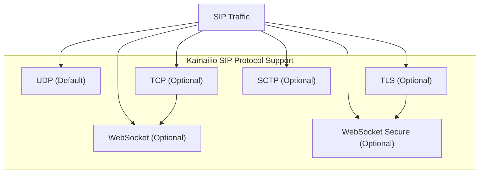
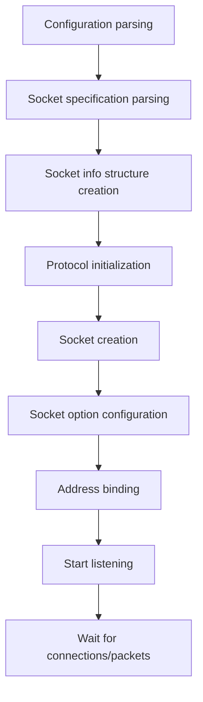
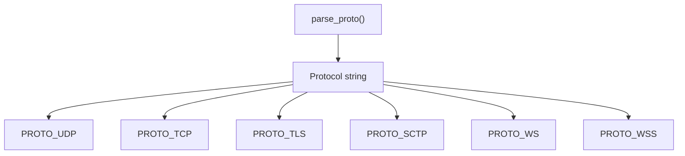
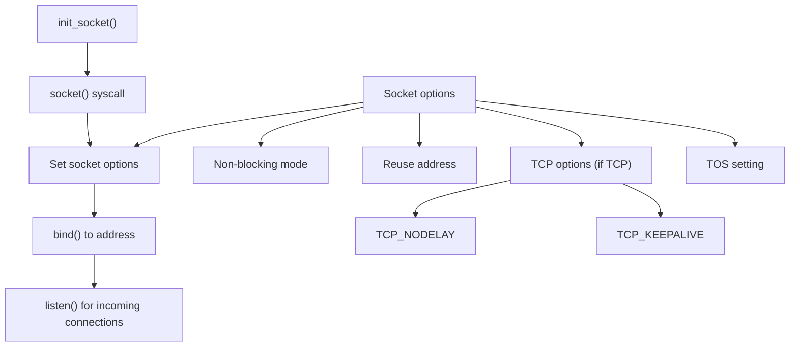
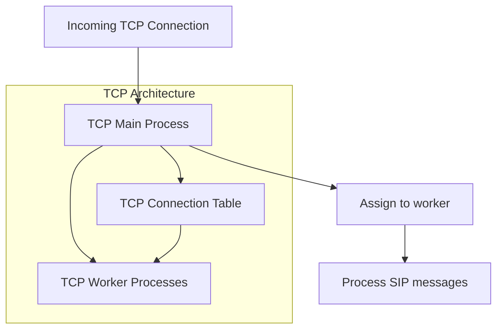
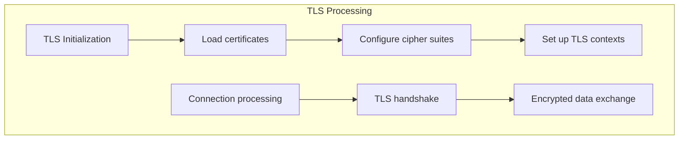
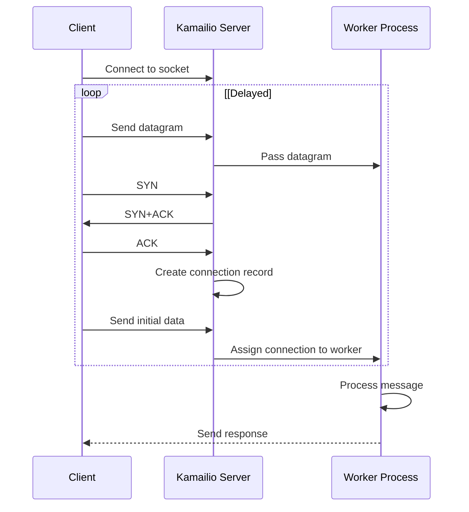
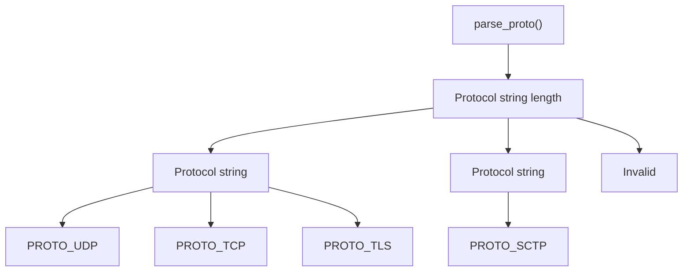

# Network and Protocol Handling

> **Relevant source files**
> * [src/core/async_task.c](https://github.com/kamailio/kamailio/blob/2b4e9f8b/src/core/async_task.c)
> * [src/core/async_task.h](https://github.com/kamailio/kamailio/blob/2b4e9f8b/src/core/async_task.h)
> * [src/core/cfg.lex](https://github.com/kamailio/kamailio/blob/2b4e9f8b/src/core/cfg.lex)
> * [src/core/cfg.y](https://github.com/kamailio/kamailio/blob/2b4e9f8b/src/core/cfg.y)
> * [src/core/core_cmd.c](https://github.com/kamailio/kamailio/blob/2b4e9f8b/src/core/core_cmd.c)
> * [src/core/events.c](https://github.com/kamailio/kamailio/blob/2b4e9f8b/src/core/events.c)
> * [src/core/events.h](https://github.com/kamailio/kamailio/blob/2b4e9f8b/src/core/events.h)
> * [src/core/flags.c](https://github.com/kamailio/kamailio/blob/2b4e9f8b/src/core/flags.c)
> * [src/core/flags.h](https://github.com/kamailio/kamailio/blob/2b4e9f8b/src/core/flags.h)
> * [src/core/forward.c](https://github.com/kamailio/kamailio/blob/2b4e9f8b/src/core/forward.c)
> * [src/core/forward.h](https://github.com/kamailio/kamailio/blob/2b4e9f8b/src/core/forward.h)
> * [src/core/globals.h](https://github.com/kamailio/kamailio/blob/2b4e9f8b/src/core/globals.h)
> * [src/core/ip_addr.c](https://github.com/kamailio/kamailio/blob/2b4e9f8b/src/core/ip_addr.c)
> * [src/core/ip_addr.h](https://github.com/kamailio/kamailio/blob/2b4e9f8b/src/core/ip_addr.h)
> * [src/core/mod_fix.c](https://github.com/kamailio/kamailio/blob/2b4e9f8b/src/core/mod_fix.c)
> * [src/core/mod_fix.h](https://github.com/kamailio/kamailio/blob/2b4e9f8b/src/core/mod_fix.h)
> * [src/core/modparam.c](https://github.com/kamailio/kamailio/blob/2b4e9f8b/src/core/modparam.c)
> * [src/core/modparam.h](https://github.com/kamailio/kamailio/blob/2b4e9f8b/src/core/modparam.h)
> * [src/core/ppcfg.c](https://github.com/kamailio/kamailio/blob/2b4e9f8b/src/core/ppcfg.c)
> * [src/core/ppcfg.h](https://github.com/kamailio/kamailio/blob/2b4e9f8b/src/core/ppcfg.h)
> * [src/core/receive.c](https://github.com/kamailio/kamailio/blob/2b4e9f8b/src/core/receive.c)
> * [src/core/receive.h](https://github.com/kamailio/kamailio/blob/2b4e9f8b/src/core/receive.h)
> * [src/core/socket_info.c](https://github.com/kamailio/kamailio/blob/2b4e9f8b/src/core/socket_info.c)
> * [src/core/socket_info.h](https://github.com/kamailio/kamailio/blob/2b4e9f8b/src/core/socket_info.h)
> * [src/core/sr_module.c](https://github.com/kamailio/kamailio/blob/2b4e9f8b/src/core/sr_module.c)
> * [src/core/sr_module.h](https://github.com/kamailio/kamailio/blob/2b4e9f8b/src/core/sr_module.h)
> * [src/core/stun.c](https://github.com/kamailio/kamailio/blob/2b4e9f8b/src/core/stun.c)
> * [src/core/tcp_conn.h](https://github.com/kamailio/kamailio/blob/2b4e9f8b/src/core/tcp_conn.h)
> * [src/core/tcp_init.h](https://github.com/kamailio/kamailio/blob/2b4e9f8b/src/core/tcp_init.h)
> * [src/core/tcp_main.c](https://github.com/kamailio/kamailio/blob/2b4e9f8b/src/core/tcp_main.c)
> * [src/core/tcp_read.c](https://github.com/kamailio/kamailio/blob/2b4e9f8b/src/core/tcp_read.c)
> * [src/core/tcp_read.h](https://github.com/kamailio/kamailio/blob/2b4e9f8b/src/core/tcp_read.h)
> * [src/core/tls_hooks.h](https://github.com/kamailio/kamailio/blob/2b4e9f8b/src/core/tls_hooks.h)
> * [src/core/udp_server.c](https://github.com/kamailio/kamailio/blob/2b4e9f8b/src/core/udp_server.c)
> * [src/core/udp_server.h](https://github.com/kamailio/kamailio/blob/2b4e9f8b/src/core/udp_server.h)
> * [src/main.c](https://github.com/kamailio/kamailio/blob/2b4e9f8b/src/main.c)
> * [src/modules/tls/Makefile](https://github.com/kamailio/kamailio/blob/2b4e9f8b/src/modules/tls/Makefile)
> * [src/modules/tls/doc/certs_howto.xml](https://github.com/kamailio/kamailio/blob/2b4e9f8b/src/modules/tls/doc/certs_howto.xml)
> * [src/modules/tls/doc/functions.xml](https://github.com/kamailio/kamailio/blob/2b4e9f8b/src/modules/tls/doc/functions.xml)
> * [src/modules/tls/doc/hsm_howto.xml](https://github.com/kamailio/kamailio/blob/2b4e9f8b/src/modules/tls/doc/hsm_howto.xml)
> * [src/modules/tls/doc/params.xml](https://github.com/kamailio/kamailio/blob/2b4e9f8b/src/modules/tls/doc/params.xml)
> * [src/modules/tls/doc/rpc.xml](https://github.com/kamailio/kamailio/blob/2b4e9f8b/src/modules/tls/doc/rpc.xml)
> * [src/modules/tls/doc/tls.xml](https://github.com/kamailio/kamailio/blob/2b4e9f8b/src/modules/tls/doc/tls.xml)
> * [src/modules/tls/fixed_c_zlib.h](https://github.com/kamailio/kamailio/blob/2b4e9f8b/src/modules/tls/fixed_c_zlib.h)
> * [src/modules/tls/sbufq.h](https://github.com/kamailio/kamailio/blob/2b4e9f8b/src/modules/tls/sbufq.h)
> * [src/modules/tls/tls_bio.c](https://github.com/kamailio/kamailio/blob/2b4e9f8b/src/modules/tls/tls_bio.c)
> * [src/modules/tls/tls_bio.h](https://github.com/kamailio/kamailio/blob/2b4e9f8b/src/modules/tls/tls_bio.h)
> * [src/modules/tls/tls_cert.sh](https://github.com/kamailio/kamailio/blob/2b4e9f8b/src/modules/tls/tls_cert.sh)
> * [src/modules/tls/tls_cfg.c](https://github.com/kamailio/kamailio/blob/2b4e9f8b/src/modules/tls/tls_cfg.c)
> * [src/modules/tls/tls_cfg.h](https://github.com/kamailio/kamailio/blob/2b4e9f8b/src/modules/tls/tls_cfg.h)
> * [src/modules/tls/tls_config.c](https://github.com/kamailio/kamailio/blob/2b4e9f8b/src/modules/tls/tls_config.c)
> * [src/modules/tls/tls_config.h](https://github.com/kamailio/kamailio/blob/2b4e9f8b/src/modules/tls/tls_config.h)
> * [src/modules/tls/tls_ct_q.h](https://github.com/kamailio/kamailio/blob/2b4e9f8b/src/modules/tls/tls_ct_q.h)
> * [src/modules/tls/tls_ct_wrq.c](https://github.com/kamailio/kamailio/blob/2b4e9f8b/src/modules/tls/tls_ct_wrq.c)
> * [src/modules/tls/tls_ct_wrq.h](https://github.com/kamailio/kamailio/blob/2b4e9f8b/src/modules/tls/tls_ct_wrq.h)
> * [src/modules/tls/tls_domain.c](https://github.com/kamailio/kamailio/blob/2b4e9f8b/src/modules/tls/tls_domain.c)
> * [src/modules/tls/tls_domain.h](https://github.com/kamailio/kamailio/blob/2b4e9f8b/src/modules/tls/tls_domain.h)
> * [src/modules/tls/tls_init.c](https://github.com/kamailio/kamailio/blob/2b4e9f8b/src/modules/tls/tls_init.c)
> * [src/modules/tls/tls_init.h](https://github.com/kamailio/kamailio/blob/2b4e9f8b/src/modules/tls/tls_init.h)
> * [src/modules/tls/tls_locking.c](https://github.com/kamailio/kamailio/blob/2b4e9f8b/src/modules/tls/tls_locking.c)
> * [src/modules/tls/tls_mod.c](https://github.com/kamailio/kamailio/blob/2b4e9f8b/src/modules/tls/tls_mod.c)
> * [src/modules/tls/tls_rand.c](https://github.com/kamailio/kamailio/blob/2b4e9f8b/src/modules/tls/tls_rand.c)
> * [src/modules/tls/tls_rand.h](https://github.com/kamailio/kamailio/blob/2b4e9f8b/src/modules/tls/tls_rand.h)
> * [src/modules/tls/tls_rpc.c](https://github.com/kamailio/kamailio/blob/2b4e9f8b/src/modules/tls/tls_rpc.c)
> * [src/modules/tls/tls_server.c](https://github.com/kamailio/kamailio/blob/2b4e9f8b/src/modules/tls/tls_server.c)
> * [src/modules/tls/tls_server.h](https://github.com/kamailio/kamailio/blob/2b4e9f8b/src/modules/tls/tls_server.h)
> * [src/modules/tls/tls_util.c](https://github.com/kamailio/kamailio/blob/2b4e9f8b/src/modules/tls/tls_util.c)
> * [src/modules/tls/tls_util.h](https://github.com/kamailio/kamailio/blob/2b4e9f8b/src/modules/tls/tls_util.h)
> * [src/modules/tls/tls_verify.c](https://github.com/kamailio/kamailio/blob/2b4e9f8b/src/modules/tls/tls_verify.c)
> * [src/modules/tls/tls_verify.h](https://github.com/kamailio/kamailio/blob/2b4e9f8b/src/modules/tls/tls_verify.h)

This document provides a comprehensive explanation of how Kamailio handles network connections, protocols, and socket operations. It covers the basic architecture, supported protocols, socket management, and the internal mechanisms for receiving and processing network traffic. For information about transaction handling over these connections, see [Transaction Management](/kamailio/kamailio/2.2-transaction-management).

## 1. Supported Network Protocols

Kamailio provides multi-protocol support for SIP traffic through a modular architecture. The core system supports multiple transport protocols that can be enabled or disabled through configuration.



### 1.1 Protocol Management

Protocols are represented internally as enumerated values defined in `ip_addr.h`:

```python
typedef enum sip_protos
{
    PROTO_NONE,
    PROTO_UDP,
    PROTO_TCP,
    PROTO_TLS,
    PROTO_SCTP,
    PROTO_WS,
    PROTO_WSS,
    PROTO_OTHER
} sip_protos_t;
```

Each protocol can be enabled or disabled through configuration directives. UDP is always enabled, while other protocols can be optionally compiled and enabled.

Sources: [src/core/ip_addr.h L48-L58](https://github.com/kamailio/kamailio/blob/2b4e9f8b/src/core/ip_addr.h#L48-L58)

 [src/main.c L952-L1053](https://github.com/kamailio/kamailio/blob/2b4e9f8b/src/main.c#L952-L1053)

## 2. Socket Architecture

Kamailio manages network sockets through a hierarchical structure of socket information objects. The core component is the `socket_info` structure which contains the details of a listening socket.

```

```

### 2.1 Socket Management Lifecycle

Socket management in Kamailio follows this general lifecycle:



Sources: [src/core/socket_info.c L22-L35](https://github.com/kamailio/kamailio/blob/2b4e9f8b/src/core/socket_info.c#L22-L35)

 [src/core/socket_info.c L294-L395](https://github.com/kamailio/kamailio/blob/2b4e9f8b/src/core/socket_info.c#L294-L395)

 [src/core/ip_addr.h L70-L97](https://github.com/kamailio/kamailio/blob/2b4e9f8b/src/core/ip_addr.h#L70-L97)

## 3. Socket Initialization Process

The initialization of network sockets is a multi-step process that happens during server startup.

### 3.1 Protocol Detection

Kamailio parses socket specifications from the config file in the format:

```yaml
protocol:address:port
```

For example:

* `udp:192.168.1.1:5060`
* `tcp:example.com:5061`
* `tls:[2001:db8::1]:5061`

The protocol parsing is handled by the `parse_proto()` function:



Sources: [src/main.c L997-L1053](https://github.com/kamailio/kamailio/blob/2b4e9f8b/src/main.c#L997-L1053)

### 3.2 Socket Creation and Binding

Once protocol and address information is parsed, Kamailio creates the socket and binds it to the specified address:



For TCP connections, additional options are configured:

* TCP_NODELAY - disable Nagle's algorithm
* TCP_KEEPALIVE - enable keep-alive packets
* TOS (Type of Service) - set quality of service

Sources: [src/core/tcp_main.c L287-L380](https://github.com/kamailio/kamailio/blob/2b4e9f8b/src/core/tcp_main.c#L287-L380)

 [src/core/udp_server.c](https://github.com/kamailio/kamailio/blob/2b4e9f8b/src/core/udp_server.c)

## 4. Protocol-Specific Handling

### 4.1 UDP Handling

UDP is the most basic protocol supported by Kamailio and is always available. It's stateless and processes each packet independently.

Key characteristics:

* Simple datagram-based processing
* No connection state tracking
* Each request usually handled in one worker process

UDP handling is mostly defined in `udp_server.c` which provides functions for:

* Creating and binding UDP sockets
* Receiving and processing UDP packets
* Sending responses over UDP

Sources: [src/core/udp_server.c](https://github.com/kamailio/kamailio/blob/2b4e9f8b/src/core/udp_server.c)

### 4.2 TCP Handling

TCP support requires compilation with the `USE_TCP` flag. TCP connections are persistent and provide reliable stream-based communication.



Key components:

* TCP Main Process: Accepts new connections and distributes them to workers
* TCP Connection Table: Tracks all open TCP connections
* TCP Worker Processes: Handle I/O on established connections

Sources: [src/core/tcp_main.c](https://github.com/kamailio/kamailio/blob/2b4e9f8b/src/core/tcp_main.c)

 [src/core/tcp_read.c](https://github.com/kamailio/kamailio/blob/2b4e9f8b/src/core/tcp_read.c)

 [src/core/tcp_conn.h](https://github.com/kamailio/kamailio/blob/2b4e9f8b/src/core/tcp_conn.h)

### 4.3 TLS Handling

TLS builds upon TCP and adds encryption. It's implemented either in the core (CORE_TLS) or as a dynamically loaded module (modules/tls).



TLS support includes:

* Certificate management
* Multiple domain support with SNI (Server Name Indication)
* Various TLS/SSL protocol versions (TLSv1, TLSv1.1, TLSv1.2, TLSv1.3)
* Cipher suite configuration
* Client verification options

Sources: [src/modules/tls/tls_mod.c](https://github.com/kamailio/kamailio/blob/2b4e9f8b/src/modules/tls/tls_mod.c)

 [src/modules/tls/tls_init.c](https://github.com/kamailio/kamailio/blob/2b4e9f8b/src/modules/tls/tls_init.c)

 [src/modules/tls/tls_domain.c](https://github.com/kamailio/kamailio/blob/2b4e9f8b/src/modules/tls/tls_domain.c)

### 4.4 SCTP Handling

SCTP (Stream Control Transmission Protocol) provides message-oriented communication similar to UDP but with reliability features like TCP. It requires compilation with the `USE_SCTP` flag.

SCTP features in Kamailio:

* Multi-streaming support
* Partial reliability
* Multi-homing

Sources: [src/main.c L354](https://github.com/kamailio/kamailio/blob/2b4e9f8b/src/main.c#L354-L354)

 [src/core/sctp_core.h](https://github.com/kamailio/kamailio/blob/2b4e9f8b/src/core/sctp_core.h)

## 5. Network Address Processing

### 5.1 IP Address Representation

Kamailio uses the `ip_addr` structure to represent both IPv4 and IPv6 addresses internally:

```python
typedef struct ip_addr
{
    unsigned int af;  /* address family: AF_INET6 or AF_INET */
    unsigned int len; /* address len, 16 or 4 */

    /* 64 bits aligned address */
    union
    {
        unsigned long addrl[16 / sizeof(long)]; /* long format */
        unsigned int addr32[4];
        unsigned short addr16[8];
        unsigned char addr[16];
    } u;
} ip_addr_t;
```

This structure allows uniform handling of both IPv4 and IPv6 addresses.

Sources: [src/core/ip_addr.h L70-L83](https://github.com/kamailio/kamailio/blob/2b4e9f8b/src/core/ip_addr.h#L70-L83)

### 5.2 Socket Addressing

Socket addresses are represented using the `sockaddr_union` union that can hold both IPv4 and IPv6 socket addresses:

```python
typedef union sockaddr_union
{
    struct sockaddr s;
    struct sockaddr_in sin;
    struct sockaddr_in6 sin6;
    struct sockaddr_storage sas;
} sr_sockaddr_union_t;
```

This allows Kamailio to handle dual-stack operations seamlessly.

Sources: [src/core/ip_addr.h L91-L97](https://github.com/kamailio/kamailio/blob/2b4e9f8b/src/core/ip_addr.h#L91-L97)

## 6. Network Connection Lifecycle

### 6.1 Connection Establishment



Sources: [src/core/tcp_main.c L460-L604](https://github.com/kamailio/kamailio/blob/2b4e9f8b/src/core/tcp_main.c#L460-L604)

 [src/core/tcp_read.c L215-L283](https://github.com/kamailio/kamailio/blob/2b4e9f8b/src/core/tcp_read.c#L215-L283)

### 6.2 Connection Management

For stateful protocols (TCP, TLS, SCTP), connections are tracked using the `tcp_connection` structure:

```
struct tcp_connection {
    int s;                     /* socket */
    int fd;                    /* file descriptor returned by async_connect */
    int flags;                 /* connection related flags */
    enum tcp_conn_states state;/* connection state */
    void* rcv_buf;              /* receive buffer */
    struct tcp_req req;        /* request data */
    struct dest_info send_flags; /* flags used when sending */
    struct ip_addr src_ip;     /* source ip */
    struct ip_addr dst_ip;     /* dest ip */
    unsigned short src_port;   /* source port */
    unsigned short dst_port;   /* dest port */
    ...
};
```

Connections go through various states during their lifecycle:

* S_CONN_ACCEPT - After accept(), before receiving any data
* S_CONN_CONNECT - Connect() in progress
* S_CONN_OK - Established, working
* S_CONN_BAD - Error, marked for deletion
* S_CONN_EOF - Connection closed by the other end
* S_CONN_ERROR - Error on the connection

Sources: [src/core/tcp_conn.h](https://github.com/kamailio/kamailio/blob/2b4e9f8b/src/core/tcp_conn.h)

## 7. Configuration Parameters

Kamailio provides many configuration parameters to control networking behavior. Here are the most important ones:

### 7.1 General Network Parameters

| Parameter | Description | Default |
| --- | --- | --- |
| listen | Specifies listening addresses | all interfaces |
| port | Default SIP port | 5060 |
| alias | Define hostname aliases | none |
| mhomed | Enable multi-homed support | 0 (off) |
| tos | Type of Service for outgoing packets | IPTOS_LOWDELAY |
| mcast_loopback | Multicast loopback | 0 (off) |
| mcast_ttl | Multicast TTL | system default |
| max_recv_buffer_size | Maximum size of receive buffer | 256k |
| max_send_buffer_size | Maximum size of send buffer | 256k |

### 7.2 TCP-specific Parameters

| Parameter | Description | Default |
| --- | --- | --- |
| disable_tcp | Disable TCP support | 0 (enabled) |
| tcp_children | Number of TCP worker processes | same as children |
| tcp_connection_lifetime | Maximum lifetime for TCP connections | 120 seconds |
| tcp_max_connections | Maximum number of TCP connections | 2048 |
| tcp_no_connect | Don't actively establish outgoing connections | 0 (off) |
| tcp_keepalive | Enable TCP keepalives | 1 (on) |
| tcp_keepidle | Idle time before sending keepalives | 60 seconds |
| tcp_keepintvl | Interval between keepalives | 10 seconds |
| tcp_keepcnt | Number of keepalives before disconnect | 9 |

### 7.3 TLS-specific Parameters

| Parameter | Description | Default |
| --- | --- | --- |
| tls_method | TLS protocol version | TLSv1+ |
| verify_certificate | Verify peer certificates | 0 (off) |
| require_certificate | Require client certificates | 0 (off) |
| tls_certificate | Server certificate file | None |
| tls_private_key | Server private key file | None |
| tls_ca_list | Trusted CA certificates | None |

Sources: [src/main.c L313-L512](https://github.com/kamailio/kamailio/blob/2b4e9f8b/src/main.c#L313-L512)

 [src/modules/tls/doc/params.xml](https://github.com/kamailio/kamailio/blob/2b4e9f8b/src/modules/tls/doc/params.xml)

## 8. Programming Interfaces

### 8.1 Socket Information API

The core provides functions to manipulate socket information:

* `init_sock_opt()` - Initialize socket options
* `tcp_init()` - Initialize TCP support
* `udp_init()` - Initialize UDP support
* `tls_init()` - Initialize TLS support
* `socket2str()` - Convert socket info to text representation

Sources: [src/core/socket_info.c L467-L489](https://github.com/kamailio/kamailio/blob/2b4e9f8b/src/core/socket_info.c#L467-L489)

 [src/core/tcp_main.c L287-L380](https://github.com/kamailio/kamailio/blob/2b4e9f8b/src/core/tcp_main.c#L287-L380)

### 8.2 Protocol Detection



Sources: [src/main.c L997-L1053](https://github.com/kamailio/kamailio/blob/2b4e9f8b/src/main.c#L997-L1053)

## 9. Advanced Network Features

### 9.1 IPv6 Support

Kamailio fully supports IPv6 through:

* Dual-stack operation (IPv4 and IPv6 simultaneously)
* Address format auto-detection
* IPv6 scope identifier handling for link-local addresses

To enable IPv6 link-local addresses, use:

```
auto_bind_ipv6=1
bind_ipv6_link_local=1
```

Sources: [src/core/socket_info.c L115-L176](https://github.com/kamailio/kamailio/blob/2b4e9f8b/src/core/socket_info.c#L115-L176)

### 9.2 Multi-homed Support

For servers with multiple network interfaces, Kamailio can:

* Bind to specific interfaces
* Maintain logical separation between different networks
* Route traffic based on source/destination criteria

This is enabled with `mhomed=1` in the configuration.

Sources: [src/core/socket_info.c L294-L395](https://github.com/kamailio/kamailio/blob/2b4e9f8b/src/core/socket_info.c#L294-L395)

## 10. Conclusion

Kamailio's network architecture provides a flexible, multi-protocol framework capable of handling various network configurations. The core design separates protocol handling from message processing, enabling efficient handling of different transport protocols through a unified interface.

The modular approach allows for:

* Easy addition of new protocol implementations
* High scalability through dedicated worker processes
* Connection pooling and management
* Graceful handling of network errors and failures

For protocol-specific details, refer to the documentation of individual modules such as the [TLS Module](/kamailio/kamailio/4.4-tls-module).