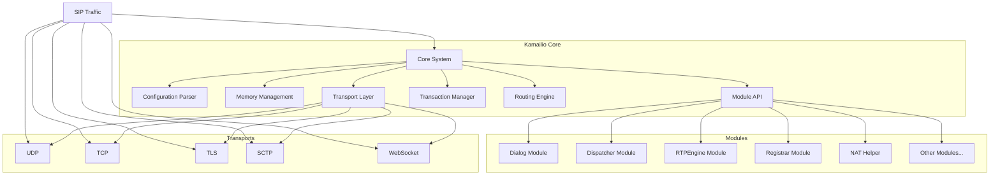
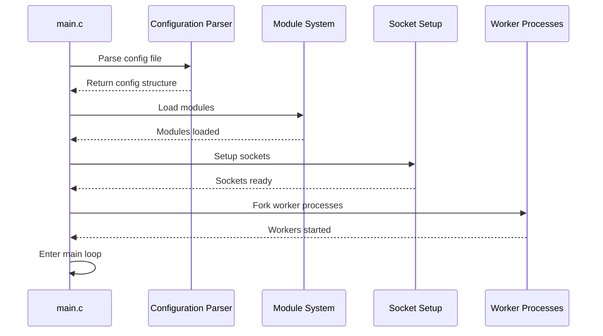
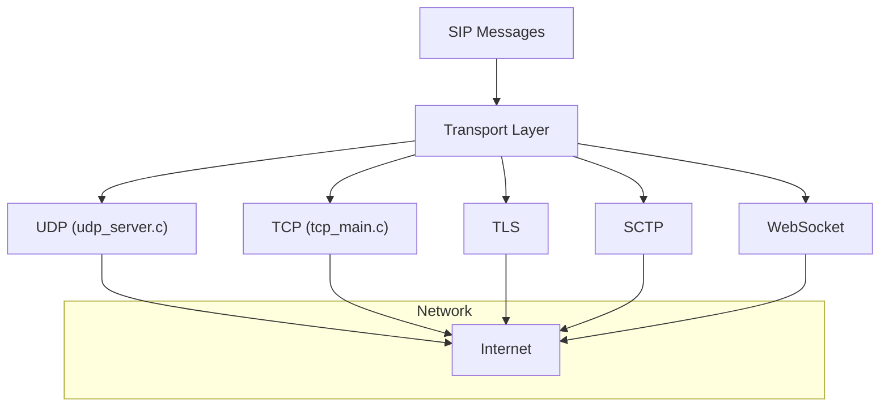
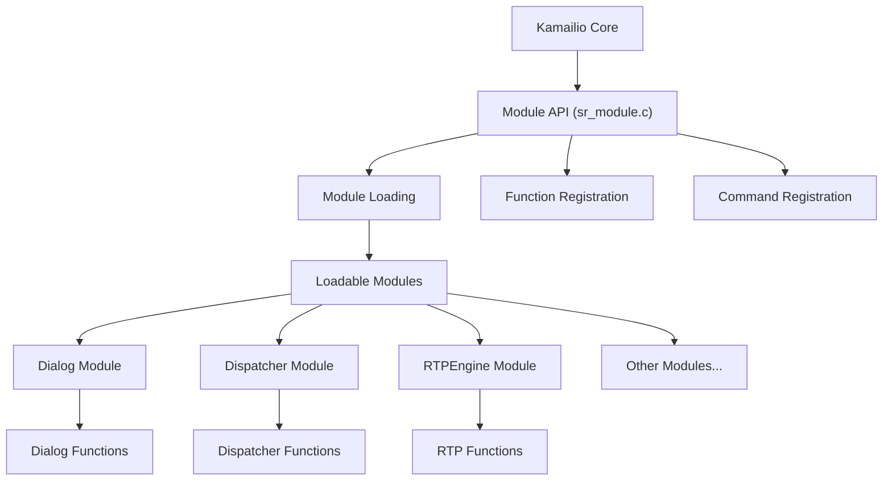
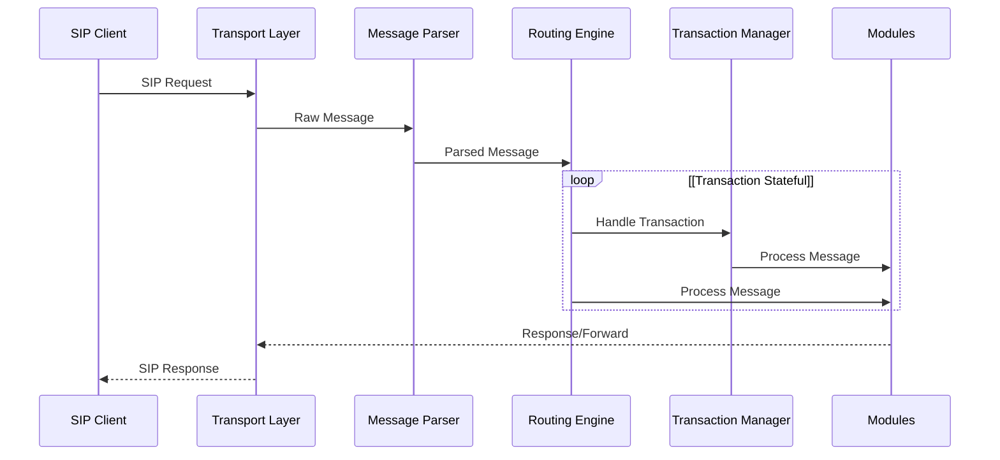
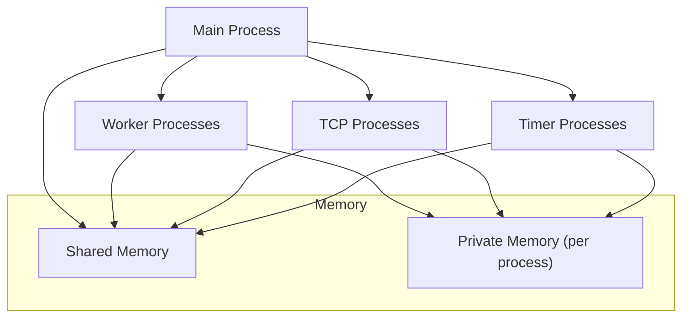
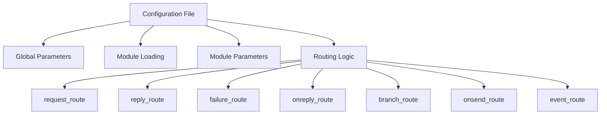

# Overview

> **Relevant source files**
> * [misc/examples/pkg/sipcapture.cfg](https://github.com/kamailio/kamailio/blob/2b4e9f8b/misc/examples/pkg/sipcapture.cfg)
> * [pkg/kamailio/Makefile](https://github.com/kamailio/kamailio/blob/2b4e9f8b/pkg/kamailio/Makefile)
> * [pkg/kamailio/README.md](https://github.com/kamailio/kamailio/blob/2b4e9f8b/pkg/kamailio/README.md)
> * [pkg/kamailio/deb/bionic/changelog](https://github.com/kamailio/kamailio/blob/2b4e9f8b/pkg/kamailio/deb/bionic/changelog)
> * [pkg/kamailio/deb/buster/changelog](https://github.com/kamailio/kamailio/blob/2b4e9f8b/pkg/kamailio/deb/buster/changelog)
> * [pkg/kamailio/deb/debian/changelog](https://github.com/kamailio/kamailio/blob/2b4e9f8b/pkg/kamailio/deb/debian/changelog)
> * [pkg/kamailio/deb/focal/changelog](https://github.com/kamailio/kamailio/blob/2b4e9f8b/pkg/kamailio/deb/focal/changelog)
> * [pkg/kamailio/deb/jessie/changelog](https://github.com/kamailio/kamailio/blob/2b4e9f8b/pkg/kamailio/deb/jessie/changelog)
> * [pkg/kamailio/deb/precise/changelog](https://github.com/kamailio/kamailio/blob/2b4e9f8b/pkg/kamailio/deb/precise/changelog)
> * [pkg/kamailio/deb/sid/changelog](https://github.com/kamailio/kamailio/blob/2b4e9f8b/pkg/kamailio/deb/sid/changelog)
> * [pkg/kamailio/deb/stretch/changelog](https://github.com/kamailio/kamailio/blob/2b4e9f8b/pkg/kamailio/deb/stretch/changelog)
> * [pkg/kamailio/deb/trusty/changelog](https://github.com/kamailio/kamailio/blob/2b4e9f8b/pkg/kamailio/deb/trusty/changelog)
> * [pkg/kamailio/deb/wheezy/changelog](https://github.com/kamailio/kamailio/blob/2b4e9f8b/pkg/kamailio/deb/wheezy/changelog)
> * [pkg/kamailio/deb/xenial/changelog](https://github.com/kamailio/kamailio/blob/2b4e9f8b/pkg/kamailio/deb/xenial/changelog)
> * [pkg/kamailio/gentoo/kamailio-9999.ebuild](https://github.com/kamailio/kamailio/blob/2b4e9f8b/pkg/kamailio/gentoo/kamailio-9999.ebuild)
> * [pkg/kamailio/obs/README.md](https://github.com/kamailio/kamailio/blob/2b4e9f8b/pkg/kamailio/obs/README.md)
> * [pkg/kamailio/obs/kamailio-8-x86_64.cfg](https://github.com/kamailio/kamailio/blob/2b4e9f8b/pkg/kamailio/obs/kamailio-8-x86_64.cfg)
> * [pkg/kamailio/obs/kamailio-9-x86_64.cfg](https://github.com/kamailio/kamailio/blob/2b4e9f8b/pkg/kamailio/obs/kamailio-9-x86_64.cfg)
> * [pkg/kamailio/obs/kamailio.init](https://github.com/kamailio/kamailio/blob/2b4e9f8b/pkg/kamailio/obs/kamailio.init)
> * [pkg/kamailio/obs/kamailio.service](https://github.com/kamailio/kamailio/blob/2b4e9f8b/pkg/kamailio/obs/kamailio.service)
> * [pkg/kamailio/obs/kamailio.spec](https://github.com/kamailio/kamailio/blob/2b4e9f8b/pkg/kamailio/obs/kamailio.spec)
> * [pkg/kamailio/obs/kamailio.sysconfig](https://github.com/kamailio/kamailio/blob/2b4e9f8b/pkg/kamailio/obs/kamailio.sysconfig)
> * [pkg/kamailio/obs/kamailio.tmpfiles](https://github.com/kamailio/kamailio/blob/2b4e9f8b/pkg/kamailio/obs/kamailio.tmpfiles)
> * [pkg/kamailio/obs/kamailio@.service](https://github.com/kamailio/kamailio/blob/2b4e9f8b/pkg/kamailio/obs/kamailio@.service)
> * [pkg/kamailio/obs/meta](https://github.com/kamailio/kamailio/blob/2b4e9f8b/pkg/kamailio/obs/meta)
> * [pkg/kamailio/obs/prjconf](https://github.com/kamailio/kamailio/blob/2b4e9f8b/pkg/kamailio/obs/prjconf)
> * [pkg/kamailio/obs/sipcapture.service](https://github.com/kamailio/kamailio/blob/2b4e9f8b/pkg/kamailio/obs/sipcapture.service)
> * [pkg/kamailio/obs/sipcapture.sysconfig](https://github.com/kamailio/kamailio/blob/2b4e9f8b/pkg/kamailio/obs/sipcapture.sysconfig)
> * [pkg/kamailio/obs/sipcapture.tmpfiles](https://github.com/kamailio/kamailio/blob/2b4e9f8b/pkg/kamailio/obs/sipcapture.tmpfiles)
> * [pkg/kamailio/scripts/create-src-rpm.sh](https://github.com/kamailio/kamailio/blob/2b4e9f8b/pkg/kamailio/scripts/create-src-rpm.sh)
> * [pkg/kamailio/scripts/git-archive-all.sh](https://github.com/kamailio/kamailio/blob/2b4e9f8b/pkg/kamailio/scripts/git-archive-all.sh)
> * [src/core/async_task.c](https://github.com/kamailio/kamailio/blob/2b4e9f8b/src/core/async_task.c)
> * [src/core/async_task.h](https://github.com/kamailio/kamailio/blob/2b4e9f8b/src/core/async_task.h)
> * [src/core/cfg.lex](https://github.com/kamailio/kamailio/blob/2b4e9f8b/src/core/cfg.lex)
> * [src/core/cfg.y](https://github.com/kamailio/kamailio/blob/2b4e9f8b/src/core/cfg.y)
> * [src/core/core_cmd.c](https://github.com/kamailio/kamailio/blob/2b4e9f8b/src/core/core_cmd.c)
> * [src/core/events.c](https://github.com/kamailio/kamailio/blob/2b4e9f8b/src/core/events.c)
> * [src/core/events.h](https://github.com/kamailio/kamailio/blob/2b4e9f8b/src/core/events.h)
> * [src/core/flags.c](https://github.com/kamailio/kamailio/blob/2b4e9f8b/src/core/flags.c)
> * [src/core/flags.h](https://github.com/kamailio/kamailio/blob/2b4e9f8b/src/core/flags.h)
> * [src/core/forward.c](https://github.com/kamailio/kamailio/blob/2b4e9f8b/src/core/forward.c)
> * [src/core/forward.h](https://github.com/kamailio/kamailio/blob/2b4e9f8b/src/core/forward.h)
> * [src/core/globals.h](https://github.com/kamailio/kamailio/blob/2b4e9f8b/src/core/globals.h)
> * [src/core/ip_addr.c](https://github.com/kamailio/kamailio/blob/2b4e9f8b/src/core/ip_addr.c)
> * [src/core/ip_addr.h](https://github.com/kamailio/kamailio/blob/2b4e9f8b/src/core/ip_addr.h)
> * [src/core/mod_fix.c](https://github.com/kamailio/kamailio/blob/2b4e9f8b/src/core/mod_fix.c)
> * [src/core/mod_fix.h](https://github.com/kamailio/kamailio/blob/2b4e9f8b/src/core/mod_fix.h)
> * [src/core/modparam.c](https://github.com/kamailio/kamailio/blob/2b4e9f8b/src/core/modparam.c)
> * [src/core/modparam.h](https://github.com/kamailio/kamailio/blob/2b4e9f8b/src/core/modparam.h)
> * [src/core/ppcfg.c](https://github.com/kamailio/kamailio/blob/2b4e9f8b/src/core/ppcfg.c)
> * [src/core/ppcfg.h](https://github.com/kamailio/kamailio/blob/2b4e9f8b/src/core/ppcfg.h)
> * [src/core/receive.c](https://github.com/kamailio/kamailio/blob/2b4e9f8b/src/core/receive.c)
> * [src/core/receive.h](https://github.com/kamailio/kamailio/blob/2b4e9f8b/src/core/receive.h)
> * [src/core/socket_info.c](https://github.com/kamailio/kamailio/blob/2b4e9f8b/src/core/socket_info.c)
> * [src/core/socket_info.h](https://github.com/kamailio/kamailio/blob/2b4e9f8b/src/core/socket_info.h)
> * [src/core/sr_module.c](https://github.com/kamailio/kamailio/blob/2b4e9f8b/src/core/sr_module.c)
> * [src/core/sr_module.h](https://github.com/kamailio/kamailio/blob/2b4e9f8b/src/core/sr_module.h)
> * [src/core/stun.c](https://github.com/kamailio/kamailio/blob/2b4e9f8b/src/core/stun.c)
> * [src/core/tcp_conn.h](https://github.com/kamailio/kamailio/blob/2b4e9f8b/src/core/tcp_conn.h)
> * [src/core/tcp_init.h](https://github.com/kamailio/kamailio/blob/2b4e9f8b/src/core/tcp_init.h)
> * [src/core/tcp_main.c](https://github.com/kamailio/kamailio/blob/2b4e9f8b/src/core/tcp_main.c)
> * [src/core/tcp_read.c](https://github.com/kamailio/kamailio/blob/2b4e9f8b/src/core/tcp_read.c)
> * [src/core/udp_server.c](https://github.com/kamailio/kamailio/blob/2b4e9f8b/src/core/udp_server.c)
> * [src/core/udp_server.h](https://github.com/kamailio/kamailio/blob/2b4e9f8b/src/core/udp_server.h)
> * [src/main.c](https://github.com/kamailio/kamailio/blob/2b4e9f8b/src/main.c)
> * [src/modules/acc/README](https://github.com/kamailio/kamailio/blob/2b4e9f8b/src/modules/acc/README)
> * [src/modules/app_perl/README](https://github.com/kamailio/kamailio/blob/2b4e9f8b/src/modules/app_perl/README)
> * [src/modules/cdp/README](https://github.com/kamailio/kamailio/blob/2b4e9f8b/src/modules/cdp/README)
> * [src/modules/cdp_avp/README](https://github.com/kamailio/kamailio/blob/2b4e9f8b/src/modules/cdp_avp/README)
> * [src/modules/dialog/README](https://github.com/kamailio/kamailio/blob/2b4e9f8b/src/modules/dialog/README)
> * [src/modules/dispatcher/README](https://github.com/kamailio/kamailio/blob/2b4e9f8b/src/modules/dispatcher/README)
> * [src/modules/ims_dialog/README](https://github.com/kamailio/kamailio/blob/2b4e9f8b/src/modules/ims_dialog/README)
> * [src/modules/ims_registrar_scscf/README](https://github.com/kamailio/kamailio/blob/2b4e9f8b/src/modules/ims_registrar_scscf/README)
> * [src/modules/ims_usrloc_pcscf/README](https://github.com/kamailio/kamailio/blob/2b4e9f8b/src/modules/ims_usrloc_pcscf/README)
> * [src/modules/nathelper/README](https://github.com/kamailio/kamailio/blob/2b4e9f8b/src/modules/nathelper/README)
> * [src/modules/registrar/README](https://github.com/kamailio/kamailio/blob/2b4e9f8b/src/modules/registrar/README)
> * [src/modules/rtpengine/README](https://github.com/kamailio/kamailio/blob/2b4e9f8b/src/modules/rtpengine/README)
> * [src/modules/rtpproxy/README](https://github.com/kamailio/kamailio/blob/2b4e9f8b/src/modules/rtpproxy/README)
> * [src/modules/snmpstats/README](https://github.com/kamailio/kamailio/blob/2b4e9f8b/src/modules/snmpstats/README)

Kamailio is an Open Source SIP (Session Initiation Protocol) server designed to handle high volumes of signaling traffic for Voice over IP (VoIP), instant messaging, video calls, and other real-time communication services. This document provides a high-level overview of Kamailio's architecture, its core components, and how they interact with each other.

Kamailio is capable of handling thousands of call setups per second, supports multiple transport protocols, and offers extensive functionality through its modular design. It can be used to build large VoIP servicing platforms or to scale up SIP-to-PSTN gateways, PBX systems, or media servers.

For specific module implementation details, see the corresponding module documentation pages. For core subsystem details, see [Core Architecture](/kamailio/kamailio/2-core-architecture).

Sources: [pkg/kamailio/obs/kamailio.spec L217-L276](https://github.com/kamailio/kamailio/blob/2b4e9f8b/pkg/kamailio/obs/kamailio.spec#L217-L276)

 [src/main.c L24-L33](https://github.com/kamailio/kamailio/blob/2b4e9f8b/src/main.c#L24-L33)

## High-Level Architecture

Kamailio's architecture follows a modular design approach, with a core system that provides essential functionality and a rich set of loadable modules that extend its capabilities.

Sources: [src/main.c L24-L33](https://github.com/kamailio/kamailio/blob/2b4e9f8b/src/main.c#L24-L33)

 [src/core/ip_addr.h L48-L58](https://github.com/kamailio/kamailio/blob/2b4e9f8b/src/core/ip_addr.h#L48-L58)

 [src/core/sr_module.c L31-L50](https://github.com/kamailio/kamailio/blob/2b4e9f8b/src/core/sr_module.c#L31-L50)

## Core Components

### Configuration and Initialization

Kamailio uses a configuration file (typically `/etc/kamailio/kamailio.cfg`) which is parsed during startup to define the server's behavior. The configuration is processed using a lexical analyzer (`cfg.lex`) and a parser (`cfg.y`). On startup, Kamailio initializes its memory, loads modules, sets up network sockets, and forks worker processes.

Sources: [src/main.c L574-L580](https://github.com/kamailio/kamailio/blob/2b4e9f8b/src/main.c#L574-L580)

 [src/core/cfg.lex L30-L48](https://github.com/kamailio/kamailio/blob/2b4e9f8b/src/core/cfg.lex#L30-L48)

 [src/core/cfg.y L29-L71](https://github.com/kamailio/kamailio/blob/2b4e9f8b/src/core/cfg.y#L29-L71)

### Memory Management

Kamailio uses two primary types of memory:

1. **Private Memory (PKG)**: Process-specific memory, not shared between processes
2. **Shared Memory (SHM)**: Memory shared among all Kamailio processes

Memory management is crucial for Kamailio's performance and stability, with configurable sizes and various allocation strategies.

Sources: [src/main.c L518-L522](https://github.com/kamailio/kamailio/blob/2b4e9f8b/src/main.c#L518-L522)

 [src/main.c L431-L444](https://github.com/kamailio/kamailio/blob/2b4e9f8b/src/main.c#L431-L444)

### Transport Layer

Kamailio supports multiple transport protocols:

* **UDP**: Default transport, connectionless
* **TCP**: Connection-oriented transport
* **TLS**: Secure transport over TCP
* **SCTP**: Stream Control Transmission Protocol
* **WS/WSS**: WebSocket and WebSocket Secure

The transport layer handles sending and receiving SIP messages over these protocols. Each protocol has its own implementation and configuration options.

Sources: [src/core/tcp_main.c L22-L27](https://github.com/kamailio/kamailio/blob/2b4e9f8b/src/core/tcp_main.c#L22-L27)

 [src/core/udp_server.c L1-L8](https://github.com/kamailio/kamailio/blob/2b4e9f8b/src/core/udp_server.c#L1-L8)

 [src/core/ip_addr.h L48-L58](https://github.com/kamailio/kamailio/blob/2b4e9f8b/src/core/ip_addr.h#L48-L58)

### Module System

Kamailio's functionality is greatly extended through modules. Modules are loaded at startup and provide specific features like dialog management, dispatcher functionality, or media handling. The module API allows modules to register functions, processes, and command handlers.

Sources: [src/core/sr_module.c L31-L50](https://github.com/kamailio/kamailio/blob/2b4e9f8b/src/core/sr_module.c#L31-L50)

 [src/core/sr_module.h L1-L22](https://github.com/kamailio/kamailio/blob/2b4e9f8b/src/core/sr_module.h#L1-L22)

## Request Processing Flow

When a SIP message arrives, Kamailio processes it through several stages:

1. **Message Reception**: The transport layer receives the message
2. **Parsing**: The message is parsed into a structured format
3. **Routing**: The routing engine determines how to handle the message
4. **Transaction Processing**: If enabled, the transaction manager tracks the message state
5. **Module Processing**: Various modules process the message according to the routing logic
6. **Response Generation/Forwarding**: The message is either responded to or forwarded

Sources: [src/core/receive.c L31-L76](https://github.com/kamailio/kamailio/blob/2b4e9f8b/src/core/receive.c#L31-L76)

 [src/core/tcp_read.c L23-L28](https://github.com/kamailio/kamailio/blob/2b4e9f8b/src/core/tcp_read.c#L23-L28)

## Key Modules

Kamailio's functionality is enhanced through various modules. Some of the key modules include:

### Dialog Module

Manages SIP dialogs, which represent communication sessions between endpoints. The Dialog module tracks dialog state, handles dialog timeouts, and provides dialog-related functions for the routing script.

Sources: [src/modules/dialog/README L29-L40](https://github.com/kamailio/kamailio/blob/2b4e9f8b/src/modules/dialog/README#L29-L40)

### Dispatcher Module

Provides load balancing and failover functionality. It can distribute calls among multiple SIP servers using various algorithms like round-robin, weight-based load balancing, call load distribution, and hashing over SIP message attributes.

Sources: [src/modules/dispatcher/README L329-L345](https://github.com/kamailio/kamailio/blob/2b4e9f8b/src/modules/dispatcher/README#L329-L345)

### RTPEngine Module

Interfaces with the RTPEngine for media handling. It can be used for NAT traversal, media recording, transcoding, and other media-related operations.

Sources: [src/modules/rtpengine/README L31-L44](https://github.com/kamailio/kamailio/blob/2b4e9f8b/src/modules/rtpengine/README#L31-L44)

### Registrar Module

Handles SIP registration requests. It processes REGISTER messages, maintains a user location database, and provides functions for the routing script to access registration information.

Sources: [src/modules/registrar/README L29-L44](https://github.com/kamailio/kamailio/blob/2b4e9f8b/src/modules/registrar/README#L29-L44)

## Memory Model and Process Architecture

Kamailio uses a multi-process architecture with a main process and multiple worker processes. Each process has its own private memory space, and they communicate through shared memory.

Sources: [src/main.c L336-L360](https://github.com/kamailio/kamailio/blob/2b4e9f8b/src/main.c#L336-L360)

## Configuration File Structure

The Kamailio configuration file is structured into several sections:

1. **Global Parameters**: Server-wide settings
2. **Module Loading**: Loading and configuring modules
3. **Module Parameters**: Module-specific configuration
4. **Routing Rules**: Logic for handling SIP messages

Sources: [src/core/cfg.y L674-L696](https://github.com/kamailio/kamailio/blob/2b4e9f8b/src/core/cfg.y#L674-L696)

## Conclusion

Kamailio is a powerful, flexible SIP server with a modular architecture that allows it to be customized for various use cases. Its core provides essential functionality like message parsing, transport handling, and memory management, while modules extend its capabilities for specific requirements. The combination of a robust core and extensive module ecosystem makes Kamailio suitable for a wide range of SIP-based communication services.