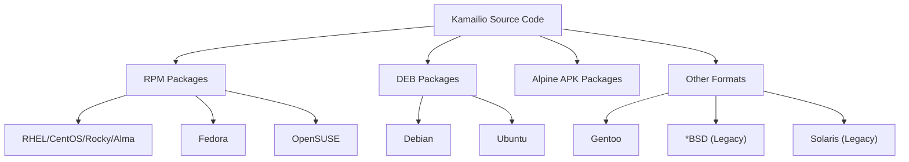
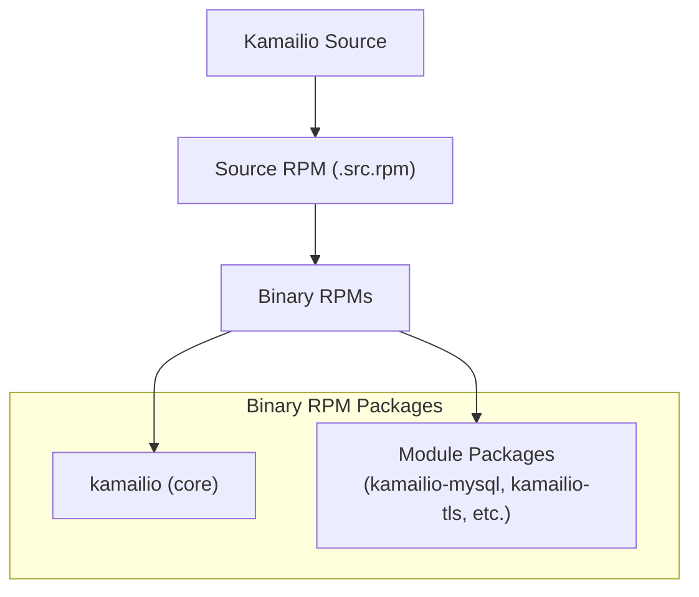
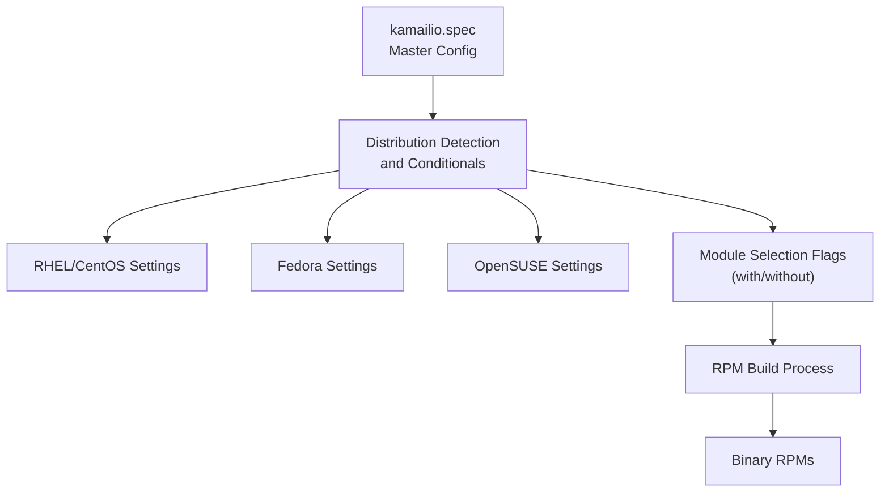
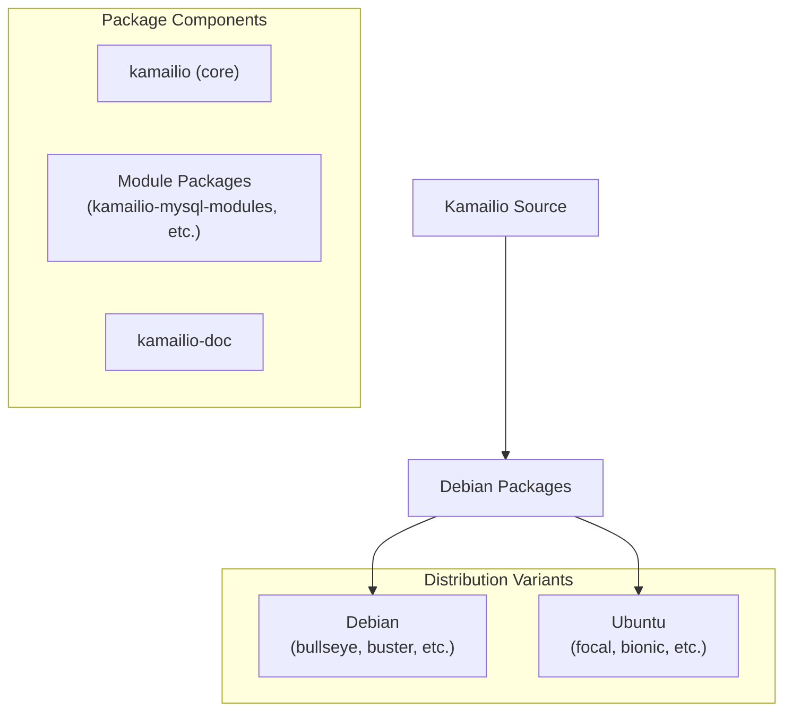
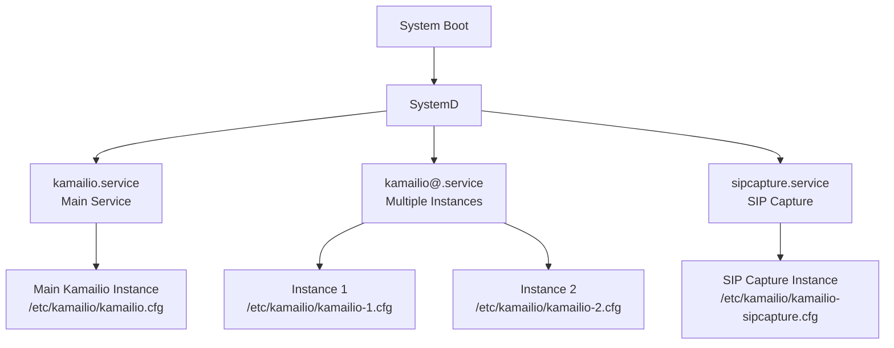
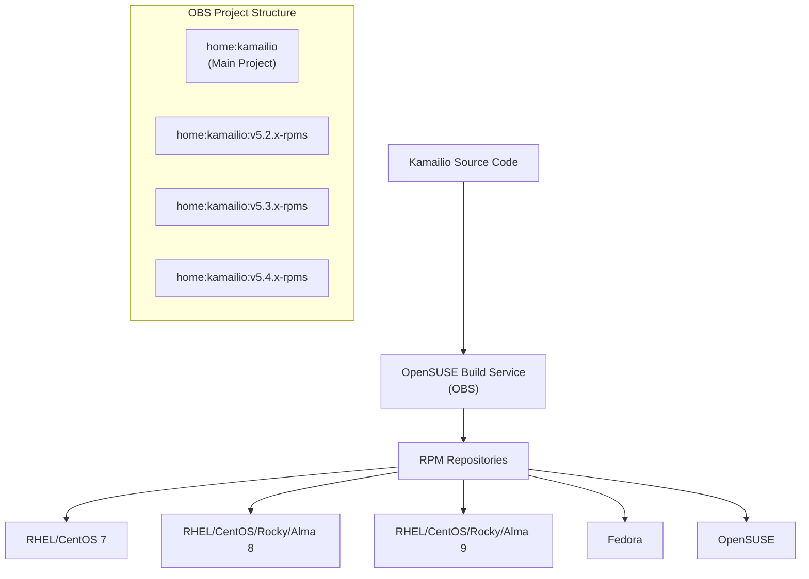

# Packaging and Deployment

> **Relevant source files**
> * [misc/examples/pkg/sipcapture.cfg](https://github.com/kamailio/kamailio/blob/2b4e9f8b/misc/examples/pkg/sipcapture.cfg)
> * [pkg/kamailio/Makefile](https://github.com/kamailio/kamailio/blob/2b4e9f8b/pkg/kamailio/Makefile)
> * [pkg/kamailio/README.md](https://github.com/kamailio/kamailio/blob/2b4e9f8b/pkg/kamailio/README.md)
> * [pkg/kamailio/deb/bionic/changelog](https://github.com/kamailio/kamailio/blob/2b4e9f8b/pkg/kamailio/deb/bionic/changelog)
> * [pkg/kamailio/deb/buster/changelog](https://github.com/kamailio/kamailio/blob/2b4e9f8b/pkg/kamailio/deb/buster/changelog)
> * [pkg/kamailio/deb/debian/changelog](https://github.com/kamailio/kamailio/blob/2b4e9f8b/pkg/kamailio/deb/debian/changelog)
> * [pkg/kamailio/deb/focal/changelog](https://github.com/kamailio/kamailio/blob/2b4e9f8b/pkg/kamailio/deb/focal/changelog)
> * [pkg/kamailio/deb/jessie/changelog](https://github.com/kamailio/kamailio/blob/2b4e9f8b/pkg/kamailio/deb/jessie/changelog)
> * [pkg/kamailio/deb/precise/changelog](https://github.com/kamailio/kamailio/blob/2b4e9f8b/pkg/kamailio/deb/precise/changelog)
> * [pkg/kamailio/deb/sid/changelog](https://github.com/kamailio/kamailio/blob/2b4e9f8b/pkg/kamailio/deb/sid/changelog)
> * [pkg/kamailio/deb/stretch/changelog](https://github.com/kamailio/kamailio/blob/2b4e9f8b/pkg/kamailio/deb/stretch/changelog)
> * [pkg/kamailio/deb/trusty/changelog](https://github.com/kamailio/kamailio/blob/2b4e9f8b/pkg/kamailio/deb/trusty/changelog)
> * [pkg/kamailio/deb/wheezy/changelog](https://github.com/kamailio/kamailio/blob/2b4e9f8b/pkg/kamailio/deb/wheezy/changelog)
> * [pkg/kamailio/deb/xenial/changelog](https://github.com/kamailio/kamailio/blob/2b4e9f8b/pkg/kamailio/deb/xenial/changelog)
> * [pkg/kamailio/gentoo/kamailio-9999.ebuild](https://github.com/kamailio/kamailio/blob/2b4e9f8b/pkg/kamailio/gentoo/kamailio-9999.ebuild)
> * [pkg/kamailio/obs/README.md](https://github.com/kamailio/kamailio/blob/2b4e9f8b/pkg/kamailio/obs/README.md)
> * [pkg/kamailio/obs/kamailio-8-x86_64.cfg](https://github.com/kamailio/kamailio/blob/2b4e9f8b/pkg/kamailio/obs/kamailio-8-x86_64.cfg)
> * [pkg/kamailio/obs/kamailio-9-x86_64.cfg](https://github.com/kamailio/kamailio/blob/2b4e9f8b/pkg/kamailio/obs/kamailio-9-x86_64.cfg)
> * [pkg/kamailio/obs/kamailio.init](https://github.com/kamailio/kamailio/blob/2b4e9f8b/pkg/kamailio/obs/kamailio.init)
> * [pkg/kamailio/obs/kamailio.service](https://github.com/kamailio/kamailio/blob/2b4e9f8b/pkg/kamailio/obs/kamailio.service)
> * [pkg/kamailio/obs/kamailio.spec](https://github.com/kamailio/kamailio/blob/2b4e9f8b/pkg/kamailio/obs/kamailio.spec)
> * [pkg/kamailio/obs/kamailio.sysconfig](https://github.com/kamailio/kamailio/blob/2b4e9f8b/pkg/kamailio/obs/kamailio.sysconfig)
> * [pkg/kamailio/obs/kamailio.tmpfiles](https://github.com/kamailio/kamailio/blob/2b4e9f8b/pkg/kamailio/obs/kamailio.tmpfiles)
> * [pkg/kamailio/obs/kamailio@.service](https://github.com/kamailio/kamailio/blob/2b4e9f8b/pkg/kamailio/obs/kamailio@.service)
> * [pkg/kamailio/obs/meta](https://github.com/kamailio/kamailio/blob/2b4e9f8b/pkg/kamailio/obs/meta)
> * [pkg/kamailio/obs/prjconf](https://github.com/kamailio/kamailio/blob/2b4e9f8b/pkg/kamailio/obs/prjconf)
> * [pkg/kamailio/obs/sipcapture.service](https://github.com/kamailio/kamailio/blob/2b4e9f8b/pkg/kamailio/obs/sipcapture.service)
> * [pkg/kamailio/obs/sipcapture.sysconfig](https://github.com/kamailio/kamailio/blob/2b4e9f8b/pkg/kamailio/obs/sipcapture.sysconfig)
> * [pkg/kamailio/obs/sipcapture.tmpfiles](https://github.com/kamailio/kamailio/blob/2b4e9f8b/pkg/kamailio/obs/sipcapture.tmpfiles)
> * [pkg/kamailio/scripts/create-src-rpm.sh](https://github.com/kamailio/kamailio/blob/2b4e9f8b/pkg/kamailio/scripts/create-src-rpm.sh)
> * [pkg/kamailio/scripts/git-archive-all.sh](https://github.com/kamailio/kamailio/blob/2b4e9f8b/pkg/kamailio/scripts/git-archive-all.sh)

This document describes the packaging systems and deployment options for Kamailio SIP Server. It covers the various package formats available (RPM, DEB, etc.), their build processes, and deployment considerations. For information about the build system itself, see [Build System](/kamailio/kamailio/5-build-system).

## 1. Packaging Systems Overview

Kamailio supports multiple packaging formats for different operating system distributions:



The actively maintained packaging systems are:

* RPM packages (RHEL/CentOS, Fedora, OpenSUSE)
* DEB packages (Debian, Ubuntu)
* Alpine Linux packages

Sources: [pkg/kamailio/README.md L1-L88](https://github.com/kamailio/kamailio/blob/2b4e9f8b/pkg/kamailio/README.md#L1-L88)

## 2. RPM Packaging

### 2.1 Overview

The RPM packaging system is maintained in the `pkg/kamailio/obs` directory, designed to work with the OpenSUSE Build Service (OBS) and local builds using mock.



Sources: [pkg/kamailio/obs/kamailio.spec L1-L1050](https://github.com/kamailio/kamailio/blob/2b4e9f8b/pkg/kamailio/obs/kamailio.spec#L1-L1050)

 [pkg/kamailio/Makefile L1-L60](https://github.com/kamailio/kamailio/blob/2b4e9f8b/pkg/kamailio/Makefile#L1-L60)

### 2.2 Package Structure

The RPM packaging creates a modular structure:

1. **Core package (`kamailio`)**: Contains the essential components and basic modules
2. **Module packages**: Each optional module is packaged separately (e.g., `kamailio-mysql`, `kamailio-tls`) so users can install only what they need

This approach reduces dependencies and allows for a more tailored installation.

### 2.3 Build Configuration

The RPM spec file uses conditional builds to handle different distributions and module combinations:



The spec file includes conditional logic to handle differences between distributions:

* Feature flags using `%bcond_with` and `%bcond_without`
* OS-specific dependencies and paths
* Build requirements for each module

Sources: [pkg/kamailio/obs/kamailio.spec L5-L189](https://github.com/kamailio/kamailio/blob/2b4e9f8b/pkg/kamailio/obs/kamailio.spec#L5-L189)

### 2.4 Local Build Process

For local builds, you can use the provided scripts:

1. Create a source tarball from the repository
2. Prepare the spec file with version and release information
3. Build source and binary RPMs using mock

Example:

```sql
# Prepare source and build RPMs
./pkg/kamailio/scripts/create-src-rpm.sh '5.8.0' '1'
mock -r pkg/kamailio/obs/kamailio-8-x86_64.cfg rpmbuild/SRPMS/kamailio-5.8.0-1.src.rpm
```

Sources: [pkg/kamailio/scripts/create-src-rpm.sh L1-L37](https://github.com/kamailio/kamailio/blob/2b4e9f8b/pkg/kamailio/scripts/create-src-rpm.sh#L1-L37)

 [pkg/kamailio/obs/README.md L1-L34](https://github.com/kamailio/kamailio/blob/2b4e9f8b/pkg/kamailio/obs/README.md#L1-L34)

## 3. Debian Packaging

### 3.1 Overview

The Debian packaging system supports various Debian and Ubuntu releases. Each distribution variant has its own packaging configuration in `pkg/kamailio/deb/`.



Sources: [pkg/kamailio/deb/debian/changelog L1-L6](https://github.com/kamailio/kamailio/blob/2b4e9f8b/pkg/kamailio/deb/debian/changelog#L1-L6)

 [pkg/kamailio/deb/buster/changelog L1-L6](https://github.com/kamailio/kamailio/blob/2b4e9f8b/pkg/kamailio/deb/buster/changelog#L1-L6)

 [pkg/kamailio/deb/focal/changelog L1-L6](https://github.com/kamailio/kamailio/blob/2b4e9f8b/pkg/kamailio/deb/focal/changelog#L1-L6)

### 3.2 Build Process

To build Debian packages:

1. From the Kamailio source root directory, create a symlink to the desired distribution: ``` ln -s pkg/kamailio/deb/stretch debian ```
2. Run the build command: ``` make deb ```
3. The DEB files will be generated in the parent directory.

Sources: [pkg/kamailio/README.md L8-L30](https://github.com/kamailio/kamailio/blob/2b4e9f8b/pkg/kamailio/README.md#L8-L30)

## 4. Other Packaging Systems

### 4.1 Alpine Linux

Alpine Linux uses its own packaging format (APK). Kamailio provides build scripts to create Alpine packages.

Build process:

```
make cfg
make apk
cd alpine && abuild -r
```

Sources: [pkg/kamailio/README.md L80-L88](https://github.com/kamailio/kamailio/blob/2b4e9f8b/pkg/kamailio/README.md#L80-L88)

 [pkg/kamailio/Makefile L30-L36](https://github.com/kamailio/kamailio/blob/2b4e9f8b/pkg/kamailio/Makefile#L30-L36)

### 4.2 Gentoo

Kamailio provides an ebuild for Gentoo in `pkg/kamailio/gentoo/kamailio-9999.ebuild`.

Sources: [pkg/kamailio/gentoo/kamailio-9999.ebuild L1-L162](https://github.com/kamailio/kamailio/blob/2b4e9f8b/pkg/kamailio/gentoo/kamailio-9999.ebuild#L1-L162)

### 4.3 Legacy Packaging

The repository contains packaging specs for other systems, but they are not actively maintained:

* FreeBSD
* NetBSD
* OpenBSD
* Solaris

## 5. Deployment Options

### 5.1 SystemD Service

Kamailio includes systemd service files for modern Linux distributions:

1. **Basic Service**: `kamailio.service` - For running a single Kamailio instance
2. **Template Service**: `kamailio@.service` - For running multiple Kamailio instances
3. **SIPCapture Service**: `sipcapture.service` - For the SIP capture functionality



The service files set up appropriate:

* User and group permissions (typically `kamailio:kamailio`)
* Environment variables
* Runtime directories
* Restart policies

Sources: [pkg/kamailio/obs/kamailio.service L1-L22](https://github.com/kamailio/kamailio/blob/2b4e9f8b/pkg/kamailio/obs/kamailio.service#L1-L22)

 [pkg/kamailio/obs/kamailio L1-L29](https://github.com/kamailio/kamailio/blob/2b4e9f8b/pkg/kamailio/obs/kamailio@.service#L1-L29)

 [pkg/kamailio/obs/sipcapture.service L1-L27](https://github.com/kamailio/kamailio/blob/2b4e9f8b/pkg/kamailio/obs/sipcapture.service#L1-L27)

### 5.2 Init Script (Legacy)

For older systems without systemd, Kamailio provides an init script (`kamailio.init`).

Key features:

* Start/stop/restart functionality
* Configuration validation before startup
* Process monitoring
* Support for core dumps (for debugging)

Sources: [pkg/kamailio/obs/kamailio.init L1-L142](https://github.com/kamailio/kamailio/blob/2b4e9f8b/pkg/kamailio/obs/kamailio.init#L1-L142)

### 5.3 Multiple Instance Deployment

Kamailio supports running multiple instances on the same system:

1. **Using Template Service**: The `kamailio@.service` template allows running multiple instances with different configurations
2. **Configuration**: Each instance uses a separate configuration file (e.g., `kamailio-1.cfg`, `kamailio-2.cfg`)
3. **Environment**: Each instance can have its own environment file (`/etc/sysconfig/kamailio-INSTANCE`)

This approach is useful for:

* Running different configurations for different purposes
* Testing configurations before deploying to production
* Separating traffic for different clients/services

Sources: [pkg/kamailio/obs/kamailio L1-L29](https://github.com/kamailio/kamailio/blob/2b4e9f8b/pkg/kamailio/obs/kamailio@.service#L1-L29)

## 6. Configuration Files

### 6.1 System Configuration

Each packaging system places configuration files in standard locations:

1. **Main Configuration**: `/etc/kamailio/kamailio.cfg`
2. **Environment Variables**: * RPM: `/etc/sysconfig/kamailio` * Debian: `/etc/default/kamailio`
3. **Runtime Directories**: * `/run/kamailio/` (systemd) * `/var/run/kamailio/` (init script)

Key environment variables:

* `SHM_MEMORY`: Shared memory allocation in MB (default: 64)
* `PKG_MEMORY`: Per-process memory allocation in MB (default: 8)
* `CFGFILE`: Path to the configuration file
* `DUMP_CORE`: Whether to enable core dumps (yes/no)

Sources: [pkg/kamailio/obs/kamailio.sysconfig L1-L19](https://github.com/kamailio/kamailio/blob/2b4e9f8b/pkg/kamailio/obs/kamailio.sysconfig#L1-L19)

 [pkg/kamailio/obs/kamailio.tmpfiles L1-L7](https://github.com/kamailio/kamailio/blob/2b4e9f8b/pkg/kamailio/obs/kamailio.tmpfiles#L1-L7)

### 6.2 SIPCapture Configuration

For SIP capture functionality, additional configurations are provided:

1. **Configuration File**: `/etc/kamailio/kamailio-sipcapture.cfg`
2. **Service File**: `sipcapture.service`
3. **Environment File**: `/etc/sysconfig/sipcapture`

The SIPCapture configuration allows Kamailio to function as a VoIP monitoring system.

Sources: [pkg/kamailio/obs/sipcapture.service L1-L27](https://github.com/kamailio/kamailio/blob/2b4e9f8b/pkg/kamailio/obs/sipcapture.service#L1-L27)

 [pkg/kamailio/obs/sipcapture.sysconfig L1-L13](https://github.com/kamailio/kamailio/blob/2b4e9f8b/pkg/kamailio/obs/sipcapture.sysconfig#L1-L13)

 [pkg/kamailio/obs/sipcapture.tmpfiles L1-L2](https://github.com/kamailio/kamailio/blob/2b4e9f8b/pkg/kamailio/obs/sipcapture.tmpfiles#L1-L2)

 [misc/examples/pkg/sipcapture.cfg L1-L808](https://github.com/kamailio/kamailio/blob/2b4e9f8b/misc/examples/pkg/sipcapture.cfg#L1-L808)

## 7. OpenSUSE Build Service (OBS)

Kamailio maintains official packages in the OpenSUSE Build Service, which provides packages for multiple distributions from a single source.



The OBS build configuration includes:

* Project metadata (in `meta` file)
* Build targets for different distributions
* Repository configurations

The OBS project URL is: [https://build.opensuse.org/project/show/home:kamailio](https://build.opensuse.org/project/show/home:kamailio)

Sources: [pkg/kamailio/obs/meta L1-L65](https://github.com/kamailio/kamailio/blob/2b4e9f8b/pkg/kamailio/obs/meta#L1-L65)

 [pkg/kamailio/README.md L58-L65](https://github.com/kamailio/kamailio/blob/2b4e9f8b/pkg/kamailio/README.md#L58-L65)