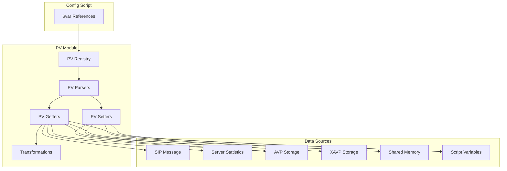
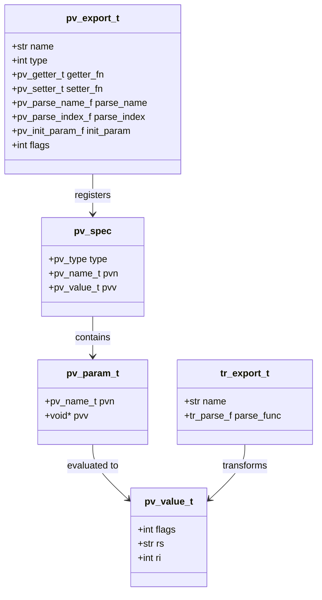
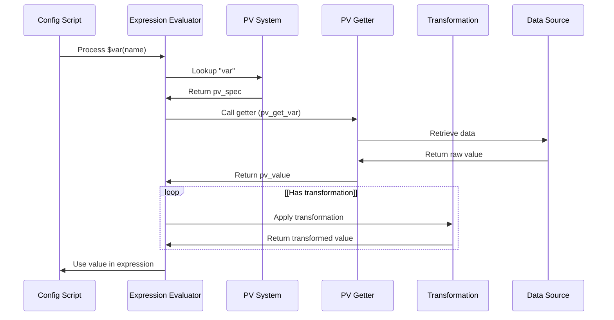
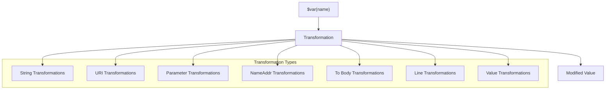
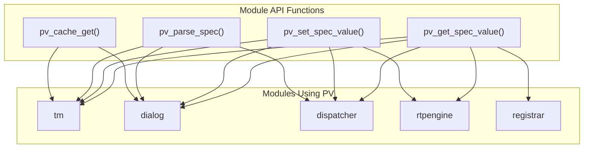

# Pseudo-Variables System

> **Relevant source files**
> * [src/modules/pv/Makefile](https://github.com/kamailio/kamailio/blob/2b4e9f8b/src/modules/pv/Makefile)
> * [src/modules/pv/doc/pv.xml](https://github.com/kamailio/kamailio/blob/2b4e9f8b/src/modules/pv/doc/pv.xml)
> * [src/modules/pv/doc/pv_admin.xml](https://github.com/kamailio/kamailio/blob/2b4e9f8b/src/modules/pv/doc/pv_admin.xml)
> * [src/modules/pv/pv.c](https://github.com/kamailio/kamailio/blob/2b4e9f8b/src/modules/pv/pv.c)
> * [src/modules/pv/pv_branch.c](https://github.com/kamailio/kamailio/blob/2b4e9f8b/src/modules/pv/pv_branch.c)
> * [src/modules/pv/pv_branch.h](https://github.com/kamailio/kamailio/blob/2b4e9f8b/src/modules/pv/pv_branch.h)
> * [src/modules/pv/pv_core.c](https://github.com/kamailio/kamailio/blob/2b4e9f8b/src/modules/pv/pv_core.c)
> * [src/modules/pv/pv_core.h](https://github.com/kamailio/kamailio/blob/2b4e9f8b/src/modules/pv/pv_core.h)
> * [src/modules/pv/pv_select.c](https://github.com/kamailio/kamailio/blob/2b4e9f8b/src/modules/pv/pv_select.c)
> * [src/modules/pv/pv_select.h](https://github.com/kamailio/kamailio/blob/2b4e9f8b/src/modules/pv/pv_select.h)
> * [src/modules/pv/pv_shv.c](https://github.com/kamailio/kamailio/blob/2b4e9f8b/src/modules/pv/pv_shv.c)
> * [src/modules/pv/pv_shv.h](https://github.com/kamailio/kamailio/blob/2b4e9f8b/src/modules/pv/pv_shv.h)
> * [src/modules/pv/pv_stats.c](https://github.com/kamailio/kamailio/blob/2b4e9f8b/src/modules/pv/pv_stats.c)
> * [src/modules/pv/pv_stats.h](https://github.com/kamailio/kamailio/blob/2b4e9f8b/src/modules/pv/pv_stats.h)
> * [src/modules/pv/pv_svar.c](https://github.com/kamailio/kamailio/blob/2b4e9f8b/src/modules/pv/pv_svar.c)
> * [src/modules/pv/pv_svar.h](https://github.com/kamailio/kamailio/blob/2b4e9f8b/src/modules/pv/pv_svar.h)
> * [src/modules/pv/pv_time.h](https://github.com/kamailio/kamailio/blob/2b4e9f8b/src/modules/pv/pv_time.h)
> * [src/modules/pv/pv_trans.c](https://github.com/kamailio/kamailio/blob/2b4e9f8b/src/modules/pv/pv_trans.c)
> * [src/modules/pv/pv_trans.h](https://github.com/kamailio/kamailio/blob/2b4e9f8b/src/modules/pv/pv_trans.h)
> * [src/modules/pv/pv_xavp.c](https://github.com/kamailio/kamailio/blob/2b4e9f8b/src/modules/pv/pv_xavp.c)
> * [src/modules/pv/pv_xavp.h](https://github.com/kamailio/kamailio/blob/2b4e9f8b/src/modules/pv/pv_xavp.h)

The Pseudo-Variables System is a core component of Kamailio that provides a mechanism for accessing and manipulating various types of data during SIP message processing. It enables configuration scripts to reference data from the SIP message, server state, and user-defined storage in a uniform and flexible way.

This document provides an overview of how the pseudo-variables system works in Kamailio, its architecture, the types of available pseudo-variables, and how transformations can be applied to manipulate their values.

## 1. Architecture Overview

The pseudo-variables system is implemented as a modular framework that allows various parts of Kamailio to register variables that can be accessed in configuration scripts using the `$varname` syntax.



Sources: [src/modules/pv/pv.c L58-L473](https://github.com/kamailio/kamailio/blob/2b4e9f8b/src/modules/pv/pv.c#L58-L473)

 [src/modules/pv/pv_core.c L30-L161](https://github.com/kamailio/kamailio/blob/2b4e9f8b/src/modules/pv/pv_core.c#L30-L161)

### 1.1 Core Components

The pseudo-variables system consists of the following core components:

1. **PV Registry**: A central registry of all available pseudo-variables
2. **PV Parsers**: Functions that parse variable references in the configuration script
3. **PV Getters**: Functions that retrieve values from various data sources
4. **PV Setters**: Functions that store values in various data storage mechanisms
5. **Transformations**: Functions that modify values before they are used



Sources: [src/modules/pv/pv.c L54-L473](https://github.com/kamailio/kamailio/blob/2b4e9f8b/src/modules/pv/pv.c#L54-L473)

 [src/modules/pv/pv_trans.c L24-L111](https://github.com/kamailio/kamailio/blob/2b4e9f8b/src/modules/pv/pv_trans.c#L24-L111)

## 2. Pseudo-Variable Types

Kamailio supports several types of pseudo-variables, each serving a different purpose and accessing different data sources.

### 2.1 SIP Message Variables

These variables allow access to different parts of the SIP message being processed.

| Variable | Description | Example |
| --- | --- | --- |
| `$ru` | Request URI | `$ru` |
| `$rU` | Request URI username | `$rU` |
| `$rd` | Request URI domain | `$rd` |
| `$rp` | Request URI port | `$rp` |
| `$fu` | From URI | `$fu` |
| `$fU` | From username | `$fU` |
| `$fd` | From domain | `$fd` |
| `$tu` | To URI | `$tu` |
| `$tU` | To username | `$tU` |
| `$td` | To domain | `$td` |
| `$ci` | Call-ID | `$ci` |
| `$cs` | CSeq number | `$cs` |
| `$rm` | Request method | `$rm` |
| `$rs` | Response status | `$rs` |
| `$ua` | User-Agent | `$ua` |
| `$mb` | Message body | `$mb` |

Sources: [src/modules/pv/pv_core.c L124-L250](https://github.com/kamailio/kamailio/blob/2b4e9f8b/src/modules/pv/pv_core.c#L124-L250)

 [src/modules/pv/pv_core.c L251-L350](https://github.com/kamailio/kamailio/blob/2b4e9f8b/src/modules/pv/pv_core.c#L251-L350)

 [src/modules/pv/pv.c L153-L170](https://github.com/kamailio/kamailio/blob/2b4e9f8b/src/modules/pv/pv.c#L153-L170)

 [src/modules/pv/pv.c L302-L347](https://github.com/kamailio/kamailio/blob/2b4e9f8b/src/modules/pv/pv.c#L302-L347)

### 2.2 Storage Variables

These variables provide mechanisms to store and retrieve values.

| Variable Type | Description | Example |
| --- | --- | --- |
| `$var(name)` | Script variables (per-process) | `$var(count)` |
| `$shv(name)` | Shared variables (across all processes) | `$shv(global_counter)` |
| `$avp(name)` | Attribute-Value Pairs | `$avp(user_id)` |
| `$xavp(name=>key)` | Extended AVP (nested data structures) | `$xavp(profile=>name)` |
| `$xavu(name=>key)` | User XAVP | `$xavu(cfg=>domain)` |
| `$xavi(name=>key)` | Index XAVP | `$xavi(list=>item)` |

Sources: [src/modules/pv/pv_svar.c L42-L86](https://github.com/kamailio/kamailio/blob/2b4e9f8b/src/modules/pv/pv_svar.c#L42-L86)

 [src/modules/pv/pv_shv.c L144-L185](https://github.com/kamailio/kamailio/blob/2b4e9f8b/src/modules/pv/pv_shv.c#L144-L185)

 [src/modules/pv/pv_xavp.c L30-L161](https://github.com/kamailio/kamailio/blob/2b4e9f8b/src/modules/pv/pv_xavp.c#L30-L161)

### 2.3 Network Variables

These variables provide information about the network connections.

| Variable | Description | Example |
| --- | --- | --- |
| `$si` | Source IP address | `$si` |
| `$sp` | Source port | `$sp` |
| `$Ri` | Received IP address | `$Ri` |
| `$Rp` | Received port | `$Rp` |
| `$pr` | Protocol (UDP, TCP, etc.) | `$pr` |
| `$af` | Address family (IPv4, IPv6) | `$af` |
| `$fs` | Force send socket | `$fs` |

Sources: [src/modules/pv/pv_core.c L734-L763](https://github.com/kamailio/kamailio/blob/2b4e9f8b/src/modules/pv/pv_core.c#L734-L763)

 [src/modules/pv/pv_core.c L825-L849](https://github.com/kamailio/kamailio/blob/2b4e9f8b/src/modules/pv/pv_core.c#L825-L849)

 [src/modules/pv/pv.c L294-L299](https://github.com/kamailio/kamailio/blob/2b4e9f8b/src/modules/pv/pv.c#L294-L299)

### 2.4 System and Utility Variables

These variables provide various system information and utilities.

| Variable | Description | Example |
| --- | --- | --- |
| `$time(name)` | Current time components | `$time(year)`, `$time(hour)` |
| `$timef(format)` | Formatted time string | `$timef(%Y-%m-%d)` |
| `$stat(name)` | Server statistics | `$stat(rcv_requests)` |
| `$sel(name)` | Select results | `$sel(cfg_line.sip)` |
| `$env(name)` | Environment variables | `$env(PATH)` |
| `$T` | Transaction state information | `$T(id)` |

Sources: [src/modules/pv/pv_time.c](https://github.com/kamailio/kamailio/blob/2b4e9f8b/src/modules/pv/pv_time.c)

 [src/modules/pv/pv_stats.c](https://github.com/kamailio/kamailio/blob/2b4e9f8b/src/modules/pv/pv_stats.c)

 [src/modules/pv/pv_select.c](https://github.com/kamailio/kamailio/blob/2b4e9f8b/src/modules/pv/pv_select.c)

## 3. Variable Processing Flow

When a pseudo-variable is referenced in a configuration script, it goes through several stages of processing:



Sources: [src/modules/pv/pv.c L648-L670](https://github.com/kamailio/kamailio/blob/2b4e9f8b/src/modules/pv/pv.c#L648-L670)

 [src/modules/pv/pv_core.c L81-L147](https://github.com/kamailio/kamailio/blob/2b4e9f8b/src/modules/pv/pv_core.c#L81-L147)

## 4. Transformations System

The transformations system allows modifying pseudo-variable values before they are used. Transformations are specified using the syntax `$var(name){transformation}`.



Sources: [src/modules/pv/pv_trans.c L186-L572](https://github.com/kamailio/kamailio/blob/2b4e9f8b/src/modules/pv/pv_trans.c#L186-L572)

 [src/modules/pv/pv_trans.h L34-L181](https://github.com/kamailio/kamailio/blob/2b4e9f8b/src/modules/pv/pv_trans.h#L34-L181)

### 4.1 String Transformations

String transformations operate on string values.

| Transformation | Description | Example |
| --- | --- | --- |
| `{s.len}` | String length | `$var(name){s.len}` |
| `{s.int}` | Convert to integer | `$var(name){s.int}` |
| `{s.substr,start,length}` | Extract substring | `$var(name){s.substr,0,3}` |
| `{s.select,char,count}` | Select Nth field | `$var(name){s.select,:,1}` |
| `{s.tolower}` | Convert to lowercase | `$var(name){s.tolower}` |
| `{s.toupper}` | Convert to uppercase | `$var(name){s.toupper}` |
| `{s.strip,chars}` | Strip characters | `$var(name){s.strip,\t }` |
| `{s.md5}` | MD5 hash | `$var(name){s.md5}` |
| `{s.encode.base64}` | Base64 encode | `$var(name){s.encode.base64}` |
| `{s.decode.base64}` | Base64 decode | `$var(name){s.decode.base64}` |

Sources: [src/modules/pv/pv_trans.c L195-L260](https://github.com/kamailio/kamailio/blob/2b4e9f8b/src/modules/pv/pv_trans.c#L195-L260)

 [src/modules/pv/pv_trans.h L46-L108](https://github.com/kamailio/kamailio/blob/2b4e9f8b/src/modules/pv/pv_trans.h#L46-L108)

### 4.2 URI Transformations

URI transformations operate on SIP URIs.

| Transformation | Description | Example |
| --- | --- | --- |
| `{uri.user}` | Extract URI username | `$ru{uri.user}` |
| `{uri.host}` | Extract URI host | `$ru{uri.host}` |
| `{uri.port}` | Extract URI port | `$ru{uri.port}` |
| `{uri.params}` | Extract URI parameters | `$ru{uri.params}` |
| `{uri.param,name}` | Extract specific URI parameter | `$ru{uri.param,transport}` |
| `{uri.transport}` | Extract transport parameter | `$ru{uri.transport}` |
| `{uri.headers}` | Extract URI headers | `$ru{uri.headers}` |

Sources: [src/modules/pv/pv_trans.c L2404-L2495](https://github.com/kamailio/kamailio/blob/2b4e9f8b/src/modules/pv/pv_trans.c#L2404-L2495)

 [src/modules/pv/pv_trans.h L110-L132](https://github.com/kamailio/kamailio/blob/2b4e9f8b/src/modules/pv/pv_trans.h#L110-L132)

## 5. Implementation Details

### 5.1 Registration Mechanism

Pseudo-variables are registered with the core module using a structured array, where each entry includes:

* Variable name
* Variable type
* Getter function
* Setter function (optional)
* Name parser function
* Index parser function (optional)
* Initialization function (optional)
* Flags

```
static pv_export_t mod_pvs[] = {
    {{"_s", (sizeof("_s") - 1)}, PVT_OTHER, pv_get__s, 0, pv_parse__s_name, 0, 0, 0},
    {{"af", (sizeof("af") - 1)}, PVT_OTHER, pv_get_af, 0, pv_parse_af_name, 0, 0, 0},
    {{"branch", sizeof("branch") - 1}, PVT_CONTEXT, pv_get_branchx, pv_set_branchx,
        pv_parse_branchx_name, pv_parse_index, 0, 0},
    ...
};
```

Sources: [src/modules/pv/pv.c L68-L473](https://github.com/kamailio/kamailio/blob/2b4e9f8b/src/modules/pv/pv.c#L68-L473)

### 5.2 Getter and Setter Functions

Getter functions follow a standard signature:

```
int pv_get_svar(struct sip_msg *msg, pv_param_t *param, pv_value_t *res);
```

Setter functions follow a standard signature:

```
int pv_set_svar(struct sip_msg *msg, pv_param_t *param, int op, pv_value_t *val);
```

Sources: [src/modules/pv/pv_core.c L81-L106](https://github.com/kamailio/kamailio/blob/2b4e9f8b/src/modules/pv/pv_core.c#L81-L106)

 [src/modules/pv/pv_svar.c L188-L229](https://github.com/kamailio/kamailio/blob/2b4e9f8b/src/modules/pv/pv_svar.c#L188-L229)

### 5.3 Value Structure

Values are stored in a `pv_value_t` structure that can represent different types:

```python
typedef struct _pv_value {
    int flags;            /* value types */
    str rs;               /* string value */
    int ri;               /* integer value */
} pv_value_t, *pv_value_p;
```

Common flags include:

* `PV_VAL_NULL`: Value is NULL
* `PV_VAL_INT`: Value is an integer
* `PV_VAL_STR`: Value is a string
* `PV_TYPE_INT`: Value is of integer type
* `PV_TYPE_STR`: Value is of string type

Sources: [src/modules/pv/pv_core.c L30-L75](https://github.com/kamailio/kamailio/blob/2b4e9f8b/src/modules/pv/pv_core.c#L30-L75)

## 6. Pseudo-Variables Module API

The module exposes an API that allows other modules to access and manipulate pseudo-variables.



The API registration function is:

```
int pv_register_api(pv_api_t *api)
```

Sources: [src/modules/pv/pv.c L535-L536](https://github.com/kamailio/kamailio/blob/2b4e9f8b/src/modules/pv/pv.c#L535-L536)

 [src/modules/pv/pv.c L600-L602](https://github.com/kamailio/kamailio/blob/2b4e9f8b/src/modules/pv/pv.c#L600-L602)

## 7. Usage Examples

Here are some examples of using pseudo-variables in Kamailio configuration scripts:

### 7.1 Basic Variable Access

```python
if ($rU == "alice") {
    # Check if Request URI username is "alice"
    xlog("Request from Alice to $tU\n");
}
```

### 7.2 Using Transformations

```python
# Extract the domain from the From URI
$var(domain) = $fd;

# Convert to lowercase
$var(domain) = $fd{s.tolower};

# Get substring (first 4 characters)
$var(prefix) = $rU{s.substr,0,4};
```

### 7.3 Variable Storage

```javascript
# Store value in script variable
$var(counter) = 1;

# Update counter
$var(counter) = $var(counter) + 1;

# Store in shared variable (visible across processes)
$shv(global) = $var(counter);

# Store in XAVP (structured data)
$xavp(user=>name) = $fU;
$xavp(user=>domain) = $fd;
```

## 8. Conclusion

The Pseudo-Variables System is a powerful feature of Kamailio that provides a flexible way to access and manipulate data during SIP message processing. It serves as a bridge between the configuration script and various data sources, enabling complex routing logic to be implemented easily.

Understanding how pseudo-variables work is essential for developing effective Kamailio configurations, as they are used extensively throughout the configuration scripts and provide access to critical information about SIP messages and server state.