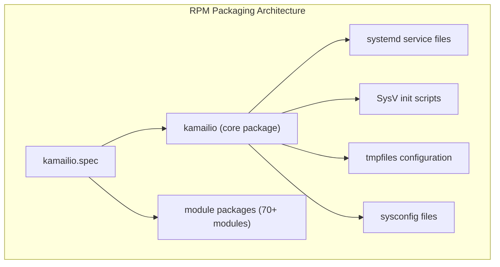
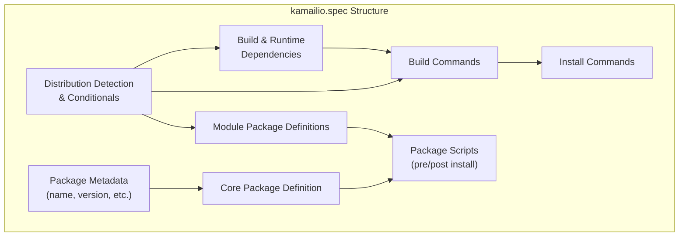
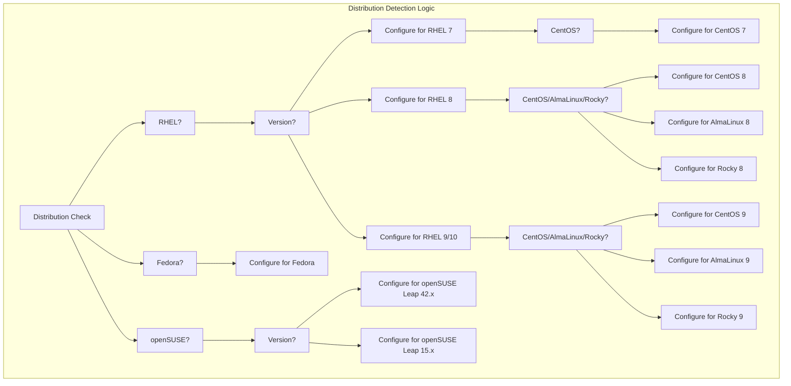
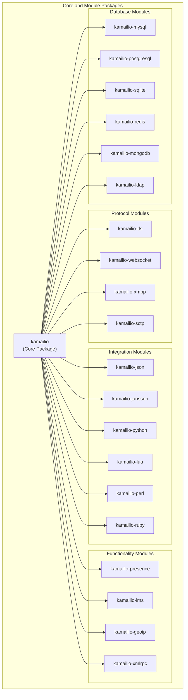
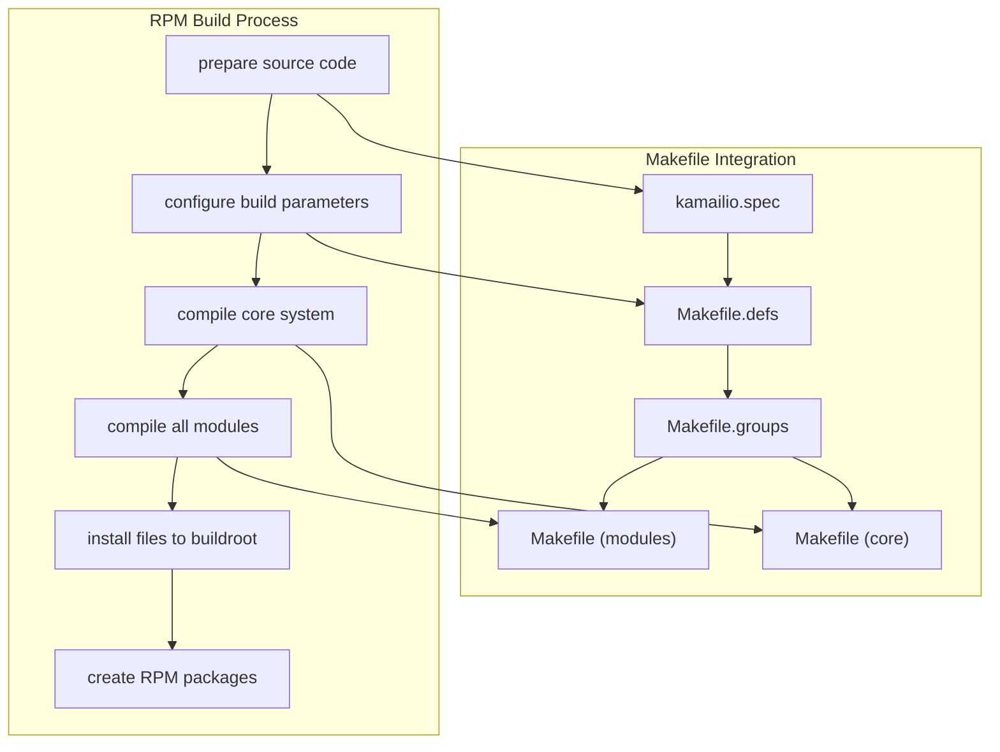
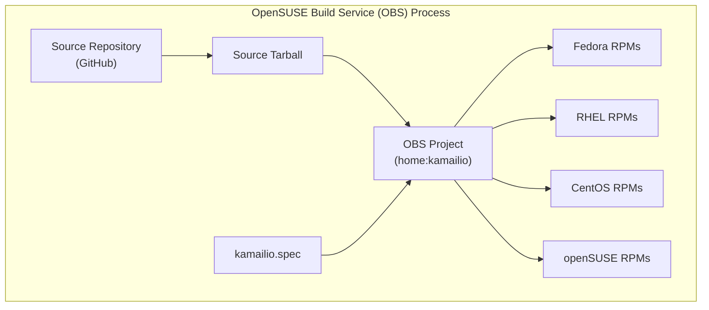
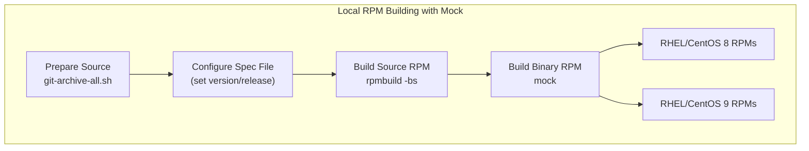

# RPM Packaging

> **Relevant source files**
> * [misc/examples/pkg/sipcapture.cfg](https://github.com/kamailio/kamailio/blob/2b4e9f8b/misc/examples/pkg/sipcapture.cfg)
> * [pkg/kamailio/Makefile](https://github.com/kamailio/kamailio/blob/2b4e9f8b/pkg/kamailio/Makefile)
> * [pkg/kamailio/README.md](https://github.com/kamailio/kamailio/blob/2b4e9f8b/pkg/kamailio/README.md)
> * [pkg/kamailio/gentoo/kamailio-9999.ebuild](https://github.com/kamailio/kamailio/blob/2b4e9f8b/pkg/kamailio/gentoo/kamailio-9999.ebuild)
> * [pkg/kamailio/obs/README.md](https://github.com/kamailio/kamailio/blob/2b4e9f8b/pkg/kamailio/obs/README.md)
> * [pkg/kamailio/obs/kamailio-8-x86_64.cfg](https://github.com/kamailio/kamailio/blob/2b4e9f8b/pkg/kamailio/obs/kamailio-8-x86_64.cfg)
> * [pkg/kamailio/obs/kamailio-9-x86_64.cfg](https://github.com/kamailio/kamailio/blob/2b4e9f8b/pkg/kamailio/obs/kamailio-9-x86_64.cfg)
> * [pkg/kamailio/obs/kamailio.init](https://github.com/kamailio/kamailio/blob/2b4e9f8b/pkg/kamailio/obs/kamailio.init)
> * [pkg/kamailio/obs/kamailio.service](https://github.com/kamailio/kamailio/blob/2b4e9f8b/pkg/kamailio/obs/kamailio.service)
> * [pkg/kamailio/obs/kamailio.spec](https://github.com/kamailio/kamailio/blob/2b4e9f8b/pkg/kamailio/obs/kamailio.spec)
> * [pkg/kamailio/obs/kamailio.sysconfig](https://github.com/kamailio/kamailio/blob/2b4e9f8b/pkg/kamailio/obs/kamailio.sysconfig)
> * [pkg/kamailio/obs/kamailio.tmpfiles](https://github.com/kamailio/kamailio/blob/2b4e9f8b/pkg/kamailio/obs/kamailio.tmpfiles)
> * [pkg/kamailio/obs/kamailio@.service](https://github.com/kamailio/kamailio/blob/2b4e9f8b/pkg/kamailio/obs/kamailio@.service)
> * [pkg/kamailio/obs/meta](https://github.com/kamailio/kamailio/blob/2b4e9f8b/pkg/kamailio/obs/meta)
> * [pkg/kamailio/obs/prjconf](https://github.com/kamailio/kamailio/blob/2b4e9f8b/pkg/kamailio/obs/prjconf)
> * [pkg/kamailio/obs/sipcapture.service](https://github.com/kamailio/kamailio/blob/2b4e9f8b/pkg/kamailio/obs/sipcapture.service)
> * [pkg/kamailio/obs/sipcapture.sysconfig](https://github.com/kamailio/kamailio/blob/2b4e9f8b/pkg/kamailio/obs/sipcapture.sysconfig)
> * [pkg/kamailio/obs/sipcapture.tmpfiles](https://github.com/kamailio/kamailio/blob/2b4e9f8b/pkg/kamailio/obs/sipcapture.tmpfiles)
> * [pkg/kamailio/scripts/create-src-rpm.sh](https://github.com/kamailio/kamailio/blob/2b4e9f8b/pkg/kamailio/scripts/create-src-rpm.sh)
> * [pkg/kamailio/scripts/git-archive-all.sh](https://github.com/kamailio/kamailio/blob/2b4e9f8b/pkg/kamailio/scripts/git-archive-all.sh)

## Purpose and Scope

This document details the RPM packaging system used for creating Kamailio SIP Server packages for RPM-based distributions such as Red Hat Enterprise Linux (RHEL), CentOS, Fedora, and openSUSE. It covers the packaging structure, build process, and customization for various distributions.

For information about Debian packaging, see [Debian Packaging](/kamailio/kamailio/6.1-debian-packaging).

## RPM Packaging Overview

The Kamailio RPM packaging system is designed to build multiple packages following the modular architecture of Kamailio. The main package contains the core functionality, while numerous module packages provide additional features that can be installed as needed.



Sources: [pkg/kamailio/obs/kamailio.spec L217-L228](https://github.com/kamailio/kamailio/blob/2b4e9f8b/pkg/kamailio/obs/kamailio.spec#L217-L228)

 [pkg/kamailio/obs/kamailio.service L1-L22](https://github.com/kamailio/kamailio/blob/2b4e9f8b/pkg/kamailio/obs/kamailio.service#L1-L22)

 [pkg/kamailio/obs/kamailio.init L1-L142](https://github.com/kamailio/kamailio/blob/2b4e9f8b/pkg/kamailio/obs/kamailio.init#L1-L142)

## Spec File Structure

The main specification file (`kamailio.spec`) is the core of the RPM packaging system. It contains all the information needed to build the packages, including version information, dependencies, build steps, and file lists.



Sources: [pkg/kamailio/obs/kamailio.spec L1-L217](https://github.com/kamailio/kamailio/blob/2b4e9f8b/pkg/kamailio/obs/kamailio.spec#L1-L217)

 [pkg/kamailio/obs/kamailio.spec L1186-L1188](https://github.com/kamailio/kamailio/blob/2b4e9f8b/pkg/kamailio/obs/kamailio.spec#L1186-L1188)

### Distribution Detection and Conditionals

The spec file includes extensive conditional sections to handle different distributions and versions. This allows building compatible packages across RHEL, CentOS, Fedora, and openSUSE distributions.



Sources: [pkg/kamailio/obs/kamailio.spec L5-L210](https://github.com/kamailio/kamailio/blob/2b4e9f8b/pkg/kamailio/obs/kamailio.spec#L5-L210)

## Module Packaging

The RPM build system creates modular packages for Kamailio's components. This allows users to install only the modules they need. Below is a representation of module packaging:



Sources: [pkg/kamailio/obs/kamailio.spec L217-L228](https://github.com/kamailio/kamailio/blob/2b4e9f8b/pkg/kamailio/obs/kamailio.spec#L217-L228)

 [pkg/kamailio/obs/kamailio.spec L228-L1184](https://github.com/kamailio/kamailio/blob/2b4e9f8b/pkg/kamailio/obs/kamailio.spec#L228-L1184)

## Build System Integration

The RPM packaging integrates with Kamailio's build system to correctly compile and package all components.



Sources: [pkg/kamailio/obs/kamailio.spec L1200-L1215](https://github.com/kamailio/kamailio/blob/2b4e9f8b/pkg/kamailio/obs/kamailio.spec#L1200-L1215)

 [pkg/kamailio/obs/kamailio.spec L1318-L1423](https://github.com/kamailio/kamailio/blob/2b4e9f8b/pkg/kamailio/obs/kamailio.spec#L1318-L1423)

 [pkg/kamailio/Makefile L1-L60](https://github.com/kamailio/kamailio/blob/2b4e9f8b/pkg/kamailio/Makefile#L1-L60)

## Building RPM Packages

There are multiple ways to build Kamailio RPM packages:

### Using the OpenSUSE Build Service (OBS)

The Kamailio project maintains a project on the OpenSUSE Build Service (OBS) that automatically builds packages for multiple distributions.



Sources: [pkg/kamailio/obs/meta L1-L65](https://github.com/kamailio/kamailio/blob/2b4e9f8b/pkg/kamailio/obs/meta#L1-L65)

 [pkg/kamailio/README.md L32-L64](https://github.com/kamailio/kamailio/blob/2b4e9f8b/pkg/kamailio/README.md#L32-L64)

### Local Building with Mock

For development and testing, you can build packages locally using the mock build system.



Sources: [pkg/kamailio/scripts/create-src-rpm.sh L1-L38](https://github.com/kamailio/kamailio/blob/2b4e9f8b/pkg/kamailio/scripts/create-src-rpm.sh#L1-L38)

 [pkg/kamailio/README.md L20-L35](https://github.com/kamailio/kamailio/blob/2b4e9f8b/pkg/kamailio/README.md#L20-L35)

 [pkg/kamailio/obs/README.md L20-L35](https://github.com/kamailio/kamailio/blob/2b4e9f8b/pkg/kamailio/obs/README.md#L20-L35)

### Build Process Command Sequence

To build RPM packages locally, follow this sequence of commands:

1. Prepare the source tarball:

```markdown
# From the Kamailio source directory
./pkg/kamailio/scripts/git-archive-all.sh kamailio-X.Y.Z ../rpmbuild/SOURCES/kamailio-X.Y.Z_src
```

1. Configure the spec file:

```
cp pkg/kamailio/obs/kamailio.spec ../rpmbuild/SPECS/
sed -i -e s'/^%define ver.*/%define ver X.Y.Z/' -e s'/^%define rel.*/%define rel 1/' ../rpmbuild/SPECS/kamailio.spec
```

1. Build the source RPM:

```
rpmbuild -bs --define "_topdir $PWD/../rpmbuild" ../rpmbuild/SPECS/kamailio.spec
```

1. Build binary RPMs with mock:

```
mock -r pkg/kamailio/obs/kamailio-8-x86_64.cfg ../rpmbuild/SRPMS/kamailio-X.Y.Z-1.src.rpm
mock -r pkg/kamailio/obs/kamailio-9-x86_64.cfg ../rpmbuild/SRPMS/kamailio-X.Y.Z-1.src.rpm
```

Sources: [pkg/kamailio/scripts/create-src-rpm.sh L1-L38](https://github.com/kamailio/kamailio/blob/2b4e9f8b/pkg/kamailio/scripts/create-src-rpm.sh#L1-L38)

 [pkg/kamailio/obs/README.md L20-L35](https://github.com/kamailio/kamailio/blob/2b4e9f8b/pkg/kamailio/obs/README.md#L20-L35)

## Module Conditional Build Options

The spec file includes numerous build conditionals (`bcond`) that control which modules are included in the build. These can be customized for different distributions and build needs.

Here's a sample of module conditionals for Fedora:

```
%if 0%{?fedora}
%define dist_name fedora
%define dist_version %{?fedora}
%bcond_without cnxcc
%bcond_with dnssec
%bcond_without evapi
%bcond_without http_async_client
%bcond_without ims
%bcond_without jansson
%bcond_without json
%bcond_without lua
%bcond_without lwsc
%bcond_without kazoo
%bcond_without memcached
%bcond_without mongodb
%bcond_without nats
%bcond_without perl
%bcond_without phonenum
%bcond_with python2
%bcond_without python3
%bcond_without rabbitmq
%bcond_without redis
%bcond_without ruby
%bcond_without sctp
%bcond_without websocket
%bcond_without xmlrpc
%bcond_without wolfssl
%endif
```

Sources: [pkg/kamailio/obs/kamailio.spec L5-L32](https://github.com/kamailio/kamailio/blob/2b4e9f8b/pkg/kamailio/obs/kamailio.spec#L5-L32)

## Systemd Integration

For modern distributions that use systemd, the RPM packages include systemd service files.

### Main Service File

The main systemd service file (`kamailio.service`) configures Kamailio to run as a service with appropriate options.

Key features:

* Runs as `kamailio` user and group
* Configurable environment variables for memory and configuration
* Dependency on network
* Automatic restart on failure
* Support for runtime directories

Sources: [pkg/kamailio/obs/kamailio.service L1-L22](https://github.com/kamailio/kamailio/blob/2b4e9f8b/pkg/kamailio/obs/kamailio.service#L1-L22)

### Instance Template Service

The template service file (`kamailio@.service`) allows running multiple Kamailio instances with different configurations.

Example usage:

```markdown
# Enable and start a 'sipcapture' instance
systemctl enable kamailio@sipcapture
systemctl start kamailio@sipcapture
```

This uses `/etc/kamailio/kamailio-sipcapture.cfg` as the configuration file and `/run/kamailio-sipcapture/` as the runtime directory.

Sources: [pkg/kamailio/obs/kamailio L1-L29](https://github.com/kamailio/kamailio/blob/2b4e9f8b/pkg/kamailio/obs/kamailio@.service#L1-L29)

## SysV Init Integration

For older distributions that don't use systemd, the RPM packages include a SysV init script.

Key features:

* Support for starting, stopping, and checking status
* Configuration via `/etc/sysconfig/kamailio`
* Checks for valid configuration before starting
* Support for core dumps

Sources: [pkg/kamailio/obs/kamailio.init L1-L142](https://github.com/kamailio/kamailio/blob/2b4e9f8b/pkg/kamailio/obs/kamailio.init#L1-L142)

## Runtime Environment

The RPM packages configure the runtime environment for Kamailio, including:

1. Configuration directory: `/etc/kamailio/`
2. Runtime directory: `/run/kamailio/`
3. Log directory: `/var/log/`
4. Environment variables: Set in `/etc/sysconfig/kamailio`

### Environment Configuration

The `/etc/sysconfig/kamailio` file allows configuring:

* Shared memory size (SHM_MEMORY)
* Package memory size (PKG_MEMORY)
* Core dump settings (DUMP_CORE)

Sources: [pkg/kamailio/obs/kamailio.sysconfig L1-L19](https://github.com/kamailio/kamailio/blob/2b4e9f8b/pkg/kamailio/obs/kamailio.sysconfig#L1-L19)

 [pkg/kamailio/obs/kamailio.tmpfiles L1-L6](https://github.com/kamailio/kamailio/blob/2b4e9f8b/pkg/kamailio/obs/kamailio.tmpfiles#L1-L6)

## Available Module Packages

The RPM packaging creates over 70 different module packages that can be installed separately. Here's a selection of important modules:

| Module Package | Description |
| --- | --- |
| kamailio-mysql | MySQL database connectivity |
| kamailio-postgresql | PostgreSQL database connectivity |
| kamailio-sqlite | SQLite database connectivity |
| kamailio-redis | Redis database integration |
| kamailio-mongodb | MongoDB database connectivity |
| kamailio-tls | TLS transport support |
| kamailio-websocket | WebSocket transport support |
| kamailio-json | JSON string handling and RPC modules |
| kamailio-python | Python extensions |
| kamailio-lua | Lua extensions |
| kamailio-perl | Perl extensions |
| kamailio-presence | SIP Presence support |
| kamailio-ims | IMS (IP Multimedia Subsystem) modules |
| kamailio-geoip | GeoIP location services |
| kamailio-xmpp | XMPP/Jabber gateway |

Sources: [pkg/kamailio/obs/kamailio.spec L279-L1184](https://github.com/kamailio/kamailio/blob/2b4e9f8b/pkg/kamailio/obs/kamailio.spec#L279-L1184)

## Conclusion

The RPM packaging system for Kamailio provides a flexible and modular way to install Kamailio on RPM-based distributions. By using conditionals in the spec file, it adapts to different distributions and their package requirements. The modular approach allows users to install only the components they need, keeping the base installation small and efficient.