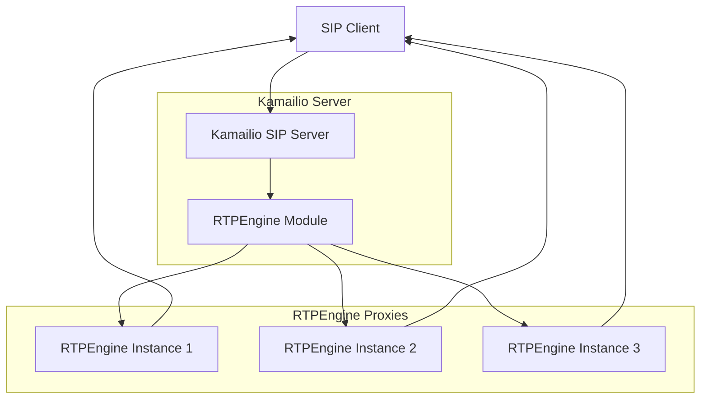
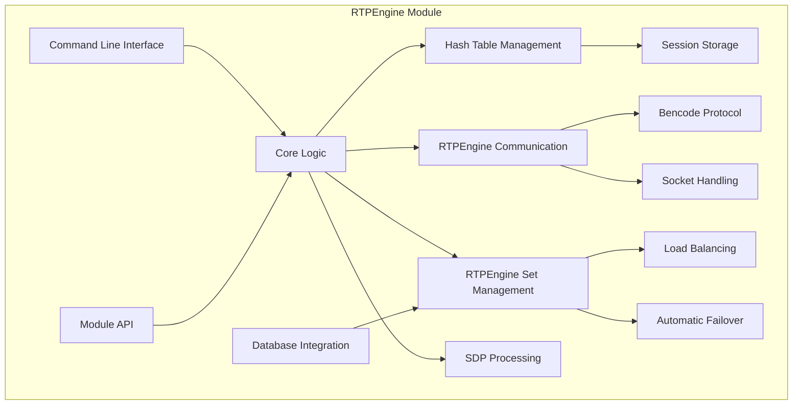
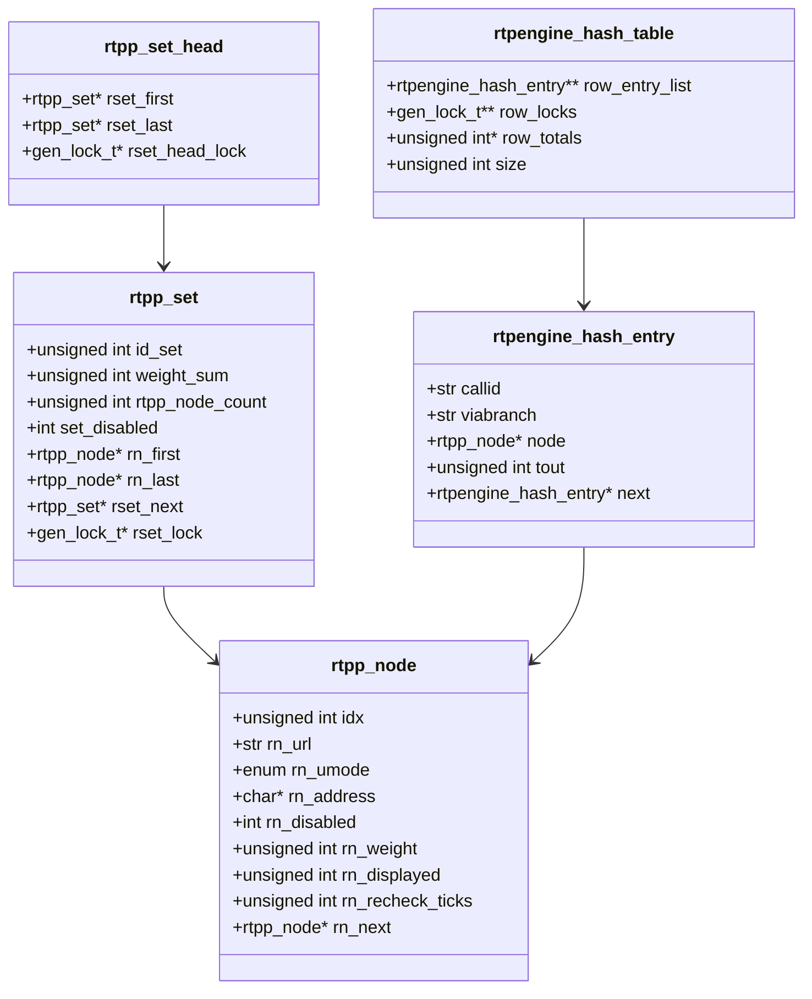
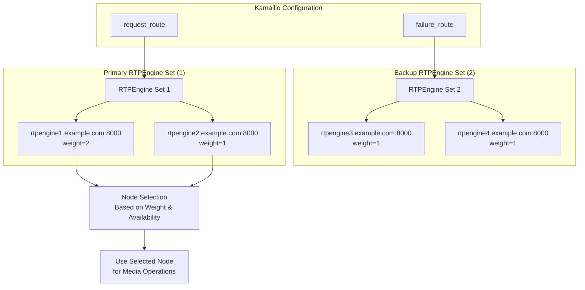
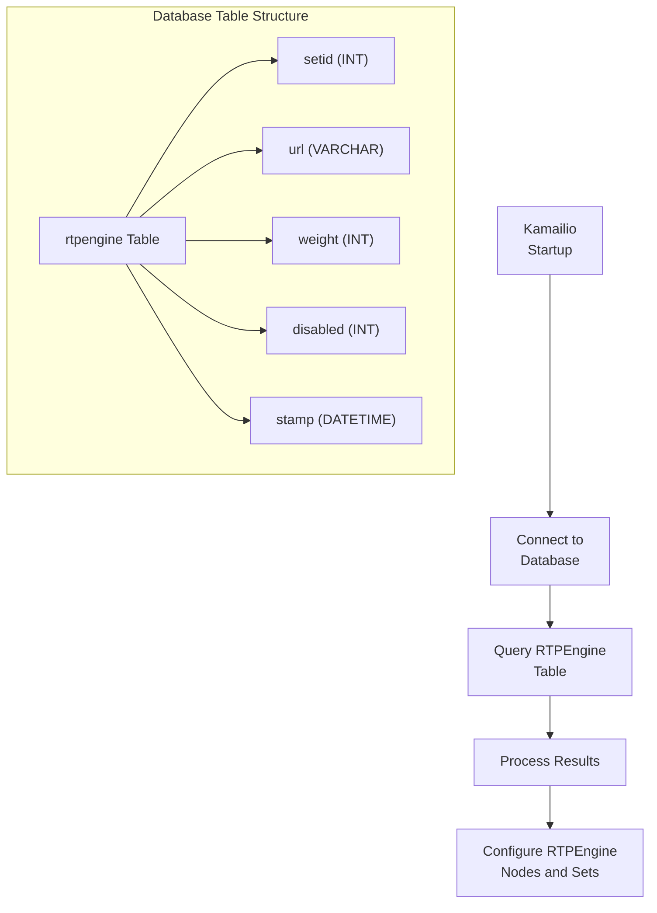
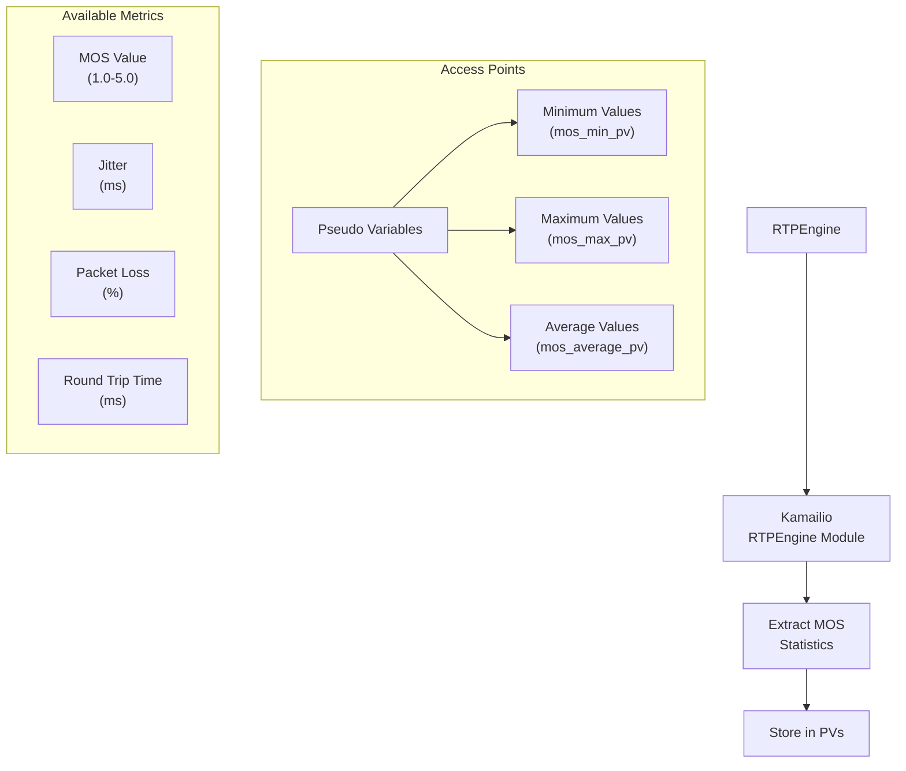

# RTPEngine Module

> **Relevant source files**
> * [src/modules/rtpengine/Makefile](https://github.com/kamailio/kamailio/blob/2b4e9f8b/src/modules/rtpengine/Makefile)
> * [src/modules/rtpengine/api.h](https://github.com/kamailio/kamailio/blob/2b4e9f8b/src/modules/rtpengine/api.h)
> * [src/modules/rtpengine/bencode.c](https://github.com/kamailio/kamailio/blob/2b4e9f8b/src/modules/rtpengine/bencode.c)
> * [src/modules/rtpengine/bencode.h](https://github.com/kamailio/kamailio/blob/2b4e9f8b/src/modules/rtpengine/bencode.h)
> * [src/modules/rtpengine/compat.h](https://github.com/kamailio/kamailio/blob/2b4e9f8b/src/modules/rtpengine/compat.h)
> * [src/modules/rtpengine/config.c](https://github.com/kamailio/kamailio/blob/2b4e9f8b/src/modules/rtpengine/config.c)
> * [src/modules/rtpengine/config.h](https://github.com/kamailio/kamailio/blob/2b4e9f8b/src/modules/rtpengine/config.h)
> * [src/modules/rtpengine/doc/rtpengine.xml](https://github.com/kamailio/kamailio/blob/2b4e9f8b/src/modules/rtpengine/doc/rtpengine.xml)
> * [src/modules/rtpengine/doc/rtpengine_admin.xml](https://github.com/kamailio/kamailio/blob/2b4e9f8b/src/modules/rtpengine/doc/rtpengine_admin.xml)
> * [src/modules/rtpengine/rtpengine.c](https://github.com/kamailio/kamailio/blob/2b4e9f8b/src/modules/rtpengine/rtpengine.c)
> * [src/modules/rtpengine/rtpengine.h](https://github.com/kamailio/kamailio/blob/2b4e9f8b/src/modules/rtpengine/rtpengine.h)
> * [src/modules/rtpengine/rtpengine_db.c](https://github.com/kamailio/kamailio/blob/2b4e9f8b/src/modules/rtpengine/rtpengine_db.c)
> * [src/modules/rtpengine/rtpengine_funcs.c](https://github.com/kamailio/kamailio/blob/2b4e9f8b/src/modules/rtpengine/rtpengine_funcs.c)
> * [src/modules/rtpengine/rtpengine_funcs.h](https://github.com/kamailio/kamailio/blob/2b4e9f8b/src/modules/rtpengine/rtpengine_funcs.h)
> * [src/modules/rtpengine/rtpengine_hash.c](https://github.com/kamailio/kamailio/blob/2b4e9f8b/src/modules/rtpengine/rtpengine_hash.c)
> * [src/modules/rtpengine/rtpengine_hash.h](https://github.com/kamailio/kamailio/blob/2b4e9f8b/src/modules/rtpengine/rtpengine_hash.h)

## Overview

The RTPEngine module enables media streams to be proxied via an RTP proxy within the Kamailio SIP server. It interfaces with the Sipwise RTPEngine service, providing a comprehensive API for media handling, including SDP offer/answer processing, recording, DTMF handling, and media control features. The module is a drop-in replacement for the older rtpproxy module but uses a different control protocol that is only compatible with the Sipwise RTPEngine.

This module is focused on integrating Kamailio with external RTPEngine instances to handle the actual media streams, while Kamailio continues processing the signaling. For information about media handling in general, see related modules like [RTPProxy](#4.9).

Sources: [src/modules/rtpengine/doc/rtpengine_admin.xml L17-L31](https://github.com/kamailio/kamailio/blob/2b4e9f8b/src/modules/rtpengine/doc/rtpengine_admin.xml#L17-L31)

## Architecture

### High-Level Architecture



Sources: [src/modules/rtpengine/doc/rtpengine_admin.xml L17-L31](https://github.com/kamailio/kamailio/blob/2b4e9f8b/src/modules/rtpengine/doc/rtpengine_admin.xml#L17-L31)

 [src/modules/rtpengine/rtpengine.c L34-L95](https://github.com/kamailio/kamailio/blob/2b4e9f8b/src/modules/rtpengine/rtpengine.c#L34-L95)

### Module Components



Sources: [src/modules/rtpengine/rtpengine.c L89-L94](https://github.com/kamailio/kamailio/blob/2b4e9f8b/src/modules/rtpengine/rtpengine.c#L89-L94)

 [src/modules/rtpengine/rtpengine_hash.c L30-L50](https://github.com/kamailio/kamailio/blob/2b4e9f8b/src/modules/rtpengine/rtpengine_hash.c#L30-L50)

The module architecture consists of several key components:

1. **Core Logic**: Handles SDP offer/answer processing, command routing, and overall operation coordination.
2. **Hash Table Management**: Stores and tracks call-to-node mappings for consistent routing.
3. **RTPEngine Communication**: Manages protocol for interacting with external RTPEngine instances.
4. **Set Management**: Organizes RTPEngine instances into sets for load balancing and failover.
5. **SDP Processing**: Extracts and modifies SDP payloads in SIP messages.
6. **Database Integration**: Optional component for retrieving RTPEngine server configurations from a database.

Sources: [src/modules/rtpengine/rtpengine.c L285-L310](https://github.com/kamailio/kamailio/blob/2b4e9f8b/src/modules/rtpengine/rtpengine.c#L285-L310)

 [src/modules/rtpengine/rtpengine_hash.c L30-L50](https://github.com/kamailio/kamailio/blob/2b4e9f8b/src/modules/rtpengine/rtpengine_hash.c#L30-L50)

 [src/modules/rtpengine/rtpengine_db.c L42-L65](https://github.com/kamailio/kamailio/blob/2b4e9f8b/src/modules/rtpengine/rtpengine_db.c#L42-L65)

### Data Structures



Sources: [src/modules/rtpengine/rtpengine.h L75-L116](https://github.com/kamailio/kamailio/blob/2b4e9f8b/src/modules/rtpengine/rtpengine.h#L75-L116)

 [src/modules/rtpengine/rtpengine_hash.h L9-L28](https://github.com/kamailio/kamailio/blob/2b4e9f8b/src/modules/rtpengine/rtpengine_hash.h#L9-L28)

## RTPEngine Sets and Load Balancing

The module supports multiple RTPEngine instances organized in sets for load balancing and high availability.



Key aspects of set management:

* **Multiple Sets**: Sets are identified by numeric IDs and can be selected using `set_rtpengine_set()`
* **Weight-Based Distribution**: Within a set, traffic is distributed based on configured weights
* **Automatic Failover**: If a node fails, another node in the set is automatically selected
* **Health Monitoring**: Regular pings check node availability

Sources: [src/modules/rtpengine/doc/rtpengine_admin.xml L34-L108](https://github.com/kamailio/kamailio/blob/2b4e9f8b/src/modules/rtpengine/doc/rtpengine_admin.xml#L34-L108)

 [src/modules/rtpengine/rtpengine.c L266-L278](https://github.com/kamailio/kamailio/blob/2b4e9f8b/src/modules/rtpengine/rtpengine.c#L266-L278)

## Connection Flow for RTPEngine Operations

```

```

Sources: [src/modules/rtpengine/rtpengine.c L230-L265](https://github.com/kamailio/kamailio/blob/2b4e9f8b/src/modules/rtpengine/rtpengine.c#L230-L265)

 [src/modules/rtpengine/doc/rtpengine_admin.xml L450-L477](https://github.com/kamailio/kamailio/blob/2b4e9f8b/src/modules/rtpengine/doc/rtpengine_admin.xml#L450-L477)

## Configuration Parameters

The module offers extensive configuration parameters, the most important being:

| Parameter | Type | Description |
| --- | --- | --- |
| `rtpengine_sock` | string | Definition of socket(s) to connect to RTPEngine |
| `rtpengine_disable_tout` | integer | Timeout (seconds) after which to retry a disabled RTPEngine instance |
| `aggressive_redetection` | integer | Whether to force ping all nodes when all RTPs seem unreachable |
| `rtpengine_tout_ms` | integer | Timeout in milliseconds waiting for replies from RTPEngine |
| `rtpengine_retr` | integer | Number of times to retry sending/receiving after timeout |
| `queried_nodes_limit` | integer | Maximum number of nodes to query before giving up |
| `hash_table_size` | integer | Size of the hash table tracking call-to-node mappings |
| `hash_table_tout` | integer | Timeout for hash table entries (seconds) |
| `setid_default` | integer | Default set ID to use |
| `setid_avp` | string | Specifies AVP to store set ID |

Sources: [src/modules/rtpengine/doc/rtpengine_admin.xml L151-L761](https://github.com/kamailio/kamailio/blob/2b4e9f8b/src/modules/rtpengine/doc/rtpengine_admin.xml#L151-L761)

 [src/modules/rtpengine/rtpengine.c L494-L634](https://github.com/kamailio/kamailio/blob/2b4e9f8b/src/modules/rtpengine/rtpengine.c#L494-L634)

### Basic Configuration Example

```markdown
loadmodule "rtpengine.so"

# Single RTPEngine server
modparam("rtpengine", "rtpengine_sock", "udp:10.0.0.1:22222")

# Multiple servers with weights in a set
modparam("rtpengine", "rtpengine_sock", "udp:10.0.0.1:22222=2 udp:10.0.0.2:22222=1")

# Multiple sets
modparam("rtpengine", "rtpengine_sock", "1 == udp:10.0.0.1:22222 udp:10.0.0.2:22222")
modparam("rtpengine", "rtpengine_sock", "2 == udp:10.0.0.3:22222 udp:10.0.0.4:22222")

# Common timeout parameters
modparam("rtpengine", "rtpengine_disable_tout", 60)
modparam("rtpengine", "rtpengine_tout_ms", 1000)
modparam("rtpengine", "rtpengine_retr", 5)
```

Sources: [src/modules/rtpengine/doc/rtpengine_admin.xml L162-L183](https://github.com/kamailio/kamailio/blob/2b4e9f8b/src/modules/rtpengine/doc/rtpengine_admin.xml#L162-L183)

 [src/modules/rtpengine/doc/rtpengine_admin.xml L206-L211](https://github.com/kamailio/kamailio/blob/2b4e9f8b/src/modules/rtpengine/doc/rtpengine_admin.xml#L206-L211)

## Function API

The module provides several functions for use in the routing script:

| Function | Description |
| --- | --- |
| `rtpengine_offer([flags], [ip])` | Processes SDP in requests, preparing media for RTPEngine |
| `rtpengine_answer([flags], [ip])` | Processes SDP in replies, completing media setup |
| `rtpengine_delete([flags], [ip])` | Removes a session from RTPEngine |
| `rtpengine_manage([flags], [ip])` | Automatically handles both offer and answer based on message type |
| `rtpengine_query([flags], [ip])` | Queries information about a session |
| `set_rtpengine_set(setid)` | Selects the RTPEngine set to use for subsequent operations |
| `start_recording()` | Starts recording for an existing session |
| `stop_recording()` | Stops recording for a session |
| `block_dtmf()` | Blocks DTMF events for a session |
| `unblock_dtmf()` | Unblocks DTMF events |
| `block_media()` | Blocks media for a session |
| `unblock_media()` | Unblocks media |
| `play_media(file)` | Plays a media file into the session |
| `stop_media()` | Stops media playback |

Sources: [src/modules/rtpengine/rtpengine.c L406-L482](https://github.com/kamailio/kamailio/blob/2b4e9f8b/src/modules/rtpengine/rtpengine.c#L406-L482)

 [src/modules/rtpengine/doc/rtpengine_admin.xml L450-L477](https://github.com/kamailio/kamailio/blob/2b4e9f8b/src/modules/rtpengine/doc/rtpengine_admin.xml#L450-L477)

### Common Flags

The flags parameter supports various options that modify the behavior of RTPEngine operations:

| Flag | Description |
| --- | --- |
| `replace-origin` | Replace origin IP address in SDP |
| `replace-session-connection` | Replace connection IP in session section |
| `force-asymmetric` | Disable symmetric RTP detection |
| `trust-address` | Trust SDP addresses for RTP relay |
| `record-call` | Start recording the call |
| `ICE=force` | Force ICE support |
| `SDES-off` | Disable SDES support |
| `DTLS=passive` | Set DTLS to passive mode |
| `via-branch=xyz` | Use specific via branch |
| `codec-strip=PCMA` | Strip specific codec |
| `codec-transcode=PCMA` | Transcode to specified codec |

Sources: [src/modules/rtpengine/rtpengine.c L135-L136](https://github.com/kamailio/kamailio/blob/2b4e9f8b/src/modules/rtpengine/rtpengine.c#L135-L136)

### Example Usage in Route Blocks

```python
route {
    if (is_method("INVITE") && has_body("application/sdp")) {
        # Select set 1 for RTPEngine operations
        set_rtpengine_set(1);
        
        # Process SDP offer with transcoding to PCMU
        if (!rtpengine_offer("ICE=force codec-transcode=PCMU")) {
            xlog("L_ERROR", "RTPEngine offer failed\n");
            sl_reply_error();
            exit;
        }
        
        # Force symmetric RTP detection
        if (is_present_hf("Record-Route")) {
            rtpengine_offer("force-asymmetric");
        }
    }
    
    route(RELAY);
}

onreply_route[MANAGE_REPLY] {
    if (has_body("application/sdp")) {
        # Process SDP answer
        if (!rtpengine_answer()) {
            xlog("L_ERROR", "RTPEngine answer failed\n");
        }
        
        # Start recording if needed
        if ($avp(record_call) == 1) {
            start_recording();
        }
    }
}

route[BYE] {
    if (is_method("BYE")) {
        # Delete session from RTPEngine
        rtpengine_delete();
    }
}
```

Sources: [src/modules/rtpengine/rtpengine.c L230-L265](https://github.com/kamailio/kamailio/blob/2b4e9f8b/src/modules/rtpengine/rtpengine.c#L230-L265)

## Database Integration

The module can retrieve RTPEngine settings from a database table:



Database configuration parameters:

| Parameter | Description |
| --- | --- |
| `db_url` | Database URL (if set, activates database mode) |
| `table_name` | Name of the table (defaults to "rtpengine") |
| `setid_col` | Name of the set ID column |
| `url_col` | Name of the URL column |
| `weight_col` | Name of the weight column |
| `disabled_col` | Name of the disabled status column |

Sources: [src/modules/rtpengine/rtpengine_db.c L42-L65](https://github.com/kamailio/kamailio/blob/2b4e9f8b/src/modules/rtpengine/rtpengine_db.c#L42-L65)

 [src/modules/rtpengine/doc/rtpengine_admin.xml L580-L652](https://github.com/kamailio/kamailio/blob/2b4e9f8b/src/modules/rtpengine/doc/rtpengine_admin.xml#L580-L652)

## Media Quality Monitoring

The module can collect and report media quality statistics through Mean Opinion Score (MOS) values:



Quality metrics parameters:

| Parameter | Description |
| --- | --- |
| `mos_min_pv` | PV to hold minimum MOS value (1.0-5.0) |
| `mos_min_at_pv` | PV to hold timestamp of minimum MOS |
| `mos_min_packetloss_pv` | PV for packet loss at minimum MOS |
| `mos_min_jitter_pv` | PV for jitter at minimum MOS |
| `mos_min_roundtrip_pv` | PV for round trip time at minimum MOS |
| `mos_max_pv` | PV to hold maximum MOS value |
| `mos_average_pv` | PV to hold average MOS value |

Sources: [src/modules/rtpengine/rtpengine.c L537-L565](https://github.com/kamailio/kamailio/blob/2b4e9f8b/src/modules/rtpengine/rtpengine.c#L537-L565)

 [src/modules/rtpengine/doc/rtpengine_admin.xml L784-L881](https://github.com/kamailio/kamailio/blob/2b4e9f8b/src/modules/rtpengine/doc/rtpengine_admin.xml#L784-L881)

## Troubleshooting

### Common Issues

1. **Connection failures to RTPEngine:** * Check network connectivity and firewall rules * Verify that the RTPEngine server is running * Ensure the socket definition in `rtpengine_sock` is correct
2. **Media not flowing:** * Check that the SDP is being correctly modified by the module * Verify that the RTPEngine server has the necessary network access * Review NAT handling configuration
3. **Inconsistent RTPEngine selection:** * Ensure the correct set is selected before calling RTPEngine functions * Check hash table timeout settings

### Debug Options

Enable debug logging with:

```markdown
# In kamailio.cfg
modparam("rtpengine", "rtpengine_tout_ms", 5000)  # Longer timeout for debugging
debug=3  # Increase debug level

# Log RTPEngine selection and operations
xlog("L_INFO", "Selected RTPEngine: $avp(RTP_INSTANCE)\n");
```

Sources: [src/modules/rtpengine/rtpengine.c L320-L400](https://github.com/kamailio/kamailio/blob/2b4e9f8b/src/modules/rtpengine/rtpengine.c#L320-L400)

## Summary

The RTPEngine module provides a robust interface between Kamailio and the Sipwise RTPEngine media proxy. It supports high-availability setups through multiple server instances organized in sets with automatic failover capabilities. The module handles all aspects of media management including SDP processing, transcoding control, recording, media playback, and quality monitoring.

For optimal performance, configure appropriate timeouts, retry parameters, and hash table settings based on your expected call volume. Use load balancing across multiple RTPEngine instances for scaling media capacity.