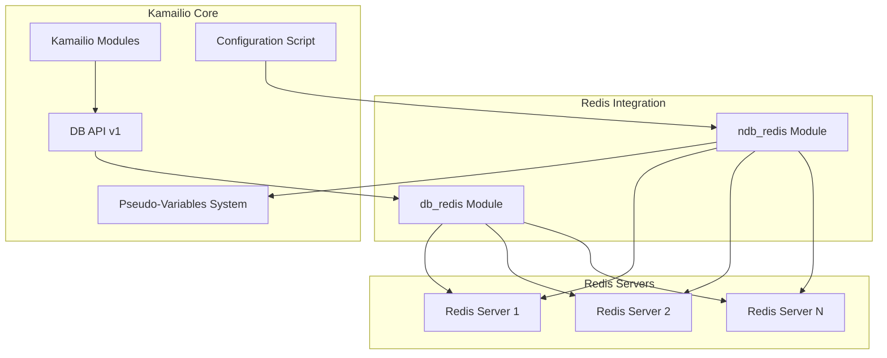
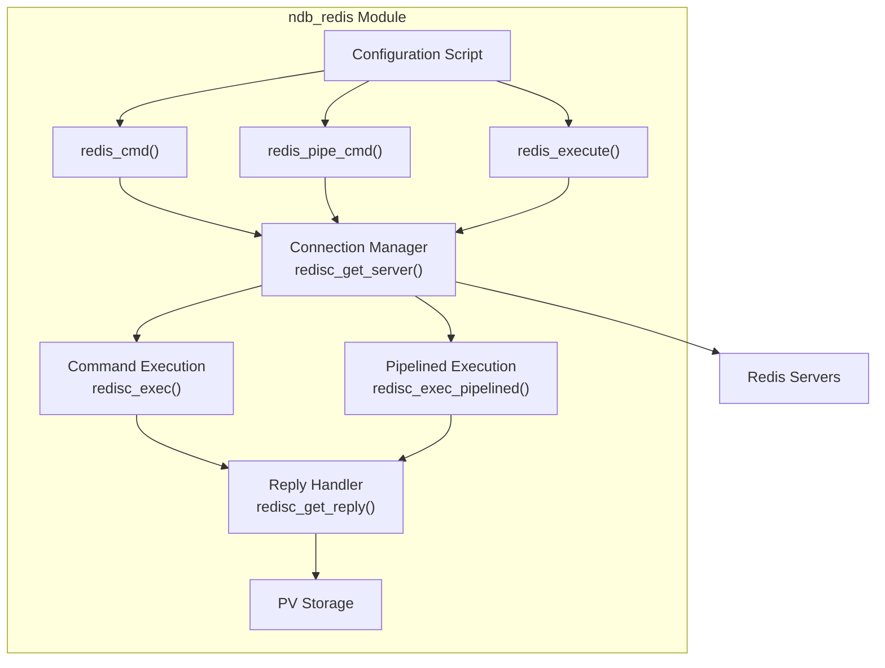
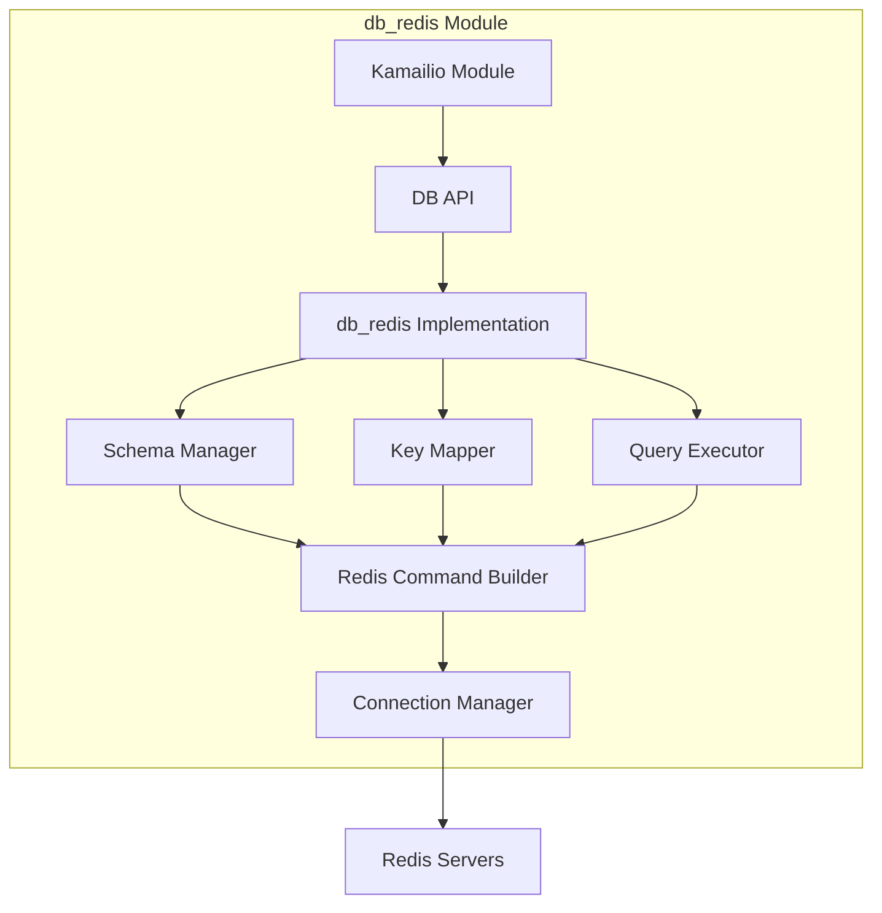
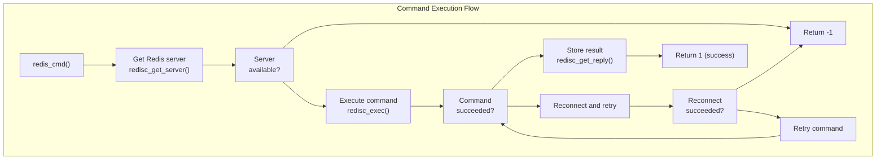
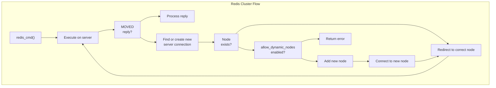
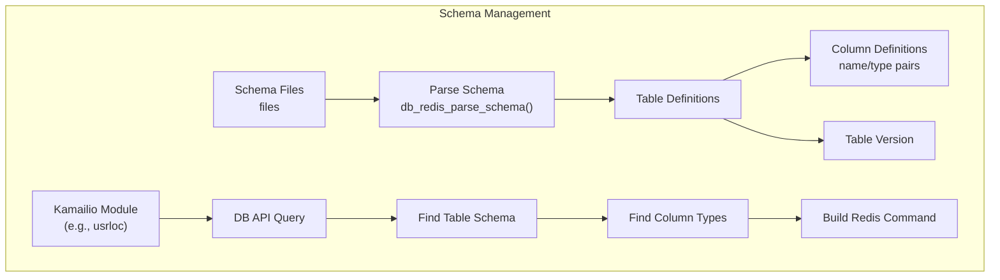
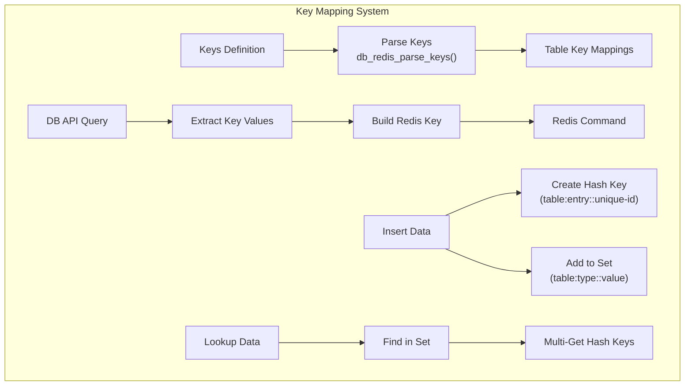
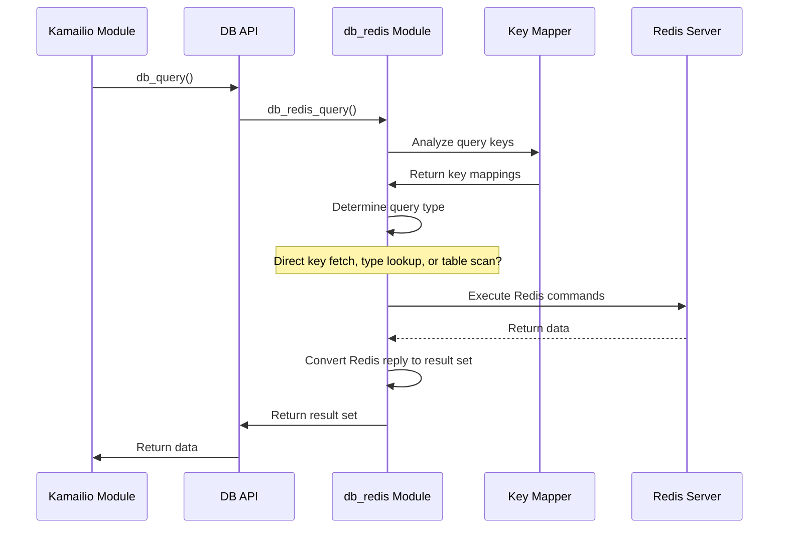
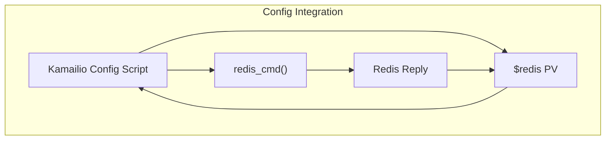
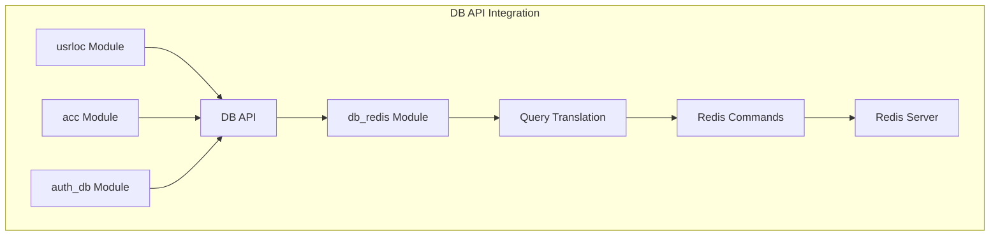

# Redis Integration Modules

> **Relevant source files**
> * [src/modules/avp/README](https://github.com/kamailio/kamailio/blob/2b4e9f8b/src/modules/avp/README)
> * [src/modules/db_redis/Makefile](https://github.com/kamailio/kamailio/blob/2b4e9f8b/src/modules/db_redis/Makefile)
> * [src/modules/db_redis/README](https://github.com/kamailio/kamailio/blob/2b4e9f8b/src/modules/db_redis/README)
> * [src/modules/db_redis/db_redis_mod.c](https://github.com/kamailio/kamailio/blob/2b4e9f8b/src/modules/db_redis/db_redis_mod.c)
> * [src/modules/db_redis/db_redis_mod.h](https://github.com/kamailio/kamailio/blob/2b4e9f8b/src/modules/db_redis/db_redis_mod.h)
> * [src/modules/db_redis/doc/db_redis.xml](https://github.com/kamailio/kamailio/blob/2b4e9f8b/src/modules/db_redis/doc/db_redis.xml)
> * [src/modules/db_redis/doc/db_redis_admin.xml](https://github.com/kamailio/kamailio/blob/2b4e9f8b/src/modules/db_redis/doc/db_redis_admin.xml)
> * [src/modules/db_redis/redis_connection.c](https://github.com/kamailio/kamailio/blob/2b4e9f8b/src/modules/db_redis/redis_connection.c)
> * [src/modules/db_redis/redis_connection.h](https://github.com/kamailio/kamailio/blob/2b4e9f8b/src/modules/db_redis/redis_connection.h)
> * [src/modules/db_redis/redis_dbase.c](https://github.com/kamailio/kamailio/blob/2b4e9f8b/src/modules/db_redis/redis_dbase.c)
> * [src/modules/db_redis/redis_dbase.h](https://github.com/kamailio/kamailio/blob/2b4e9f8b/src/modules/db_redis/redis_dbase.h)
> * [src/modules/db_redis/redis_table.c](https://github.com/kamailio/kamailio/blob/2b4e9f8b/src/modules/db_redis/redis_table.c)
> * [src/modules/db_redis/redis_table.h](https://github.com/kamailio/kamailio/blob/2b4e9f8b/src/modules/db_redis/redis_table.h)
> * [src/modules/json/README](https://github.com/kamailio/kamailio/blob/2b4e9f8b/src/modules/json/README)
> * [src/modules/ndb_redis/Makefile](https://github.com/kamailio/kamailio/blob/2b4e9f8b/src/modules/ndb_redis/Makefile)
> * [src/modules/ndb_redis/README](https://github.com/kamailio/kamailio/blob/2b4e9f8b/src/modules/ndb_redis/README)
> * [src/modules/ndb_redis/api.h](https://github.com/kamailio/kamailio/blob/2b4e9f8b/src/modules/ndb_redis/api.h)
> * [src/modules/ndb_redis/doc/ndb_redis.xml](https://github.com/kamailio/kamailio/blob/2b4e9f8b/src/modules/ndb_redis/doc/ndb_redis.xml)
> * [src/modules/ndb_redis/doc/ndb_redis_admin.xml](https://github.com/kamailio/kamailio/blob/2b4e9f8b/src/modules/ndb_redis/doc/ndb_redis_admin.xml)
> * [src/modules/ndb_redis/ndb_redis_mod.c](https://github.com/kamailio/kamailio/blob/2b4e9f8b/src/modules/ndb_redis/ndb_redis_mod.c)
> * [src/modules/ndb_redis/redis_client.c](https://github.com/kamailio/kamailio/blob/2b4e9f8b/src/modules/ndb_redis/redis_client.c)
> * [src/modules/ndb_redis/redis_client.h](https://github.com/kamailio/kamailio/blob/2b4e9f8b/src/modules/ndb_redis/redis_client.h)
> * [src/modules/topoh/README](https://github.com/kamailio/kamailio/blob/2b4e9f8b/src/modules/topoh/README)
> * [src/modules/topos/README](https://github.com/kamailio/kamailio/blob/2b4e9f8b/src/modules/topos/README)

This page documents the Redis integration modules in Kamailio. These modules provide connectivity to Redis NoSQL databases, allowing Kamailio to leverage Redis for various use cases from configuration storage to user location data persistence. There are two primary modules for Redis integration: the `ndb_redis` module for direct Redis commands from configuration scripts, and the `db_redis` module that implements the Kamailio DB API for Redis.

## Overview of Redis Integration Modules

Kamailio offers two distinct approaches for Redis integration:

1. **ndb_redis**: A NoSQL interface to Redis that allows direct execution of Redis commands from Kamailio configuration scripts, with results accessible via pseudo-variables.
2. **db_redis**: A DB API v1 implementation for Redis that allows modules using the standard database interface to work with Redis instead of SQL databases like MySQL or PostgreSQL.

These modules serve different purposes and use cases depending on your requirements:

| Module | Primary Purpose | Interface | Typical Use Case |
| --- | --- | --- | --- |
| ndb_redis | Direct Redis operations | Configuration script | Custom data operations, caching, distributed counters |
| db_redis | SQL-like database abstraction | Kamailio modules using DB API | Replace SQL database for modules like usrloc |

Sources: [src/modules/ndb_redis/ndb_redis_mod.c L30-L44](https://github.com/kamailio/kamailio/blob/2b4e9f8b/src/modules/ndb_redis/ndb_redis_mod.c#L30-L44)

 [src/modules/db_redis/db_redis_mod.c L85-L105](https://github.com/kamailio/kamailio/blob/2b4e9f8b/src/modules/db_redis/db_redis_mod.c#L85-L105)

## Architecture and Components

### Module Architecture Diagram



Sources: [src/modules/ndb_redis/ndb_redis_mod.c](https://github.com/kamailio/kamailio/blob/2b4e9f8b/src/modules/ndb_redis/ndb_redis_mod.c)

 [src/modules/db_redis/db_redis_mod.c](https://github.com/kamailio/kamailio/blob/2b4e9f8b/src/modules/db_redis/db_redis_mod.c)

### ndb_redis Architecture

The `ndb_redis` module provides a direct interface to Redis with:

* Connection management to multiple Redis servers
* Support for Redis commands with variable arguments
* Command pipelining for better performance
* Integration with Kamailio's pseudo-variables system
* Support for Redis clusters, sentinels, and TLS



Sources: [src/modules/ndb_redis/redis_client.c L83-L339](https://github.com/kamailio/kamailio/blob/2b4e9f8b/src/modules/ndb_redis/redis_client.c#L83-L339)

 [src/modules/ndb_redis/ndb_redis_mod.c L204-L232](https://github.com/kamailio/kamailio/blob/2b4e9f8b/src/modules/ndb_redis/ndb_redis_mod.c#L204-L232)

### db_redis Architecture

The `db_redis` module implements the DB API for Redis:

* Schema definition for Redis keys
* Table and key mapping system
* Translation of SQL-like queries to Redis operations
* Query optimization for Redis access patterns



Sources: [src/modules/db_redis/redis_dbase.c L63-L66](https://github.com/kamailio/kamailio/blob/2b4e9f8b/src/modules/db_redis/redis_dbase.c#L63-L66)

 [src/modules/db_redis/redis_connection.c L337-L394](https://github.com/kamailio/kamailio/blob/2b4e9f8b/src/modules/db_redis/redis_connection.c#L337-L394)

## ndb_redis Module

The `ndb_redis` module provides a direct interface to Redis from Kamailio's configuration script. It allows executing almost any Redis command and storing the results in Kamailio pseudo-variables.

### Connection Management

The module supports connecting to multiple Redis servers with different parameters. For each server, you need to define a unique name and connection details.

```

```

Sources: [src/modules/ndb_redis/redis_client.c L384-L428](https://github.com/kamailio/kamailio/blob/2b4e9f8b/src/modules/ndb_redis/redis_client.c#L384-L428)

 [src/modules/ndb_redis/ndb_redis_mod.c L592-L594](https://github.com/kamailio/kamailio/blob/2b4e9f8b/src/modules/ndb_redis/ndb_redis_mod.c#L592-L594)

### Command Execution

The module provides several functions for executing Redis commands:

1. `redis_cmd()` - Execute a Redis command and store the result
2. `redis_pipe_cmd()` - Queue a Redis command for pipeline execution
3. `redis_execute()` - Execute all queued commands in the pipeline



Sources: [src/modules/ndb_redis/ndb_redis_mod.c L204-L268](https://github.com/kamailio/kamailio/blob/2b4e9f8b/src/modules/ndb_redis/ndb_redis_mod.c#L204-L268)

 [src/modules/ndb_redis/redis_client.c L1002-L1152](https://github.com/kamailio/kamailio/blob/2b4e9f8b/src/modules/ndb_redis/redis_client.c#L1002-L1152)

### Redis Cluster Support

The module supports Redis Cluster mode, which allows automatic redirection to the correct server when keys are sharded across multiple Redis nodes.



Sources: [src/modules/ndb_redis/redis_client.c L888-L998](https://github.com/kamailio/kamailio/blob/2b4e9f8b/src/modules/ndb_redis/redis_client.c#L888-L998)

### Advanced Features

The `ndb_redis` module supports several advanced features:

1. **TLS Connections**: Secure Redis connections using TLS
2. **Redis Sentinel**: High availability with Redis Sentinel
3. **Redis Cluster**: Automatic sharding and failover
4. **Command Pipelining**: Improved performance for multiple commands
5. **Server Health Monitoring**: Automatic disabling of failed servers

Sources: [src/modules/ndb_redis/redis_client.c L59-L67](https://github.com/kamailio/kamailio/blob/2b4e9f8b/src/modules/ndb_redis/redis_client.c#L59-L67)

 [src/modules/ndb_redis/doc/ndb_redis_admin.xml L82-L98](https://github.com/kamailio/kamailio/blob/2b4e9f8b/src/modules/ndb_redis/doc/ndb_redis_admin.xml#L82-L98)

## db_redis Module

The `db_redis` module implements the DB API v1 for Redis, allowing Kamailio modules that use the database interface to work with Redis instead of SQL databases.

### Schema Management

Since Redis is a key-value store without a fixed schema, the module uses schema definition files to define the structure of Redis hash objects.



Sources: [src/modules/db_redis/db_redis_mod.c L42-L44](https://github.com/kamailio/kamailio/blob/2b4e9f8b/src/modules/db_redis/db_redis_mod.c#L42-L44)

 [src/modules/db_redis/README L95-L114](https://github.com/kamailio/kamailio/blob/2b4e9f8b/src/modules/db_redis/README#L95-L114)

### Key Mapping System

The module uses a key mapping system to efficiently store and retrieve data from Redis, avoiding full table scans.



Sources: [src/modules/db_redis/redis_table.c L481-L531](https://github.com/kamailio/kamailio/blob/2b4e9f8b/src/modules/db_redis/redis_table.c#L481-L531)

 [src/modules/db_redis/README L115-L147](https://github.com/kamailio/kamailio/blob/2b4e9f8b/src/modules/db_redis/README#L115-L147)

### Query Execution Flow

The module translates DB API queries into Redis operations:



Sources: [src/modules/db_redis/redis_dbase.c L481-L531](https://github.com/kamailio/kamailio/blob/2b4e9f8b/src/modules/db_redis/redis_dbase.c#L481-L531)

 [src/modules/db_redis/redis_connection.c L478-L511](https://github.com/kamailio/kamailio/blob/2b4e9f8b/src/modules/db_redis/redis_connection.c#L478-L511)

## Integration with Kamailio Modules

Both Redis modules integrate with other Kamailio modules in different ways:

### ndb_redis Integration

The `ndb_redis` module primarily integrates with the Kamailio configuration script and pseudo-variables system:



Sources: [src/modules/ndb_redis/ndb_redis_mod.c L99-L105](https://github.com/kamailio/kamailio/blob/2b4e9f8b/src/modules/ndb_redis/ndb_redis_mod.c#L99-L105)

 [src/modules/ndb_redis/ndb_redis_mod.c L777-L862](https://github.com/kamailio/kamailio/blob/2b4e9f8b/src/modules/ndb_redis/ndb_redis_mod.c#L777-L862)

### db_redis Integration

The `db_redis` module integrates with modules that use the DB API:



Sources: [src/modules/db_redis/db_redis_mod.c L83-L91](https://github.com/kamailio/kamailio/blob/2b4e9f8b/src/modules/db_redis/db_redis_mod.c#L83-L91)

 [src/modules/db_redis/README L134-L147](https://github.com/kamailio/kamailio/blob/2b4e9f8b/src/modules/db_redis/README#L134-L147)

## Use Cases and Examples

### Common Use Cases for ndb_redis

1. **Session Data Storage**: Store session data in Redis for sharing between Kamailio instances
2. **Rate Limiting**: Implement distributed rate limiting with Redis counters
3. **Custom Caching**: Store and retrieve arbitrary data in Redis

Usage example:

```css
loadmodule "ndb_redis.so"
modparam("ndb_redis", "server", "name=srvA;addr=127.0.0.1;port=6379;db=1")

route {
    # Set a key
    redis_cmd("srvA", "SET", "user:$fU", "$si", "$var(res)");
    
    # Get a key
    redis_cmd("srvA", "GET", "user:$fU", "$var(location)");
    
    # Use the value
    if ($var(location) != "") {
        xlog("L_INFO", "User $fU location: $var(location)");
    }
}
```

Sources: [src/modules/ndb_redis/README L180-L198](https://github.com/kamailio/kamailio/blob/2b4e9f8b/src/modules/ndb_redis/README#L180-L198)

 [src/modules/ndb_redis/ndb_redis_mod.c L204-L232](https://github.com/kamailio/kamailio/blob/2b4e9f8b/src/modules/ndb_redis/ndb_redis_mod.c#L204-L232)

### Common Use Cases for db_redis

1. **User Location Storage**: Replace traditional SQL database for the usrloc module
2. **Authentication Database**: Use Redis for auth_db module
3. **Accounting**: Store CDR records in Redis via the acc module

Configuration example:

```markdown
loadmodule "db_redis.so"
modparam("db_redis", "schema_path", "/usr/share/kamailio/db_redis")
modparam("db_redis", "keys", "location=usrdom=username,domain&timestamp=expires")

# Configure modules to use Redis
modparam("usrloc", "db_url", "redis://localhost:6379/1")
```

Sources: [src/modules/db_redis/README L52-L80](https://github.com/kamailio/kamailio/blob/2b4e9f8b/src/modules/db_redis/README#L52-L80)

 [src/modules/db_redis/README L211-L239](https://github.com/kamailio/kamailio/blob/2b4e9f8b/src/modules/db_redis/README#L211-L239)

## Comparison and Selection

When deciding which Redis module to use, consider these factors:

| Factor | ndb_redis | db_redis |
| --- | --- | --- |
| **Primary Use** | Direct Redis operations from config | Database replacement for Kamailio modules |
| **Integration** | With config script via PVs | With modules using DB API |
| **Flexibility** | High - any Redis command | Limited by DB API |
| **Complexity** | Simple for direct operations | Complex for schema mapping |
| **Performance** | Direct command execution | May have overhead from mapping |
| **Use Case** | Custom logic in config | Drop-in replacement for SQL DB |

Sources: [src/modules/ndb_redis/README L114-L122](https://github.com/kamailio/kamailio/blob/2b4e9f8b/src/modules/ndb_redis/README#L114-L122)

 [src/modules/db_redis/README L85-L114](https://github.com/kamailio/kamailio/blob/2b4e9f8b/src/modules/db_redis/README#L85-L114)

## Advanced Configuration

### ndb_redis with Redis Sentinel

For high availability, you can configure ndb_redis to use Redis Sentinel:

```
modparam("ndb_redis", "server", "name=srvZ;sentinel_group=mymaster;sentinel_master=1;sentinel=192.168.1.1:26379;sentinel=192.168.1.2:26379")
```

Sources: [src/modules/ndb_redis/README L190-L196](https://github.com/kamailio/kamailio/blob/2b4e9f8b/src/modules/ndb_redis/README#L190-L196)

 [src/modules/ndb_redis/redis_client.c L175-L235](https://github.com/kamailio/kamailio/blob/2b4e9f8b/src/modules/ndb_redis/redis_client.c#L175-L235)

### db_redis Schema and Key Configuration

The db_redis module requires schema definitions and key mappings:

1. Schema files define table structures in `schema_path` directory
2. Keys parameter defines how to map SQL-like queries to Redis keys

```
modparam("db_redis", "schema_path", "/path/to/schema/dir")
modparam("db_redis", "keys", "location=usrdom=username,domain&timestamp=expires")
```

Sources: [src/modules/db_redis/README L142-L173](https://github.com/kamailio/kamailio/blob/2b4e9f8b/src/modules/db_redis/README#L142-L173)

 [src/modules/db_redis/redis_table.c L481-L531](https://github.com/kamailio/kamailio/blob/2b4e9f8b/src/modules/db_redis/redis_table.c#L481-L531)

## Security Considerations

Both modules support TLS connections to Redis for secure communication:

### ndb_redis TLS Configuration

```
modparam("ndb_redis", "server", "name=srvY;addr=redis.example.com;port=6379;db=5;pass=secret;tls=1")
modparam("ndb_redis", "ca_path", "/etc/ssl/certs/ca-certificates.crt")
```

Sources: [src/modules/ndb_redis/doc/ndb_redis_admin.xml L82-L98](https://github.com/kamailio/kamailio/blob/2b4e9f8b/src/modules/ndb_redis/doc/ndb_redis_admin.xml#L82-L98)

 [src/modules/ndb_redis/redis_client.c L60-L67](https://github.com/kamailio/kamailio/blob/2b4e9f8b/src/modules/ndb_redis/redis_client.c#L60-L67)

### db_redis TLS Configuration

```
modparam("db_redis", "opt_tls", 1)
modparam("db_redis", "ca_path", "/etc/ssl/certs/ca-certificates.crt")
```

Sources: [src/modules/db_redis/README L71-L78](https://github.com/kamailio/kamailio/blob/2b4e9f8b/src/modules/db_redis/README#L71-L78)

 [src/modules/db_redis/redis_connection.c L131-L171](https://github.com/kamailio/kamailio/blob/2b4e9f8b/src/modules/db_redis/redis_connection.c#L131-L171)

## Conclusion

The Redis integration modules provide flexible options for using Redis with Kamailio:

* **ndb_redis** offers a direct interface to Redis for custom operations in the configuration script
* **db_redis** provides a database abstraction layer for modules that use the DB API

Choose the appropriate module based on your use case and integration requirements.