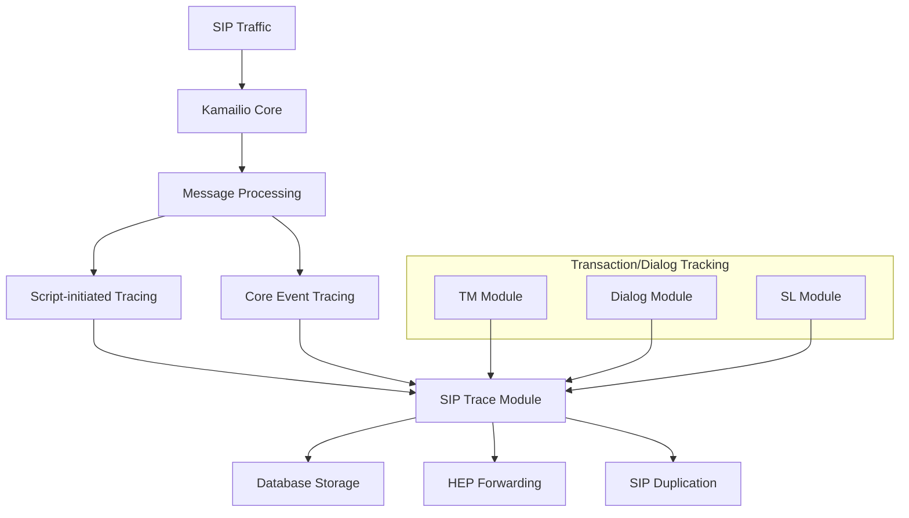
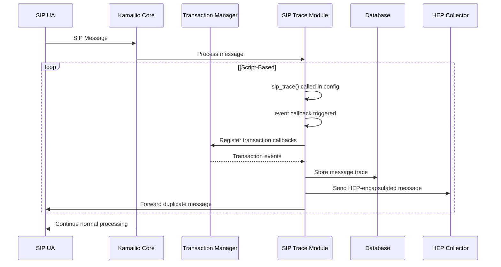
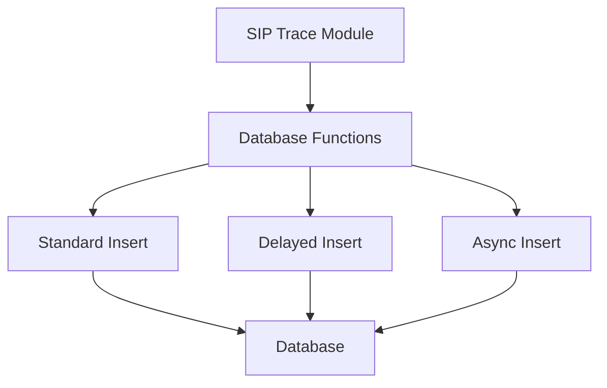
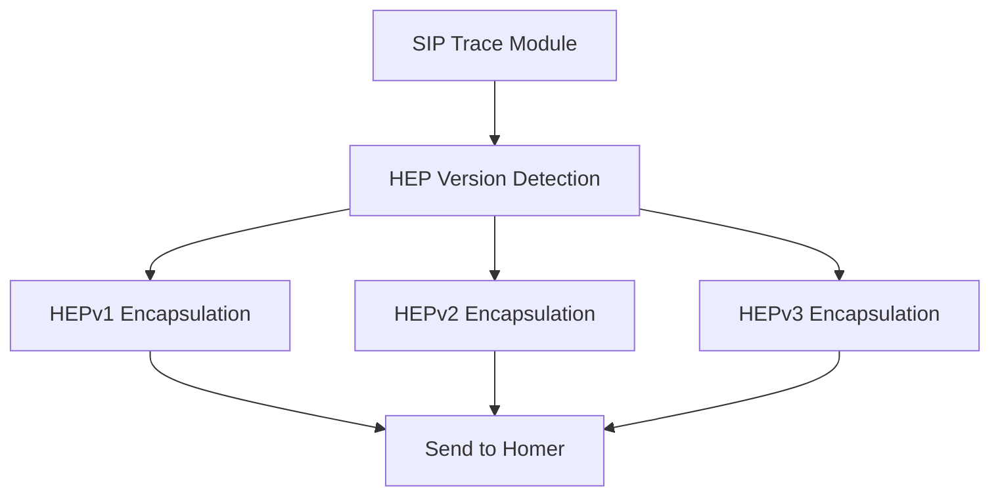
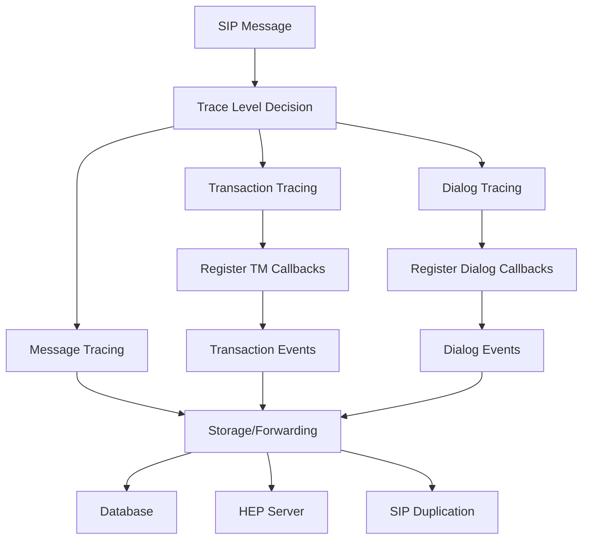
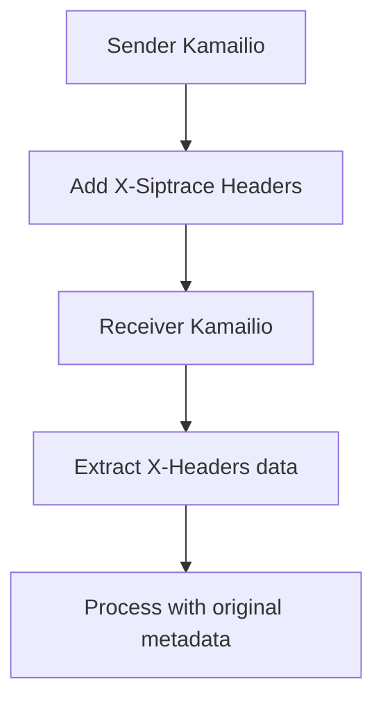
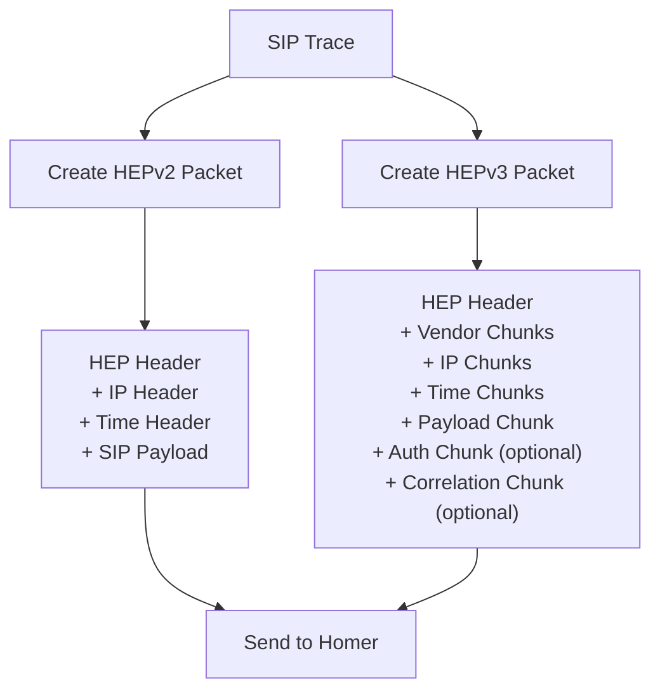

# SIP Tracing Module

> **Relevant source files**
> * [src/modules/siptrace/Makefile](https://github.com/kamailio/kamailio/blob/2b4e9f8b/src/modules/siptrace/Makefile)
> * [src/modules/siptrace/doc/siptrace.xml](https://github.com/kamailio/kamailio/blob/2b4e9f8b/src/modules/siptrace/doc/siptrace.xml)
> * [src/modules/siptrace/doc/siptrace_admin.xml](https://github.com/kamailio/kamailio/blob/2b4e9f8b/src/modules/siptrace/doc/siptrace_admin.xml)
> * [src/modules/siptrace/siptrace.c](https://github.com/kamailio/kamailio/blob/2b4e9f8b/src/modules/siptrace/siptrace.c)
> * [src/modules/siptrace/siptrace_data.h](https://github.com/kamailio/kamailio/blob/2b4e9f8b/src/modules/siptrace/siptrace_data.h)
> * [src/modules/siptrace/siptrace_hep.c](https://github.com/kamailio/kamailio/blob/2b4e9f8b/src/modules/siptrace/siptrace_hep.c)
> * [src/modules/siptrace/siptrace_hep.h](https://github.com/kamailio/kamailio/blob/2b4e9f8b/src/modules/siptrace/siptrace_hep.h)
> * [src/modules/siptrace/siptrace_send.c](https://github.com/kamailio/kamailio/blob/2b4e9f8b/src/modules/siptrace/siptrace_send.c)
> * [src/modules/siptrace/siptrace_send.h](https://github.com/kamailio/kamailio/blob/2b4e9f8b/src/modules/siptrace/siptrace_send.h)

## 1. Overview

The SIP Trace module provides mechanisms for tracing SIP messages within Kamailio. It supports capturing, storing, and forwarding SIP traffic for debugging, troubleshooting, and monitoring purposes. Messages can be stored in a database and/or duplicated to external capturing servers using HEP (Homer Encapsulation Protocol) or plain SIP messages.

The module offers flexible tracing capabilities, from simple message capturing to more complex transaction and dialog tracking. It integrates with Kamailio's core systems while providing configuration options through the Kamailio configuration file.

Sources: [src/modules/siptrace/siptrace.c L19-L30](https://github.com/kamailio/kamailio/blob/2b4e9f8b/src/modules/siptrace/siptrace.c#L19-L30)

 [src/modules/siptrace/doc/siptrace_admin.xml L16-L23](https://github.com/kamailio/kamailio/blob/2b4e9f8b/src/modules/siptrace/doc/siptrace_admin.xml#L16-L23)

## 2. Architecture and Integration

The SIP Trace module integrates with Kamailio's core systems by hooking into various message processing stages. It can operate in different modes, capturing messages through explicit function calls in the configuration script or by registering callbacks with the core event system.



The module has different components handling various aspects of the tracing process:

1. **Core Tracing Logic** - Manages what messages to trace and in what context
2. **Storage Backend** - Handles database storage operations
3. **HEP Encapsulation** - Prepares messages for HEP-based forwarding
4. **SIP Duplication** - Handles duplicate message forwarding as plain SIP

The module interfaces with other Kamailio modules like:

* **TM Module** - For transaction tracing
* **Dialog Module** - For dialog tracing
* **SL Module** - For stateless reply tracing

Sources: [src/modules/siptrace/siptrace.c L417-L472](https://github.com/kamailio/kamailio/blob/2b4e9f8b/src/modules/siptrace/siptrace.c#L417-L472)

 [src/modules/siptrace/siptrace.c L513-L522](https://github.com/kamailio/kamailio/blob/2b4e9f8b/src/modules/siptrace/siptrace.c#L513-L522)

## 3. Data Flow



The diagram shows how SIP messages flow through the tracing module. Depending on the configuration, the module can trace individual messages, entire transactions, or dialogs, and store or forward them as needed.

Sources: [src/modules/siptrace/siptrace.c L1053-L1054](https://github.com/kamailio/kamailio/blob/2b4e9f8b/src/modules/siptrace/siptrace.c#L1053-L1054)

 [src/modules/siptrace/siptrace.c L581-L616](https://github.com/kamailio/kamailio/blob/2b4e9f8b/src/modules/siptrace/siptrace.c#L581-L616)

## 4. Trace Storage Options

The SIP Trace module supports multiple storage and forwarding mechanisms:

| Storage Method | Description | Configuration Parameter |
| --- | --- | --- |
| Database | Stores SIP messages in a database table | `trace_to_database = 1` |
| HEP | Forwards SIP messages to a Homer capture server | `hep_mode_on = 1` |
| SIP Duplication | Forwards SIP messages to another SIP server | `duplicate_uri` |

These methods can be used simultaneously, allowing for flexible deployment options.

### 4.1 Database Storage

When database storage is enabled, the module stores SIP messages in a defined database table. The message details captured include:

* SIP message content
* Call-ID
* Source and destination IP addresses and ports
* Protocol information
* Timestamp
* Direction information
* From and To tags

The module supports standard SQL inserts, delayed inserts, and asynchronous inserts through the `trace_db_mode` parameter.



Sources: [src/modules/siptrace/siptrace.c L640-L749](https://github.com/kamailio/kamailio/blob/2b4e9f8b/src/modules/siptrace/siptrace.c#L640-L749)

 [src/modules/siptrace/doc/siptrace_admin.xml L433-L457](https://github.com/kamailio/kamailio/blob/2b4e9f8b/src/modules/siptrace/doc/siptrace_admin.xml#L433-L457)

### 4.2 HEP Forwarding

The module supports forwarding SIP messages to a Homer capture server using the HEP protocol. Three versions of HEP are supported (1, 2, and 3), with HEPv3 offering the most features including correlation ID support and authorization keys.

The HEP encapsulation process packages the SIP message along with metadata:

* Source and destination IP addresses and ports
* Protocol family and ID
* Timestamp information
* Capture agent ID
* Correlation ID (for HEPv3)
* Authentication key (for HEPv3)



Sources: [src/modules/siptrace/siptrace_hep.c L56-L70](https://github.com/kamailio/kamailio/blob/2b4e9f8b/src/modules/siptrace/siptrace_hep.c#L56-L70)

 [src/modules/siptrace/siptrace_hep.c L75-L249](https://github.com/kamailio/kamailio/blob/2b4e9f8b/src/modules/siptrace/siptrace_hep.c#L75-L249)

 [src/modules/siptrace/doc/siptrace_admin.xml L390-L432](https://github.com/kamailio/kamailio/blob/2b4e9f8b/src/modules/siptrace/doc/siptrace_admin.xml#L390-L432)

### 4.3 SIP Duplication

The module can forward a duplicate of traced SIP messages to another SIP server specified by a URI. This feature uses the standard SIP message forwarding mechanisms in Kamailio.

Sources: [src/modules/siptrace/siptrace_send.c L294-L382](https://github.com/kamailio/kamailio/blob/2b4e9f8b/src/modules/siptrace/siptrace_send.c#L294-L382)

 [src/modules/siptrace/doc/siptrace_admin.xml L216-L235](https://github.com/kamailio/kamailio/blob/2b4e9f8b/src/modules/siptrace/doc/siptrace_admin.xml#L216-L235)

## 5. Tracing Levels

The SIP Trace module supports different levels of tracing:

| Trace Level | Flag | Description |
| --- | --- | --- |
| Message | 'm' | Traces only the current SIP message |
| Transaction | 't' | Traces all messages related to a transaction |
| Dialog | 'd' | Traces all messages related to a dialog |

These tracing levels allow administrators to choose how comprehensive the tracing should be, from simple message logging to full dialog tracking.



Sources: [src/modules/siptrace/siptrace.c L752-L786](https://github.com/kamailio/kamailio/blob/2b4e9f8b/src/modules/siptrace/siptrace.c#L752-L786)

 [src/modules/siptrace/doc/siptrace_admin.xml L719-L773](https://github.com/kamailio/kamailio/blob/2b4e9f8b/src/modules/siptrace/doc/siptrace_admin.xml#L719-L773)

## 6. Configuration Parameters

The SIP Trace module offers numerous configuration parameters to customize its behavior:

### 6.1 Basic Parameters

| Parameter | Type | Default | Description |
| --- | --- | --- | --- |
| `trace_on` | integer | 0 | Enable/disable tracing (1=on, 0=off) |
| `trace_flag` | integer | 0 | Which message flag to use for tracing |
| `trace_mode` | integer | 0 | Automatic tracing mode (bit flags: 1=HEP, 2=DB, 4=URI) |

### 6.2 Database Parameters

| Parameter | Type | Default | Description |
| --- | --- | --- | --- |
| `db_url` | string | Default DB URL | Database connection URL |
| `table` | string | "sip_trace" | Name of the database table |
| `trace_to_database` | integer | 1 | Enable/disable database storage |
| `trace_db_mode` | integer | 0 | Database insert mode (0=standard, 1=delayed, 2=async) |

### 6.3 HEP Parameters

| Parameter | Type | Default | Description |
| --- | --- | --- | --- |
| `hep_mode_on` | integer | 0 | Enable/disable HEP encapsulation |
| `hep_version` | integer | 1 | HEP protocol version (1, 2, or 3) |
| `hep_capture_id` | integer | 1 | HEP capture agent ID |
| `auth_key` | string | "" | Authorization key for HEPv3 |

### 6.4 SIP Duplication Parameters

| Parameter | Type | Default | Description |
| --- | --- | --- | --- |
| `duplicate_uri` | string | NULL | URI where to send duplicate messages |
| `send_sock_name` | string | NULL | Local socket name to use for sending |
| `send_sock_addr` | string | NULL | Local socket address to use for sending |

### 6.5 Advanced Parameters

| Parameter | Type | Default | Description |
| --- | --- | --- | --- |
| `trace_init_mode` | integer | 0 | Tracing initialization mode |
| `xheaders_write` | integer | 0 | Enable/disable writing X-Headers |
| `xheaders_read` | integer | 0 | Enable/disable reading X-Headers |
| `trace_dialog_ack` | integer | 1 | Enable/disable tracing of in-dialog ACKs |
| `trace_dialog_spiral` | integer | 1 | Enable/disable tracing of dialog spirals |

Sources: [src/modules/siptrace/siptrace.c L244-L285](https://github.com/kamailio/kamailio/blob/2b4e9f8b/src/modules/siptrace/siptrace.c#L244-L285)

 [src/modules/siptrace/doc/siptrace_admin.xml L90-L713](https://github.com/kamailio/kamailio/blob/2b4e9f8b/src/modules/siptrace/doc/siptrace_admin.xml#L90-L713)

## 7. Module Functions

The SIP Trace module provides several functions for use in the Kamailio configuration script:

### 7.1 sip_trace()

```
sip_trace([address][, correlation_id][, mode])
```

Initiates tracing for the current SIP message, transaction, or dialog. Parameters:

* `address`: Optional SIP URI where to send duplicated messages
* `correlation_id`: Optional correlation ID for HEPv3
* `mode`: Optional tracing mode ('m'=message, 't'=transaction, 'd'=dialog)

Example:

```
sip_trace();
sip_trace("sip:10.1.1.2:5085");
sip_trace("sip:10.1.1.2:5085", "$ci-abc");
sip_trace("sip:10.1.1.2:5085", "$ci-abc", "d");
```

Sources: [src/modules/siptrace/siptrace.c L1135-L1196](https://github.com/kamailio/kamailio/blob/2b4e9f8b/src/modules/siptrace/siptrace.c#L1135-L1196)

 [src/modules/siptrace/doc/siptrace_admin.xml L718-L772](https://github.com/kamailio/kamailio/blob/2b4e9f8b/src/modules/siptrace/doc/siptrace_admin.xml#L718-L772)

### 7.2 sip_trace_mode()

```
sip_trace_mode(tmode)
```

Sets the tracing mode for subsequent tracing operations:

* `tmode`: Tracing mode ('m'=message, 't'=transaction, 'd'=dialog)

Example:

```
sip_trace_mode("t");
```

Sources: [src/modules/siptrace/siptrace.c L98](https://github.com/kamailio/kamailio/blob/2b4e9f8b/src/modules/siptrace/siptrace.c#L98-L98)

 [src/modules/siptrace/doc/siptrace_admin.xml L774-L800](https://github.com/kamailio/kamailio/blob/2b4e9f8b/src/modules/siptrace/doc/siptrace_admin.xml#L774-L800)

### 7.3 sip_trace_msg()

```
sip_trace_msg(vmsg, saddr, taddr, daddr, corrid)
```

Sends a custom message trace to a HEP server:

* `vmsg`: Message content
* `saddr`: Source address in socket format (proto:ip:port)
* `taddr`: Target address in socket format (proto:ip:port)
* `daddr`: Destination SIP URI for the HEP server
* `corrid`: Correlation ID for HEPv3

Example:

```
sip_trace_msg("$var(msg)", "udp:127.0.0.1:5062", "udp:127.0.0.1:5064", "sip:127.0.0.1:5090", "");
```

Sources: [src/modules/siptrace/siptrace.c L1201-L1255](https://github.com/kamailio/kamailio/blob/2b4e9f8b/src/modules/siptrace/siptrace.c#L1201-L1255)

 [src/modules/siptrace/doc/siptrace_admin.xml L802-L824](https://github.com/kamailio/kamailio/blob/2b4e9f8b/src/modules/siptrace/doc/siptrace_admin.xml#L802-L824)

### 7.4 hlog()

```
hlog([correlation_id,] message)
```

Sends a log message to a Homer server as a HEP3 packet:

* `correlation_id`: Optional correlation ID (defaults to current Call-ID)
* `message`: Text message to send

Example:

```python
hlog("[cfg:$cfg(line)] This is a log from kamailio to Homer");
hlog("$hdr(P-MyID)", "Another one with a custom correlation ID");
```

Sources: [src/modules/siptrace/siptrace_hep.c L560-L699](https://github.com/kamailio/kamailio/blob/2b4e9f8b/src/modules/siptrace/siptrace_hep.c#L560-L699)

 [src/modules/siptrace/doc/siptrace_admin.xml L826-L857](https://github.com/kamailio/kamailio/blob/2b4e9f8b/src/modules/siptrace/doc/siptrace_admin.xml#L826-L857)

## 8. RPC Interface

The module provides RPC commands for runtime control:

### 8.1 siptrace.status

Controls the tracing status:

```markdown
siptrace.status on    # Enable tracing
siptrace.status off   # Disable tracing
siptrace.status check # Check current status
```

Sources: [src/modules/siptrace/doc/siptrace_admin.xml L864-L896](https://github.com/kamailio/kamailio/blob/2b4e9f8b/src/modules/siptrace/doc/siptrace_admin.xml#L864-L896)

## 9. Implementation Details

### 9.1 X-Headers Mechanism

The module supports adding and reading custom X-Headers in traced messages for transmitting trace metadata between servers:



The X-Headers include:

* X-Siptrace-Fromip
* X-Siptrace-Toip
* X-Siptrace-Time
* X-Siptrace-Method
* X-Siptrace-Dir

Sources: [src/modules/siptrace/siptrace_send.c L86-L152](https://github.com/kamailio/kamailio/blob/2b4e9f8b/src/modules/siptrace/siptrace_send.c#L86-L152)

 [src/modules/siptrace/siptrace_send.c L158-L256](https://github.com/kamailio/kamailio/blob/2b4e9f8b/src/modules/siptrace/siptrace_send.c#L158-L256)

 [src/modules/siptrace/doc/siptrace_admin.xml L309-L369](https://github.com/kamailio/kamailio/blob/2b4e9f8b/src/modules/siptrace/doc/siptrace_admin.xml#L309-L369)

### 9.2 Database Schema

The SIP Trace module uses the following database schema for storing traces:

| Column | Type | Description |
| --- | --- | --- |
| `time_stamp` | datetime | When the message was traced |
| `callid` | string | Call-ID of the SIP message |
| `traced_user` | string | User being traced (if any) |
| `msg` | blob | Full SIP message content |
| `method` | string | SIP method |
| `status` | string | Response status (for replies) |
| `fromip` | string | Source IP address |
| `toip` | string | Destination IP address |
| `fromtag` | string | From tag |
| `totag` | string | To tag |
| `direction` | string | Message direction |
| `time_us` | integer | Microseconds part of timestamp |

Sources: [src/modules/siptrace/siptrace.c L143-L156](https://github.com/kamailio/kamailio/blob/2b4e9f8b/src/modules/siptrace/siptrace.c#L143-L156)

 [src/modules/siptrace/siptrace.c L651-L711](https://github.com/kamailio/kamailio/blob/2b4e9f8b/src/modules/siptrace/siptrace.c#L651-L711)

### 9.3 HEP Integration

The module implements both HEPv2 and HEPv3 protocols for Homer integration:



HEPv3 provides additional features like correlation IDs and authentication keys not available in HEPv2.

Sources: [src/modules/siptrace/siptrace_hep.c L56-L70](https://github.com/kamailio/kamailio/blob/2b4e9f8b/src/modules/siptrace/siptrace_hep.c#L56-L70)

 [src/modules/siptrace/siptrace_hep.c L75-L249](https://github.com/kamailio/kamailio/blob/2b4e9f8b/src/modules/siptrace/siptrace_hep.c#L75-L249)

 [src/modules/siptrace/siptrace_hep.c L254-L457](https://github.com/kamailio/kamailio/blob/2b4e9f8b/src/modules/siptrace/siptrace_hep.c#L254-L457)

## 10. Best Practices and Common Use Cases

### 10.1 Debugging SIP Signaling Issues

To capture and analyze SIP signaling for troubleshooting:

1. Enable transaction tracing to see complete call flows: ``` if (is_method("INVITE")) {     sip_trace("sip:homer.example.com:9060", "$ci-debug", "t"); } ```
2. Use correlation IDs to track specific calls: ``` if ($ci =~ "^abc") {     sip_trace("sip:homer.example.com:9060", "$ci-special", "t"); } ```

### 10.2 Automatic Tracing with Core Callbacks

For passive monitoring of all SIP traffic:

```markdown
# In kamailio.cfg
modparam("siptrace", "trace_on", 1)
modparam("siptrace", "trace_mode", 3)  # HEP + Database
modparam("siptrace", "hep_mode_on", 1)
modparam("siptrace", "hep_version", 3)
modparam("siptrace", "duplicate_uri", "sip:homer.example.com:9060")
```

This configuration enables automatic tracing of all SIP traffic, storing it in both the database and forwarding it to a Homer server.

### 10.3 Transaction and Dialog Tracing

For complete call flow visibility:

```css
# In request_route
if (is_method("INVITE") && !has_totag()) {
    sip_trace("sip:homer.example.com:9060", "$ci-$ft", "d");
}
```

This configuration traces entire dialogs started by INVITE requests, providing complete visibility into call flows.

Sources: [src/modules/siptrace/siptrace.c L903-L963](https://github.com/kamailio/kamailio/blob/2b4e9f8b/src/modules/siptrace/siptrace.c#L903-L963)

 [src/modules/siptrace/doc/siptrace_admin.xml L25-L50](https://github.com/kamailio/kamailio/blob/2b4e9f8b/src/modules/siptrace/doc/siptrace_admin.xml#L25-L50)