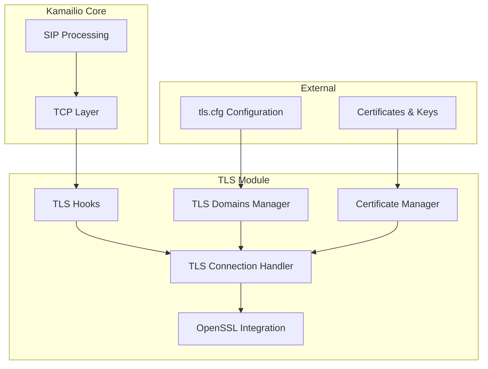
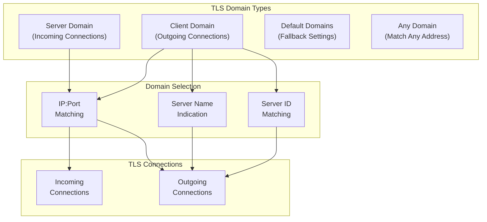
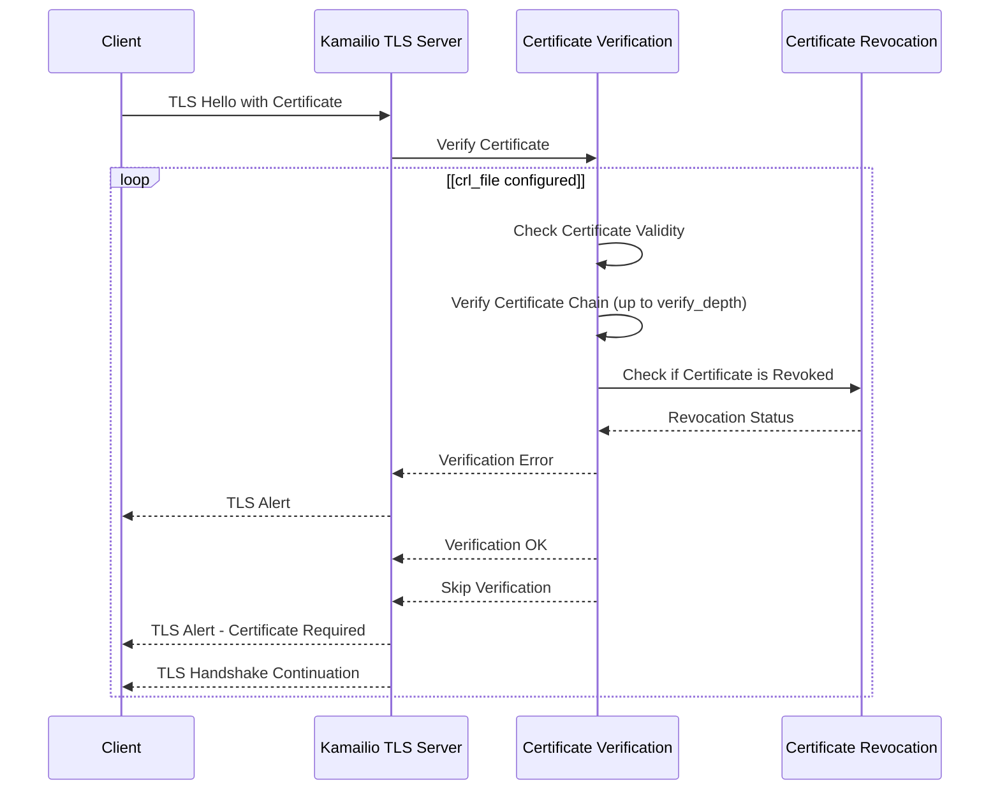
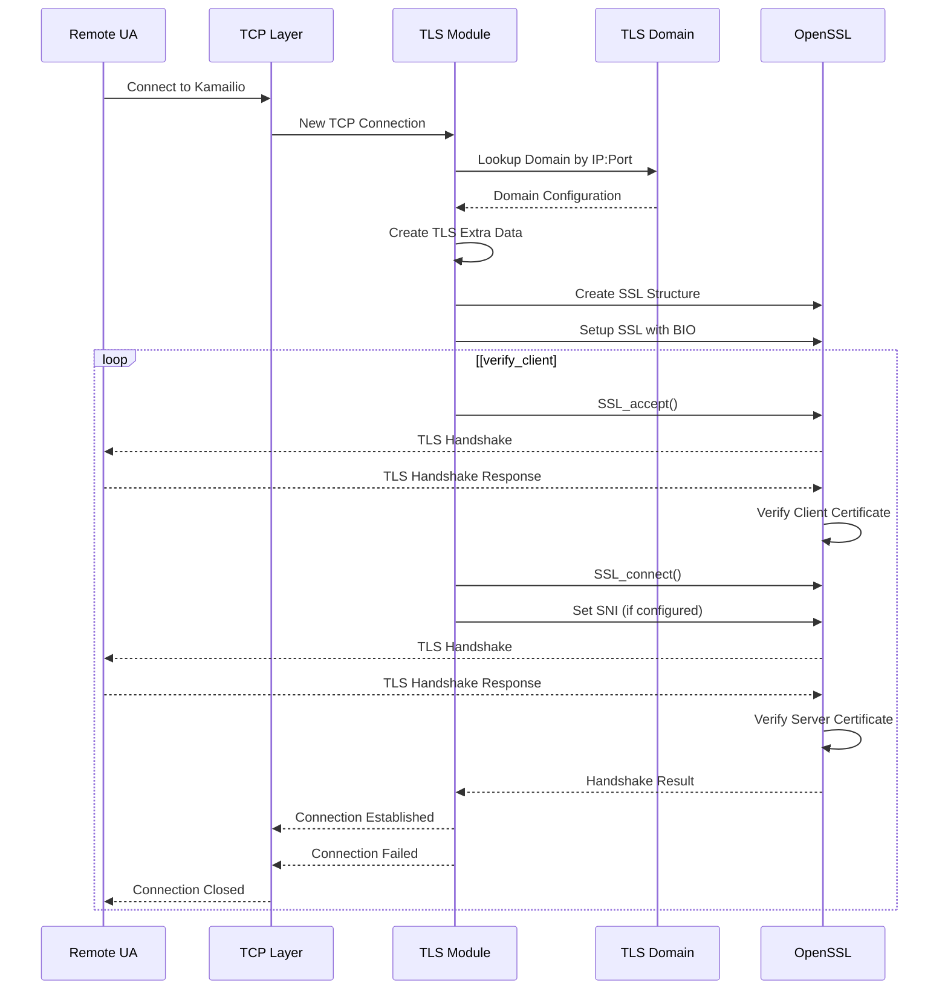

# TLS Module

> **Relevant source files**
> * [src/core/tcp_read.h](https://github.com/kamailio/kamailio/blob/2b4e9f8b/src/core/tcp_read.h)
> * [src/core/tls_hooks.h](https://github.com/kamailio/kamailio/blob/2b4e9f8b/src/core/tls_hooks.h)
> * [src/modules/tls/Makefile](https://github.com/kamailio/kamailio/blob/2b4e9f8b/src/modules/tls/Makefile)
> * [src/modules/tls/doc/certs_howto.xml](https://github.com/kamailio/kamailio/blob/2b4e9f8b/src/modules/tls/doc/certs_howto.xml)
> * [src/modules/tls/doc/functions.xml](https://github.com/kamailio/kamailio/blob/2b4e9f8b/src/modules/tls/doc/functions.xml)
> * [src/modules/tls/doc/hsm_howto.xml](https://github.com/kamailio/kamailio/blob/2b4e9f8b/src/modules/tls/doc/hsm_howto.xml)
> * [src/modules/tls/doc/params.xml](https://github.com/kamailio/kamailio/blob/2b4e9f8b/src/modules/tls/doc/params.xml)
> * [src/modules/tls/doc/rpc.xml](https://github.com/kamailio/kamailio/blob/2b4e9f8b/src/modules/tls/doc/rpc.xml)
> * [src/modules/tls/doc/tls.xml](https://github.com/kamailio/kamailio/blob/2b4e9f8b/src/modules/tls/doc/tls.xml)
> * [src/modules/tls/fixed_c_zlib.h](https://github.com/kamailio/kamailio/blob/2b4e9f8b/src/modules/tls/fixed_c_zlib.h)
> * [src/modules/tls/sbufq.h](https://github.com/kamailio/kamailio/blob/2b4e9f8b/src/modules/tls/sbufq.h)
> * [src/modules/tls/tls_bio.c](https://github.com/kamailio/kamailio/blob/2b4e9f8b/src/modules/tls/tls_bio.c)
> * [src/modules/tls/tls_bio.h](https://github.com/kamailio/kamailio/blob/2b4e9f8b/src/modules/tls/tls_bio.h)
> * [src/modules/tls/tls_cert.sh](https://github.com/kamailio/kamailio/blob/2b4e9f8b/src/modules/tls/tls_cert.sh)
> * [src/modules/tls/tls_cfg.c](https://github.com/kamailio/kamailio/blob/2b4e9f8b/src/modules/tls/tls_cfg.c)
> * [src/modules/tls/tls_cfg.h](https://github.com/kamailio/kamailio/blob/2b4e9f8b/src/modules/tls/tls_cfg.h)
> * [src/modules/tls/tls_config.c](https://github.com/kamailio/kamailio/blob/2b4e9f8b/src/modules/tls/tls_config.c)
> * [src/modules/tls/tls_config.h](https://github.com/kamailio/kamailio/blob/2b4e9f8b/src/modules/tls/tls_config.h)
> * [src/modules/tls/tls_ct_q.h](https://github.com/kamailio/kamailio/blob/2b4e9f8b/src/modules/tls/tls_ct_q.h)
> * [src/modules/tls/tls_ct_wrq.c](https://github.com/kamailio/kamailio/blob/2b4e9f8b/src/modules/tls/tls_ct_wrq.c)
> * [src/modules/tls/tls_ct_wrq.h](https://github.com/kamailio/kamailio/blob/2b4e9f8b/src/modules/tls/tls_ct_wrq.h)
> * [src/modules/tls/tls_domain.c](https://github.com/kamailio/kamailio/blob/2b4e9f8b/src/modules/tls/tls_domain.c)
> * [src/modules/tls/tls_domain.h](https://github.com/kamailio/kamailio/blob/2b4e9f8b/src/modules/tls/tls_domain.h)
> * [src/modules/tls/tls_init.c](https://github.com/kamailio/kamailio/blob/2b4e9f8b/src/modules/tls/tls_init.c)
> * [src/modules/tls/tls_init.h](https://github.com/kamailio/kamailio/blob/2b4e9f8b/src/modules/tls/tls_init.h)
> * [src/modules/tls/tls_locking.c](https://github.com/kamailio/kamailio/blob/2b4e9f8b/src/modules/tls/tls_locking.c)
> * [src/modules/tls/tls_mod.c](https://github.com/kamailio/kamailio/blob/2b4e9f8b/src/modules/tls/tls_mod.c)
> * [src/modules/tls/tls_rand.c](https://github.com/kamailio/kamailio/blob/2b4e9f8b/src/modules/tls/tls_rand.c)
> * [src/modules/tls/tls_rand.h](https://github.com/kamailio/kamailio/blob/2b4e9f8b/src/modules/tls/tls_rand.h)
> * [src/modules/tls/tls_rpc.c](https://github.com/kamailio/kamailio/blob/2b4e9f8b/src/modules/tls/tls_rpc.c)
> * [src/modules/tls/tls_server.c](https://github.com/kamailio/kamailio/blob/2b4e9f8b/src/modules/tls/tls_server.c)
> * [src/modules/tls/tls_server.h](https://github.com/kamailio/kamailio/blob/2b4e9f8b/src/modules/tls/tls_server.h)
> * [src/modules/tls/tls_util.c](https://github.com/kamailio/kamailio/blob/2b4e9f8b/src/modules/tls/tls_util.c)
> * [src/modules/tls/tls_util.h](https://github.com/kamailio/kamailio/blob/2b4e9f8b/src/modules/tls/tls_util.h)
> * [src/modules/tls/tls_verify.c](https://github.com/kamailio/kamailio/blob/2b4e9f8b/src/modules/tls/tls_verify.c)
> * [src/modules/tls/tls_verify.h](https://github.com/kamailio/kamailio/blob/2b4e9f8b/src/modules/tls/tls_verify.h)

## Purpose and Scope

The TLS module implements secure SIP communications for Kamailio using the OpenSSL library. It provides TLS transport capabilities, certificate management, and secure connection handling. This module must be loaded and the `enable_tls=yes` core setting must be configured to enable TLS support in Kamailio.

This document covers the architecture, configuration, and operation of the TLS module. For information about the general TCP implementation that TLS builds upon, see the TCP module documentation.

## Architecture Overview

The TLS module extends Kamailio's transport layer by integrating with the TCP subsystem through a series of hooks. It handles encryption and decryption of SIP messages while maintaining compatibility with the existing transport framework.



Sources: [src/modules/tls/tls_mod.c], [src/modules/tls/tls_init.c], [src/modules/tls/tls_domain.c]

## TLS Domains

TLS domains are the core configuration entities used to organize TLS settings. Each domain defines a set of parameters for TLS connections, including certificate files, verification settings, and cipher preferences.

### Domain Types



Sources: [src/modules/tls/tls_domain.c], [src/modules/tls/tls_domain.h]

### Domain Structure

The TLS domain structure contains all configuration parameters for a particular server or client configuration:

| Field | Description |
| --- | --- |
| type | Domain type (server, client, default, any) |
| ip | IP address to match |
| port | Port number to match |
| ctx | OpenSSL context (SSL_CTX) |
| cert_file | Path to certificate file |
| pkey_file | Path to private key file |
| pkey_password | Private key password |
| verify_cert | Whether to verify certificates |
| verify_depth | Maximum verification depth |
| ca_file | Path to CA certificate file |
| ca_path | Path to directory with CA certificates |
| require_cert | Whether client certificates are required |
| cipher_list | Accepted cipher list |
| method | TLS method (protocol version) |
| crl_file | Certificate revocation list |
| server_name | Server name for SNI |
| server_name_mode | Mode for server name matching |
| server_id | Server identifier |
| verify_client | Client verification mode |

Sources: [src/modules/tls/tls_domain.h:121-143]

## Certificate Management

The TLS module supports various certificate operations, including verification, revocation checking, and SNI (Server Name Indication).

### Certificate Verification Flow



Sources: [src/modules/tls/tls_server.c:407-487], [src/modules/tls/tls_verify.c]

## Configuration Options

The TLS module can be configured through module parameters and the external configuration file (`tls.cfg`).

### Module Parameters

| Parameter | Description | Default |
| --- | --- | --- |
| tls_method | TLS protocol version | TLSv1+ |
| certificate | Certificate file path | kamailio-selfsigned.pem |
| private_key | Private key file path | kamailio-selfsigned.pem |
| private_key_password | Password for private key | (empty) |
| ca_list | CA certificate file | (empty) |
| ca_path | Directory with CA certificates | (empty) |
| crl | Certificate revocation list file | (empty) |
| verify_certificate | Verify certificates | no |
| verify_depth | Certificate verification depth | 9 |
| require_certificate | Require client certificates | no |
| verify_client | Client verification mode | off |
| cipher_list | List of accepted ciphers | (all supported) |
| server_name | Server Name Indication (SNI) value | (empty) |
| connection_timeout | Idle connection timeout (seconds) | 600 |
| tls_disable_compression | Disable TLS compression | yes |
| config | External configuration file | (empty) |

Sources: [src/modules/tls/tls_mod.c:246-322], [src/modules/tls/doc/params.xml]

### External Configuration File

The `tls.cfg` file allows for more advanced configuration, including multiple domains for different IP addresses and ports:

```
[server:default]
method = TLSv1.2+
verify_certificate = yes
ca_list = /etc/kamailio/tls/ca.pem
certificate = /etc/kamailio/tls/server.pem
private_key = /etc/kamailio/tls/server.key
verify_depth = 3

[server:1.2.3.4:5061]
method = TLSv1.3
certificate = /etc/kamailio/tls/special.pem
private_key = /etc/kamailio/tls/special.key

[client:default]
method = TLSv1.2+
verify_certificate = yes
verify_depth = 3
```

Sources: [src/modules/tls/tls_config.c], [src/modules/tls/doc/tls.xml]

## TLS Methods

The TLS module supports various TLS protocol versions:

| Method | Description | Availability |
| --- | --- | --- |
| TLSv1.3+ | TLSv1.3 or newer | OpenSSL 1.1.1+ |
| TLSv1.3 | Only TLSv1.3 | OpenSSL 1.1.1+ |
| TLSv1.2+ | TLSv1.2 or newer | OpenSSL 1.0.1e+ |
| TLSv1.2 | Only TLSv1.2 | OpenSSL 1.0.1e+ |
| TLSv1.1+ | TLSv1.1 or newer | OpenSSL 1.0.1+ |
| TLSv1.1 | Only TLSv1.1 | OpenSSL 1.0.1+ |
| TLSv1+ | TLSv1.0 or newer | All versions |
| TLSv1 | Only TLSv1.0 | All versions |
| SSLv3 | Only SSLv3 (insecure) | All versions |
| SSLv2 | Only SSLv2 (deprecated) | Older versions |
| SSLv23 | Any SSL/TLS version | All versions |

Sources: [src/modules/tls/tls_domain.h:57-87], [src/modules/tls/doc/params.xml:16-104]

## Connection Workflow

The TLS module follows a specific workflow when handling connections.

### TLS Connection Establishment



Sources: [src/modules/tls/tls_server.c:242-353], [src/modules/tls/tls_server.c:407-487]

### Data Flow

```mermaid
flowchart TD

SIPOut["SIP Message"]
TLSWrite["tls_h_encode_f"]
OpenSSL_Write["SSL_write()"]
EncryptedOut["Encrypted Data"]
Network["Network"]
EncryptedIn["Encrypted Data"]
TLSRead["tls_h_read_f"]
OpenSSL_Read["SSL_read()"]
Decrypted["Decrypted Data"]
SIPParser["SIP Parser"]

subgraph subGraph1 ["Outgoing Data"]
    SIPOut
    TLSWrite
    OpenSSL_Write
    EncryptedOut
    Network
    SIPOut --> TLSWrite
    TLSWrite --> OpenSSL_Write
    OpenSSL_Write --> EncryptedOut
    EncryptedOut --> Network
end

subgraph subGraph0 ["Incoming Data"]
    EncryptedIn
    TLSRead
    OpenSSL_Read
    Decrypted
    SIPParser
    EncryptedIn --> TLSRead
    TLSRead --> OpenSSL_Read
    OpenSSL_Read --> Decrypted
    Decrypted --> SIPParser
end
```



Sources: [src/modules/tls/tls_server.c]

## RPC Commands

The TLS module provides several RPC commands to monitor and manage TLS operations:

| Command | Description |
| --- | --- |
| tls.info | List internal TLS module information |
| tls.list | List details about active TLS connections |
| tls.options | Show current TLS configuration |
| tls.kill | Kill a TLS session by ID |
| tls.reload | Reload the TLS configuration file |

Example:

```
kamcmd tls.info
```

Sources: [src/modules/tls/tls_rpc.c], [src/modules/tls/doc/rpc.xml]

## Important Notes

### OpenSSL Compatibility

* The TLS module includes workarounds for various OpenSSL bugs, particularly for memory handling
* For optimal performance, it's recommended to compile the module on the same machine where Kamailio will run or to use static linking with libssl
* The module should be loaded before any other module that uses libssl
* For OpenSSL 3.x, the `tls_threads_mode` core parameter may need to be set for proper threading

### Memory Considerations

* TLS compression is disabled by default due to high memory consumption (about 10x more memory)
* The module implements workarounds for OpenSSL low-memory situations to prevent crashes
* For systems with memory constraints, parameters `low_mem_threshold1` and `low_mem_threshold2` can be adjusted

### Security Considerations

* Private keys must not be encrypted (Kamailio cannot prompt for passwords during startup)
* SSLv2 and SSLv3 are considered insecure and should not be used
* TLSv1.0 and TLSv1.1 are deprecated since March 2021 (RFC 8996)
* For current security recommendations, consult IETF BCP 195 (RFC 9325)

Sources: [src/modules/tls/doc/tls.xml:113-196], [src/modules/tls/tls_init.c]