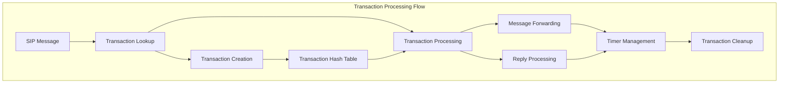
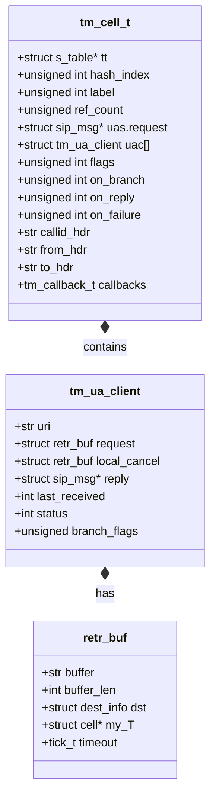
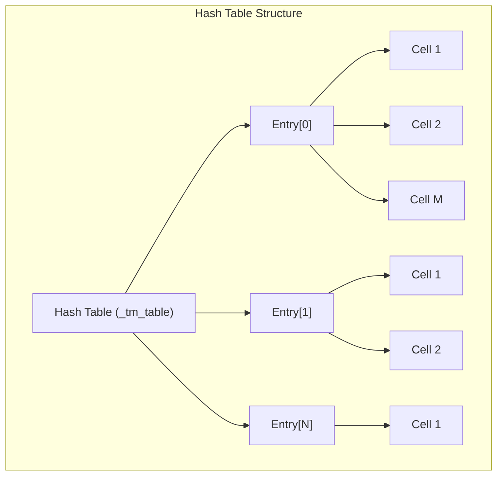
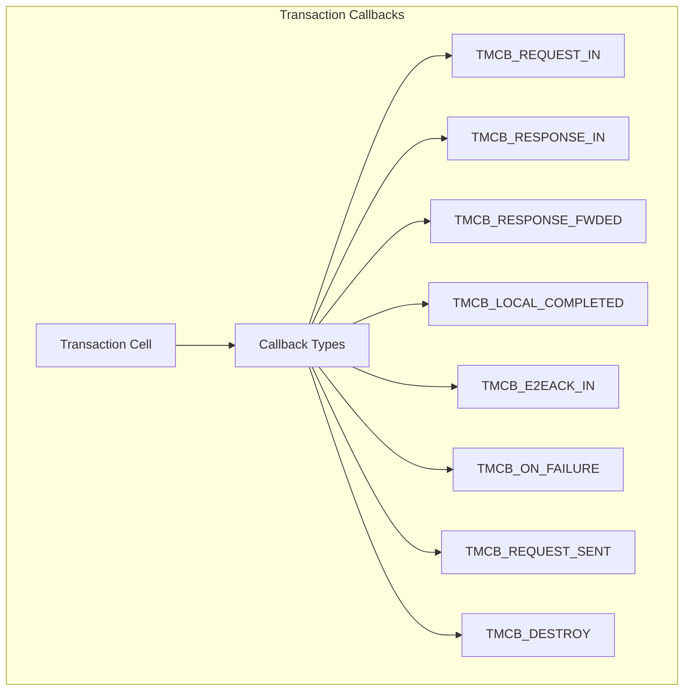
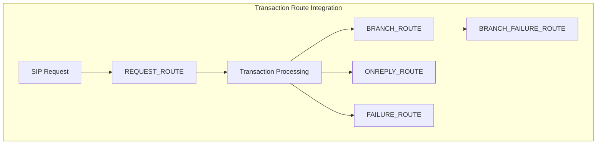

# Transaction Management

> **Relevant source files**
> * [src/modules/tm/callid.c](https://github.com/kamailio/kamailio/blob/2b4e9f8b/src/modules/tm/callid.c)
> * [src/modules/tm/callid.h](https://github.com/kamailio/kamailio/blob/2b4e9f8b/src/modules/tm/callid.h)
> * [src/modules/tm/config.c](https://github.com/kamailio/kamailio/blob/2b4e9f8b/src/modules/tm/config.c)
> * [src/modules/tm/config.h](https://github.com/kamailio/kamailio/blob/2b4e9f8b/src/modules/tm/config.h)
> * [src/modules/tm/dlg.c](https://github.com/kamailio/kamailio/blob/2b4e9f8b/src/modules/tm/dlg.c)
> * [src/modules/tm/dlg.h](https://github.com/kamailio/kamailio/blob/2b4e9f8b/src/modules/tm/dlg.h)
> * [src/modules/tm/doc/api.xml](https://github.com/kamailio/kamailio/blob/2b4e9f8b/src/modules/tm/doc/api.xml)
> * [src/modules/tm/doc/event_routes.xml](https://github.com/kamailio/kamailio/blob/2b4e9f8b/src/modules/tm/doc/event_routes.xml)
> * [src/modules/tm/doc/functions.xml](https://github.com/kamailio/kamailio/blob/2b4e9f8b/src/modules/tm/doc/functions.xml)
> * [src/modules/tm/doc/params.xml](https://github.com/kamailio/kamailio/blob/2b4e9f8b/src/modules/tm/doc/params.xml)
> * [src/modules/tm/doc/rpc.xml](https://github.com/kamailio/kamailio/blob/2b4e9f8b/src/modules/tm/doc/rpc.xml)
> * [src/modules/tm/doc/tm.xml](https://github.com/kamailio/kamailio/blob/2b4e9f8b/src/modules/tm/doc/tm.xml)
> * [src/modules/tm/h_table.c](https://github.com/kamailio/kamailio/blob/2b4e9f8b/src/modules/tm/h_table.c)
> * [src/modules/tm/h_table.h](https://github.com/kamailio/kamailio/blob/2b4e9f8b/src/modules/tm/h_table.h)
> * [src/modules/tm/lock.c](https://github.com/kamailio/kamailio/blob/2b4e9f8b/src/modules/tm/lock.c)
> * [src/modules/tm/lock.h](https://github.com/kamailio/kamailio/blob/2b4e9f8b/src/modules/tm/lock.h)
> * [src/modules/tm/lw_parser.c](https://github.com/kamailio/kamailio/blob/2b4e9f8b/src/modules/tm/lw_parser.c)
> * [src/modules/tm/lw_parser.h](https://github.com/kamailio/kamailio/blob/2b4e9f8b/src/modules/tm/lw_parser.h)
> * [src/modules/tm/rpc_uac.c](https://github.com/kamailio/kamailio/blob/2b4e9f8b/src/modules/tm/rpc_uac.c)
> * [src/modules/tm/rpc_uac.h](https://github.com/kamailio/kamailio/blob/2b4e9f8b/src/modules/tm/rpc_uac.h)
> * [src/modules/tm/t_append_branches.c](https://github.com/kamailio/kamailio/blob/2b4e9f8b/src/modules/tm/t_append_branches.c)
> * [src/modules/tm/t_append_branches.h](https://github.com/kamailio/kamailio/blob/2b4e9f8b/src/modules/tm/t_append_branches.h)
> * [src/modules/tm/t_cancel.c](https://github.com/kamailio/kamailio/blob/2b4e9f8b/src/modules/tm/t_cancel.c)
> * [src/modules/tm/t_cancel.h](https://github.com/kamailio/kamailio/blob/2b4e9f8b/src/modules/tm/t_cancel.h)
> * [src/modules/tm/t_fifo.c](https://github.com/kamailio/kamailio/blob/2b4e9f8b/src/modules/tm/t_fifo.c)
> * [src/modules/tm/t_fifo.h](https://github.com/kamailio/kamailio/blob/2b4e9f8b/src/modules/tm/t_fifo.h)
> * [src/modules/tm/t_funcs.c](https://github.com/kamailio/kamailio/blob/2b4e9f8b/src/modules/tm/t_funcs.c)
> * [src/modules/tm/t_funcs.h](https://github.com/kamailio/kamailio/blob/2b4e9f8b/src/modules/tm/t_funcs.h)
> * [src/modules/tm/t_fwd.c](https://github.com/kamailio/kamailio/blob/2b4e9f8b/src/modules/tm/t_fwd.c)
> * [src/modules/tm/t_fwd.h](https://github.com/kamailio/kamailio/blob/2b4e9f8b/src/modules/tm/t_fwd.h)
> * [src/modules/tm/t_hooks.c](https://github.com/kamailio/kamailio/blob/2b4e9f8b/src/modules/tm/t_hooks.c)
> * [src/modules/tm/t_hooks.h](https://github.com/kamailio/kamailio/blob/2b4e9f8b/src/modules/tm/t_hooks.h)
> * [src/modules/tm/t_lookup.c](https://github.com/kamailio/kamailio/blob/2b4e9f8b/src/modules/tm/t_lookup.c)
> * [src/modules/tm/t_lookup.h](https://github.com/kamailio/kamailio/blob/2b4e9f8b/src/modules/tm/t_lookup.h)
> * [src/modules/tm/t_msgbuilder.c](https://github.com/kamailio/kamailio/blob/2b4e9f8b/src/modules/tm/t_msgbuilder.c)
> * [src/modules/tm/t_msgbuilder.h](https://github.com/kamailio/kamailio/blob/2b4e9f8b/src/modules/tm/t_msgbuilder.h)
> * [src/modules/tm/t_reply.c](https://github.com/kamailio/kamailio/blob/2b4e9f8b/src/modules/tm/t_reply.c)
> * [src/modules/tm/t_reply.h](https://github.com/kamailio/kamailio/blob/2b4e9f8b/src/modules/tm/t_reply.h)
> * [src/modules/tm/t_serial.c](https://github.com/kamailio/kamailio/blob/2b4e9f8b/src/modules/tm/t_serial.c)
> * [src/modules/tm/t_serial.h](https://github.com/kamailio/kamailio/blob/2b4e9f8b/src/modules/tm/t_serial.h)
> * [src/modules/tm/t_stats.c](https://github.com/kamailio/kamailio/blob/2b4e9f8b/src/modules/tm/t_stats.c)
> * [src/modules/tm/t_stats.h](https://github.com/kamailio/kamailio/blob/2b4e9f8b/src/modules/tm/t_stats.h)
> * [src/modules/tm/t_suspend.c](https://github.com/kamailio/kamailio/blob/2b4e9f8b/src/modules/tm/t_suspend.c)
> * [src/modules/tm/t_suspend.h](https://github.com/kamailio/kamailio/blob/2b4e9f8b/src/modules/tm/t_suspend.h)
> * [src/modules/tm/timer.c](https://github.com/kamailio/kamailio/blob/2b4e9f8b/src/modules/tm/timer.c)
> * [src/modules/tm/timer.h](https://github.com/kamailio/kamailio/blob/2b4e9f8b/src/modules/tm/timer.h)
> * [src/modules/tm/tm.c](https://github.com/kamailio/kamailio/blob/2b4e9f8b/src/modules/tm/tm.c)
> * [src/modules/tm/tm_load.c](https://github.com/kamailio/kamailio/blob/2b4e9f8b/src/modules/tm/tm_load.c)
> * [src/modules/tm/tm_load.h](https://github.com/kamailio/kamailio/blob/2b4e9f8b/src/modules/tm/tm_load.h)
> * [src/modules/tm/uac.c](https://github.com/kamailio/kamailio/blob/2b4e9f8b/src/modules/tm/uac.c)
> * [src/modules/tm/uac.h](https://github.com/kamailio/kamailio/blob/2b4e9f8b/src/modules/tm/uac.h)
> * [src/modules/tm/ut.h](https://github.com/kamailio/kamailio/blob/2b4e9f8b/src/modules/tm/ut.h)

This document explains how Kamailio's transaction management system (TM module) works, focusing on the internal architecture and operational mechanics of transaction processing. The TM module provides stateful processing for SIP transactions, which is essential for complex routing, reliability, retransmission handling, and forking. For function-specific API references, please see [Module API](/kamailio/kamailio/3.1-module-architecture).

## 1. Transaction Management Overview

The transaction management (TM) module is a core component that enables Kamailio to handle SIP transactions in a stateful manner. A SIP transaction consists of a request and all responses to that request, which SIP elements send back.

The main purposes of the TM module are:

* Stateful transaction tracking
* Automatic retransmission handling
* Timer management for transaction states
* Forking support (parallel and serial)
* Transaction-based failure handling
* Support for asynchronous processing



Sources: [src/modules/tm/tm.c L30-L48](https://github.com/kamailio/kamailio/blob/2b4e9f8b/src/modules/tm/tm.c#L30-L48)

 [src/modules/tm/h_table.c L61-L81](https://github.com/kamailio/kamailio/blob/2b4e9f8b/src/modules/tm/h_table.c#L61-L81)

 [src/modules/tm/t_lookup.c L113-L147](https://github.com/kamailio/kamailio/blob/2b4e9f8b/src/modules/tm/t_lookup.c#L113-L147)

## 2. Transaction Data Structure

At the core of transaction management is the transaction cell (`tm_cell_t`), which stores all information related to a SIP transaction.



Each transaction is identified by a hash index and a label, which are used for efficient lookup in the transaction table.

Sources: [src/modules/tm/h_table.h L111-L118](https://github.com/kamailio/kamailio/blob/2b4e9f8b/src/modules/tm/h_table.h#L111-L118)

 [src/modules/tm/h_table.h L198-L290](https://github.com/kamailio/kamailio/blob/2b4e9f8b/src/modules/tm/h_table.h#L198-L290)

## 3. Transaction Hash Table

Transactions are stored in a hash table for efficient lookup. The table structure uses a modular design for lock management.



Each entry in the hash table contains:

* A mutex lock for thread safety
* A linked list of transaction cells
* Record lock level to allow recursive locking
* Statistics about entries

Sources: [src/modules/tm/h_table.c L84-L109](https://github.com/kamailio/kamailio/blob/2b4e9f8b/src/modules/tm/h_table.c#L84-L109)

 [src/modules/tm/h_table.h L304-L328](https://github.com/kamailio/kamailio/blob/2b4e9f8b/src/modules/tm/h_table.h#L304-L328)

## 4. Transaction Lifecycle

A transaction in Kamailio goes through several states during its lifetime:

```mermaid
stateDiagram-v2
    [*] --> "New" : "Request received"
    New --> "Trying" : "t_newtran()"
    Trying --> "Proceeding" : "Provisional response"
    Proceeding --> "Completed" : "Final response"
    Trying --> "Completed" : "Final response"
    Completed --> "Terminated" : "ACK/FR_TIMER"
    Completed --> "Confirmed" : "ACK (INVITE only)"
    Confirmed --> "Terminated" : "FR_INV_TIMER"
    Terminated --> "Wait" : "WT_TIMER starts"
    Wait --> [*] : "Transaction cleared"
```

Sources: [src/modules/tm/t_funcs.c L124-L165](https://github.com/kamailio/kamailio/blob/2b4e9f8b/src/modules/tm/t_funcs.c#L124-L165)

 [src/modules/tm/timer.c L285-L340](https://github.com/kamailio/kamailio/blob/2b4e9f8b/src/modules/tm/timer.c#L285-L340)

### 4.1 Transaction Creation

When a new SIP message is processed using TM, a transaction is created using:

1. `t_newtran()`: Creates a new transaction
2. `build_cell()`: Allocates and initializes the transaction cell
3. `insert_into_hash_table()`: Adds the transaction to the hash table

The transaction is identified by a unique combination of a hash index and a label.

Sources: [src/modules/tm/t_funcs.c L124-L165](https://github.com/kamailio/kamailio/blob/2b4e9f8b/src/modules/tm/t_funcs.c#L124-L165)

 [src/modules/tm/h_table.c L360-L400](https://github.com/kamailio/kamailio/blob/2b4e9f8b/src/modules/tm/h_table.c#L360-L400)

### 4.2 Transaction Lookup

When a SIP message arrives, the system attempts to match it with an existing transaction:

1. For requests: Match based on branch parameter or dialog information
2. For responses: Match based on branch parameter in Via header

The functions `t_lookup_request()` and `t_lookup_cancel()` perform these lookups.

Sources: [src/modules/tm/t_lookup.c L372-L453](https://github.com/kamailio/kamailio/blob/2b4e9f8b/src/modules/tm/t_lookup.c#L372-L453)

 [src/modules/tm/t_lookup.c L800-L870](https://github.com/kamailio/kamailio/blob/2b4e9f8b/src/modules/tm/t_lookup.c#L800-L870)

### 4.3 Message Forwarding

Once a transaction is created, the message can be forwarded to destinations:

1. `t_relay()`: Relays a message within transaction context
2. `t_forward_nonack()`: Forwards a non-ACK request
3. Various specialized forwarding functions for different protocols (UDP, TCP, TLS, SCTP)

Sources: [src/modules/tm/t_fwd.c L720-L760](https://github.com/kamailio/kamailio/blob/2b4e9f8b/src/modules/tm/t_fwd.c#L720-L760)

 [src/modules/tm/tm.c L317-L327](https://github.com/kamailio/kamailio/blob/2b4e9f8b/src/modules/tm/tm.c#L317-L327)

### 4.4 Reply Processing

Replies are handled using several mechanisms:

1. `t_reply()`: Generates and sends a reply within transaction context
2. `_reply_light()`: Lighter version for internal replies
3. `t_pick_branch()`: Selects the best response from multiple branches

Responses are prioritized based on their class (2xx having highest priority, followed by 6xx, 3xx, 4xx, and 5xx).

Sources: [src/modules/tm/t_reply.c L452-L678](https://github.com/kamailio/kamailio/blob/2b4e9f8b/src/modules/tm/t_reply.c#L452-L678)

 [src/modules/tm/t_reply.c L683-L718](https://github.com/kamailio/kamailio/blob/2b4e9f8b/src/modules/tm/t_reply.c#L683-L718)

## 5. Transaction Timers

The TM module uses several timers to manage transaction states:

| Timer | Default Value | Description |
| --- | --- | --- |
| fr_timer | 30 seconds | Final response timer for all requests |
| fr_inv_timer | 120 seconds | Final response timer for INVITE after provisional response |
| wt_timer | 5 seconds | Wait time after transaction completion |
| retr_timer1 | 500 ms | Initial retransmission interval |
| retr_timer2 | 4000 ms | Maximum retransmission interval |
| max_inv_lifetime | 180 seconds | Maximum lifetime for INVITE transactions |
| max_noninv_lifetime | 32 seconds | Maximum lifetime for non-INVITE transactions |

Timers can be configured globally or per-transaction using functions like `t_set_fr()` and `t_set_max_lifetime()`.

Sources: [src/modules/tm/doc/params.xml L18-L37](https://github.com/kamailio/kamailio/blob/2b4e9f8b/src/modules/tm/doc/params.xml#L18-L37)

 [src/modules/tm/doc/params.xml L45-L72](https://github.com/kamailio/kamailio/blob/2b4e9f8b/src/modules/tm/doc/params.xml#L45-L72)

 [src/modules/tm/timer.c L285-L340](https://github.com/kamailio/kamailio/blob/2b4e9f8b/src/modules/tm/timer.c#L285-L340)

## 6. Transaction Callbacks

The TM module provides an extensive callback system for various transaction events:



Applications can register callback functions to be notified when specific events occur in a transaction's lifecycle.

Sources: [src/modules/tm/t_hooks.c L40-L104](https://github.com/kamailio/kamailio/blob/2b4e9f8b/src/modules/tm/t_hooks.c#L40-L104)

 [src/modules/tm/h_table.h L375-L392](https://github.com/kamailio/kamailio/blob/2b4e9f8b/src/modules/tm/h_table.h#L375-L392)

## 7. Routing Logic and Transaction Context

Transaction management integrates with Kamailio's routing system through special route types:

1. **failure_route**: Executed when a transaction fails
2. **branch_route**: Executed for each branch before forwarding
3. **onreply_route**: Executed when a reply is received
4. **branch_failure_route**: Executed when a specific branch fails

These routes provide fine-grained control over transaction processing.



Sources: [src/modules/tm/t_reply.c L185-L215](https://github.com/kamailio/kamailio/blob/2b4e9f8b/src/modules/tm/t_reply.c#L185-L215)

 [src/modules/tm/t_fwd.c L66-L94](https://github.com/kamailio/kamailio/blob/2b4e9f8b/src/modules/tm/t_fwd.c#L66-L94)

## 8. Transaction Control Functions

The TM module provides various functions to control transaction behavior:

### Creation and Forwarding

* `t_newtran()`: Creates a new transaction
* `t_relay()`: Forwards a request statefully
* `t_relay_to_udp/tcp/tls/sctp()`: Protocol-specific forwarding

### Replies

* `t_reply()`: Sends a reply within transaction context
* `t_check_status()`: Checks response status
* `t_grep_status()`: Searches for specific status codes

### Transaction Control

* `t_on_failure()`: Sets the failure route
* `t_on_reply()`: Sets the reply route
* `t_on_branch()`: Sets the branch route
* `t_check_trans()`: Checks if a transaction exists

### Advanced Control

* `t_set_fr()`: Sets final response timers
* `t_suspend()/t_continue()`: Suspends/continues transaction processing

Sources: [src/modules/tm/doc/functions.xml L12-L51](https://github.com/kamailio/kamailio/blob/2b4e9f8b/src/modules/tm/doc/functions.xml#L12-L51)

 [src/modules/tm/doc/functions.xml L122-L166](https://github.com/kamailio/kamailio/blob/2b4e9f8b/src/modules/tm/doc/functions.xml#L122-L166)

## 9. Asynchronous Transaction Processing

The TM module supports asynchronous processing through the suspend/continue mechanism:

1. `t_suspend()`: Suspends transaction processing and returns control
2. External events occur (e.g., database query, external API call)
3. `t_continue()`: Resumes processing from where it was suspended

This enables non-blocking processing of transactions that need to wait for external events.

Sources: [src/modules/tm/t_suspend.c L57-L147](https://github.com/kamailio/kamailio/blob/2b4e9f8b/src/modules/tm/t_suspend.c#L57-L147)

 [src/modules/tm/t_suspend.c L151-L248](https://github.com/kamailio/kamailio/blob/2b4e9f8b/src/modules/tm/t_suspend.c#L151-L248)

## 10. Memory Management

Transaction management requires careful memory handling:

1. Transactions are allocated in shared memory
2. Reference counting prevents premature deallocation
3. Automatic cleanup occurs after transaction timeouts
4. Functions like `t_unref()` and `free_cell()` handle memory deallocation

The TM module has several safeguards against memory leaks, including transaction lifetime limits and garbage collection.

Sources: [src/modules/tm/h_table.c L126-L268](https://github.com/kamailio/kamailio/blob/2b4e9f8b/src/modules/tm/h_table.c#L126-L268)

 [src/modules/tm/t_funcs.c L67-L109](https://github.com/kamailio/kamailio/blob/2b4e9f8b/src/modules/tm/t_funcs.c#L67-L109)