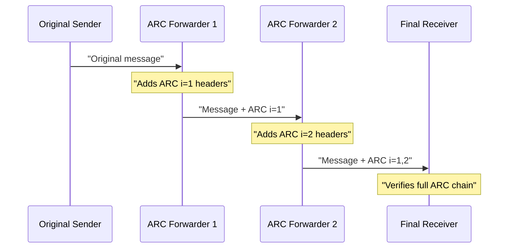
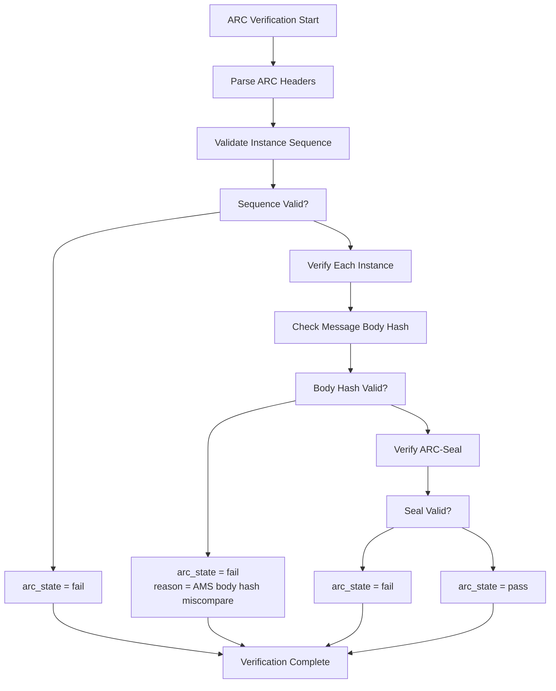
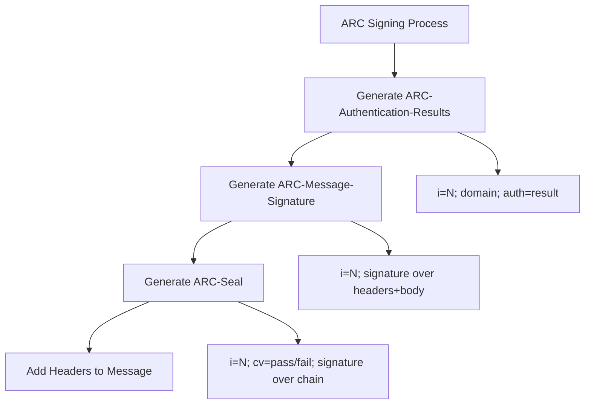
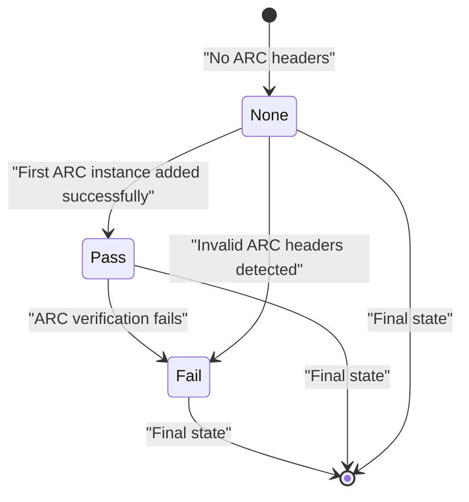
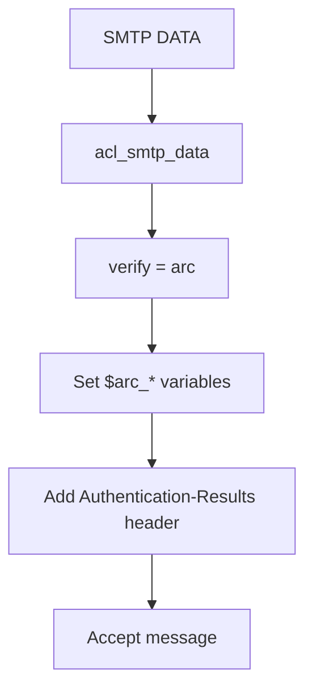
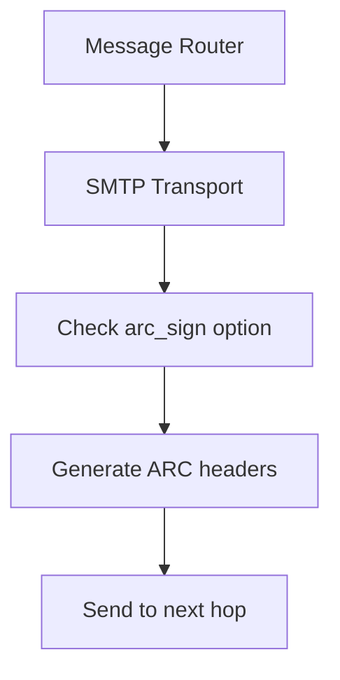

# ARC Processing

> **Relevant source files**
> * [test/aux-fixed/4560.msg1.txt](https://github.com/Exim/exim/blob/29568b25/test/aux-fixed/4560.msg1.txt)
> * [test/aux-fixed/dkim/sign_arc.pl](https://github.com/Exim/exim/blob/29568b25/test/aux-fixed/dkim/sign_arc.pl)
> * [test/confs/2027](https://github.com/Exim/exim/blob/29568b25/test/confs/2027)
> * [test/confs/2035](https://github.com/Exim/exim/blob/29568b25/test/confs/2035)
> * [test/confs/3820](https://github.com/Exim/exim/blob/29568b25/test/confs/3820)
> * [test/confs/3825](https://github.com/Exim/exim/blob/29568b25/test/confs/3825)
> * [test/confs/3901](https://github.com/Exim/exim/blob/29568b25/test/confs/3901)
> * [test/confs/4560](https://github.com/Exim/exim/blob/29568b25/test/confs/4560)
> * [test/confs/4565](https://github.com/Exim/exim/blob/29568b25/test/confs/4565)
> * [test/confs/4620](https://github.com/Exim/exim/blob/29568b25/test/confs/4620)
> * [test/confs/4690](https://github.com/Exim/exim/blob/29568b25/test/confs/4690)
> * [test/confs/5670](https://github.com/Exim/exim/blob/29568b25/test/confs/5670)
> * [test/log/4560](https://github.com/Exim/exim/blob/29568b25/test/log/4560)
> * [test/log/4561](https://github.com/Exim/exim/blob/29568b25/test/log/4561)
> * [test/mail/4560.a](https://github.com/Exim/exim/blob/29568b25/test/mail/4560.a)
> * [test/mail/4561.a](https://github.com/Exim/exim/blob/29568b25/test/mail/4561.a)
> * [test/scripts/4560-ARC/4560](https://github.com/Exim/exim/blob/29568b25/test/scripts/4560-ARC/4560)

This document covers Exim's implementation of Authenticated Received Chain (ARC) processing, including verification of existing ARC signatures and creation of new ARC signatures for forwarded messages. ARC enables email authentication to be preserved through intermediary mail servers that modify messages, such as mailing lists and forwarders.

For information about DKIM signature verification, see [DKIM Verification](/Exim/exim/3.2-dkim-verification). For general content scanning features, see [Content Scanning](/Exim/exim/3.3-content-scanning).

## ARC Protocol Overview

ARC (Authenticated Received Chain) is an email authentication mechanism that preserves authentication results when messages pass through intermediary servers that may modify the message content. Unlike DKIM, which breaks when message content changes, ARC creates a cryptographic chain of authentication results that can survive message modifications.

Each ARC-aware mail server in the forwarding path adds three headers to create a numbered "instance" in the chain:

* **ARC-Authentication-Results**: Records authentication results from this hop
* **ARC-Message-Signature**: Signs the message content and selected headers
* **ARC-Seal**: Seals the entire ARC chain up to this point



Sources: [test/mail/4560.a L1-L524](https://github.com/Exim/exim/blob/29568b25/test/mail/4560.a#L1-L524)

 [test/scripts/4560-ARC/4560 L1-L460](https://github.com/Exim/exim/blob/29568b25/test/scripts/4560-ARC/4560#L1-L460)

## ARC Verification Process

Exim's ARC verification examines the complete chain of ARC headers to determine the authentication status. The verification process validates each instance in the chain and determines the overall ARC state.

### Verification Flow



### ARC Verification Configuration

ARC verification is performed using the `verify = arc` ACL condition:

```yaml
acl_smtp_data = check_data

begin acl
check_data:
  warn  !verify = arc
  accept add_header = :at_start:${authresults {$primary_hostname}}
```

The verification can accept optional parameters to control behavior:

```markdown
verify = arc/pass    # Only accept if ARC state is 'pass'
```

Sources: [test/confs/4560 L23-L45](https://github.com/Exim/exim/blob/29568b25/test/confs/4560#L23-L45)

 [test/confs/4565 L24-L37](https://github.com/Exim/exim/blob/29568b25/test/confs/4565#L24-L37)

## ARC State Variables

After ARC verification, several expansion variables become available:

| Variable | Description | Example Values |
| --- | --- | --- |
| `$arc_state` | Overall ARC verification result | `pass`, `fail`, `none` |
| `$arc_domains` | Colon-separated list of ARC signing domains | `test.ex:example.com` |
| `$arc_oldest_pass` | Instance number of oldest passing ARC signature | `1`, `2`, `0` |
| `$arc_state_reason` | Reason for failure (if applicable) | `AMS body hash miscompare` |

Additional header-related variables:

* `$lh_Authentication-Results:` - Authentication-Results headers
* `$lh_ARC-Authentication-Results:` - ARC-Authentication-Results headers

Sources: [test/confs/4560 L27-L39](https://github.com/Exim/exim/blob/29568b25/test/confs/4560#L27-L39)

 [test/log/4560 L4-L10](https://github.com/Exim/exim/blob/29568b25/test/log/4560#L4-L10)

## ARC Signing Process

Exim can add ARC signatures when forwarding messages, creating a new instance in the ARC chain. This preserves authentication information when messages are modified during forwarding.

### ARC Signing Configuration

ARC signing is configured in transport definitions using the `arc_sign` option:

```yaml
begin transports

smtp_transport:
  driver = smtp
  hosts = 127.0.0.1
  arc_sign = $primary_hostname : selector : /path/to/private/key
```

The `arc_sign` parameter format is: `domain : selector : keyfile`

### ARC Header Generation

When ARC signing is enabled, Exim automatically generates three headers for each instance:



Example of generated ARC headers:

```
ARC-Authentication-Results: i=1; test.ex; smtp.remote-ip=127.0.0.1; arc=none
ARC-Message-Signature: i=1; a=rsa-sha256; c=relaxed; d=test.ex; s=sel;
  bh=HUzfKKxIjPIa07lkj5uzDQ3q5YTRF/NwAUE7dhrrfvs=;
  h=Subject; b=HaqbXBWR7eLrt4KfDPd/G3iSS6Uc4tXEScE4sTS/x...
ARC-Seal: i=1; cv=none; a=rsa-sha256; d=test.ex; s=sel;
  b=1WIsU9bnj5eAXJuTBjQIEmuhuzJcPtBUJhL1FgyJ6baycKwrL...
```

Sources: [test/confs/4560 L95-L97](https://github.com/Exim/exim/blob/29568b25/test/confs/4560#L95-L97)

 [test/mail/4560.a L44-L51](https://github.com/Exim/exim/blob/29568b25/test/mail/4560.a#L44-L51)

## ARC Chain Validation States

ARC verification produces different states based on the validation results:

### Pass State

* All ARC instances in chain verify successfully
* Message body hash matches ARC-Message-Signature
* ARC-Seal signatures are valid
* Chain sequence is intact

### Fail State

* One or more ARC signatures fail verification
* Body hash mismatch detected
* Invalid chain sequence (missing instances)
* Cryptographic verification failure

### None State

* No ARC headers present in message
* Message has not been processed by ARC-aware servers



Sources: [test/log/4560 L4-L284](https://github.com/Exim/exim/blob/29568b25/test/log/4560#L4-L284)

 [test/mail/4560.a L205-L227](https://github.com/Exim/exim/blob/29568b25/test/mail/4560.a#L205-L227)

## Integration with Mail Processing Pipeline

ARC processing integrates with Exim's mail processing at two key points:

### Reception (ACL Integration)

ARC verification typically occurs in the `acl_smtp_data` ACL:



### Delivery (Transport Integration)

ARC signing occurs during message delivery via transports:



Sources: [test/confs/4560 L13-L45](https://github.com/Exim/exim/blob/29568b25/test/confs/4560#L13-L45)

 [test/confs/4565 L14-L37](https://github.com/Exim/exim/blob/29568b25/test/confs/4565#L14-L37)

## Error Handling and Diagnostics

### Common ARC Failure Scenarios

| Failure Type | Reason | arc_state_reason |
| --- | --- | --- |
| Sequence Error | Missing or out-of-order instances | `(sequence; expected i=1)` |
| Body Hash Mismatch | Message content modified | `AMS body hash miscompare` |
| Signature Failure | Invalid cryptographic signature | `i=N (cv)` |
| Key Issues | Cannot access signing key | Various OpenSSL errors |

### Logging and Debug Information

ARC processing can be monitored through log entries showing:

* ARC state transitions
* Domain information
* Failure reasons
* Authentication results

Example log entries:

```html
arc_state:      <pass>
domains:        <test.ex>
arc_oldest_pass <1>
reason:         <>
```

Sources: [test/log/4560 L157-L175](https://github.com/Exim/exim/blob/29568b25/test/log/4560#L157-L175)

 [test/log/4561 L4-L11](https://github.com/Exim/exim/blob/29568b25/test/log/4561#L4-L11)

## Configuration Examples

### Basic ARC Verification Only

```yaml
acl_smtp_data = check_data

begin acl
check_data:
  warn  !verify = arc
  accept add_header = :at_start:${authresults {$primary_hostname}}
```

### ARC Signing for Forwarding

```yaml
begin transports
forward_smtp:
  driver = smtp
  hosts = $domain
  arc_sign = $primary_hostname : default : /etc/exim/arc.key
```

### Conditional ARC Processing

```yaml
begin acl
check_data:
  warn  condition = ${if eq{$arc_state}{pass}}
        log_message = ARC verification passed
  warn  condition = ${if eq{$arc_state}{fail}}  
        log_message = ARC verification failed: $arc_state_reason
```

Sources: [test/confs/4560 L1-L111](https://github.com/Exim/exim/blob/29568b25/test/confs/4560#L1-L111)

 [test/confs/4565 L1-L81](https://github.com/Exim/exim/blob/29568b25/test/confs/4565#L1-L81)