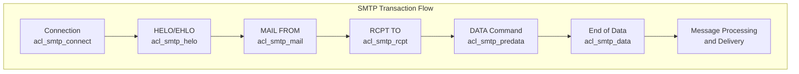
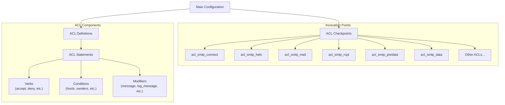
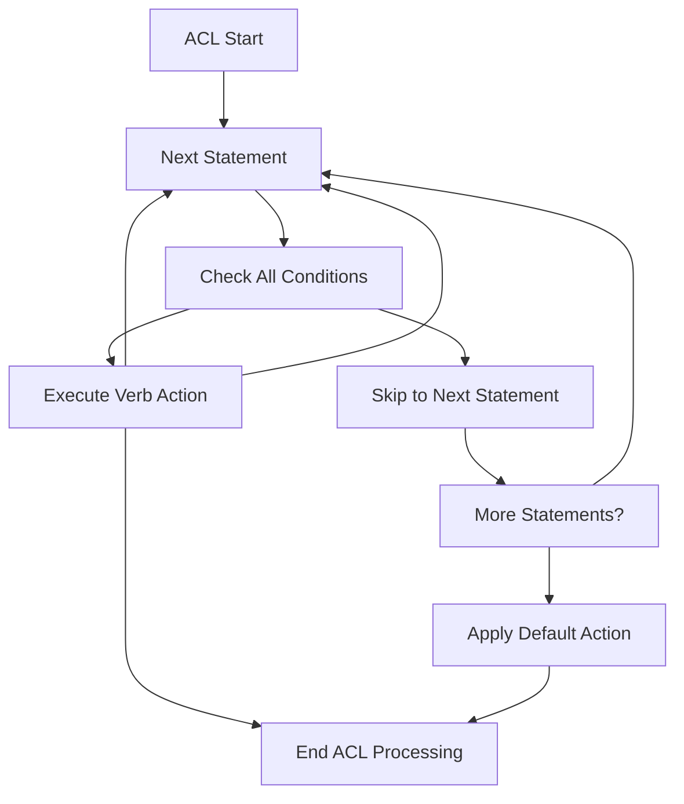
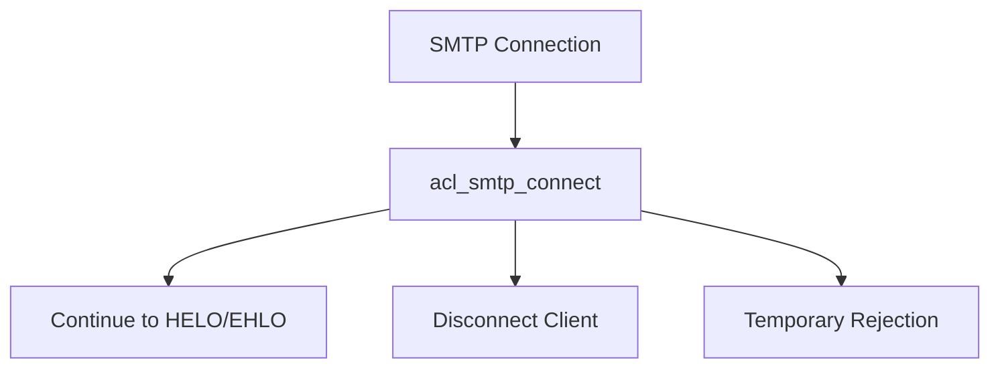
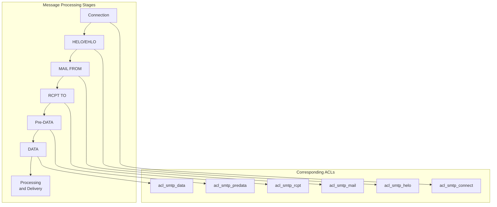
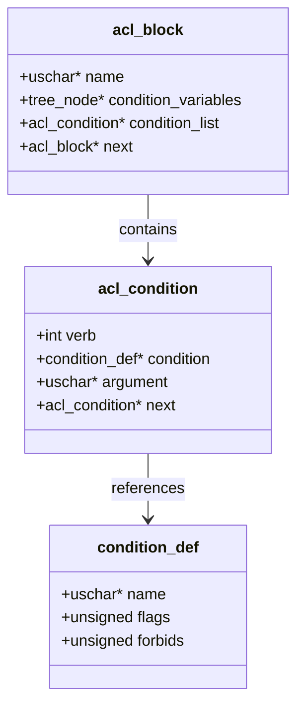

# Access Control Lists (ACLs)

> **Relevant source files**
> * [doc/doc-docbook/spec.xfpt](https://github.com/Exim/exim/blob/29568b25/doc/doc-docbook/spec.xfpt)
> * [doc/doc-txt/ChangeLog](https://github.com/Exim/exim/blob/29568b25/doc/doc-txt/ChangeLog)
> * [doc/doc-txt/NewStuff](https://github.com/Exim/exim/blob/29568b25/doc/doc-txt/NewStuff)
> * [doc/doc-txt/OptionLists.txt](https://github.com/Exim/exim/blob/29568b25/doc/doc-txt/OptionLists.txt)
> * [src/src/acl.c](https://github.com/Exim/exim/blob/29568b25/src/src/acl.c)
> * [src/src/daemon.c](https://github.com/Exim/exim/blob/29568b25/src/src/daemon.c)
> * [src/src/deliver.c](https://github.com/Exim/exim/blob/29568b25/src/src/deliver.c)
> * [src/src/exim.c](https://github.com/Exim/exim/blob/29568b25/src/src/exim.c)
> * [src/src/expand.c](https://github.com/Exim/exim/blob/29568b25/src/src/expand.c)
> * [src/src/functions.h](https://github.com/Exim/exim/blob/29568b25/src/src/functions.h)
> * [src/src/globals.c](https://github.com/Exim/exim/blob/29568b25/src/src/globals.c)
> * [src/src/globals.h](https://github.com/Exim/exim/blob/29568b25/src/src/globals.h)
> * [src/src/readconf.c](https://github.com/Exim/exim/blob/29568b25/src/src/readconf.c)
> * [src/src/receive.c](https://github.com/Exim/exim/blob/29568b25/src/src/receive.c)
> * [src/src/smtp_in.c](https://github.com/Exim/exim/blob/29568b25/src/src/smtp_in.c)
> * [src/src/structs.h](https://github.com/Exim/exim/blob/29568b25/src/src/structs.h)
> * [src/src/transport.c](https://github.com/Exim/exim/blob/29568b25/src/src/transport.c)
> * [src/src/transports/smtp.c](https://github.com/Exim/exim/blob/29568b25/src/src/transports/smtp.c)
> * [src/src/verify.c](https://github.com/Exim/exim/blob/29568b25/src/src/verify.c)
> * [test/scripts/0000-Basic/0002](https://github.com/Exim/exim/blob/29568b25/test/scripts/0000-Basic/0002)
> * [test/stderr/0002](https://github.com/Exim/exim/blob/29568b25/test/stderr/0002)
> * [test/stderr/0092](https://github.com/Exim/exim/blob/29568b25/test/stderr/0092)
> * [test/stderr/0388](https://github.com/Exim/exim/blob/29568b25/test/stderr/0388)
> * [test/stderr/0398](https://github.com/Exim/exim/blob/29568b25/test/stderr/0398)
> * [test/stderr/0402](https://github.com/Exim/exim/blob/29568b25/test/stderr/0402)
> * [test/stderr/0432](https://github.com/Exim/exim/blob/29568b25/test/stderr/0432)
> * [test/stderr/0544](https://github.com/Exim/exim/blob/29568b25/test/stderr/0544)
> * [test/stderr/0620](https://github.com/Exim/exim/blob/29568b25/test/stderr/0620)
> * [test/stderr/0628](https://github.com/Exim/exim/blob/29568b25/test/stderr/0628)
> * [test/stderr/0632](https://github.com/Exim/exim/blob/29568b25/test/stderr/0632)
> * [test/stderr/3000](https://github.com/Exim/exim/blob/29568b25/test/stderr/3000)
> * [test/stderr/5403](https://github.com/Exim/exim/blob/29568b25/test/stderr/5403)
> * [test/stderr/5410](https://github.com/Exim/exim/blob/29568b25/test/stderr/5410)
> * [test/stderr/5420](https://github.com/Exim/exim/blob/29568b25/test/stderr/5420)
> * [test/stderr/5840](https://github.com/Exim/exim/blob/29568b25/test/stderr/5840)
> * [test/stdout/0002](https://github.com/Exim/exim/blob/29568b25/test/stdout/0002)

Access Control Lists (ACLs) are one of the most powerful features in Exim, providing a flexible and comprehensive mechanism to control what mail is accepted, rejected, or processed in special ways at various stages of mail handling. This document covers the fundamental concepts, structure, and usage of ACLs within the Exim mail transfer agent.

For information about specific verification techniques used within ACLs, see [Verification](/Exim/exim/2.5-string-expansion). For information about String Expansion used in ACL expressions, see [String Expansion](/Exim/exim/2.5-string-expansion).

## ACL Fundamentals

ACLs in Exim are ordered lists of statements that are processed sequentially. Each statement consists of a verb (like accept, deny, or require) along with optional conditions and modifiers that determine whether the verb is executed. ACLs are evaluated at specific checkpoints during mail processing, allowing fine-grained control over the mail flow.

The main purpose of ACLs is to control whether Exim accepts or rejects a message (or parts of the processing), and to modify the message or perform additional actions during processing.



Sources:
[src/src/acl.c L332-L368](https://github.com/Exim/exim/blob/29568b25/src/src/acl.c#L332-L368)

[src/src/smtp_in.c L44-L72](https://github.com/Exim/exim/blob/29568b25/src/src/smtp_in.c#L44-L72)

[src/src/readconf.c L44-L72](https://github.com/Exim/exim/blob/29568b25/src/src/readconf.c#L44-L72)

## ACL Configuration

ACLs are defined in the Exim configuration file. Each ACL consists of a named section with a sequence of statements. The main configuration file specifies which ACL should be used at each processing stage.



Sources:
[src/src/readconf.c L44-L72](https://github.com/Exim/exim/blob/29568b25/src/src/readconf.c#L44-L72)

[src/src/globals.c L19-L37](https://github.com/Exim/exim/blob/29568b25/src/src/globals.c#L19-L37)

[src/src/globals.h L1343-L1370](https://github.com/Exim/exim/blob/29568b25/src/src/globals.h#L1343-L1370)

### Main ACL Configuration Options

The following configuration options define which ACL to use at each processing stage:

| ACL Configuration Option | Processing Stage | Description |
| --- | --- | --- |
| `acl_smtp_connect` | Connection establishment | Controls whether to accept the connection |
| `acl_smtp_helo` | HELO/EHLO command | Validates the HELO/EHLO parameter |
| `acl_smtp_mail` | MAIL FROM command | Validates the sender address |
| `acl_smtp_rcpt` | RCPT TO command | Validates the recipient address |
| `acl_smtp_predata` | Before DATA command | Last check before accepting message data |
| `acl_smtp_data` | After DATA command | After message data is received |
| `acl_not_smtp` | Non-SMTP message | For locally submitted messages |
| `acl_not_smtp_start` | Non-SMTP start | At the start of non-SMTP message processing |

Sources:
[src/src/readconf.c L44-L72](https://github.com/Exim/exim/blob/29568b25/src/src/readconf.c#L44-L72)

[doc/doc-txt/OptionLists.txt L1-L24](https://github.com/Exim/exim/blob/29568b25/doc/doc-txt/OptionLists.txt#L1-L24)

## ACL Structure and Processing

Each ACL is processed as a series of statements. Each statement consists of a verb followed by zero or more conditions. If all the conditions are met, the verb is executed, and its action determines what happens next.

### ACL Verbs

ACL verbs determine the action Exim takes when all conditions in a statement are met:

| Verb | Action |
| --- | --- |
| `accept` | Accept the mail operation and stop processing the ACL |
| `defer` | Temporarily reject with a 4xx code |
| `deny` | Reject with a 5xx code |
| `discard` | Accept the operation but silently discard the message |
| `drop` | Reject by dropping the connection |
| `require` | Stop with a rejection unless the conditions are met |
| `warn` | Perform actions like logging but continue processing |

Sources:
[src/src/acl.c L28-L40](https://github.com/Exim/exim/blob/29568b25/src/src/acl.c#L28-L40)

[src/src/acl.c L33-L56](https://github.com/Exim/exim/blob/29568b25/src/src/acl.c#L33-L56)

### ACL Processing Flow



Sources:
[src/src/acl.c L100-L422](https://github.com/Exim/exim/blob/29568b25/src/src/acl.c#L100-L422)

### ACL Statement Format

Each ACL statement follows this structure in the configuration file:

```
verb [conditions] [modifiers]
```

For example:

```
deny   hosts = black.list.example
       message = Access denied for $sender_host_address

accept domains = +local_domains
       endpass
       verify = recipient
```

Sources:
[src/src/acl.c L148-L171](https://github.com/Exim/exim/blob/29568b25/src/src/acl.c#L148-L171)

## ACL Conditions and Modifiers

ACL conditions test various aspects of the mail transaction, and modifiers provide additional actions or parameters.

### Common ACL Conditions

| Condition | Description |
| --- | --- |
| `hosts` | Match against the sending host |
| `senders` | Match against the sender address |
| `recipients` | Match against the recipient address |
| `domains` | Match against a domain list |
| `authenticated` | Requires successful authentication |
| `condition` | Generic condition using string expansion |
| `verify` | Various verification checks |
| `dnslists` | Check IP address against DNS blacklists |

Sources:
[src/src/acl.c L148-L214](https://github.com/Exim/exim/blob/29568b25/src/src/acl.c#L148-L214)

### ACL Modifiers

| Modifier | Description |
| --- | --- |
| `message` | Custom rejection message |
| `log_message` | Message to log |
| `add_header` | Add a header to the message |
| `remove_header` | Remove a header from the message |
| `set` | Set a variable |
| `delay` | Introduce a delay in processing |
| `endpass` | Change "require" to "accept" if passed |

Sources:
[src/src/acl.c L153-L184](https://github.com/Exim/exim/blob/29568b25/src/src/acl.c#L153-L184)

[src/src/acl.c L92-L133](https://github.com/Exim/exim/blob/29568b25/src/src/acl.c#L92-L133)

## ACL Invocation Points in Detail

### Connection ACL

The `acl_smtp_connect` ACL runs when a connection is established. It can be used to implement connection-level access control based on IP address, time of day, connection count, etc.



Sources:
[src/src/smtp_in.c L2500-L2550](https://github.com/Exim/exim/blob/29568b25/src/src/smtp_in.c#L2500-L2550)

### HELO/EHLO ACL

The `acl_smtp_helo` ACL runs after the HELO/EHLO command and can verify the hostname provided.

### Mail From ACL

The `acl_smtp_mail` ACL processes the sender address after the MAIL FROM command.

### Recipient ACL

The `acl_smtp_rcpt` ACL is one of the most commonly used ACLs, processing each recipient after the RCPT TO command.

### DATA ACLs

The `acl_smtp_predata` ACL runs before accepting the DATA command, while `acl_smtp_data` runs after receiving the complete message.



Sources:
[src/src/smtp_in.c L45-L72](https://github.com/Exim/exim/blob/29568b25/src/src/smtp_in.c#L45-L72)

[src/src/smtp_in.c L150-L400](https://github.com/Exim/exim/blob/29568b25/src/src/smtp_in.c#L150-L400)

[src/src/deliver.c L130-L250](https://github.com/Exim/exim/blob/29568b25/src/src/deliver.c#L130-L250)

## Implementation Details

The ACL system in Exim is implemented through several key components:

1. **ACL Definition** - The parser in `readconf.c` reads ACL definitions from the configuration file.
2. **ACL Storage** - Each ACL is stored as a linked list of statements in memory.
3. **ACL Evaluation** - The `acl_check()` function in `acl.c` processes the ACL statements.
4. **Condition Testing** - Various condition functions test specific aspects of the mail transaction.
5. **Action Execution** - When conditions are met, the corresponding verb action is executed.

The ACL engine is deeply integrated with Exim's SMTP processing logic, with hook points at key stages of the SMTP transaction.

### ACL Storage Structure



Sources:
[src/src/acl.c L92-L214](https://github.com/Exim/exim/blob/29568b25/src/src/acl.c#L92-L214)

[src/src/structs.h L1-L50](https://github.com/Exim/exim/blob/29568b25/src/src/structs.h#L1-L50)

## Best Practices for ACL Use

1. **Order Matters** - ACLs are processed sequentially, so order your statements from most specific to most general.
2. **Use Appropriate ACLs** - Select the right ACL checkpoint for the specific test you want to perform.
3. **Early Rejection** - Reject unwanted mail as early as possible in the SMTP conversation.
4. **Log Messages** - Use `log_message` to maintain good records of why mail was accepted or rejected.
5. **Default Deny** - Consider a "default deny" approach, explicitly accepting only mail that meets your criteria.
6. **Test Thoroughly** - Use Exim's `-bh` option to test your ACLs before deploying them.

Sources:
[src/src/acl.c L100-L150](https://github.com/Exim/exim/blob/29568b25/src/src/acl.c#L100-L150)

[doc/doc-docbook/spec.xfpt L360-L400](https://github.com/Exim/exim/blob/29568b25/doc/doc-docbook/spec.xfpt#L360-L400)

## Conclusion

Access Control Lists are a central feature of Exim's mail processing architecture, providing fine-grained control over mail acceptance and rejection. By defining rules at various processing stages, administrators can implement complex mail policies to secure their mail servers while maintaining flexibility for legitimate usage.

Understanding ACL structure, flow, and invocation points is essential for effective Exim configuration and mail server administration.