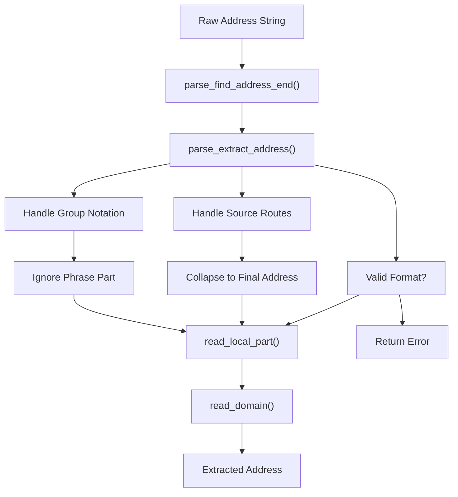
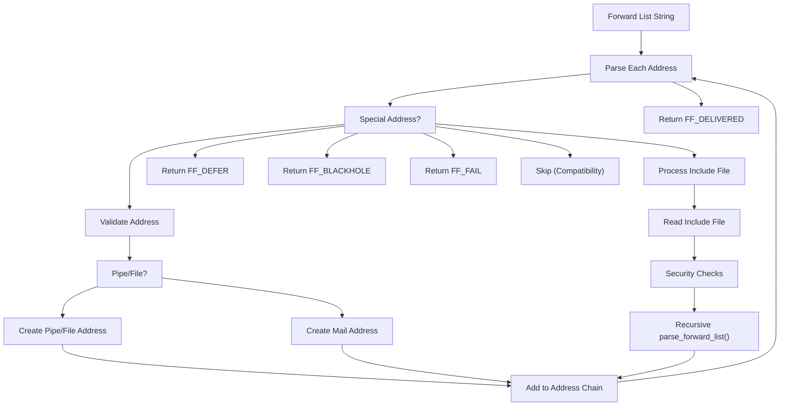
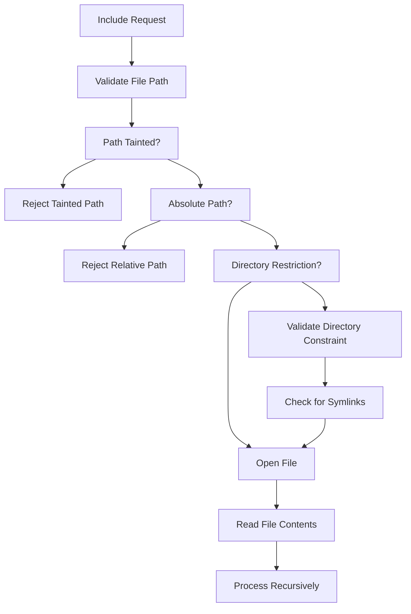
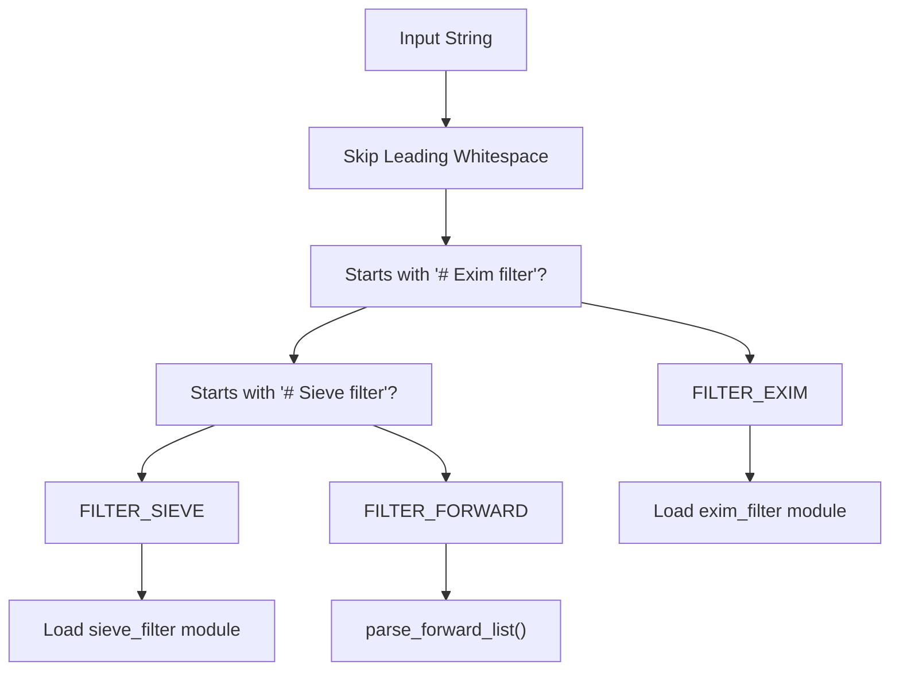
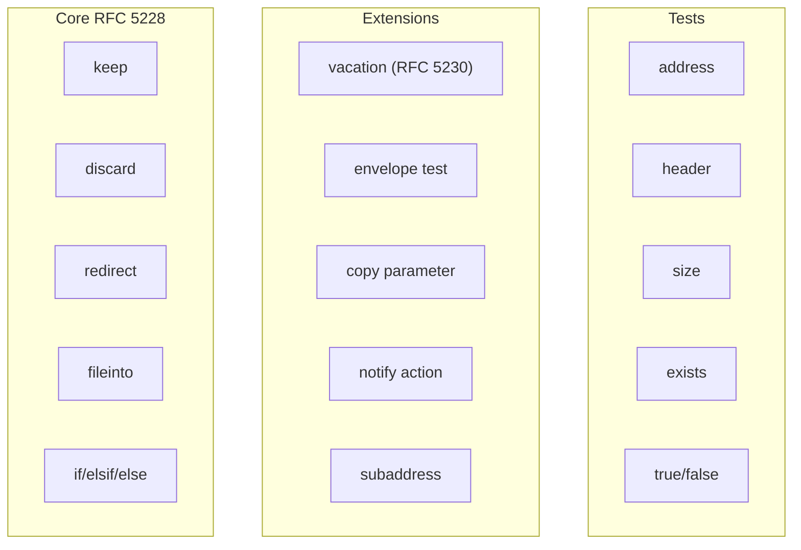
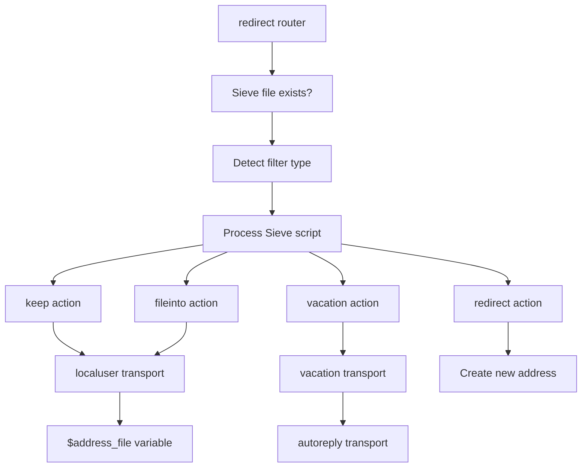
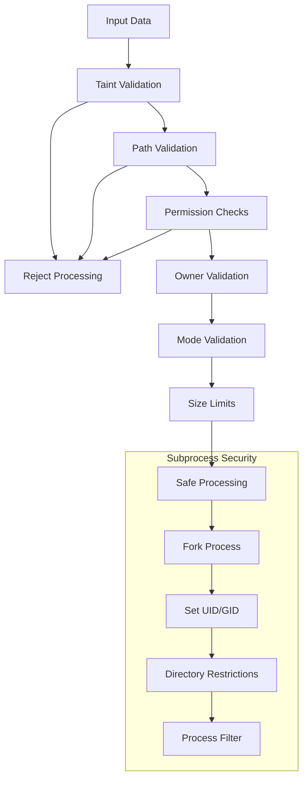
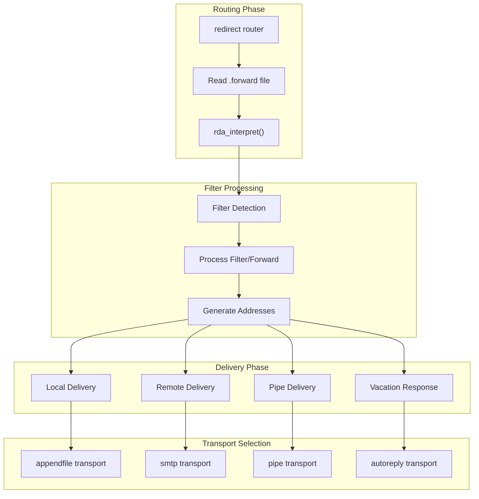

# Address Parsing and Filtering

> **Relevant source files**
> * [doc/doc-txt/README.SIEVE](https://github.com/Exim/exim/blob/29568b25/doc/doc-txt/README.SIEVE)
> * [src/src/parse.c](https://github.com/Exim/exim/blob/29568b25/src/src/parse.c)
> * [src/src/rda.c](https://github.com/Exim/exim/blob/29568b25/src/src/rda.c)

This document covers Exim's address parsing infrastructure and filtering mechanisms, including RFC 822/2822 address extraction, forward file processing, and filter interpretation. For information about string expansion used within filters, see [String Expansion](/Exim/exim/2.5-string-expansion). For details on routing decisions that use parsed addresses, see [Routing System](/Exim/exim/2.2-routing-system).

## Core Address Parsing

Exim's address parsing functionality is primarily implemented in `parse.c`, providing RFC 822/2822 compliant address extraction and validation. The parsing system handles complex address formats including source routing, group notation, and quoted strings.

### Address Extraction Pipeline



**Sources:** [src/src/parse.c L634-L850](https://github.com/Exim/exim/blob/29568b25/src/src/parse.c#L634-L850)

The `parse_extract_address()` function serves as the main entry point for address extraction, handling various RFC 822 constructs:

| Component | Function | Purpose |
| --- | --- | --- |
| **Address End Detection** | `parse_find_address_end()` | Locates comma or string termination |
| **Domain Parsing** | `read_domain()` | Extracts domain with UTF-8 support |
| **Local Part Parsing** | `read_local_part()` | Handles quoted strings and atoms |
| **Route Processing** | `read_route()` | Processes source routes (ignored) |
| **Comment Handling** | `skip_comment()` | Strips RFC 822 comments |

**Sources:** [src/src/parse.c L71-L133](https://github.com/Exim/exim/blob/29568b25/src/src/parse.c#L71-L133)

 [src/src/parse.c L247-L396](https://github.com/Exim/exim/blob/29568b25/src/src/parse.c#L247-L396)

 [src/src/parse.c L425-L491](https://github.com/Exim/exim/blob/29568b25/src/src/parse.c#L425-L491)

### Address Format Support

Exim's parser handles multiple address formats while maintaining strict RFC compliance:

```

```

**Sources:** [src/src/parse.c L645-L697](https://github.com/Exim/exim/blob/29568b25/src/src/parse.c#L645-L697)

 [src/src/parse.c L709-L770](https://github.com/Exim/exim/blob/29568b25/src/src/parse.c#L709-L770)

## Forward List Processing

The `parse_forward_list()` function processes alias files and `.forward` files, extracting multiple addresses and handling special directives.

### Forward List Pipeline



**Sources:** [src/src/parse.c L1248-L1707](https://github.com/Exim/exim/blob/29568b25/src/src/parse.c#L1248-L1707)

### Special Address Handling

| Special Address | Action | Purpose |
| --- | --- | --- |
| **`:defer:`** | Temporary failure | Defer delivery with message |
| **`:blackhole:`** | Discard silently | Delete message without trace |
| **`:fail:`** | Permanent failure | Reject with error message |
| **`:include:path`** | Include file | Process addresses from file |
| **`:unknown:`** | Skip | Backward compatibility |

**Sources:** [src/src/parse.c L1342-L1369](https://github.com/Exim/exim/blob/29568b25/src/src/parse.c#L1342-L1369)

### Include File Security

Include file processing implements strict security controls:



**Sources:** [src/src/parse.c L1376-L1574](https://github.com/Exim/exim/blob/29568b25/src/src/parse.c#L1376-L1574)

## Filter Detection and Types

The `rda.c` module provides filter detection and routing between different filter types. The `rda_is_filter()` function determines the filter type based on the first line.

### Filter Type Detection



**Sources:** [src/src/rda.c L43-L68](https://github.com/Exim/exim/blob/29568b25/src/src/rda.c#L43-L68)

### Filter Processing Architecture

| Filter Type | Module | Handler | Purpose |
| --- | --- | --- | --- |
| **FILTER_EXIM** | `exim_filter` | `EXIM_INTERPRET` | Native Exim filtering |
| **FILTER_SIEVE** | `sieve_filter` | `SIEVE_INTERPRET` | RFC 5228 Sieve filtering |
| **FILTER_FORWARD** | Built-in | `parse_forward_list()` | Traditional forward files |

**Sources:** [src/src/rda.c L384-L424](https://github.com/Exim/exim/blob/29568b25/src/src/rda.c#L384-L424)

## Sieve Filter Implementation

Exim implements RFC 5228 Sieve filtering with several extensions. The Sieve implementation is modular and supports standard Sieve commands plus Exim-specific extensions.

### Sieve Feature Support



**Sources:** [doc/doc-txt/README.SIEVE L21-L27](https://github.com/Exim/exim/blob/29568b25/doc/doc-txt/README.SIEVE#L21-L27)

### Sieve Configuration Integration

The Sieve filter integrates with Exim's routing system through specific router and transport configurations:



**Sources:** [doc/doc-txt/README.SIEVE L36-L87](https://github.com/Exim/exim/blob/29568b25/doc/doc-txt/README.SIEVE#L36-L87)

## Security and Validation

Address parsing and filtering include multiple security layers to prevent abuse and maintain system integrity.

### Security Control Points



**Sources:** [src/src/rda.c L183-L189](https://github.com/Exim/exim/blob/29568b25/src/src/rda.c#L183-L189)

 [src/src/rda.c L246-L284](https://github.com/Exim/exim/blob/29568b25/src/src/rda.c#L246-L284)

 [src/src/parse.c L1417-L1423](https://github.com/Exim/exim/blob/29568b25/src/src/parse.c#L1417-L1423)

### File Access Controls

| Control | Implementation | Purpose |
| --- | --- | --- |
| **Taint Checking** | `is_tainted()` validation | Prevent attacker-controlled paths |
| **Owner Validation** | UID/GID verification | Ensure proper file ownership |
| **Mode Checking** | Permission bit validation | Prevent world-writable files |
| **Size Limits** | `MAX_FILTER_SIZE` enforcement | Prevent resource exhaustion |
| **Symlink Prevention** | Path component checking | Avoid directory traversal |

**Sources:** [src/src/rda.c L256-L274](https://github.com/Exim/exim/blob/29568b25/src/src/rda.c#L256-L274)

 [src/src/parse.c L1442-L1508](https://github.com/Exim/exim/blob/29568b25/src/src/parse.c#L1442-L1508)

## Integration with Mail Processing

The address parsing and filtering system integrates with Exim's core mail processing pipeline through the routing system and transport mechanisms.

### Processing Flow Integration



**Sources:** [src/src/rda.c L554-L603](https://github.com/Exim/exim/blob/29568b25/src/src/rda.c#L554-L603)

 [src/src/rda.c L654-L777](https://github.com/Exim/exim/blob/29568b25/src/src/rda.c#L654-L777)

The system maintains strict separation between privileged parsing operations and user-controlled filter execution through subprocess isolation and capability dropping.

**Sources:** [src/src/rda.c L625-L650](https://github.com/Exim/exim/blob/29568b25/src/src/rda.c#L625-L650)

 [src/src/rda.c L792-L985](https://github.com/Exim/exim/blob/29568b25/src/src/rda.c#L792-L985)