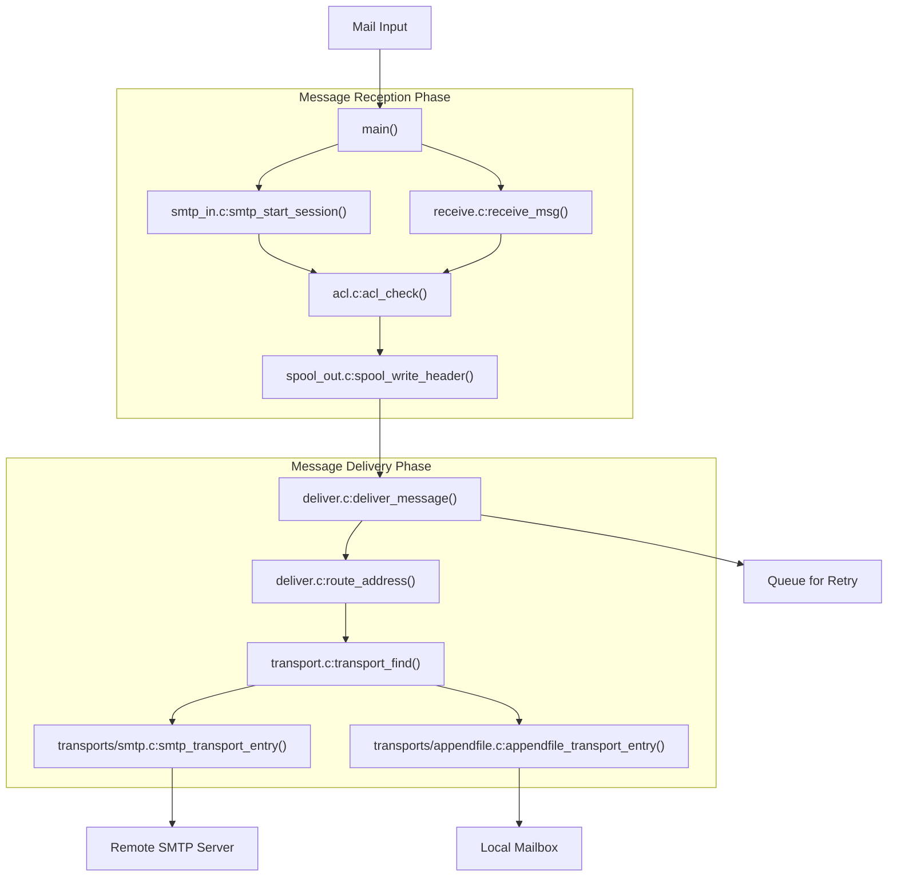
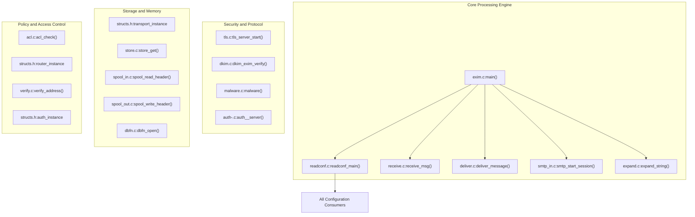
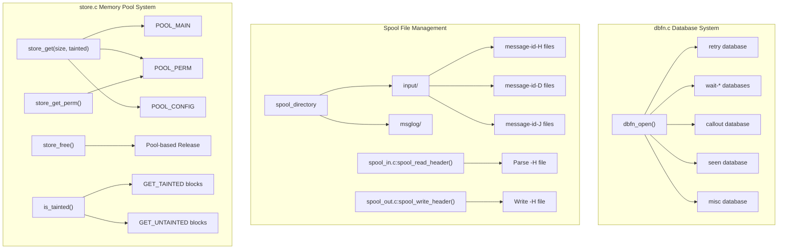
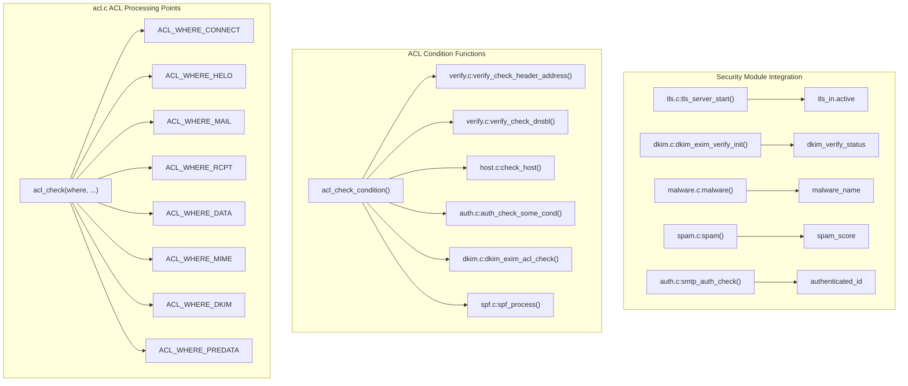
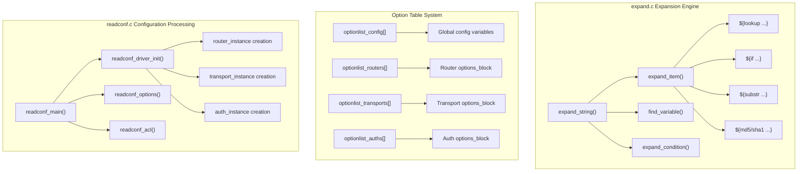

# Architecture Overview

> **Relevant source files**
> * [doc/doc-docbook/spec.xfpt](https://github.com/Exim/exim/blob/29568b25/doc/doc-docbook/spec.xfpt)
> * [doc/doc-txt/ChangeLog](https://github.com/Exim/exim/blob/29568b25/doc/doc-txt/ChangeLog)
> * [doc/doc-txt/NewStuff](https://github.com/Exim/exim/blob/29568b25/doc/doc-txt/NewStuff)
> * [doc/doc-txt/OptionLists.txt](https://github.com/Exim/exim/blob/29568b25/doc/doc-txt/OptionLists.txt)
> * [src/src/acl.c](https://github.com/Exim/exim/blob/29568b25/src/src/acl.c)
> * [src/src/daemon.c](https://github.com/Exim/exim/blob/29568b25/src/src/daemon.c)
> * [src/src/deliver.c](https://github.com/Exim/exim/blob/29568b25/src/src/deliver.c)
> * [src/src/exim.c](https://github.com/Exim/exim/blob/29568b25/src/src/exim.c)
> * [src/src/expand.c](https://github.com/Exim/exim/blob/29568b25/src/src/expand.c)
> * [src/src/functions.h](https://github.com/Exim/exim/blob/29568b25/src/src/functions.h)
> * [src/src/globals.c](https://github.com/Exim/exim/blob/29568b25/src/src/globals.c)
> * [src/src/globals.h](https://github.com/Exim/exim/blob/29568b25/src/src/globals.h)
> * [src/src/macros.h](https://github.com/Exim/exim/blob/29568b25/src/src/macros.h)
> * [src/src/readconf.c](https://github.com/Exim/exim/blob/29568b25/src/src/readconf.c)
> * [src/src/receive.c](https://github.com/Exim/exim/blob/29568b25/src/src/receive.c)
> * [src/src/smtp_in.c](https://github.com/Exim/exim/blob/29568b25/src/src/smtp_in.c)
> * [src/src/structs.h](https://github.com/Exim/exim/blob/29568b25/src/src/structs.h)
> * [src/src/transport.c](https://github.com/Exim/exim/blob/29568b25/src/src/transport.c)
> * [src/src/transports/smtp.c](https://github.com/Exim/exim/blob/29568b25/src/src/transports/smtp.c)
> * [src/src/verify.c](https://github.com/Exim/exim/blob/29568b25/src/src/verify.c)

This page provides a high-level view of Exim mail transfer agent's architecture, explaining its major subsystems and how they interact. For detailed information about specific subsystems, see their respective documentation pages. For practical configuration information, see [Runtime Configuration](/Exim/exim/4.2-runtime-configuration).

## Core Architecture

Exim implements a modular mail transfer agent with clear separation between message reception and delivery phases. The architecture centers around the `main()` function in `exim.c` which orchestrates all mail processing operations.

### Mail Processing Architecture

Sources: [src/src/exim.c L5545-L5600](https://github.com/Exim/exim/blob/29568b25/src/src/exim.c#L5545-L5600)

 [src/src/smtp_in.c L5000-L5100](https://github.com/Exim/exim/blob/29568b25/src/src/smtp_in.c#L5000-L5100)

 [src/src/deliver.c L7200-L7300](https://github.com/Exim/exim/blob/29568b25/src/src/deliver.c#L7200-L7300)

 [src/src/receive.c L3800-L3900](https://github.com/Exim/exim/blob/29568b25/src/src/receive.c#L3800-L3900)

The architecture implements a two-phase design:

1. **Message Reception Phase**: `smtp_start_session()` or `receive_msg()` handle incoming messages, `acl_check()` validates them through policy rules, and `spool_write_header()` persists them to disk
2. **Message Delivery Phase**: `deliver_message()` processes queued messages by calling `route_address()` and executing appropriate transport via `smtp_transport_entry()` or other transport entry points

## Key Components and Subsystems

### Core Component Relationships

Sources: [src/src/exim.c L5545-L5600](https://github.com/Exim/exim/blob/29568b25/src/src/exim.c#L5545-L5600)

 [src/src/structs.h L800-L900](https://github.com/Exim/exim/blob/29568b25/src/src/structs.h#L800-L900)

 [src/src/globals.h L500-L600](https://github.com/Exim/exim/blob/29568b25/src/src/globals.h#L500-L600)

 [src/src/functions.h L100-L200](https://github.com/Exim/exim/blob/29568b25/src/src/functions.h#L100-L200)

### Key Data Structures and Processing Flow

```mermaid
flowchart TD

MainLoop["exim.c:main()"]
ReceiveLoop["receive.c:receive_msg()"]
ACLCheckConn["acl.c:acl_check(ACL_WHERE_CONNECT)"]
ACLCheckMail["acl.c:acl_check(ACL_WHERE_MAIL)"]
ACLCheckRcpt["acl.c:acl_check(ACL_WHERE_RCPT)"]
ACLCheckData["acl.c:acl_check(ACL_WHERE_DATA)"]
SpoolWrite["spool_out.c:spool_write_header()"]
DeliverStart["deliver.c:deliver_message()"]
DeliverSplit["deliver.c:deliver_split_address()"]
RouteAddr["deliver.c:route_address()"]
FindTransport["deliver.c:deliver_local()"]
TransportEntry["(*transport->drinst.driver_info->code)()"]
AddressItem["address_item"]
NextAddr["next"]
Domain["domain"]
LocalPart["local_part"]
RouterPtr["router"]
TransportPtr["transport"]
RouterInst["router_instance"]
DriverName["drinst.driver_name"]
Options["drinst.options_block"]
TransportInst["transport_instance"]
TransportDriver["drinst.driver_name"]
TransportOptions["drinst.options_block"]

subgraph ProcessingFlow ["Function Call Flow"]
    MainLoop
    ReceiveLoop
    ACLCheckConn
    ACLCheckMail
    ACLCheckRcpt
    ACLCheckData
    SpoolWrite
    DeliverStart
    DeliverSplit
    RouteAddr
    FindTransport
    TransportEntry
    MainLoop --> ReceiveLoop
    ReceiveLoop --> ACLCheckConn
    ACLCheckConn --> ACLCheckMail
    ACLCheckMail --> ACLCheckRcpt
    ACLCheckRcpt --> ACLCheckData
    ACLCheckData --> SpoolWrite
    SpoolWrite --> DeliverStart
    DeliverStart --> DeliverSplit
    DeliverSplit --> RouteAddr
    RouteAddr --> FindTransport
    FindTransport --> TransportEntry
end

subgraph DataStructures ["Core Data Structures"]
    AddressItem
    NextAddr
    Domain
    LocalPart
    RouterPtr
    TransportPtr
    RouterInst
    DriverName
    Options
    TransportInst
    TransportDriver
    TransportOptions
    AddressItem --> NextAddr
    AddressItem --> Domain
    AddressItem --> LocalPart
    AddressItem --> RouterPtr
    AddressItem --> TransportPtr
    RouterInst --> DriverName
    RouterInst --> Options
    TransportInst --> TransportDriver
    TransportInst --> TransportOptions
end
```

Sources: [src/src/structs.h L200-L400](https://github.com/Exim/exim/blob/29568b25/src/src/structs.h#L200-L400)

 [src/src/deliver.c L7200-L7400](https://github.com/Exim/exim/blob/29568b25/src/src/deliver.c#L7200-L7400)

 [src/src/receive.c L3800-L4000](https://github.com/Exim/exim/blob/29568b25/src/src/receive.c#L3800-L4000)

 [src/src/acl.c L3800-L4000](https://github.com/Exim/exim/blob/29568b25/src/src/acl.c#L3800-L4000)

The processing flow operates on key data structures:

1. **`address_item`**: Core structure representing each recipient, containing routing state and delivery information
2. **`router_instance`**: Configuration and function pointers for address routing logic
3. **`transport_instance`**: Configuration and function pointers for message delivery mechanisms
4. **ACL Processing**: Multiple `acl_check()` calls at different `ACL_WHERE_*` checkpoints validate policy compliance

## Memory Management and Storage Architecture

Sources: [src/src/store.c L200-L300](https://github.com/Exim/exim/blob/29568b25/src/src/store.c#L200-L300)

 [src/src/spool_in.c L100-L200](https://github.com/Exim/exim/blob/29568b25/src/src/spool_in.c#L100-L200)

 [src/src/spool_out.c L100-L200](https://github.com/Exim/exim/blob/29568b25/src/src/spool_out.c#L100-L200)

 [src/src/dbfn.c L200-L300](https://github.com/Exim/exim/blob/29568b25/src/src/dbfn.c#L200-L300)

The memory and storage architecture implements:

* **Pool-based allocation**: `store_get()` with `POOL_MAIN`, `POOL_PERM`, and `POOL_CONFIG` for different lifetimes
* **Taint tracking**: `GET_TAINTED`/`GET_UNTAINTED` flags prevent unsafe data usage
* **Spool file format**: Message header (`-H`), data (`-D`), and journal (`-J`) files managed by `spool_in.c`/`spool_out.c`
* **Hints databases**: Berkeley DB or similar storage via `dbfn_open()` for retry, wait, and callout information

## Router and Transport Implementation

```mermaid
flowchart TD

AddrItem["address_item"]
RouterPtr["router*"]
TransportPtr["transport*"]
HostList["host_item* host_list"]
PropVars["prop.variables"]
RouteAddr["deliver.c:route_address()"]
RouterCall["(*router->drinst.driver_info->code)()"]
SetTransport["addr->transport = ..."]
TransportCall["(*transport->drinst.driver_info->code)()"]
TransportInst["transport_instance"]
TransportInfo["drinst.driver_info"]
SMTPEntry["smtp.c:smtp_transport_entry()"]
AppendfileEntry["appendfile.c:appendfile_transport_entry()"]
PipeEntry["pipe.c:pipe_transport_entry()"]
AutoreplyEntry["autoreply.c:autoreply_transport_entry()"]
LMTPEntry["lmtp.c:lmtp_transport_entry()"]
RouterInst["router_instance"]
DriverInfo["drinst.driver_info"]
DNSLookup["dnslookup.c:dnslookup_router_entry()"]
ManualRoute["manualroute.c:manualroute_router_entry()"]
Redirect["redirect.c:redirect_router_entry()"]
Accept["accept.c:accept_router_entry()"]
QueryProgram["queryprogram.c:queryprogram_router_entry()"]

subgraph AddressProcessing ["Address Processing Chain"]
    AddrItem
    RouterPtr
    TransportPtr
    HostList
    PropVars
    RouteAddr
    RouterCall
    SetTransport
    TransportCall
    AddrItem --> RouterPtr
    AddrItem --> TransportPtr
    AddrItem --> HostList
    AddrItem --> PropVars
    RouteAddr --> RouterCall
    RouterCall --> SetTransport
    SetTransport --> TransportCall
end

subgraph TransportDrivers ["Transport Driver Implementation"]
    TransportInst
    TransportInfo
    SMTPEntry
    AppendfileEntry
    PipeEntry
    AutoreplyEntry
    LMTPEntry
    TransportInst --> TransportInfo
    TransportInfo --> SMTPEntry
    TransportInfo --> AppendfileEntry
    TransportInfo --> PipeEntry
    TransportInfo --> AutoreplyEntry
    TransportInfo --> LMTPEntry
end

subgraph RouterDrivers ["Router Driver Implementation"]
    RouterInst
    DriverInfo
    DNSLookup
    ManualRoute
    Redirect
    Accept
    QueryProgram
    RouterInst --> DriverInfo
    DriverInfo --> DNSLookup
    DriverInfo --> ManualRoute
    DriverInfo --> Redirect
    DriverInfo --> Accept
    DriverInfo --> QueryProgram
end
```

Sources: [src/src/routers/dnslookup.c L500-L600](https://github.com/Exim/exim/blob/29568b25/src/src/routers/dnslookup.c#L500-L600)

 [src/src/transports/smtp.c L160-L200](https://github.com/Exim/exim/blob/29568b25/src/src/transports/smtp.c#L160-L200)

 [src/src/deliver.c L5000-L5100](https://github.com/Exim/exim/blob/29568b25/src/src/deliver.c#L5000-L5100)

 [src/src/structs.h L800-L1000](https://github.com/Exim/exim/blob/29568b25/src/src/structs.h#L800-L1000)

Key implementation details:

* **Router drivers**: Each implements `*_router_entry()` function called via function pointer in `driver_info->code`
* **Transport drivers**: Each implements `*_transport_entry()` function with standardized signature
* **Address chain processing**: `route_address()` iterates through `address_item` linked list, calling router entry points
* **State tracking**: Router results stored in `address_item` fields like `transport*`, `host_list*`, and routing properties

## ACL Processing and Security Implementation

Sources: [src/src/acl.c L3800-L4000](https://github.com/Exim/exim/blob/29568b25/src/src/acl.c#L3800-L4000)

 [src/src/verify.c L1000-L1200](https://github.com/Exim/exim/blob/29568b25/src/src/verify.c#L1000-L1200)

 [src/src/smtp_in.c L4000-L4200](https://github.com/Exim/exim/blob/29568b25/src/src/smtp_in.c#L4000-L4200)

 [src/src/dkim.c L800-L900](https://github.com/Exim/exim/blob/29568b25/src/src/dkim.c#L800-L900)

The ACL security framework operates through:

* **Multi-phase checking**: `acl_check()` called at defined `ACL_WHERE_*` points during SMTP session
* **Condition evaluation**: `acl_check_condition()` dispatches to specialized verification functions
* **Security module integration**: TLS, DKIM, malware, and authentication modules set global variables consumed by ACL conditions
* **Policy enforcement**: ACL verbs (accept, deny, defer, discard, drop) control message flow based on condition results

## Configuration System Architecture

Sources: [src/src/readconf.c L600-L800](https://github.com/Exim/exim/blob/29568b25/src/src/readconf.c#L600-L800)

 [src/src/globals.c L100-L300](https://github.com/Exim/exim/blob/29568b25/src/src/globals.c#L100-L300)

 [src/src/expand.c L2000-L2200](https://github.com/Exim/exim/blob/29568b25/src/src/expand.c#L2000-L2200)

 [src/src/expand.c L5000-L5200](https://github.com/Exim/exim/blob/29568b25/src/src/expand.c#L5000-L5200)

Configuration architecture features:

* **Structured parsing**: `readconf_main()` processes main config, creates driver instances via `readconf_driver_init()`
* **Option tables**: Static `optionlist_*[]` arrays map configuration keywords to data structure offsets and types
* **Dynamic expansion**: `expand_string()` provides runtime evaluation of `${...}` expressions in most configuration values
* **Extensible lookups**: Pluggable lookup modules enable database integration via `${lookup}` expansion items

## String Expansion Implementation Details

```mermaid
flowchart TD

ExpandString["expand_string(string)"]
ExpandStringInternal["expand_string_internal()"]
FindVariable["find_variable()"]
ExpandItem["expand_item()"]
ExpandCondition["expand_condition()"]
VarTable["var_table[]"]
MessageVars["message_id, sender_address, ..."]
SystemVars["exim_uid, primary_hostname, ..."]
ACLVars["acl_c*, acl_m* variables"]
ItemTable["item_table[]"]
EItemACL["EITEM_ACL"]
EItemLookup["EITEM_LOOKUP"]
EItemIf["EITEM_IF"]
EItemExtract["EITEM_EXTRACT"]
EItemHash["EITEM_HASH"]
EItemSubstr["EITEM_SUBSTR"]
CondTable["cond_table[]"]
ECondMatch["ECOND_MATCH"]
ECondExists["ECOND_EXISTS"]
ECondEq["ECOND_STR_EQ"]
ECondInlist["ECOND_INLIST"]
ECondDef["ECOND_DEF"]

ExpandItem --> ItemTable
ExpandCondition --> CondTable

subgraph ConditionHandlers ["Condition Processing"]
    CondTable
    ECondMatch
    ECondExists
    ECondEq
    ECondInlist
    ECondDef
    CondTable --> ECondMatch
    CondTable --> ECondExists
    CondTable --> ECondEq
    CondTable --> ECondInlist
    CondTable --> ECondDef
end

subgraph ExpansionItems ["Expansion Item Handlers"]
    ItemTable
    EItemACL
    EItemLookup
    EItemIf
    EItemExtract
    EItemHash
    EItemSubstr
    ItemTable --> EItemACL
    ItemTable --> EItemLookup
    ItemTable --> EItemIf
    ItemTable --> EItemExtract
    ItemTable --> EItemHash
    ItemTable --> EItemSubstr
end

subgraph ExpansionCore ["expand.c Core Functions"]
    ExpandString
    ExpandStringInternal
    FindVariable
    ExpandItem
    ExpandCondition
    VarTable
    MessageVars
    SystemVars
    ACLVars
    ExpandString --> ExpandStringInternal
    ExpandStringInternal --> FindVariable
    ExpandStringInternal --> ExpandItem
    ExpandStringInternal --> ExpandCondition
    FindVariable --> VarTable
    VarTable --> MessageVars
    VarTable --> SystemVars
    VarTable --> ACLVars
end
```

Sources: [src/src/expand.c L100-L200](https://github.com/Exim/exim/blob/29568b25/src/src/expand.c#L100-L200)

 [src/src/expand.c L440-L480](https://github.com/Exim/exim/blob/29568b25/src/src/expand.c#L440-L480)

 [src/src/expand.c L2000-L2100](https://github.com/Exim/exim/blob/29568b25/src/src/expand.c#L2000-L2100)

 [src/src/expand.c L3700-L3800](https://github.com/Exim/exim/blob/29568b25/src/src/expand.c#L3700-L3800)

The expansion system implements:

* **Variable lookup**: `find_variable()` searches `var_table[]` for `$variable` references, returning current values
* **Item processing**: `expand_item()` dispatches `${item:...}` expressions to handlers in `item_table[]`
* **Condition evaluation**: `expand_condition()` processes `${if condition:true:false}` using `cond_table[]` handlers
* **Recursive parsing**: `expand_string_internal()` handles nested expansions and maintains expansion state

## Conclusion

Exim's architecture is designed for flexibility, security, and reliability in mail handling. The modular design with clearly defined interfaces between components allows for extensive customization while maintaining a stable core. The two-phase mail processing approach (receive, then deliver) ensures resilience against system failures.

The primary strengths of the architecture include:

1. **Modular Design**: Components can be modified independently
2. **Extensive ACL System**: Fine-grained control over message processing
3. **Powerful Configuration**: Highly customizable behavior without code changes
4. **String Expansion**: Enables complex logic in configuration
5. **Memory Management**: Efficient handling of resources with security features

For more detailed information on specific subsystems, refer to their dedicated wiki pages.

Sources: [src/src/exim.c](https://github.com/Exim/exim/blob/29568b25/src/src/exim.c)

 [src/src/globals.h](https://github.com/Exim/exim/blob/29568b25/src/src/globals.h)

 [src/src/structs.h](https://github.com/Exim/exim/blob/29568b25/src/src/structs.h)