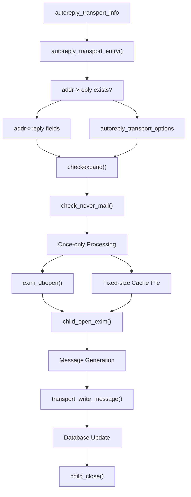
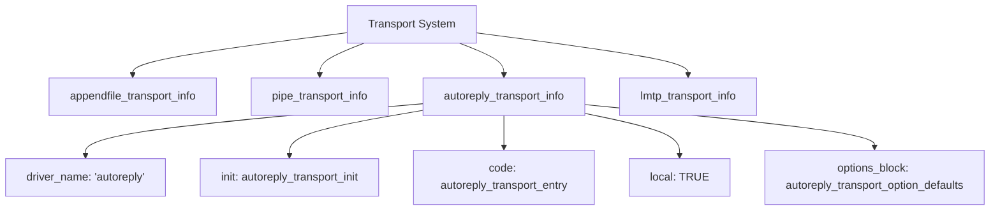
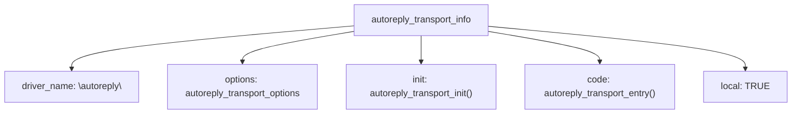
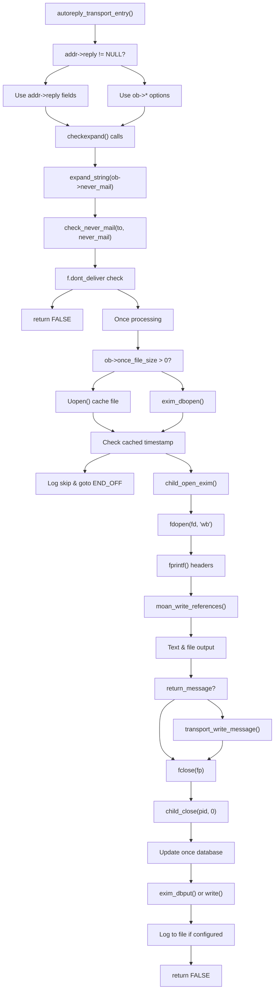
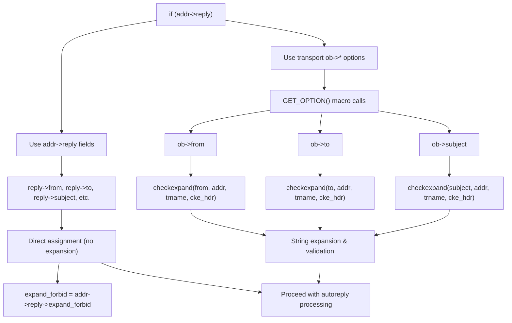
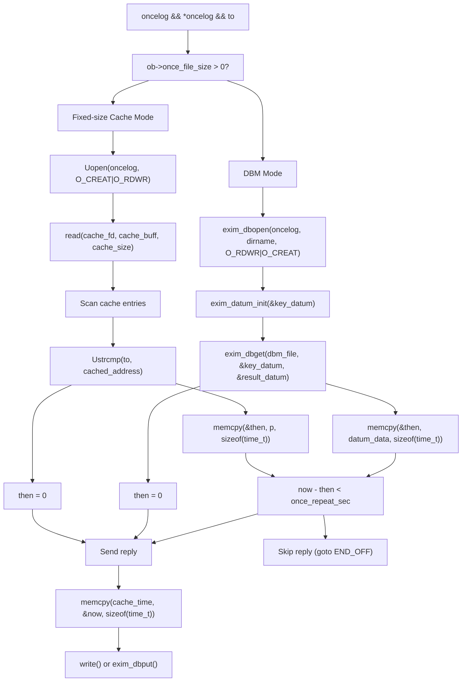
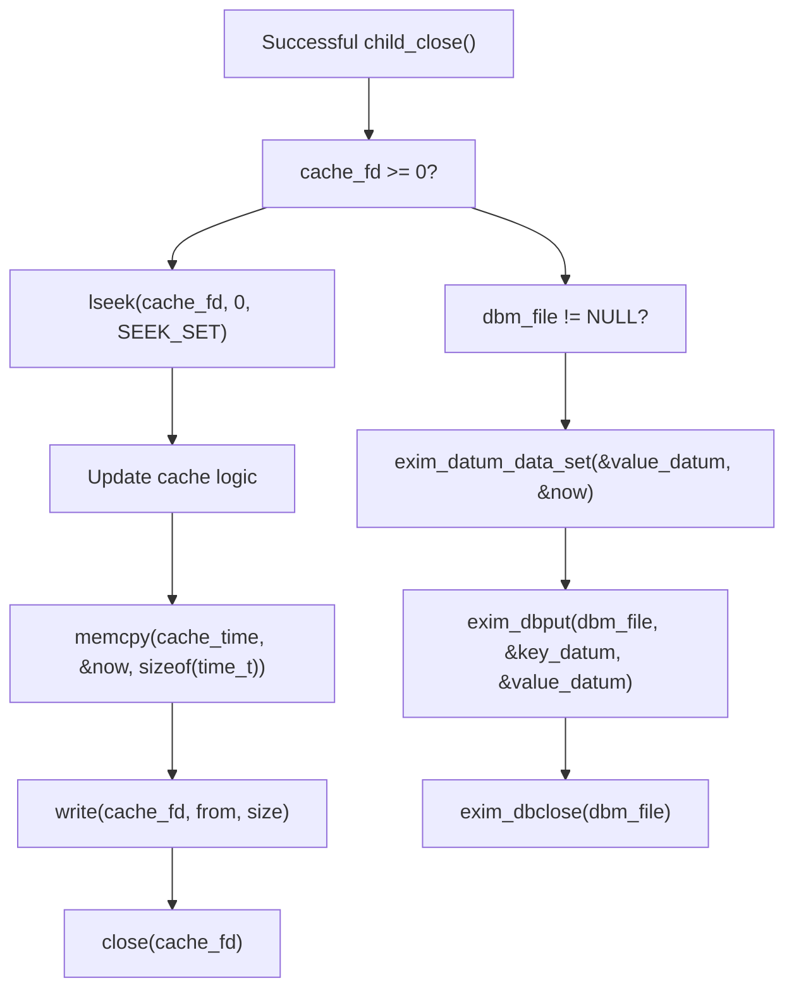
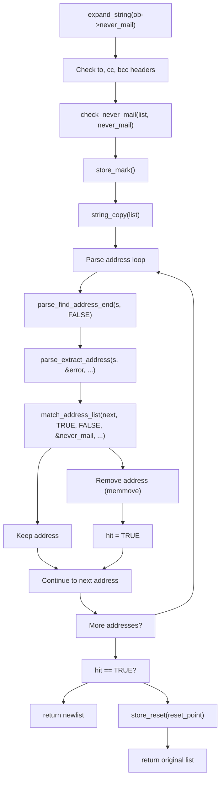
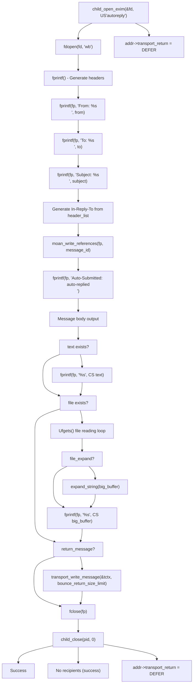
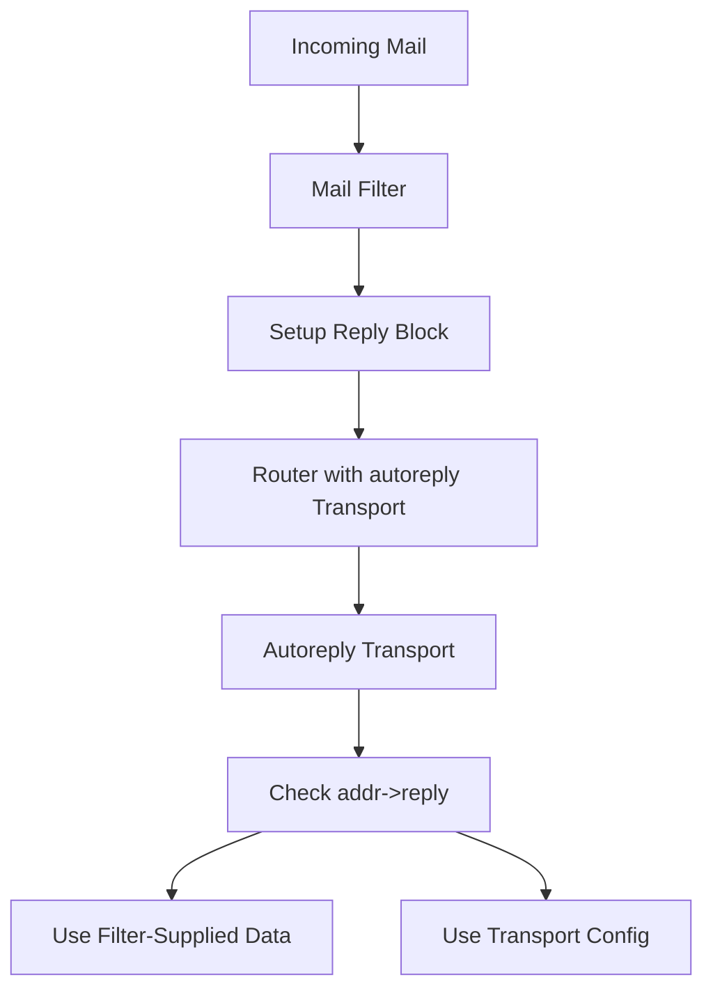

# Autoreply Transport

> **Relevant source files**
> * [src/src/transports/appendfile.c](https://github.com/Exim/exim/blob/29568b25/src/src/transports/appendfile.c)
> * [src/src/transports/autoreply.c](https://github.com/Exim/exim/blob/29568b25/src/src/transports/autoreply.c)
> * [src/src/transports/lmtp.c](https://github.com/Exim/exim/blob/29568b25/src/src/transports/lmtp.c)
> * [src/src/transports/pipe.c](https://github.com/Exim/exim/blob/29568b25/src/src/transports/pipe.c)
> * [src/src/transports/tf_maildir.c](https://github.com/Exim/exim/blob/29568b25/src/src/transports/tf_maildir.c)

## Purpose and Scope

The Autoreply Transport in Exim is a specialized transport mechanism designed to generate and send automatic replies to incoming emails. It provides a comprehensive solution for implementing vacation messages, auto-acknowledgments, and other automated response systems directly within Exim.

Unlike other transports that deliver messages to final destinations, the Autoreply Transport creates entirely new messages in response to received ones. It features mechanisms to prevent mail loops and excessive responses through its once-only capabilities.

## Architecture and Integration

#### Autoreply Transport Code Structure



#### Transport Registration in Exim System



Sources: [src/src/transports/autoreply.c L262-L802](https://github.com/Exim/exim/blob/29568b25/src/src/transports/autoreply.c#L262-L802)

 [src/src/transports/autoreply.c L811-L827](https://github.com/Exim/exim/blob/29568b25/src/src/transports/autoreply.c#L811-L827)

 [src/src/transports/autoreply.c L86-L100](https://github.com/Exim/exim/blob/29568b25/src/src/transports/autoreply.c#L86-L100)

## Transport Registration

The Autoreply Transport is registered with Exim's transport system using the `autoreply_transport_info` structure, which defines its characteristics, capabilities, and integration points:



Sources: [src/src/transports/autoreply.c L811-L827](https://github.com/Exim/exim/blob/29568b25/src/src/transports/autoreply.c#L811-L827)

## Configuration Options

The autoreply transport uses the `autoreply_transport_options[]` array and `autoreply_transport_options_block` structure:

### Message Content Options from autoreply_transport_options[]

| Option | Type | Structure Field | Description |
| --- | --- | --- | --- |
| `from` | `opt_stringptr` | `LOFF(from)` | Sets the From: header in the reply message |
| `reply_to` | `opt_stringptr` | `LOFF(reply_to)` | Sets the Reply-To: header |
| `to` | `opt_stringptr` | `LOFF(to)` | Specifies recipient(s) in the To: header |
| `cc` | `opt_stringptr` | `LOFF(cc)` | Specifies carbon copy recipient(s) |
| `bcc` | `opt_stringptr` | `LOFF(bcc)` | Specifies blind carbon copy recipient(s) |
| `subject` | `opt_stringptr` | `LOFF(subject)` | Sets the Subject: header |
| `headers` | `opt_stringptr` | `LOFF(headers)` | Specifies additional headers to add |
| `text` | `opt_stringptr` | `LOFF(text)` | Specifies the message body content |

Sources: [src/src/transports/autoreply.c L25-L43](https://github.com/Exim/exim/blob/29568b25/src/src/transports/autoreply.c#L25-L43)

 [src/src/transports/autoreply.c L23](https://github.com/Exim/exim/blob/29568b25/src/src/transports/autoreply.c#L23-L23)

### File and Control Options from autoreply_transport_options[]

| Option | Type | Structure Field | Default | Description |
| --- | --- | --- | --- | --- |
| `file` | `opt_stringptr` | `LOFF(file)` | NULL | Path to file whose contents are included in reply |
| `file_expand` | `opt_bool` | `LOFF(file_expand)` | FALSE | Expands variables in file contents when TRUE |
| `file_optional` | `opt_bool` | `LOFF(file_optional)` | FALSE | Doesn't fail if file missing when TRUE |
| `log` | `opt_stringptr` | `LOFF(logfile)` | NULL | Path to file for logging autoreply activity |
| `never_mail` | `opt_stringptr` | `LOFF(never_mail)` | NULL | Address list to never send autoreplies to |
| `return_message` | `opt_bool` | `LOFF(return_message)` | FALSE | Includes original message in reply when TRUE |
| `mode` | `opt_octint` | `LOFF(mode)` | 0600 | File mode for created files (octal) |

### Once-Only Options from autoreply_transport_options[]

| Option | Type | Structure Field | Description |
| --- | --- | --- | --- |
| `once` | `opt_stringptr` | `LOFF(oncelog)` | Path to file/database tracking sent replies |
| `once_file_size` | `opt_int` | `LOFF(once_file_size)` | Size of cache file (0 = use DBM) |
| `once_repeat` | `opt_stringptr` | `LOFF(once_repeat)` | Time period before allowing repeat replies |

The default values are defined in `autoreply_transport_option_defaults` with only `mode = 0600` explicitly set.

Sources: [src/src/transports/autoreply.c L25-L43](https://github.com/Exim/exim/blob/29568b25/src/src/transports/autoreply.c#L25-L43)

 [src/src/transports/autoreply.c L66-L68](https://github.com/Exim/exim/blob/29568b25/src/src/transports/autoreply.c#L66-L68)

 [src/src/transports/autoreply.c L612-L625](https://github.com/Exim/exim/blob/29568b25/src/src/transports/autoreply.c#L612-L625)

## Message Processing Flow

#### Main Entry Point Flow with Function Calls



Sources: [src/src/transports/autoreply.c L262-L802](https://github.com/Exim/exim/blob/29568b25/src/src/transports/autoreply.c#L262-L802)

 [src/src/transports/autoreply.c L126-L154](https://github.com/Exim/exim/blob/29568b25/src/src/transports/autoreply.c#L126-L154)

 [src/src/transports/autoreply.c L173-L250](https://github.com/Exim/exim/blob/29568b25/src/src/transports/autoreply.c#L173-L250)

## Data Sources

The `autoreply_transport_entry()` function determines data source using `addr->reply` pointer:

#### Data Source Selection Logic



1. **Address Reply Block** (`addr->reply != NULL`): Data comes from mail filter setup, no expansion needed
2. **Transport Configuration** (`addr->reply == NULL`): Uses `ob->*` options with `checkexpand()` validation

Sources: [src/src/transports/autoreply.c L294-L356](https://github.com/Exim/exim/blob/29568b25/src/src/transports/autoreply.c#L294-L356)

 [src/src/transports/autoreply.c L318-L345](https://github.com/Exim/exim/blob/29568b25/src/src/transports/autoreply.c#L318-L345)

## Once-Only Implementation

The once-only mechanism prevents duplicate replies using either DBM database or fixed-size cache files:

#### Once-Only Database Operations



#### Database Update After Successful Send



Sources: [src/src/transports/autoreply.c L402-L530](https://github.com/Exim/exim/blob/29568b25/src/src/transports/autoreply.c#L402-L530)

 [src/src/transports/autoreply.c L690-L734](https://github.com/Exim/exim/blob/29568b25/src/src/transports/autoreply.c#L690-L734)

## Never Mail Mechanism

The `never_mail` option prevents autoreplies to specific addresses using the `check_never_mail()` function:

#### Never Mail Processing Algorithm



The function uses `match_address_list()` to check each recipient against the never_mail patterns, removing matches to prevent mail loops.

Sources: [src/src/transports/autoreply.c L173-L250](https://github.com/Exim/exim/blob/29568b25/src/src/transports/autoreply.c#L173-L250)

 [src/src/transports/autoreply.c L361-L383](https://github.com/Exim/exim/blob/29568b25/src/src/transports/autoreply.c#L361-L383)

## Child Process Handling

The autoreply transport uses `child_open_exim()` to create a subprocess for message delivery:

#### Child Process Creation and Communication



The child process handles the actual SMTP delivery, while the parent process constructs the message content and manages the once-only database.

Sources: [src/src/transports/autoreply.c L555-L676](https://github.com/Exim/exim/blob/29568b25/src/src/transports/autoreply.c#L555-L676)

 [src/src/transports/autoreply.c L594-L595](https://github.com/Exim/exim/blob/29568b25/src/src/transports/autoreply.c#L594-L595)

 [src/src/transports/autoreply.c L630-L671](https://github.com/Exim/exim/blob/29568b25/src/src/transports/autoreply.c#L630-L671)

## Reply Message Generation

The reply message is constructed with:

1. Standard headers (From, Reply-To, To, Cc, Bcc, Subject)
2. In-Reply-To header referencing the original message
3. References header preserving the References chain
4. Auto-Submitted: auto-replied header to mark as an automatic response
5. Additional custom headers
6. Message body text
7. Contents of the specified file (if any)
8. Original message (if return_message is enabled)

Sources: [src/src/transports/autoreply.c L574-L671](https://github.com/Exim/exim/blob/29568b25/src/src/transports/autoreply.c#L574-L671)

## Logging

If the `log` option is set, information about sent messages is logged:

1. Each log entry includes a timestamp
2. Sender information is recorded
3. Recipients (To, Cc, Bcc) are logged
4. Subject is logged
5. Any additional headers are recorded

The log file is opened with O_APPEND, ensuring that concurrent autoreplies don't overwrite each other.

Sources: [src/src/transports/autoreply.c L762-L793](https://github.com/Exim/exim/blob/29568b25/src/src/transports/autoreply.c#L762-L793)

## Error Handling

The Autoreply Transport handles various error conditions:

1. **Configuration Errors**: Failures in string expansion are reported with detailed messages
2. **File Access Errors**: Problems with opening or reading files are reported
3. **Child Process Errors**: Non-zero exit status from the child process is handled
4. **Database Errors**: Problems with the once-only database are managed

In most cases, errors result in DEFER status to allow retrying later.

Sources: [src/src/transports/autoreply.c L333-L345](https://github.com/Exim/exim/blob/29568b25/src/src/transports/autoreply.c#L333-L345)

 [src/src/transports/autoreply.c L533-L552](https://github.com/Exim/exim/blob/29568b25/src/src/transports/autoreply.c#L533-L552)

 [src/src/transports/autoreply.c L746-L752](https://github.com/Exim/exim/blob/29568b25/src/src/transports/autoreply.c#L746-L752)

## Integration with Mail Filters

The Autoreply Transport works particularly well with mail filtering systems:



Sources: [src/src/transports/autoreply.c L292-L313](https://github.com/Exim/exim/blob/29568b25/src/src/transports/autoreply.c#L292-L313)

## Configuration Example

Here's an example transport configuration for an autoreply transport:

```python
vacation_autoreply:
  driver = autoreply
  to = $sender_address
  subject = Auto: $h_subject
  text = "I am currently away from the office and will reply when I return.\n\nYour message about \"$h_subject\" has been received."
  file = /home/$local_part/.vacation.msg
  file_optional = true
  log = /home/$local_part/.vacation.log
  once = /home/$local_part/.vacation.db
  once_repeat = 7d
  never_mail = <, postmaster@*, mailer-daemon@*
  return_message = false
```

## Related Transportation Systems

The Autoreply Transport is one of several transports in Exim, each serving a distinct purpose:

| Transport | Purpose |
| --- | --- |
| Autoreply | Generates automatic responses to incoming mail |
| Appendfile | Delivers mail to files or directories (mailboxes) |
| Pipe | Delivers mail to an external command |
| LMTP | Delivers mail using the Local Mail Transfer Protocol |
| SMTP | Delivers mail to remote servers using SMTP |

For more information on other transport mechanisms, see [Transport Mechanisms](/Exim/exim/6-transport-mechanisms).