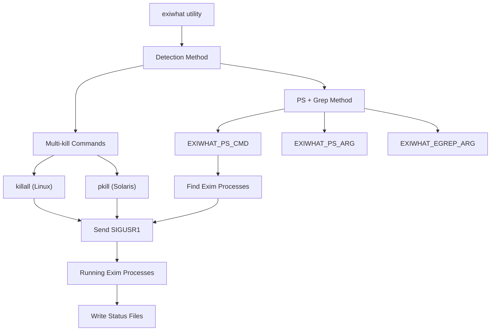
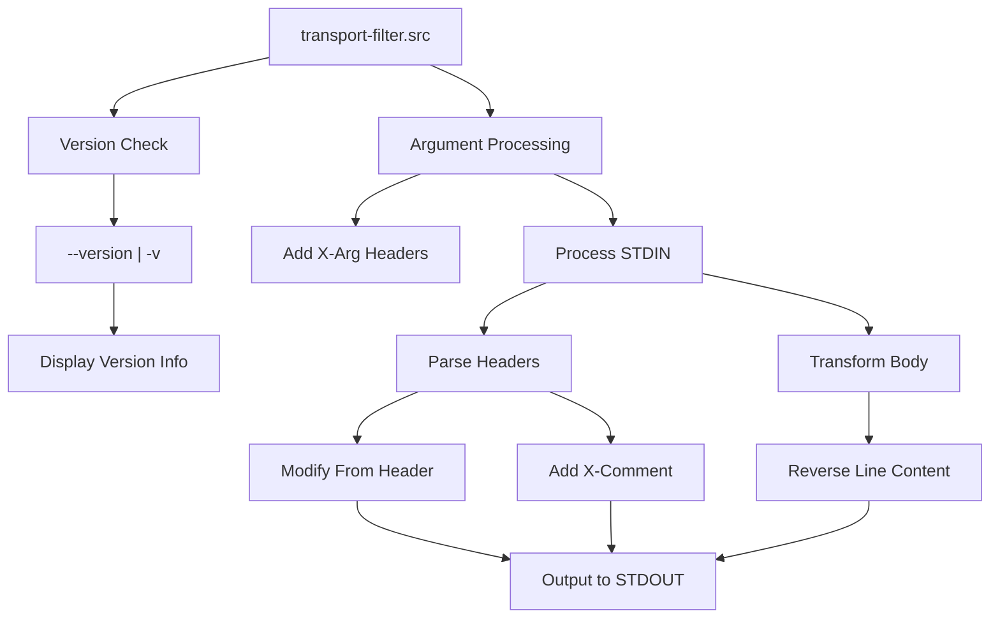

# Command-line Utilities

> **Relevant source files**
> * [src/OS/Makefile-Default](https://github.com/Exim/exim/blob/29568b25/src/OS/Makefile-Default)
> * [src/src/transport-filter.src](https://github.com/Exim/exim/blob/29568b25/src/src/transport-filter.src)

This document covers Exim's command-line utilities for system administration, monitoring, and maintenance. These utilities provide administrators with tools to manage Exim processes, inspect system state, manipulate databases, and perform maintenance tasks.

For information about the main Exim daemon process, see [Daemon Process and Host Functions](/Exim/exim/5.1-daemon-process-and-host-functions). For details about the build system that creates these utilities, see [Build-time Configuration](/Exim/exim/4.1-build-time-configuration).

## Overview

Exim provides a comprehensive suite of command-line utilities that fall into several categories:

* **Process Management**: Tools for monitoring and controlling running Exim processes
* **Queue Management**: Utilities for inspecting and manipulating the mail queue
* **Database Tools**: Commands for working with Exim's hints databases
* **Log Processing**: Scripts for analyzing and managing log files
* **Testing Tools**: Utilities for testing configuration and connectivity
* **Build Utilities**: Tools used during compilation and installation

## Process Management Utilities

### The exiwhat System

The `exiwhat` utility is Exim's primary process monitoring tool, designed to show what all running Exim processes are currently doing. The system uses signal-based communication to gather status information.



The `exiwhat` implementation uses two different approaches depending on the operating system capabilities:

**Multi-kill Method**: For systems with commands like `killall` or `pkill`, Exim can directly signal all processes:

[src/OS/Makefile-Default L147-L148](https://github.com/Exim/exim/blob/29568b25/src/OS/Makefile-Default#L147-L148)

```
EXIWHAT_MULTIKILL_CMD=
EXIWHAT_MULTIKILL_ARG=
```

**PS + Grep Method**: For other systems, `exiwhat` uses `ps` to list processes and `grep` to find Exim instances:

[src/OS/Makefile-Default L162-L164](https://github.com/Exim/exim/blob/29568b25/src/OS/Makefile-Default#L162-L164)

```
EXIWHAT_PS_CMD=/bin/ps
EXIWHAT_PS_ARG=-e
EXIWHAT_EGREP_ARG=' exim( |$$|-)'
```

The signal sent to trigger status reporting is configurable:

[src/OS/Makefile-Default L169](https://github.com/Exim/exim/blob/29568b25/src/OS/Makefile-Default#L169-L169)

```
EXIWHAT_KILL_SIGNAL=-USR1
```

**Sources**: [src/OS/Makefile-Default L138-L170](https://github.com/Exim/exim/blob/29568b25/src/OS/Makefile-Default#L138-L170)

## Build and Installation Utilities

### System Command Configuration

The build system defines paths to various system utilities used during compilation and installation:

```mermaid
flowchart TD

CHOWN["CHOWN_COMMAND<br>/usr/bin/chown"]
CHGRP["CHGRP_COMMAND<br>/usr/bin/chgrp"]
CHMOD["CHMOD_COMMAND<br>/usr/bin/chmod"]
MV["MV_COMMAND<br>/bin/mv"]
RM["RM_COMMAND<br>/bin/rm"]
TOUCH["TOUCH_COMMAND<br>/usr/bin/touch"]
AR["AR<br>ar cq"]
RANLIB["RANLIB<br>ranlib"]
STRIP["STRIP_COMMAND<br>(optional)"]
BASENAME["BASENAME_COMMAND<br>/usr/bin/basename"]
HOSTNAME["HOSTNAME_COMMAND<br>/bin/hostname"]
install_phase["Installation Phase"]
build_phase["Build Phase"]
monitor_scripts["Monitor Scripts"]

CHOWN --> install_phase
CHGRP --> install_phase
CHMOD --> install_phase
AR --> build_phase
RANLIB --> build_phase
BASENAME --> monitor_scripts
HOSTNAME --> monitor_scripts

subgraph subGraph2 ["System Info"]
    BASENAME
    HOSTNAME
end

subgraph subGraph1 ["Build Tools"]
    AR
    RANLIB
    STRIP
end

subgraph subGraph0 ["File Operations"]
    CHOWN
    CHGRP
    CHMOD
    MV
    RM
    TOUCH
end
```



### Build Tool Paths

The Makefile defines standard paths for build utilities with fallback detection:

[src/OS/Makefile-Default L44-L49](https://github.com/Exim/exim/blob/29568b25/src/OS/Makefile-Default#L44-L49)

```
CHOWN_COMMAND=/usr/bin/chown
CHGRP_COMMAND=/usr/bin/chgrp
CHMOD_COMMAND=/usr/bin/chmod
MV_COMMAND=/bin/mv
RM_COMMAND=/bin/rm
TOUCH_COMMAND=/usr/bin/touch
```

Some commands support automatic detection across different systems:

[src/OS/Makefile-Default L24-L31](https://github.com/Exim/exim/blob/29568b25/src/OS/Makefile-Default#L24-L31)

```python
# BASENAME_COMMAND contains the path to the "basename" command, which varies
# from OS to OS. This is used when building the Exim monitor script only.
# If BASENAME_COMMAND is set to "look_for_it" then the script checks for 
# /usr/bin/basename and /bin/basename, and if neither is found, it uses 
# /usr/ucb/basename. This copes with Solaris 2 and Linux.

BASENAME_COMMAND=/usr/bin/basename
```

**Sources**: [src/OS/Makefile-Default L24-L50](https://github.com/Exim/exim/blob/29568b25/src/OS/Makefile-Default#L24-L50)

 [src/OS/Makefile-Default L192-L199](https://github.com/Exim/exim/blob/29568b25/src/OS/Makefile-Default#L192-L199)

## Perl-based Utilities

### Transport Filter Framework

Exim includes Perl-based utilities for message processing and filtering. The transport filter system demonstrates the standard command-line interface patterns used across Exim utilities.



### Standard Version Handling

Exim utilities follow a consistent pattern for version reporting:

[src/src/transport-filter.src L23-L28](https://github.com/Exim/exim/blob/29568b25/src/src/transport-filter.src#L23-L28)

```php
if ($ARGV[0] eq '--version' || $ARGV[0] eq '-v') {
    print basename($0) . ": $0\n",
        "build: EXIM_RELEASE_VERSIONEXIM_VARIANT_VERSION\n",
        "perl(runtime): $]\n";
        exit 0;
}
```

### Argument Processing Pattern

Command-line arguments are processed and can be injected into the message processing pipeline:

[src/src/transport-filter.src L33-L36](https://github.com/Exim/exim/blob/29568b25/src/src/transport-filter.src#L33-L36)

```c
for ($ac = 0; $ac < @ARGV; $ac++)
  {
  printf("X-Arg%d: %s\n", $ac, $ARGV[$ac]);
  }
```

**Sources**: [src/src/transport-filter.src L23-L36](https://github.com/Exim/exim/blob/29568b25/src/src/transport-filter.src#L23-L36)

## Command-line Interface Patterns

### Perl Integration

The build system configures Perl support for utilities that require script processing:

[src/OS/Makefile-Default L68-L72](https://github.com/Exim/exim/blob/29568b25/src/OS/Makefile-Default#L68-L72)

```markdown
# Perl is not necessary for running Exim itself, except when EXIM_PERL
# is set to cause Perl embedding. However, some Perl utilities are provided
# for processing the logs. Perl 5 is assumed.

PERL_COMMAND=/usr/bin/perl
```

### Executable Permissions

The build system includes mechanisms for setting appropriate permissions on compiled utilities:

[src/OS/Makefile-Default L231-L235](https://github.com/Exim/exim/blob/29568b25/src/OS/Makefile-Default#L231-L235)

```markdown
# EXIM_CHMOD is available to specify a command that is automatically applied
# to the Exim binary immediately it is compiled. (I find this useful when
# building test versions.)

EXIM_CHMOD=@true
```

**Sources**: [src/OS/Makefile-Default L68-L72](https://github.com/Exim/exim/blob/29568b25/src/OS/Makefile-Default#L68-L72)

 [src/OS/Makefile-Default L231-L235](https://github.com/Exim/exim/blob/29568b25/src/OS/Makefile-Default#L231-L235)

## System Integration

### Cross-platform Compatibility

The utilities are designed to work across different Unix-like systems through configurable command paths and detection mechanisms. The build system handles platform differences by allowing OS-specific overrides of default command paths.

### Process Communication

The `exiwhat` system demonstrates Exim's approach to inter-process communication using Unix signals. This pattern allows utilities to communicate with running Exim processes without requiring complex IPC mechanisms.

### Database Integration

While not directly shown in the provided files, the utilities integrate with Exim's hints database system for queue management and status tracking. For details about the database system, see [Hints Database System](/Exim/exim/5.4-hints-database-system).

**Sources**: [src/OS/Makefile-Default L138-L170](https://github.com/Exim/exim/blob/29568b25/src/OS/Makefile-Default#L138-L170)

 [src/src/transport-filter.src L1-L100](https://github.com/Exim/exim/blob/29568b25/src/src/transport-filter.src#L1-L100)