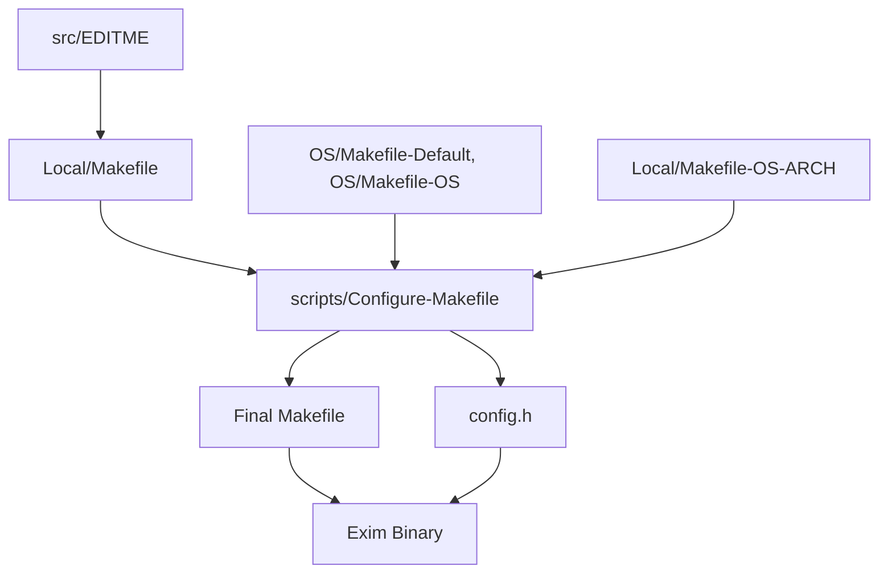
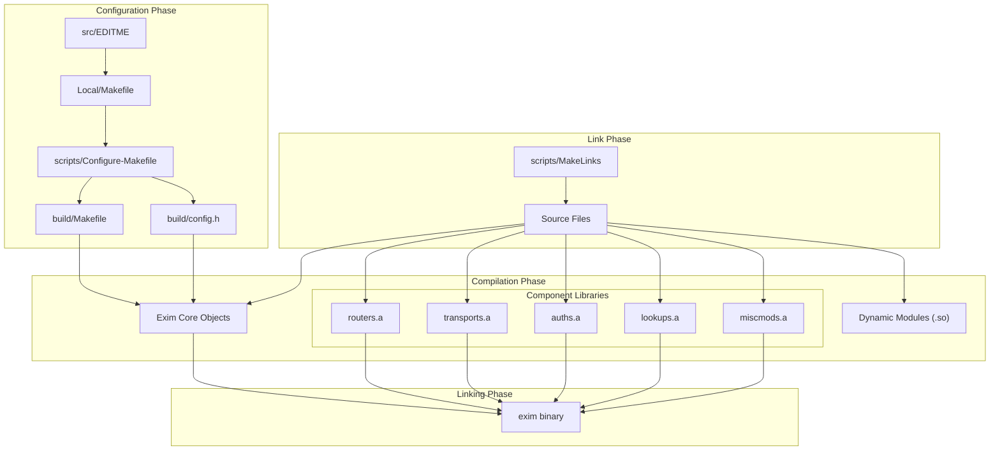
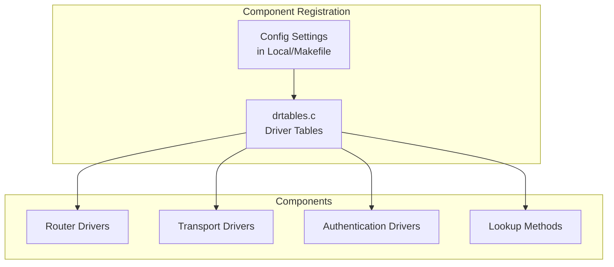

# Configuration and Build System

> **Relevant source files**
> * [doc/doc-txt/experimental-spec.txt](https://github.com/Exim/exim/blob/29568b25/doc/doc-txt/experimental-spec.txt)
> * [src/OS/Makefile-Base](https://github.com/Exim/exim/blob/29568b25/src/OS/Makefile-Base)
> * [src/scripts/Configure-Makefile](https://github.com/Exim/exim/blob/29568b25/src/scripts/Configure-Makefile)
> * [src/scripts/MakeLinks](https://github.com/Exim/exim/blob/29568b25/src/scripts/MakeLinks)
> * [src/scripts/lookups-Makefile](https://github.com/Exim/exim/blob/29568b25/src/scripts/lookups-Makefile)
> * [src/src/EDITME](https://github.com/Exim/exim/blob/29568b25/src/src/EDITME)
> * [src/src/auths/Makefile](https://github.com/Exim/exim/blob/29568b25/src/src/auths/Makefile)
> * [src/src/config.h.defaults](https://github.com/Exim/exim/blob/29568b25/src/src/config.h.defaults)
> * [src/src/drtables.c](https://github.com/Exim/exim/blob/29568b25/src/src/drtables.c)
> * [src/src/exim.h](https://github.com/Exim/exim/blob/29568b25/src/src/exim.h)
> * [src/src/lookups/Makefile](https://github.com/Exim/exim/blob/29568b25/src/src/lookups/Makefile)
> * [src/src/miscmods/Makefile](https://github.com/Exim/exim/blob/29568b25/src/src/miscmods/Makefile)
> * [src/src/routers/Makefile](https://github.com/Exim/exim/blob/29568b25/src/src/routers/Makefile)
> * [src/src/transports/Makefile](https://github.com/Exim/exim/blob/29568b25/src/src/transports/Makefile)

This document explains Exim's configuration and build systems, covering how Exim is configured at build time and how the build process works. For information on runtime configuration that controls Exim's behavior after it's built, see [Runtime Configuration](/Exim/exim/4.2-runtime-configuration).

Exim uses a two-tier configuration approach: build-time configuration determines which components and features are included in the compiled binary, while runtime configuration controls how these components behave during operation. This design allows Exim to be tailored for different environments while maintaining efficiency by only including needed components.

## Build-Time Configuration Overview

Exim's build-time configuration determines which components (routers, transports, authenticators, lookup methods) and features (TLS, content scanning, experimental features) are included in the compiled binary.



Sources: [src/EDITME](https://github.com/Exim/exim/blob/29568b25/src/EDITME)

 [OS/Makefile-Base](https://github.com/Exim/exim/blob/29568b25/OS/Makefile-Base)

 [scripts/Configure-Makefile](https://github.com/Exim/exim/blob/29568b25/scripts/Configure-Makefile)

### Key Configuration Files

The build process relies on several key configuration files that determine what features and components are included:

1. **Template Files**: * **src/EDITME**: The template for Exim's main build configuration file * **OS/Makefile-Default**: Contains default settings for operating system dependencies
2. **Local Configuration Files**: * **Local/Makefile**: Main configuration file (copy of EDITME with site-specific settings) * **Local/Makefile-{ostype}**: OS-specific overrides * **Local/Makefile-{archtype}**: Architecture-specific overrides * **Local/Makefile-{ostype}-{archtype}**: Combined OS and architecture overrides
3. **Generated Files**: * **build/Makefile**: The final Makefile for building Exim * **build/config.h**: Generated C header defining compile-time options

Each of these files contains macro definitions that configure aspects of the build, with later definitions overriding earlier ones to create a layered configuration approach.

Sources: [scripts/Configure-Makefile L11-L63](https://github.com/Exim/exim/blob/29568b25/scripts/Configure-Makefile#L11-L63)

 [OS/Makefile-Base L1-L82](https://github.com/Exim/exim/blob/29568b25/OS/Makefile-Base#L1-L82)

## The Build Process

The Exim build process follows several stages to create a tailored binary with only the requested components and features.



Sources: [OS/Makefile-Base L10-L100](https://github.com/Exim/exim/blob/29568b25/OS/Makefile-Base#L10-L100)

 [scripts/MakeLinks](https://github.com/Exim/exim/blob/29568b25/scripts/MakeLinks)

 [scripts/Configure-Makefile](https://github.com/Exim/exim/blob/29568b25/scripts/Configure-Makefile)

### Key Build Steps

1. **Configuration Processing**: * `scripts/Configure-Makefile` combines settings from various Makefile fragments * Generates the final Makefile and config.h with compile-time options
2. **Source Setup**: * `scripts/MakeLinks` creates links to source files in the build directory * Organizes source files by component type (routers, transports, etc.)
3. **Component Compilation**: * Each component type (routers, transports, auths, lookups) is compiled into its own library * Dynamic modules are compiled as shared objects if requested
4. **Final Linking**: * The exim binary is linked with all required component libraries * Only components specified in the build configuration are included

Sources: [scripts/Configure-Makefile L80-L166](https://github.com/Exim/exim/blob/29568b25/scripts/Configure-Makefile#L80-L166)

 [OS/Makefile-Base L572-L585](https://github.com/Exim/exim/blob/29568b25/OS/Makefile-Base#L572-L585)

 [scripts/MakeLinks L25-L164](https://github.com/Exim/exim/blob/29568b25/scripts/MakeLinks#L25-L164)

## Component Selection System

Exim's build system allows fine-grained control over which components are included in the binary. This is primarily controlled through Local/Makefile settings.

### Router Selection

Router drivers determine how messages are routed to their destinations. You can include or exclude specific routers by setting variables in Local/Makefile:

```markdown
ROUTER_ACCEPT=yes
ROUTER_DNSLOOKUP=yes
ROUTER_IPLITERAL=yes
ROUTER_MANUALROUTE=yes
ROUTER_QUERYPROGRAM=yes
ROUTER_REDIRECT=yes
# ROUTER_IPLOOKUP=yes  # Commented = excluded
```

Setting a value to `2` instead of `yes` causes the router to be built as a dynamically loaded module.

Sources: [src/EDITME L325-L335](https://github.com/Exim/exim/blob/29568b25/src/EDITME#L325-L335)

 [src/drtables.c L106-L156](https://github.com/Exim/exim/blob/29568b25/src/drtables.c#L106-L156)

### Transport Selection

Transport drivers handle the actual delivery of messages. Similar to routers, you can control which transports are included:

```markdown
TRANSPORT_APPENDFILE=yes
TRANSPORT_AUTOREPLY=yes
TRANSPORT_PIPE=yes
TRANSPORT_SMTP=yes
# TRANSPORT_LMTP=yes  # Commented = excluded
```

Sources: [src/EDITME L356-L364](https://github.com/Exim/exim/blob/29568b25/src/EDITME#L356-L364)

 [src/drtables.c L160-L224](https://github.com/Exim/exim/blob/29568b25/src/drtables.c#L160-L224)

### Lookup Methods

Lookup methods enable Exim to query external data sources. The configuration determines which lookup methods are available:

```markdown
LOOKUP_DBM=yes
LOOKUP_LSEARCH=yes
LOOKUP_DNSDB=yes
# LOOKUP_MYSQL=yes  # Commented = excluded
```

When built as modules (`=2`), lookup methods can be loaded dynamically at runtime.

Sources: [src/EDITME L432-L462](https://github.com/Exim/exim/blob/29568b25/src/EDITME#L432-L462)

 [src/drtables.c L228-L298](https://github.com/Exim/exim/blob/29568b25/src/drtables.c#L228-L298)

### Module Registration

The component selection is implemented through a registration system in the `drtables.c` file. This file maintains tables of available drivers that are included in the binary:



Sources: [src/drtables.c L21-L29](https://github.com/Exim/exim/blob/29568b25/src/drtables.c#L21-L29)

 [src/drtables.c L594-L754](https://github.com/Exim/exim/blob/29568b25/src/drtables.c#L594-L754)

## Dynamic Module Support

Exim provides support for building components as dynamically loadable modules, which allows:

1. Smaller base binary size by excluding rarely used components
2. Adding functionality without rebuilding the entire binary
3. Distributing proprietary modules without distributing source code

To enable dynamic module support, you need to define:

```
LOOKUP_MODULE_DIR=/usr/lib/exim/lookups/
CFLAGS_DYNAMIC=-shared -rdynamic -fPIC
```

Then mark components for dynamic loading with `=2` instead of `yes`:

```
LOOKUP_MYSQL=2
ROUTER_REDIRECT=2
TRANSPORT_LMTP=2
```

Dynamic modules are loaded on demand when a configuration references them or at startup for multi-method modules.

Sources: [src/EDITME L385-L423](https://github.com/Exim/exim/blob/29568b25/src/EDITME#L385-L423)

 [src/drtables.c L342-L407](https://github.com/Exim/exim/blob/29568b25/src/drtables.c#L342-L407)

## Experimental Features

Exim includes support for experimental features that can be enabled at build time. These features are marked as experimental because they may change in incompatible ways in future releases.

To enable an experimental feature, you must define the corresponding EXPERIMENTAL_* macro in Local/Makefile:

```
EXPERIMENTAL_ARC=yes
EXPERIMENTAL_DKIM=yes
EXPERIMENTAL_QUEUEFILE=yes
```

Experimental features are documented in `doc/doc-txt/experimental-spec.txt`. Some examples include:

* **ARC** (Authenticated Received Chain) support
* **DKIM** (DomainKeys Identified Mail) signing/verification
* **Brightmail AntiSpam** integration
* **DCC** (Distributed Checksum Clearinghouse) support
* **QUEUEFILE** transport

Sources: [doc/doc-txt/experimental-spec.txt L1-L6](https://github.com/Exim/exim/blob/29568b25/doc/doc-txt/experimental-spec.txt#L1-L6)

 [src/EDITME L694-L718](https://github.com/Exim/exim/blob/29568b25/src/EDITME#L694-L718)

## Dependency Handling

The build system handles various dependencies between components:

1. **Feature dependencies**: Some features depend on others (e.g., DMARC depends on SPF and DKIM)
2. **Library dependencies**: External libraries required for specific features
3. **Platform dependencies**: OS-specific adaptations and optimizations

Dependencies are handled through:

* Automatic detection of required libraries using pkg-config
* Conditional compilation in the source code
* Build-time checks in the Configure scripts

The build system can automatically determine library paths and flags for many dependencies using pkg-config:

```
USE_OPENSSL_PC=openssl
USE_GNUTLS_PC=gnutls gnutls-dane
```

Sources: [scripts/Configure-Makefile L164-L244](https://github.com/Exim/exim/blob/29568b25/scripts/Configure-Makefile#L164-L244)

 [src/EDITME L218-L232](https://github.com/Exim/exim/blob/29568b25/src/EDITME#L218-L232)

## Build Directory Structure

Exim's build system organizes the source files into a structured build directory:

```markdown
build/
├── auths/            # Authentication mechanisms
├── config.h          # Generated configuration header
├── exim              # Final binary
├── hintsdb/          # Hints database implementations
├── lookups/          # Lookup methods
├── Makefile          # Generated makefile
├── miscmods/         # Miscellaneous modules
├── os.c              # OS-specific code
├── os.h              # OS-specific header
├── routers/          # Router drivers
└── transports/       # Transport drivers
```

Each subdirectory contains symbolic links to the actual source files and a specialized Makefile for that component type.

Sources: [scripts/MakeLinks L31-L124](https://github.com/Exim/exim/blob/29568b25/scripts/MakeLinks#L31-L124)

## Build-time vs. Runtime Configuration

The dual configuration approach in Exim separates concerns:

| Build-time Configuration | Runtime Configuration |
| --- | --- |
| Determines available components | Determines active components |
| Controls which features are compiled in | Controls how features behave |
| Set in Local/Makefile | Set in exim.conf |
| Affects binary size and capabilities | Affects runtime behavior |
| Changes require recompilation | Changes take effect on restart |
| Configured by system administrator | Can be configured by mail administrator |

This separation allows Exim to be customized at both levels: the system administrator can control which features are available, while the mail administrator can configure how those features behave.

Sources: [src/EDITME L1-L14](https://github.com/Exim/exim/blob/29568b25/src/EDITME#L1-L14)

## Conclusion

Exim's configuration and build system provides flexibility through its two-tier approach. The build-time configuration determines which components and features are included in the binary, allowing administrators to create a tailored installation with only the required functionality. This approach helps maintain efficiency and security by keeping the binary size manageable and excluding unnecessary code.

The modular design and dynamic loading capabilities further enhance this flexibility, allowing components to be added or removed as needed without rebuilding the entire system. The experimental features mechanism provides a way to test new functionality while clearly marking it as potentially unstable.

Understanding both the build-time and runtime configuration is essential for properly deploying and maintaining an Exim mail transfer agent that meets the specific needs of an organization.