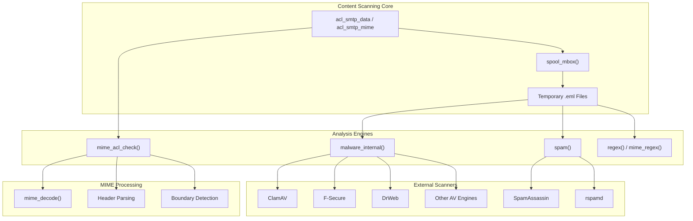
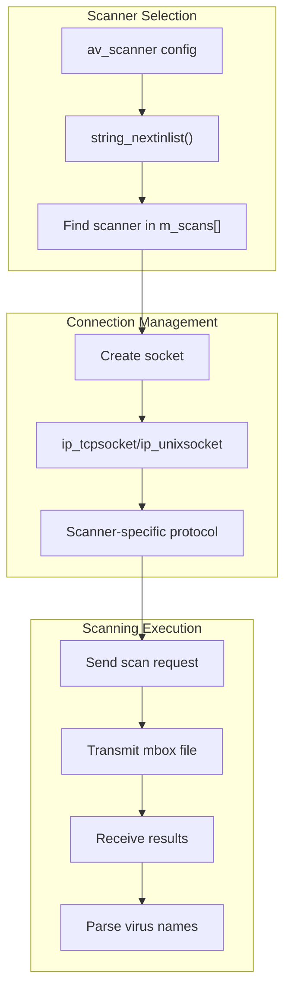
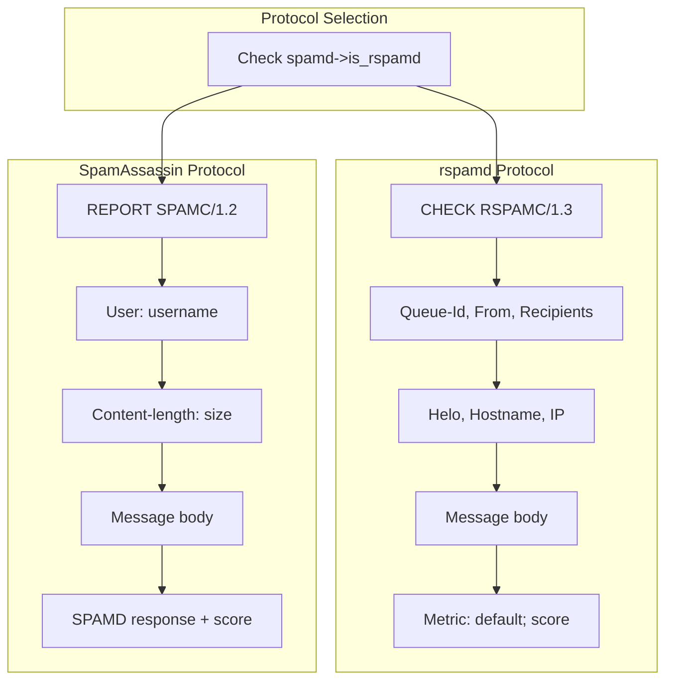
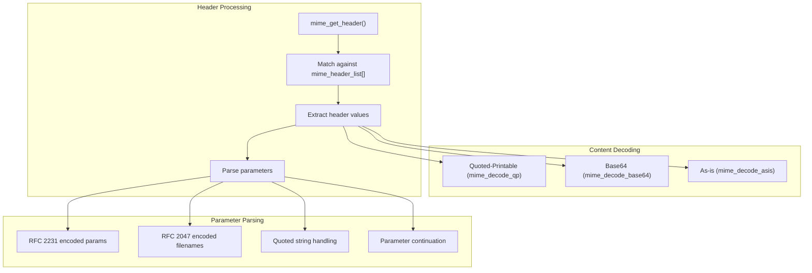
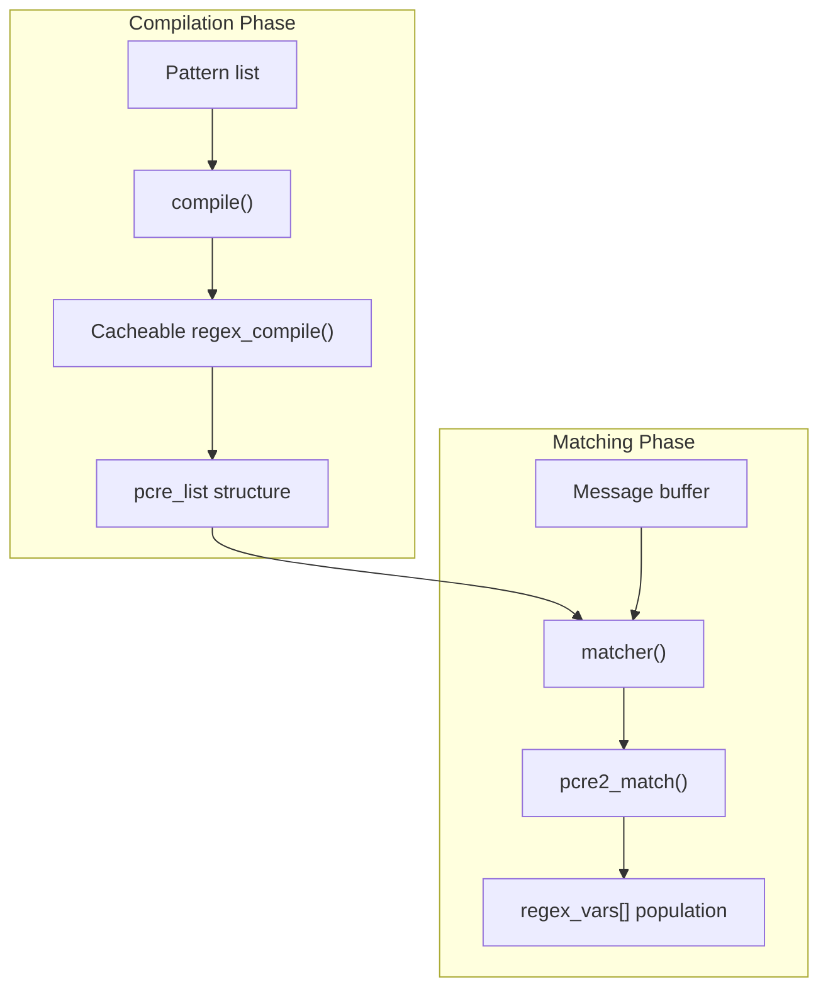

# Content Scanning

> **Relevant source files**
> * [src/src/ip.c](https://github.com/Exim/exim/blob/29568b25/src/src/ip.c)
> * [src/src/malware.c](https://github.com/Exim/exim/blob/29568b25/src/src/malware.c)
> * [src/src/mime.c](https://github.com/Exim/exim/blob/29568b25/src/src/mime.c)
> * [src/src/mime.h](https://github.com/Exim/exim/blob/29568b25/src/src/mime.h)
> * [src/src/regex.c](https://github.com/Exim/exim/blob/29568b25/src/src/regex.c)
> * [src/src/smtp_out.c](https://github.com/Exim/exim/blob/29568b25/src/src/smtp_out.c)
> * [src/src/spam.c](https://github.com/Exim/exim/blob/29568b25/src/src/spam.c)
> * [src/src/spool_mbox.c](https://github.com/Exim/exim/blob/29568b25/src/src/spool_mbox.c)
> * [test/confs/4000](https://github.com/Exim/exim/blob/29568b25/test/confs/4000)
> * [test/log/4000](https://github.com/Exim/exim/blob/29568b25/test/log/4000)
> * [test/mail/4000.userx](https://github.com/Exim/exim/blob/29568b25/test/mail/4000.userx)
> * [test/rejectlog/4000](https://github.com/Exim/exim/blob/29568b25/test/rejectlog/4000)
> * [test/scripts/4000-scanning/4000](https://github.com/Exim/exim/blob/29568b25/test/scripts/4000-scanning/4000)
> * [test/stdout/4000](https://github.com/Exim/exim/blob/29568b25/test/stdout/4000)

Exim's content scanning subsystem provides comprehensive analysis of email messages for malware, spam, MIME structure violations, and pattern-based content filtering. This system operates during the SMTP DATA phase and integrates with Exim's Access Control List (ACL) framework to enable policy-driven message handling.

For information about DKIM signature verification, see [DKIM Verification](/Exim/exim/3.2-dkim-verification). For general ACL processing, see [Access Control Lists (ACLs)](/Exim/exim/2.4-access-control-lists-(acls)).

## Architecture Overview

The content scanning system consists of several interconnected components that work together to analyze message content:



**Sources:** [src/src/malware.c L1-L102](https://github.com/Exim/exim/blob/29568b25/src/src/malware.c#L1-L102)

 [src/src/spam.c L177-L604](https://github.com/Exim/exim/blob/29568b25/src/src/spam.c#L177-L604)

 [src/src/mime.c L491-L604](https://github.com/Exim/exim/blob/29568b25/src/src/mime.c#L491-L604)

 [src/src/spool_mbox.c L32-L198](https://github.com/Exim/exim/blob/29568b25/src/src/spool_mbox.c#L32-L198)

## Message Flow and Processing Pipeline

The content scanning process follows a well-defined pipeline that transforms the raw SMTP message into analyzable formats:

```mermaid
sequenceDiagram
  participant SMTP Session
  participant ACL Engine
  participant spool_mbox()
  participant Scanner Engines
  participant External Tools

  SMTP Session->>ACL Engine: DATA command received
  ACL Engine->>spool_mbox(): Create temporary mbox file
  spool_mbox()->>spool_mbox(): Generate scan/msgid/msgid.eml
  loop [Malware Scanning]
    ACL Engine->>Scanner Engines: malware_internal()
    Scanner Engines->>External Tools: Connect to AV daemon
    External Tools->>Scanner Engines: Scan results
    Scanner Engines->>ACL Engine: malware_name / OK/FAIL
    ACL Engine->>Scanner Engines: spam()
    Scanner Engines->>External Tools: Send to SpamAssassin/rspamd
    External Tools->>Scanner Engines: Spam score/action
    Scanner Engines->>ACL Engine: spam_score / spam_action
    ACL Engine->>Scanner Engines: mime_acl_check()
    Scanner Engines->>Scanner Engines: Parse headers/boundaries
    Scanner Engines->>Scanner Engines: Decode attachments
    Scanner Engines->>ACL Engine: MIME variables set
  end
  ACL Engine->>SMTP Session: Accept/Reject/Defer
```

**Sources:** [src/src/spool_mbox.c L32-L198](https://github.com/Exim/exim/blob/29568b25/src/src/spool_mbox.c#L32-L198)

 [src/src/malware.c L573-L683](https://github.com/Exim/exim/blob/29568b25/src/src/malware.c#L573-L683)

 [src/src/spam.c L214-L604](https://github.com/Exim/exim/blob/29568b25/src/src/spam.c#L214-L604)

 [src/src/mime.c L491-L604](https://github.com/Exim/exim/blob/29568b25/src/src/mime.c#L491-L604)

## Malware Detection System

The malware detection subsystem supports multiple antivirus engines through a unified interface. Each scanner type is defined with specific connection parameters and communication protocols.

### Scanner Configuration and Selection

The scanner infrastructure is built around the `m_scans[]` array which defines supported scanner types:

| Scanner Type | Connection | Default Options | Protocol |
| --- | --- | --- | --- |
| ClamAV (`M_CLAMD`) | MC_NONE | `/tmp/clamd` | Custom TCP/Unix |
| F-Secure (`M_FSEC`) | MC_UNIX | `/var/run/.fsav` | Unix socket |
| DrWeb (`M_DRWEB`) | MC_STRM | `/usr/local/drweb/run/drwebd.sock` | Stream socket |
| Kaspersky (`M_KAVD`) | MC_UNIX | `/var/run/AvpCtl` | Unix socket |
| Avast (`M_AVAST`) | MC_STRM | `/var/run/avast/scan.sock` | Stream socket |

**Sources:** [src/src/malware.c L57-L102](https://github.com/Exim/exim/blob/29568b25/src/src/malware.c#L57-L102)

 [src/src/malware.c L652-L682](https://github.com/Exim/exim/blob/29568b25/src/src/malware.c#L652-L682)

### Malware Scanning Process



**Sources:** [src/src/malware.c L646-L682](https://github.com/Exim/exim/blob/29568b25/src/src/malware.c#L646-L682)

 [src/src/malware.c L687-L984](https://github.com/Exim/exim/blob/29568b25/src/src/malware.c#L687-L984)

The `malware_internal()` function coordinates the entire scanning process, handling scanner selection, connection establishment, and result parsing. Different scanner types implement distinct communication protocols - for example, ClamAV uses a simple text protocol while DrWeb uses a binary protocol with network byte order integers.

## Spam Detection Integration

The spam detection system primarily integrates with SpamAssassin and rspamd through network protocols. The implementation handles server selection, load balancing, and result interpretation.

### SpamAssassin vs rspamd Protocol Handling



**Sources:** [src/src/spam.c L343-L376](https://github.com/Exim/exim/blob/29568b25/src/src/spam.c#L343-L376)

 [src/src/spam.c L480-L527](https://github.com/Exim/exim/blob/29568b25/src/src/spam.c#L480-L527)

The spam detection system uses a server selection algorithm based on priority and weight, allowing for load distribution across multiple spamd instances. Failed servers are marked and excluded from subsequent selections within the same message processing session.

## MIME Processing and Structure Analysis

The MIME processing engine handles message structure parsing, header analysis, and content decoding. It operates through the `mime_acl_check()` function which processes each MIME part individually.

### MIME Header Processing Pipeline



**Sources:** [src/src/mime.c L304-L395](https://github.com/Exim/exim/blob/29568b25/src/src/mime.c#L304-L395)

 [src/src/mime.c L573-L689](https://github.com/Exim/exim/blob/29568b25/src/src/mime.c#L573-L689)

 [src/src/mime.c L220-L301](https://github.com/Exim/exim/blob/29568b25/src/src/mime.c#L220-L301)

The MIME processor maintains state through a series of expansion variables (`mime_content_type`, `mime_filename`, `mime_charset`, etc.) that are accessible within ACL conditions. These variables are reset for each MIME part processed.

### Boundary Detection and Multipart Handling

The boundary detection mechanism in `mime_acl_check()` handles nested multipart structures by maintaining a context stack. Each boundary context tracks the current boundary string and processes parts until an end boundary is encountered.

**Sources:** [src/src/mime.c L524-L550](https://github.com/Exim/exim/blob/29568b25/src/src/mime.c#L524-L550)

## Regular Expression Content Filtering

The regex scanning system provides pattern-based content analysis through two primary functions: `regex()` for full message scanning and `mime_regex()` for decoded MIME part analysis.

### Pattern Compilation and Matching



**Sources:** [src/src/regex.c L31-L62](https://github.com/Exim/exim/blob/29568b25/src/src/regex.c#L31-L62)

 [src/src/regex.c L71-L102](https://github.com/Exim/exim/blob/29568b25/src/src/regex.c#L71-L102)

The regex system uses a reset point mechanism to manage memory during large message processing, preventing memory exhaustion when scanning large messages with multiple patterns.

## Temporary File Management

The `spool_mbox()` function creates temporary MBOX-format files that scanners can process. These files are created in the `scan/message_id/` directory structure within the spool directory.

### MBOX File Generation Process

The MBOX file generation process constructs a complete email message including envelope information, headers, and body content. Wire format conversion is handled for messages that use CRLF line endings.

**Sources:** [src/src/spool_mbox.c L51-L181](https://github.com/Exim/exim/blob/29568b25/src/src/spool_mbox.c#L51-L181)

The temporary files are automatically cleaned up by `unspool_mbox()` unless the `no_mbox_unspool` flag is set, which is useful for debugging scanner interactions.

## Integration with ACL Framework

Content scanning integrates with Exim's ACL system through specific ACL verbs and conditions. The scanning functions are typically called from `acl_smtp_data` or `acl_smtp_mime` ACLs.

### ACL Integration Points

| ACL Condition | Function | Purpose |
| --- | --- | --- |
| `malware` | `malware_internal()` | Virus scanning |
| `spam` | `spam()` | Spam detection |
| `mime_regex` | `mime_regex()` | MIME part pattern matching |
| `regex` | `regex()` | Full message pattern matching |

**Sources:** [test/confs/4000 L19-L38](https://github.com/Exim/exim/blob/29568b25/test/confs/4000#L19-L38)

The content scanning system sets various expansion variables that can be used in subsequent ACL processing, allowing for sophisticated policy decisions based on scan results.