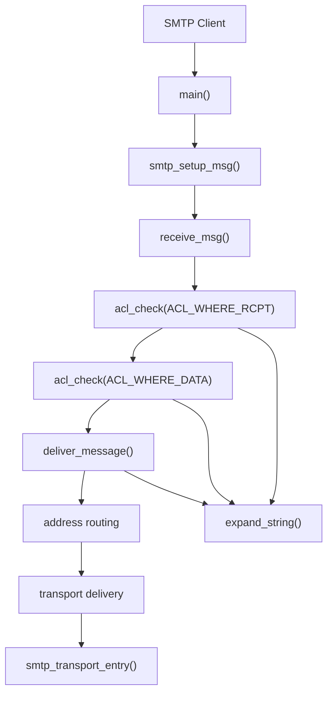
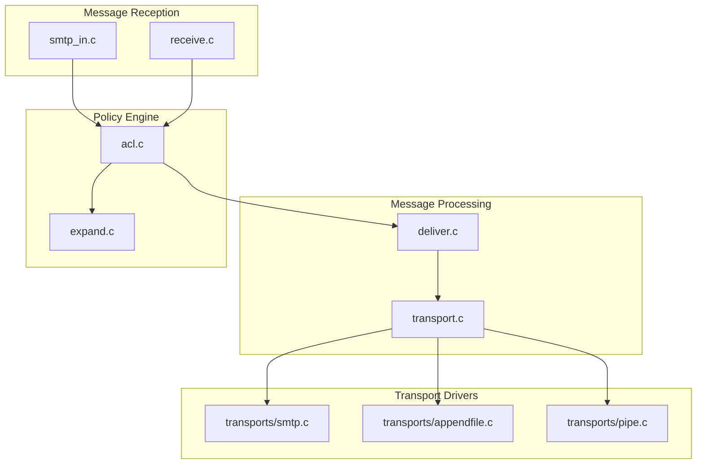
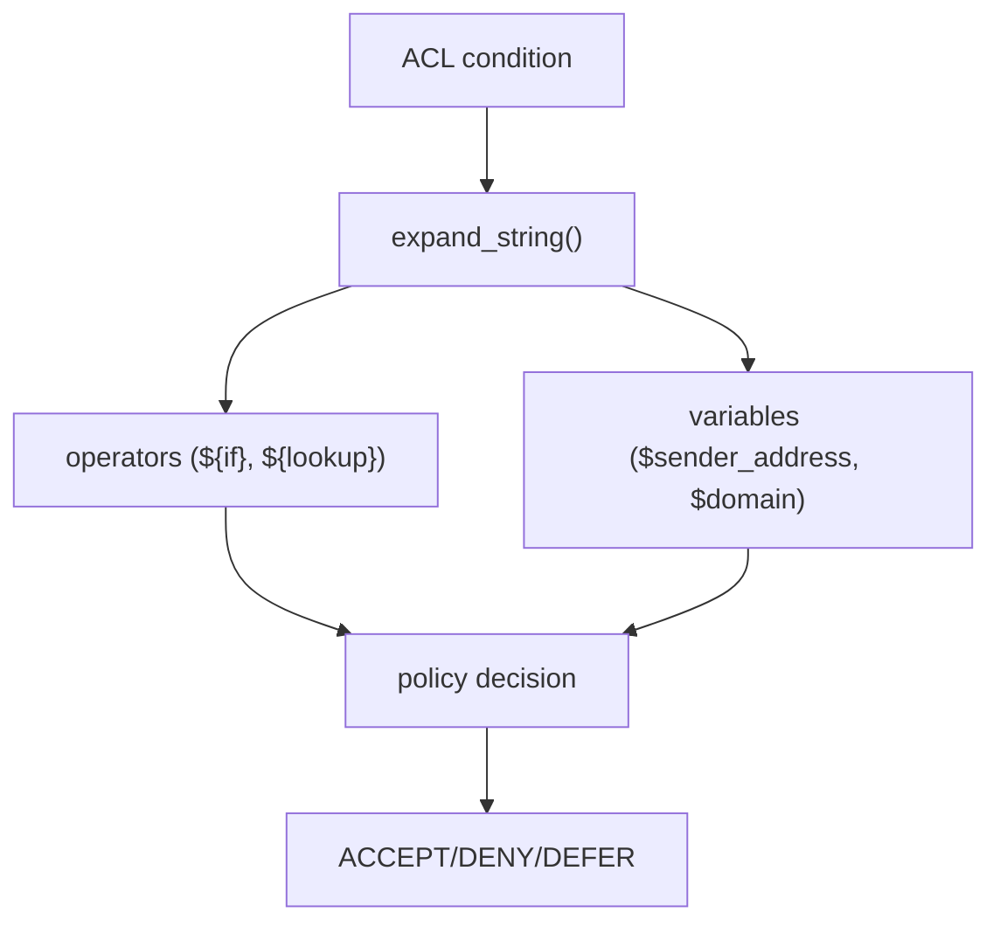
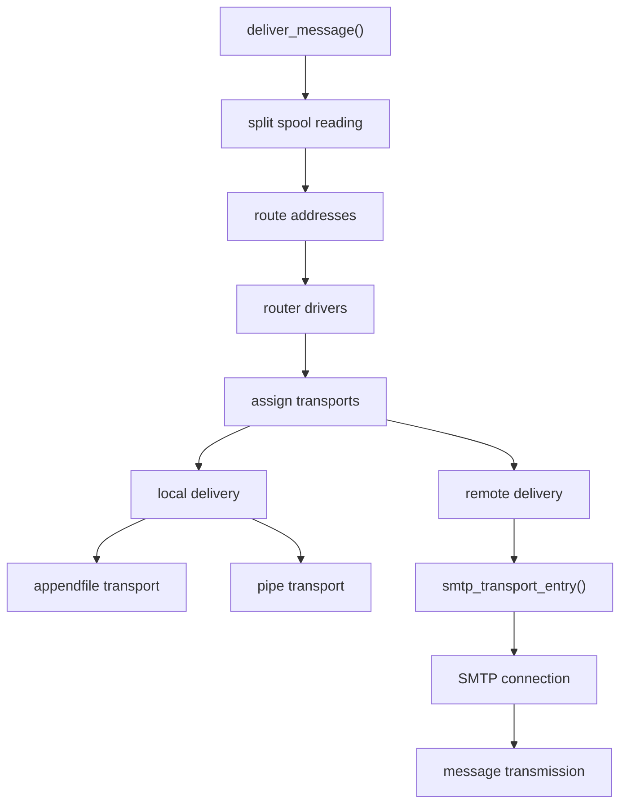
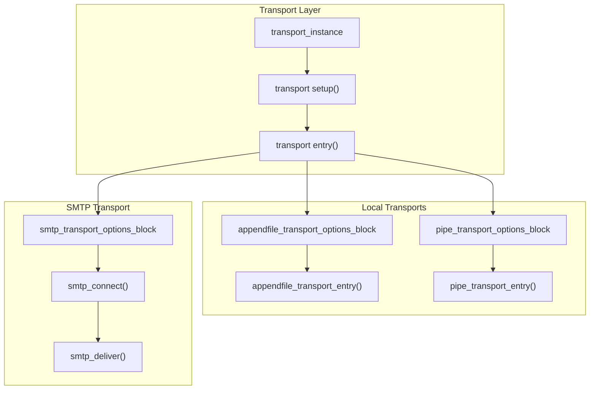
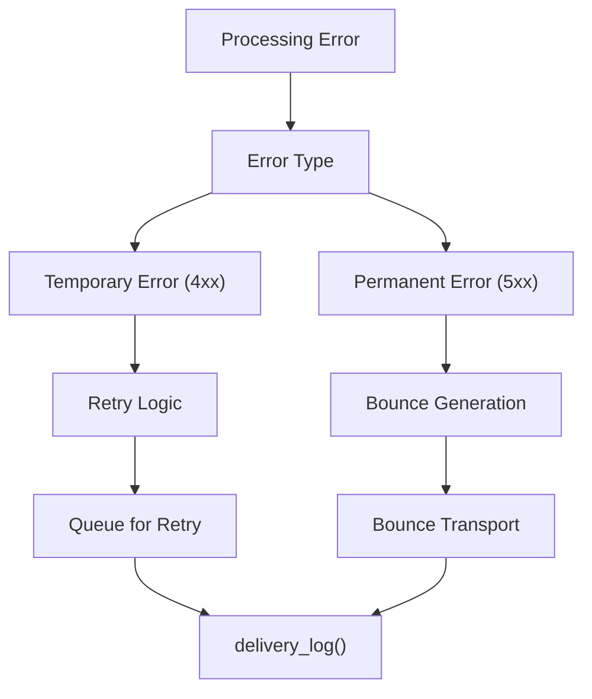

# Core Mail Processing

> **Relevant source files**
> * [doc/doc-docbook/spec.xfpt](https://github.com/Exim/exim/blob/29568b25/doc/doc-docbook/spec.xfpt)
> * [doc/doc-txt/ChangeLog](https://github.com/Exim/exim/blob/29568b25/doc/doc-txt/ChangeLog)
> * [doc/doc-txt/NewStuff](https://github.com/Exim/exim/blob/29568b25/doc/doc-txt/NewStuff)
> * [doc/doc-txt/OptionLists.txt](https://github.com/Exim/exim/blob/29568b25/doc/doc-txt/OptionLists.txt)
> * [src/src/acl.c](https://github.com/Exim/exim/blob/29568b25/src/src/acl.c)
> * [src/src/daemon.c](https://github.com/Exim/exim/blob/29568b25/src/src/daemon.c)
> * [src/src/deliver.c](https://github.com/Exim/exim/blob/29568b25/src/src/deliver.c)
> * [src/src/exim.c](https://github.com/Exim/exim/blob/29568b25/src/src/exim.c)
> * [src/src/expand.c](https://github.com/Exim/exim/blob/29568b25/src/src/expand.c)
> * [src/src/functions.h](https://github.com/Exim/exim/blob/29568b25/src/src/functions.h)
> * [src/src/globals.c](https://github.com/Exim/exim/blob/29568b25/src/src/globals.c)
> * [src/src/globals.h](https://github.com/Exim/exim/blob/29568b25/src/src/globals.h)
> * [src/src/readconf.c](https://github.com/Exim/exim/blob/29568b25/src/src/readconf.c)
> * [src/src/receive.c](https://github.com/Exim/exim/blob/29568b25/src/src/receive.c)
> * [src/src/smtp_in.c](https://github.com/Exim/exim/blob/29568b25/src/src/smtp_in.c)
> * [src/src/structs.h](https://github.com/Exim/exim/blob/29568b25/src/src/structs.h)
> * [src/src/transport.c](https://github.com/Exim/exim/blob/29568b25/src/src/transport.c)
> * [src/src/transports/smtp.c](https://github.com/Exim/exim/blob/29568b25/src/src/transports/smtp.c)
> * [src/src/verify.c](https://github.com/Exim/exim/blob/29568b25/src/src/verify.c)

This document covers Exim's central mail processing pipeline, including message reception, routing, and delivery mechanisms. It provides an overview of how the core components work together to process email messages from initial SMTP reception through final delivery.

For detailed information about SMTP protocol handling, see [Message Reception and SMTP](/Exim/exim/2.1-message-reception-and-smtp). For routing mechanisms, see [Routing System](/Exim/exim/2.2-routing-system). For transport and delivery details, see [Transport and Delivery](/Exim/exim/2.3-transport-and-delivery). For access control processing, see [Access Control Lists (ACLs)](/Exim/exim/2.4-access-control-lists-(acls)). For the string expansion system, see [String Expansion](/Exim/exim/2.5-string-expansion).

## Architecture Overview

Exim's mail processing follows a multi-stage pipeline where each message passes through distinct phases: reception, access control, routing, and delivery. The system is designed around a modular architecture with clear separation between protocol handling, policy enforcement, and message transport.

### High-Level Processing Flow



Sources: [src/src/exim.c L1-L50](https://github.com/Exim/exim/blob/29568b25/src/src/exim.c#L1-L50)

 [src/src/smtp_in.c L1-L50](https://github.com/Exim/exim/blob/29568b25/src/src/smtp_in.c#L1-L50)

 [src/src/deliver.c L1-L50](https://github.com/Exim/exim/blob/29568b25/src/src/deliver.c#L1-L50)

 [src/src/acl.c L1-L50](https://github.com/Exim/exim/blob/29568b25/src/src/acl.c#L1-L50)

 [src/src/expand.c L1-L50](https://github.com/Exim/exim/blob/29568b25/src/src/expand.c#L1-L50)

### Core Components Interaction



Sources: [src/src/smtp_in.c L1-L100](https://github.com/Exim/exim/blob/29568b25/src/src/smtp_in.c#L1-L100)

 [src/src/receive.c L1-L100](https://github.com/Exim/exim/blob/29568b25/src/src/receive.c#L1-L100)

 [src/src/acl.c L1-L100](https://github.com/Exim/exim/blob/29568b25/src/src/acl.c#L1-L100)

 [src/src/deliver.c L1-L100](https://github.com/Exim/exim/blob/29568b25/src/src/deliver.c#L1-L100)

 [src/src/transport.c L1-L100](https://github.com/Exim/exim/blob/29568b25/src/src/transport.c#L1-L100)

## Message Reception Pipeline

The message reception process begins when an SMTP client connects to Exim. The main daemon process accepts the connection and either handles it directly or spawns a child process to manage the SMTP session.

### SMTP Session Lifecycle

The SMTP session handling follows this sequence:

1. **Connection Setup**: The `smtp_start_session()` function initializes the SMTP session state
2. **Command Processing**: Commands are processed in `smtp_setup_msg()` which handles HELO/EHLO, MAIL FROM, and RCPT TO
3. **Data Reception**: Message data is received via `receive_msg()` which handles both traditional DATA and CHUNKING (BDAT) protocols
4. **Message Validation**: Each stage triggers appropriate ACL checks for policy enforcement

```mermaid
sequenceDiagram
  participant SMTP Client
  participant exim daemon
  participant smtp session
  participant acl_check()
  participant receive_msg()

  SMTP Client->>exim daemon: TCP Connect
  exim daemon->>smtp session: spawn/handle
  smtp session->>SMTP Client: 220 banner
  SMTP Client->>smtp session: HELO/EHLO
  smtp session->>acl_check(): ACL_WHERE_CONNECT
  smtp session->>acl_check(): ACL_WHERE_HELO
  SMTP Client->>smtp session: MAIL FROM
  smtp session->>acl_check(): ACL_WHERE_MAIL
  SMTP Client->>smtp session: RCPT TO
  smtp session->>acl_check(): ACL_WHERE_RCPT
  SMTP Client->>smtp session: DATA
  smtp session->>acl_check(): ACL_WHERE_DATA
  smtp session->>receive_msg(): receive_msg()
  receive_msg()->>smtp session: message accepted
  smtp session->>SMTP Client: 250 OK
```

Sources: [src/src/smtp_in.c L1500-L1600](https://github.com/Exim/exim/blob/29568b25/src/src/smtp_in.c#L1500-L1600)

 [src/src/receive.c L500-L600](https://github.com/Exim/exim/blob/29568b25/src/src/receive.c#L500-L600)

 [src/src/daemon.c L1000-L1100](https://github.com/Exim/exim/blob/29568b25/src/src/daemon.c#L1000-L1100)

## Access Control and Policy Enforcement

Access Control Lists (ACLs) provide the primary mechanism for policy enforcement throughout the mail processing pipeline. ACLs are evaluated at specific points during message processing, with each evaluation potentially accepting, rejecting, or deferring the message.

### ACL Processing Points

The main ACL evaluation points in the processing pipeline are:

| ACL Point | Function Call | Purpose |
| --- | --- | --- |
| `ACL_WHERE_CONNECT` | `acl_check(ACL_WHERE_CONNECT, ...)` | Connection-level policies |
| `ACL_WHERE_HELO` | `acl_check(ACL_WHERE_HELO, ...)` | HELO/EHLO validation |
| `ACL_WHERE_MAIL` | `acl_check(ACL_WHERE_MAIL, ...)` | Sender validation |
| `ACL_WHERE_RCPT` | `acl_check(ACL_WHERE_RCPT, ...)` | Recipient validation |
| `ACL_WHERE_DATA` | `acl_check(ACL_WHERE_DATA, ...)` | Message content policies |

### String Expansion Integration

The string expansion engine (`expand_string()`) is deeply integrated with ACL processing, enabling dynamic policy decisions based on message content, sender/recipient information, and external data sources.



Sources: [src/src/acl.c L1000-L1200](https://github.com/Exim/exim/blob/29568b25/src/src/acl.c#L1000-L1200)

 [src/src/expand.c L2000-L2500](https://github.com/Exim/exim/blob/29568b25/src/src/expand.c#L2000-L2500)

## Message Routing and Delivery

Once a message is accepted and stored in the spool, the delivery process begins. The `deliver_message()` function orchestrates the routing and delivery phases.

### Delivery Process Flow



Sources: [src/src/deliver.c L1000-L1500](https://github.com/Exim/exim/blob/29568b25/src/src/deliver.c#L1000-L1500)

 [src/src/transports/smtp.c L2000-L2500](https://github.com/Exim/exim/blob/29568b25/src/src/transports/smtp.c#L2000-L2500)

### Transport Driver Architecture

Transport drivers implement the actual delivery mechanisms. The SMTP transport (`smtp_transport_entry()`) handles remote delivery, while local transports like `appendfile_transport_entry()` handle local delivery.



Sources: [src/src/transport.c L500-L700](https://github.com/Exim/exim/blob/29568b25/src/src/transport.c#L500-L700)

 [src/src/transports/smtp.c L100-L300](https://github.com/Exim/exim/blob/29568b25/src/src/transports/smtp.c#L100-L300)

## Configuration and Runtime State

The mail processing pipeline is configured through Exim's configuration file, which is parsed by `readconf.c` and stored in global variables. Runtime state is maintained in various global structures that track message processing progress.

### Key Data Structures

| Structure | Purpose | File |
| --- | --- | --- |
| `address_item` | Represents a recipient address with routing/delivery state | `structs.h` |
| `transport_instance` | Transport driver configuration and state | `structs.h` |
| `auth_instance` | Authenticator configuration | `structs.h` |
| `router_instance` | Router configuration | `structs.h` |
| `acl_block` | ACL rule definitions | `structs.h` |

### Global Processing State

Key global variables track the current processing state:

* `sender_address`: Current message sender
* `recipients_list`: List of message recipients
* `message_id`: Unique message identifier
* `deliver_domain`, `deliver_localpart`: Current delivery address components
* `smtp_active_hostname`: Current SMTP session hostname

Sources: [src/src/globals.h L200-L500](https://github.com/Exim/exim/blob/29568b25/src/src/globals.h#L200-L500)

 [src/src/structs.h L500-L800](https://github.com/Exim/exim/blob/29568b25/src/src/structs.h#L500-L800)

 [src/src/readconf.c L1000-L1500](https://github.com/Exim/exim/blob/29568b25/src/src/readconf.c#L1000-L1500)

## Error Handling and Logging

The mail processing pipeline includes comprehensive error handling and logging mechanisms. Errors can result in temporary deferrals or permanent failures, with appropriate bounce messages generated for undeliverable mail.

### Error Processing Flow



Sources: [src/src/deliver.c L5000-L5500](https://github.com/Exim/exim/blob/29568b25/src/src/deliver.c#L5000-L5500)

 [src/src/log.c L500-L1000](https://github.com/Exim/exim/blob/29568b25/src/src/log.c#L500-L1000)

This architecture provides a robust, configurable mail processing system that can handle complex routing requirements, enforce sophisticated access policies, and deliver messages reliably across various transport mechanisms.