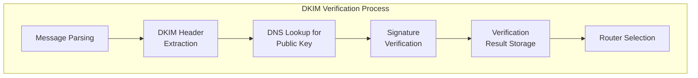
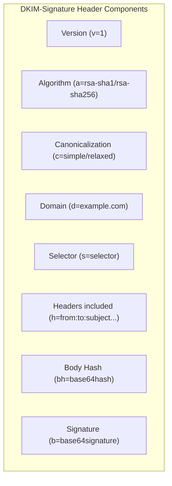
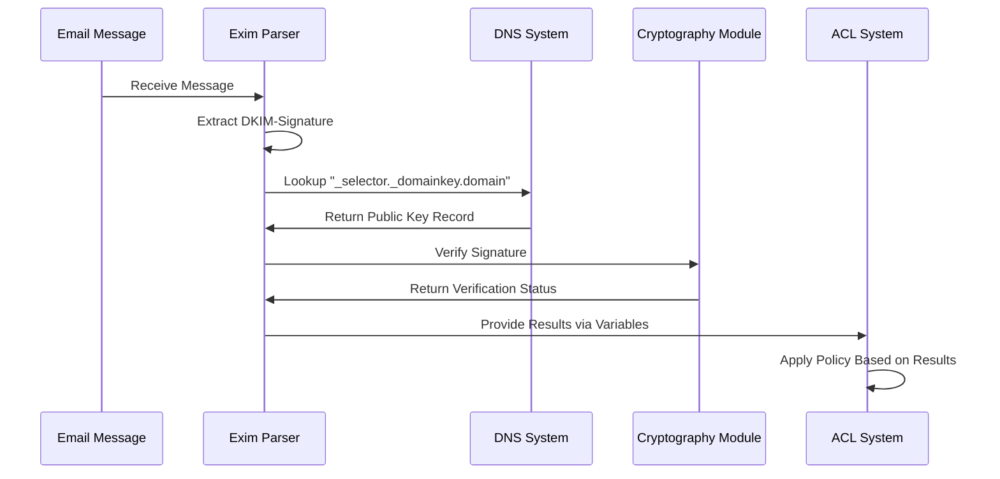
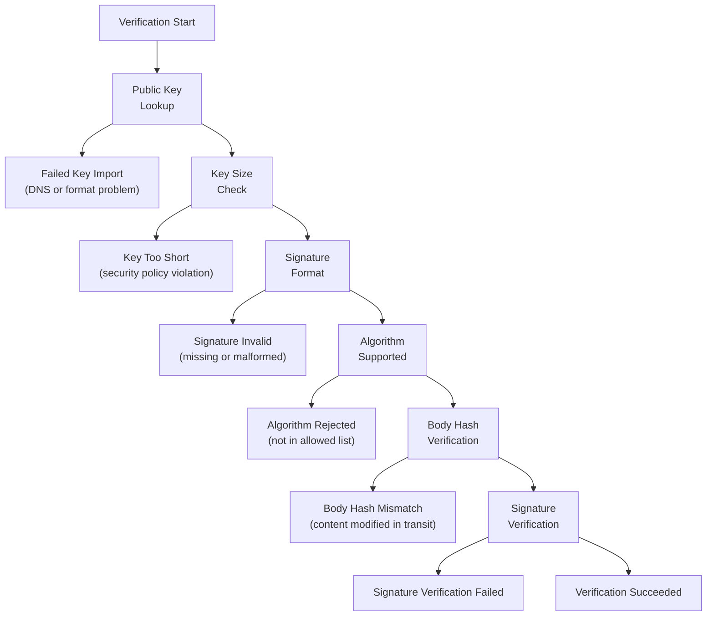
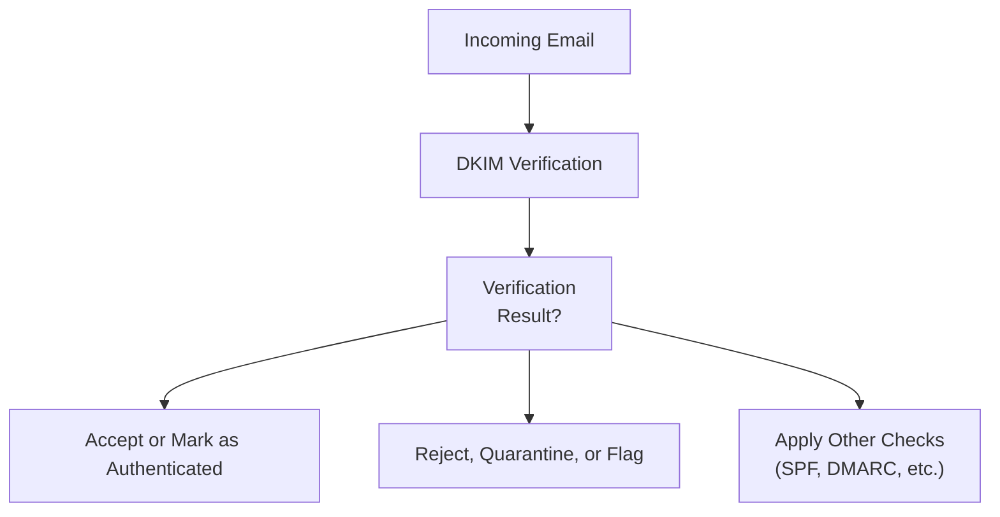

# DKIM Verification

> **Relevant source files**
> * [test/aux-fixed/4502.msg2.txt](https://github.com/Exim/exim/blob/29568b25/test/aux-fixed/4502.msg2.txt)
> * [test/aux-fixed/4502.msg3.txt](https://github.com/Exim/exim/blob/29568b25/test/aux-fixed/4502.msg3.txt)
> * [test/confs/4500](https://github.com/Exim/exim/blob/29568b25/test/confs/4500)
> * [test/log/4500](https://github.com/Exim/exim/blob/29568b25/test/log/4500)
> * [test/log/4501](https://github.com/Exim/exim/blob/29568b25/test/log/4501)
> * [test/log/4502](https://github.com/Exim/exim/blob/29568b25/test/log/4502)
> * [test/log/4506](https://github.com/Exim/exim/blob/29568b25/test/log/4506)
> * [test/scripts/4500-DKIM/4500](https://github.com/Exim/exim/blob/29568b25/test/scripts/4500-DKIM/4500)
> * [test/scripts/4500-DKIM/4506](https://github.com/Exim/exim/blob/29568b25/test/scripts/4500-DKIM/4506)
> * [test/stderr/4507](https://github.com/Exim/exim/blob/29568b25/test/stderr/4507)

## Purpose and Scope

This document explains Exim's implementation of DomainKeys Identified Mail (DKIM) verification, a crucial email authentication method that verifies message integrity and sender identity. This page covers how Exim processes and validates DKIM signatures, the configuration options available, and how to interpret verification results. For information about email authentication in general, see [Security Features](/Exim/exim/3-security-features), and for related content scanning, see [Content Scanning](/Exim/exim/3.3-content-scanning).

## Overview of DKIM Verification

DKIM verification allows receiving mail servers to confirm that incoming messages were indeed sent by authorized senders and haven't been modified during transit. In Exim's architecture, DKIM verification occurs after message parsing but before router selection, providing authentication results that can influence subsequent message handling.



Sources: test/scripts/4500-DKIM/4500, test/log/4502

## DKIM Signature Components

A DKIM signature includes multiple components that Exim parses and verifies:



Sources: test/scripts/4500-DKIM/4500, test/scripts/4500-DKIM/4506

## Verification Process

Exim's DKIM verification follows a structured process from extracting the signature to determining final status.



Sources: test/log/4502, test/log/4506

## Configuration Options

Exim provides several configuration options to control DKIM verification behavior:

| Option | Description | Example |
| --- | --- | --- |
| `dkim_verify_hashes` | Hash algorithms accepted for verification | `dkim_verify_hashes = sha256 : sha512 : sha1` |
| `dkim_verify_min_keysizes` | Minimum key sizes for different algorithms | `dkim_verify_min_keysizes = rsa=512 ed25519=250` |
| `acl_smtp_dkim` | ACL for processing during DKIM verification | `acl_smtp_dkim = check_dkim` |
| `log_selector` | Controls logging of DKIM verification details | `log_selector = +dkim_verbose` |

Sources: test/confs/4500

### Example Configuration

A basic configuration for DKIM verification might look like this:

```css
# Main settings
dkim_verify_hashes = sha256 : sha1
dkim_verify_min_keysizes = rsa=1024
acl_smtp_dkim = check_dkim
log_selector = +dkim_verbose

# ACL section
begin acl

check_dkim:
  warn
    logwrite = signer: $dkim_cur_signer bits: $dkim_key_length
  accept

check_data:
  warn
    logwrite = ${authresults {$primary_hostname}}
  accept
    dkim_status = pass
    logwrite = dkim_status includes pass
  accept
    logwrite = dkim_state DOES NOT include pass
```

Sources: test/confs/4500

## Verification Results

Exim makes verification results available through several variables that can be accessed in ACLs and used for policy decisions.

### Variables Available

| Variable | Description | Example Value |
| --- | --- | --- |
| `$dkim_cur_signer` | Domain of the currently processed signature | `test.ex` |
| `$dkim_key_length` | Bit length of the signing key | `1024` |
| `$dkim_algo` | Algorithm used for the signature | `rsa-sha1` |
| `$dkim_verify_status` | Current verification status | `pass` |
| `$dkim_verify_reason` | Reason for verification result | `body hash mismatch` |
| `$dkim_status` | Overall verification status | `pass` |

Sources: test/log/4502, test/log/4506

### Authentication-Results Header

Exim can generate an Authentication-Results header containing DKIM verification results using the `${authresults}` expansion:

```
Authentication-Results: myhost.test.ex;
    dkim=pass header.d=test.ex header.s=sel header.a=rsa-sha1
```

Sources: test/log/4500, test/log/4502

## Common Failure Scenarios

DKIM verification can fail for several reasons. Here are the most common failures and their interpretation:



Sources: test/log/4506, test/scripts/4500-DKIM/4506

### Specific Failure Types

1. **Public Key Record Issues**: * Failed key import * Syntax error in public key record
2. **Signature Problems**: * Missing signature tag * Invalid signature format * Signature verification failure
3. **Content Integrity**: * Body hash mismatch (message modified in transit)
4. **Algorithm and Size Restrictions**: * Unsupported hash algorithm * Key size too small * Algorithm mismatches between signature and policy

Sources: test/log/4506, test/scripts/4500-DKIM/4506

## Security Considerations

### Key Size Requirements

Exim enforces minimum key sizes for different algorithms to ensure adequate security:

```
dkim_verify_min_keysizes = rsa=1024 ed25519=250
```

Messages signed with keys smaller than these minimums will fail verification.

### Hash Algorithm Restrictions

Administrators can restrict which hash algorithms are accepted:

```
dkim_verify_hashes = sha256 : sha512
```

This would reject signatures using outdated algorithms like SHA-1.

### Resource Protection

Exim includes protection against resource exhaustion attacks:

1. Limits on signature count
2. Limits on line length
3. Timeouts for DNS lookups

For example, messages with excessive DKIM signatures will trigger a `EXCESS_SIGS` error, and verification will be disabled.

Sources: test/scripts/4500-DKIM/4506

## Integration with Access Control Lists

DKIM verification results can be used in ACLs to make policy decisions:



ACLs can check verification results using conditions like:

```
accept
  dkim_status = pass
  logwrite = dkim_status includes pass

deny
  condition = ${if eq{$dkim_verify_status}{fail}}
  condition = ${if eq{$dkim_verify_reason}{body hash mismatch}}
  message = Message appears to have been modified in transit
```

Sources: test/confs/4500

## Logging and Debugging

Exim provides detailed logging for DKIM verification when the appropriate log selector is enabled:

```
log_selector = +dkim_verbose
```

This produces log entries like:

```yaml
signer: test.ex bits: 1024
DKIM: d=test.ex s=sel c=relaxed/relaxed a=rsa-sha1 b=1024 [verification succeeded]
```

These logs include:

* Domain (`d=`)
* Selector (`s=`)
* Canonicalization method (`c=`)
* Algorithm (`a=`)
* Key size (`b=`)
* Verification result

Sources: test/log/4502, test/log/4500

## Implementation Details

Exim's DKIM verification is implemented as part of the message reception process. The system:

1. Extracts DKIM-Signature headers during message parsing
2. For each signature: * Fetches the public key via DNS lookup * Verifies the signature according to RFC standards * Stores the result for use in policy decisions
3. Makes results available through variables and headers

The process runs during the SMTP transaction after message data reception but before final acceptance and routing decisions.

Sources: test/scripts/4500-DKIM/4500, test/log/4502