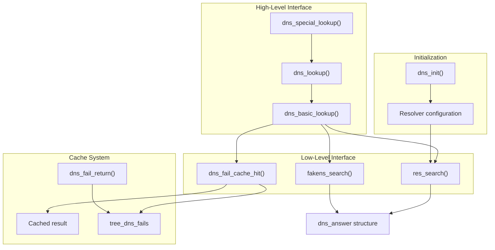
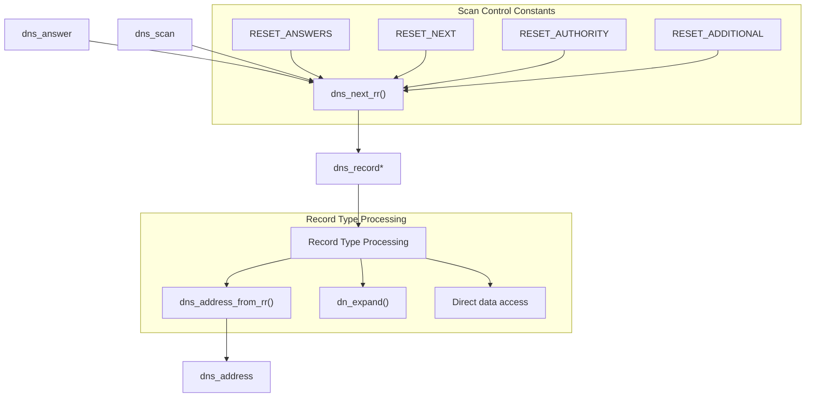
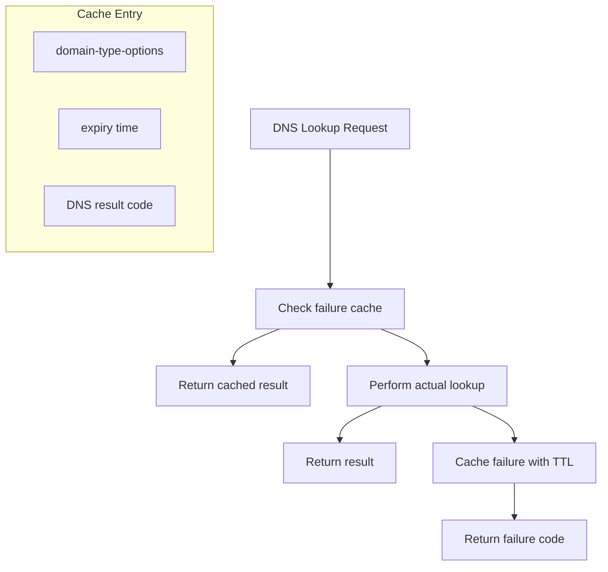
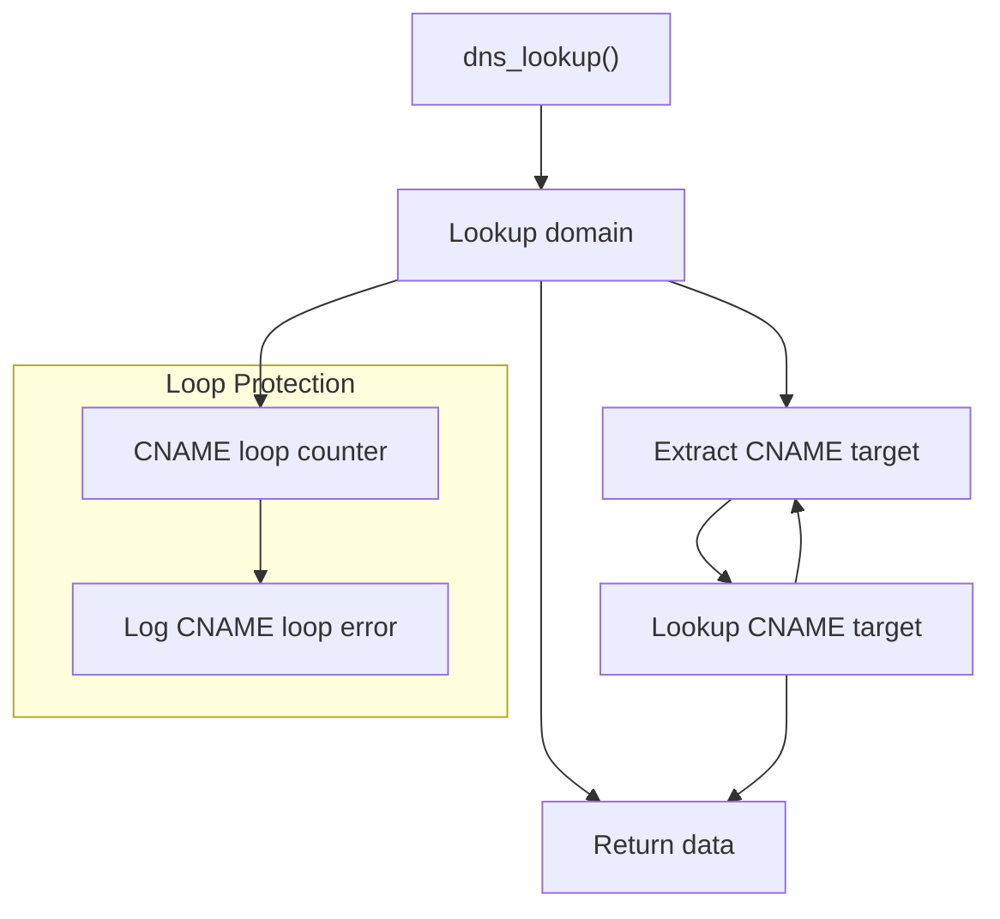
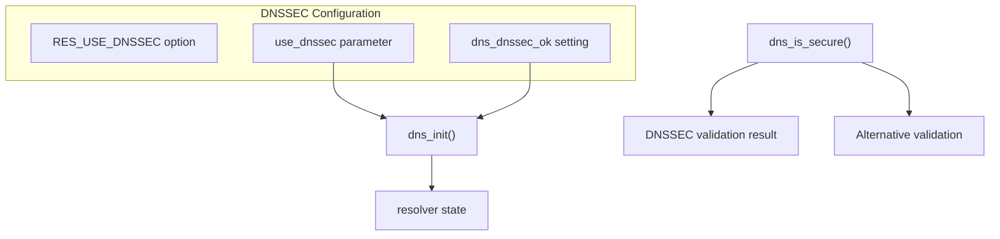
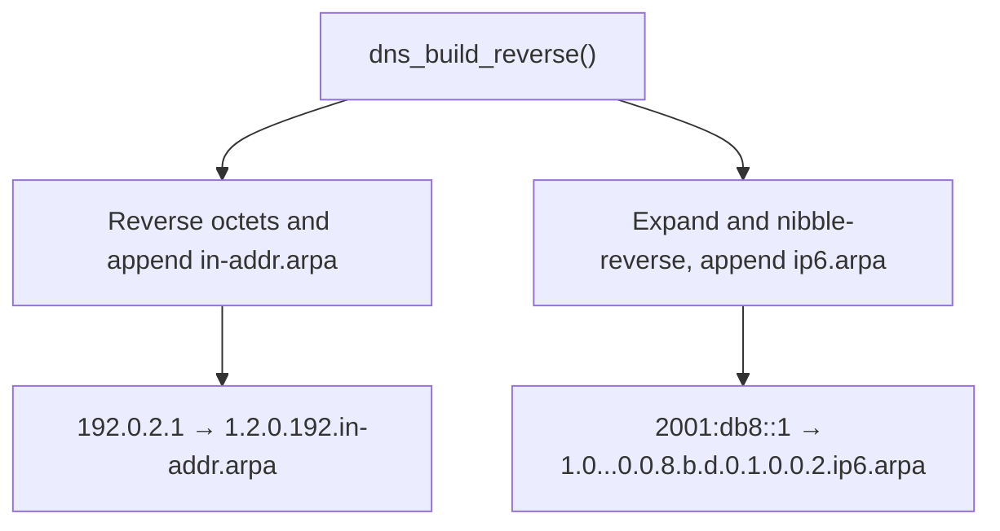
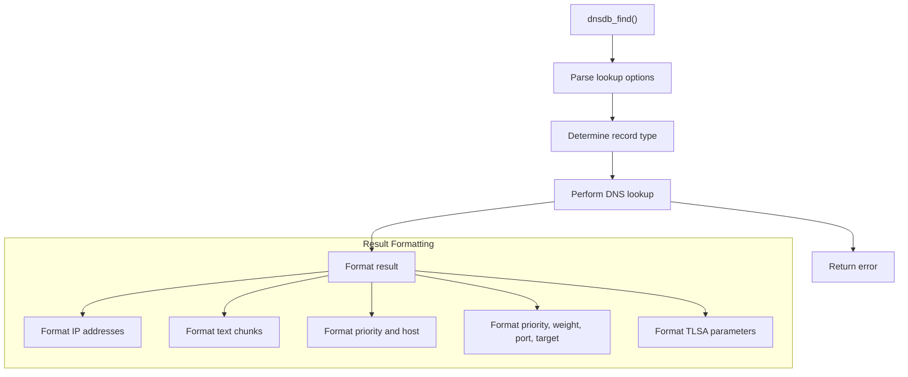
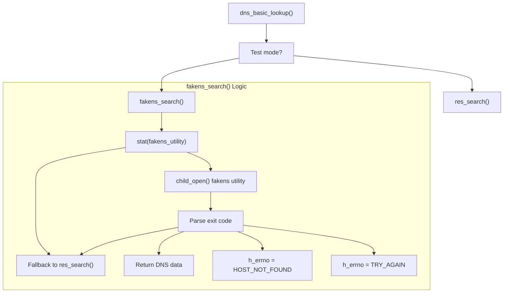

# DNS Resolution

> **Relevant source files**
> * [src/src/dns.c](https://github.com/Exim/exim/blob/29568b25/src/src/dns.c)
> * [src/src/lookups/dnsdb.c](https://github.com/Exim/exim/blob/29568b25/src/src/lookups/dnsdb.c)

This page describes how Exim performs DNS lookups, including the handling of various record types, DNS caching, failure handling, and DNSSEC verification. For information about the DNS database lookup mechanism for use in configuration files, see [DNS Database Lookups](#5.5.6).

## Overview

Exim's DNS resolution system provides a robust interface for performing DNS lookups and handling various types of DNS records. The system includes mechanisms for:

* Looking up standard and specialized DNS record types
* Following CNAME chains
* Caching DNS failures to avoid repeated timeouts
* Supporting DNSSEC validation
* Handling IPv4 and IPv6 reverse lookups
* Managing timeouts and retries

The DNS resolution system plays a critical role in both mail routing (finding MX records for delivery) and various policy checks (SPF, DKIM, etc.).

Sources: [src/src/dns.c L9-L12](https://github.com/Exim/exim/blob/29568b25/src/src/dns.c#L9-L12)

## DNS Lookup Process

### Basic DNS Lookup Flow

Exim implements a layered approach to DNS resolution, with higher-level functions building on more basic ones. The `dns_answer` structure flows through this pipeline, containing the raw DNS response data.



Sources: [src/src/dns.c L789-L989](https://github.com/Exim/exim/blob/29568b25/src/src/dns.c#L789-L989)

 [src/src/dns.c L993-L1028](https://github.com/Exim/exim/blob/29568b25/src/src/dns.c#L993-L1028)

 [src/src/dns.c L1181-L1356](https://github.com/Exim/exim/blob/29568b25/src/src/dns.c#L1181-L1356)

### DNS Results Processing

After receiving results from the DNS server, Exim processes them through record scanning functions. The `dns_scan` structure maintains position state while `dns_record` represents individual records.



Sources: [src/src/dns.c L324-L469](https://github.com/Exim/exim/blob/29568b25/src/src/dns.c#L324-L469)

 [src/src/dns.c L1362-L1409](https://github.com/Exim/exim/blob/29568b25/src/src/dns.c#L1362-L1409)

## DNS Record Types

Exim supports standard DNS record types as well as some special virtual types for specific use cases.

| Type Code | Description | Use in Exim |
| --- | --- | --- |
| T_A | IPv4 address | Host address lookups |
| T_AAAA | IPv6 address | Host address lookups |
| T_MX | Mail exchanger | Mail routing |
| T_TXT | Text record | SPF, DKIM, general text info |
| T_SPF | SPF record | Sender Policy Framework |
| T_PTR | Pointer record | Reverse DNS |
| T_CNAME | Canonical name | Aliasing |
| T_SRV | Service | Various services discovery |
| T_NS | Name server | NS lookups |
| T_SOA | Start of authority | Zone information |
| T_TLSA | TLSA record | DANE TLS authentication |

### Special Virtual Types

| Type Code | Description | Implementation |
| --- | --- | --- |
| T_MXH | MX hostnames only | Returns just the hostnames from MX records, ignoring priorities |
| T_CSA | Client SMTP Authorization | Special SRV record lookups for CSA |
| T_ZNS | Zone nameservers | Finds nameservers for a domain or the nearest enclosing zone |
| T_ADDRESSES | All addresses | Combines A and AAAA lookups (IPv4 and IPv6) |

Sources: [src/src/dns.c L582-L610](https://github.com/Exim/exim/blob/29568b25/src/src/dns.c#L582-L610)

 [src/src/lookups/dnsdb.c L32-L72](https://github.com/Exim/exim/blob/29568b25/src/src/lookups/dnsdb.c#L32-L72)

## DNS Caching and Failure Handling

### Failure Caching Mechanism

Exim caches DNS failures to prevent repeated timeouts for the same domain. Successful lookups are not explicitly cached by Exim, as it relies on the resolver's caching mechanisms.



Sources: [src/src/dns.c L617-L703](https://github.com/Exim/exim/blob/29568b25/src/src/dns.c#L617-L703)

 [src/src/dns.c L743-L788](https://github.com/Exim/exim/blob/29568b25/src/src/dns.c#L743-L788)

### Failure Types

Exim handles different types of DNS failures:

| Result Code | Meaning | Handling |
| --- | --- | --- |
| DNS_SUCCEED | Successful lookup | Return data to caller |
| DNS_NOMATCH | Name not found (NXDOMAIN) | Cached with SOA TTL |
| DNS_NODATA | Domain exists, no data for this type | Cached with SOA TTL |
| DNS_AGAIN | Soft failure (try again later) | May be treated as NOMATCH for selected domains |
| DNS_FAIL | DNS failure | Not cached with TTL |

Sources: [src/src/dns.c L789-L989](https://github.com/Exim/exim/blob/29568b25/src/src/dns.c#L789-L989)

## CNAME Resolution

Exim follows CNAME chains when looking up DNS records. If a CNAME is found, Exim performs another lookup for the target domain.



Exim has a limit on the number of CNAME redirections it will follow (controlled by `dns_cname_loops`), to prevent infinite loops.

Sources: [src/src/dns.c L993-L1174](https://github.com/Exim/exim/blob/29568b25/src/src/dns.c#L993-L1174)

## DNSSEC Support

Exim can verify DNSSEC-signed DNS responses if the underlying resolver supports it. This provides additional security by validating the authenticity of DNS responses.



Sources: [src/src/dns.c L126-L214](https://github.com/Exim/exim/blob/29568b25/src/src/dns.c#L126-L214)

 [src/src/dns.c L503-L576](https://github.com/Exim/exim/blob/29568b25/src/src/dns.c#L503-L576)

## Special DNS Functions

### Reverse DNS Construction

Exim provides a function to construct reverse DNS lookup names from IP addresses:



Sources: [src/src/dns.c L217-L297](https://github.com/Exim/exim/blob/29568b25/src/src/dns.c#L217-L297)

## DNS Database Lookup (dnsdb) {#5.5.6}

The `dnsdb` lookup is a lookup type that can be used in Exim configurations to perform DNS lookups. It has rich features for handling different record types and controlling the lookup behavior.

### dnsdb Syntax

The syntax for dnsdb lookups is:

```
${lookup dnsdb {[>][,|;][defer_XXX,][dnssec_XXX,][retry_N,][retrans_T,]type=domain}}
```

Where:

* `>` changes the output separator (default is newline)
* `,` or `;` control the behavior for multiple data items
* `defer_XXX` controls how lookup deferrals are handled (strict/lax/never)
* `dnssec_XXX` controls DNSSEC checking (strict/lax/never)
* `retry_N` sets the retry count
* `retrans_T` sets the timeout
* `type` is the DNS record type to look up
* `domain` is the domain name to query

### dnsdb Processing Flow



Sources: [src/src/lookups/dnsdb.c L131-L574](https://github.com/Exim/exim/blob/29568b25/src/src/lookups/dnsdb.c#L131-L574)

## Implementation Details

### DNS Answer Structure

The main structures used in the DNS resolution system are:

| Structure | Purpose | Key Fields |
| --- | --- | --- |
| dns_answer | Holds raw DNS response | answer (buffer), answerlen (length) |
| dns_scan | Used for scanning DNS records | aptr (current position), rrcount (records left), srr (current record) |
| dns_record | Represents a single DNS record | name, type, ttl, size, data |
| dns_address | Represents an IP address | address (string), next |

Sources: [src/src/dns.c L300-L320](https://github.com/Exim/exim/blob/29568b25/src/src/dns.c#L300-L320)

### Test Harness Integration

When `f.running_in_test_harness` is true, Exim replaces normal DNS resolution with `fakens_search()` to enable predictable testing without requiring real DNS infrastructure.



Sources: [src/src/dns.c L15-L121](https://github.com/Exim/exim/blob/29568b25/src/src/dns.c#L15-L121)