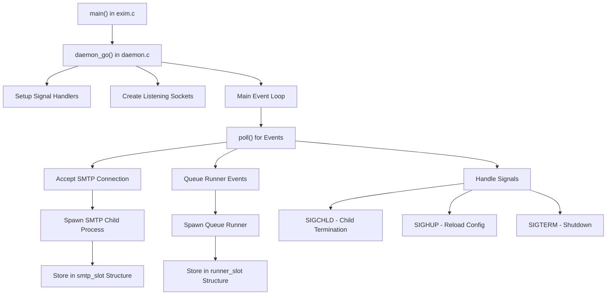
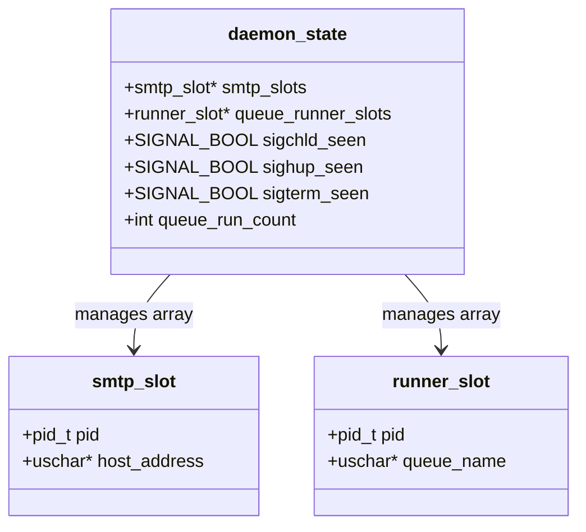
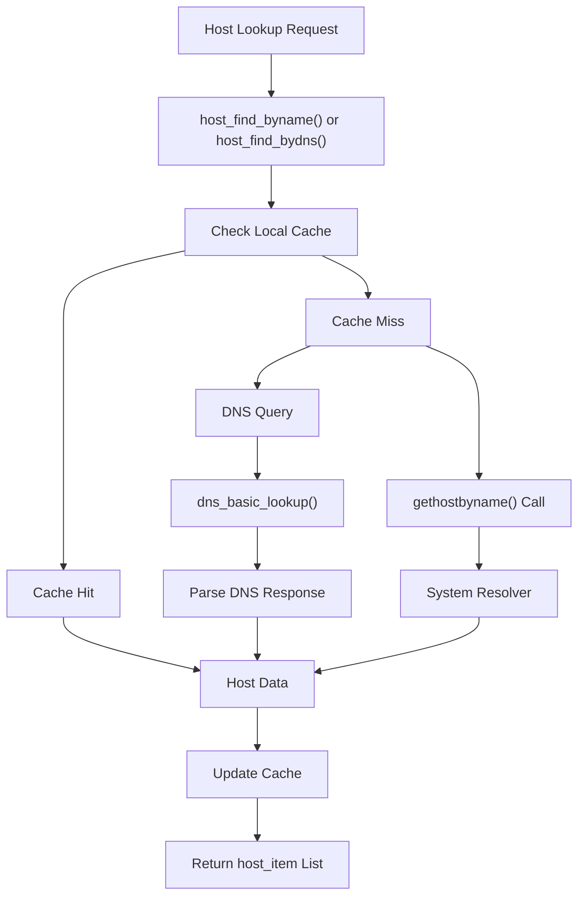
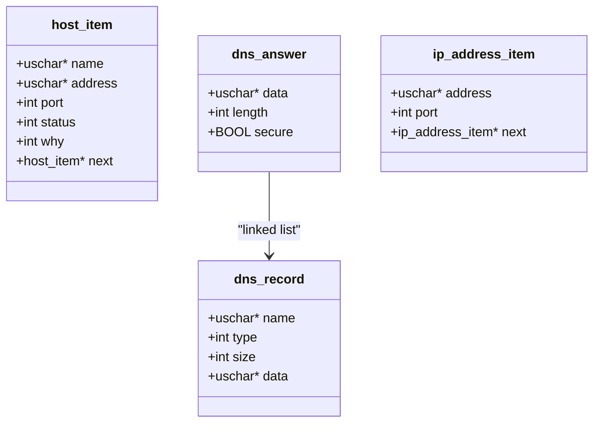
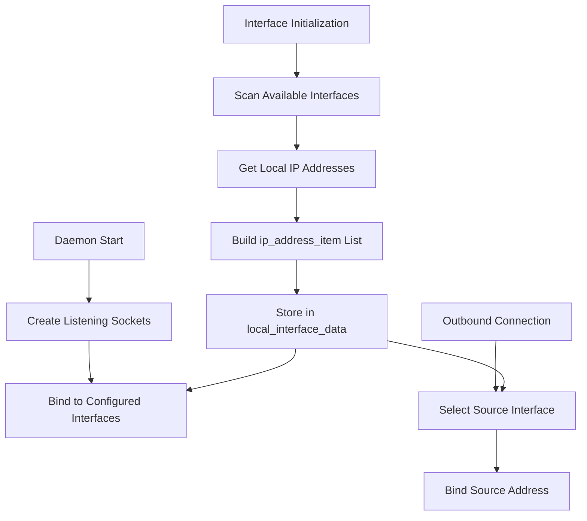
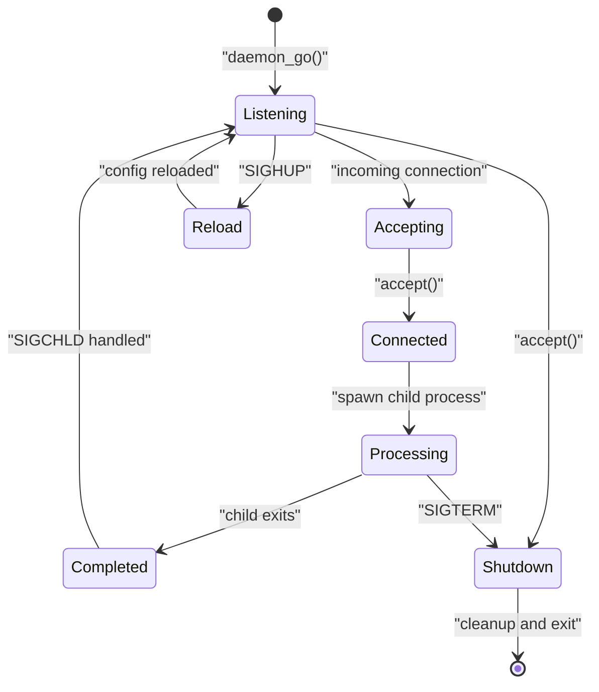
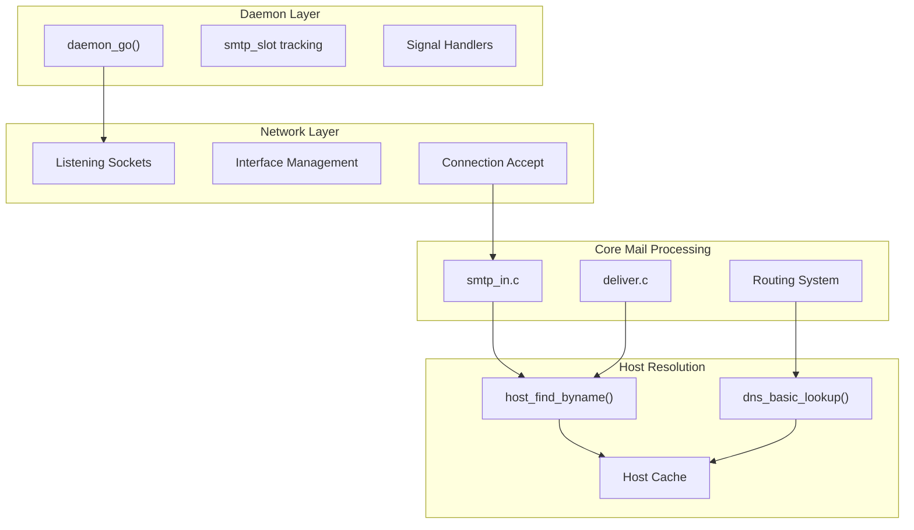
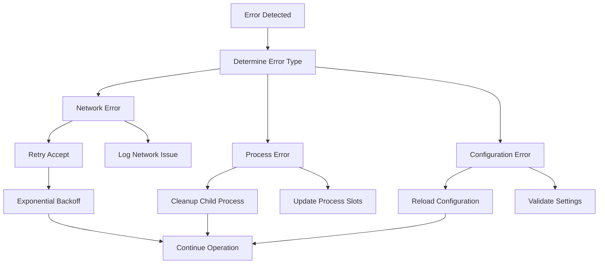

# Daemon Process and Host Functions

> **Relevant source files**
> * [doc/doc-docbook/spec.xfpt](https://github.com/Exim/exim/blob/29568b25/doc/doc-docbook/spec.xfpt)
> * [doc/doc-txt/ChangeLog](https://github.com/Exim/exim/blob/29568b25/doc/doc-txt/ChangeLog)
> * [doc/doc-txt/NewStuff](https://github.com/Exim/exim/blob/29568b25/doc/doc-txt/NewStuff)
> * [doc/doc-txt/OptionLists.txt](https://github.com/Exim/exim/blob/29568b25/doc/doc-txt/OptionLists.txt)
> * [src/src/acl.c](https://github.com/Exim/exim/blob/29568b25/src/src/acl.c)
> * [src/src/daemon.c](https://github.com/Exim/exim/blob/29568b25/src/src/daemon.c)
> * [src/src/deliver.c](https://github.com/Exim/exim/blob/29568b25/src/src/deliver.c)
> * [src/src/exim.c](https://github.com/Exim/exim/blob/29568b25/src/src/exim.c)
> * [src/src/expand.c](https://github.com/Exim/exim/blob/29568b25/src/src/expand.c)
> * [src/src/functions.h](https://github.com/Exim/exim/blob/29568b25/src/src/functions.h)
> * [src/src/globals.c](https://github.com/Exim/exim/blob/29568b25/src/src/globals.c)
> * [src/src/globals.h](https://github.com/Exim/exim/blob/29568b25/src/src/globals.h)
> * [src/src/host.c](https://github.com/Exim/exim/blob/29568b25/src/src/host.c)
> * [src/src/readconf.c](https://github.com/Exim/exim/blob/29568b25/src/src/readconf.c)
> * [src/src/receive.c](https://github.com/Exim/exim/blob/29568b25/src/src/receive.c)
> * [src/src/smtp_in.c](https://github.com/Exim/exim/blob/29568b25/src/src/smtp_in.c)
> * [src/src/structs.h](https://github.com/Exim/exim/blob/29568b25/src/src/structs.h)
> * [src/src/transport.c](https://github.com/Exim/exim/blob/29568b25/src/src/transport.c)
> * [src/src/transports/smtp.c](https://github.com/Exim/exim/blob/29568b25/src/src/transports/smtp.c)
> * [src/src/verify.c](https://github.com/Exim/exim/blob/29568b25/src/src/verify.c)

This page documents Exim's daemon process management, host resolution mechanisms, and network interface handling. These foundational systems enable Exim to operate as a persistent mail server, resolve hostnames for mail routing, and manage network connections.

For information about DNS resolution specifics, see [DNS Resolution](/Exim/exim/5.5-dns-resolution). For details about command-line utilities and process control, see [Command-line Utilities](/Exim/exim/5.7-command-line-utilities).

## Daemon Process Architecture

Exim's daemon functionality centers around the `daemon_go()` function, which establishes the main server process and manages child processes for handling SMTP connections and queue operations.

### Daemon Process Flow

The daemon maintains process tracking through two key data structures:

* `smtp_slot`: Tracks SMTP connection handler processes
* `runner_slot`: Tracks queue runner processes

Sources: [src/src/daemon.c L1-L1200](https://github.com/Exim/exim/blob/29568b25/src/src/daemon.c#L1-L1200)

 [src/src/exim.c L1-L6500](https://github.com/Exim/exim/blob/29568b25/src/src/exim.c#L1-L6500)

### Process Management Structures

Sources: [src/src/daemon.c L18-L31](https://github.com/Exim/exim/blob/29568b25/src/src/daemon.c#L18-L31)

 [src/src/daemon.c L37-L50](https://github.com/Exim/exim/blob/29568b25/src/src/daemon.c#L37-L50)

## Host Resolution System

Exim's host resolution system provides multiple mechanisms for converting hostnames to IP addresses, supporting both traditional gethostbyname() calls and direct DNS queries.

### Host Resolution Flow

Sources: [src/src/host.c L1-L4500](https://github.com/Exim/exim/blob/29568b25/src/src/host.c#L1-L4500)

 [src/src/host.c L2500-L3000](https://github.com/Exim/exim/blob/29568b25/src/src/host.c#L2500-L3000)

### Host Data Structures

The host resolution system uses several key structures to manage host information:

Sources: [src/src/structs.h L200-L250](https://github.com/Exim/exim/blob/29568b25/src/src/structs.h#L200-L250)

 [src/src/structs.h L350-L400](https://github.com/Exim/exim/blob/29568b25/src/src/structs.h#L350-L400)

## Network Interface Management

Exim manages network interfaces for both listening sockets and outbound connections through a centralized interface discovery and management system.

### Interface Discovery and Management

Sources: [src/src/host.c L25-L100](https://github.com/Exim/exim/blob/29568b25/src/src/host.c#L25-L100)

 [src/src/daemon.c L800-L1000](https://github.com/Exim/exim/blob/29568b25/src/src/daemon.c#L800-L1000)

### Connection State Management

Sources: [src/src/daemon.c L1000-L1200](https://github.com/Exim/exim/blob/29568b25/src/src/daemon.c#L1000-L1200)

 [src/src/daemon.c L400-L600](https://github.com/Exim/exim/blob/29568b25/src/src/daemon.c#L400-L600)

## Integration with Core Systems

The daemon and host functions integrate closely with Exim's core mail processing systems:

### System Integration Architecture

Sources: [src/src/daemon.c L200-L400](https://github.com/Exim/exim/blob/29568b25/src/src/daemon.c#L200-L400)

 [src/src/host.c L1500-L2000](https://github.com/Exim/exim/blob/29568b25/src/src/host.c#L1500-L2000)

 [src/src/smtp_in.c L100-L300](https://github.com/Exim/exim/blob/29568b25/src/src/smtp_in.c#L100-L300)

### Key Global Variables

The daemon and host systems rely on several global variables for state management:

| Variable | Type | Purpose |
| --- | --- | --- |
| `local_interface_data` | `ip_address_item*` | Cached local interface addresses |
| `daemon_listen_port` | `int` | Default listening port |
| `smtp_accept_max` | `int` | Maximum concurrent SMTP connections |
| `queue_run_max` | `int` | Maximum concurrent queue runners |
| `sigchld_seen` | `SIGNAL_BOOL` | Child process termination flag |
| `sighup_seen` | `SIGNAL_BOOL` | Configuration reload flag |

Sources: [src/src/globals.h L400-L600](https://github.com/Exim/exim/blob/29568b25/src/src/globals.h#L400-L600)

 [src/src/globals.c L1000-L1200](https://github.com/Exim/exim/blob/29568b25/src/src/globals.c#L1000-L1200)

 [src/src/daemon.c L37-L50](https://github.com/Exim/exim/blob/29568b25/src/src/daemon.c#L37-L50)

## Error Handling and Recovery

The daemon implements robust error handling for network and process management failures:

### Error Recovery Mechanisms

Sources: [src/src/daemon.c L600-L800](https://github.com/Exim/exim/blob/29568b25/src/src/daemon.c#L600-L800)

 [src/src/host.c L3500-L4000](https://github.com/Exim/exim/blob/29568b25/src/src/host.c#L3500-L4000)