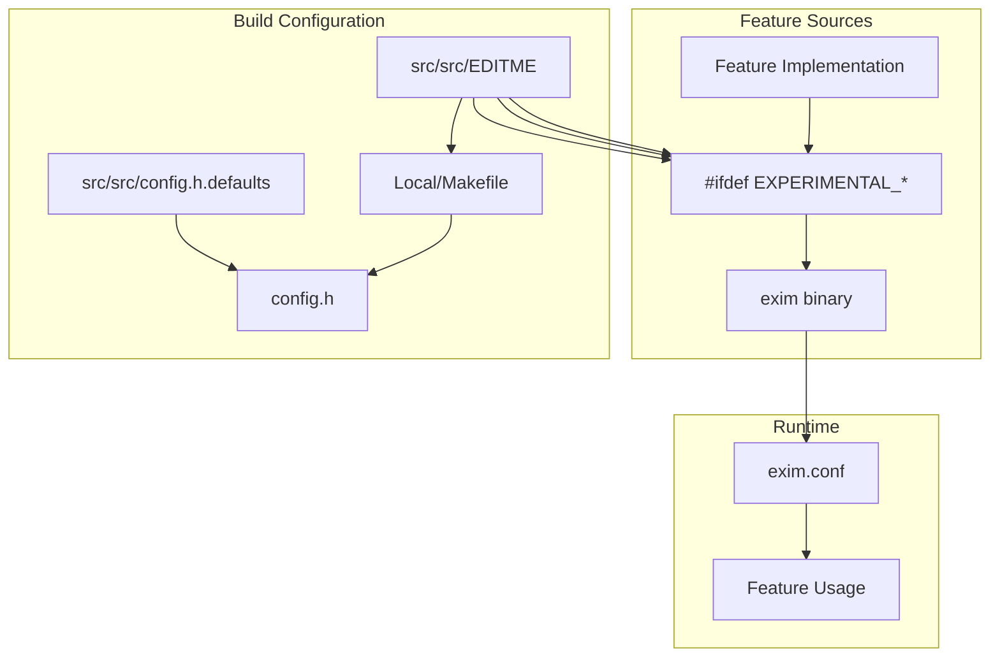
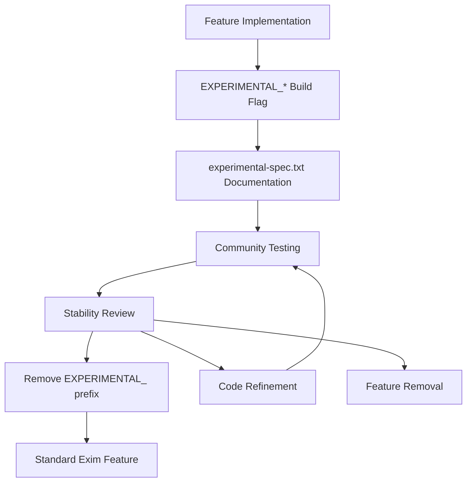
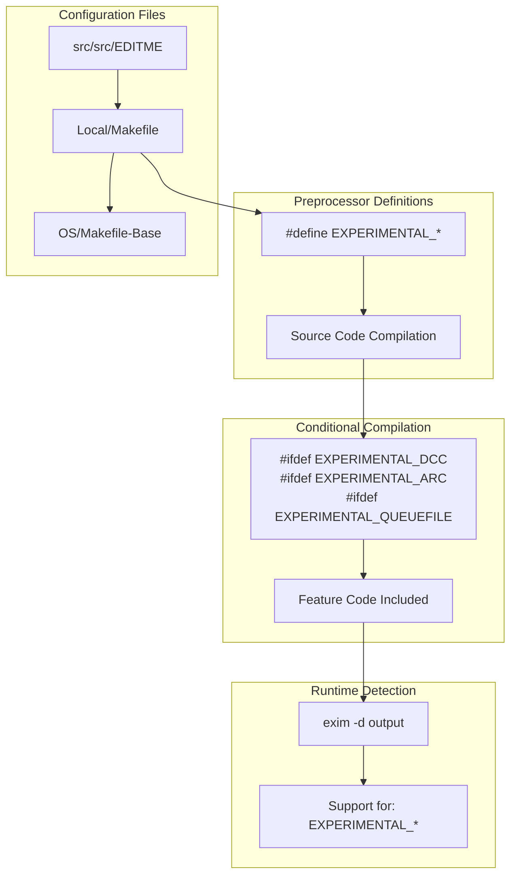
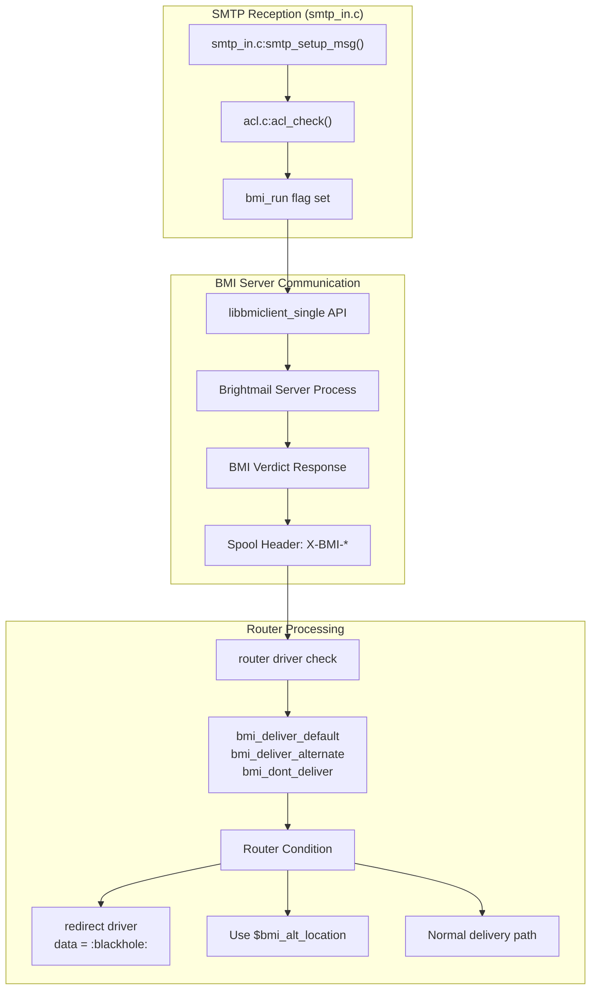
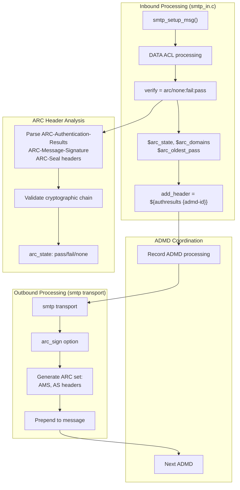

# Experimental Features

> **Relevant source files**
> * [doc/doc-txt/experimental-spec.txt](https://github.com/Exim/exim/blob/29568b25/doc/doc-txt/experimental-spec.txt)
> * [src/src/EDITME](https://github.com/Exim/exim/blob/29568b25/src/src/EDITME)
> * [src/src/config.h.defaults](https://github.com/Exim/exim/blob/29568b25/src/src/config.h.defaults)

## Purpose and Scope

This document describes the experimental features in Exim mail transfer agent. Experimental features are components that may be added to Exim from time to time but are considered unstable and liable to incompatible change. While these features provide additional functionality, they are not guaranteed to remain compatible across Exim versions and may change or be removed without warning.

For information on how Exim is configured at build time, see [Build-time Configuration](/Exim/exim/4.1-build-time-configuration). For information on runtime configuration, see [Runtime Configuration](/Exim/exim/4.2-runtime-configuration).

## What are Experimental Features?

Experimental features in Exim are functionalities that:

1. Are in development or testing phase
2. May undergo significant changes in future releases
3. Require explicit enabling through build-time options
4. Are not enabled by default in standard Exim builds

All experimental features require build-time options whose names start with `EXPERIMENTAL_` to be set in order to include the feature in the compiled binary.

## Feature Lifecycle and Build System Integration

#### Experimental Feature Integration with Build System



#### Feature Lifecycle Process



Sources: [doc/doc-txt/experimental-spec.txt L1-L6](https://github.com/Exim/exim/blob/29568b25/doc/doc-txt/experimental-spec.txt#L1-L6)

 [src/src/EDITME L659-L720](https://github.com/Exim/exim/blob/29568b25/src/src/EDITME#L659-L720)

 [src/src/config.h.defaults L218-L226](https://github.com/Exim/exim/blob/29568b25/src/src/config.h.defaults#L218-L226)

## Build-time Configuration Process

#### EXPERIMENTAL_* Build Option Processing



#### Build Configuration Steps

1. **Edit Local/Makefile** with experimental options: ``` EXPERIMENTAL_DCC=yes EXPERIMENTAL_ARC=yes   EXPERIMENTAL_QUEUEFILE=yes EXPERIMENTAL_BRIGHTMAIL=yes EXPERIMENTAL_XCLIENT=yes ```
2. **Dependencies and Libraries** (if required): ```markdown # For EXPERIMENTAL_BRIGHTMAIL CFLAGS += -I/opt/brightmail/bsdk-6.0/include LDFLAGS += -lxml2_single -lbmiclient_single # For EXPERIMENTAL_DCC   dccifd_address = /usr/local/dcc/var/dccifd ```
3. **Verify compilation**: ```markdown exim -d | grep "Support for:" # Should show: EXPERIMENTAL_DCC, EXPERIMENTAL_ARC, etc. ```

Sources: [src/src/EDITME L659-L720](https://github.com/Exim/exim/blob/29568b25/src/src/EDITME#L659-L720)

 [doc/doc-txt/experimental-spec.txt L1-L6](https://github.com/Exim/exim/blob/29568b25/doc/doc-txt/experimental-spec.txt#L1-L6)

 [src/src/config.h.defaults L218-L226](https://github.com/Exim/exim/blob/29568b25/src/src/config.h.defaults#L218-L226)

## Available Experimental Features

The following experimental features are available in Exim:

| Feature | Build Option | Code Module/Files | Runtime Configuration |
| --- | --- | --- | --- |
| Brightmail AntiSpam | EXPERIMENTAL_BRIGHTMAIL | BMI API integration | `bmi_config_file`, `bmi_run` control |
| DCC | EXPERIMENTAL_DCC | DCC client protocol | `dccifd_address`, `dcc` ACL condition |
| DSN Info | EXPERIMENTAL_DSN_INFO | DSN message enhancement | Automatic in bounce generation |
| Queuefile Transport | EXPERIMENTAL_QUEUEFILE | `transport/queuefile.c` | `driver = queuefile` |
| ARC | EXPERIMENTAL_ARC | ARC signing/verification | `verify = arc`, `arc_sign` option |
| XCLIENT | EXPERIMENTAL_XCLIENT | SMTP protocol extension | `hosts_xclient` option |
| SRV SMTPS | EXPERIMENTAL_SRV_SMTPS | DNS SRV lookup logic | `check_srv = smtp-tls` |
| TLS Early Banner | EXPERIMENTAL_TLS_EARLY_BANNER | TLS optimization | `tls_early_banner_hosts` |

Sources: [src/src/config.h.defaults L218-L226](https://github.com/Exim/exim/blob/29568b25/src/src/config.h.defaults#L218-L226)

 [src/src/EDITME L665-L718](https://github.com/Exim/exim/blob/29568b25/src/src/EDITME#L665-L718)

 [doc/doc-txt/experimental-spec.txt](https://github.com/Exim/exim/blob/29568b25/doc/doc-txt/experimental-spec.txt)

### Brightmail AntiSpam (BMI) Support

Brightmail AntiSpam is a commercial anti-spam solution that provides per-recipient scanning of messages. Exim can be integrated with this service to filter incoming mail.

#### BMI Integration Architecture



#### Implementation Steps

1. **Compile Exim with BMI support**: ``` EXPERIMENTAL_BRIGHTMAIL=yes CFLAGS=-I/path/to/the/dir/with/the/includefile EXTRALIBS_EXIM=-L/path/to/the/dir/with/the/library -lbmiclient_single ```
2. **Set up main BMI configuration**: ``` bmi_config_file = /path/to/brightmail.cfg ```
3. **ACL Configuration** for BMI processing: ```markdown # In acl_check_rcpt accept  domains = +local_domains         endpass         verify = recipient         control = bmi_run         bmi_optin = ${lookup{$local_part@$domain}lsearch{/etc/exim/bmi_optin_data}} ```
4. **Router Configuration** using BMI verdict preconditions: ```css # Blackhole router (must be first) bmi_blackhole:   driver = redirect   bmi_dont_deliver   data = :blackhole: # Alternate delivery router   bmi_alternate:   driver = redirect   bmi_deliver_alternate   data = ${extract{1}{:}{$bmi_alt_location}} # Normal delivery router localuser:   driver = accept   bmi_deliver_default   check_local_user   headers_add = X-Brightmail-Verdict: $bmi_base64_verdict   transport = local_delivery ```
5. **BMI Expansion Variables**: * `$bmi_base64_verdict`: Base64 encoded verdict * `$bmi_base64_tracker_verdict`: Rule tracking information * `$bmi_alt_location`: Alternate delivery location * `$bmi_deliver`: Delivery decision integer (0=don't deliver, 1=deliver)

Sources: [doc/doc-txt/experimental-spec.txt L9-L290](https://github.com/Exim/exim/blob/29568b25/doc/doc-txt/experimental-spec.txt#L9-L290)

### DCC Support

DCC (Distributed Checksum Clearinghouse) is a system for detecting bulk mail by comparing checksums of messages across a distributed network.

#### DCC Protocol Integration

```

```

#### Implementation and Configuration

1. **Build Configuration**: ``` EXPERIMENTAL_DCC=yes ```
2. **Main Configuration Section**: ```markdown dccifd_address = /usr/local/dcc/var/dccifd # OR for TCP connection: dccifd_address = 192.168.1.100 10025 # Optional: Force header addition at spool rewrite dcc_direct_add_header = true ```
3. **ACL Usage Pattern**: ```css # Typical DATA ACL usage defer   condition = ${if !def:acl_m_dcc_processed}         set acl_m_dcc_processed = 1         !dcc = *         log_message = DCC deferred: $dcc_result # Add custom header information warn    set acl_m_dcc_add_header = ClamAV-Result: $malware_name         condition = ${if def:malware_name} ```
4. **DCC Return Code Mapping**: * `accept`: DCC response "A" (accept) or "S" (substitute) * `defer`: DCC response "T" (temporary failure) * `fail`: DCC response "R" (reject) or "G" (greylist)
5. **Multi-host Workaround**: ```css # Override client IP for sites with multiple sending IPs warn    set acl_m_dcc_override_client_ip = \           ${lookup{$sender_helo_name}nwildlsearch{/etc/mail/multipleip_sites}{$value}{}}         condition = ${if def:acl_m_dcc_override_client_ip} ```

Sources: [doc/doc-txt/experimental-spec.txt L295-L367](https://github.com/Exim/exim/blob/29568b25/doc/doc-txt/experimental-spec.txt#L295-L367)

### DSN Extra Information

This feature adds additional information to Delivery Status Notification (DSN) fail messages ("bounces") to improve traceability.

#### Additional Information Included

1. **Remote MTA IP address**: ``` Remote-MTA: X-ip; [127.0.0.1]:587 ```
2. **Remote MTA connect-time greeting**: ``` X-Remote-MTA-smtp-greeting: X-str; 220 the.local.host.name ESMTP Exim x.yz Tue, 2 Mar 1999 09:44:33 +0000 ```
3. **Remote MTA response to HELO/EHLO**: ``` X-Remote-MTA-helo-response: X-str; 250-the.local.host.name Hello localhost [127.0.0.1] ```
4. **Detailed diagnostic information**: ```python X-Exim-Diagnostic: X-str; SMTP error from remote mail server after RCPT TO:<recipient@domain>: 550 hard error ```

Sources: [doc/doc-txt/experimental-spec.txt L371-L411](https://github.com/Exim/exim/blob/29568b25/doc/doc-txt/experimental-spec.txt#L371-L411)

### Queuefile Transport

The Queuefile transport is a pseudo-transport that doesn't perform final delivery but copies Exim spool files to an external directory while preserving the Exim spool format.

#### Purpose and Implementation

This transport allows external processes (like mail scanners) to access email queued by Exim with all the information that wouldn't be available in standard email formats.

1. **Build with Queuefile support**: ``` EXPERIMENTAL_QUEUEFILE=yes ```
2. **Configuration**: ```yaml # Router scan:    driver = accept    transport = scan # Transport scan:   driver = queuefile   directory = /path/to/external/directory ```

The transport takes only one option:

* `directory`: Specifies where messages should be copied (expanded)

Sources: [doc/doc-txt/experimental-spec.txt L413-L466](https://github.com/Exim/exim/blob/29568b25/doc/doc-txt/experimental-spec.txt#L413-L466)

### ARC Support

ARC (Authenticated Received Chain) is designed to support SPF and DKIM in the presence of intermediaries like forwarders and mailing lists by establishing a cryptographically-signed chain in headers.

#### ARC Message Processing Flow



#### Implementation

1. **Build with ARC support**: ``` EXPERIMENTAL_ARC=yes ``` (Requires DKIM and preferably SPF)
2. **Verification Configuration** (DATA ACL): ```python # Strip existing Authentication-Results from our ADMD remove_header = \N^(?i)Authentication-Results\s*::\s*example.org;\N # Perform ARC verification verify = arc/none:fail:pass # Add our Authentication-Results header add_header = :at_start:${authresults {example.org}} # Log ARC processing details logwrite = ARC: $arc_state ($arc_state_reason) domains: $arc_domains ```
3. **Signing Configuration** (smtp transport): ``` arc_sign = example.org:selector1:/path/to/private.key:timestamps,expire=+86400 ``` **Signing Options**: * `timestamps`: Add `t=` tag with current Unix timestamp * `expire[=val]`: Add `x=` tag with expiry time * Plain number: Use as-is * `+number`: Add to current time * No value: Default +30 days
4. **ARC State Variables**: ```python $arc_state            # pass, fail, none $arc_state_reason     # Detailed failure reason $arc_domains          # Colon-separated domain list from chain $arc_oldest_pass      # Lowest passing instance number ```
5. **Example Usage Pattern**: ```css # Find oldest passing AMS header logwrite = oldest-pass-ams: <${reduce {$lh_ARC-Authentication-Results:} \                                   {} \                                   {${if = {$arc_oldest_pass} \                                           {${extract {i}{${extract {1}{;}{$item}}}}} \                                           {$item} {$value}}} \                              }> ```

Sources: [doc/doc-txt/experimental-spec.txt L472-L587](https://github.com/Exim/exim/blob/29568b25/doc/doc-txt/experimental-spec.txt#L472-L587)

### Dovecot Authenticator via Inet Socket

This feature allows Exim to authenticate via Dovecot using an inet socket instead of a Unix domain socket.

#### Configuration

1. **Dovecot configuration**: ``` service auth {   inet_listener {     name = exim     port = 12345   } } ```
2. **Exim authenticator**: ``` dovecot-plain:   driver = dovecot   public_name = PLAIN   server_socket = dovecot_server_name 12345   server_tls = true   server_set_id = $auth1 ```

If `server_socket` doesn't start with `/`, it's treated as a hostname with a port number.

Sources: [doc/doc-txt/experimental-spec.txt L589-L616](https://github.com/Exim/exim/blob/29568b25/doc/doc-txt/experimental-spec.txt#L589-L616)

### XCLIENT Proxy Support

XCLIENT is an ESMTP extension supporting an inbound proxy, implementing the protocol described at [https://www.postfix.org/XCLIENT_README.html](https://www.postfix.org/XCLIENT_README.html).

#### Implementation

1. **Build with XCLIENT support**: ``` EXPERIMENTAL_XCLIENT=yes ```
2. **Server behavior**: * Advertises XCLIENT support based on `hosts_xclient` option * Handles XCLIENT commands with parameters: ADDR, NAME, PORT, LOGIN, DESTADDR, DESTPORT * Requires fresh HELO/EHLO after successful XCLIENT
3. **Variables set after successful XCLIENT**: * `$proxy_session`: Set to "yes" * `$proxy_local_address`, `$proxy_local_port`: Proxy "inside" values * `$proxy_external_address`, `$proxy_external_port`: Proxy "outside" values * `$sender_host_address`, `$sender_host_port`: Remote client values

Sources: [doc/doc-txt/experimental-spec.txt L618-L647](https://github.com/Exim/exim/blob/29568b25/doc/doc-txt/experimental-spec.txt#L618-L647)

### SRV SMTPS

This feature supports DNS SRV records for specifying TLS-on-connect services for domains.

#### Implementation

1. **Build with SRV SMTPS support**: ``` EXPERIMENTAL_SRV_SMTPS=yes ```
2. **Client behavior**: * Uses the smtp transport's `check_srv` option with value "smtp-tls" * If SRV lookup succeeds with port other than 25, uses tls-on-connect * If port is 25, uses standard connection with STARTTLS * Fallback to normal MX lookup if SRV fails
3. **Server requirements**: * Configure listening on separate port for tls-on-connect * Open firewall for that port * Provision DNS SRV record

Sources: [doc/doc-txt/experimental-spec.txt L650-L688](https://github.com/Exim/exim/blob/29568b25/doc/doc-txt/experimental-spec.txt#L650-L688)

### TLS Early Banner

This optimization allows TLS-on-connect connections using TLSv1.3 to skip waiting for client Certificate and Finished messages before sending the SMTP banner.

#### Implementation

1. **Build with TLS Early Banner support**: ``` EXPERIMENTAL_TLS_EARLY_BANNER=yes ```
2. **Configuration** in main section: ```markdown # Enable early banner for specific hosts tls_early_banner_hosts = 192.168.1.0/24 : mail.example.com # Note: Requires TLSv1.3 and no client certificate verification ```
3. **Implementation Details**: ```mermaid sequenceDiagram   participant TLS Client   participant Exim TLS Server   TLS Client->>Exim TLS Server: "TLS ClientHello"   Exim TLS Server->>TLS Client: "TLS ServerHello, Certificate, Finished"   note over Exim TLS Server: "EXPERIMENTAL_TLS_EARLY_BANNER:   Exim TLS Server->>TLS Client: "220 hostname ESMTP Exim..."   TLS Client->>Exim TLS Server: "Certificate, Finished"   TLS Client->>Exim TLS Server: "HELO/EHLO command"   note over TLS Client,Exim TLS Server: "Normal SMTP continues" ```
4. **Performance Benefits**: * Eliminates one round-trip time in TLS handshake * Compatible with TCP Fast Open for additional latency reduction * Particularly beneficial for high-latency connections

Sources: [doc/doc-txt/experimental-spec.txt L691-L708](https://github.com/Exim/exim/blob/29568b25/doc/doc-txt/experimental-spec.txt#L691-L708)

## Security Considerations

When using experimental features, consider these security implications:

1. **Stability**: Experimental features may have unresolved bugs that could affect system stability.
2. **Security**: Features may not have undergone the same level of security review as stable features.
3. **Future compatibility**: Features may change or be removed in future versions.
4. **External dependencies**: Many experimental features require external libraries or services that need separate security maintenance.
5. **Integration points**: Features like XCLIENT and Queuefile create new trust boundaries that must be properly secured.

## Summary

Experimental features provide a way to test and use new functionality in Exim before it becomes part of the standard feature set. They are enabled at build time with `EXPERIMENTAL_*` options and require specific runtime configuration. While they offer enhanced capabilities, they should be used with caution in production environments.

When considering using an experimental feature, evaluate:

* The maturity and stability of the feature
* Security implications
* Required external dependencies
* Integration with your existing mail system
* Fallback plans if the feature changes or is removed

Sources: [doc/doc-txt/experimental-spec.txt](https://github.com/Exim/exim/blob/29568b25/doc/doc-txt/experimental-spec.txt)

 [src/src/EDITME L659-L720](https://github.com/Exim/exim/blob/29568b25/src/src/EDITME#L659-L720)

 [src/src/config.h.defaults L218-L226](https://github.com/Exim/exim/blob/29568b25/src/src/config.h.defaults#L218-L226)