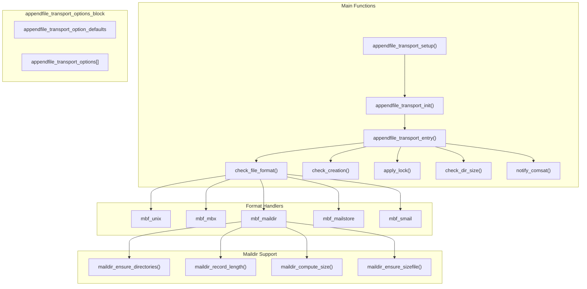
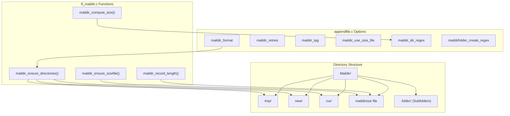
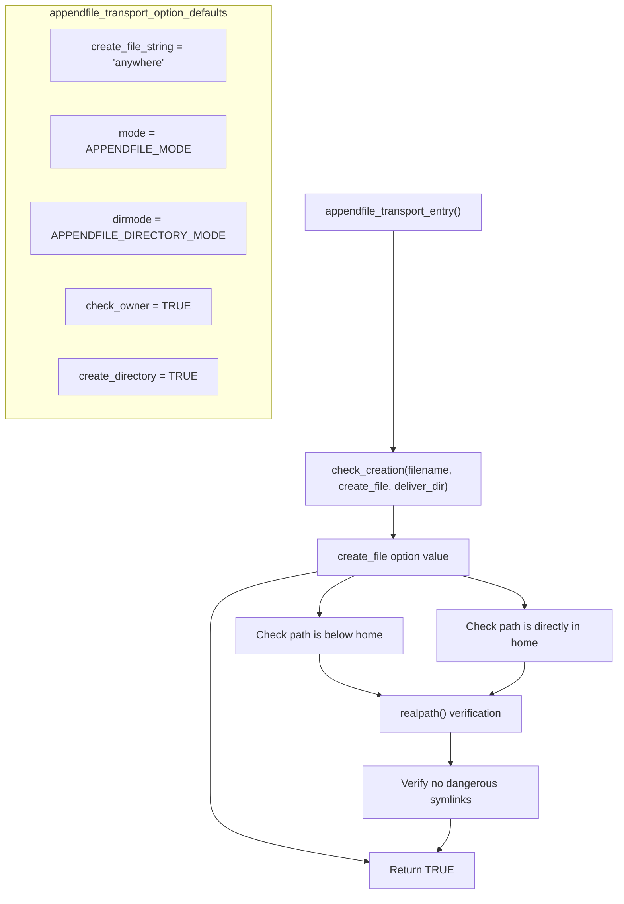
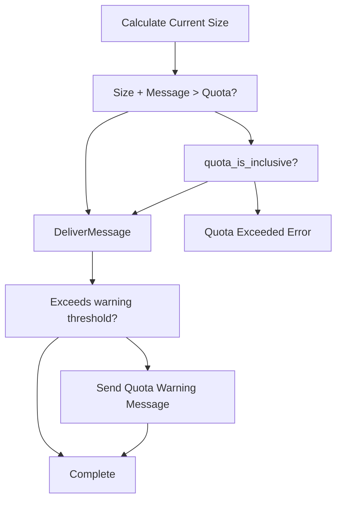
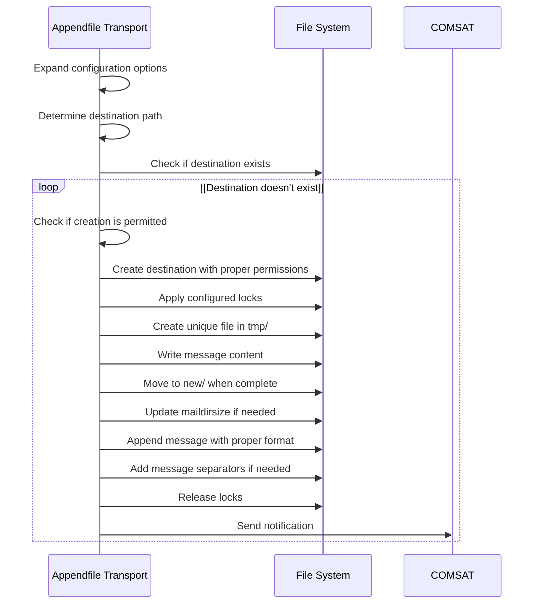

# File and Directory Storage

> **Relevant source files**
> * [src/src/transports/appendfile.c](https://github.com/Exim/exim/blob/29568b25/src/src/transports/appendfile.c)
> * [src/src/transports/autoreply.c](https://github.com/Exim/exim/blob/29568b25/src/src/transports/autoreply.c)
> * [src/src/transports/lmtp.c](https://github.com/Exim/exim/blob/29568b25/src/src/transports/lmtp.c)
> * [src/src/transports/pipe.c](https://github.com/Exim/exim/blob/29568b25/src/src/transports/pipe.c)
> * [src/src/transports/tf_maildir.c](https://github.com/Exim/exim/blob/29568b25/src/src/transports/tf_maildir.c)

This document describes Exim's appendfile transport, which is responsible for delivering mail messages to local files and directories. This includes support for multiple mailbox formats such as traditional Unix mailboxes (mbox), Maildir, MBX, and Mailstore formats, with related functionality for file locking, quota management, and permission handling.

For information about other delivery methods, see:

* [SMTP Transport](/Exim/exim/6.2-smtp-transport) for remote delivery
* [Pipe Transport](/Exim/exim/6.3-pipe-transport) for delivery to external commands
* [Autoreply Transport](/Exim/exim/6.4-autoreply-transport) for generating automated responses
* [LMTP Transport](/Exim/exim/6.5-lmtp-transport) for Local Mail Transfer Protocol delivery

## Architecture Overview

The appendfile transport is designed to handle a variety of mailbox formats while providing robust locking mechanisms and quota enforcement.

Appendfile Transport Code Flow



Sources: [src/src/transports/appendfile.c L27-L97](https://github.com/Exim/exim/blob/29568b25/src/src/transports/appendfile.c#L27-L97)

 [src/src/transports/appendfile.c L117-L139](https://github.com/Exim/exim/blob/29568b25/src/src/transports/appendfile.c#L117-L139)

 [src/src/transports/appendfile.c L145-L148](https://github.com/Exim/exim/blob/29568b25/src/src/transports/appendfile.c#L145-L148)

 [src/src/transports/tf_maildir.c L46-L568](https://github.com/Exim/exim/blob/29568b25/src/src/transports/tf_maildir.c#L46-L568)

## Supported Mailbox Formats

The appendfile transport supports multiple mailbox formats, each with different characteristics:

### Traditional Unix (mbox) Format

The default format that stores all messages in a single file with "From " lines separating messages.

* Messages are appended to a single file
* Special handling needed for "From " lines in message bodies (escaped as ">From ")
* Requires file locking to prevent corruption during delivery
* Message prefixes and suffixes can be configured

Sources: [src/src/transports/appendfile.c L472-L480](https://github.com/Exim/exim/blob/29568b25/src/src/transports/appendfile.c#L472-L480)

### Maildir Format

A format where each message is stored as a separate file in a directory structure.

Maildir Implementation Functions



Key characteristics:

* Requires `tmp`, `new`, and `cur` subdirectories via `maildir_ensure_directories()`
* No file locking required during delivery (naturally atomic)
* Better for high-volume mailboxes
* Optional quota control via `maildirsize` file managed by `maildir_ensure_sizefile()`
* Configurable via `maildir_format` option in `appendfile_transport_options[]`

Sources: [src/src/transports/appendfile.c L62-L67](https://github.com/Exim/exim/blob/29568b25/src/src/transports/appendfile.c#L62-L67)

 [src/src/transports/tf_maildir.c L46-L181](https://github.com/Exim/exim/blob/29568b25/src/src/transports/tf_maildir.c#L46-L181)

 [src/src/transports/tf_maildir.c L352-L568](https://github.com/Exim/exim/blob/29568b25/src/src/transports/tf_maildir.c#L352-L568)

### MBX Format

An enhanced mailbox format with better concurrency characteristics than traditional mbox.

* Single file with structured headers for better synchronization
* Special MBX-specific locking mechanism
* CRLF line endings by default

Sources: [src/src/transports/appendfile.c L34-L36](https://github.com/Exim/exim/blob/29568b25/src/src/transports/appendfile.c#L34-L36)

 [src/src/transports/appendfile.c L825-L903](https://github.com/Exim/exim/blob/29568b25/src/src/transports/appendfile.c#L825-L903)

### Mailstore Format

A variant of the Maildir format with a different naming convention.

* Similar to Maildir in structure
* Different file naming scheme
* Configurable prefix and suffix for message files

Sources: [src/src/transports/appendfile.c L69-L73](https://github.com/Exim/exim/blob/29568b25/src/src/transports/appendfile.c#L69-L73)

### Smail Format

A legacy format supported for compatibility reasons.

Sources: [src/src/transports/appendfile.c L145-L148](https://github.com/Exim/exim/blob/29568b25/src/src/transports/appendfile.c#L145-L148)

## Locking Mechanisms

When delivering to file-based mailboxes, locking is essential to prevent corruption. The appendfile transport supports multiple locking methods that can be used alone or in combination:

apply_lock() Function Implementation

```mermaid
sequenceDiagram
  participant appendfile_transport_entry()
  participant apply_lock()
  participant File System

  note over appendfile_transport_entry(): Uses appendfile_transport_options_block settings
  appendfile_transport_entry()->>apply_lock(): "fd, fcntltype, dofcntl, fcntltime, doflock, flocktime"
  loop [use_lockfile enabled]
    apply_lock()->>File System: "Create .lock file"
    apply_lock()->>File System: "fcntl(fd, F_SETLKW, &lock_data)"
    note over apply_lock(): "Uses lock_fcntl_timeout"
    apply_lock()->>File System: "flock(fd, LOCK_EX)"
    note over apply_lock(): "Uses lock_flock_timeout"
    apply_lock()->>File System: "MBX-specific locking"
  end
  apply_lock()-->>appendfile_transport_entry(): "Return lock status"
```

### Available Locking Methods in appendfile_transport_options[]

| Option | Default | Purpose |
| --- | --- | --- |
| `use_lockfile` | TRUE | Creates a separate lock file (`.lock` extension) |
| `use_fcntl` | TRUE | Uses `fcntl(F_SETLKW)` system call |
| `use_flock` | FALSE | Uses `flock(LOCK_EX)` system call |
| `use_mbx_lock` | FALSE | Special locking for MBX format mailboxes |
| `lock_retries` | 10 | Number of retry attempts |
| `lock_interval` | 3 | Seconds between retry attempts |
| `lock_fcntl_timeout` | 0 | Timeout for fcntl() locks |
| `lock_flock_timeout` | 0 | Timeout for flock() locks |
| `lockfile_timeout` | 30*60 | Timeout for lockfile creation |

The `apply_lock()` function handles the actual locking logic, supporting timeouts via `ALARM()` calls and retry mechanisms.

Sources: [src/src/transports/appendfile.c L777-L819](https://github.com/Exim/exim/blob/29568b25/src/src/transports/appendfile.c#L777-L819)

 [src/src/transports/appendfile.c L91-L96](https://github.com/Exim/exim/blob/29568b25/src/src/transports/appendfile.c#L91-L96)

 [src/src/transports/appendfile.c L127-L138](https://github.com/Exim/exim/blob/29568b25/src/src/transports/appendfile.c#L127-L138)

## File and Directory Creation

The appendfile transport can create files and directories if they don't exist, with several security options controlled by the `check_creation()` function:

check_creation() Security Flow



### Security Configuration in appendfile_transport_options[]

| Option | Default | Purpose |
| --- | --- | --- |
| `create_file` | "anywhere" | Controls where files can be created |
| `create_directory` | TRUE | Whether to create missing directories |
| `mode` | APPENDFILE_MODE | File permissions for created files |
| `directory_mode` | APPENDFILE_DIRECTORY_MODE | Directory permissions |
| `lockfile_mode` | APPENDFILE_LOCKFILE_MODE | Lock file permissions |
| `allow_symlink` | FALSE | Whether to allow delivery through symbolic links |
| `check_owner` | TRUE | Verify file ownership before delivery |
| `check_group` | FALSE | Verify file group before delivery |

The `check_creation()` function implements security checks including `realpath()` verification when `create_file` is set to `create_belowhome` to prevent directory traversal attacks.

Sources: [src/src/transports/appendfile.c L923-L999](https://github.com/Exim/exim/blob/29568b25/src/src/transports/appendfile.c#L923-L999)

 [src/src/transports/appendfile.c L117-L139](https://github.com/Exim/exim/blob/29568b25/src/src/transports/appendfile.c#L117-L139)

 [src/src/transports/appendfile.c L432-L443](https://github.com/Exim/exim/blob/29568b25/src/src/transports/appendfile.c#L432-L443)

## Quota Management

The appendfile transport can enforce storage quotas to limit mailbox size:

Quota Enforcement



### Maildir Quota Handling

For Maildir-format mailboxes, quota information is maintained in a `maildirsize` file:

* File contains the configured quota values and a record of message sizes
* Automatically recalculated if it becomes outdated or inconsistent
* Directory scanning performed when necessary to verify size
* Specialized regex options for determining which directories to include in quota calculations

Sources: [src/src/transports/appendfile.c L152-L157](https://github.com/Exim/exim/blob/29568b25/src/src/transports/appendfile.c#L152-L157)

 [src/src/transports/appendfile.c L648-L750](https://github.com/Exim/exim/blob/29568b25/src/src/transports/appendfile.c#L648-L750)

 [src/src/transports/tf_maildir.c L351-L568](https://github.com/Exim/exim/blob/29568b25/src/src/transports/tf_maildir.c#L351-L568)

## COMSAT Notification

The appendfile transport can notify the COMSAT daemon (biff service) when new mail arrives:

* Sends UDP notifications to the biff service
* Enables real-time mail notifications for compatible mail clients
* Can be enabled with the `notify_comsat` option

Sources: [src/src/transports/appendfile.c L499-L574](https://github.com/Exim/exim/blob/29568b25/src/src/transports/appendfile.c#L499-L574)

## Main Delivery Process

The appendfile transport follows these general steps during delivery:

Delivery Process



Sources: [src/src/transports/appendfile.c L1004-L1126](https://github.com/Exim/exim/blob/29568b25/src/src/transports/appendfile.c#L1004-L1126)

## Configuration Options

The appendfile transport configuration is defined in `appendfile_transport_options[]` array with defaults in `appendfile_transport_option_defaults`:

### Core Options from appendfile_transport_options[]

| Option | Type | Default | Purpose |
| --- | --- | --- | --- |
| `file` | opt_stringptr | NULL | Specifies a file to append to |
| `directory` | opt_stringptr | NULL | Specifies a directory to deliver to |
| `directory_file` | opt_stringptr | "q${base62:$tod_epoch}-$inode" | File naming pattern for directory delivery |
| `create_file` | opt_stringptr | "anywhere" | Where files may be created |
| `mode` | opt_octint | APPENDFILE_MODE | File permissions for created files |
| `directory_mode` | opt_octint | APPENDFILE_DIRECTORY_MODE | Directory permissions |
| `lockfile_mode` | opt_octint | APPENDFILE_LOCKFILE_MODE | Lock file permissions |

### Format-Specific Options

| Option | Type | Default | Purpose |
| --- | --- | --- | --- |
| `maildir_format` | opt_bool | FALSE | Use Maildir format for delivery |
| `maildir_retries` | opt_int | 10 | Retries for Maildir operations |
| `maildir_tag` | opt_stringptr | NULL | Tag to add to Maildir filenames |
| `maildir_use_size_file` | opt_expand_bool | FALSE | Use maildirsize file for quotas |
| `maildir_quota_directory_regex` | opt_stringptr | "^(?:cur\|new\|\\..*)$" | Regex for quota directory inclusion |
| `mbx_format` | opt_bool | FALSE | Use MBX format for delivery |
| `mailstore_format` | opt_bool | FALSE | Use Mailstore format for delivery |

### Locking Options

| Option | Type | Default | Purpose |
| --- | --- | --- | --- |
| `use_lockfile` | opt_bool_set | TRUE | Use lock file locking |
| `use_fcntl_lock` | opt_bool_set | TRUE | Use fcntl() locking |
| `use_flock_lock` | opt_bool_set | FALSE | Use flock() locking |
| `use_mbx_lock` | opt_bool_set | FALSE | Use MBX locking |
| `lock_retries` | opt_int | 10 | Number of lock retry attempts |
| `lock_interval` | opt_time | 3 | Seconds between lock retries |
| `lock_fcntl_timeout` | opt_time | 0 | Timeout for fcntl() locks |
| `lock_flock_timeout` | opt_time | 0 | Timeout for flock() locks |
| `lockfile_timeout` | opt_time | 30*60 | Timeout for lockfile creation |

### Quota and Notification Options

| Option | Type | Default | Purpose |
| --- | --- | --- | --- |
| `quota` | opt_stringptr | NULL | Maximum mailbox size in bytes |
| `quota_filecount` | opt_stringptr | NULL | Maximum number of files |
| `quota_warn_threshold` | opt_stringptr | NULL | Size threshold for warnings |
| `quota_is_inclusive` | opt_bool | TRUE | Include current message in quota check |
| `notify_comsat` | opt_bool | FALSE | Enable COMSAT/biff notification |

Sources: [src/src/transports/appendfile.c L27-L97](https://github.com/Exim/exim/blob/29568b25/src/src/transports/appendfile.c#L27-L97)

 [src/src/transports/appendfile.c L117-L139](https://github.com/Exim/exim/blob/29568b25/src/src/transports/appendfile.c#L117-L139)

## Error Handling

The appendfile transport has robust error handling for various scenarios:

* File permission errors
* Quota exceeded conditions
* File format inconsistencies
* Locking failures
* File system errors

When errors occur, the transport can:

* Defer delivery (temporary failure)
* Fail delivery (permanent failure)
* Freeze the message (for admin intervention)
* Log detailed error information

Sources: [src/src/transports/appendfile.c L1006-L1126](https://github.com/Exim/exim/blob/29568b25/src/src/transports/appendfile.c#L1006-L1126)