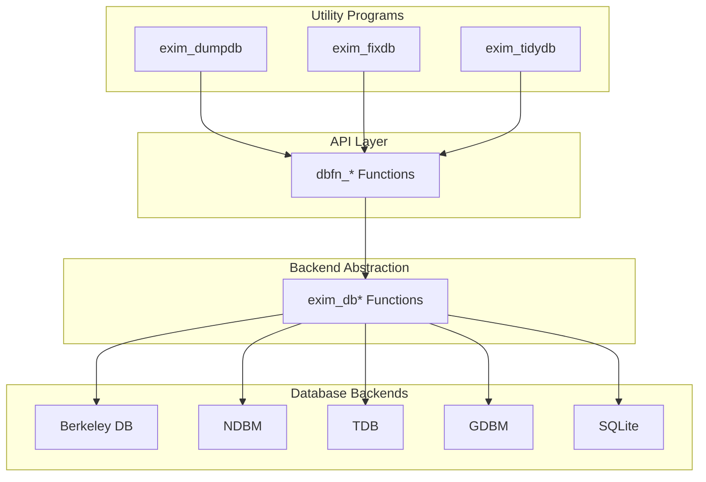
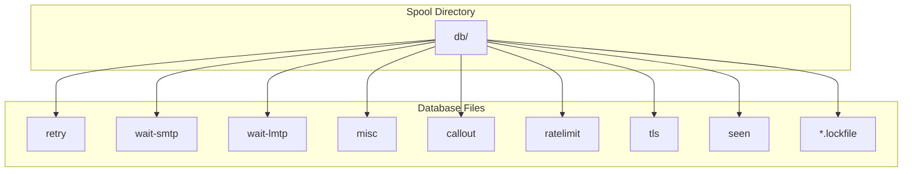
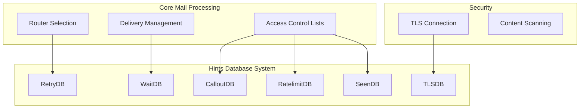

# Hints Database System

> **Relevant source files**
> * [src/src/dbfn.c](https://github.com/Exim/exim/blob/29568b25/src/src/dbfn.c)
> * [src/src/dbfunctions.h](https://github.com/Exim/exim/blob/29568b25/src/src/dbfunctions.h)
> * [src/src/exim_dbmbuild.c](https://github.com/Exim/exim/blob/29568b25/src/src/exim_dbmbuild.c)
> * [src/src/exim_dbutil.c](https://github.com/Exim/exim/blob/29568b25/src/src/exim_dbutil.c)
> * [src/src/hintsdb.h](https://github.com/Exim/exim/blob/29568b25/src/src/hintsdb.h)
> * [src/src/lookups/cdb.c](https://github.com/Exim/exim/blob/29568b25/src/src/lookups/cdb.c)
> * [src/src/lookups/dbmdb.c](https://github.com/Exim/exim/blob/29568b25/src/src/lookups/dbmdb.c)
> * [src/src/lookups/dsearch.c](https://github.com/Exim/exim/blob/29568b25/src/src/lookups/dsearch.c)
> * [src/src/lookups/lsearch.c](https://github.com/Exim/exim/blob/29568b25/src/src/lookups/lsearch.c)
> * [test/aux-fixed/2500.dir/..subdir/regfile](https://github.com/Exim/exim/blob/29568b25/test/aux-fixed/2500.dir/..subdir/regfile)
> * [test/scripts/2500-dsearch/2500](https://github.com/Exim/exim/blob/29568b25/test/scripts/2500-dsearch/2500)
> * [test/stdout/2500](https://github.com/Exim/exim/blob/29568b25/test/stdout/2500)

The Hints Database System in Exim is used for caching and storing transient state information. It provides a persistent key-value storage mechanism for various Exim subsystems. As the name suggests, the data stored are merely "hints" - the system is designed to be tolerant of data loss, as the information can be regenerated if needed. This page explains the architecture, components, and usage of the hints database system.

For information about DNS caching, see [DNS Resolution](/Exim/exim/5.5-dns-resolution). For information about file and directory storage used in mail delivery, see [File and Directory Storage](/Exim/exim/6.1-file-and-directory-storage).

## Overview

The Hints Database System provides a unified interface to different database backends. It is primarily used for:

* Caching results of expensive operations
* Storing retry information for failed deliveries
* Tracking delivery serialization (wait-* databases)
* Storing rate limiting counters
* TLS session caching
* Various ACL-related state storage

All hints databases are stored in the `$spool_directory/db/` directory, with different database files handling different types of data.

Sources: [src/src/dbfn.c L17-L65](https://github.com/Exim/exim/blob/29568b25/src/src/dbfn.c#L17-L65)

 [src/src/exim_dbutil.c L11-L30](https://github.com/Exim/exim/blob/29568b25/src/src/exim_dbutil.c#L11-L30)

## Database Types

Exim supports several types of hints databases:

| Database Name | Purpose |
| --- | --- |
| retry | Store information about delivery retries |
| wait-<transport> | Track messages waiting for delivery via specific transports |
| misc | Store miscellaneous hints data |
| callout | Cache results of callout verifications |
| ratelimit | Store data for ACL ratelimit condition |
| tls | Cache TLS session information for resumption |
| seen | Store timestamps for ACL seen condition |

Each database stores specific data structures tailored to its purpose.

Sources: [src/src/exim_dbutil.c L19-L27](https://github.com/Exim/exim/blob/29568b25/src/src/exim_dbutil.c#L19-L27)

 [src/src/exim_dbutil.c L37-L44](https://github.com/Exim/exim/blob/29568b25/src/src/exim_dbutil.c#L37-L44)

## Architecture

The Hints Database System is designed with a layered architecture to provide flexibility in backend selection while maintaining a consistent API.



Sources: [src/src/hintsdb.h L10-L63](https://github.com/Exim/exim/blob/29568b25/src/src/hintsdb.h#L10-L63)

 [src/src/dbfn.c L17-L65](https://github.com/Exim/exim/blob/29568b25/src/src/dbfn.c#L17-L65)

### Database Backends

Exim can be configured at build time to use one of several database backends:

1. **Berkeley DB** - Provides a robust, high-performance database
2. **NDBM** - Classic Unix database interface
3. **TDB** - Trivial Database, from Samba
4. **GDBM** - GNU Database Manager
5. **SQLite** - SQL database engine

The backend is selected at compile time with options like `-DUSE_DB`, `-DUSE_TDB`, etc. The hintsdb.h header provides a common interface over these different implementations.

Sources: [src/src/hintsdb.h L72-L101](https://github.com/Exim/exim/blob/29568b25/src/src/hintsdb.h#L72-L101)

## File Structure and Locking

Each hints database consists of one or more files in the `$spool_directory/db/` directory:



The database files use different extensions depending on the backend:

* Berkeley DB: `.db`
* NDBM: `.dir` and `.pag`
* TDB, GDBM, SQLite: no extension

For synchronization, each database has a corresponding `.lockfile` that is locked using fcntl() before accessing the database. This ensures that only one process can modify the database at a time.

Sources: [src/src/dbfn.c L68-L149](https://github.com/Exim/exim/blob/29568b25/src/src/dbfn.c#L68-L149)

 [src/src/exim_dbutil.c L297-L392](https://github.com/Exim/exim/blob/29568b25/src/src/exim_dbutil.c#L297-L392)

## Hints Database API

The Hints Database System provides a comprehensive API for working with databases:

### Opening and Closing Databases

```javascript
open_db *dbfn_open(const uschar *name, int flags, open_db *dbblock,
  BOOL lof, BOOL panic);
void dbfn_close(open_db *dbp);
```

The `dbfn_open` function opens a database with the given name. It takes care of creating the lock file, obtaining the lock, and opening the actual database.

For multi-transaction support:

```javascript
open_db *dbfn_open_multi(const uschar *name, int flags, open_db *dbblock);
void dbfn_close_multi(open_db *dbp);
BOOL dbfn_transaction_start(open_db *dbp);
void dbfn_transaction_commit(open_db *dbp);
```

Sources: [src/src/dbfn.c L169-L258](https://github.com/Exim/exim/blob/29568b25/src/src/dbfn.c#L169-L258)

 [src/src/dbfunctions.h L15-L27](https://github.com/Exim/exim/blob/29568b25/src/src/dbfunctions.h#L15-L27)

### Reading, Writing, and Deleting Records

```javascript
void *dbfn_read_with_length(open_db *dbblock, const uschar *key, int *length);
int dbfn_write(open_db *dbblock, const uschar *key, void *ptr, int length);
int dbfn_delete(open_db *dbblock, const uschar *key);
```

These functions handle the basic CRUD operations on database records. The `dbfn_read_with_length` function returns a pointer to the retrieved record and optionally its length. All records include a timestamp.

Sources: [src/src/dbfn.c L394-L452](https://github.com/Exim/exim/blob/29568b25/src/src/dbfn.c#L394-L452)

 [src/src/dbfn.c L484-L553](https://github.com/Exim/exim/blob/29568b25/src/src/dbfn.c#L484-L553)

### Scanning Database Keys

```
uschar *dbfn_scan(open_db *dbblock, BOOL start, EXIM_CURSOR **cursor);
```

This function allows for iterating through all the keys in a database. It's used primarily by utility programs for database maintenance.

Sources: [src/src/dbfn.c L556-L600](https://github.com/Exim/exim/blob/29568b25/src/src/dbfn.c#L556-L600)

## Data Structures

Each hints database type uses specific data structures tailored to its purpose:

### Generic Data Structure

All database records include a common header:

```python
typedef struct {
  time_t time_stamp;     /* Time this record was written */
} dbdata_generic;
```

### Retry Database

```python
typedef struct {
  time_t time_stamp;     /* Time this record was written */
  time_t first_failed;   /* Time of first failure */
  time_t last_try;       /* Time of last delivery attempt */
  time_t next_try;       /* Time for next delivery attempt */
  int basic_errno;       /* Error code for last delivery */
  int more_errno;        /* Additional error information */
  BOOL expired;          /* Delivery has been abandoned */
  uschar text[1];        /* Error text; size is actually variable */
} dbdata_retry;
```

### Wait Database

```python
typedef struct {
  time_t time_stamp;     /* Time this record was written */
  int count;             /* Number of message IDs that follow */
  int sequence;          /* For ordering the ids */
  uschar text[1];        /* First byte of list of message IDs */
} dbdata_wait;
```

Sources: [src/src/exim_dbutil.c L657-L702](https://github.com/Exim/exim/blob/29568b25/src/src/exim_dbutil.c#L657-L702)

## Utility Programs

Three utility programs are provided for managing hints databases:

### exim_dumpdb

This utility dumps the contents of a hints database in a human-readable format. It's useful for debugging and inspecting the database state.

Usage:

```
exim_dumpdb [-z] [-k] <spool-directory> <database-name>
```

Options:

* `-z`: Display times in UTC
* `-k`: Show only keys, not data

Example output for the retry database:

```
2500.tst 0 0 
10-Jun-2024 12:34:56  10-Jun-2024 12:34:56  10-Jun-2024 13:34:56
```

Sources: [src/src/exim_dbutil.c L584-L780](https://github.com/Exim/exim/blob/29568b25/src/src/exim_dbutil.c#L584-L780)

### exim_fixdb

This utility allows for modifying hints database records. It's primarily intended for testing and maintenance.

Usage:

```
exim_fixdb [-z] <spool-directory> <database-name>
```

It provides an interactive interface for examining and modifying database records.

Sources: [src/src/exim_dbutil.c L784-L1159](https://github.com/Exim/exim/blob/29568b25/src/src/exim_dbutil.c#L784-L1159)

### exim_tidydb

This utility removes obsolete entries from a hints database.

Usage:

```
exim_tidydb [-t <time>] <spool-directory> <database-name>
```

Options:

* `-t <time>`: Specifies the expiry time for old records (default: 30 days)

It deletes records that are older than the specified time and handles specific cleanup logic for different database types.

Sources: [src/src/exim_dbutil.c L1166-L1637](https://github.com/Exim/exim/blob/29568b25/src/src/exim_dbutil.c#L1166-L1637)

## Integration with Other Exim Systems

The Hints Database System is used by several other Exim components:



### Use Cases

1. **Retry Database**: Stores information about failed deliveries, including when to retry them
2. **Wait Database**: Tracks messages waiting for a specific transport to prevent concurrent deliveries
3. **Callout Cache**: Caches results of callout verifications to improve performance
4. **Ratelimit Database**: Stores counters for rate-limiting in ACLs
5. **TLS Session Cache**: Caches TLS session information for session resumption
6. **Seen Database**: Stores timestamps for the "seen" ACL condition

Sources: [src/src/dbfn.c L56-L65](https://github.com/Exim/exim/blob/29568b25/src/src/dbfn.c#L56-L65)

## Lookup Interfaces

The Hints Database System also provides several lookup interfaces that allow configuration files to query databases:

### DBM Lookup

The `dbm`, `dbmnz`, and `dbmjz` lookups provide access to DBM-format databases using the same backend as the hints database system.

Example usage:

```
${lookup{key}dbm{/path/to/file}{$value}}
```

Sources: [src/src/lookups/dbmdb.c L10-L95](https://github.com/Exim/exim/blob/29568b25/src/src/lookups/dbmdb.c#L10-L95)

### Other Related Lookups

While not directly using the hints database system, Exim also provides other lookup types:

* `lsearch`: Linear search through text files
* `dsearch`: Directory existence check
* `cdb`: Constant Database lookup

These are all file-based lookups that complement the functionality provided by the hints database system.

Sources: [src/src/lookups/lsearch.c L10-L33](https://github.com/Exim/exim/blob/29568b25/src/src/lookups/lsearch.c#L10-L33)

 [src/src/lookups/dsearch.c L10-L12](https://github.com/Exim/exim/blob/29568b25/src/src/lookups/dsearch.c#L10-L12)

 [src/src/lookups/cdb.c L10-L56](https://github.com/Exim/exim/blob/29568b25/src/src/lookups/cdb.c#L10-L56)

## Conclusion

The Hints Database System provides a flexible, robust mechanism for storing transient state information within Exim. Its design acknowledges that the data stored is not mission-critical and can be regenerated if lost, allowing for simpler implementation and greater flexibility in database backend selection.

The system's API is used extensively throughout Exim for caching results, tracking delivery attempts, and managing various state information. The utility programs provide tools for maintaining and debugging these databases when needed.