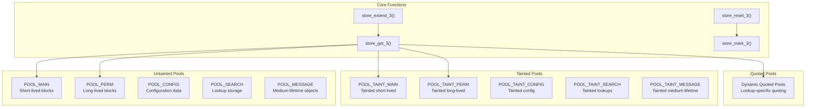
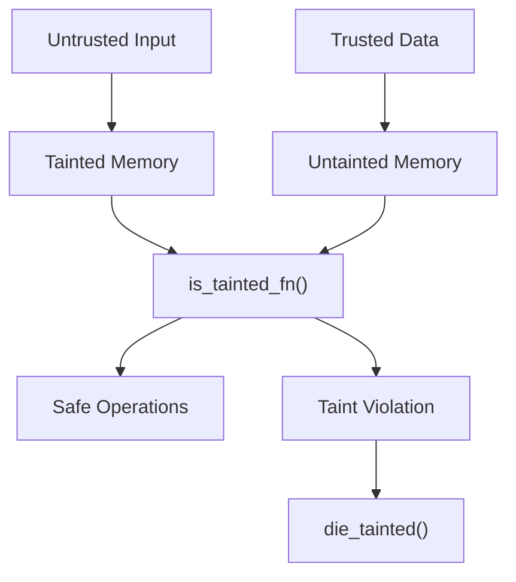
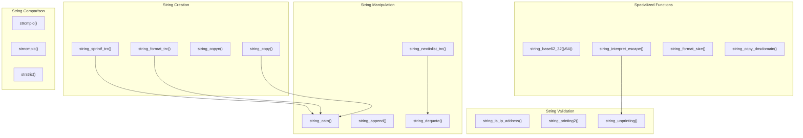
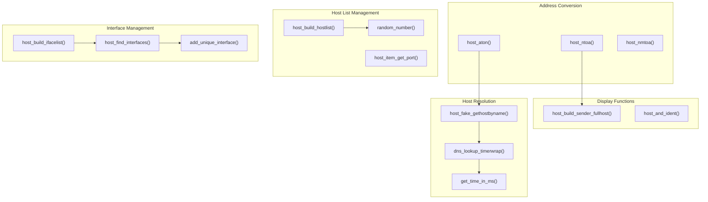
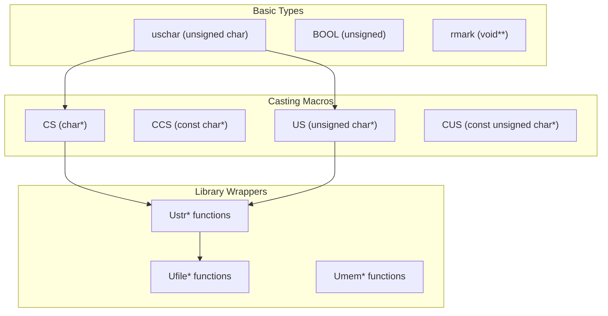
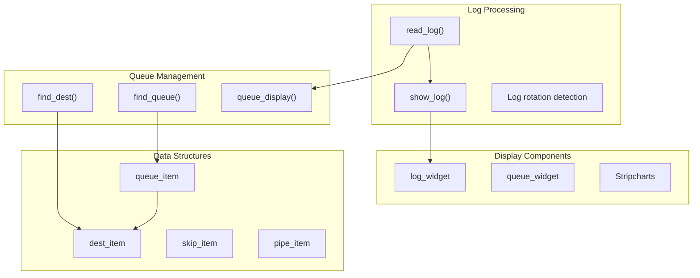

# Infrastructure and Utilities

> **Relevant source files**
> * [src/exim_monitor/em_hdr.h](https://github.com/Exim/exim/blob/29568b25/src/exim_monitor/em_hdr.h)
> * [src/exim_monitor/em_log.c](https://github.com/Exim/exim/blob/29568b25/src/exim_monitor/em_log.c)
> * [src/src/host.c](https://github.com/Exim/exim/blob/29568b25/src/src/host.c)
> * [src/src/local_scan.h](https://github.com/Exim/exim/blob/29568b25/src/src/local_scan.h)
> * [src/src/mytypes.h](https://github.com/Exim/exim/blob/29568b25/src/src/mytypes.h)
> * [src/src/store.c](https://github.com/Exim/exim/blob/29568b25/src/src/store.c)
> * [src/src/store.h](https://github.com/Exim/exim/blob/29568b25/src/src/store.h)
> * [src/src/string.c](https://github.com/Exim/exim/blob/29568b25/src/src/string.c)

This section covers the foundational systems that support Exim's core functionality. These include memory management, string processing, host resolution, type definitions, and utility interfaces that enable the mail processing pipeline to operate effectively.

For information about the core mail processing systems that use these utilities, see [Core Mail Processing](/Exim/exim/2-core-mail-processing). For details about the command-line utilities and administration tools, see [Command-line Utilities](/Exim/exim/5.7-command-line-utilities).

## Memory Management System

Exim implements a sophisticated pool-based memory allocation system that provides both performance optimization and security through taint tracking. The system manages multiple memory pools with different lifetimes and security characteristics.

### Pool Architecture



The memory system uses a `pooldesc` structure for each pool, containing chain management, allocation tracking, and statistics:

* `chainbase`: List of memory blocks in the pool
* `current_block`: Active block with free space
* `next_yield`: Next allocation point
* `yield_length`: Remaining space in current block
* `store_block_order`: Log₂ of block allocation size

### Taint Tracking

Exim's taint tracking system prevents untrusted data from being used in security-sensitive contexts. Functions like `is_tainted_fn()` determine whether memory contains tainted data, and `die_tainted()` terminates execution when taint violations occur.



Sources: [src/src/store.c L1-L865](https://github.com/Exim/exim/blob/29568b25/src/src/store.c#L1-L865)

 [src/src/store.h L1-L93](https://github.com/Exim/exim/blob/29568b25/src/src/store.h#L1-L93)

## String Processing Utilities

The string processing system provides comprehensive text manipulation capabilities with security-aware operations and specialized formatting functions.

### Core String Functions



### Growable String System

The `gstring` structure enables efficient string building through dynamic memory management:

```python
typedef struct gstring {
    int size;     // Buffer size
    int ptr;      // Current position
    uschar *s;    // String buffer
} gstring;
```

Functions like `string_catn()` handle buffer growth automatically, using `gstring_grow()` to expand capacity when needed. The system optimizes for common cases while handling edge cases safely.

### List Processing

The `string_nextinlist_trc()` function implements sophisticated list parsing with configurable separators, quoted elements, and taint-aware memory allocation. It supports dynamic separator detection through the `<char` syntax and handles escape sequences within quoted strings.

Sources: [src/src/string.c L1-L2457](https://github.com/Exim/exim/blob/29568b25/src/src/string.c#L1-L2457)

## Host and Network Functions

The host and network subsystem provides name resolution, interface management, and network address manipulation capabilities.

### Host Resolution Architecture



### Network Address Processing

The system handles both IPv4 and IPv6 addresses through functions like:

* `host_aton()`: Converts textual addresses to binary format in host byte order
* `host_ntoa()`: Converts binary addresses to textual format
* `string_is_ip_address()`: Validates IP address format with optional netmask parsing

The `host_item` structure represents hosts in lists with fields for name, address, port, MX priority, and status information.

### Interface Discovery

The `host_find_interfaces()` function discovers local network interfaces by:

1. Building interface lists from configuration (`local_interfaces`, `extra_local_interfaces`)
2. Resolving wildcard addresses (0.0.0.0, ::0) to actual interface addresses
3. Removing duplicates while preserving port specifications
4. Caching results for performance

Sources: [src/src/host.c L1-L2075](https://github.com/Exim/exim/blob/29568b25/src/src/host.c#L1-L2075)

## Basic Types and Utilities

The type system provides portable abstractions and utility macros that enable consistent coding practices across the codebase.

### Type Definitions



### Compiler Attributes

The system defines portable compiler attribute macros:

* `PRINTF_FUNCTION(A,B)`: Printf-style format checking (disabled)
* `ARG_UNUSED`: Mark unused parameters
* `WARN_UNUSED_RESULT`: Warn on ignored return values
* `ALLOC` and `ALLOC_SIZE(A)`: Memory allocation annotations
* `NORETURN`: Functions that don't return

### Library Function Wrappers

Macro wrappers like `Uatoi()`, `Ufopen()`, `Ustrlen()` provide type-safe interfaces to standard library functions while handling the `uschar`/`char` distinction consistently.

Sources: [src/src/mytypes.h L1-L157](https://github.com/Exim/exim/blob/29568b25/src/src/mytypes.h#L1-L157)

 [src/src/local_scan.h L1-L254](https://github.com/Exim/exim/blob/29568b25/src/src/local_scan.h#L1-L254)

## Local Scan and Dynamic Loading Interface

The local scan interface provides a stable ABI for extending Exim with custom message processing logic and dynamic function loading.

### Interface Architecture

```mermaid
flowchart TD

LOCALSCAN["local_scan()"]
DLFUNC["exim_dlfunc_t"]
ACCEPT["LOCAL_SCAN_ACCEPT"]
FREEZE["LOCAL_SCAN_ACCEPT_FREEZE"]
QUEUE["LOCAL_SCAN_ACCEPT_QUEUE"]
REJECT["LOCAL_SCAN_REJECT"]
TEMPREJECT["LOCAL_SCAN_TEMPREJECT"]
HEADER["header_line"]
RECIPIENT["recipient_item"]
OPTION["optionlist"]
EXPAND["expand_string()"]
HEADEROPS["header_add()/remove()"]
MATCH["lss_match_*()"]
B64["lss_b64encode()/decode()"]

LOCALSCAN --> ACCEPT
LOCALSCAN --> REJECT
DLFUNC --> ACCEPT
LOCALSCAN --> HEADER
LOCALSCAN --> RECIPIENT
LOCALSCAN --> EXPAND
LOCALSCAN --> HEADEROPS

subgraph subGraph3 ["Utility Functions"]
    EXPAND
    HEADEROPS
    MATCH
    B64
end

subgraph subGraph2 ["Data Structures"]
    HEADER
    RECIPIENT
    OPTION
end

subgraph subGraph1 ["Return Codes"]
    ACCEPT
    FREEZE
    QUEUE
    REJECT
    TEMPREJECT
end

subgraph subGraph0 ["Entry Points"]
    LOCALSCAN
    DLFUNC
end
```



### Data Structures

The interface exposes key structures for message processing:

* `header_line`: Linked list of message headers with type classification
* `recipient_item`: Recipient addresses with DSN flags and error routing
* `optionlist`: Configuration option definitions with type information

### Global Variables

Key global variables accessible to local_scan functions include:

* `message_id`: Current message identifier
* `sender_address`: Envelope sender
* `recipients_list`: Array of recipients
* `header_list`: Message headers
* `interface_address`: Connection interface

Sources: [src/src/local_scan.h L25-L254](https://github.com/Exim/exim/blob/29568b25/src/src/local_scan.h#L25-L254)

## Monitoring and Debugging Infrastructure

The Exim Monitor provides real-time visualization of mail system activity through specialized data structures and log processing capabilities.

### Monitor Architecture



### Queue Item Management

The `queue_item` structure tracks messages with fields for:

* Message identification (`name`, `dir_char`)
* Timing information (`input_time`, `update_time`)
* Status flags (`seen`, `frozen`)
* Destination list (`destinations`)

The monitor maintains linked lists of queue items and performs efficient lookups using message IDs and state tracking.

Sources: [src/exim_monitor/em_hdr.h L1-L332](https://github.com/Exim/exim/blob/29568b25/src/exim_monitor/em_hdr.h#L1-L332)

 [src/exim_monitor/em_log.c L1-L413](https://github.com/Exim/exim/blob/29568b25/src/exim_monitor/em_log.c#L1-L413)