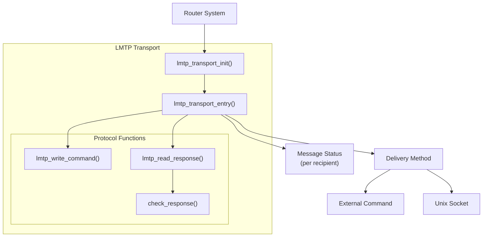
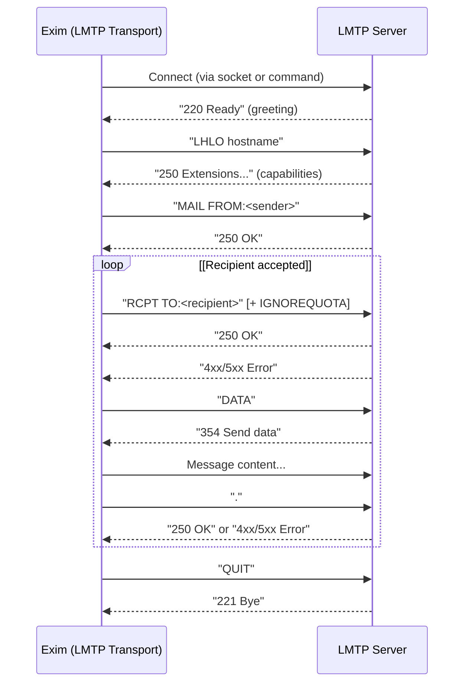
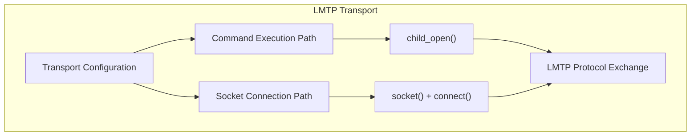
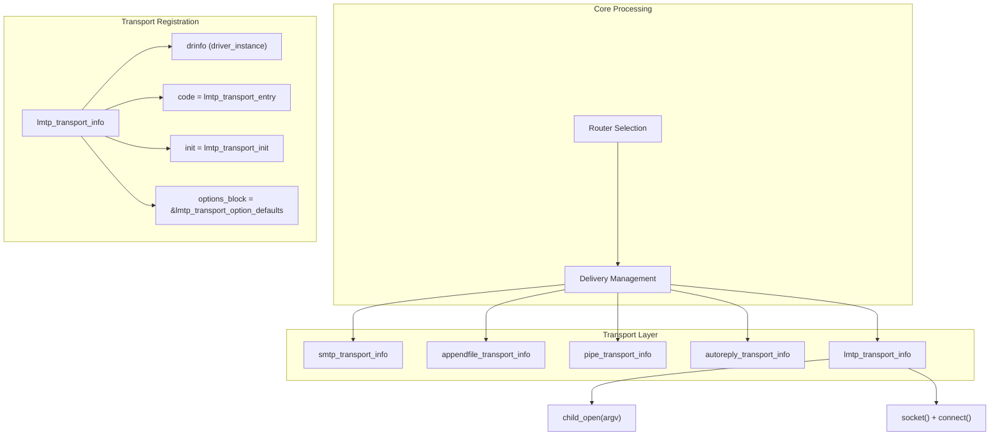

# LMTP Transport

> **Relevant source files**
> * [src/src/transports/appendfile.c](https://github.com/Exim/exim/blob/29568b25/src/src/transports/appendfile.c)
> * [src/src/transports/autoreply.c](https://github.com/Exim/exim/blob/29568b25/src/src/transports/autoreply.c)
> * [src/src/transports/lmtp.c](https://github.com/Exim/exim/blob/29568b25/src/src/transports/lmtp.c)
> * [src/src/transports/pipe.c](https://github.com/Exim/exim/blob/29568b25/src/src/transports/pipe.c)
> * [src/src/transports/tf_maildir.c](https://github.com/Exim/exim/blob/29568b25/src/src/transports/tf_maildir.c)

The LMTP Transport is a local delivery mechanism in Exim that uses the Local Mail Transfer Protocol (LMTP) to deliver messages to local mail systems. LMTP is a variant of SMTP designed specifically for transferring mail to the final delivery agent, with the key distinction that it provides per-recipient delivery status responses after message data is transmitted.

This document describes the implementation, configuration, and operation of Exim's LMTP transport. For information about other transport mechanisms, see [Transport Mechanisms](/Exim/exim/6-transport-mechanisms).

## LMTP Transport Overview

Sources: [src/src/transports/lmtp.c L78-L107](https://github.com/Exim/exim/blob/29568b25/src/src/transports/lmtp.c#L78-L107)

 [src/src/transports/lmtp.c L466-L810](https://github.com/Exim/exim/blob/29568b25/src/src/transports/lmtp.c#L466-L810)

## Configuration Options

The LMTP transport supports the following configuration options:

| Option | Type | Description |
| --- | --- | --- |
| `batch_id` | string | Identifier for batch deliveries |
| `batch_max` | integer | Maximum number of addresses in one delivery |
| `command` | string | Command to execute for LMTP delivery |
| `socket` | string | Socket to connect to for LMTP delivery |
| `ignore_quota` | boolean | Whether to use the IGNOREQUOTA extension if available |
| `timeout` | time | Timeout for LMTP operations (default: 5 minutes) |

Note that either `command` or `socket` must be specified, but not both.

Sources: [src/src/transports/lmtp.c L26-L39](https://github.com/Exim/exim/blob/29568b25/src/src/transports/lmtp.c#L26-L39)

 [src/src/transports/lmtp.c L60-L66](https://github.com/Exim/exim/blob/29568b25/src/src/transports/lmtp.c#L60-L66)

 [src/src/transports/lmtp.c L86-L89](https://github.com/Exim/exim/blob/29568b25/src/src/transports/lmtp.c#L86-L89)

## LMTP Protocol Flow

Sources: [src/src/transports/lmtp.c L564-L733](https://github.com/Exim/exim/blob/29568b25/src/src/transports/lmtp.c#L564-L733)

## Delivery Methods

The LMTP transport supports two methods of communication with an LMTP server:

1. **Command Execution**: Running an external command that speaks the LMTP protocol
2. **Unix Socket**: Connecting to a Unix domain socket where an LMTP server is listening

The initialization process ensures that exactly one of these methods is configured.

Sources: [src/src/transports/lmtp.c L492-L551](https://github.com/Exim/exim/blob/29568b25/src/src/transports/lmtp.c#L492-L551)

 [src/src/transports/lmtp.c L86-L89](https://github.com/Exim/exim/blob/29568b25/src/src/transports/lmtp.c#L86-L89)

## Implementation Details

### Initialization

The transport is initialized by the `lmtp_transport_init()` function, which:

1. Validates that either `command` or `socket` is set, but not both
2. Ensures that if a fixed uid is set, a gid is also set
3. Sets up bitwise options for message writing (CRLF line endings, dot-processing, etc.)

Sources: [src/src/transports/lmtp.c L78-L107](https://github.com/Exim/exim/blob/29568b25/src/src/transports/lmtp.c#L78-L107)

### Main Entry Point

The main entry point is `lmtp_transport_entry()`, which handles:

1. Setting up the delivery method (command or socket)
2. LMTP protocol exchanges
3. Per-recipient status tracking using `PENDING_OK` constant
4. Error handling

The transport uses the `PENDING_OK` constant (value 256) defined at line 16 to track recipients that have been accepted during the RCPT TO phase but whose final delivery status is pending until after the DATA phase completes.

Unlike some other transports, LMTP returns individual status codes for each recipient after the message data is transmitted. This allows for more granular handling of delivery failures.

Sources: [src/src/transports/lmtp.c L466-L810](https://github.com/Exim/exim/blob/29568b25/src/src/transports/lmtp.c#L466-L810)

 [src/src/transports/lmtp.c L16](https://github.com/Exim/exim/blob/29568b25/src/src/transports/lmtp.c#L16-L16)

 [src/src/transports/lmtp.c L610](https://github.com/Exim/exim/blob/29568b25/src/src/transports/lmtp.c#L610-L610)

### Protocol Functions

The LMTP transport provides several functions to handle the protocol exchange:

1. **lmtp_write_command()**: Formats and sends LMTP commands to the server * Stores commands in `big_buffer` for error reporting * Supports variable arguments for command formatting
2. **lmtp_read_response()**: Reads and parses responses from the LMTP server * Handles multi-line responses * Checks response codes against expected values * Implements timeouts
3. **check_response()**: Analyzes error responses * Determines whether temporary or permanent failures occurred * Formats appropriate error messages * Decides whether to send a QUIT command

Sources: [src/src/transports/lmtp.c L129-L208](https://github.com/Exim/exim/blob/29568b25/src/src/transports/lmtp.c#L129-L208)

 [src/src/transports/lmtp.c L228-L252](https://github.com/Exim/exim/blob/29568b25/src/src/transports/lmtp.c#L228-L252)

 [src/src/transports/lmtp.c L278-L450](https://github.com/Exim/exim/blob/29568b25/src/src/transports/lmtp.c#L278-L450)

## LMTP Transport in Exim Architecture

### Transport Registration

The LMTP transport is registered in Exim's transport system through the `lmtp_transport_info` structure:

Sources: [src/src/transports/lmtp.c L819-L835](https://github.com/Exim/exim/blob/29568b25/src/src/transports/lmtp.c#L819-L835)

 [src/src/transports/appendfile.c](https://github.com/Exim/exim/blob/29568b25/src/src/transports/appendfile.c)

 [src/src/transports/pipe.c](https://github.com/Exim/exim/blob/29568b25/src/src/transports/pipe.c)

 [src/src/transports/autoreply.c](https://github.com/Exim/exim/blob/29568b25/src/src/transports/autoreply.c)

## Error Handling

The LMTP transport handles several types of errors:

1. **Configuration errors**: Detected during initialization * Missing or conflicting options (e.g., both command and socket specified) * Missing group when user is specified
2. **Connection errors**: Failures to connect to the server * Cannot create socket * Cannot connect to socket * Cannot create child process
3. **Protocol errors**: Problems during the LMTP exchange * Timeout waiting for response * Malformed response * Unexpected response code * Connection closed unexpectedly
4. **Per-recipient errors**: Individual delivery failures * Permanent failures (5xx responses) * Temporary failures (4xx responses)

Each error type is handled appropriately, with relevant information passed back through the address structure for logging and potential retries.

Sources: [src/src/transports/lmtp.c L743-L784](https://github.com/Exim/exim/blob/29568b25/src/src/transports/lmtp.c#L743-L784)

 [src/src/transports/lmtp.c L129-L208](https://github.com/Exim/exim/blob/29568b25/src/src/transports/lmtp.c#L129-L208)

## IGNOREQUOTA Feature

The LMTP transport supports the IGNOREQUOTA extension, which allows deliveries to proceed even when the recipient's mailbox exceeds quota limits. This feature:

1. Is enabled via the `ignore_quota` option
2. Checks if the server advertises IGNOREQUOTA capability in its LHLO response
3. Adds the IGNOREQUOTA parameter to RCPT TO commands if supported

Sources: [src/src/transports/lmtp.c L579-L582](https://github.com/Exim/exim/blob/29568b25/src/src/transports/lmtp.c#L579-L582)

## Difference Between LMTP and SMTP Transports

While the LMTP and SMTP transports share similar protocol exchanges, there are key differences:

| Feature | LMTP Transport | SMTP Transport |
| --- | --- | --- |
| Protocol | LMTP (Local Mail Transfer Protocol) | SMTP (Simple Mail Transfer Protocol) |
| Purpose | Local delivery | Remote delivery |
| Greeting command | LHLO | EHLO/HELO |
| Delivery status | Per-recipient response after DATA | Single response after DATA for all recipients |
| Connection method | Command or Unix socket | TCP/IP connection |
| TLS support | No | Yes |
| Authentication | No | Yes |

The most significant difference is that LMTP provides individual delivery status responses for each recipient after the message data has been transmitted, allowing for more precise handling of delivery failures.

Sources: [src/src/transports/lmtp.c L675-L723](https://github.com/Exim/exim/blob/29568b25/src/src/transports/lmtp.c#L675-L723)

## Common Uses

The LMTP transport is commonly used for:

1. Delivering to local mail delivery agents that support LMTP, such as Dovecot or Cyrus
2. Integrating with content filtering systems that expose an LMTP interface
3. Local delivery scenarios where per-recipient status information is important

This transport is particularly useful in multi-recipient deliveries where different recipients might have different delivery outcomes (e.g., some over quota, some with invalid mailboxes).

Sources: [src/src/transports/lmtp.c](https://github.com/Exim/exim/blob/29568b25/src/src/transports/lmtp.c)