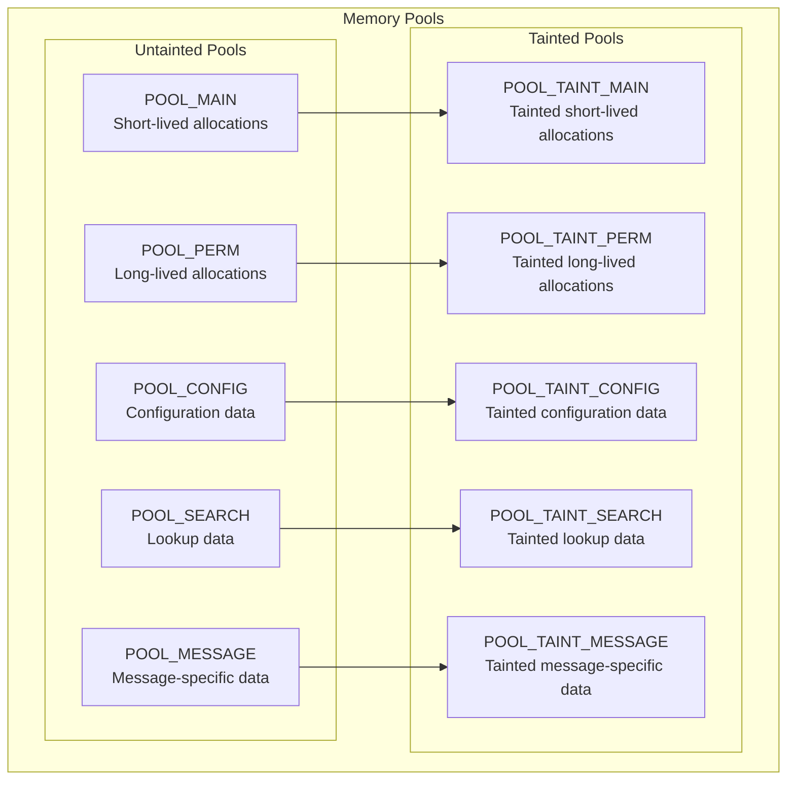
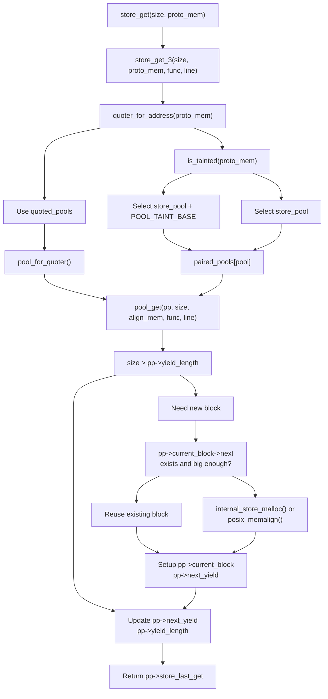
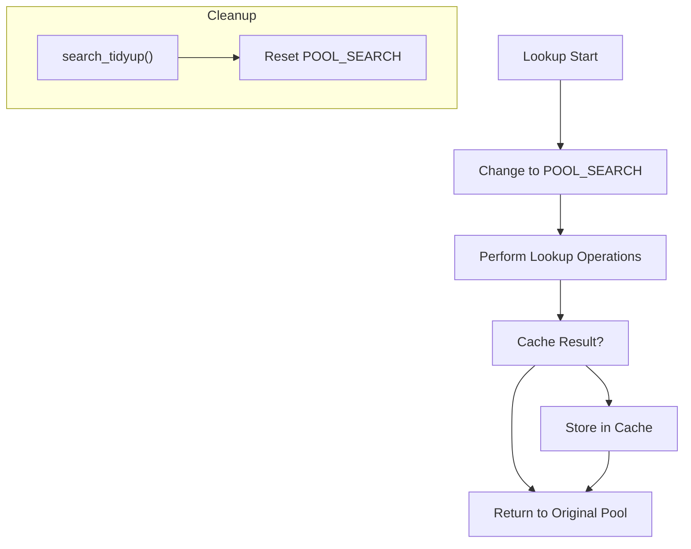

# Memory Management

> **Relevant source files**
> * [src/exim_monitor/em_hdr.h](https://github.com/Exim/exim/blob/29568b25/src/exim_monitor/em_hdr.h)
> * [src/exim_monitor/em_log.c](https://github.com/Exim/exim/blob/29568b25/src/exim_monitor/em_log.c)
> * [src/src/local_scan.h](https://github.com/Exim/exim/blob/29568b25/src/src/local_scan.h)
> * [src/src/mytypes.h](https://github.com/Exim/exim/blob/29568b25/src/src/mytypes.h)
> * [src/src/store.c](https://github.com/Exim/exim/blob/29568b25/src/src/store.c)
> * [src/src/store.h](https://github.com/Exim/exim/blob/29568b25/src/src/store.h)

## Purpose and Scope

This document explains Exim's memory management system, which provides efficient allocation and tracking of memory throughout the mail transfer agent. It covers the different memory pools, allocation functions, and security features like taint tracking. For information about storage of persistent data, see [Hints Database System](/Exim/exim/5.4-hints-database-system).

Exim implements its own memory management layer on top of the standard C memory allocation functions, providing features such as:

* Memory pools with different lifetimes
* Efficient bulk allocation with minimal overhead
* Security through taint tracking
* Low-overhead reset capability

## Memory Pool Architecture

Exim uses a "stacking pools" approach to memory management, organizing allocations into pools with different lifetimes and purposes.

### Memory Pool Types

Exim defines several pools for different memory management needs:

| Pool | Purpose | Lifetime |
| --- | --- | --- |
| POOL_MAIN | General short-lived allocations | Reset after receiving a message or specific processing |
| POOL_PERM | Long-lived, small blocks | Until process exit |
| POOL_CONFIG | Configuration data | After reading config file, made read-only |
| POOL_SEARCH | Lookup storage | Until search_tidyup() is called |
| POOL_MESSAGE | Medium-lifetime objects | Within a single message transaction |
| POOL_TAINT_* | Tainted variants of each pool | Same as untainted counterparts |

Each pool type has a "tainted" counterpart, used for storing data from untrusted sources. This creates a total of 10 paired pools.

Sources: [src/src/store.c L10-L73](https://github.com/Exim/exim/blob/29568b25/src/src/store.c#L10-L73)

 [src/src/store.h L17-L32](https://github.com/Exim/exim/blob/29568b25/src/src/store.h#L17-L32)

### Pool Architecture Diagram



Sources: [src/src/store.c L167-L171](https://github.com/Exim/exim/blob/29568b25/src/src/store.c#L167-L171)

 [src/src/store.h L17-L32](https://github.com/Exim/exim/blob/29568b25/src/src/store.h#L17-L32)

## Memory Block Structure

Memory in Exim is organized in blocks that are allocated from the system and then subdivided for use. The core data structures are `storeblock` for individual memory blocks and `pooldesc` for pool management.

### Block and Pool Structure

```

```

Each memory block starts with a `storeblock` header containing a pointer to the next block and the block length. The `pooldesc` structure manages each pool's state, tracking the block chain, current allocation point, and usage statistics.

Sources: [src/src/store.c L101-L105](https://github.com/Exim/exim/blob/29568b25/src/src/store.c#L101-L105)

 [src/src/store.c L108-L128](https://github.com/Exim/exim/blob/29568b25/src/src/store.c#L108-L128)

 [src/src/store.c L143-L144](https://github.com/Exim/exim/blob/29568b25/src/src/store.c#L143-L144)

## Memory Allocation and Management

### Basic Allocation Functions

Exim provides several memory allocation functions, implemented as macros that call internal functions with debugging information:

| Function Macro | Internal Function | Purpose |
| --- | --- | --- |
| `store_get()` | `store_get_3()` | Allocate memory from the current pool |
| `store_get_perm()` | `store_get_perm_3()` | Allocate memory from the permanent pool |
| `store_extend()` | `store_extend_3()` | Extend a previously allocated block |
| `store_reset()` | `store_reset_3()` | Release memory back to a marked point |
| `store_mark()` | `store_mark_3()` | Mark the current allocation point for later reset |
| `store_release_above()` | `store_release_above_3()` | Free memory above a specific point |
| `store_malloc()` | `store_malloc_3()` | Direct malloc wrapper with tracking |
| `store_get_quoted()` | `store_get_quoted_3()` | Allocate quoted memory for lookups |

The public macros automatically inject `__FUNCTION__` and `__LINE__` for debugging. These functions operate on paired pools (untainted/tainted) based on the prototype memory parameter.

Sources: [src/src/store.c L507-L549](https://github.com/Exim/exim/blob/29568b25/src/src/store.c#L507-L549)

 [src/src/local_scan.h L224-L229](https://github.com/Exim/exim/blob/29568b25/src/src/local_scan.h#L224-L229)

 [src/src/store.h L47-L66](https://github.com/Exim/exim/blob/29568b25/src/src/store.h#L47-L66)

### Allocation Flow Diagram



The allocation process handles quoted memory pools, taint checking, and efficient block reuse. The `pool_get()` function manages the low-level block allocation and subdivision.

Sources: [src/src/store.c L380-L485](https://github.com/Exim/exim/blob/29568b25/src/src/store.c#L380-L485)

 [src/src/store.c L507-L550](https://github.com/Exim/exim/blob/29568b25/src/src/store.c#L507-L550)

 [src/src/store.c L636-L656](https://github.com/Exim/exim/blob/29568b25/src/src/store.c#L636-L656)

## Security Through Taint Tracking

A crucial feature of Exim's memory management is "taint tracking" - a security mechanism to ensure that untrusted data (like user input) is properly handled.

### Taint Concept

* **Untainted memory**: Safe for all operations, including expansions
* **Tainted memory**: Contains potentially dangerous untrusted data
* **Quoted memory**: Specialized tainted memory that has been properly escaped for a specific context

Exim enforces security by preventing untainted memory from being modified with tainted data and ensuring tainted data is properly handled before use in sensitive contexts.

Sources: [src/src/store.c L50-L71](https://github.com/Exim/exim/blob/29568b25/src/src/store.c#L50-L71)

### Taint Tracking Implementation

```mermaid
flowchart TD

quoter_for_address["quoter_for_address(p, namep)"]
search_quoted["Search quoted_pools<br>linked list"]
return_quoter["Return quoter ID<br>or -1"]
store_get_quoted_3["store_get_quoted_3()"]
is_tainted_check["is_tainted(proto_mem)?"]
store_force_get_quoted["store_force_get_quoted()"]
store_get_3_regular["store_get_3()"]
Ustrcpy_macro["Ustrcpy(s,t)"]
Ustrcpy_impl["__Ustrcpy(s, CUS(t), func, line)"]
Ustrcat_macro["Ustrcat(s,t)"]
Ustrcat_impl["__Ustrcat(s, CUS(t), func, line)"]
taint_check["Check if destination<br>is untainted and source<br>is tainted"]
die_tainted["die_tainted(msg, func, line)"]
is_tainted_fn["is_tainted_fn(p)"]
special_values["p == GET_TAINTED<br>or GET_UNTAINTED?"]
return_status["Return TRUE/FALSE"]
check_current["Check current_block<br>of tainted pools"]
found_current["Found in current?"]
return_true["Return TRUE"]
check_all["Check all blocks<br>in tainted pools"]
found_all["Found in any block?"]
return_false["Return FALSE"]

subgraph subGraph2 ["Quoted Memory System"]
    quoter_for_address
    search_quoted
    return_quoter
    store_get_quoted_3
    is_tainted_check
    store_force_get_quoted
    store_get_3_regular
    quoter_for_address --> search_quoted
    search_quoted --> return_quoter
    store_get_quoted_3 --> is_tainted_check
    is_tainted_check --> store_force_get_quoted
    is_tainted_check --> store_get_3_regular
end

subgraph subGraph1 ["String Operations with Taint Checks"]
    Ustrcpy_macro
    Ustrcpy_impl
    Ustrcat_macro
    Ustrcat_impl
    taint_check
    die_tainted
    Ustrcpy_macro --> Ustrcpy_impl
    Ustrcat_macro --> Ustrcat_impl
    Ustrcpy_impl --> taint_check
    Ustrcat_impl --> taint_check
    taint_check --> die_tainted
end

subgraph subGraph0 ["Taint Detection"]
    is_tainted_fn
    special_values
    return_status
    check_current
    found_current
    return_true
    check_all
    found_all
    return_false
    is_tainted_fn --> special_values
    special_values --> return_status
    special_values --> check_current
    check_current --> found_current
    found_current --> return_true
    found_current --> check_all
    check_all --> found_all
    found_all --> return_true
    found_all --> return_false
end
```



The taint tracking system uses memory pool location to determine taint status. The `is_tainted_fn()` function checks if a pointer resides in any of the tainted memory pools. String operations include automatic taint checking to prevent dangerous operations.

The quoted memory system extends taint tracking for lookup contexts, using `quoted_pooldesc` structures linked in a global list to track context-specific escaping.

Sources: [src/src/store.c L297-L324](https://github.com/Exim/exim/blob/29568b25/src/src/store.c#L297-L324)

 [src/src/store.c L617-L714](https://github.com/Exim/exim/blob/29568b25/src/src/store.c#L617-L714)

 [src/src/mytypes.h L148-L152](https://github.com/Exim/exim/blob/29568b25/src/src/mytypes.h#L148-L152)

 [src/src/store.c L132-L137](https://github.com/Exim/exim/blob/29568b25/src/src/store.c#L132-L137)

## Memory Lifecycle Management

### Block Allocation and Growth Strategy

Exim uses a progressive allocation strategy where:

1. Initially, blocks are 4KB in size
2. When a pool needs more memory, it doubles the block size for the next allocation
3. This strategy balances memory usage and allocation overhead

This approach results in fewer, larger allocations as memory usage grows, reducing fragmentation and system call overhead.

Sources: [src/src/store.c L142-L162](https://github.com/Exim/exim/blob/29568b25/src/src/store.c#L142-L162)

 [src/src/store.c L456-L459](https://github.com/Exim/exim/blob/29568b25/src/src/store.c#L456-L459)

### Pool Reset Mechanism

The pool reset mechanism allows efficient reuse of memory through `store_mark_3()` and `store_reset_3()`:

```mermaid
flowchart TD

internal_store_reset["internal_store_reset(ptr, pool, func, line)"]
find_block["Find block containing ptr"]
calc_newlength["Calculate newlength =<br>bc + b->length - CS ptr"]
update_pointers["Update pp->next_yield<br>pp->yield_length"]
check_small["pp->yield_length <<br>STOREPOOL_MIN_SIZE?"]
keep_next["Keep next block if<br>is_pwr2_size(b->next->length)"]
free_chain["Free remaining block chain"]
free_rest["Free blocks after kept block"]
update_stats["Update pp->nbytes<br>pp->nblocks"]
store_reset_3["store_reset_3(rmark, func, line)"]
extract_marks["Extract untainted and<br>tainted marks from cookie"]
reset_tainted["internal_store_reset()<br>for tainted pool"]
reset_untainted["internal_store_reset()<br>for untainted pool"]
store_mark_3["store_mark_3(func, line)"]
get_untainted["store_get_3(sizeof(void*), GET_UNTAINTED)"]
get_tainted["store_get_3(0, GET_TAINTED)"]
store_mark["Store tainted mark in<br>untainted allocation"]
return_cookie["Return cookie<br>(rmark = void**)"]

subgraph subGraph2 ["Internal Reset Process"]
    internal_store_reset
    find_block
    calc_newlength
    update_pointers
    check_small
    keep_next
    free_chain
    free_rest
    update_stats
    internal_store_reset --> find_block
    find_block --> calc_newlength
    calc_newlength --> update_pointers
    update_pointers --> check_small
    check_small --> keep_next
    check_small --> free_chain
    keep_next --> free_rest
    free_rest --> update_stats
    free_chain --> update_stats
end

subgraph subGraph1 ["Reset Operation"]
    store_reset_3
    extract_marks
    reset_tainted
    reset_untainted
    store_reset_3 --> extract_marks
    extract_marks --> reset_tainted
    reset_tainted --> reset_untainted
end

subgraph subGraph0 ["Mark Operation"]
    store_mark_3
    get_untainted
    get_tainted
    store_mark
    return_cookie
    store_mark_3 --> get_untainted
    get_untainted --> get_tainted
    get_tainted --> store_mark
    store_mark --> return_cookie
end
```



The reset system uses a clever cookie mechanism: `store_mark_3()` creates markers for both untainted and tainted pools, storing the tainted marker inside an untainted allocation. This allows `store_reset_3()` to reset both pool pairs atomically.

The `internal_store_reset()` function implements the core logic, potentially keeping one block to avoid allocation thrashing if the remaining space is small and the next block is a power-of-two size.

Sources: [src/src/store.c L824-L931](https://github.com/Exim/exim/blob/29568b25/src/src/store.c#L824-L931)

 [src/src/store.c L938-L953](https://github.com/Exim/exim/blob/29568b25/src/src/store.c#L938-L953)

 [src/src/store.c L1033-L1056](https://github.com/Exim/exim/blob/29568b25/src/src/store.c#L1033-L1056)

 [src/src/store.c L883-L886](https://github.com/Exim/exim/blob/29568b25/src/src/store.c#L883-L886)

## Integration with Exim Components

### Search System Integration

The search system uses a dedicated pool (POOL_SEARCH) for all lookup-related memory allocations. This allows all lookup memory to be freed at once when search_tidyup() is called, without affecting other memory usage.



Sources: [src/src/search.c L345-L339](https://github.com/Exim/exim/blob/29568b25/src/src/search.c#L345-L339)

### Memory Pool Usage in Monitor

The Exim monitor application also uses the same memory management system, benefiting from the efficient allocation and reset capabilities, particularly for log processing and queue management.

Sources: [src/exim_monitor/em_log.c L246-L247](https://github.com/Exim/exim/blob/29568b25/src/exim_monitor/em_log.c#L246-L247)

 [src/exim_monitor/em_hdr.h L167-L210](https://github.com/Exim/exim/blob/29568b25/src/exim_monitor/em_hdr.h#L167-L210)

## Debug and Maintenance Features

Exim's memory management includes several debugging features:

1. **Memory Statistics**: Tracking of allocation counts, sizes, and maximum usage
2. **Debug Logging**: Optional detailed logging of memory operations
3. **Memory Validation**: Checks for memory corruption or leaks
4. **Taint Violation Detection**: Runtime detection of tainted data misuse

These features help identify and debug memory-related issues during development and troubleshooting.

Sources: [src/src/store.c L118-L127](https://github.com/Exim/exim/blob/29568b25/src/src/store.c#L118-L127)

 [src/src/store.c L529-L533](https://github.com/Exim/exim/blob/29568b25/src/src/store.c#L529-L533)

## Technical Implementation Notes

### Alignment Handling

Memory allocations are aligned to the greater of `sizeof(void*)` or `sizeof(double)` to ensure all types can be efficiently accessed without alignment issues.

Sources: [src/src/store.c L84-L92](https://github.com/Exim/exim/blob/29568b25/src/src/store.c#L84-L92)

 [src/src/store.c L400](https://github.com/Exim/exim/blob/29568b25/src/src/store.c#L400-L400)

### Overflow Protection

The system includes safeguards against integer overflow in allocation sizes, helping prevent security vulnerabilities.

```python
if (size < 0 || size >= INT_MAX/2)
  log_write_die(0, LOG_MAIN,
        "bad memory allocation requested (%d bytes) from %s %d",
        size, func, linenumber);
```

Sources: [src/src/store.c L389-L392](https://github.com/Exim/exim/blob/29568b25/src/src/store.c#L389-L392)

### Memory Limitation Strategies

On resource-constrained systems, Exim can be compiled with `RESTRICTED_MEMORY` which disables the progressive block growth strategy, maintaining a consistent allocation size.

Sources: [src/src/store.c L160](https://github.com/Exim/exim/blob/29568b25/src/src/store.c#L160-L160)

 [src/src/store.c L918](https://github.com/Exim/exim/blob/29568b25/src/src/store.c#L918-L918)