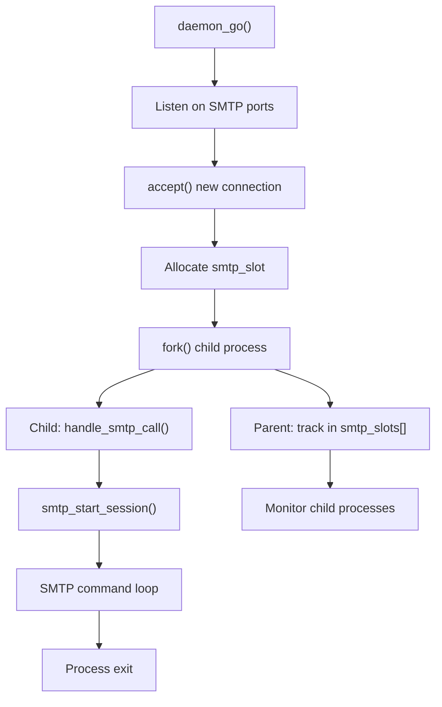
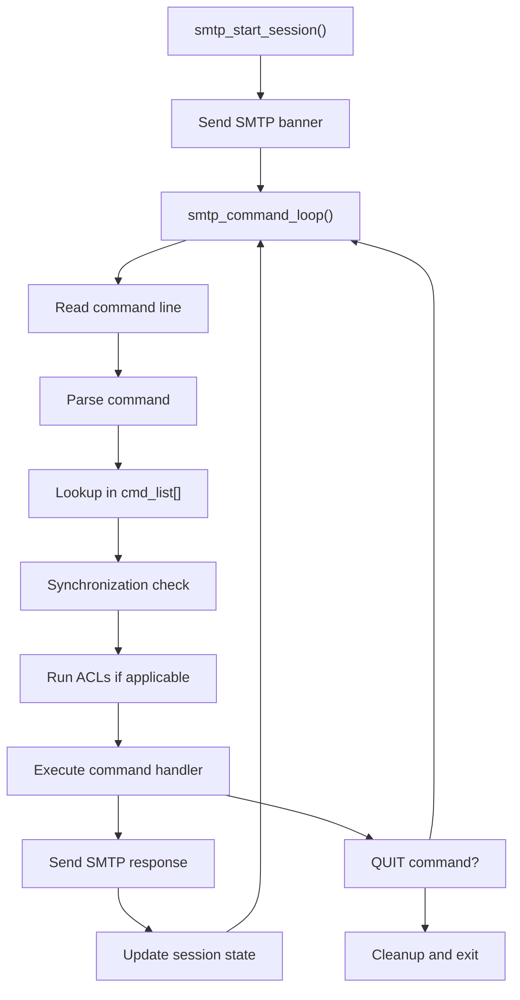
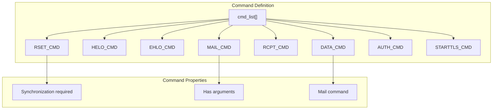
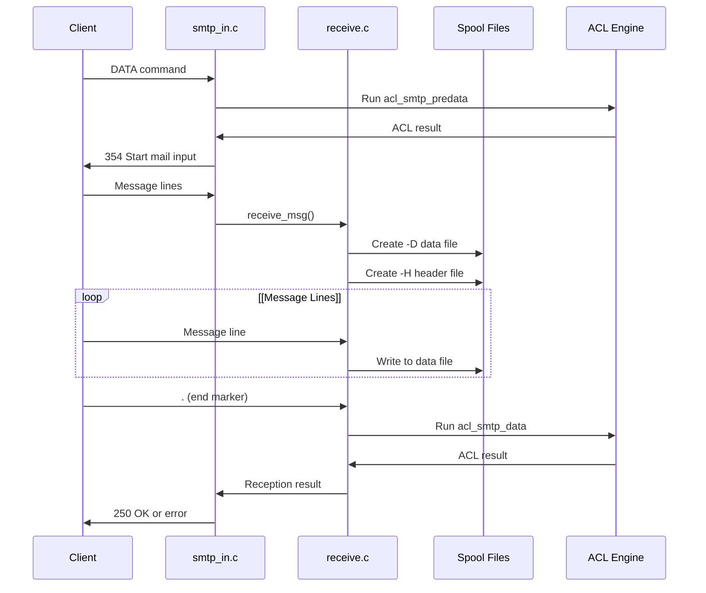
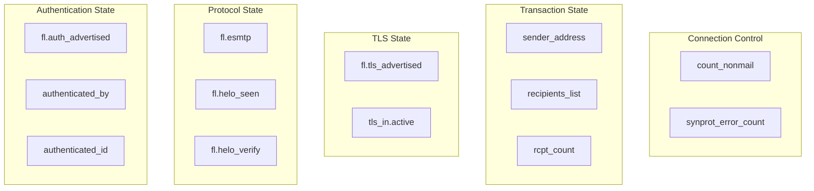
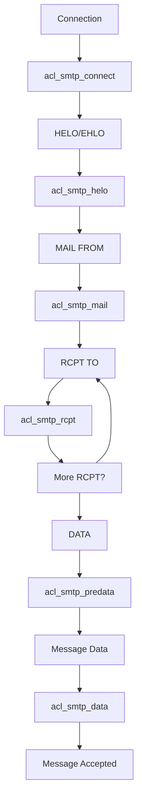

# Message Reception and SMTP

> **Relevant source files**
> * [doc/doc-docbook/spec.xfpt](https://github.com/Exim/exim/blob/29568b25/doc/doc-docbook/spec.xfpt)
> * [doc/doc-txt/ChangeLog](https://github.com/Exim/exim/blob/29568b25/doc/doc-txt/ChangeLog)
> * [doc/doc-txt/NewStuff](https://github.com/Exim/exim/blob/29568b25/doc/doc-txt/NewStuff)
> * [doc/doc-txt/OptionLists.txt](https://github.com/Exim/exim/blob/29568b25/doc/doc-txt/OptionLists.txt)
> * [src/src/acl.c](https://github.com/Exim/exim/blob/29568b25/src/src/acl.c)
> * [src/src/daemon.c](https://github.com/Exim/exim/blob/29568b25/src/src/daemon.c)
> * [src/src/deliver.c](https://github.com/Exim/exim/blob/29568b25/src/src/deliver.c)
> * [src/src/exim.c](https://github.com/Exim/exim/blob/29568b25/src/src/exim.c)
> * [src/src/expand.c](https://github.com/Exim/exim/blob/29568b25/src/src/expand.c)
> * [src/src/functions.h](https://github.com/Exim/exim/blob/29568b25/src/src/functions.h)
> * [src/src/globals.c](https://github.com/Exim/exim/blob/29568b25/src/src/globals.c)
> * [src/src/globals.h](https://github.com/Exim/exim/blob/29568b25/src/src/globals.h)
> * [src/src/readconf.c](https://github.com/Exim/exim/blob/29568b25/src/src/readconf.c)
> * [src/src/receive.c](https://github.com/Exim/exim/blob/29568b25/src/src/receive.c)
> * [src/src/smtp_in.c](https://github.com/Exim/exim/blob/29568b25/src/src/smtp_in.c)
> * [src/src/structs.h](https://github.com/Exim/exim/blob/29568b25/src/src/structs.h)
> * [src/src/transport.c](https://github.com/Exim/exim/blob/29568b25/src/src/transport.c)
> * [src/src/transports/smtp.c](https://github.com/Exim/exim/blob/29568b25/src/src/transports/smtp.c)
> * [src/src/verify.c](https://github.com/Exim/exim/blob/29568b25/src/src/verify.c)

## Purpose and Scope

This document covers Exim's SMTP server implementation, focusing on how inbound SMTP connections are established, managed, and processed through to message acceptance. It details the protocol handling, command processing, message data reception, and integration with Exim's access control systems.

For information about outbound SMTP delivery, see [Transport and Delivery](/Exim/exim/2.3-transport-and-delivery). For details about Access Control Lists that are invoked during SMTP sessions, see [Access Control Lists (ACLs)](/Exim/exim/2.4-access-control-lists-(acls)).

## Connection Management and Process Architecture

Exim's daemon process accepts incoming SMTP connections and spawns child processes to handle each session. The daemon maintains connection slots and manages process lifecycle.

### Connection Acceptance Flow



Sources: [src/src/daemon.c L400-L600](https://github.com/Exim/exim/blob/29568b25/src/src/daemon.c#L400-L600)

 [src/src/smtp_in.c L4000-L4100](https://github.com/Exim/exim/blob/29568b25/src/src/smtp_in.c#L4000-L4100)

The daemon uses a `smtp_slot` structure to track active connections:

```python
typedef struct smtp_slot {
  pid_t pid;              /* pid of the spawned reception process */
  uschar *host_address;   /* address of the client host */
} smtp_slot;
```

Connection limits are enforced through `smtp_accept_max` and `smtp_accept_max_per_host` configuration options.

## SMTP Protocol Implementation

The SMTP protocol implementation centers around command parsing, state management, and response generation within the child process handling each connection.

### SMTP Command Processing Pipeline



Sources: [src/src/smtp_in.c L1800-L2000](https://github.com/Exim/exim/blob/29568b25/src/src/smtp_in.c#L1800-L2000)

 [src/src/smtp_in.c L3500-L4000](https://github.com/Exim/exim/blob/29568b25/src/src/smtp_in.c#L3500-L4000)

### Command Structure and Recognition

SMTP commands are defined in a structured table that supports efficient lookup and validation:



Sources: [src/src/smtp_in.c L195-L224](https://github.com/Exim/exim/blob/29568b25/src/src/smtp_in.c#L195-L224)

 [src/src/smtp_in.c L51-L110](https://github.com/Exim/exim/blob/29568b25/src/src/smtp_in.c#L51-L110)

The `smtp_cmd_list` structure defines each command's properties:

* `name`: Command string (e.g., "mail from:")
* `len`: String length for efficient comparison
* `cmd`: Command code enum value
* `has_arg`: Whether command accepts arguments
* `is_mail_cmd`: Whether command is part of mail transaction

## Message Data Reception

When a `DATA` or `BDAT` command is received, Exim transitions into message reception mode, collecting the message content and storing it in spool files.

### DATA Command Processing Flow



Sources: [src/src/smtp_in.c L5500-L5800](https://github.com/Exim/exim/blob/29568b25/src/src/smtp_in.c#L5500-L5800)

 [src/src/receive.c L3000-L4000](https://github.com/Exim/exim/blob/29568b25/src/src/receive.c#L3000-L4000)

### Spool File Management

Exim creates two primary spool files during message reception:

| File Type | Purpose | Content |
| --- | --- | --- |
| `-H` file | Message headers and metadata | Envelope information, headers, ACL variables |
| `-D` file | Message body data | Raw message content as received |

The spool file creation process involves:

1. **File Creation**: Generate unique message ID and create spool files
2. **Header Processing**: Parse and validate message headers
3. **Data Storage**: Stream message body to data file with line ending normalization
4. **Metadata Recording**: Store envelope information and processing flags

## Session State Management

SMTP sessions maintain state across multiple commands to enforce protocol correctness and security policies.

### Session State Variables



Sources: [src/src/smtp_in.c L125-L160](https://github.com/Exim/exim/blob/29568b25/src/src/smtp_in.c#L125-L160)

 [src/src/globals.h L800-L900](https://github.com/Exim/exim/blob/29568b25/src/src/globals.h#L800-L900)

### Command Synchronization

Exim enforces SMTP pipelining rules and command synchronization to prevent protocol abuse:

* **Synchronizing Commands**: HELO, EHLO, DATA, STARTTLS require synchronization
* **Non-sync Commands**: MAIL, RCPT, RSET can be pipelined
* **Error Limits**: Track protocol violations with `smtp_max_synprot_errors`

## Integration with Access Control

SMTP command processing integrates closely with Exim's ACL system, providing multiple enforcement points throughout the session.

### ACL Integration Points



Sources: [src/src/smtp_in.c L4500-L5000](https://github.com/Exim/exim/blob/29568b25/src/src/smtp_in.c#L4500-L5000)

 [src/src/acl.c L3000-L3500](https://github.com/Exim/exim/blob/29568b25/src/src/acl.c#L3000-L3500)

Each ACL checkpoint can:

* **ACCEPT**: Continue processing
* **DENY**: Reject with SMTP error code
* **DEFER**: Temporary failure response
* **DROP**: Close connection immediately
* **WARN**: Log warning but continue

The ACL system provides access to extensive connection and message metadata through expansion variables like `$sender_host_address`, `$authenticated_id`, and `$message_size`.

Sources: [src/src/smtp_in.c L1-L4000](https://github.com/Exim/exim/blob/29568b25/src/src/smtp_in.c#L1-L4000)

 [src/src/receive.c L1-L4000](https://github.com/Exim/exim/blob/29568b25/src/src/receive.c#L1-L4000)

 [src/src/daemon.c L1-L2000](https://github.com/Exim/exim/blob/29568b25/src/src/daemon.c#L1-L2000)

 [src/src/acl.c L1-L3000](https://github.com/Exim/exim/blob/29568b25/src/src/acl.c#L1-L3000)