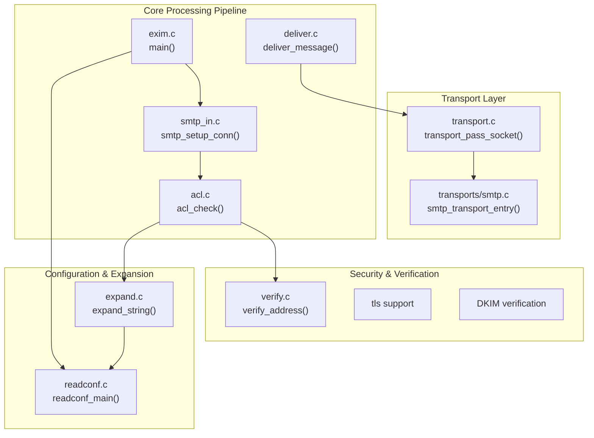
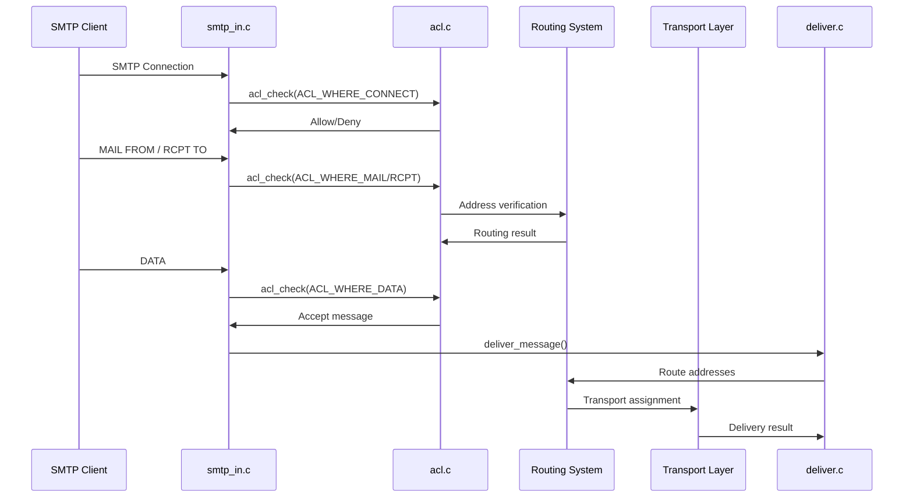
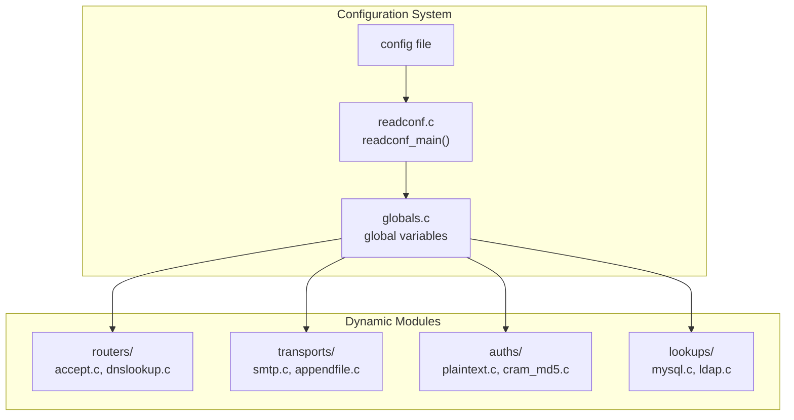

# Overview

> **Relevant source files**
> * [doc/doc-docbook/spec.xfpt](https://github.com/Exim/exim/blob/29568b25/doc/doc-docbook/spec.xfpt)
> * [doc/doc-txt/ChangeLog](https://github.com/Exim/exim/blob/29568b25/doc/doc-txt/ChangeLog)
> * [doc/doc-txt/NewStuff](https://github.com/Exim/exim/blob/29568b25/doc/doc-txt/NewStuff)
> * [doc/doc-txt/OptionLists.txt](https://github.com/Exim/exim/blob/29568b25/doc/doc-txt/OptionLists.txt)
> * [src/ACKNOWLEDGMENTS](https://github.com/Exim/exim/blob/29568b25/src/ACKNOWLEDGMENTS)
> * [src/README.UPDATING](https://github.com/Exim/exim/blob/29568b25/src/README.UPDATING)
> * [src/src/acl.c](https://github.com/Exim/exim/blob/29568b25/src/src/acl.c)
> * [src/src/daemon.c](https://github.com/Exim/exim/blob/29568b25/src/src/daemon.c)
> * [src/src/deliver.c](https://github.com/Exim/exim/blob/29568b25/src/src/deliver.c)
> * [src/src/exim.c](https://github.com/Exim/exim/blob/29568b25/src/src/exim.c)
> * [src/src/expand.c](https://github.com/Exim/exim/blob/29568b25/src/src/expand.c)
> * [src/src/functions.h](https://github.com/Exim/exim/blob/29568b25/src/src/functions.h)
> * [src/src/globals.c](https://github.com/Exim/exim/blob/29568b25/src/src/globals.c)
> * [src/src/globals.h](https://github.com/Exim/exim/blob/29568b25/src/src/globals.h)
> * [src/src/readconf.c](https://github.com/Exim/exim/blob/29568b25/src/src/readconf.c)
> * [src/src/receive.c](https://github.com/Exim/exim/blob/29568b25/src/src/receive.c)
> * [src/src/smtp_in.c](https://github.com/Exim/exim/blob/29568b25/src/src/smtp_in.c)
> * [src/src/structs.h](https://github.com/Exim/exim/blob/29568b25/src/src/structs.h)
> * [src/src/transport.c](https://github.com/Exim/exim/blob/29568b25/src/src/transport.c)
> * [src/src/transports/smtp.c](https://github.com/Exim/exim/blob/29568b25/src/src/transports/smtp.c)
> * [src/src/verify.c](https://github.com/Exim/exim/blob/29568b25/src/src/verify.c)

This page introduces Exim as a Mail Transfer Agent, summarizing its core purpose, design principles, and high-level architecture. For detailed information about specific subsystems, see [Architecture Overview](/Exim/exim/1.2-architecture-overview), [Core Mail Processing](/Exim/exim/2-core-mail-processing), [Security Features](/Exim/exim/3-security-features), and [Configuration and Build System](/Exim/exim/4-configuration-and-build-system).

## What is Exim?

Exim is a mail transfer agent (MTA) designed for Unix and Unix-like operating systems. It handles the routing and delivery of email messages, supporting both local delivery and remote transmission via SMTP. The system is built around a modular architecture that processes incoming messages through a series of configurable stages including reception, access control, routing, and delivery.

Sources: [doc/doc-docbook/spec.xfpt L323-L334](https://github.com/Exim/exim/blob/29568b25/doc/doc-docbook/spec.xfpt#L323-L334)

## Design Philosophy

Exim follows several key design principles:

* **Configuration-driven behavior**: Nearly all mail handling logic is controlled through a comprehensive configuration system rather than hard-coded policies
* **Modular architecture**: Core functionality is separated into distinct subsystems (routing, transport, authentication, etc.) that can be configured independently
* **Security-first approach**: Multiple layers of security controls including Access Control Lists (ACLs), content scanning, and cryptographic verification
* **Extensibility**: Support for dynamic modules, external authenticators, and custom transports

The main entry point is `exim.c` which coordinates between these subsystems based on the runtime configuration.

Sources: [src/src/exim.c L1-L15](https://github.com/Exim/exim/blob/29568b25/src/src/exim.c#L1-L15)

 [doc/doc-docbook/spec.xfpt L618-L624](https://github.com/Exim/exim/blob/29568b25/doc/doc-docbook/spec.xfpt#L618-L624)

## Core Architecture

**Core Processing Pipeline**
The main processing flow starts in `exim.c:main()` which initializes the system and delegates to specialized handlers. For SMTP connections, `smtp_in.c:smtp_setup_conn()` manages the protocol interaction, while `deliver.c:deliver_message()` handles the actual message delivery.

Sources: [src/src/exim.c L1-L50](https://github.com/Exim/exim/blob/29568b25/src/src/exim.c#L1-L50)

 [src/src/smtp_in.c L1-L30](https://github.com/Exim/exim/blob/29568b25/src/src/smtp_in.c#L1-L30)

 [src/src/deliver.c L1-L20](https://github.com/Exim/exim/blob/29568b25/src/src/deliver.c#L1-L20)

## Message Processing Flow

**Access Control Integration**
The `acl.c:acl_check()` function is called at multiple points during message processing to enforce policy decisions. Each call specifies a context (connection, mail command, recipient, data) that determines which ACL rules apply.

Sources: [src/src/smtp_in.c L1-L50](https://github.com/Exim/exim/blob/29568b25/src/src/smtp_in.c#L1-L50)

 [src/src/acl.c L100-L130](https://github.com/Exim/exim/blob/29568b25/src/src/acl.c#L100-L130)

## Key Subsystems

| Subsystem | Primary Files | Purpose |
| --- | --- | --- |
| **SMTP Protocol** | `smtp_in.c`, `smtp_out.c` | Handle inbound/outbound SMTP communication |
| **Message Delivery** | `deliver.c`, `transport.c` | Route and deliver messages to destinations |
| **Access Control** | `acl.c` | Enforce security policies and filtering rules |
| **String Expansion** | `expand.c` | Dynamic configuration value expansion |
| **Configuration** | `readconf.c` | Parse and validate configuration files |
| **Verification** | `verify.c` | Address and sender verification |
| **Authentication** | `auths/` directory | Support various authentication mechanisms |

Sources: [src/src/smtp_in.c L1-L20](https://github.com/Exim/exim/blob/29568b25/src/src/smtp_in.c#L1-L20)

 [src/src/deliver.c L1-L20](https://github.com/Exim/exim/blob/29568b25/src/src/deliver.c#L1-L20)

 [src/src/acl.c L1-L20](https://github.com/Exim/exim/blob/29568b25/src/src/acl.c#L1-L20)

 [src/src/expand.c L1-L20](https://github.com/Exim/exim/blob/29568b25/src/src/expand.c#L1-L20)

## Configuration and Modules

**Module Loading**
The system supports both statically linked and dynamically loaded modules for routers, transports, authenticators, and lookups. Configuration is read by `readconf.c:readconf_main()` and stored in global variables defined in `globals.c`.

Sources: [src/src/readconf.c L1-L30](https://github.com/Exim/exim/blob/29568b25/src/src/readconf.c#L1-L30)

 [src/src/globals.c L1-L20](https://github.com/Exim/exim/blob/29568b25/src/src/globals.c#L1-L20)

 [doc/doc-txt/NewStuff L19-L25](https://github.com/Exim/exim/blob/29568b25/doc/doc-txt/NewStuff#L19-L25)

## Core Data Structures

The system uses several key data structures to represent messages and addresses:

* **`address_item`**: Represents email addresses with routing and delivery state
* **`transport_instance`**: Configuration for message transport methods
* **`router_instance`**: Configuration for address routing rules
* **`auth_instance`**: Configuration for authentication mechanisms
* **`header_line`**: Represents email headers during processing

These structures are defined in `structs.h` and manipulated throughout the message processing pipeline.

Sources: [src/src/structs.h L1-L50](https://github.com/Exim/exim/blob/29568b25/src/src/structs.h#L1-L50)

 [src/src/deliver.c L145-L155](https://github.com/Exim/exim/blob/29568b25/src/src/deliver.c#L145-L155)