# Pipe Transport

> **Relevant source files**
> * [src/src/transports/appendfile.c](https://github.com/Exim/exim/blob/29568b25/src/src/transports/appendfile.c)
> * [src/src/transports/autoreply.c](https://github.com/Exim/exim/blob/29568b25/src/src/transports/autoreply.c)
> * [src/src/transports/lmtp.c](https://github.com/Exim/exim/blob/29568b25/src/src/transports/lmtp.c)
> * [src/src/transports/pipe.c](https://github.com/Exim/exim/blob/29568b25/src/src/transports/pipe.c)
> * [src/src/transports/tf_maildir.c](https://github.com/Exim/exim/blob/29568b25/src/src/transports/tf_maildir.c)

## Purpose and Scope

The pipe transport provides a mechanism for delivering messages to external commands or programs. It enables Exim to hand off messages to scripts, filters, or other mail processing utilities by executing commands and feeding message data through standard input pipes.

For information about file-based delivery, see [File and Directory Storage](/Exim/exim/6.1-file-and-directory-storage). For SMTP-based delivery, see [SMTP Transport](/Exim/exim/6.2-smtp-transport). For automated responses, see [Autoreply Transport](/Exim/exim/6.4-autoreply-transport).

## Architecture Overview

The pipe transport creates child processes to execute external commands, managing input/output pipes and implementing proper security controls. It supports both direct command execution and shell-based execution modes.

### Core Components

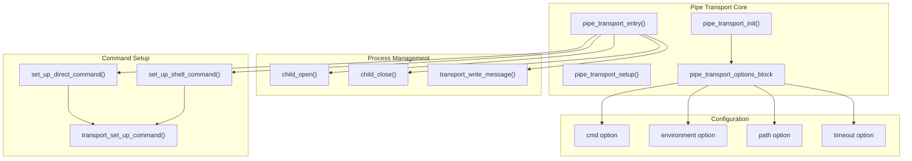

Sources: [src/src/transports/pipe.c L510-L1127](https://github.com/Exim/exim/blob/29568b25/src/src/transports/pipe.c#L510-L1127)

### Transport Registration

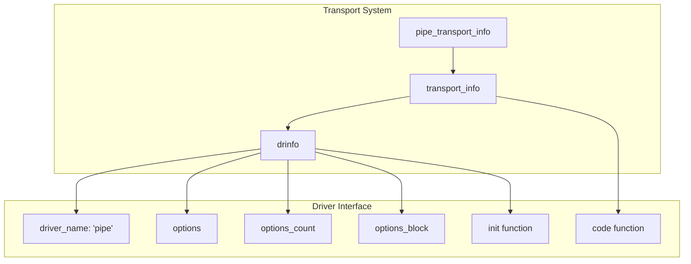

Sources: [src/src/transports/pipe.c L1136-L1152](https://github.com/Exim/exim/blob/29568b25/src/src/transports/pipe.c#L1136-L1152)

## Configuration and Options

The pipe transport is configured through the `pipe_transport_options_block` structure, which contains numerous options controlling command execution, environment, and behavior.

### Key Configuration Options

| Option | Type | Purpose |
| --- | --- | --- |
| `command` | string | The command to execute |
| `path` | string | Search path for command resolution |
| `environment` | string | Additional environment variables |
| `timeout` | time | Maximum execution time |
| `use_shell` | bool | Whether to use shell for command execution |
| `allow_commands` | string | List of permitted commands |
| `restrict_to_path` | bool | Restrict commands to PATH directories |
| `use_bsmtp` | bool | Use BSMTP format for output |

Sources: [src/src/transports/pipe.c L30-L72](https://github.com/Exim/exim/blob/29568b25/src/src/transports/pipe.c#L30-L72)

### Default Configuration

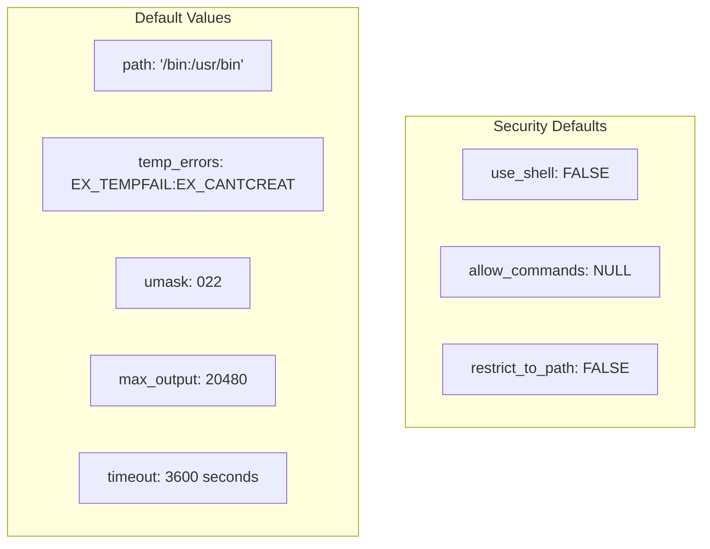

Sources: [src/src/transports/pipe.c L93-L101](https://github.com/Exim/exim/blob/29568b25/src/src/transports/pipe.c#L93-L101)

## Command Execution Modes

The pipe transport supports two primary modes of command execution: direct command execution and shell-based execution.

### Direct Command Mode

In direct mode, the transport parses the command line and executes the program directly without involving a shell.

```mermaid
sequenceDiagram
  participant Pipe Transport
  participant set_up_direct_command()
  participant transport_set_up_command()
  participant Process System

  Pipe Transport->>set_up_direct_command(): Parse command line
  set_up_direct_command()->>transport_set_up_command(): Create argument vector
  transport_set_up_command()->>set_up_direct_command(): Return argv array
  set_up_direct_command()->>set_up_direct_command(): Check command permissions
  set_up_direct_command()->>set_up_direct_command(): Resolve command path
  set_up_direct_command()->>Process System: Execute via child_open()
```

Sources: [src/src/transports/pipe.c L296-L397](https://github.com/Exim/exim/blob/29568b25/src/src/transports/pipe.c#L296-L397)

### Shell Command Mode

When `use_shell` is enabled, commands are executed through `/bin/sh -c`.

```mermaid
sequenceDiagram
  participant Pipe Transport
  participant set_up_shell_command()
  participant Expansion Engine
  participant Process System

  Pipe Transport->>set_up_shell_command(): Setup shell execution
  set_up_shell_command()->>Expansion Engine: Expand $pipe_addresses
  Expansion Engine->>set_up_shell_command(): Return expanded command
  set_up_shell_command()->>set_up_shell_command(): Build argv["/bin/sh", "-c", command]
  set_up_shell_command()->>Process System: Execute via child_open()
```

Sources: [src/src/transports/pipe.c L419-L497](https://github.com/Exim/exim/blob/29568b25/src/src/transports/pipe.c#L419-L497)

### Command Resolution Process

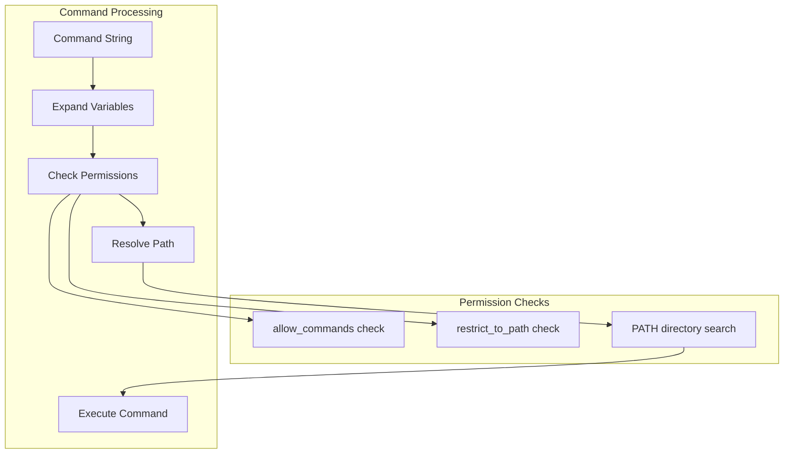

Sources: [src/src/transports/pipe.c L318-L397](https://github.com/Exim/exim/blob/29568b25/src/src/transports/pipe.c#L318-L397)

## Process Lifecycle Management

The pipe transport manages complex process lifecycles involving multiple child processes for command execution and output handling.

### Process Creation and Management

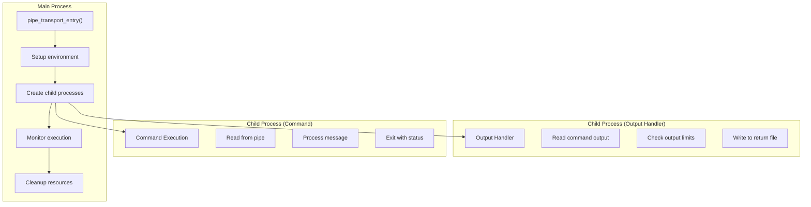

Sources: [src/src/transports/pipe.c L705-L770](https://github.com/Exim/exim/blob/29568b25/src/src/transports/pipe.c#L705-L770)

### Output Handling Architecture

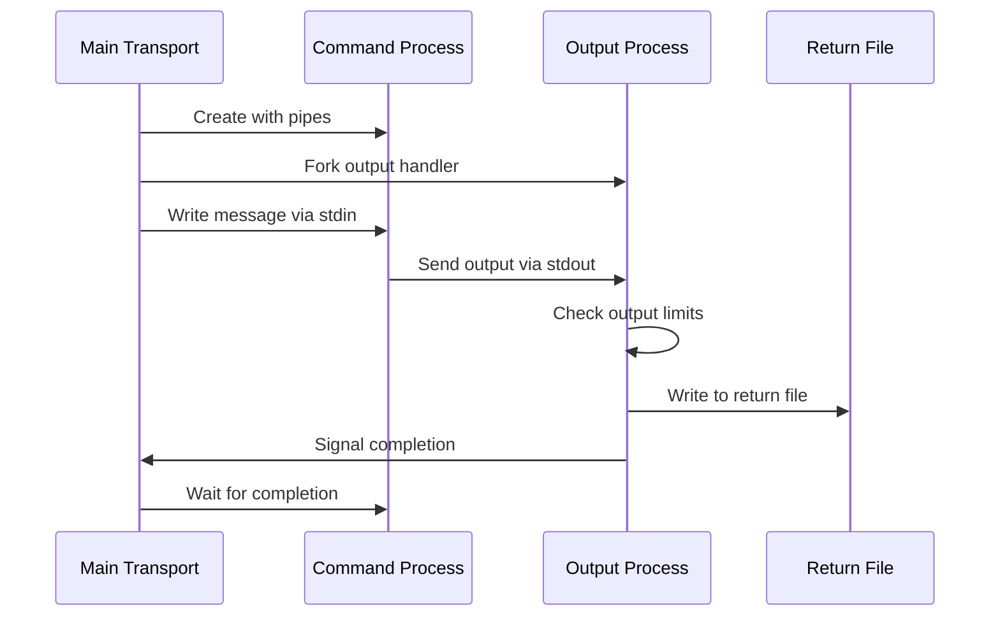

Sources: [src/src/transports/pipe.c L742-L769](https://github.com/Exim/exim/blob/29568b25/src/src/transports/pipe.c#L742-L769)

## Environment and Security

The pipe transport implements comprehensive security controls and environment management.

### Environment Variable Setup

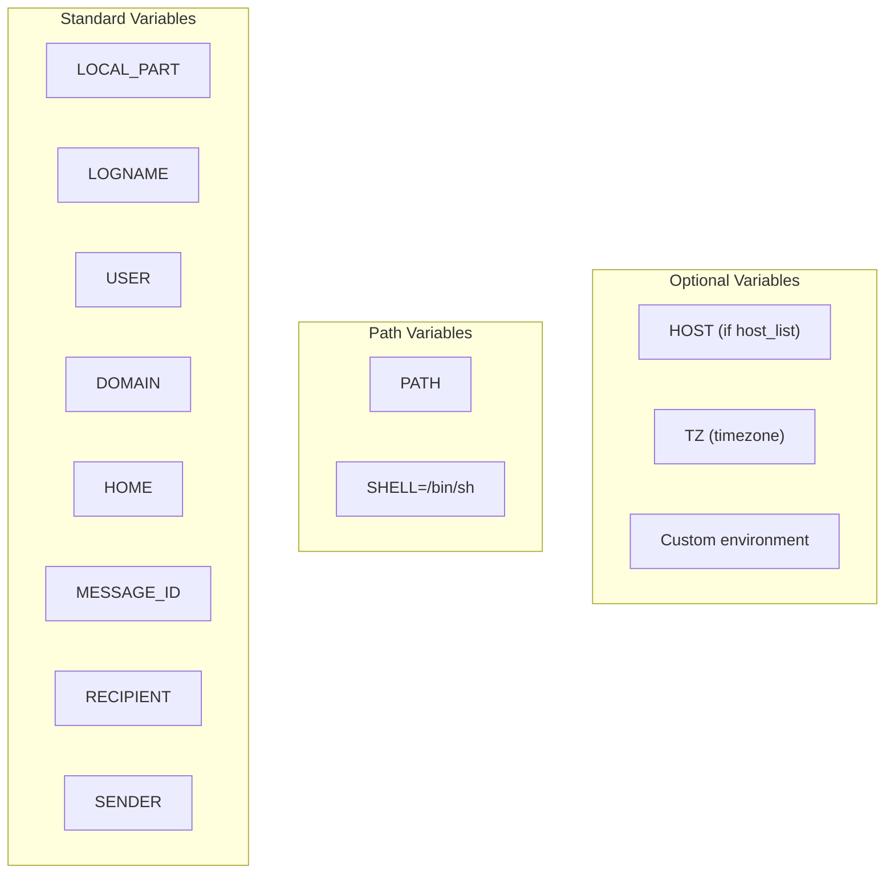

Sources: [src/src/transports/pipe.c L625-L677](https://github.com/Exim/exim/blob/29568b25/src/src/transports/pipe.c#L625-L677)

### Security Controls

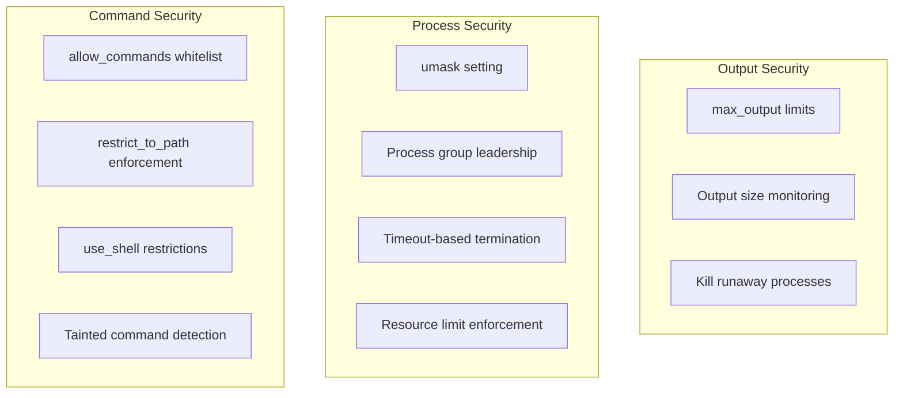

Sources: [src/src/transports/pipe.c L318-L366](https://github.com/Exim/exim/blob/29568b25/src/src/transports/pipe.c#L318-L366)

 [src/src/transports/pipe.c L582-L589](https://github.com/Exim/exim/blob/29568b25/src/src/transports/pipe.c#L582-L589)

 [src/src/transports/pipe.c L753-L765](https://github.com/Exim/exim/blob/29568b25/src/src/transports/pipe.c#L753-L765)

## Error Handling and Status Codes

The pipe transport implements sophisticated error handling with configurable temporary failure codes and comprehensive status reporting.

### Error Classification

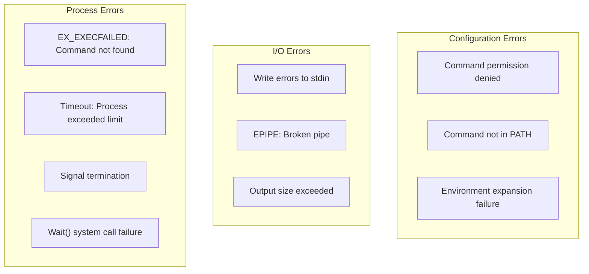

Sources: [src/src/transports/pipe.c L883-L1109](https://github.com/Exim/exim/blob/29568b25/src/src/transports/pipe.c#L883-L1109)

### Status Code Handling

The transport uses the `temp_errors` configuration to determine which exit codes should be treated as temporary failures versus permanent failures.

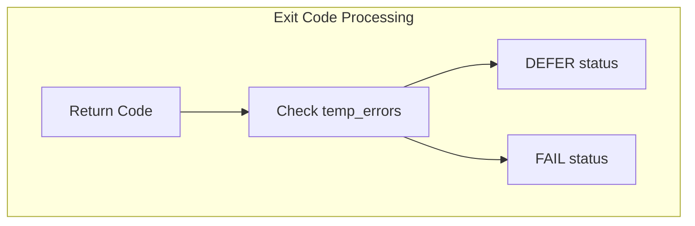

Sources: [src/src/transports/pipe.c L1043-L1060](https://github.com/Exim/exim/blob/29568b25/src/src/transports/pipe.c#L1043-L1060)

## BSMTP Support

When `use_bsmtp` is enabled, the pipe transport formats output as Batch SMTP, useful for feeding messages to SMTP-aware programs.

### BSMTP Message Flow

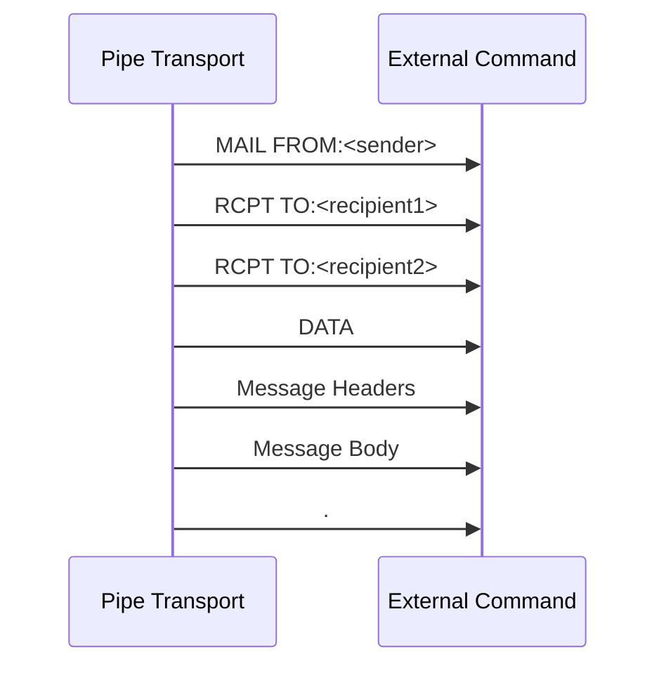

Sources: [src/src/transports/pipe.c L821-L862](https://github.com/Exim/exim/blob/29568b25/src/src/transports/pipe.c#L821-L862)

The transport automatically sets appropriate check and escape strings for BSMTP format and enables header escaping when this mode is activated.

Sources: [src/src/transports/pipe.c L231-L236](https://github.com/Exim/exim/blob/29568b25/src/src/transports/pipe.c#L231-L236)