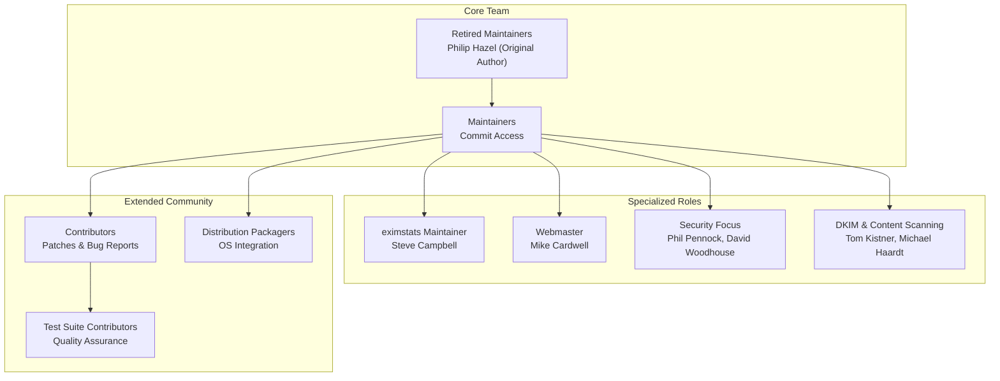
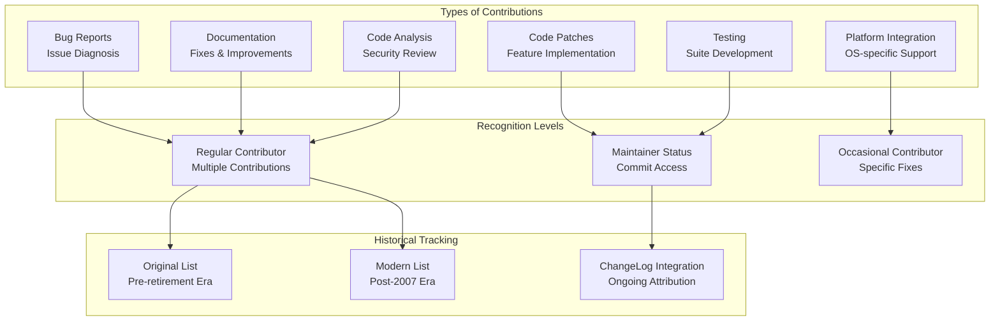
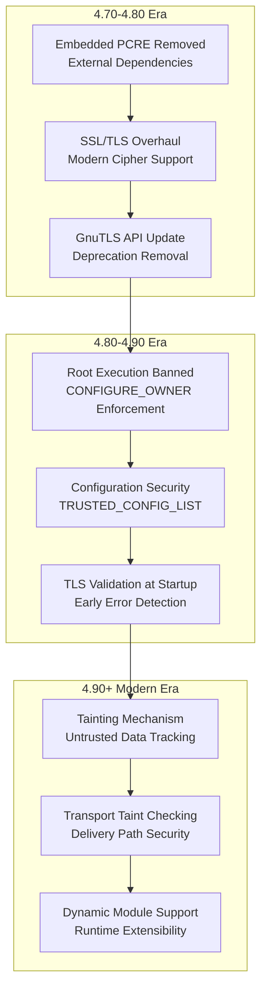
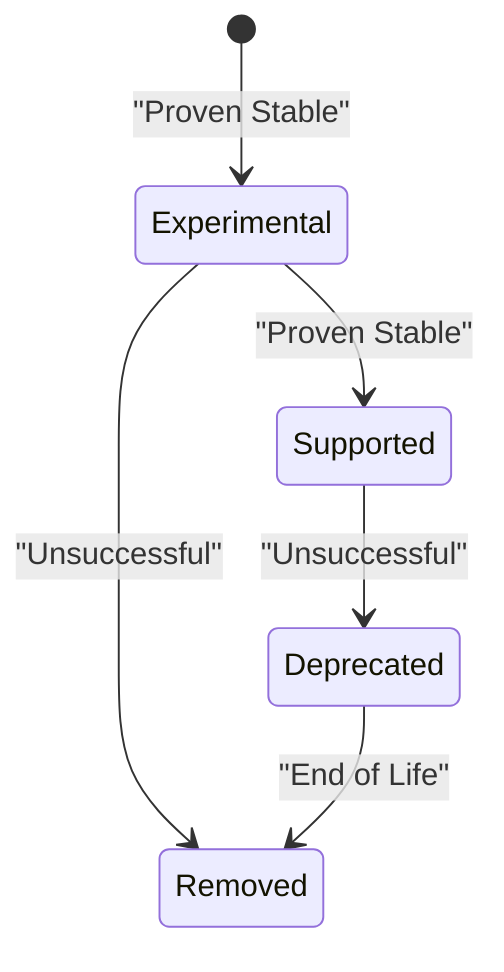

# Project History and Community

> **Relevant source files**
> * [src/ACKNOWLEDGMENTS](https://github.com/Exim/exim/blob/29568b25/src/ACKNOWLEDGMENTS)
> * [src/README.UPDATING](https://github.com/Exim/exim/blob/29568b25/src/README.UPDATING)

This document covers the historical development of the Exim Mail Transfer Agent project, its community structure, and the evolution of its codebase architecture. It provides context on how the project has evolved from its origins through major version releases and community transitions.

For information about the current technical architecture, see [Architecture Overview](/Exim/exim/1.2-architecture-overview). For details about building and configuring Exim, see [Build-time Configuration](/Exim/exim/4.1-build-time-configuration).

## Project Origins and Evolution

Exim was originally conceived and developed by Philip Hazel, who served as the project's architect and primary maintainer for many years before retiring. The project has undergone significant architectural evolution, with two major upheavals in its design philosophy.

The most significant architectural change occurred with the release of version 4.00, which completely reworked the mail routing system. The previous "directors" concept was abolished in favor of a unified router-based approach, and policy controls were moved from separate options to Access Control Lists (ACLs). An earlier major change occurred at version 3.00, which reworked domain/host/net/address list handling.

**Project Development Timeline**

```css
#mermaid-oirz30qtge9{font-family:ui-sans-serif,-apple-system,system-ui,Segoe UI,Helvetica;font-size:16px;fill:#ccc;}@keyframes edge-animation-frame{from{stroke-dashoffset:0;}}@keyframes dash{to{stroke-dashoffset:0;}}#mermaid-oirz30qtge9 .edge-animation-slow{stroke-dasharray:9,5!important;stroke-dashoffset:900;animation:dash 50s linear infinite;stroke-linecap:round;}#mermaid-oirz30qtge9 .edge-animation-fast{stroke-dasharray:9,5!important;stroke-dashoffset:900;animation:dash 20s linear infinite;stroke-linecap:round;}#mermaid-oirz30qtge9 .error-icon{fill:#333;}#mermaid-oirz30qtge9 .error-text{fill:#cccccc;stroke:#cccccc;}#mermaid-oirz30qtge9 .edge-thickness-normal{stroke-width:1px;}#mermaid-oirz30qtge9 .edge-thickness-thick{stroke-width:3.5px;}#mermaid-oirz30qtge9 .edge-pattern-solid{stroke-dasharray:0;}#mermaid-oirz30qtge9 .edge-thickness-invisible{stroke-width:0;fill:none;}#mermaid-oirz30qtge9 .edge-pattern-dashed{stroke-dasharray:3;}#mermaid-oirz30qtge9 .edge-pattern-dotted{stroke-dasharray:2;}#mermaid-oirz30qtge9 .marker{fill:#666;stroke:#666;}#mermaid-oirz30qtge9 .marker.cross{stroke:#666;}#mermaid-oirz30qtge9 svg{font-family:ui-sans-serif,-apple-system,system-ui,Segoe UI,Helvetica;font-size:16px;}#mermaid-oirz30qtge9 p{margin:0;}#mermaid-oirz30qtge9 .edge{stroke-width:3;}#mermaid-oirz30qtge9 .section--1 rect,#mermaid-oirz30qtge9 .section--1 path,#mermaid-oirz30qtge9 .section--1 circle,#mermaid-oirz30qtge9 .section--1 path{fill:hsl(0, 0%, 0%);}#mermaid-oirz30qtge9 .section--1 text{fill:#ccc;}#mermaid-oirz30qtge9 .node-icon--1{font-size:40px;color:#ccc;}#mermaid-oirz30qtge9 .section-edge--1{stroke:hsl(0, 0%, 0%);}#mermaid-oirz30qtge9 .edge-depth--1{stroke-width:17;}#mermaid-oirz30qtge9 .section--1 line{stroke:#ffffff;stroke-width:3;}#mermaid-oirz30qtge9 .lineWrapper line{stroke:#ccc;}#mermaid-oirz30qtge9 .disabled,#mermaid-oirz30qtge9 .disabled circle,#mermaid-oirz30qtge9 .disabled text{fill:lightgray;}#mermaid-oirz30qtge9 .disabled text{fill:#efefef;}#mermaid-oirz30qtge9 .section-0 rect,#mermaid-oirz30qtge9 .section-0 path,#mermaid-oirz30qtge9 .section-0 circle,#mermaid-oirz30qtge9 .section-0 path{fill:hsl(-120, 0%, 0%);}#mermaid-oirz30qtge9 .section-0 text{fill:#ccc;}#mermaid-oirz30qtge9 .node-icon-0{font-size:40px;color:#ccc;}#mermaid-oirz30qtge9 .section-edge-0{stroke:hsl(-120, 0%, 0%);}#mermaid-oirz30qtge9 .edge-depth-0{stroke-width:14;}#mermaid-oirz30qtge9 .section-0 line{stroke:#ffffff;stroke-width:3;}#mermaid-oirz30qtge9 .lineWrapper line{stroke:#ccc;}#mermaid-oirz30qtge9 .disabled,#mermaid-oirz30qtge9 .disabled circle,#mermaid-oirz30qtge9 .disabled text{fill:lightgray;}#mermaid-oirz30qtge9 .disabled text{fill:#efefef;}#mermaid-oirz30qtge9 .section-1 rect,#mermaid-oirz30qtge9 .section-1 path,#mermaid-oirz30qtge9 .section-1 circle,#mermaid-oirz30qtge9 .section-1 path{fill:hsl(0, 0%, 0%);}#mermaid-oirz30qtge9 .section-1 text{fill:#ccc;}#mermaid-oirz30qtge9 .node-icon-1{font-size:40px;color:#ccc;}#mermaid-oirz30qtge9 .section-edge-1{stroke:hsl(0, 0%, 0%);}#mermaid-oirz30qtge9 .edge-depth-1{stroke-width:11;}#mermaid-oirz30qtge9 .section-1 line{stroke:#ffffff;stroke-width:3;}#mermaid-oirz30qtge9 .lineWrapper line{stroke:#ccc;}#mermaid-oirz30qtge9 .disabled,#mermaid-oirz30qtge9 .disabled circle,#mermaid-oirz30qtge9 .disabled text{fill:lightgray;}#mermaid-oirz30qtge9 .disabled text{fill:#efefef;}#mermaid-oirz30qtge9 .section-2 rect,#mermaid-oirz30qtge9 .section-2 path,#mermaid-oirz30qtge9 .section-2 circle,#mermaid-oirz30qtge9 .section-2 path{fill:hsl(30, 0%, 0%);}#mermaid-oirz30qtge9 .section-2 text{fill:#ccc;}#mermaid-oirz30qtge9 .node-icon-2{font-size:40px;color:#ccc;}#mermaid-oirz30qtge9 .section-edge-2{stroke:hsl(30, 0%, 0%);}#mermaid-oirz30qtge9 .edge-depth-2{stroke-width:8;}#mermaid-oirz30qtge9 .section-2 line{stroke:#ffffff;stroke-width:3;}#mermaid-oirz30qtge9 .lineWrapper line{stroke:#ccc;}#mermaid-oirz30qtge9 .disabled,#mermaid-oirz30qtge9 .disabled circle,#mermaid-oirz30qtge9 .disabled text{fill:lightgray;}#mermaid-oirz30qtge9 .disabled text{fill:#efefef;}#mermaid-oirz30qtge9 .section-3 rect,#mermaid-oirz30qtge9 .section-3 path,#mermaid-oirz30qtge9 .section-3 circle,#mermaid-oirz30qtge9 .section-3 path{fill:hsl(60, 0%, 0%);}#mermaid-oirz30qtge9 .section-3 text{fill:#ccc;}#mermaid-oirz30qtge9 .node-icon-3{font-size:40px;color:#ccc;}#mermaid-oirz30qtge9 .section-edge-3{stroke:hsl(60, 0%, 0%);}#mermaid-oirz30qtge9 .edge-depth-3{stroke-width:5;}#mermaid-oirz30qtge9 .section-3 line{stroke:#ffffff;stroke-width:3;}#mermaid-oirz30qtge9 .lineWrapper line{stroke:#ccc;}#mermaid-oirz30qtge9 .disabled,#mermaid-oirz30qtge9 .disabled circle,#mermaid-oirz30qtge9 .disabled text{fill:lightgray;}#mermaid-oirz30qtge9 .disabled text{fill:#efefef;}#mermaid-oirz30qtge9 .section-4 rect,#mermaid-oirz30qtge9 .section-4 path,#mermaid-oirz30qtge9 .section-4 circle,#mermaid-oirz30qtge9 .section-4 path{fill:hsl(90, 0%, 0%);}#mermaid-oirz30qtge9 .section-4 text{fill:#ccc;}#mermaid-oirz30qtge9 .node-icon-4{font-size:40px;color:#ccc;}#mermaid-oirz30qtge9 .section-edge-4{stroke:hsl(90, 0%, 0%);}#mermaid-oirz30qtge9 .edge-depth-4{stroke-width:2;}#mermaid-oirz30qtge9 .section-4 line{stroke:#ffffff;stroke-width:3;}#mermaid-oirz30qtge9 .lineWrapper line{stroke:#ccc;}#mermaid-oirz30qtge9 .disabled,#mermaid-oirz30qtge9 .disabled circle,#mermaid-oirz30qtge9 .disabled text{fill:lightgray;}#mermaid-oirz30qtge9 .disabled text{fill:#efefef;}#mermaid-oirz30qtge9 .section-5 rect,#mermaid-oirz30qtge9 .section-5 path,#mermaid-oirz30qtge9 .section-5 circle,#mermaid-oirz30qtge9 .section-5 path{fill:hsl(120, 0%, 0%);}#mermaid-oirz30qtge9 .section-5 text{fill:#ccc;}#mermaid-oirz30qtge9 .node-icon-5{font-size:40px;color:#ccc;}#mermaid-oirz30qtge9 .section-edge-5{stroke:hsl(120, 0%, 0%);}#mermaid-oirz30qtge9 .edge-depth-5{stroke-width:-1;}#mermaid-oirz30qtge9 .section-5 line{stroke:#ffffff;stroke-width:3;}#mermaid-oirz30qtge9 .lineWrapper line{stroke:#ccc;}#mermaid-oirz30qtge9 .disabled,#mermaid-oirz30qtge9 .disabled circle,#mermaid-oirz30qtge9 .disabled text{fill:lightgray;}#mermaid-oirz30qtge9 .disabled text{fill:#efefef;}#mermaid-oirz30qtge9 .section-6 rect,#mermaid-oirz30qtge9 .section-6 path,#mermaid-oirz30qtge9 .section-6 circle,#mermaid-oirz30qtge9 .section-6 path{fill:hsl(150, 0%, 0%);}#mermaid-oirz30qtge9 .section-6 text{fill:#ccc;}#mermaid-oirz30qtge9 .node-icon-6{font-size:40px;color:#ccc;}#mermaid-oirz30qtge9 .section-edge-6{stroke:hsl(150, 0%, 0%);}#mermaid-oirz30qtge9 .edge-depth-6{stroke-width:-4;}#mermaid-oirz30qtge9 .section-6 line{stroke:#ffffff;stroke-width:3;}#mermaid-oirz30qtge9 .lineWrapper line{stroke:#ccc;}#mermaid-oirz30qtge9 .disabled,#mermaid-oirz30qtge9 .disabled circle,#mermaid-oirz30qtge9 .disabled text{fill:lightgray;}#mermaid-oirz30qtge9 .disabled text{fill:#efefef;}#mermaid-oirz30qtge9 .section-7 rect,#mermaid-oirz30qtge9 .section-7 path,#mermaid-oirz30qtge9 .section-7 circle,#mermaid-oirz30qtge9 .section-7 path{fill:hsl(210, 0%, 75%);}#mermaid-oirz30qtge9 .section-7 text{fill:#ccc;}#mermaid-oirz30qtge9 .node-icon-7{font-size:40px;color:#ccc;}#mermaid-oirz30qtge9 .section-edge-7{stroke:hsl(210, 0%, 75%);}#mermaid-oirz30qtge9 .edge-depth-7{stroke-width:-7;}#mermaid-oirz30qtge9 .section-7 line{stroke:rgb(63.75, 63.75, 63.75);stroke-width:3;}#mermaid-oirz30qtge9 .lineWrapper line{stroke:#ccc;}#mermaid-oirz30qtge9 .disabled,#mermaid-oirz30qtge9 .disabled circle,#mermaid-oirz30qtge9 .disabled text{fill:lightgray;}#mermaid-oirz30qtge9 .disabled text{fill:#efefef;}#mermaid-oirz30qtge9 .section-8 rect,#mermaid-oirz30qtge9 .section-8 path,#mermaid-oirz30qtge9 .section-8 circle,#mermaid-oirz30qtge9 .section-8 path{fill:hsl(270, 0%, 0%);}#mermaid-oirz30qtge9 .section-8 text{fill:#ccc;}#mermaid-oirz30qtge9 .node-icon-8{font-size:40px;color:#ccc;}#mermaid-oirz30qtge9 .section-edge-8{stroke:hsl(270, 0%, 0%);}#mermaid-oirz30qtge9 .edge-depth-8{stroke-width:-10;}#mermaid-oirz30qtge9 .section-8 line{stroke:#ffffff;stroke-width:3;}#mermaid-oirz30qtge9 .lineWrapper line{stroke:#ccc;}#mermaid-oirz30qtge9 .disabled,#mermaid-oirz30qtge9 .disabled circle,#mermaid-oirz30qtge9 .disabled text{fill:lightgray;}#mermaid-oirz30qtge9 .disabled text{fill:#efefef;}#mermaid-oirz30qtge9 .section-9 rect,#mermaid-oirz30qtge9 .section-9 path,#mermaid-oirz30qtge9 .section-9 circle,#mermaid-oirz30qtge9 .section-9 path{fill:hsl(300, 0%, 0%);}#mermaid-oirz30qtge9 .section-9 text{fill:#ccc;}#mermaid-oirz30qtge9 .node-icon-9{font-size:40px;color:#ccc;}#mermaid-oirz30qtge9 .section-edge-9{stroke:hsl(300, 0%, 0%);}#mermaid-oirz30qtge9 .edge-depth-9{stroke-width:-13;}#mermaid-oirz30qtge9 .section-9 line{stroke:#ffffff;stroke-width:3;}#mermaid-oirz30qtge9 .lineWrapper line{stroke:#ccc;}#mermaid-oirz30qtge9 .disabled,#mermaid-oirz30qtge9 .disabled circle,#mermaid-oirz30qtge9 .disabled text{fill:lightgray;}#mermaid-oirz30qtge9 .disabled text{fill:#efefef;}#mermaid-oirz30qtge9 .section-10 rect,#mermaid-oirz30qtge9 .section-10 path,#mermaid-oirz30qtge9 .section-10 circle,#mermaid-oirz30qtge9 .section-10 path{fill:hsl(330, 0%, 0%);}#mermaid-oirz30qtge9 .section-10 text{fill:#ccc;}#mermaid-oirz30qtge9 .node-icon-10{font-size:40px;color:#ccc;}#mermaid-oirz30qtge9 .section-edge-10{stroke:hsl(330, 0%, 0%);}#mermaid-oirz30qtge9 .edge-depth-10{stroke-width:-16;}#mermaid-oirz30qtge9 .section-10 line{stroke:#ffffff;stroke-width:3;}#mermaid-oirz30qtge9 .lineWrapper line{stroke:#ccc;}#mermaid-oirz30qtge9 .disabled,#mermaid-oirz30qtge9 .disabled circle,#mermaid-oirz30qtge9 .disabled text{fill:lightgray;}#mermaid-oirz30qtge9 .disabled text{fill:#efefef;}#mermaid-oirz30qtge9 .section-root rect,#mermaid-oirz30qtge9 .section-root path,#mermaid-oirz30qtge9 .section-root circle{fill:hsl(0, 0%, 0%);}#mermaid-oirz30qtge9 .section-root text{fill:#ccc;}#mermaid-oirz30qtge9 .icon-container{height:100%;display:flex;justify-content:center;align-items:center;}#mermaid-oirz30qtge9 .edge{fill:none;}#mermaid-oirz30qtge9 .eventWrapper{filter:brightness(120%);}#mermaid-oirz30qtge9 :root{--mermaid-font-family:"trebuchet ms",verdana,arial,sans-serif;}Early   DevelopmentPre-3.00Initial   architectureBasic   domain/hosthandlingFirst   Major   Rework3.00Domain/host/net/addresslists   reworkedFoundation   formodern   listhandlingSecond   MajorRework4.00"Directors"abolishedUnifiedrouter-basedsystemIntroduction   ofACLsPolicy   controlcentralizationModern   Era4.70+DKIMimplementationEmbedded   PCREremovedExternal   librarydependencies4.80+TLS   architectureoverhaulGnuTLS   APImodernizationSecurity   hardening4.90+TaintingmechanismEnhanced   securitymodelDynamic   modulesupport"Exim Major Architecture Evolution"
```

Sources: [src/README.UPDATING L8-L22](https://github.com/Exim/exim/blob/29568b25/src/README.UPDATING#L8-L22)

## Community Structure

The Exim project operates with a multi-tiered community structure consisting of maintainers with commit access, contributors who provide patches and improvements, and packagers who handle distribution-specific packaging.

**Current Community Organization**



Sources: [src/ACKNOWLEDGMENTS L339-L355](https://github.com/Exim/exim/blob/29568b25/src/ACKNOWLEDGMENTS#L339-L355)

 [src/ACKNOWLEDGMENTS L463-L476](https://github.com/Exim/exim/blob/29568b25/src/ACKNOWLEDGMENTS#L463-L476)

### Active Maintainers and Focus Areas

The current maintainer team includes individuals with specialized focus areas:

| Maintainer | Primary Focus Area |
| --- | --- |
| Steve Campbell | eximstats maintenance |
| Mike Cardwell | Exim webmaster |
| Tony Finch | Ratelimit code, general fixes |
| Graeme Fowler | General maintenance |
| Michael Haardt | Sieve support, DKIM |
| Jeremy Harris | General development |
| John Jetmore | Testing and utilities |
| Tom Kistner | DKIM, content scanning, SPA |
| Todd Lyons | General maintenance |
| Nigel Metheringham | Transitioning from active role |
| Phil Pennock | Security, mostly idle status |
| David Woodhouse | Dynamic modules, security |

Sources: [src/ACKNOWLEDGMENTS L341-L354](https://github.com/Exim/exim/blob/29568b25/src/ACKNOWLEDGMENTS#L341-L354)

## Contributor Recognition System

The project maintains detailed acknowledgment records divided into historical periods, recognizing different types of contributions beyond just code patches.

**Contribution Categories**



The project explicitly acknowledges that contribution tracking has gaps, particularly during a five-year transition period, and actively encourages contributors to report omissions.

Sources: [src/ACKNOWLEDGMENTS L10-L14](https://github.com/Exim/exim/blob/29568b25/src/ACKNOWLEDGMENTS#L10-L14)

 [src/ACKNOWLEDGMENTS L24-L42](https://github.com/Exim/exim/blob/29568b25/src/ACKNOWLEDGMENTS#L24-L42)

## Major Version Milestones

The evolution of Exim's architecture can be tracked through significant version releases that introduced breaking changes or major new capabilities.

### Security and Architecture Milestones

| Version | Key Changes | Impact |
| --- | --- | --- |
| 4.73 | Root execution prohibited | Security hardening |
| 4.80 | TLS architecture overhaul | GnuTLS API modernization |
| 4.88 | Deprecated features removed | Code cleanup |
| 4.91 | DANE/SPF promoted to supported | Feature stabilization |
| 4.93 | Tainting mechanism introduced | Memory safety |
| 4.94 | Transport taint checking | Configuration compatibility |

**Version Evolution Security Focus**



Sources: [src/README.UPDATING L29-L94](https://github.com/Exim/exim/blob/29568b25/src/README.UPDATING#L29-L94)

 [src/README.UPDATING L375-L409](https://github.com/Exim/exim/blob/29568b25/src/README.UPDATING#L375-L409)

### Feature Lifecycle Management

The project follows a structured approach to feature development, moving capabilities through experimental, supported, and deprecated phases:



Examples of this lifecycle include the promotion of DANE and SPF from experimental to supported status in version 4.91, and the removal of deprecated GnuTLS options in version 4.88.

Sources: [src/README.UPDATING L106-L122](https://github.com/Exim/exim/blob/29568b25/src/README.UPDATING#L106-L122)

 [src/README.UPDATING L149-L155](https://github.com/Exim/exim/blob/29568b25/src/README.UPDATING#L149-L155)

## Development Process Evolution

The project has evolved from a single-maintainer model to a distributed maintenance approach, with changes tracked through multiple mechanisms:

* **ChangeLog entries**: Detailed change tracking with maintainer initials
* **Git commit history**: Modern version control integration
* **Acknowledgment updates**: Community contribution tracking
* **Test suite expansion**: Quality assurance evolution

The transition from Philip Hazel's direct maintenance to the current maintainer team represents a significant evolution in project governance, with specialized roles emerging for different aspects of the codebase.

Sources: [src/ACKNOWLEDGMENTS L320-L327](https://github.com/Exim/exim/blob/29568b25/src/ACKNOWLEDGMENTS#L320-L327)

 [src/ACKNOWLEDGMENTS L347-L348](https://github.com/Exim/exim/blob/29568b25/src/ACKNOWLEDGMENTS#L347-L348)