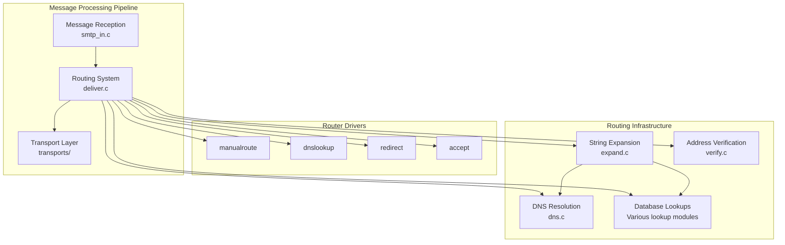
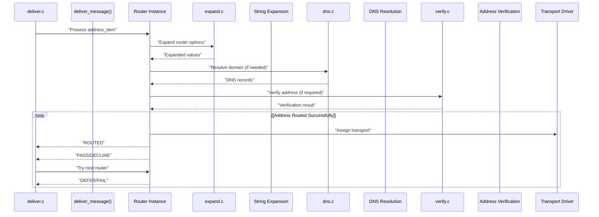
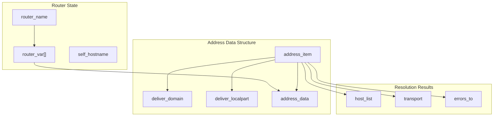
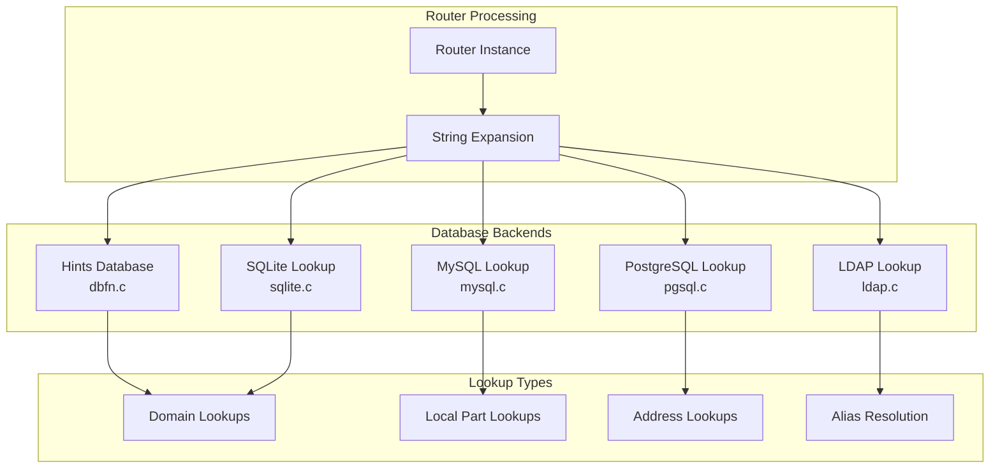
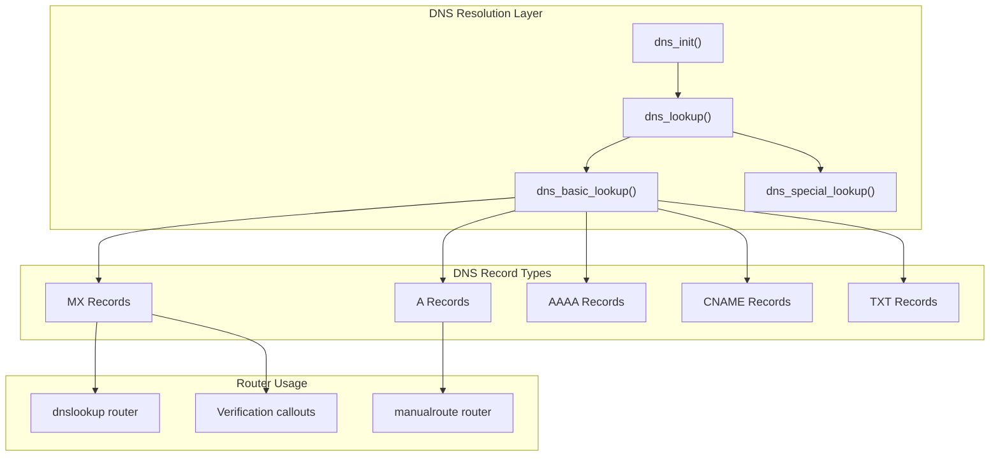
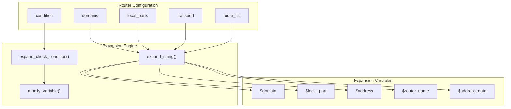
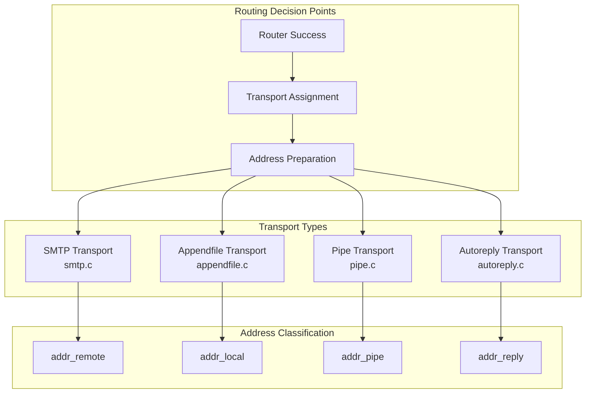

# Routing System

> **Relevant source files**
> * [doc/doc-docbook/spec.xfpt](https://github.com/Exim/exim/blob/29568b25/doc/doc-docbook/spec.xfpt)
> * [doc/doc-txt/ChangeLog](https://github.com/Exim/exim/blob/29568b25/doc/doc-txt/ChangeLog)
> * [doc/doc-txt/NewStuff](https://github.com/Exim/exim/blob/29568b25/doc/doc-txt/NewStuff)
> * [doc/doc-txt/OptionLists.txt](https://github.com/Exim/exim/blob/29568b25/doc/doc-txt/OptionLists.txt)
> * [src/src/acl.c](https://github.com/Exim/exim/blob/29568b25/src/src/acl.c)
> * [src/src/daemon.c](https://github.com/Exim/exim/blob/29568b25/src/src/daemon.c)
> * [src/src/deliver.c](https://github.com/Exim/exim/blob/29568b25/src/src/deliver.c)
> * [src/src/exim.c](https://github.com/Exim/exim/blob/29568b25/src/src/exim.c)
> * [src/src/expand.c](https://github.com/Exim/exim/blob/29568b25/src/src/expand.c)
> * [src/src/functions.h](https://github.com/Exim/exim/blob/29568b25/src/src/functions.h)
> * [src/src/globals.c](https://github.com/Exim/exim/blob/29568b25/src/src/globals.c)
> * [src/src/globals.h](https://github.com/Exim/exim/blob/29568b25/src/src/globals.h)
> * [src/src/readconf.c](https://github.com/Exim/exim/blob/29568b25/src/src/readconf.c)
> * [src/src/receive.c](https://github.com/Exim/exim/blob/29568b25/src/src/receive.c)
> * [src/src/smtp_in.c](https://github.com/Exim/exim/blob/29568b25/src/src/smtp_in.c)
> * [src/src/structs.h](https://github.com/Exim/exim/blob/29568b25/src/src/structs.h)
> * [src/src/transport.c](https://github.com/Exim/exim/blob/29568b25/src/src/transport.c)
> * [src/src/transports/smtp.c](https://github.com/Exim/exim/blob/29568b25/src/src/transports/smtp.c)
> * [src/src/verify.c](https://github.com/Exim/exim/blob/29568b25/src/src/verify.c)
> * [test/stderr/0275](https://github.com/Exim/exim/blob/29568b25/test/stderr/0275)
> * [test/stderr/0278](https://github.com/Exim/exim/blob/29568b25/test/stderr/0278)
> * [test/stderr/0361](https://github.com/Exim/exim/blob/29568b25/test/stderr/0361)
> * [test/stderr/0386](https://github.com/Exim/exim/blob/29568b25/test/stderr/0386)
> * [test/stderr/0403](https://github.com/Exim/exim/blob/29568b25/test/stderr/0403)
> * [test/stderr/0408](https://github.com/Exim/exim/blob/29568b25/test/stderr/0408)
> * [test/stderr/0487](https://github.com/Exim/exim/blob/29568b25/test/stderr/0487)
> * [test/stderr/2600](https://github.com/Exim/exim/blob/29568b25/test/stderr/2600)
> * [test/stderr/2610](https://github.com/Exim/exim/blob/29568b25/test/stderr/2610)
> * [test/stderr/2620](https://github.com/Exim/exim/blob/29568b25/test/stderr/2620)
> * [test/stderr/5004](https://github.com/Exim/exim/blob/29568b25/test/stderr/5004)
> * [test/stderr/5005](https://github.com/Exim/exim/blob/29568b25/test/stderr/5005)
> * [test/stderr/5006](https://github.com/Exim/exim/blob/29568b25/test/stderr/5006)

## Purpose and Scope

The Routing System is responsible for determining how messages should be delivered by resolving recipient addresses and selecting appropriate transport mechanisms. This system processes incoming addresses through a series of configurable routers that perform address resolution, database lookups, and domain resolution to determine the final delivery method.

For information about message reception before routing, see [Message Reception and SMTP](/Exim/exim/2.1-message-reception-and-smtp). For details about the actual delivery mechanisms after routing, see [Transport and Delivery](/Exim/exim/2.3-transport-and-delivery). For access control during routing, see [Access Control Lists (ACLs)](/Exim/exim/2.4-access-control-lists-(acls)).

## Routing Architecture Overview

The routing system sits between message reception and transport delivery, acting as the decision engine for how messages reach their final destinations.

### Core Routing Components

Sources: [src/src/deliver.c L1-L100](https://github.com/Exim/exim/blob/29568b25/src/src/deliver.c#L1-L100)

 [src/src/expand.c L1-L100](https://github.com/Exim/exim/blob/29568b25/src/src/expand.c#L1-L100)

 [src/src/dns.c](https://github.com/Exim/exim/blob/29568b25/src/src/dns.c)

 [src/src/verify.c L1-L100](https://github.com/Exim/exim/blob/29568b25/src/src/verify.c#L1-L100)

## Address Resolution Process

The routing system processes addresses through a sequential chain of routers, each attempting to resolve the address until one succeeds or all fail.

### Address Processing Flow

Sources: [src/src/deliver.c L7500-L7600](https://github.com/Exim/exim/blob/29568b25/src/src/deliver.c#L7500-L7600)

 [src/src/expand.c L4000-L4100](https://github.com/Exim/exim/blob/29568b25/src/src/expand.c#L4000-L4100)

 [src/src/verify.c L1000-L1100](https://github.com/Exim/exim/blob/29568b25/src/src/verify.c#L1000-L1100)

## Router Types and Configuration

### Core Router Variables and Data Structures

The routing system maintains several key global variables and data structures for address processing:

Sources: [src/src/globals.h L600-L700](https://github.com/Exim/exim/blob/29568b25/src/src/globals.h#L600-L700)

 [src/src/structs.h L800-L900](https://github.com/Exim/exim/blob/29568b25/src/src/structs.h#L800-L900)

 [src/src/deliver.c L173-L230](https://github.com/Exim/exim/blob/29568b25/src/src/deliver.c#L173-L230)

### Router Driver Integration

The router system uses a driver-based architecture where different router types handle specific routing scenarios:

| Router Type | Purpose | Key Functions |
| --- | --- | --- |
| `dnslookup` | DNS-based routing for remote domains | MX/A record resolution |
| `manualroute` | Explicit host specification | Static route configuration |
| `redirect` | Address redirection and forwarding | Alias expansion, forwarding |
| `accept` | Local delivery acceptance | Final routing decision |

Sources: [src/src/routers/](https://github.com/Exim/exim/blob/29568b25/src/src/routers/)

 [src/src/deliver.c L5000-L5100](https://github.com/Exim/exim/blob/29568b25/src/src/deliver.c#L5000-L5100)

## Database Integration for Routing

### Routing Database Lookups

The routing system integrates with various database backends for address resolution and routing decisions:

Sources: [src/src/expand.c L3000-L3200](https://github.com/Exim/exim/blob/29568b25/src/src/expand.c#L3000-L3200)

 [src/src/lookups/](https://github.com/Exim/exim/blob/29568b25/src/src/lookups/)

 [test/stderr/2610 L1-L20](https://github.com/Exim/exim/blob/29568b25/test/stderr/2610#L1-L20)

 [test/stderr/2620 L1-L20](https://github.com/Exim/exim/blob/29568b25/test/stderr/2620#L1-L20)

## DNS Resolution in Routing

### DNS Integration Architecture

The routing system heavily relies on DNS resolution for remote domain routing:

Sources: [src/src/dns.c L200-L300](https://github.com/Exim/exim/blob/29568b25/src/src/dns.c#L200-L300)

 [src/src/functions.h L205-L220](https://github.com/Exim/exim/blob/29568b25/src/src/functions.h#L205-L220)

 [src/src/verify.c L800-L900](https://github.com/Exim/exim/blob/29568b25/src/src/verify.c#L800-L900)

## Router Configuration and Expansion

### String Expansion in Routing Context

The routing system extensively uses string expansion for dynamic configuration:

Sources: [src/src/expand.c L4500-L4700](https://github.com/Exim/exim/blob/29568b25/src/src/expand.c#L4500-L4700)

 [src/src/readconf.c L3000-L3200](https://github.com/Exim/exim/blob/29568b25/src/src/readconf.c#L3000-L3200)

 [src/src/globals.h L1200-L1300](https://github.com/Exim/exim/blob/29568b25/src/src/globals.h#L1200-L1300)

## Integration with Transport System

### Router to Transport Handoff

The routing system determines which transport will handle the final delivery:

Sources: [src/src/deliver.c L1000-L1200](https://github.com/Exim/exim/blob/29568b25/src/src/deliver.c#L1000-L1200)

 [src/src/transport.c L1-L100](https://github.com/Exim/exim/blob/29568b25/src/src/transport.c#L1-L100)

 [src/src/transports/smtp.c L1-L100](https://github.com/Exim/exim/blob/29568b25/src/src/transports/smtp.c#L1-L100)

## Router Processing Implementation

### Core Routing Functions

The main routing logic is implemented in several key functions within the delivery system:

| Function | Purpose | File Location |
| --- | --- | --- |
| `deliver_message()` | Main message delivery coordinator | [src/src/deliver.c L8000-L9000](https://github.com/Exim/exim/blob/29568b25/src/src/deliver.c#L8000-L9000) |
| `deliver_split_address()` | Address parsing and preparation | [src/src/deliver.c L4500-L4600](https://github.com/Exim/exim/blob/29568b25/src/src/deliver.c#L4500-L4600) |
| `route_address()` | Core address routing logic | Router-specific files |
| `verify_address()` | Address verification during routing | [src/src/verify.c L500-L600](https://github.com/Exim/exim/blob/29568b25/src/src/verify.c#L500-L600) |

The routing system maintains several address lists during processing:

* `addr_new` - Newly discovered addresses
* `addr_route` - Addresses awaiting routing
* `addr_local` - Addresses routed for local delivery
* `addr_remote` - Addresses routed for remote delivery
* `addr_defer` - Addresses with deferred routing
* `addr_failed` - Addresses with failed routing

Sources: [src/src/deliver.c L63-L71](https://github.com/Exim/exim/blob/29568b25/src/src/deliver.c#L63-L71)

 [src/src/globals.h L500-L600](https://github.com/Exim/exim/blob/29568b25/src/src/globals.h#L500-L600)

 [src/src/verify.c L100-L200](https://github.com/Exim/exim/blob/29568b25/src/src/verify.c#L100-L200)