# Runtime Configuration

> **Relevant source files**
> * [doc/doc-docbook/spec.xfpt](https://github.com/Exim/exim/blob/29568b25/doc/doc-docbook/spec.xfpt)
> * [doc/doc-txt/ChangeLog](https://github.com/Exim/exim/blob/29568b25/doc/doc-txt/ChangeLog)
> * [doc/doc-txt/NewStuff](https://github.com/Exim/exim/blob/29568b25/doc/doc-txt/NewStuff)
> * [doc/doc-txt/OptionLists.txt](https://github.com/Exim/exim/blob/29568b25/doc/doc-txt/OptionLists.txt)
> * [src/ACKNOWLEDGMENTS](https://github.com/Exim/exim/blob/29568b25/src/ACKNOWLEDGMENTS)
> * [src/README.UPDATING](https://github.com/Exim/exim/blob/29568b25/src/README.UPDATING)
> * [src/src/acl.c](https://github.com/Exim/exim/blob/29568b25/src/src/acl.c)
> * [src/src/daemon.c](https://github.com/Exim/exim/blob/29568b25/src/src/daemon.c)
> * [src/src/deliver.c](https://github.com/Exim/exim/blob/29568b25/src/src/deliver.c)
> * [src/src/exim.c](https://github.com/Exim/exim/blob/29568b25/src/src/exim.c)
> * [src/src/expand.c](https://github.com/Exim/exim/blob/29568b25/src/src/expand.c)
> * [src/src/functions.h](https://github.com/Exim/exim/blob/29568b25/src/src/functions.h)
> * [src/src/globals.c](https://github.com/Exim/exim/blob/29568b25/src/src/globals.c)
> * [src/src/globals.h](https://github.com/Exim/exim/blob/29568b25/src/src/globals.h)
> * [src/src/readconf.c](https://github.com/Exim/exim/blob/29568b25/src/src/readconf.c)
> * [src/src/receive.c](https://github.com/Exim/exim/blob/29568b25/src/src/receive.c)
> * [src/src/smtp_in.c](https://github.com/Exim/exim/blob/29568b25/src/src/smtp_in.c)
> * [src/src/structs.h](https://github.com/Exim/exim/blob/29568b25/src/src/structs.h)
> * [src/src/transport.c](https://github.com/Exim/exim/blob/29568b25/src/src/transport.c)
> * [src/src/transports/smtp.c](https://github.com/Exim/exim/blob/29568b25/src/src/transports/smtp.c)
> * [src/src/verify.c](https://github.com/Exim/exim/blob/29568b25/src/src/verify.c)

## Purpose and Scope

This document explains the technical mechanics of Exim's runtime configuration system, focusing on configuration file syntax, option parsing, validation, and how configuration data is processed and stored. Runtime configuration is distinct from build-time configuration (covered in [Build-time Configuration](/Exim/exim/4.1-build-time-configuration)), which determines what features are compiled into the Exim binary.

The runtime configuration system provides:

* **Configuration File Parsing**: How Exim reads and interprets configuration files
* **Option Syntax**: The syntax rules for different configuration option types
* **String Expansion**: Dynamic configuration values using Exim's expansion engine
* **Configuration Validation**: How Exim validates configuration correctness
* **Memory Storage**: How configuration data is stored and accessed in memory
* **Driver Initialization**: How configuration drives the setup of routers, transports, and authenticators

This document focuses on the internal mechanics rather than documenting specific configuration options.

## Configuration File Syntax and Structure

### Configuration File Parsing Process

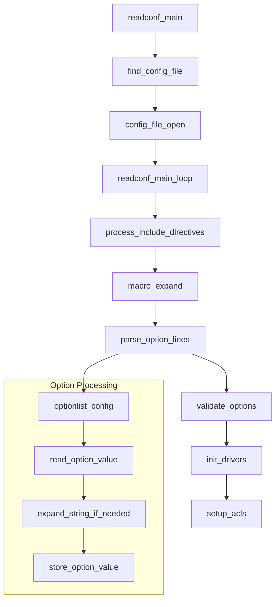

Exim's configuration file uses a structured text format processed by the `readconf_main()` function. The parser handles multiple syntax elements including options, sections, macros, and conditional compilation directives.

### Option Syntax Types

| Option Type | Syntax | Example | Storage |
| --- | --- | --- | --- |
| `opt_stringptr` | `option = value` | `primary_hostname = mail.example.com` | `uschar *` pointer |
| `opt_int` | `option = number` | `message_size_limit = 50M` | `int` value |
| `opt_bool` | `option = yes/no` | `accept_8bitmime = yes` | `BOOL` flag |
| `opt_time` | `option = time` | `smtp_accept_max_nonmail_hosts = 5m` | `int` (seconds) |
| `opt_expand_bool` | `option = ${if...}` | `hosts_randomize = ${if eq{$domain}{local}{no}{yes}}` | Expanded `BOOL` |
| `opt_expand_gid` | `option = group` | `exim_group = ${lookup{...}}` | Expanded `gid_t` |

### Configuration File Structure

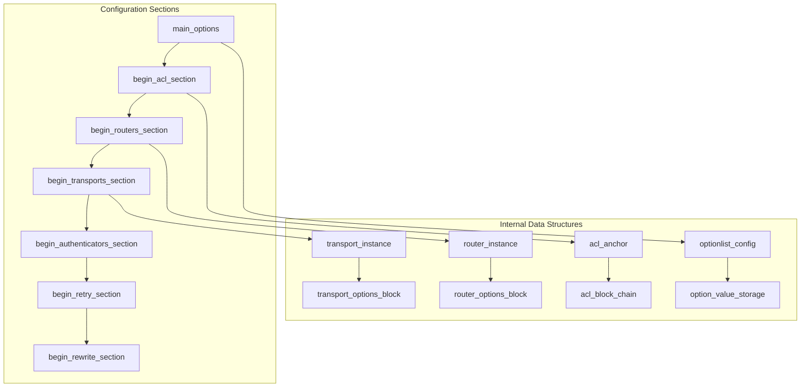

The configuration file is processed in order, with each section handled by specific parsing functions. The `optionlist_config[]` table defines all main section options with their types and storage locations.

Sources: [src/src/readconf.c L33-L789](https://github.com/Exim/exim/blob/29568b25/src/src/readconf.c#L33-L789)

 [src/src/readconf.c L3000-L3200](https://github.com/Exim/exim/blob/29568b25/src/src/readconf.c#L3000-L3200)

 [src/src/globals.c L47-L900](https://github.com/Exim/exim/blob/29568b25/src/src/globals.c#L47-L900)

### Main Section

The main section contains global options that affect Exim's overall behavior. These options are specified as simple keyword/value pairs:

```markdown
# Example main section
primary_hostname = example.com
qualify_domain = example.com
log_selector = +all_parents
message_size_limit = 50M
```

Almost all options have default values which are used if the option is not specified in the configuration file. Many options are expanded before use, which allows for dynamic configuration based on variables or lookup functions.

Sources: [src/src/readconf.c L33-L789](https://github.com/Exim/exim/blob/29568b25/src/src/readconf.c#L33-L789)

 [doc/doc-txt/OptionLists.txt L17-L24](https://github.com/Exim/exim/blob/29568b25/doc/doc-txt/OptionLists.txt#L17-L24)

### ACL Section

Access Control Lists (ACLs) define rules for accepting or rejecting messages at different stages of SMTP communication. ACLs are referenced by name from the main configuration section, and each ACL consists of a sequence of rules with conditions and actions.

```yaml
# Example ACL section
begin acl

acl_check_rcpt:
  deny    domains       = +local_domains
          local_parts   = ^[.] : ^.*[@%!/|]
          message       = restricted characters in local part

  accept  domains       = +local_domains
          endpass
          verify        = recipient

  accept  domains       = +relay_domains
          endpass
          verify        = recipient

  deny    message       = relay not permitted
```

Sources: [src/src/acl.c L26-L56](https://github.com/Exim/exim/blob/29568b25/src/src/acl.c#L26-L56)

 [src/src/acl.c L99-L226](https://github.com/Exim/exim/blob/29568b25/src/src/acl.c#L99-L226)

### Router Section

Routers determine how mail addresses are handled. Each router defines a way of routing an address, and addresses are processed by routers in sequence until one accepts the address or all have been tried.

```yaml
# Example router section
begin routers

localuser:
  driver = accept
  check_local_user
  transport = local_delivery
```

Sources: [src/src/globals.h L8301-L8339](https://github.com/Exim/exim/blob/29568b25/src/src/globals.h#L8301-L8339)

### Transport Section

Transports define how messages are delivered. Each transport is responsible for a specific delivery method, such as SMTP, local file delivery, or piping to a command.

```yaml
# Example transport section
begin transports

local_delivery:
  driver = appendfile
  file = /var/mail/$local_part
  user = $local_part
```

Sources: [src/src/transport.c L22-L70](https://github.com/Exim/exim/blob/29568b25/src/src/transport.c#L22-L70)

 [src/src/transports/smtp.c L25-L153](https://github.com/Exim/exim/blob/29568b25/src/src/transports/smtp.c#L25-L153)

### Authenticator Section

Authenticators define methods for SMTP authentication, both for authenticating clients connecting to Exim and for Exim authenticating to other servers.

```css
# Example authenticator section
begin authenticators

plain:
  driver = plaintext
  server_prompts = :
  server_condition = "${if eq{$auth2}{mysecret}{yes}{no}}"
  server_set_id = $auth1
```

Sources: [src/src/globals.c L19-L38](https://github.com/Exim/exim/blob/29568b25/src/src/globals.c#L19-L38)

## Configuration Loading and Processing

### Configuration Loading Function Flow

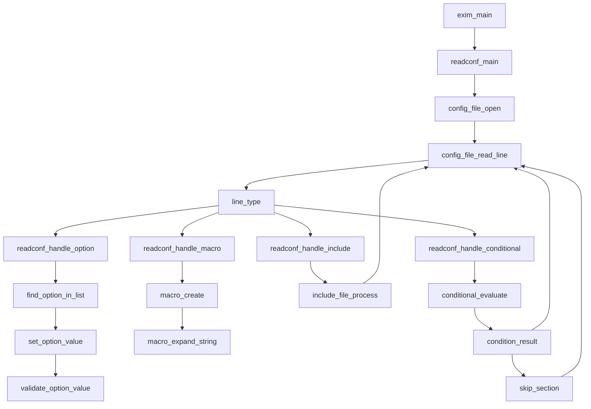

### Configuration Memory Layout

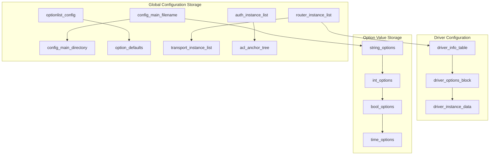

The configuration loading process involves several key functions:

1. **`readconf_main()`**: Main configuration reading entry point
2. **`config_file_read_line()`**: Reads and preprocesses configuration lines
3. **`readconf_handle_option()`**: Processes individual option assignments
4. **`find_option_in_list()`**: Locates option definitions in `optionlist_config[]`
5. **`set_option_value()`**: Stores option values in global variables

Configuration data is stored in global variables defined in `globals.c`, with option metadata in `optionlist_config[]`.

Sources: [src/src/readconf.c L2500-L2800](https://github.com/Exim/exim/blob/29568b25/src/src/readconf.c#L2500-L2800)

 [src/src/readconf.c L3000-L3500](https://github.com/Exim/exim/blob/29568b25/src/src/readconf.c#L3000-L3500)

 [src/src/globals.c L700-L1200](https://github.com/Exim/exim/blob/29568b25/src/src/globals.c#L700-L1200)

## String Expansion Engine

### Expansion Processing Architecture

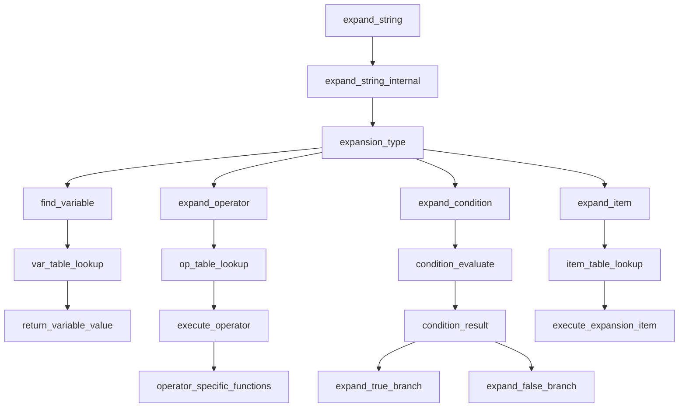

### Variable Resolution System

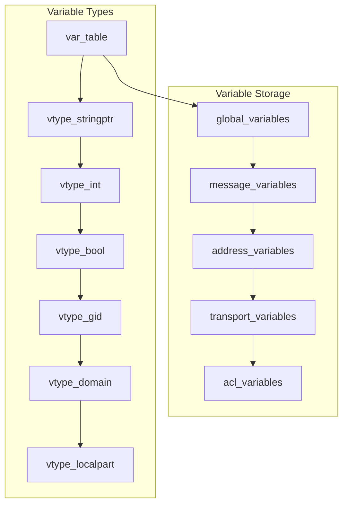

The string expansion system is implemented in `expand.c` with several key components:

| Component | Function | Purpose |
| --- | --- | --- |
| `expand_string()` | Main expansion entry point | Processes expansion strings |
| `var_table[]` | Variable lookup table | Maps variable names to values |
| `op_table_main[]` | Operator lookup table | Defines available operators |
| `item_table[]` | Expansion item table | Defines expansion items like `${if}` |
| `cond_table[]` | Condition table | Defines condition operators |

### Expansion Syntax Elements

The expansion engine recognizes several syntax patterns:

* **Variables**: `$variable_name` - Simple variable references
* **Braced Variables**: `${variable_name}` - Variables with explicit boundaries
* **Operators**: `${operator:argument}` - String manipulation operators
* **Items**: `${item{arguments}}` - Complex expansion items
* **Conditions**: `${if condition{true}{false}}` - Conditional expansion

Configuration options marked with `*` in `optionlist_config[]` are subject to expansion before use.

Sources: [src/src/expand.c L109-L313](https://github.com/Exim/exim/blob/29568b25/src/src/expand.c#L109-L313)

 [src/src/expand.c L434-L728](https://github.com/Exim/exim/blob/29568b25/src/src/expand.c#L434-L728)

 [src/src/expand.c L3000-L3500](https://github.com/Exim/exim/blob/29568b25/src/src/expand.c#L3000-L3500)

## Configuration Validation and Error Handling

### Validation Process Flow

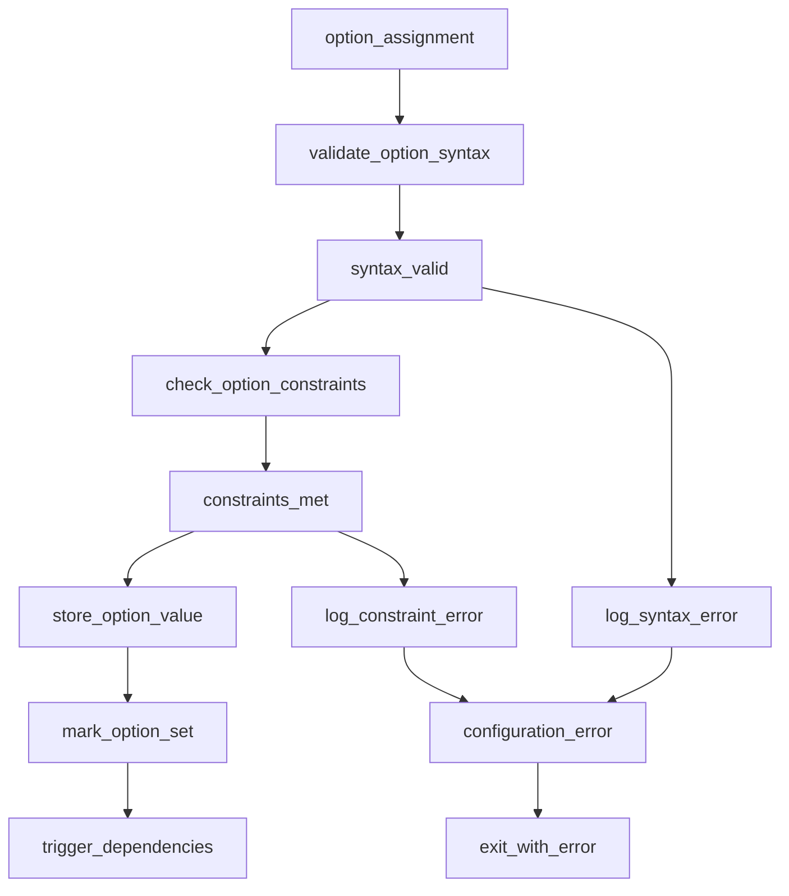

### Configuration Error Types

| Error Type | Detection Function | Example |
| --- | --- | --- |
| Syntax Error | `readconf_handle_option()` | Invalid option syntax |
| Type Mismatch | `set_option_value()` | String assigned to integer option |
| Range Error | `validate_option_constraints()` | Negative timeout value |
| Missing Dependency | `check_driver_dependencies()` | Router without transport |
| Circular Reference | `detect_circular_references()` | Router referring to itself |

### Option Validation Functions

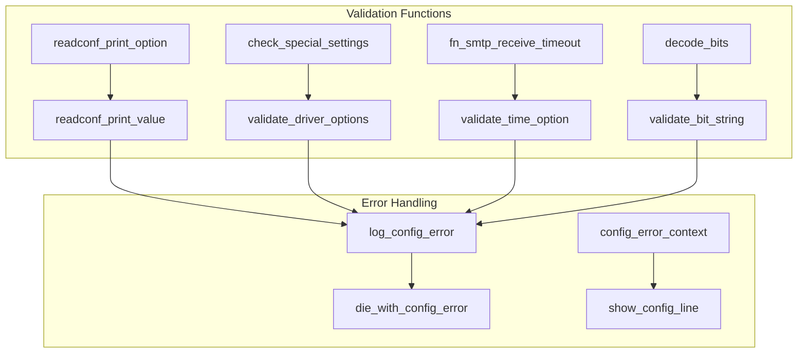

The validation system uses several mechanisms:

1. **Type Checking**: Options are validated against their declared types in `optionlist_config[]`
2. **Range Validation**: Numeric options are checked against acceptable ranges
3. **Dependency Checking**: Inter-option dependencies are validated
4. **Driver Validation**: Router, transport, and authenticator configurations are validated

Configuration errors are handled by `log_write_die()` which logs the error and terminates Exim.

Sources: [src/src/readconf.c L4000-L4500](https://github.com/Exim/exim/blob/29568b25/src/src/readconf.c#L4000-L4500)

 [src/src/readconf.c L5000-L5500](https://github.com/Exim/exim/blob/29568b25/src/src/readconf.c#L5000-L5500)

 [src/src/exim.c L3000-L3200](https://github.com/Exim/exim/blob/29568b25/src/src/exim.c#L3000-L3200)

## Driver Configuration System

### Driver Initialization Process

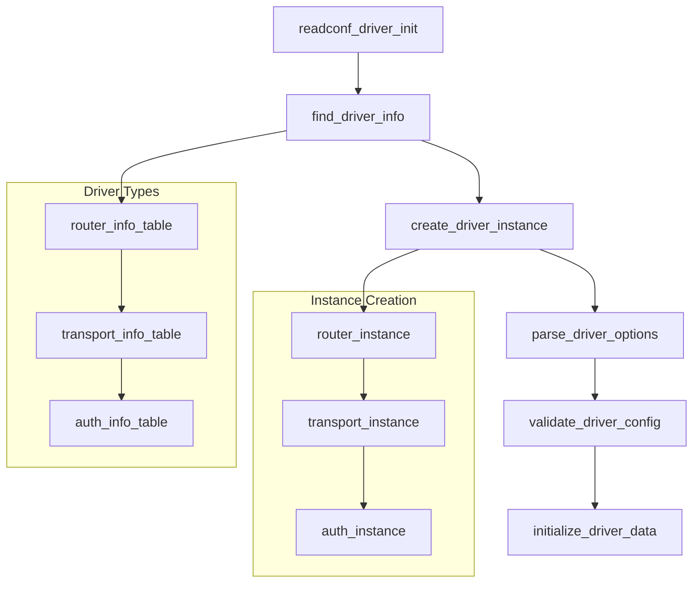

### Driver Configuration Storage

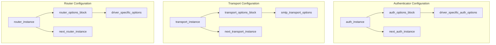

Driver configuration involves several key data structures:

| Structure | Purpose | Key Fields |
| --- | --- | --- |
| `driver_instance` | Base driver structure | `driver_name`, `options_block` |
| `router_instance` | Router-specific data | `accept_router`, `pass_router` |
| `transport_instance` | Transport-specific data | `driver`, `options_block` |
| `auth_instance` | Authenticator data | `server_condition`, `client_condition` |

The driver system uses a plugin architecture where each driver type (router, transport, authenticator) defines its own option table and initialization functions.

Sources: [src/src/readconf.c L3500-L4000](https://github.com/Exim/exim/blob/29568b25/src/src/readconf.c#L3500-L4000)

 [src/src/route.c L100-L200](https://github.com/Exim/exim/blob/29568b25/src/src/route.c#L100-L200)

 [src/src/transport.c L22-L70](https://github.com/Exim/exim/blob/29568b25/src/src/transport.c#L22-L70)

## Configuration Command-Line Interface

### Configuration Inspection Commands

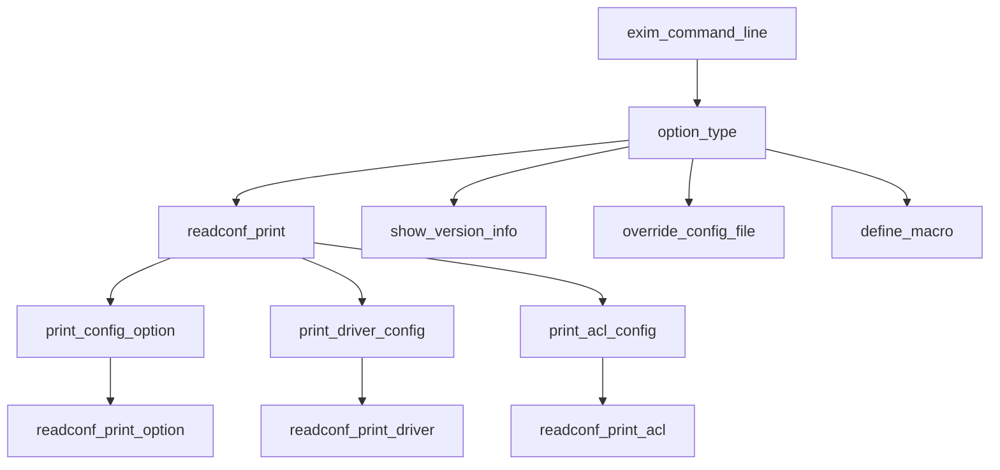

### Configuration Testing and Validation

| Command | Function | Purpose |
| --- | --- | --- |
| `exim -bP` | `readconf_print()` | Print configuration values |
| `exim -bP config` | `readconf_print_config()` | Print effective configuration |
| `exim -bV` | `show_version()` | Show build and version info |
| `exim -C file` | `override_config_file()` | Use alternate config file |
| `exim -D macro=value` | `macro_define()` | Define configuration macros |

### Configuration File Location and Override

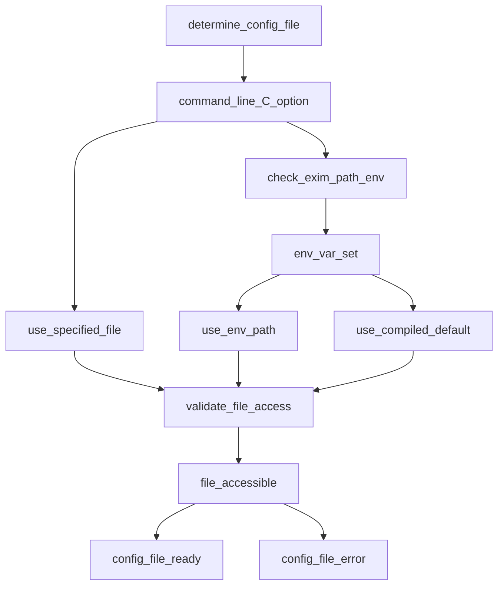

The configuration file location is determined by:

1. Command-line `-C` option (highest priority)
2. `EXIM_PATH` environment variable
3. Compiled-in default path (typically `/etc/exim/exim.conf`)

Configuration validation includes file accessibility checks, syntax validation, and semantic checks for option dependencies.

Sources: [src/src/exim.c L800-L1200](https://github.com/Exim/exim/blob/29568b25/src/src/exim.c#L800-L1200)

 [src/src/readconf.c L5500-L6000](https://github.com/Exim/exim/blob/29568b25/src/src/readconf.c#L5500-L6000)

 [src/src/exim.c L4000-L4500](https://github.com/Exim/exim/blob/29568b25/src/src/exim.c#L4000-L4500)

## Transport Configuration Options

Transport configuration is particularly important as it controls how messages are delivered. The SMTP transport (used for delivering to remote servers) has a rich set of options:

```css
# Example SMTP transport
remote_smtp:
  driver = smtp
  hosts = ${lookup dnsdb{>: mxh=$domain}}
  connect_timeout = 30s
  helo_data = $primary_hostname
  message_size_limit = ${if eq{$sender_host_address}{127.0.0.1} {50M}{10M}}
```

Transport options can use string expansion, allowing for dynamic behavior based on message attributes.

Sources: [src/src/transports/smtp.c L25-L150](https://github.com/Exim/exim/blob/29568b25/src/src/transports/smtp.c#L25-L150)

 [src/src/transport.c L22-L70](https://github.com/Exim/exim/blob/29568b25/src/src/transport.c#L22-L70)

## Configuration Data Structures and Memory Management

### Configuration Storage Architecture

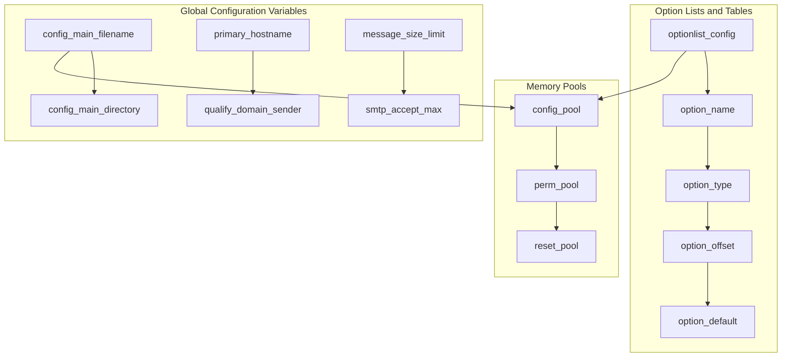

### Configuration Option Metadata

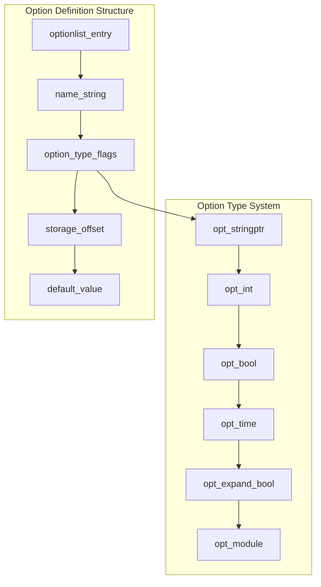

Configuration data is managed through several key structures:

| Structure | Purpose | Location |
| --- | --- | --- |
| `optionlist_config[]` | Main option definitions | [src/src/readconf.c L33-L789](https://github.com/Exim/exim/blob/29568b25/src/src/readconf.c#L33-L789) |
| `config_main_filename` | Configuration file path | [src/src/globals.c L493](https://github.com/Exim/exim/blob/29568b25/src/src/globals.c#L493-L493) |
| Memory pools | Configuration data storage | [src/src/store.c](https://github.com/Exim/exim/blob/29568b25/src/src/store.c) |
| Option type flags | Option parsing behavior | [src/src/mytypes.h](https://github.com/Exim/exim/blob/29568b25/src/src/mytypes.h) |

The configuration system uses Exim's memory pool system to manage configuration data, with different pools for permanent configuration data versus temporary parsing data.

Sources: [src/src/readconf.c L33-L800](https://github.com/Exim/exim/blob/29568b25/src/src/readconf.c#L33-L800)

 [src/src/globals.c L400-L800](https://github.com/Exim/exim/blob/29568b25/src/src/globals.c#L400-L800)

 [src/src/store.c L100-L300](https://github.com/Exim/exim/blob/29568b25/src/src/store.c#L100-L300)

## Runtime vs. Build-time Configuration

It's important to understand the distinction between:

1. **Runtime Configuration**: Set in the configuration file, can be changed without recompiling Exim
2. **Build-time Configuration**: Set during compilation, determines what features are available

Some features must be enabled at build time before they can be configured at runtime. For example, content scanning support must be compiled in before content scanning options can be used in the configuration file.

Sources: [doc/doc-txt/spec.xfpt L400-L417](https://github.com/Exim/exim/blob/29568b25/doc/doc-txt/spec.xfpt#L400-L417)

## Configuration Inheritance and Overrides

In complex configurations, it's common to have a base configuration that is extended or overridden for specific use cases. Exim supports this through:

1. **Include Files**: Using `.include` to include common configuration snippets
2. **Macros**: Defining values that can be used throughout the configuration
3. **Conditional Statements**: Using `.ifdef`, `.ifndef`, `.else`, `.endif` for conditional configuration

This allows for maintaining a modular configuration that can adapt to different environments.

Sources: [src/src/readconf.c L200-L300](https://github.com/Exim/exim/blob/29568b25/src/src/readconf.c#L200-L300)

## Configuration Verification

Exim provides tools to verify configuration correctness:

1. **`exim -bV`**: Display version and build information
2. **`exim -bP`**: Display configuration values
3. **`exim -bf`**: Test address filtering
4. **`exim -bh`**: Test host checking

These tools are invaluable for troubleshooting configuration issues without risking actual mail delivery problems.

Sources: [test/stderr/0002 L1-L7](https://github.com/Exim/exim/blob/29568b25/test/stderr/0002#L1-L7)

 [test/stderr/0388 L1-L12](https://github.com/Exim/exim/blob/29568b25/test/stderr/0388#L1-L12)

## Conclusion

Exim's runtime configuration system is powerful and flexible, allowing for complex mail handling policies to be implemented without modifying the core codebase. The combination of a structured configuration file format, string expansion, and conditional processing creates a system that can adapt to a wide range of mail server requirements.

Understanding how Exim processes its configuration is essential for effective mail server administration and troubleshooting.