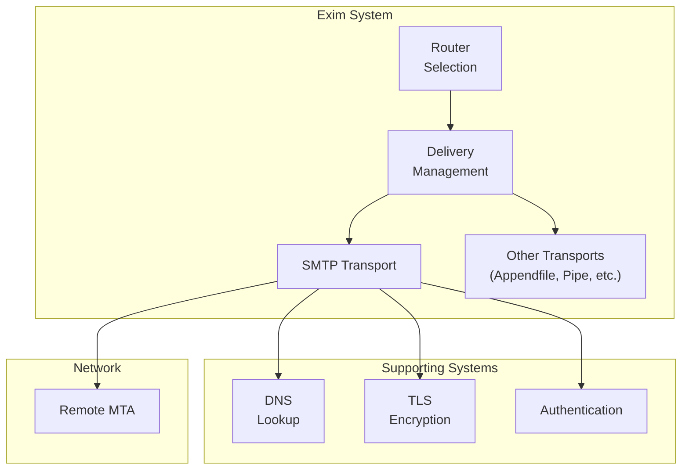
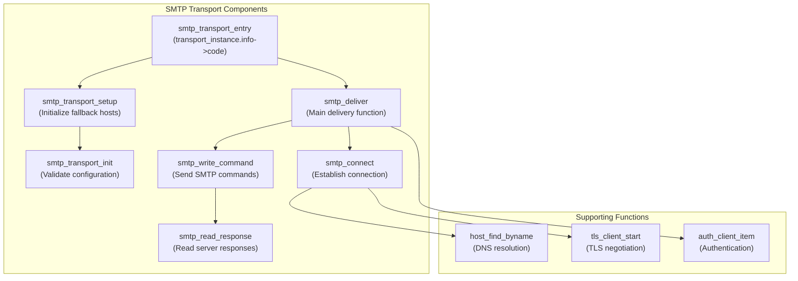
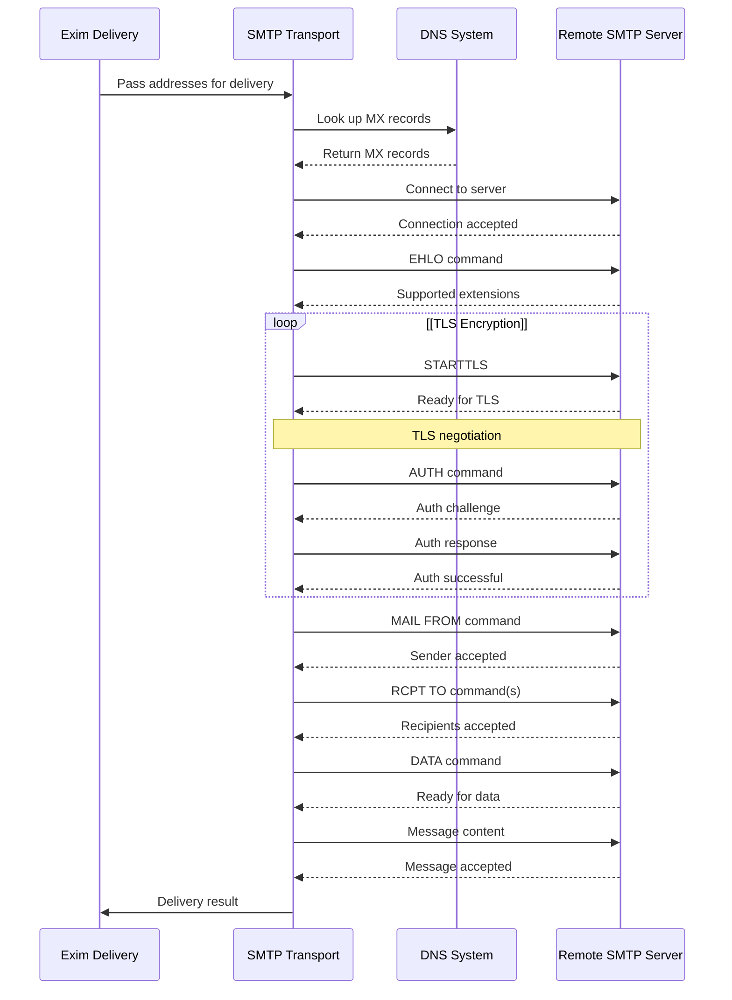
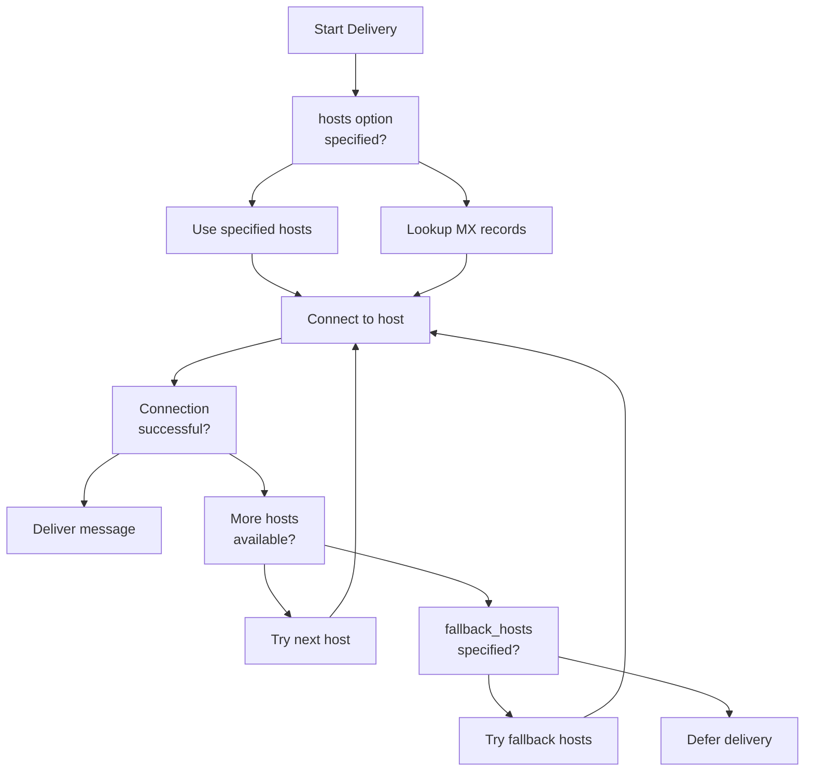

# SMTP Transport

> **Relevant source files**
> * [doc/doc-docbook/spec.xfpt](https://github.com/Exim/exim/blob/29568b25/doc/doc-docbook/spec.xfpt)
> * [doc/doc-txt/ChangeLog](https://github.com/Exim/exim/blob/29568b25/doc/doc-txt/ChangeLog)
> * [doc/doc-txt/NewStuff](https://github.com/Exim/exim/blob/29568b25/doc/doc-txt/NewStuff)
> * [doc/doc-txt/OptionLists.txt](https://github.com/Exim/exim/blob/29568b25/doc/doc-txt/OptionLists.txt)
> * [src/src/acl.c](https://github.com/Exim/exim/blob/29568b25/src/src/acl.c)
> * [src/src/daemon.c](https://github.com/Exim/exim/blob/29568b25/src/src/daemon.c)
> * [src/src/deliver.c](https://github.com/Exim/exim/blob/29568b25/src/src/deliver.c)
> * [src/src/exim.c](https://github.com/Exim/exim/blob/29568b25/src/src/exim.c)
> * [src/src/expand.c](https://github.com/Exim/exim/blob/29568b25/src/src/expand.c)
> * [src/src/functions.h](https://github.com/Exim/exim/blob/29568b25/src/src/functions.h)
> * [src/src/globals.c](https://github.com/Exim/exim/blob/29568b25/src/src/globals.c)
> * [src/src/globals.h](https://github.com/Exim/exim/blob/29568b25/src/src/globals.h)
> * [src/src/readconf.c](https://github.com/Exim/exim/blob/29568b25/src/src/readconf.c)
> * [src/src/receive.c](https://github.com/Exim/exim/blob/29568b25/src/src/receive.c)
> * [src/src/smtp_in.c](https://github.com/Exim/exim/blob/29568b25/src/src/smtp_in.c)
> * [src/src/structs.h](https://github.com/Exim/exim/blob/29568b25/src/src/structs.h)
> * [src/src/transport.c](https://github.com/Exim/exim/blob/29568b25/src/src/transport.c)
> * [src/src/transports/appendfile.c](https://github.com/Exim/exim/blob/29568b25/src/src/transports/appendfile.c)
> * [src/src/transports/autoreply.c](https://github.com/Exim/exim/blob/29568b25/src/src/transports/autoreply.c)
> * [src/src/transports/lmtp.c](https://github.com/Exim/exim/blob/29568b25/src/src/transports/lmtp.c)
> * [src/src/transports/pipe.c](https://github.com/Exim/exim/blob/29568b25/src/src/transports/pipe.c)
> * [src/src/transports/smtp.c](https://github.com/Exim/exim/blob/29568b25/src/src/transports/smtp.c)
> * [src/src/transports/tf_maildir.c](https://github.com/Exim/exim/blob/29568b25/src/src/transports/tf_maildir.c)
> * [src/src/verify.c](https://github.com/Exim/exim/blob/29568b25/src/src/verify.c)

The SMTP transport is the primary mechanism for delivering mail from Exim to remote SMTP servers. This document explains how the SMTP transport works, its configuration options, and its key features. For information about local mail delivery, see [File and Directory Storage](/Exim/exim/6.1-file-and-directory-storage) and for piping output to external commands, see [Pipe Transport](/Exim/exim/6.3-pipe-transport).

## Overview

The SMTP transport delivers messages to remote hosts using the SMTP protocol (or its variants like ESMTP and LMTP). It supports various features including TLS encryption, authentication, connection caching, pipelining, and various retry mechanisms.

Sources: [src/src/transports/smtp.c L10-L21](https://github.com/Exim/exim/blob/29568b25/src/src/transports/smtp.c#L10-L21)

 [src/src/deliver.c L22-L31](https://github.com/Exim/exim/blob/29568b25/src/src/deliver.c#L22-L31)

## Architecture

The SMTP transport is implemented as a driver within Exim's modular transport architecture. It is primarily defined in the `smtp.c` file and is responsible for establishing SMTP connections, sending appropriate SMTP commands, and handling responses from remote servers.

Sources: [src/src/transports/smtp.c L315-L370](https://github.com/Exim/exim/blob/29568b25/src/src/transports/smtp.c#L315-L370)

 [src/src/transports/smtp.c L387-L437](https://github.com/Exim/exim/blob/29568b25/src/src/transports/smtp.c#L387-L437)

## Configuration Options

The SMTP transport has numerous configuration options that control its behavior. Here are some of the most important ones:

| Option | Type | Default | Description |
| --- | --- | --- | --- |
| `hosts` | opt_stringptr | NULL | List of hosts to try for routing |
| `port` | opt_stringptr | "25" | SMTP port (default: 25) |
| `protocol` | opt_stringptr | NULL | Protocol to use (smtp, lmtp, smtps, submissions) |
| `helo_data` | opt_stringptr | "$primary_hostname" | Data to send in HELO/EHLO command |
| `command_timeout` | opt_time | 5*60 | Timeout for SMTP commands |
| `connect_timeout` | opt_time | 5*60 | Timeout for initial connection |
| `data_timeout` | opt_time | 5*60 | Timeout for DATA command |
| `final_timeout` | opt_time | 10*60 | Timeout for final dot |
| `connection_max_messages` | opt_int | 1 | Max messages per connection |
| `hosts_max_try` | opt_int | 5 | Max hosts to try |
| `hosts_max_try_hardlimit` | opt_int | 50 | Hard limit on hosts to try |
| `fallback_hosts` | opt_stringptr | NULL | Hosts to try if primary hosts fail |
| `hosts_try_auth` | opt_stringptr | NULL | Hosts to try authentication with |
| `hosts_require_tls` | opt_stringptr | NULL | Hosts that require TLS encryption |
| `hosts_try_chunking` | opt_stringptr | "*" | Hosts to try CHUNKING with |
| `tls_certificate` | opt_stringptr | NULL | Client TLS certificate path |
| `tls_privatekey` | opt_stringptr | NULL | Client TLS private key path |

The complete list of options is defined in the `smtp_transport_options` array with defaults in `smtp_transport_option_defaults`.

Sources: [src/src/transports/smtp.c L25-L153](https://github.com/Exim/exim/blob/29568b25/src/src/transports/smtp.c#L25-L153)

 [src/src/transports/smtp.c L174-L216](https://github.com/Exim/exim/blob/29568b25/src/src/transports/smtp.c#L174-L216)

## Operational Flow

The SMTP transport follows a specific flow when delivering messages:

1. The transport receives addresses from Exim's delivery system
2. It resolves the target hosts via DNS or other methods
3. It connects to the hosts, trying alternatives if needed
4. It negotiates TLS if required or available
5. It authenticates if required or available
6. It sends the message using SMTP commands
7. It handles and reports the server's responses

Sources: [src/src/transports/smtp.c L315-L370](https://github.com/Exim/exim/blob/29568b25/src/src/transports/smtp.c#L315-L370)

 [src/src/deliver.c L192-L280](https://github.com/Exim/exim/blob/29568b25/src/src/deliver.c#L192-L280)

## Host Selection and Connection

The SMTP transport selects hosts to connect to based on:

1. The `hosts` option if specified
2. MX records found via DNS lookups
3. `fallback_hosts` if primary hosts fail

The transport can be configured to try multiple hosts and to retry failed deliveries according to Exim's retry rules.

Sources: [src/src/transports/smtp.c L354-L369](https://github.com/Exim/exim/blob/29568b25/src/src/transports/smtp.c#L354-L369)

 [src/src/deliver.c L5240-L5480](https://github.com/Exim/exim/blob/29568b25/src/src/deliver.c#L5240-L5480)

## Protocol Negotiation

The SMTP transport supports various SMTP protocol extensions and features. It negotiates these capabilities with the remote server during the EHLO phase:

| Feature | Description |
| --- | --- |
| `PIPELINING` | Sends multiple commands without waiting for responses |
| `STARTTLS` | Negotiates TLS encryption |
| `AUTH` | Authentication mechanisms |
| `SIZE` | Maximum message size |
| `DSN` | Delivery Status Notifications |
| `CHUNKING` | BDAT command support |
| `PRDR` | Per-Recipient Data Response |
| `SMTPUTF8` | UTF-8 support for addresses |

The transport uses compiled regular expressions to parse EHLO responses and detect supported features. Key regex patterns include:

* `regex_AUTH`: Detects AUTH support
* `regex_CHUNKING`: Detects CHUNKING/BDAT support
* `regex_PIPELINING`: Detects PIPELINING support
* `regex_STARTTLS`: Detects STARTTLS support
* `regex_SIZE`: Detects SIZE extension
* `regex_DSN`: Detects DSN support

These are compiled during `smtp_deliver_init()` and used by `ehlo_response()` to parse server capabilities.

Sources: [src/src/transports/smtp.c L254-L290](https://github.com/Exim/exim/blob/29568b25/src/src/transports/smtp.c#L254-L290)

 [src/src/transports/smtp.c L238-L251](https://github.com/Exim/exim/blob/29568b25/src/src/transports/smtp.c#L238-L251)

## Security Features

### TLS Encryption

The SMTP transport can use TLS to encrypt communications with remote servers. This can be controlled with options like:

* `hosts_require_tls`: Hosts that require TLS
* `hosts_avoid_tls`: Hosts that should not use TLS
* `tls_certificate`: Client certificate to present
* `tls_privatekey`: Private key for the client certificate
* `tls_verify_certificates`: CA certificates to verify server certificates

The transport can also be configured to verify server certificates and to require specific cipher suites.

### DANE Support

If Exim is built with DANE support, the SMTP transport can use DANE to verify the authenticity of TLS certificates. This adds an additional layer of security by validating certificates against TLSA DNS records.

### Authentication

The transport can authenticate to remote servers using various mechanisms. The `hosts_try_auth` and `hosts_require_auth` options control which hosts require authentication. The actual authentication data comes from Exim's authenticator configuration.

Sources: [src/src/transports/smtp.c L77-L104](https://github.com/Exim/exim/blob/29568b25/src/src/transports/smtp.c#L77-L104)

 [src/src/transports/smtp.c L133-L148](https://github.com/Exim/exim/blob/29568b25/src/src/transports/smtp.c#L133-L148)

## Advanced Features

### Pipelining

The SMTP transport supports the PIPELINING extension, which allows it to send multiple SMTP commands without waiting for responses. This can significantly improve performance, especially for messages with multiple recipients.

### Connection Caching

The transport can reuse connections for multiple messages being sent to the same host. This is controlled by the `connection_max_messages` option, which specifies how many messages can be sent over a single connection.

### CHUNKING

If the remote server supports the CHUNKING extension (BDAT command), the transport can use this more efficient method to transmit message data instead of the traditional DATA command.

### Per-Recipient Delivery

The transport handles per-recipient delivery status, allowing it to report success or failure for each recipient individually. This is enhanced if the remote server supports the PRDR extension.

Sources: [src/src/transports/smtp.c L87-L112](https://github.com/Exim/exim/blob/29568b25/src/src/transports/smtp.c#L87-L112)

 [src/src/transports/smtp.c L42-L44](https://github.com/Exim/exim/blob/29568b25/src/src/transports/smtp.c#L42-L44)

## Error Handling and Retries

The SMTP transport includes comprehensive error handling. It categorizes errors as:

* Permanent failures (5xx responses)
* Temporary failures (4xx responses)
* Connection failures

Temporary failures and connection problems are handled according to Exim's retry configuration. The transport will defer delivery and let Exim's queue processing retry the delivery later.

For multi-recipient deliveries, the transport tracks the status of each recipient separately, allowing some recipients to succeed while others fail or are deferred.

The transport categorizes SMTP response codes and handles them through several key functions:

* `sync_responses()`: Handles pipelined command responses
* `smtp_handle_acl_fail()`: Processes ACL-based failures
* Response parsing distinguishes 2xx (success), 4xx (temporary), and 5xx (permanent) codes

The transport tracks per-recipient status through the `address_item` structure, allowing individual success/failure reporting even in multi-recipient deliveries.

Sources: [src/src/transports/smtp.c L240-L251](https://github.com/Exim/exim/blob/29568b25/src/src/transports/smtp.c#L240-L251)

 [src/src/deliver.c L446-L485](https://github.com/Exim/exim/blob/29568b25/src/src/deliver.c#L446-L485)

## Debugging and Logging

The SMTP transport provides detailed logging of its operations. When debugging is enabled, it logs:

* DNS lookup results
* Connection attempts
* SMTP commands and responses
* TLS negotiation details
* Authentication attempts
* Delivery outcomes

These logs are invaluable for troubleshooting delivery problems and understanding how the transport is interacting with remote servers.

Sources: [src/src/transports/smtp.c L5178-L5233](https://github.com/Exim/exim/blob/29568b25/src/src/transports/smtp.c#L5178-L5233)

 [src/src/transports/smtp.c L5434-L5472](https://github.com/Exim/exim/blob/29568b25/src/src/transports/smtp.c#L5434-L5472)