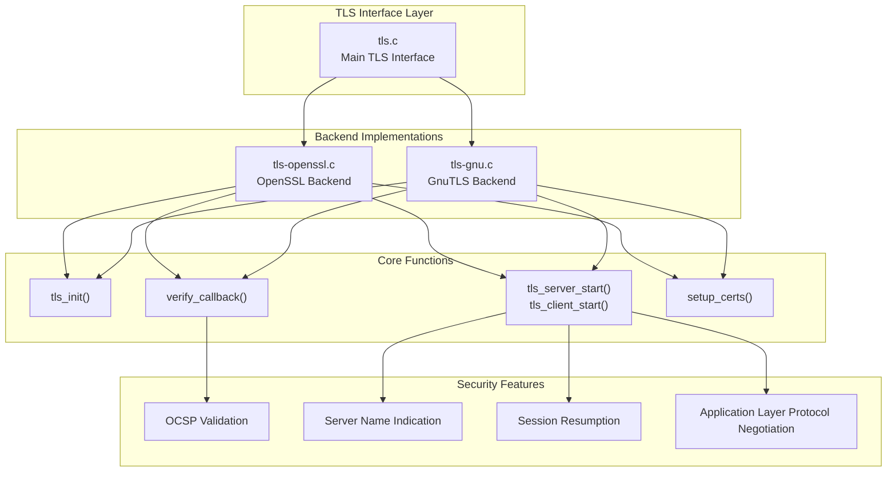
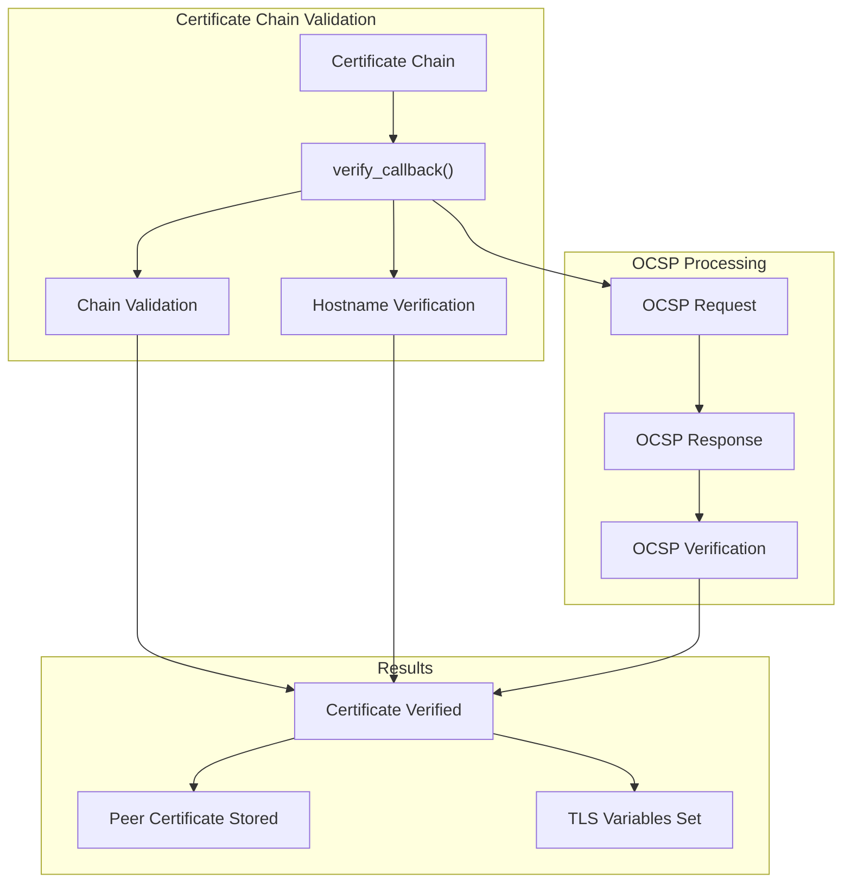
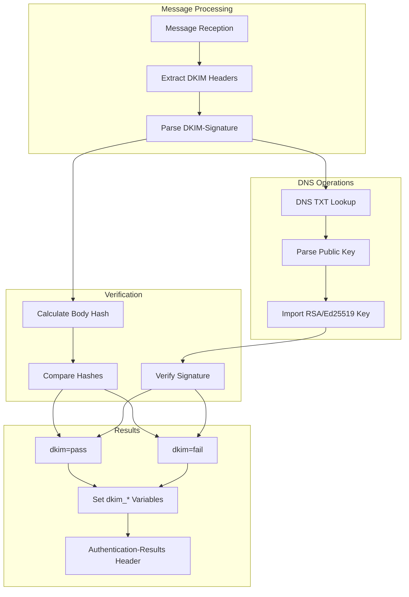
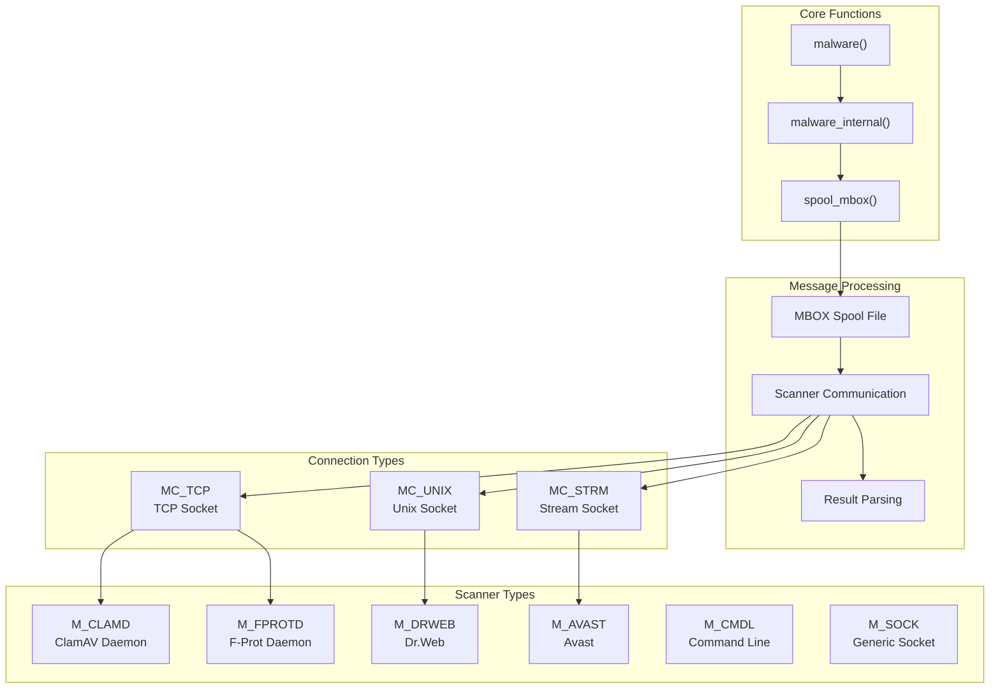
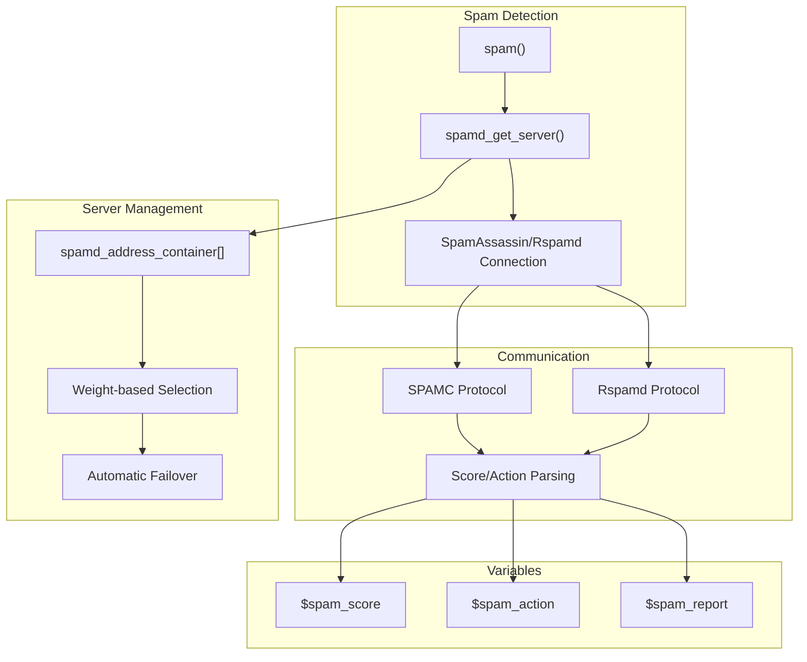
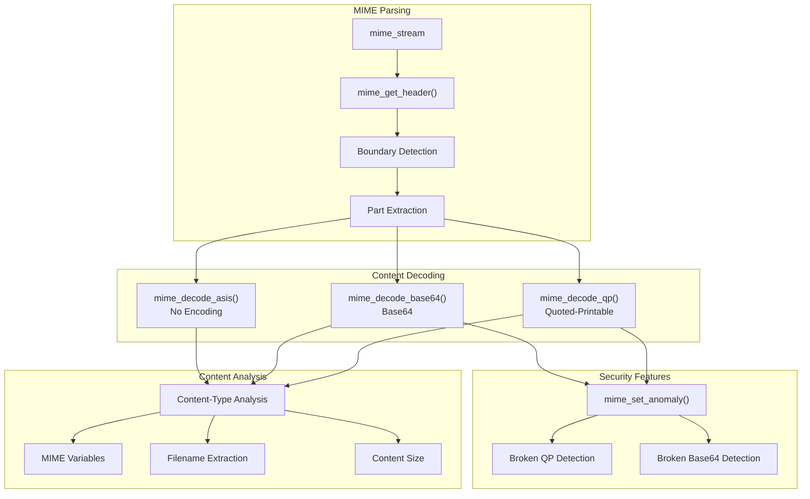
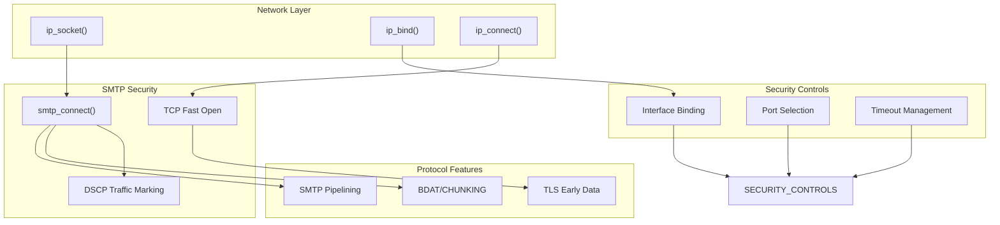

# Security Features

> **Relevant source files**
> * [src/src/ip.c](https://github.com/Exim/exim/blob/29568b25/src/src/ip.c)
> * [src/src/malware.c](https://github.com/Exim/exim/blob/29568b25/src/src/malware.c)
> * [src/src/mime.c](https://github.com/Exim/exim/blob/29568b25/src/src/mime.c)
> * [src/src/mime.h](https://github.com/Exim/exim/blob/29568b25/src/src/mime.h)
> * [src/src/regex.c](https://github.com/Exim/exim/blob/29568b25/src/src/regex.c)
> * [src/src/smtp_out.c](https://github.com/Exim/exim/blob/29568b25/src/src/smtp_out.c)
> * [src/src/spam.c](https://github.com/Exim/exim/blob/29568b25/src/src/spam.c)
> * [src/src/spool_mbox.c](https://github.com/Exim/exim/blob/29568b25/src/src/spool_mbox.c)
> * [src/src/tls-gnu.c](https://github.com/Exim/exim/blob/29568b25/src/src/tls-gnu.c)
> * [src/src/tls-openssl.c](https://github.com/Exim/exim/blob/29568b25/src/src/tls-openssl.c)
> * [test/aux-fixed/4502.msg2.txt](https://github.com/Exim/exim/blob/29568b25/test/aux-fixed/4502.msg2.txt)
> * [test/aux-fixed/4502.msg3.txt](https://github.com/Exim/exim/blob/29568b25/test/aux-fixed/4502.msg3.txt)
> * [test/confs/4000](https://github.com/Exim/exim/blob/29568b25/test/confs/4000)
> * [test/confs/4500](https://github.com/Exim/exim/blob/29568b25/test/confs/4500)
> * [test/log/4000](https://github.com/Exim/exim/blob/29568b25/test/log/4000)
> * [test/log/4500](https://github.com/Exim/exim/blob/29568b25/test/log/4500)
> * [test/log/4501](https://github.com/Exim/exim/blob/29568b25/test/log/4501)
> * [test/log/4502](https://github.com/Exim/exim/blob/29568b25/test/log/4502)
> * [test/log/4506](https://github.com/Exim/exim/blob/29568b25/test/log/4506)
> * [test/mail/4000.userx](https://github.com/Exim/exim/blob/29568b25/test/mail/4000.userx)
> * [test/rejectlog/4000](https://github.com/Exim/exim/blob/29568b25/test/rejectlog/4000)
> * [test/scripts/4000-scanning/4000](https://github.com/Exim/exim/blob/29568b25/test/scripts/4000-scanning/4000)
> * [test/scripts/4500-DKIM/4500](https://github.com/Exim/exim/blob/29568b25/test/scripts/4500-DKIM/4500)
> * [test/scripts/4500-DKIM/4506](https://github.com/Exim/exim/blob/29568b25/test/scripts/4500-DKIM/4506)
> * [test/stderr/4507](https://github.com/Exim/exim/blob/29568b25/test/stderr/4507)
> * [test/stdout/4000](https://github.com/Exim/exim/blob/29568b25/test/stdout/4000)

This document covers Exim's comprehensive security mechanisms including encryption, authentication, and content filtering. These features protect mail transmission through TLS/SSL, verify message authenticity via DKIM, and filter malicious content through integrated scanning systems.

For information about Access Control Lists (ACLs) that enforce security policies, see [Access Control Lists (ACLs)](/Exim/exim/2.4-access-control-lists-(acls)). For details on routing and transport security, see [Transport and Delivery](/Exim/exim/2.3-transport-and-delivery).

## TLS/SSL Implementation

Exim provides robust TLS encryption through a pluggable backend architecture supporting both OpenSSL and GnuTLS libraries. The implementation handles certificate verification, session management, and various security protocols.

### TLS Backend Architecture

The TLS implementation uses compile-time selection between backends through conditional compilation. Key structures include `exim_openssl_state_st` for OpenSSL and `exim_gnutls_state_st` for GnuTLS, maintaining connection state and configuration.

Sources: [src/src/tls-openssl.c L1-L2000](https://github.com/Exim/exim/blob/29568b25/src/src/tls-openssl.c#L1-L2000)

 [src/src/tls-gnu.c L1-L2000](https://github.com/Exim/exim/blob/29568b25/src/src/tls-gnu.c#L1-L2000)

### Certificate Verification and OCSP

Certificate verification includes hostname checking via `X509_check_host()` for OpenSSL or custom verification for GnuTLS. OCSP validation provides real-time certificate status checking with configurable response handling.

Sources: [src/src/tls-openssl.c L1096-L1400](https://github.com/Exim/exim/blob/29568b25/src/src/tls-openssl.c#L1096-L1400)

 [src/src/tls-gnu.c L1500-L1800](https://github.com/Exim/exim/blob/29568b25/src/src/tls-gnu.c#L1500-L1800)

## DKIM Verification

Exim implements comprehensive DKIM (DomainKeys Identified Mail) signature verification to authenticate message origin and detect tampering. The DKIM subsystem operates during message reception and integrates with the ACL system.

### DKIM Verification Flow

DKIM verification supports multiple algorithms (rsa-sha1, rsa-sha256, ed25519-sha256) and canonicalization methods (simple, relaxed). The process includes DNS key retrieval, signature validation, and body hash verification.

Sources: Test files [test/log/4502 L1-L28](https://github.com/Exim/exim/blob/29568b25/test/log/4502#L1-L28)

 [test/scripts/4500-DKIM/4500 L1-L100](https://github.com/Exim/exim/blob/29568b25/test/scripts/4500-DKIM/4500#L1-L100)

 [test/confs/4500 L1-L50](https://github.com/Exim/exim/blob/29568b25/test/confs/4500#L1-L50)

## Content Scanning

Exim provides integrated content scanning through external malware scanners and spam detection systems. The scanning architecture supports multiple backends with failover capabilities.

### Malware Scanning Architecture

The malware scanning system creates MBOX-format spool files for scanner consumption and supports various communication protocols. Scanner selection includes priority and weight-based load balancing.

Sources: [src/src/malware.c L57-L102](https://github.com/Exim/exim/blob/29568b25/src/src/malware.c#L57-L102)

 [src/src/malware.c L573-L700](https://github.com/Exim/exim/blob/29568b25/src/src/malware.c#L573-L700)

 [src/src/spool_mbox.c L32-L180](https://github.com/Exim/exim/blob/29568b25/src/src/spool_mbox.c#L32-L180)

### Spam Detection Integration

Spam detection supports both SpamAssassin and Rspamd with different protocol implementations. The system includes server prioritization, retry logic, and comprehensive result reporting.

Sources: [src/src/spam.c L177-L400](https://github.com/Exim/exim/blob/29568b25/src/src/spam.c#L177-L400)

 [src/src/spam.c L32-L134](https://github.com/Exim/exim/blob/29568b25/src/src/spam.c#L32-L134)

## MIME Processing and Security

Exim's MIME processing provides content analysis, decoding, and security validation for multipart messages. The system integrates with content scanning and supports various encoding schemes.

### MIME Processing Pipeline

MIME processing includes robust error handling for malformed content and provides detailed metadata through expansion variables. The system supports nested multipart structures and various encoding validation.

Sources: [src/src/mime.c L220-L301](https://github.com/Exim/exim/blob/29568b25/src/src/mime.c#L220-L301)

 [src/src/mime.c L48-L105](https://github.com/Exim/exim/blob/29568b25/src/src/mime.c#L48-L105)

 [src/src/mime.c L304-L400](https://github.com/Exim/exim/blob/29568b25/src/src/mime.c#L304-L400)

## Network Security Features

Exim implements various network-level security features including connection management, IP filtering, and protocol security enhancements.

### Connection Security Architecture

Network security includes source IP binding, DSCP traffic classification, and TCP Fast Open support for improved performance with security considerations.

Sources: [src/src/smtp_out.c L276-L334](https://github.com/Exim/exim/blob/29568b25/src/src/smtp_out.c#L276-L334)

 [src/src/ip.c L193-L400](https://github.com/Exim/exim/blob/29568b25/src/src/ip.c#L193-L400)

 [src/src/smtp_out.c L349-L530](https://github.com/Exim/exim/blob/29568b25/src/src/smtp_out.c#L349-L530)

### Content Filtering Integration

| Scanner Type | Protocol | Configuration | Features |
| --- | --- | --- | --- |
| `M_CLAMD` | TCP/Unix Socket | `av_scanner = clamd:/tmp/clamd` | Multiple servers, retry logic |
| `M_FPROTD` | TCP | `av_scanner = f-protd:localhost:10200` | HTTP-based protocol |
| `M_DRWEB` | Unix Socket | `av_scanner = drweb:/var/run/drweb.sock` | Binary protocol |
| `M_AVAST` | Stream Socket | `av_scanner = avast:/var/run/avast/scan.sock` | Stream-based scanning |
| `M_SOCK` | Generic Socket | `av_scanner = sock:/tmp/scanner.sock` | Custom protocol support |

The content filtering system provides unified access to multiple scanner backends through a common interface while preserving scanner-specific optimizations and features.

Sources: [src/src/malware.c L57-L102](https://github.com/Exim/exim/blob/29568b25/src/src/malware.c#L57-L102)